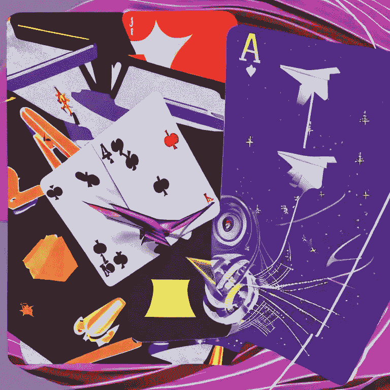
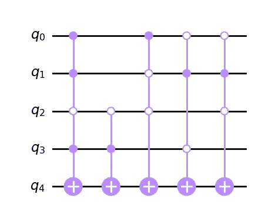
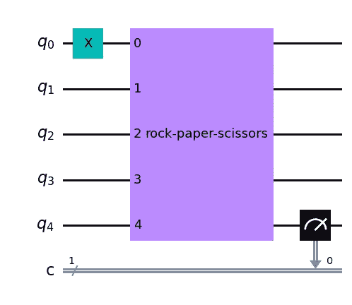
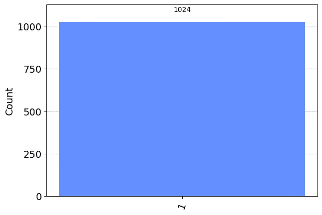
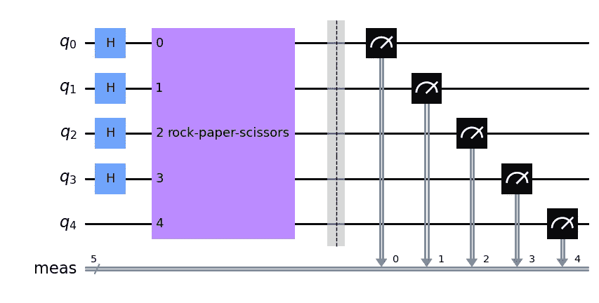
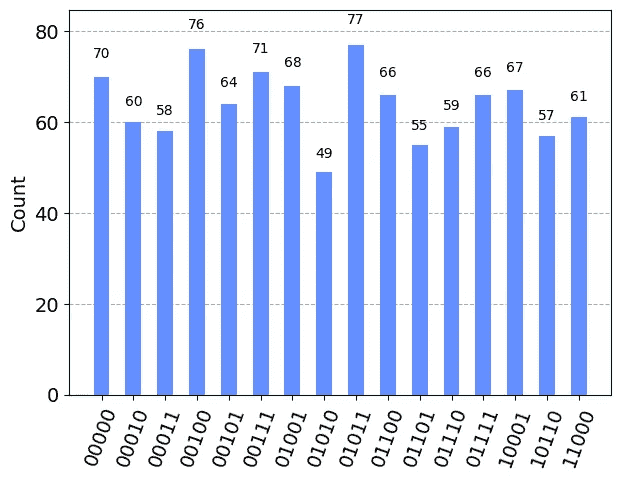
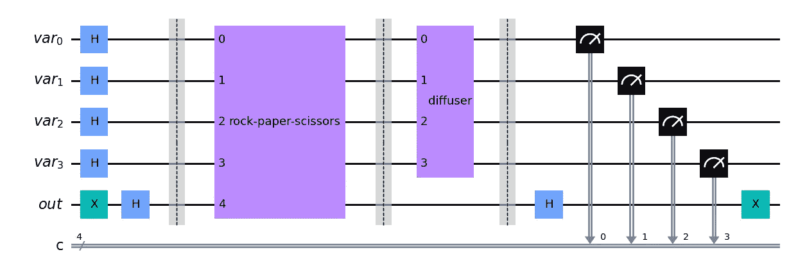
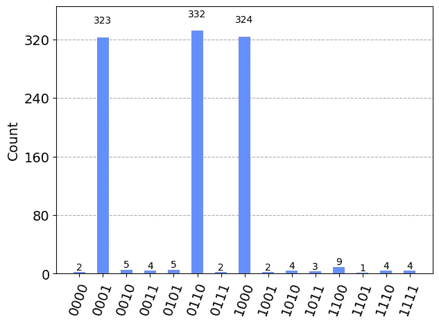
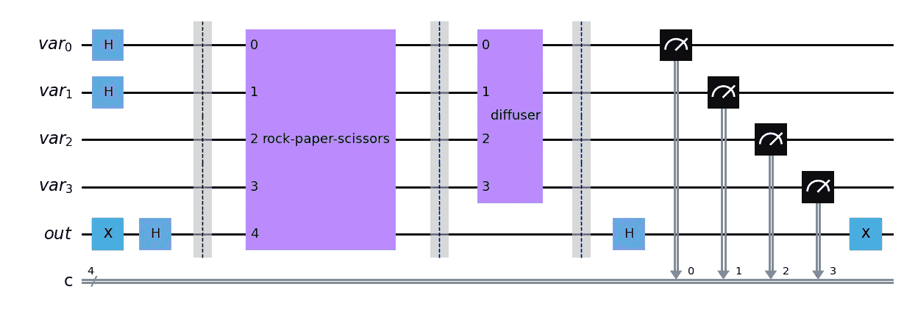
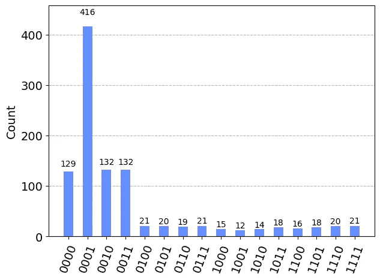

# 石头剪刀布：量子计算的妙趣

> 原文：[`towardsdatascience.com/rock-paper-scissors-a-quantum-computing-twist-bcf66b88d781`](https://towardsdatascience.com/rock-paper-scissors-a-quantum-computing-twist-bcf66b88d781)

## 教程

## 以先进计算的新方式来玩

[](https://medium.com/@KoryBecker?source=post_page-----bcf66b88d781--------------------------------)[](https://towardsdatascience.com/?source=post_page-----bcf66b88d781--------------------------------) [Kory Becker](https://medium.com/@KoryBecker?source=post_page-----bcf66b88d781--------------------------------)

·发表于[Towards Data Science](https://towardsdatascience.com/?source=post_page-----bcf66b88d781--------------------------------) ·14 分钟阅读·2023 年 5 月 16 日

--



来源：[Stable Diffusion](https://stablediffusionweb.com)。

# 享受量子计算游戏的乐趣

我喜欢展示量子计算的效果。特别是，通过使用量子叠加态和纠缠的游戏。

量子计算是一项极其激动人心的技术，它将影响几乎所有的行业和科学。了解量子计算的工作原理，特别是它如何不同于经典计算，能让你成为更好的程序员和更具逻辑思维能力的人！

所以，我认为设计一个可以在量子计算机上实现的游戏，进一步展示量子计算和传统计算之间的差异，会很有趣。

# 不乏令人惊叹的量子奇迹

与经典计算机相比，量子计算机具备许多令人惊讶（甚至令人困惑！）的强大特性。

通过[指数](https://medium.com/towards-data-science/ghostly-images-and-qubits-a-new-way-to-visualize-quantum-superposition-94b582889549)处理能力提高性能，评估多个场景同时，甚至生成高级随机数，这些都可以在量子层面实现。

我们将重点关注叠加态——这种技术允许量子计算机同时评估多种不同的场景。为了增加趣味性——我们将使用游戏！

# 量子游戏的创意

我四处搜寻，希望找到一个足够简单、易于玩耍，同时又能利用量子处理的游戏创意。

*如果这以前从未做过，那就更好了！*

这使我想到了一些经典游戏，比如[井字游戏](https://quantumfrontiers.com/2019/07/15/tiqtaqtoe)、[扑克](https://link.springer.com/article/10.1140/epjp/s13360-020-00360-5)以及[其他](https://arxiv.org/abs/2202.07756)游戏。

虽然许多将量子计算与游戏结合的研究论文通常关注各种算法方法和数学复杂性，但我希望创建一些更容易理解的东西。

编写量子计算程序并不一定很难。

一旦你了解了各种量子门和量子比特的行为，你就可以创建大量的量子应用程序。

还有什么比用石头、剪刀、布的游戏更好地展示这一点呢！

# 石头、剪刀、布

石头、剪刀、布是一个两人游戏。游戏中每个玩家秘密选择一个石头、剪刀或布的物品。玩家通常数到三，然后同时展示他们的选择。

游戏规则规定，石头击败剪刀，剪刀击败布，布击败石头。

足够简单！或者说是吗？

# 一个数学悖论

石头、剪刀、布的基本原则实际上是一种权重和价值的衡量。

我们可以认为石头的价值大于剪刀。同样，剪刀的价值大于布。到目前为止，一切都很好。

> 石头 > 剪刀 > 布

现在，如果石头大于剪刀，剪刀大于布，那么石头也一定大于布。然而，根据游戏规则，布的价值*大于*石头！

> 石头 > 剪刀 > 布 > 石头？

这确实是一个悖论！

# 让我们从数学角度思考一下这个问题。

让我们退一步来考虑一下使石头、剪刀、布游戏如此独特的悖论。

设想我们有三个变量：A、B 和 C（分别代表石头、布和剪刀）。每个变量被赋予一个权重，使得 A > B 和 B > C。[不等式的传递性](https://www.mathsisfun.com/algebra/inequality-properties.html)规定，根据这种排列，A > C。

这会使我们相信，如果石头 > 剪刀，剪刀 > 布，那么石头 > 布。显然，这不是游戏的实际玩法！

实际上，这就是哈代悖论的前提。

# 石头、剪刀、布的哈代悖论

[哈代悖论](https://en.wikipedia.org/wiki/Hardy%27s_paradox)，由[卢西安·哈代](https://en.wikipedia.org/wiki/Lucien_Hardy)于 1992 年提出，考察了三种变量表面上在每个变量的权重上都大于下一个的情况，仍然可以产生最后一个变量大于第一个变量的情况——违反了不等式的传递性。

实际上，这种类型的违反在量子世界中是[显然可能的](https://www.sciencedaily.com/releases/2023/04/230419095535.htm)，在量子世界中，粒子可能会纠缠在一起，事实上，它还可以在石头、剪子、布的游戏中找到！

我认为我们刚刚找到了一款完美的游戏，来展示量子计算背后的部分力量。

# 建立游戏规则

我们将创建一个量子计算程序，可以在石头、纸、剪刀的游戏中找到所有获胜手。

我们将创建经典版和量子版程序，以展示复杂性的差异。

我们需要做的第一件事是对游戏中的项进行编码，以便我们可以在算法中使用它们。由于每个玩家在每轮游戏中可以选择三项中的一个（石头、纸或剪刀），我们可以有九种不同的游戏手可能性。

让我们使用每个项的首字母来代表游戏中每个玩家的可能选择。因此，可能的手牌如下所示。

```py
[RR, RP, RS, PR, PS, PP, SR, SP, SS]
```

上面的列表显示了所有可能的手牌，从石头对石头（RR），石头对纸（RP），石头对剪刀（RS）等开始。

在上述九种可能的手牌中，只有三种是获胜选择：石头对剪刀（RS），剪刀对纸（SP），和纸对石头（PR）。

```py
[RS, SP, PR]
```

# 进入数字世界

现在我们已经定义了游戏选择，我们需要将这些选择从字母（R，S，P）转换为二进制数字零或一。这是必要的，以便我们最终可以将选择表示为量子比特。

由于我们有三项，我们将从零到二（00，01，10）表示它们。

```py
# The Items
00 = Rock
01 = Paper
10 = Scissors
```

重要的是要注意我们为每个项分配的二进制值，因为我们在查看程序的输入和输出时会参考这些值。

接下来，让我们从玩家一的角度定义游戏规则。

```py
# Rock
00 vs 00 = Tie
00 vs 01 = Loss
00 vs 10 = Win
```

```py
# Paper
01 vs 00 = Win
01 vs 01 = Tie
01 vs 10 = Loss
```

```py
# Scissors
10 vs 00 = Loss
10 vs 01 = Win
10 vs 10 = Tie
```

现在我们已经为每种可能的游戏手定义了简单的数字定义，让我们开始编写一些代码。

# 将游戏编码为比特

由于我们的游戏项被定义为二进制值，我们现在可以将这些值存储在量子比特中。让我们创建一个 Python 对象，将每个项的对应值定义为上面部分中列出的值。

```py
# Encode the choices as qubits.
choices = {
 ‘rock’: [0,0],
 ‘paper’: [0,1],
 ‘scissors’: [1,0]
}
```

现在，让我们看看能否找到所有可能的获胜动作。

# 创建获胜的逻辑表达式

我们已经为每种选择定义了一个表示（石头 00，纸 01，剪刀 10）。由于我们有两个玩家，每轮将有四个比特。

一轮游戏可能如下面所示。

*玩家 1 选择石头。

玩家 2 选择纸。

石头 = 00 和 纸 = 01*

> *输入将是 0001。*

为了确定这是玩家一的获胜动作，我们需要检查一些逻辑来决定游戏规则。

游戏规则规定石头击败剪刀，剪刀击败纸，纸击败石头。

我们可以使用布尔逻辑来编码这些规则。

```py
bool isWin = (rock and scissors) or (scissors and paper) or (paper and rock)
```

# 发现所有获胜手的慢速方法

让我们开始编写一个经典计算机程序来找出所有获胜手。

我们可以创建一个名为 *check_all_games()* 的方法，该方法遍历所有可能的项组合，并仅返回对玩家一有利的手牌。

```py
def check_all_games():
    # Generate a list of all possible game choices for player1 and player2.
    result = []
    count = 0

    games = list(itertools.product([0, 1], repeat=4))
    for game in games:
        # Example: (1, 0, 0, 1) => scissors vs paper
        player1 = list(game[0:2])
        player2 = list(game[2:4])

        # A quick check to make sure both player moves are valid.
        if player1 in list(choices.values()) and player2 in list(choices.values()):
            # ...
            is_win = isWin(player1, player2)
            if is_win:
                result += [game]

        count += 1

    return (result, count)
```

> ([(0, 0, 1, 0), (0, 1, 0, 0), (1, 0, 0, 1)], 16)

该方法返回包括石头对剪刀、纸对石头和剪刀对纸的获胜手牌列表。它还返回搜索所有组合所需的迭代次数。

(0, 0, 1, 0) = 石头 (0, 0) 对比 剪刀 (1, 0)

(0, 1, 0, 0) = 纸 (0, 1) 对比 石头 (0, 0)

(1, 0, 0, 1) = 剪刀 (1, 0) 对比 纸 (0, 1)

你注意到找到所有获胜游戏需要 **16** 次迭代吗？更不用说，这些迭代包括无效的比特组合，例如 [1, 1, 1, 1] — 这些甚至不对应有效的项！

# 量子计算能做得更好吗？

让我们再试一次。不过，这次我们将创建一个量子计算程序来找到所有获胜手牌。

以经典程序的相同方式，我们将定义一个 *isWin()* 函数，编码游戏规则。

一个编码了某些特定逻辑规则（例如我们游戏中的获胜规则）的黑箱量子电路称为 **oracle**。

由于我们的 oracle 将处理二进制值 0 和 1，而不是变量名称，让我们用这些值重写我们的逻辑表达式。

```py
bool isWin = (00 and 10) or (01 and 00) or (10 and 01)
```

此外，由于我们将使用量子计算库 [Qiskit](https://qiskit.org/)，我们需要将量子比特按相反的顺序表示。因此，我们将通过交换右边和左边位的位置来调整我们的逻辑。

```py
[(0, 0, 1, 0), (0, 1, 0, 0), (1, 0, 0, 1)]
[(q1 q0 q3 q2),(q1 q0 q3 q2),(q1 q0 q3 q2)]
```

第一行是我们经典程序返回的获胜手牌结果。我们只是用量子比特（标记为 q0、q1、q2、q3）表示每个位。量子比特按相反的顺序排列，使得前两个位是玩家一，最后两个位是玩家二。每个玩家的量子比特按最不重要的位在右，最重要的位在左排列（对应于 [q1, q0] 和 [q3, q2]）。我们对所有三种获胜手牌组合都重复这一过程。

# 创建一个 oracle

让我们为我们的量子计算解决方案创建 oracle。

就像我们在经典程序中做的那样，我们将使用布尔逻辑编码游戏规则。然而，这次的不同之处在于，我们引用 q0、q1、q2 和 q3 来表示石头、纸和剪刀。

例如，编码在我们 oracle 中的第一种获胜手牌是石头对剪刀。我们可以如下所示地编码这一点。

***石头对剪刀***

(0, 0, 1, 0)

(q1 q0 q3 q2)

***首次赢牌条件***

(not q0 and not q1 and not q2 and q3)

***反转量子比特顺序***

(not q1 and not q0 and q3 and not q2)

***转换为二进制***

(00 对比 10)

***转换为游戏轮次***

(石头对剪刀)

```py
# Define a classical logical circuit with 4 variables (qubits).
isWin = 'def isWin(q0: Int1, q1: Int1, q2: Int1, q3: Int1) -> Int1:\n  return (not q0 and not q1 and not q2 and q3) or (q0 and not q1 and not q2 and not q3) or (not q0 and q1 and q2 and not q3)'

# Convert the logic to a quantum circuit.
formula = ClassicalFunction(isWin)
fc = formula.synth()

# Convert the quantum circuit to a quantum program.
qc = QuantumCircuit(4+1)
qc.compose(fc, inplace=True)
```

所有获胜手牌都在 oracle 中用一行布尔逻辑进行编码。这创建了一个量子计算电路，可以在我们的程序中用于找到所有获胜手牌！



针对游戏石头、剪刀、布的所有获胜手牌的量子计算神谕。来源：作者。

将这些内容整合在一起，我们可以使用这个神谕创建一个量子计算程序。

```py
# Get the number of qubits needed.
n = len(choices['rock']) * 2

qc = QuantumCircuit(n + 1, 1)

# Paper vs Rock.
qc = encode('paper', 'rock', qc)

# Append the rock, paper, scissors oracle.
qc.append(oracle, range(5))

# Measure the result!
qc.measure(4, 0)
```

在这个例子中，我们玩的是纸对石头的单轮游戏。在得到的量子计算程序中，请注意第一个量子比特（q0）使用 X-门反转为一，而第二个量子比特（q1）保持为零。这对应于（01），表示纸。同样，第三个和第四个量子比特（q2 和 q3）保持为零（00），对应于石头。

这是一场纸对石头的游戏。



一个用于纸对石头的量子计算电路，其中玩家一选择纸（01），玩家二选择石头（00）。来源：作者。

我们的量子计算程序的结果返回了一个输出，指示这是否是一个获胜的手牌。由于量子比特的输出是反向的（*记住，我们是从右到左读取的！*），我在下面高亮了一个示例并附上了解释每个量子比特值的注释。

```py
1 00 01
^- win
  ^^----- rock
     ^^--------paper
```

# 运行量子计算程序

让我们运行程序并查看结果。由于纸总是战胜石头，我们期望我们的程序在量子程序的所有测量中都输出一个值为一的结果。

```py
simulator = Aer.get_backend('aer_simulator')
job = execute(qc, simulator)
result = job.result()
counts = result.get_counts()

key = max(counts, key=counts.get)

print(counts)
plot_histogram(counts)
```

> {‘1’: 1024}



玩家一的石头、剪刀、布获胜手牌。来源：作者。

确实，我们可以看到所有测量结果都是强值一。这表明纸对石头对玩家一是胜利的！

同样，我们可以将相同的神谕应用于纸对剪刀的游戏轮次。在这一轮中，我们预计结果为零，因为纸总是被剪刀战胜。

```py
# Rock vs Scissors.
qc = encode('paper', 'scissors', qc)
```

> {‘0’: 1024}

我们再次得到了正确的答案，表明这是玩家一的失利。


玩家一的输牌。来源：作者。

到目前为止，我们只是确定单轮游戏是否对玩家一有利。这并不令人印象深刻。毕竟，我们的经典程序找到了所有获胜手牌（*尽管计算需要 16 次迭代！*）。

我们能找到*所有*的获胜手牌吗？

# 量子处理的力量

结果是，我们已经创建了一个编码了游戏获胜手牌的量子神谕，我们实际上可以计算所有的获胜手牌。更棒的是，我们可以在一个 CPU 周期内完成这个计算！

我们将量子比特置于叠加态，而不是将其硬编码为特定的零或一，这些值对应于每个玩家选择的石头、纸或剪刀项。这将量子比特的值从 0 ***或*** 1 改变为 0 ***和*** 1 同时存在！

通过使用叠加态，我们可以在一次执行中评估 ***所有*** 可能的游戏手牌，并仅返回那些满足神谕布尔逻辑的获胜手牌。

这是一个如何实现的例子。

```py
qc = QuantumCircuit(n + 1)

qc.h(range(n))

# Append the sudoku oracle.
qc.append(oracle, range(n+1))

# Measure the result!
qc.measure_all()
qc.draw(output='mpl')
```

请注意，我们没有为玩家一和玩家二硬编码特定项目。相反，我们使用[Hadamard 门](https://www.quantum-inspire.com/kbase/hadamard/)将所有四个量子比特放入超位置，以便它们同时持有 0 和 1 的值。



通过将玩家一和玩家二的量子比特放入超位置来找到石头、剪刀、布的所有可能获胜组合。来源：作者。

这将产生如上所示的量子计算电路。如果我们运行这个程序，我们应该看到所有满足 oracle 布尔逻辑的获胜组合的指示。



使用没有放大的 oracle 执行量子电路。来源：作者。

在结果中，最重要的量子比特（最左侧或最下方）是 0（失败）或 1（获胜）。所以，我们关注的是图表最右侧的 3 个获胜结果。

然而，这似乎不太对劲！

实际上，所有可能的量子比特值组合似乎是完全随机的。

# Grover 搜索救援

结果表明，当在超位置的量子比特空间中与一个 oracle 进行搜索时，我们需要放大满足 oracle 的获胜结果，同时最小化不满足 oracle 的失败结果。

我们可以使用[Grover 搜索](https://en.wikipedia.org/wiki/Grover%27s_algorithm)量子算法来实现这一点。

Grover 的搜索算法利用扩散器和放大过程，使正确的结果“漂浮”得更高，而错误的结果保持较低。它可以用于在无序项目的数据库中搜索密钥，并且比任何经典算法的搜索速度[平方级](https://www.primaryobjects.com/2022/01/22/quantum-computing-hello-world/)更快。



使用 Grover 搜索算法找到石头、剪刀、布中所有可能的获胜动作。来源：作者。

在使用 Grover 搜索算法运行这个新电路后，加上我们相同的石头、剪刀、布的 oracle，我们可以看到输出的变化。



石头、剪刀和布中的获胜组合。从左到右：布 (01) 对 石头 (00)，剪刀 (10) 对 布 (01)，石头 (00) 对 剪刀 (10)。来源：作者。

检查上述结果，我们确实有三个结果远高于其余组合。实际上，这些结果直接对应于游戏中的获胜动作！

如果我们解码每一个结果，从图表最左侧开始，并反转 Qiskit 返回的比特，我们可以确定获胜的组合。*请记住，最上面的比特是最低有效比特，对应于玩家一。*

0001 = 布 (01) 对 石头 (00) = *获胜*

0110 = 剪刀 (10) 对 布 (01) = *获胜*

1000 = 石头 (00) 对 剪刀 (10) = *获胜*

```py
0001 => 01 versus 00 => paper versus rock => WIN
   ^-  q0
  ^--- q1
 ^---- q2
^----- q3
```

最令人惊讶的是，经典程序需要 **16** 次迭代才能找到这三种获胜组合。**量子计算程序只需要一次！**

# 还有一点乐趣

我们刚刚研究了量子计算程序如何通过在 CPU 上进行一次执行即可找到石头、剪刀、布游戏中的所有获胜招数。我们通过将量子位置于叠加态来实现这一点。

然而，通过调整量子位的叠加状态，我们实际上可以创造出程序的不同行为。

例如，假设我们想要找出在玩家二给定特定选择时，玩家一的最佳行动。我们可以通过将玩家一的量子位置于叠加态，而将玩家二的量子位固定为特定值来做到这一点。



在玩家二选择石头时，为玩家一找到一个获胜的动作。来源：作者。

如果我们现在运行量子程序，期望看到的结果是一个高测量值，这将对应于玩家一应选择的获胜手牌，以击败玩家二，而不是看到三个高测量值（对应于所有获胜手牌）。

在上述场景中，我们为玩家二分配了石头（00）的选择。让我们看看量子程序选择的行动是什么！



当玩家二选择石头（00）时，玩家一的制胜招数是纸（01）。来源：作者。

结果表明（0001）。从最低位到最高位读取，这评估为玩家一在玩家二选择石头（00）时选择纸（01）。实际上，这一举动确实是玩家一的制胜招数！

*纸胜石头！*

你可以在 [这里](https://gist.github.com/primaryobjects/f58e5528e3b183b6bfcb8d7a9dc34934) 下载完整的石头、剪刀、布程序代码示例。

# 轮到你了

现在我们已经完成了一个量子计算程序来找到石头、剪刀、布游戏中的所有获胜招数，让我们思考一下我们所取得的成就。

一个经典程序需要 16 次迭代才能找到所有获胜的手牌。相比之下，使用 Grover 搜索的量子版本只需 1 次迭代。这只是经典计算机和量子计算机工作方式之间的一个惊人差异。

Grover 搜索可以应用于许多不同的可搜索性问题，包括算法、文件系统和数据库，仅举几例。此外，由于量子计算领域仍然如此年轻，你有真正的机会产生影响。

我希望你对学习更多关于这项惊人技术的兴趣被激发。现在轮到你了！

# 关于作者

如果你喜欢这篇文章，请考虑在 [Medium](https://medium.com/@KoryBecker)、[Twitter](https://twitter.com/PrimaryObjects) 和我的 [网站](https://primaryobjects.com/) 上关注我，以便接收我未来的帖子和研究工作通知。
