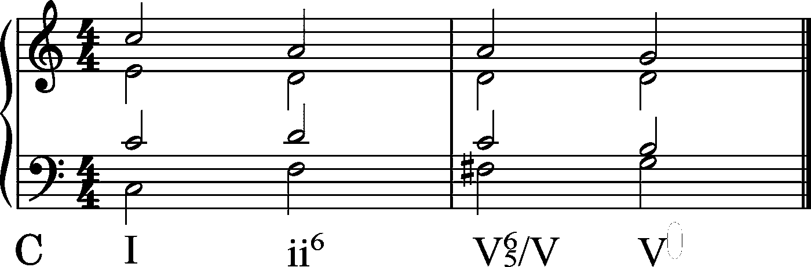
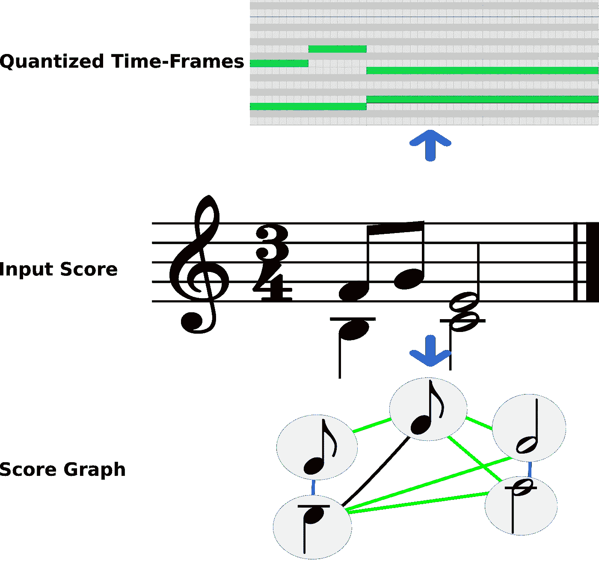
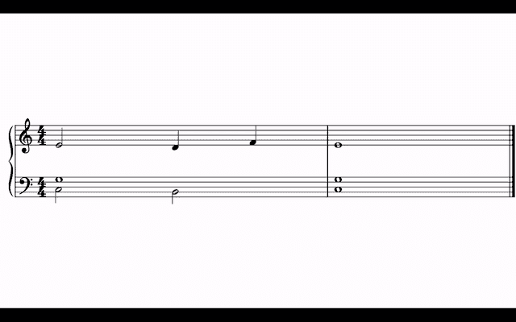
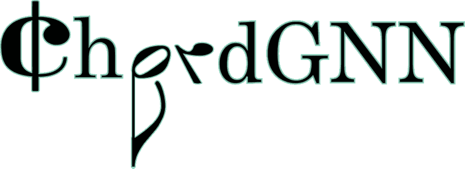
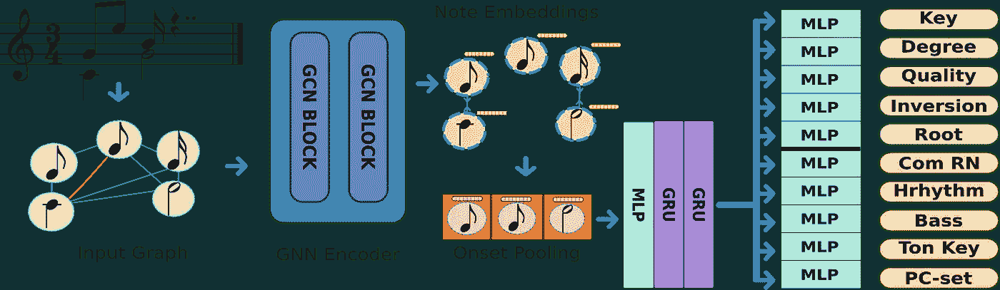
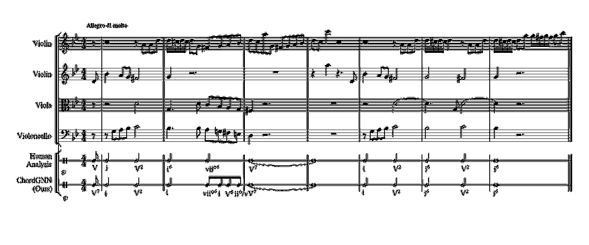
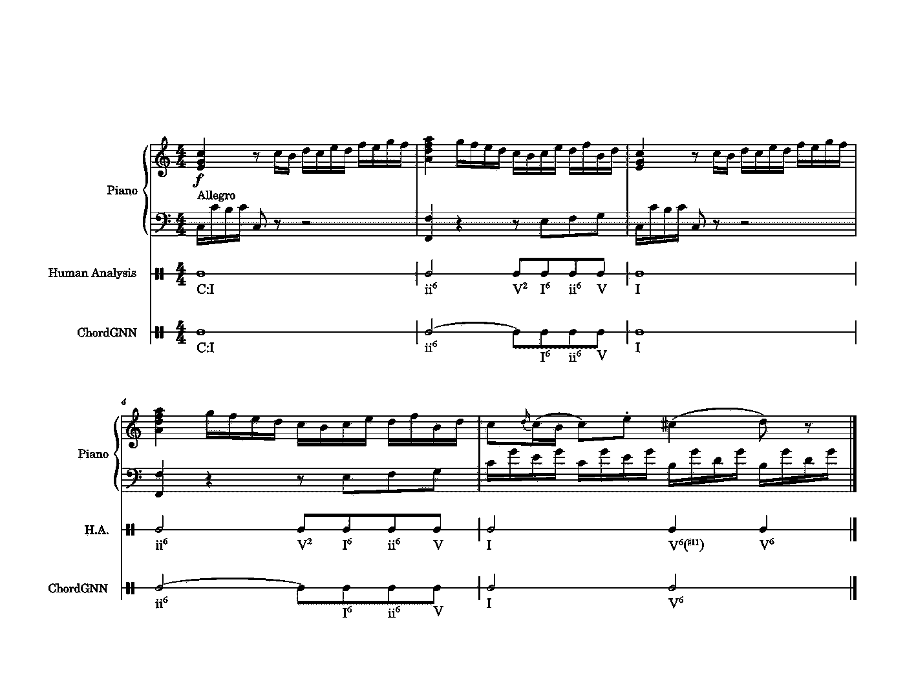

# 图形神经网络中的罗马数字分析

> 原文：[`towardsdatascience.com/roman-numeral-analysis-with-graph-neural-networks-4d6140cd4c0b?source=collection_archive---------9-----------------------#2023-10-24`](https://towardsdatascience.com/roman-numeral-analysis-with-graph-neural-networks-4d6140cd4c0b?source=collection_archive---------9-----------------------#2023-10-24)

## 入门指南

 [Emmanouil Karystinaios](https://manoskary.medium.com/?source=post_page-----4d6140cd4c0b--------------------------------)

·

[关注](https://medium.com/m/signin?actionUrl=https%3A%2F%2Fmedium.com%2F_%2Fsubscribe%2Fuser%2F9d63e988ed0c&operation=register&redirect=https%3A%2F%2Ftowardsdatascience.com%2Froman-numeral-analysis-with-graph-neural-networks-4d6140cd4c0b&user=Emmanouil+Karystinaios&userId=9d63e988ed0c&source=post_page-9d63e988ed0c----4d6140cd4c0b---------------------post_header-----------) 发表在 [Towards Data Science](https://towardsdatascience.com/?source=post_page-----4d6140cd4c0b--------------------------------) ·9 分钟阅读·2023 年 10 月 24 日

--

在这篇文章中，我想解释一下我在开发自动和声分析模型过程中的经历。对我个人而言，我对深入理解音乐感兴趣。像“为什么事情是这样结构的？”和“作曲家或艺术家在创作这部作品时在想什么？”这样的问题对我很重要。自然，我的起点是分析一部作品的内在和声。

在从温室里找回我旧的笔记本时，我偶然发现了我们用来注释和分析小型音乐片段的技术。这被称为罗马数字分析。这个概念可能有点复杂，如果你之前从未听说过它，但请耐心听我讲解。

我的目标是建立一个可以自动分析乐谱的系统。给定一个乐谱，系统将返回同样的乐谱，并在其中添加一个包含罗马数字和弦的附加五线谱。这主要适用于古典调性音乐，但并不限于此。

在本文的其余部分，我将介绍罗马数字、图神经网络的概念，并讨论我开发的模型及其结果。希望你喜欢！

## 罗马数字简介

罗马数字分析是一种用于理解和分析音乐中和弦及和声进行的方法，特别是在西方古典音乐和流行音乐中。和弦使用罗马数字而非传统音乐记谱法表示。

在罗马数字分析中，每个和弦根据其在给定调性中的位置和功能被分配一个罗马数字。罗马数字表示调性的音阶度数，大写数字表示大调和弦，小写数字表示小调和弦。

例如，在 C 大调中，C 大调和弦用罗马数字“I”表示（大写“I”表示大调和弦）。D 小调和弦用“ii”表示（小写“ii”表示小调和弦）。G 大调和弦用“V”表示（大写“V”表示大调和弦），因为它是 C 大调中的第五和弦。

在 C 大调中，四声部和声的两个小节的罗马数字分析示例。

罗马数字总是相对于一个调性。因此，如果调性是 C 大调，那么罗马数字“V”将是属和弦或 G 大调和弦。但和弦确实有不同的性质，例如小调或大调。在罗马数字中，大写字母表示大调性质，小写字母表示小调性质。

在音乐分析中，通常最低音是和弦特性的参考点。罗马数字也能传达这一信息。在上面的例子中，第二个和弦的低音（最低和弦音）是 F#，但和弦的根音是 D，因此和弦处于第一转位，用数字 6 表示。

罗马数字的另一个有趣的标记能力与借用和弦有关。这种效果称为副级，隐含地，每个罗马数字（主要）都有一个副级的主音（即 I 或 i），然而，当副级被标注时，我们可以知道哪个音阶度数暂时充当主音。上例中的第三个和弦，其主要度数为属七和弦，副级为 C 大调的属和弦。V*65* 表示在第二转位中的七和弦。

罗马数字分析帮助音乐家和音乐理论家理解音乐作品中的和弦结构和关系。它使他们能够识别常见和弦进行，分析和声模式，并比较不同的音乐作品。这是作曲家、编曲家和表演者理解潜在和声并根据这些知识做出音乐决策的有用工具。

## 自动罗马数字分析

现在我们有了关于罗马数字分析在实践中是如何进行的基础，我们可以讨论如何自动化它。在本文中，我们将介绍一种从符号音乐中预测罗马数字的方法，即数字乐谱（MusicXML、MIDI、Mei、Kern、MuseScore 等）。请注意，您可以从任何乐谱编辑软件中获取这些格式，如 Finale、Sibelius、MuseScore 或其他任何软件。通常，这些软件允许导出为 musicxml（未压缩）格式。不过，如果您没有这些编辑器，我建议使用 MuseScore。

现在我们将更深入地讨论这些表示方式。与音频表示方式不同，音乐可以在波形级别上视为数字序列，或在频域上视为二维频谱图，而符号表示法则具有包含起始时间、持续时间和音高拼写（音符名称）等信息的单独音符事件。符号表示法通常被视为伪音频表示，将乐谱分解为量化的时间框架，例如下图所示的钢琴卷轴。然而，最近一些研究提出了一种乐谱的图形表示方法，其中每个音符代表图中的一个顶点，边表示音符之间的关系。对于后一种方法，乐谱可以转换为这种图结构，这在涉及机器学习模型时特别有用。

分数摘录的不同表示方式显示在中间。顶部：量化时间框架表示，底部：图形表示。

因此，给定一个符号乐谱，图形是通过建模音符之间的三种关系来构建的。

+   音符同时开始，即相同的起始时间。

+   一个音符在另一个音符结束时开始，即连续音符。

+   一个音符在另一个音符发声时开始，即在连接期间。

乐谱的图形可以作为图神经网络的输入，图神经网络通过沿图的边传播信息来隐式学习。但在解释模型如何在乐谱上工作的之前，让我们首先简要解释图神经网络的工作原理。

# 图神经网络

那么，图神经网络到底是什么呢？本质上，GNN 是一种深度学习模型，旨在处理表示为图的数据。就像现实世界中的网络一样，图由相互连接的节点或顶点组成，每个节点都有其独特的特征。GNN 利用这种互联性来捕捉丰富的关系和依赖，从而执行分析和预测任务。

那么 GNN 是如何工作的呢？想象一个音乐乐谱，其中每个音符都是一个节点，音符之间的关系表示它们之间的连接。传统模型会将每个音符实例单独处理，忽略音乐背景。然而，GNN 通过同时考虑个体的特征（例如音高拼写、持续时间）和它们的关系（相同起始点、连续）来拥抱这种背景。通过聚合来自邻近节点的信息，GNN 使我们能够理解不仅是单个音符，还有整个网络中的动态和模式。

为了实现这一点，GNN 使用了一系列迭代的消息传递步骤。在每一步中，节点从其邻居那里收集信息，更新自身的表示，并将这些更新后的特征进一步传播通过网络。这一迭代过程使得 GNN 能够捕捉和完善来自附近节点的信息，逐步构建对整个图的全面理解。

迭代地进行的消息传递过程有时被称为图卷积。我们在音乐分析模型中使用的一个流行的图卷积块叫做 SageConv，来自著名的 GraphSAGE 论文。我们在这里不会详细讲解，但有许多资料涵盖了 GraphSAGE 的功能，例如 [这个。](https://snap.stanford.edu/graphsage/)

GNN 的美妙之处在于它们从图数据中提取有意义的表示的能力。通过从局部上下文中学习并结合全局信息，GNN 能够发现隐藏的模式，做出准确的预测，甚至生成新的见解。这使它们在从社交网络分析到药物发现，从交通预测到欺诈检测，再到音乐分析等广泛领域中都显得非常宝贵。

用于罗马数字分析的模型叫做 ChordGNN。

正如其名，*ChordGNN* 是一个基于图神经网络的自动罗马数字分析模型。该模型的一个特点是利用了逐音符的信息，但生成的是逐个起始点的预测，即为乐谱中的每个独特起始事件预测一个罗马数字。这意味着在同一个起始点的多个音符将共享相同的罗马数字，就像为乐谱做标注一样。然而，通过使用图卷积，来自每个音符的信息被传递到邻近的音符和起始点。

ChordGNN 模型架构示意图。

*ChordGNN* 基于图卷积递归神经网络架构，由堆叠的 GraphSAGE 卷积块组成，这些块在音符级别上操作。

图卷积操作后是一个 Onset-Pooling 层，它将音符表示收缩到起始级别，从而为乐谱中的每个唯一起始点生成一个向量嵌入。这是一个重要步骤，因为它将表示从图形移动到序列。

由 Onset-Pooling 获得的嵌入（这些嵌入按时间顺序排列）随后被输入到一个顺序模型中，例如 GRU 堆栈。最后，为每个描述罗马数字的属性添加简单的多层感知机分类器。因此，*ChordGNN* 也是一个多任务模型。

*ChordGNN* 并不会直接预测乐谱中每个位置的罗马数字，而是预测度数、局部调性、质量、反转和根音。通过分析每个任务的预测，将每个属性任务的预测组合成一个单一的罗马数字预测。让我们看看输出预测的样子。

# ChordGNN 预测示例

在这一部分，我们将查看一些 *ChordGNN* 的预测，甚至与人工分析进行比较。下面是海顿弦乐四重奏 op.20 №3 第 4 乐章的前几个小节的示例。

人工注释与 ChordGNN 在海顿弦乐四重奏中的对比

弦乐四重奏 op.20 №3 第 4 乐章

在这个示例中，我们可以看到几个方面。在第 2 小节中，人为注释标记了第一个反转中的主和弦；然而，当时的中提琴低于大提琴，因此和弦实际上处于根位置。*ChordGNN* 能够正确预测这一点。随后，*ChordGNN* 预测了八分音符的和声节奏，这与注释者的半音符标记不符。通过分析该段落的基本和声，我们可以为我们的 *ChordGNN* 的选择提供合理解释。

人工注释建议第 2 小节的整个后半部分表示一个 viio 和弦。然而，它不应处于第一个反转，因为大提琴演奏的 F# 是最低音（这是 viio 的根音）。然而，对该段落有两种相互冲突的解释。首先，第三拍的 viio 被视为围绕主和弦的经过和弦，导致下一小节的属和弦。或者，viio 可能已经是一个延续的属和声的一部分（在弱拍上有经过和弦），并导致 V7。*ChordGNN* 的解决方案兼顾了这两种解释，因为它不试图在更高层次上对和弦进行分组，而是将每个八分音符视为独立和弦，而非经过事件。

人工注释与 ChordGNN 在莫扎特钢琴奏鸣曲 K279 第 1 乐章中的对比。图片由作者提供

上面是另一个例子，将*ChordGNN*的预测与莫扎特钢琴奏鸣曲的原始分析进行比较。在这种情况下，*ChordGNN*的分析略显简单，选择省略了一些和弦。这在两个不同的场合发生，主要和弦七和弦在第 4 转位（V2）中。这对于*ChordGNN*来说是一个合理的假设，因为缺少了低音。另一个不一致之处发生在接近结尾的半终止。*ChordGNN*将旋律中的 C#视为过渡音，而注释者则选择指定#11 的扩展。

# 结论

在本文中，我们讨论了一种使用图神经网络自动化罗马数字分析的新方法。我们讨论了 ChordGNN 模型的工作原理，并展示了它的一些预测结果。

# 参考文献

E. Karystinaios, G. Widmer. 罗马数字分析与图神经网络：基于音符特征的起始预测。*国际音乐信息检索会议（ISMIR），2023 年会议录。*

# 资源

[## GitHub - manoskary/ChordGNN: 这是论文的代码库：罗马数字分析与图…](https://github.com/manoskary/ChordGNN?source=post_page-----4d6140cd4c0b--------------------------------)

### 这是论文的代码库：罗马数字分析与图神经网络 - GitHub - manoskary/ChordGNN…

[github.com](https://github.com/manoskary/ChordGNN?source=post_page-----4d6140cd4c0b--------------------------------)

*本文中的所有图像和图形均由作者创建。*
