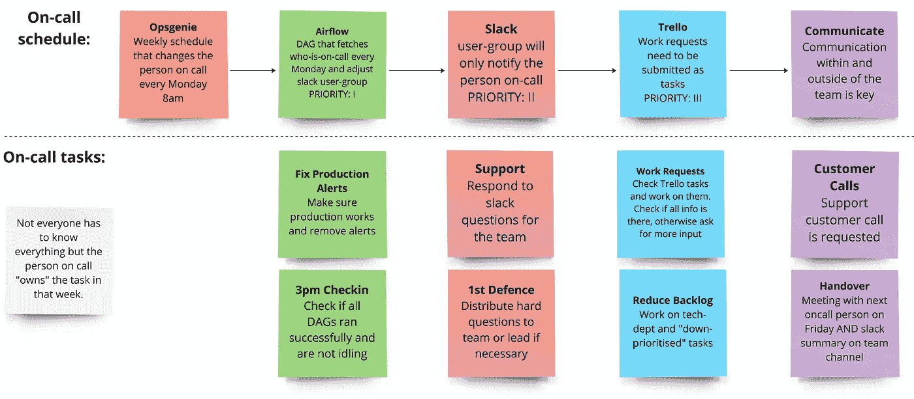

# 运营和支持的轮班值班：数据团队的必备

> 原文：[`towardsdatascience.com/rotating-on-call-for-operational-and-support-a-must-for-data-teams-74b9af592253?source=collection_archive---------14-----------------------#2023-06-20`](https://towardsdatascience.com/rotating-on-call-for-operational-and-support-a-must-for-data-teams-74b9af592253?source=collection_archive---------14-----------------------#2023-06-20)

## 轮班值班的安排可以使运营、支持和技术部门的团队成员集中精力进行优秀的开发工作

 [Benjamin Thürer](https://medium.com/@benjamin.thuerer?source=post_page-----74b9af592253--------------------------------)

·

[关注](https://medium.com/m/signin?actionUrl=https%3A%2F%2Fmedium.com%2F_%2Fsubscribe%2Fuser%2Fcd27eb9661fd&operation=register&redirect=https%3A%2F%2Ftowardsdatascience.com%2Frotating-on-call-for-operational-and-support-a-must-for-data-teams-74b9af592253&user=Benjamin+Th%C3%BCrer&userId=cd27eb9661fd&source=post_page-cd27eb9661fd----74b9af592253---------------------post_header-----------) 发表于 [Towards Data Science](https://towardsdatascience.com/?source=post_page-----74b9af592253--------------------------------) · 7 min read · 2023 年 6 月 20 日

--

对每个数据科学或产品团队来说，一个共同的挑战是将新（产品开发）与旧（操作、支持）任务对齐。当整个团队需要同时处理这两者时，这意味着团队既需要保持产品截止日期并推出新产品功能，同时还需要进行操作性工作，修复现有产品并支持商业问题和电话。这种情况会导致意外的上下文切换，并最终导致效率降低、截止日期延误和压力增大。

实际上，这常常导致某些团队成员承担额外的任务或专门从事这些任务。但这是危险的，因为一旦这些专门的团队成员休假，整个公司可能会感受到影响，并出现问题。

因此，一个高效且可扩展的数据团队需要支持操作性工作和新开发工作，并创建一个包括以下内容的系统：

+   团队成员之间良好的知识共享，关于如何进行操作性工作和支持……
