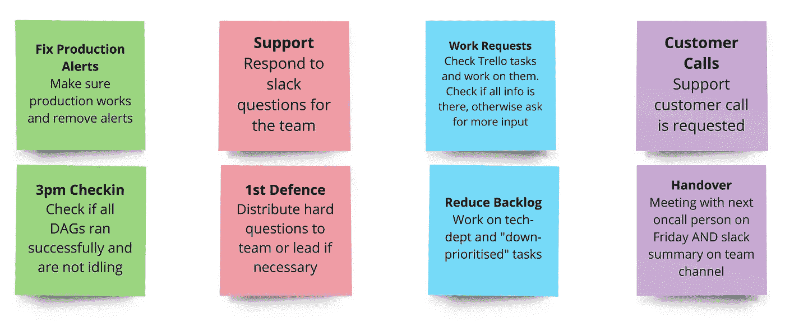
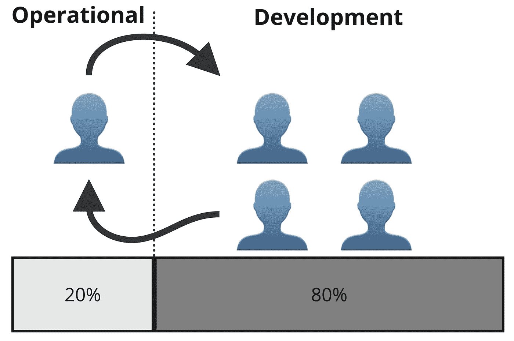

# 轮换值班以进行操作和支持：数据团队的必需品

> 原文：[`towardsdatascience.com/rotating-on-call-for-operational-and-support-a-must-for-data-teams-74b9af592253`](https://towardsdatascience.com/rotating-on-call-for-operational-and-support-a-must-for-data-teams-74b9af592253)

## 一个轮换的值班安排用于操作、支持和技术部门，使团队的其他成员能够专注于优秀的开发工作

[](https://medium.com/@benjamin.thuerer?source=post_page-----74b9af592253--------------------------------)[](https://towardsdatascience.com/?source=post_page-----74b9af592253--------------------------------) [本杰明·图雷尔](https://medium.com/@benjamin.thuerer?source=post_page-----74b9af592253--------------------------------)

·发表于 [数据科学前沿](https://towardsdatascience.com/?source=post_page-----74b9af592253--------------------------------) ·阅读时间 7 分钟·2023 年 6 月 20 日

--


每个数据科学或产品团队面临的一个共同挑战是将新的（产品开发）任务与旧的（操作、支持）任务对齐。当整个团队被要求同时处理两者时，这意味着一方面团队需要满足产品截止日期并推出新产品功能，同时另一方面，团队还需要处理操作工作、修复现有产品以及支持商业问题和电话。这种情况导致意外的上下文切换，并最终导致效率降低、截止日期失败和压力增加。

实际上，这通常会导致某些团队成员承担额外任务或专门负责这些任务。但这很危险，因为一旦这些专门的团队成员休假，公司可能会感到影响并面临问题。

因此，一个高效且可扩展的数据团队需要同时支持操作和新开发工作，并创建一个包括以下内容的系统：

+   团队成员之间良好的知识分享，了解如何进行操作工作和支持产品/客户

+   不间断的开发工作，减少上下文切换

+   明确且估计的维护工作，以避免意外截止日期

# 轮换值班系统

我们过去发现非常有效的一个系统是*轮换值班系统*，它处理的不仅仅是生产中的警报。简单来说，这是一个轮换系统，其中一个（或多个）团队成员在特定时间内被指定为值班人员，完全负责操作工作。

> 值班人员不仅仅是在做一份工作，他们是在保护整个团队免受开发工作之外的所有混乱

为了完成这一点，该系统允许**只有**值班人员（指定的幸存者）处理所有不属于“新开发”的工作。在这段时间里，值班人员不仅仅是在完成工作，而是保护整个团队免受开发工作之外的所有混乱，包括：

+   修复生产管道问题

+   回答商业/客户问题

+   支持客户电话

+   减少技术债务（积压）



概述值班例行工作中的具体任务。

如上图所示，处理“经典”值班系统并确保生产环境正常运行仍然是最重要的。然而，如果生产环境没有问题，这就可以腾出时间处理其他任务，如支持商业请求、客户电话或减少积压。

# **有什么好处？**

切换到该系统最初可能不容易。不是每个团队成员都能负责生产管道、商业支持和技术债务。但这不应该成为障碍。重要的是要妥善沟通，表明值班人员拥有这些项目，是第一道防线**但**可以随时寻求帮助。

从长远来看，这将为团队和整个组织带来很多好处。最直观的好处是更容易估算开发工作，团队将变得更加高效（减少上下文切换）。这同样适用于运营方面，其中参与值班系统的人数决定了可能的运营工作量。这使得与公司和利益相关者的沟通变得更加容易，因为一个有 5 个人的团队中有 1 个人在轮班，这意味着 1/5 的全职员工维护所有系统和现有产品相关的工作（20%运营，80%开发）。这很容易计算和估算。



使用轮班制的团队中 20%-80%的运营-开发分配示意图。

然而，随着时间的推移，几乎作为副作用出现了更多好处。所有团队成员将成为全栈数据科学家。原因是每个团队成员需要了解涉及的产品、客户、系统、模型/逻辑和代码基础设施的最低限度。他们不需要成为专家，但最终会变得足够好，能够独立处理这些工作至少 1 周。这也确保了当有价值的团队成员度假时没有问题，因为值班人员将始终支持团队。

此外，尽管值班时间有时可能会更具压力，但它给数据科学家提供了观察团队外部情况的机会，并与商业方面和客户进行合作。这可以是非常有价值和有回报的经历。

# 如何设置这样的系统？

这里会稍微有点技术性（对于喜欢代码的人，可以直接滚动到最底部）。设置这样的系统相当简单，但可能需要一些编码。最重要的是与团队和相关人员沟通，并告知他们如何进行。

由于系统的核心目的是**支持团队**，而不是增加更多的管理负担，我强烈推荐完全自动化它。为此，你需要至少部署 3 个系统：

+   一个与生产系统连接的呼叫系统，当生产失败时会发出警报（例如，[Opsgenie](https://www.atlassian.com/software/opsgenie) 或 [Pagerduty](https://www.pagerduty.com/)）。

+   一个可以检测谁在值班并将该信息传达给另一个系统的调度系统（例如，[Apache Airflow](https://airflow.apache.org/) 或 [Keboola](https://www.keboola.com/)）。

+   一个用于联系团队并创建票务的通信平台（例如，[Slack](https://slack.com/) 或 [Teams](https://www.microsoft.com/en-us/microsoft-teams/group-chat-software)）。

如果你已经部署了这些系统，并且拥有对呼叫系统和通信平台的 API 访问权限，那么你几乎完成了。剩下的唯一工作就是在调度系统中设置一个作业，该作业首先运行 API 调用，以从呼叫系统中获取当前值班人员的信息，然后再进行 API 推送，以在通信平台中进行通讯或覆盖渠道/组/标签。

以下是一个简单的 API 调用示例，它将提供 Opsgenie 中的值班人员：

```py
curl -X GET \
'https://api.opsgenie.com/v2/schedules/{schedule_name}/on-calls?scheduleIdentifierType=name&flat=true' \
--header 'Authorization: GenieKey {token}'
```

之后，你需要运行一个在通信系统中执行某些操作的命令。例如，在 Slack 中，覆盖一个用户组，以便只包含值班的用户：

```py
curl -X POST \
-F usergroup={usergroup} \
-F users={user} \
'https://slack.com/api/usergroups.users.update' \
-H 'Authorization: Bearer {token}'
```

在这个故事的结尾，你会发现一个完整的代码版本，展示如何自动调度这些代码。这将确保每当有人在 Slack 上标记你的组（例如 `@ team`）时，只有值班人员会被标记，并可以决定是否需要通知更多团队成员。它还允许你快速向 DAG 添加新任务。例如，当你想通知公司或团队谁现在正在值班时，或调整你的票务系统时。

# 总结

为团队的运营、商业和技术部门工作设置轮换计划，可以提高你的数据团队的效率。这将减少上下文切换，并允许更好的时间估算。此外，它还将培养能够处理各种问题的全栈数据科学家，以保护其余的团队。

*所有图片，除非另有说明，均由作者提供。*

*代码附录：*

*这是一个 Airflow dag 的示例，它从 Opsgenie 中获取当前值班人员，并覆盖 Slack 中的用户组，使其仅包含该人员。代码确实不完美（数据科学家在工作中），但我相信你明白了：*

```py
# Import
from airflow import DAG, XComArg
from typing import Dict, List
from airflow.operators.bash import BashOperator
from airflow.operators.python import PythonOperator
from airflow.models import Variable
import json

# Fetch secret tokens
slack_token = Variable.get("slack_token")
opsgenie_token = Variable.get("opsgenie_token")

# Setup DAG
dag = DAG(
    dag_id,
    schedule_interval=schedule_interval,
    default_args=default_args,
    catchup=catchup,
    max_active_runs=max_active_runs,
)
with dag:

    # Run BashOperator fetching from Opsgenie who is on call
    def fetch_who_is_on_call(**kwargs):
        fetch_who_is_on_call_bash = BashOperator(
            task_id="fetch_who_is_on_call_bash",
            bash_command="""
            curl -X GET \
            'https://api.opsgenie.com/v2/schedules/{schedule_name}/on-calls?scheduleIdentifierType=name&flat=true' \
             --header 'Authorization: GenieKey {token}'
            """.format(
                schedule_name="schedule_name", 
                token=opsgenie_token
             ),
            dag=dag,
        )
        return_value = fetch_who_is_on_call_bash.execute(context=kwargs)
        fetch_who_is_on_call_bash
        return return_value

    # run BashOperator in PythonOperator and provide context
    opsgenie_pull = PythonOperator(
        task_id="opsgenie_pull",
        python_callable=fetch_who_is_on_call,
        provide_context=True,
        dag=dag,
    )

    # Overwrite slack group with the person on call
    def overwrite_slack_group(**kwargs):

        # First: get who is on call from PythonOperator
        ti = kwargs.get("ti")
        xcom_return = json.loads(ti.xcom_pull(task_ids="opsgenie_pull"))
        user_email = xcom_return["data"]["onCallRecipients"][0]

        user_dict = {
            "data_scientist_a": "A03BU00KGK4",
            "data_scientist_b": "B03BU00KGK4",
        }
        user_id = [
            user_dict[k] for k in user_dict.keys() if k == user_email.split(".")[0]
        ]

        # Second: Run BashOperator to overwrite slack group
        overwrite_slack_group_bash = BashOperator(
            task_id="overwrite_slack_group_bash",
            bash_command="""
            curl -X POST \
            -F usergroup={usergroup} \
            -F users={user} \
            https://slack.com/api/usergroups.users.update \
            -H 'Authorization: Bearer {token}'
            """.format(
                usergroup="usergroup_id",
                user=user_id,
                token=slack_token,
            ),
            dag=dag,
        )
        overwrite_slack_group_bash.execute(context=kwargs)
        overwrite_slack_group_bash

    # Run BashOperator for slack overwrite in PythonOperator
    overwrite_slack = PythonOperator(
        task_id="overwrite_slack",
        python_callable=overwrite_slack_group,
        provide_context=True,
        dag=dag,
    )

    opsgenie_pull >> overwrite_slack
    return dag
```
