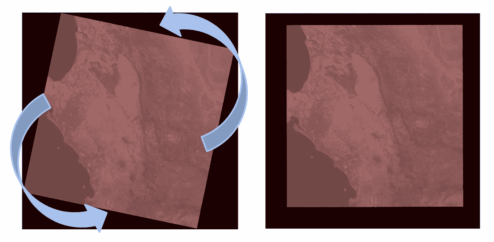
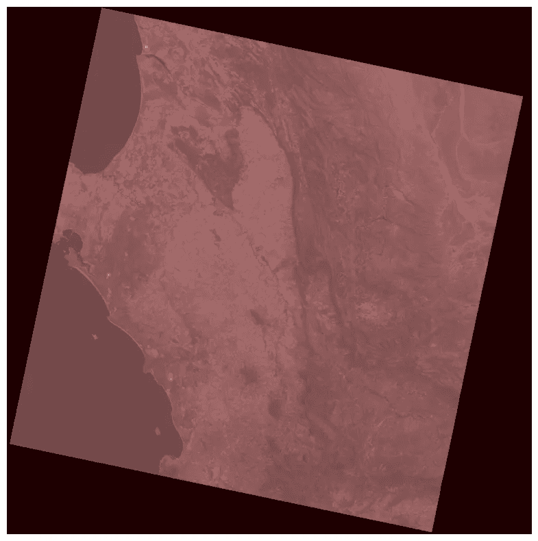
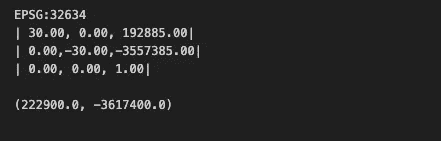
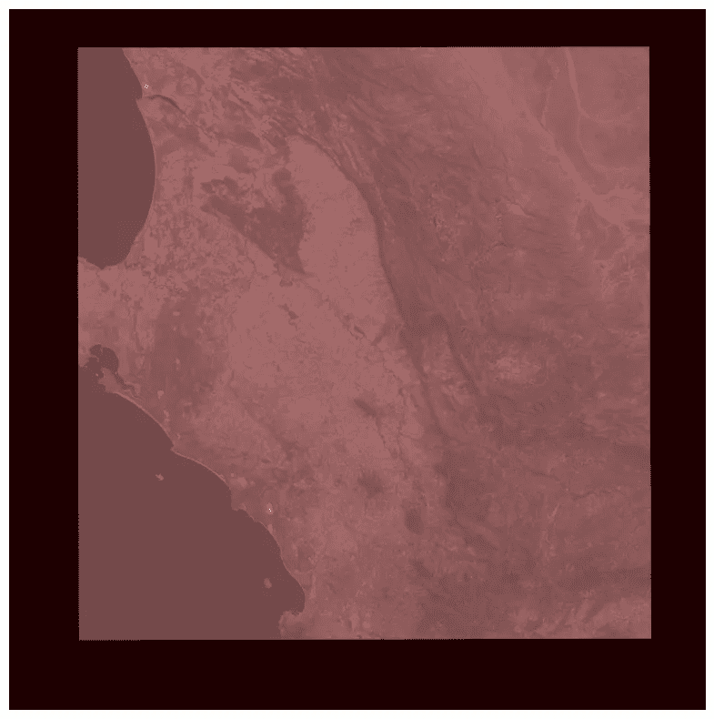
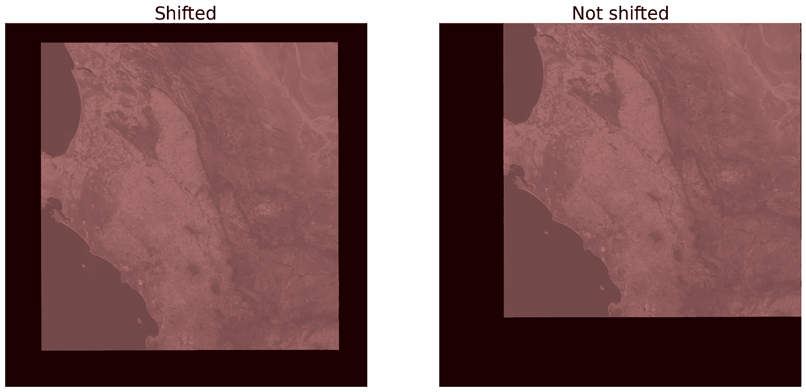
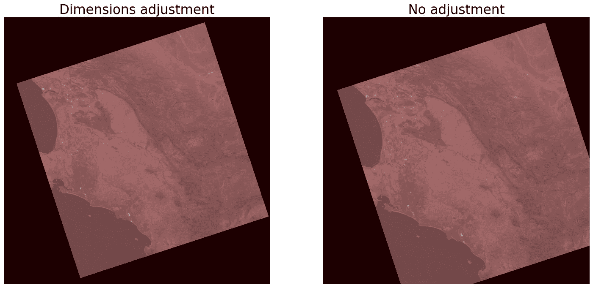

# 使用 Rasterio 旋转栅格

> 原文：[`towardsdatascience.com/rotating-rasters-with-rasterio-dc36e42b01dd`](https://towardsdatascience.com/rotating-rasters-with-rasterio-dc36e42b01dd)

## 使用 Python 旋转卫星图像，同时保持地理位置准确性

[](https://conorosullyds.medium.com/?source=post_page-----dc36e42b01dd--------------------------------)[](https://towardsdatascience.com/?source=post_page-----dc36e42b01dd--------------------------------) [Conor O'Sullivan](https://conorosullyds.medium.com/?source=post_page-----dc36e42b01dd--------------------------------)

·发布于[Towards Data Science](https://towardsdatascience.com/?source=post_page-----dc36e42b01dd--------------------------------) ·6 分钟阅读·2023 年 8 月 7 日

--



（来源：作者）

栅格数据类似于普通图像数据。不同之处在于每个像素都与地球表面上的位置相关联。这使得问题复杂化。如果我们想要旋转数据，还必须考虑基础的坐标参考系统（CRS）。在不调整地理位置的情况下扭曲栅格会导致空间分析不准确。

调整地理位置并不简单。幸运的是，[Rasterio](https://rasterio.readthedocs.io/en/stable/)可以提供帮助。这是一个流行的用于地理空间数据分析的 Python 库。我们将使用该包来：

+   **旋转**栅格

+   并**重新投影**图像到正确的坐标参考系统（CRS）。

在此过程中，我们将讨论 Python 代码，你可以在[GitHub](https://github.com/conorosully/medium-articles/blob/master/src/remote%20sensing/rotating_rasters.ipynb)上找到完整的项目。

本文假设读者具有基本的栅格数据知识和处理其 CRS 的经验。如果你想复习，可以查看下面的文章。它详细介绍了栅格数据的重新投影。

[](/how-to-plot-coordinates-on-landsat-satellite-images-with-python-5671613887aa?source=post_page-----dc36e42b01dd--------------------------------) ## 如何在 Landsat 卫星图像上绘制坐标

### 使用 Landsat 元数据和 Rasterio 将像素位置映射到地理坐标

towardsdatascience.com

# 下载 Landsat 场景

对于我们的栅格数据，我们将处理卫星图像。具体来说，是 Landsat 场景。你可以通过[EarthExplorer](https://earthexplorer.usgs.gov/)门户下载其中之一。或者，如果你想使用 Python，下面的文章将带你完成这个过程：

[](/downloading-landsat-satellite-images-with-python-a2d2b5183fb7?source=post_page-----dc36e42b01dd--------------------------------) ## 使用 Python 下载 Landsat 卫星图像

### 使用 landsatxplore Python 包简化 Landsat 场景下载

[towardsdatascience.com

最终，你应该会有一个包含所有文件的文件夹，这些文件是[Landsat 2 级科学产品](https://www.usgs.gov/landsat-missions/landsat-collection-2-level-2-science-products)。我们将使用红色可见光波段。对于 Landsat 8 或 9 场景，这由波段 B4 表示。

# 打开栅格文件

我们使用下面的代码来打开和显示这个波段。ID 给出了这个特定场景的 Landsat 场景 ID（第 8 行）。所有可用的波段都将存放在一个以此 ID 命名的文件夹中。我们使用 rasterio 打开红色波段（第 11 行），并使用 matplotlib 显示它（第 14-15 行）。如**图 1**所示，Landsat 场景通常在其边界框内被旋转。

```py
import matplotlib.pyplot as plt
import rasterio as rio

# Path to our raster file
data_file = "./data/"

# ID of the raster we want to open
ID = "LC08_L2SP_175083_20131218_20200912_02_T1"

# Open the red band (B4):
B4 = rio.open(data_file + '{}/{}_SR_B4.TIF'.format(ID, ID))

# Display the band
fig, ax = plt.subplots(figsize=(10, 10))
ax.imshow(B4.read(1), cmap='pink')
```



图 1：红色可见光波段的可视化（来源：作者）

# 旋转栅格

旋转栅格的关键在于其变换函数。Rasterio 使用仿射变换将数组位置转换为地理位置。对于我们的 Landsat 场景，地理位置是以 UTM 坐标给出的。如果我们旋转栅格中的像素，我们还必须调整此变换。

我们的卫星图像的仿射变换矩阵如下所示（第 2 行）。xy()函数使用此矩阵将数组位置转换为 UTM 坐标。图 2 中的输出显示了数组位置（1000,2000）与地球表面上的地理位置（222900,-3617400）相关联。

```py
print(B4.crs) # Gives coordinate reference system
print(B4.transform) # Affine transformation matrix

# convert array positions to UTM coordinates
x,y = (1000,2000)
utmx,utmy = B4.xy(y,x)
print("\n"+ str((utmx,utmy))) 
```



图 2：上述代码片段的输出（来源：作者）

我们在**rotate_raster**函数中调整矩阵。最重要的参数是**旋转角度**。我们首先通过创建一个旋转仿射矩阵（第 22 行）来使用此参数。然后将其与原始变换矩阵相乘（第 27 行）。现在，当点转换为 UTM 时，它们也将被旋转，反之亦然。新的栅格随后使用此 CRS 进行重投影（第 52-58 行）。我们将在接下来的部分中讨论其他参数。

```py
from rasterio.warp import reproject, Resampling
from affine import Affine
import numpy as np

def rotate_raster(in_file,out_file, angle, shift_x=0, shift_y=0,adj_width=0, adj_height=0):
    """Rotate a raster image and save it to disk.
            in_file: path to input raster file
            out_file: path to output raster file
            angle: angle of rotation in degrees
            shift_x: shift in x direction
            shift_y: shift in y direction
            adj_width: adjust width of output raster
            adj_height: adjust height of output raster"""

    with rio.open(in_file) as src:

        # Get the old transform and crs
        src_transform = src.transform 
        crs = src.crs

        # Affine transformations for rotation and translation
        rotate = Affine.rotation(angle)
        trans_x = Affine.translation(shift_x,0)
        trans_y = Affine.translation(0, -shift_y)

        # Combine affine transformations
        dst_transform = src_transform * rotate * trans_x * trans_y

        # Get band data
        band = np.array(src.read(1))

        # Get the new shape
        y,x = band.shape
        dst_height = y + adj_height
        dst_width = x + adj_width

        # set properties for output
        dst_kwargs = src.meta.copy()
        dst_kwargs.update(
            {
                "transform": dst_transform,
                "height": dst_height,
                "width": dst_width,
                "nodata": 0,  
            }
        )

        # write to disk
        with rio.open(out_file, "w", **dst_kwargs) as dst:
            # reproject to new CRS

            reproject(source=band,
                        destination=rio.band(dst, 1),
                        src_transform=src_transform,
                        src_crs=crs,
                        dst_transform=dst_transform,
                        dst_crs=crs,
                        resampling=Resampling.nearest)
```

现在，让我们看看该函数的工作原理。我们的输入文件与图 1 中显示的红色波段相同（第 1 行）。我们在此位置定义一个新的文件路径（第 2 行）。我们将这些输入到我们的**rotate_raster**函数中，并设置 12 度的旋转角度（第 4 行）。你可以在图 3 中看到结果栅格。它不再在其边界框内旋转。重要的是，你仍然可以在新的栅格上绘制坐标。

```py
file = data_file + '{}/{}_SR_B4.TIF'.format(ID, ID)
out_file = data_file + '{}/{}_SR_B4_rotated.TIF'.format(ID, ID)

rotate_raster(file,out_file, 12, shift_x=600, shift_y=700)
```



图 3：旋转后的 Landsat 图像（来源：作者）

# 移动栅格

你可能已经注意到上面的代码中有**shift_x**和**shift_y**参数。这些参数在其边界框内沿 x 和 y 方向移动栅格。我们需要这些参数，因为栅格是围绕其左上角旋转的。同时，使用了原始的高度和宽度。结果是卫星图像的一部分被旋转到其边界框之外。你可以在**图 4**中看到我们所指的内容。

```py
out_file = data_file + '{}/{}_SR_B4_noshift.TIF'.format(ID, ID)

rotate_raster(file,out_file, 12)
```



图 4：移动前后栅格的对比（来源：作者）

# 调整尺寸

在某些情况下，我们可能还需要调整栅格的高度和宽度。如果我们以不适合原始尺寸的方式旋转它，就会发生这种情况。你可以在图 5 中看到这一点，其中栅格已旋转了 30 度。除非我们将宽度和高度增加 800 像素，否则它将无法适应其边界框。

```py
#With dimensions adjustment
out_file_1 = data_file + '{}/{}_SR_B4_adjust.TIF'.format(ID, ID)
rotate_raster(file,out_file_1, 30,800,2800,adj_width=800, adj_height=800)

#Without dimensions adjustment
out_file_2 = data_file + '{}/{}_SR_B4_noadjust.TIF'.format(ID, ID)
rotate_raster(file,out_file_2, 30,800,2800)
```



图 5：调整前后栅格的对比（来源：作者）

在 rotate_raster 函数中，我们通过更新其元数据（**dst_kwargs**）来改变栅格的尺寸。除了宽度和高度，你会看到我们还更改了变换函数（**dst_transform**）。这将是原始变换乘以**旋转**、**trans_x**和**trans_y**仿射矩阵。最终的变化是**nodata**元素。将其设置为 0 确保任何新的边界框像素将是黑色的。

可以调整旋转、偏移和尺寸调整参数，以便去掉整个边界框。然而，请记住，任何变换都会“扭曲”像素。像素值使用最近邻方法进行重采样（即**Resampling.nearest**）。除非用于可视化，否则最好使用原始栅格进行空间分析。

希望你喜欢这篇文章！你可以在 [Mastodon](https://sigmoid.social/@conorosully) | [Twitter](https://twitter.com/conorosullyDS) | [YouTube](https://www.youtube.com/channel/UChsoWqJbEjBwrn00Zvghi4w) | [Newsletter](https://mailchi.mp/aa82a5ce1dc0/signup) 上找到我——免费注册以获取 [Python SHAP 课程](https://adataodyssey.com/courses/shap-with-python/)。

[## 加入 Medium 使用我的推荐链接 — Conor O’Sullivan](https://conorosullyds.medium.com/membership?source=post_page-----dc36e42b01dd--------------------------------)

### 作为 Medium 会员，你的一部分会员费用会分配给你阅读的作者，你还可以全面访问所有故事……

[conorosullyds.medium.com](https://conorosullyds.medium.com/membership?source=post_page-----dc36e42b01dd--------------------------------)

## 参考文献

Rasterio 文档 **Reprojection** [`rasterio.readthedocs.io/en/stable/topics/reproject.html`](https://rasterio.readthedocs.io/en/stable/topics/reproject.html)
