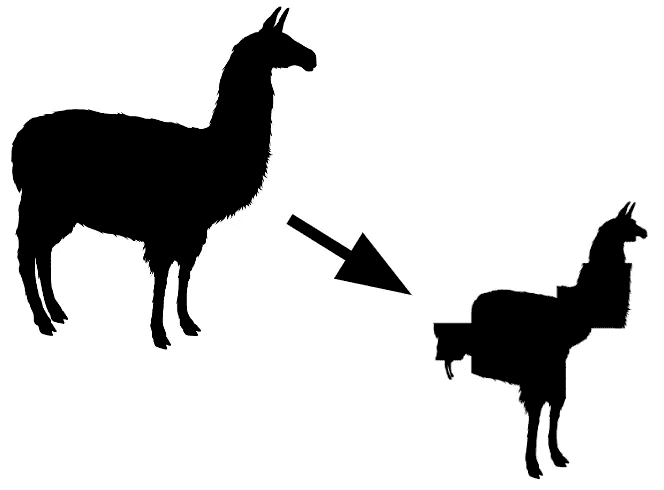

# 在你的 GPU 上运行 Llama 2 70B 使用 ExLlamaV2

> 原文：[`towardsdatascience.com/run-llama-2-70b-on-your-gpu-with-exllamav2-588141a88598?source=collection_archive---------0-----------------------#2023-09-29`](https://towardsdatascience.com/run-llama-2-70b-on-your-gpu-with-exllamav2-588141a88598?source=collection_archive---------0-----------------------#2023-09-29)

## 找到适合你硬件的最佳混合精度量化方法

[](https://medium.com/@bnjmn_marie?source=post_page-----588141a88598--------------------------------)[](https://towardsdatascience.com/?source=post_page-----588141a88598--------------------------------) [Benjamin Marie](https://medium.com/@bnjmn_marie?source=post_page-----588141a88598--------------------------------)

·

[关注](https://medium.com/m/signin?actionUrl=https%3A%2F%2Fmedium.com%2F_%2Fsubscribe%2Fuser%2Fad2a414578b3&operation=register&redirect=https%3A%2F%2Ftowardsdatascience.com%2Frun-llama-2-70b-on-your-gpu-with-exllamav2-588141a88598&user=Benjamin+Marie&userId=ad2a414578b3&source=post_page-ad2a414578b3----588141a88598---------------------post_header-----------) 发表在 [Towards Data Science](https://towardsdatascience.com/?source=post_page-----588141a88598--------------------------------) ·7 min read·2023 年 9 月 29 日 [](https://medium.com/m/signin?actionUrl=https%3A%2F%2Fmedium.com%2F_%2Fvote%2Ftowards-data-science%2F588141a88598&operation=register&redirect=https%3A%2F%2Ftowardsdatascience.com%2Frun-llama-2-70b-on-your-gpu-with-exllamav2-588141a88598&user=Benjamin+Marie&userId=ad2a414578b3&source=-----588141a88598---------------------clap_footer-----------)

--

[](https://medium.com/m/signin?actionUrl=https%3A%2F%2Fmedium.com%2F_%2Fbookmark%2Fp%2F588141a88598&operation=register&redirect=https%3A%2F%2Ftowardsdatascience.com%2Frun-llama-2-70b-on-your-gpu-with-exllamav2-588141a88598&source=-----588141a88598---------------------bookmark_footer-----------)

图片由作者提供 — 制作自 [Pixabay](https://pixabay.com/vectors/llama-alpaca-animal-mammal-zoo-297668/)

Llama 2 系列中最大且最优秀的模型拥有 700 亿个参数。一个 fp16 参数占用 2 字节。加载 Llama 2 70B 需要 140 GB 的内存（70 亿 * 2 字节）。

在之前的一篇文章中，我展示了如何通过量化技术在 100 GB 的 CPU RAM 上运行一个 1800 亿参数的模型 Falcon 180B。

[](https://newsletter.kaitchup.com/p/falcon-180b-can-it-run-on-your-computer?source=post_page-----588141a88598--------------------------------) [## Falcon 180B: 能在你的电脑上运行吗？

### 是的，如果你有足够的 CPU RAM

[newsletter.kaitchup.com](https://newsletter.kaitchup.com/p/falcon-180b-can-it-run-on-your-computer?source=post_page-----588141a88598--------------------------------)

Llama 2 70B 比 Falcon 180B 小得多。

*它能完全适配到单个消费级 GPU 中吗？*

这具有挑战性。一款高端消费级 GPU，如 NVIDIA RTX 3090 或 4090，具有 24 GB 的 VRAM。如果我们将 Llama 2 70B 量化到 4 位精度，我们仍然需要 35 GB 的内存（70 亿 * 0.5 字节）。该模型可以适配到 2 个消费级 GPU 中。

通过 GPTQ 量化，我们可以进一步将精度降低到 3 位，而不会在模型性能上损失太多。一个 3 位参数在内存中占用 0.375 字节。Llama 2 70B 量化到 3 位仍将占用 26.25 GB。这无法适配到一个消费级 GPU 中。

[](https://newsletter.kaitchup.com/p/the-best-quantization-methods-to?source=post_page-----588141a88598--------------------------------) [## 运行 Llama 3.1 的最佳量化方法

### 基准测试 AQLM、bitsandbytes、AWQ、GPTQ 和 AutoRound 的推理吞吐量、准确性和内存消耗

[newsletter.kaitchup.com](https://newsletter.kaitchup.com/p/the-best-quantization-methods-to?source=post_page-----588141a88598--------------------------------)

我们可以将精度降低到 2 位。这将适配 24 GB 的 VRAM，但根据[之前对 2 位量化的研究](https://arxiv.org/abs/2210.17323)，模型的性能也会显著下降。

为了避免在模型性能上损失过多，我们可以将模型的重要层或部分量化为更高的精度，将不太重要的部分量化为更低的精度。模型将以混合精度进行量化。

[ExLlamaV2](https://github.com/turboderp/exllamav2)（MIT 许可证）实现了混合精度量化。

在这篇文章中，我展示了如何使用 ExLlamaV2 进行混合精度量化模型。更具体地，我们将看到如何将 Llama 2 70B 量化到**低于 3 位的平均精度**。

我实现了一个演示并基准测试 Llama 2 混合精度量化的笔记本。可以在这里获取：

[获取笔记本（#18）](https://newsletter.kaitchup.com/p/notebooks)

# Llama 2 的混合精度量化

## 要求

要进行混合精度量化并运行模型，我们需要安装 ExLlamaV2。

从源代码安装：

```py
git clone https://github.com/turboderp/exllamav2
cd exllamav2
pip install -r requirements.txt
```

我们的目标是让模型在消费级 GPU 上运行。

+   Llama 2 70B：我们目标是 24 GB 的 VRAM。NVIDIA RTX3090/4090 GPU 将适用。如果你使用 Google Colab，则不能在免费的 Google Colab 上运行。只有 Google Colab PRO 的 A100 具有足够的 VRAM。

+   Llama 2 13B：我们目标是 12 GB 的 VRAM。许多至少有 12 GB VRAM 的 GPU 可用，如 RTX3060/3080/4060/4080 等。它可以在免费的 Google Colab 上使用 T4 GPU 运行。

## 如何使用 ExLlamaV2 进行混合精度量化

ExLlamaV2 使用的量化算法类似于 GPTQ。但不同于选择一种精度类型，ExLlamaV2 尝试了每一层的不同精度类型，同时测量量化误差。所有尝试和相关的误差率都被保存。然后，给定用户提供的目标精度，ExLlamaV2 算法会为每层模块选择能**平均**达到目标精度的量化精度，且误差率最低。

在量化过程中，ExLlamaV2 输出所有尝试：

*Llama 2 13B 第 10 层 up_proj 模块的量化尝试*

```py
-- Linear: model.layers.10.mlp.up_proj
 -- 0.05:3b/0.95:2b 32g s4         2.18 bpw    rfn_error: 0.21867
 -- 0.25:3b/0.75:2b 32g s4         2.38 bpw    rfn_error: 0.20617
 -- 0.25:4b/0.75:2b 32g s4         2.63 bpw    rfn_error: 0.20230
 -- 0.1:4b/0.4:3b/0.5:2b 32g s4    2.73 bpw    rfn_error: 0.18449
 -- 0.1:4b/0.9:3b 32g s4           3.23 bpw    rfn_error: 0.10229
 -- 0.2:6b/0.8:3b 32g s4           3.73 bpw    rfn_error: 0.09791
 -- 1.0:3b 128g s4                 3.03 bpw    rfn_error: 0.11354
 -- 1.0:3b 32g s4                  3.13 bpw    rfn_error: 0.10491
 -- 0.05:4b/0.95:3b 32g s4         3.18 bpw    rfn_error: 0.10363
 -- 0.4:4b/0.6:3b 32g s4           3.53 bpw    rfn_error: 0.09272
 -- 0.6:4b/0.4:3b 64g s4           3.66 bpw    rfn_error: 0.08835
 -- 1.0:4b 128g s4                 4.03 bpw    rfn_error: 0.05756
 -- 1.0:4b 32g s4                  4.13 bpw    rfn_error: 0.05007
 -- 0.1:5b/0.9:4b 32g s4           4.23 bpw    rfn_error: 0.04889
 -- 0.1:6b/0.9:4b 32g s4           4.33 bpw    rfn_error: 0.04861
 -- 1.0:5b 128g s4                 5.03 bpw    rfn_error: 0.02879
 -- 0.1:6b/0.9:5b 32g s4           5.23 bpw    rfn_error: 0.02494
 -- 0.05:8b/0.05:6b/0.9:5b 32g s4  5.33 bpw    rfn_error: 0.02486
 -- 0.4:6b/0.6:5b 32g s4           5.53 bpw    rfn_error: 0.02297
 -- 0.1:8b/0.3:6b/0.6:5b 32g s4    5.73 bpw    rfn_error: 0.02280
 -- 1.0:6b 128g s4                 6.03 bpw    rfn_error: 0.01503
 -- 1.0:6b 32g s4                  6.13 bpw    rfn_error: 0.01471
 -- 0.1:8b/0.9:6b 128g s4          6.23 bpw    rfn_error: 0.01463
 -- 1.0:8b 32g s4                  8.13 bpw    rfn_error: 0.00934
 -- Time: 19.57 seconds
```

我们可以看到，随着量化精度（bpw，即每重量的位）增加，误差率如预期那样降低。

使用 ExLlamaV2 进行量化就像运行 convert.py 脚本一样简单：

*注意：convert.py 在 ExLlamaV2 的根目录下*

```py
python convert.py \
    -i ./Llama-2-13b-hf/ \
    -o ./Llama-2-13b-hf/temp/ \
    -c test.parquet \
    -cf ./Llama-2-13b-hf/3.0bpw/ \
    -b 3.0
```

ExLlamaV2 不支持 Hugging Face 库。它期望模型和校准数据集存储在本地。

脚本的主要参数如下：

+   *输入模型 (-i)*：一个包含以“safetensors”格式存储模型的本地目录。

+   *用于校准的 dataset (-c)*：我们需要一个数据集来进行量化校准。它必须以“parquet”格式存储在本地。

+   *输出目录 (-cf)*：量化模型将被保存的本地目录。

+   *量化的目标精度 (-b)*：模型将以混合精度进行量化，平均精度将是目标精度。在这里，我选择了 3 位精度。

此量化过程花费了 2 小时 5 分钟。我使用了 Google Colab PRO 的 T4 GPU 和高 CPU RAM。在整个过程中，它的 VRAM 消耗没有超过 5 GB，但 CPU RAM 有高达 20 GB 的峰值消耗。

T4 的速度相当慢。使用 Google Colab V100 或 RTX GPU 可以减少量化时间。*注意：我不清楚量化过程中 GPU 的使用情况。可能 CPU 的速度对量化时间的影响大于 GPU。*

要量化 Llama 2 70B，你可以做同样的操作。

*我们应该针对什么精度，以便量化后的 Llama 2 70B 能适应 24 GB 的 VRAM？*

这是你可以应用的方法，以决定根据你的硬件选择模型的精度。

假设我们有 24 GB 的 VRAM。我们还应该总是预期一些推理的内存开销。因此，我们的目标量化模型大小为 22 GB。

首先，我们需要将 22 GB 转换为位：

+   22 GB = 2.2e+10 bytes = 1.76e+11 bits（因为 1 字节 = 8 位）

我们有 1.76e+11 位（*b*）可用。Llama 2 70B 有 7e+10 个参数（*p*）需要量化。我们目标的精度是我称之为 *bpw* 的精度。

+   bpw = b/p

+   bpw = 176 000 000 000 / 70 000 000 000 = 2.51

所以我们可以承受每个参数 2.51 位的平均精度。

我将其四舍五入到 2.5 位。

要将 Llama 2 70B 量化为平均 2.5 位精度，我们运行：

```py
python convert.py \
    -i ./Llama-2-70b-hf/ \
    -o ./Llama-2-70b-hf/temp/ \
    -c test.parquet \
    -cf ./Llama-2-70b-hf/2.5bpw/ \
    -b 2.5
```

这种量化在配备 24 GB GPU 的消费级硬件上也是可行的。可能需要长达 15 小时。如果你打算使用 Google Colab 进行此操作，请注意，由于 A100 GPU 的存储空间过小，你必须将原始模型存储在 Google Colab 硬盘之外。

# 在你的 GPU 上运行 Llama 2 70B，使用 ExLlamaV2

ExLlamaV2 提供了运行混合精度量化模型所需的一切。

有一个 chat.py 脚本，可以将模型作为聊天机器人进行交互使用。你也可以简单地使用 test_inference.py 测试模型。这是我们将用来检查模型速度和内存消耗的方法。

为测试量化为 2.5 bpw 的 Llama 2 70B，我们运行：

```py
python test_inference.py -m ./Llama-2-70b-2.5bpw/ -p "Once upon a time,"
```

*注意：“-p”是测试提示。*

这应该需要几分钟（在 A100 GPU 上约 8 分钟）。ExLlamaV2 使用“[torch.compile](https://pytorch.org/tutorials/intermediate/torch_compile_tutorial.html)”。根据 PyTorch 文档：

> *torch.compile 通过将 PyTorch 代码即时编译成优化的内核来加速 PyTorch 代码的运行，同时需要最少的代码更改。*

这个编译过程比较耗时，但会被缓存。

如果你运行 test_inference.py，通常应该只需 30 秒。

模型本身的重量正好是 22.15 GB。在我的推理实验中，它正好占用了 24 GB。它几乎适用于我们的消费级 GPU。

*为什么它不仅仅消耗 22.15 GB？*

内存中的模型实际占用 22.15 GB，但推理本身也会消耗额外的内存。例如，我们必须对提示进行编码并将其存储在内存中。此外，如果你设置了更高的最大序列长度或进行批量解码，推理将消耗更多内存。

我在这个实验中使用了 Google Colab 的 A100。如果你使用 24 GB 的 GPU，你可能会在推理过程中遇到 CUDA 内存不足错误，尤其是当你还使用 GPU 运行操作系统图形用户界面（例如，Ubuntu 桌面大约消耗 1.5 GB 的显存）时。

为了给你一些余地，目标设置较低的 bpw。2.4 甚至 2.3 会留下几 GB 的显存供推理使用。

ExLlamaV2 模型也非常快速。我观察到生成速度在 15 到 30 个 token/秒之间。为了给你一个比较点，当我用 GPTQ 将 Llama 2 7B 量化为 4-bit，一个小 10 倍的模型时，使用 Hugging Face transformers 进行生成时的速度约为 28 tokens/sec。

[](https://newsletter.kaitchup.com/p/gptq-or-bitsandbytes-which-quantization?source=post_page-----588141a88598--------------------------------) [## GPTQ 还是 bitsandbytes：LLM 使用哪种量化方法 - 以 Llama 2 为例]

### 适合在你的计算机上进行经济实惠的微调和推理的大型语言模型量化

newsletter.kaitchup.com](https://newsletter.kaitchup.com/p/gptq-or-bitsandbytes-which-quantization?source=post_page-----588141a88598--------------------------------)

# 结论

混合精度量化是直观的。我们在模型的影响较小的地方大幅降低精度。

在单个消费级 GPU 上运行大型模型如 Llama 2 70B 是可能的。

一定要评估你在不同目标精度下量化的模型。虽然较大的模型在量化时性能损失较少，但总有一种精度下，量化模型的表现会比未量化但参数较少的模型差，例如，Llama 2 70B 2-bit 可能会显著比 Llama 2 7B 4-bit 表现更差，即使前者更大。
