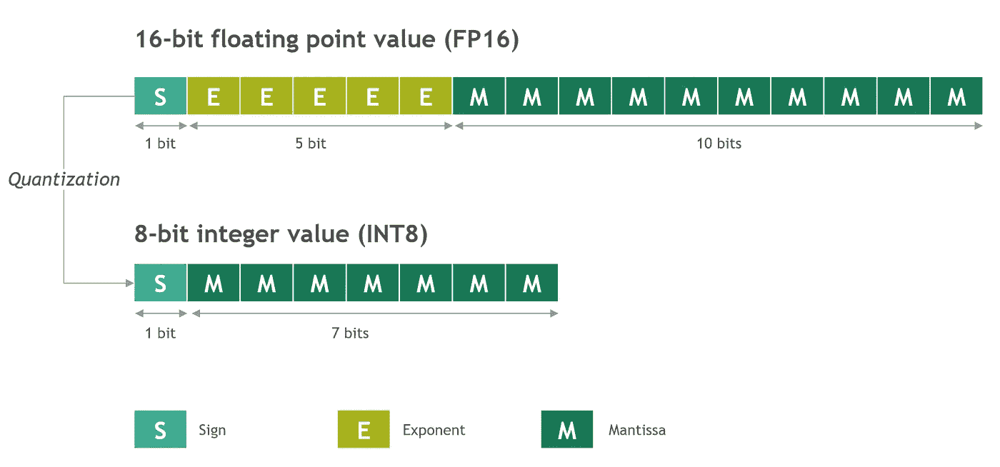
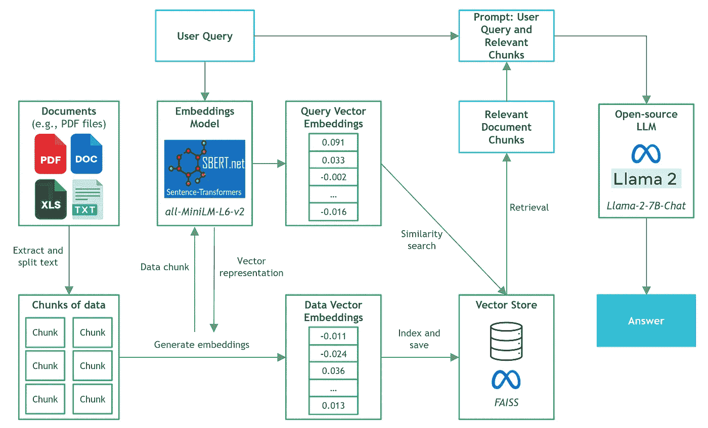
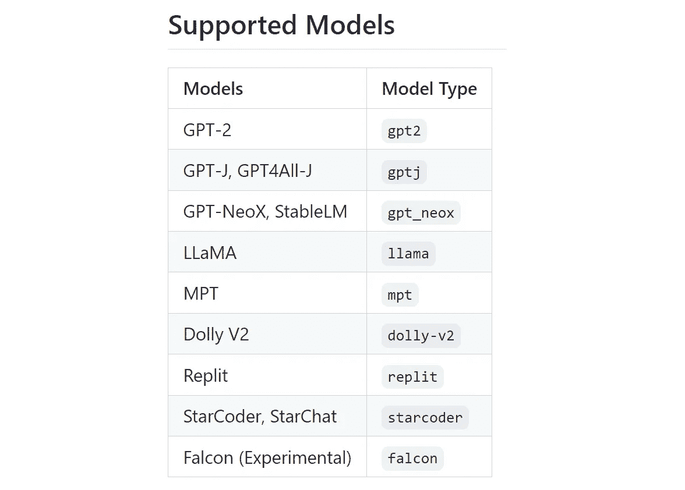
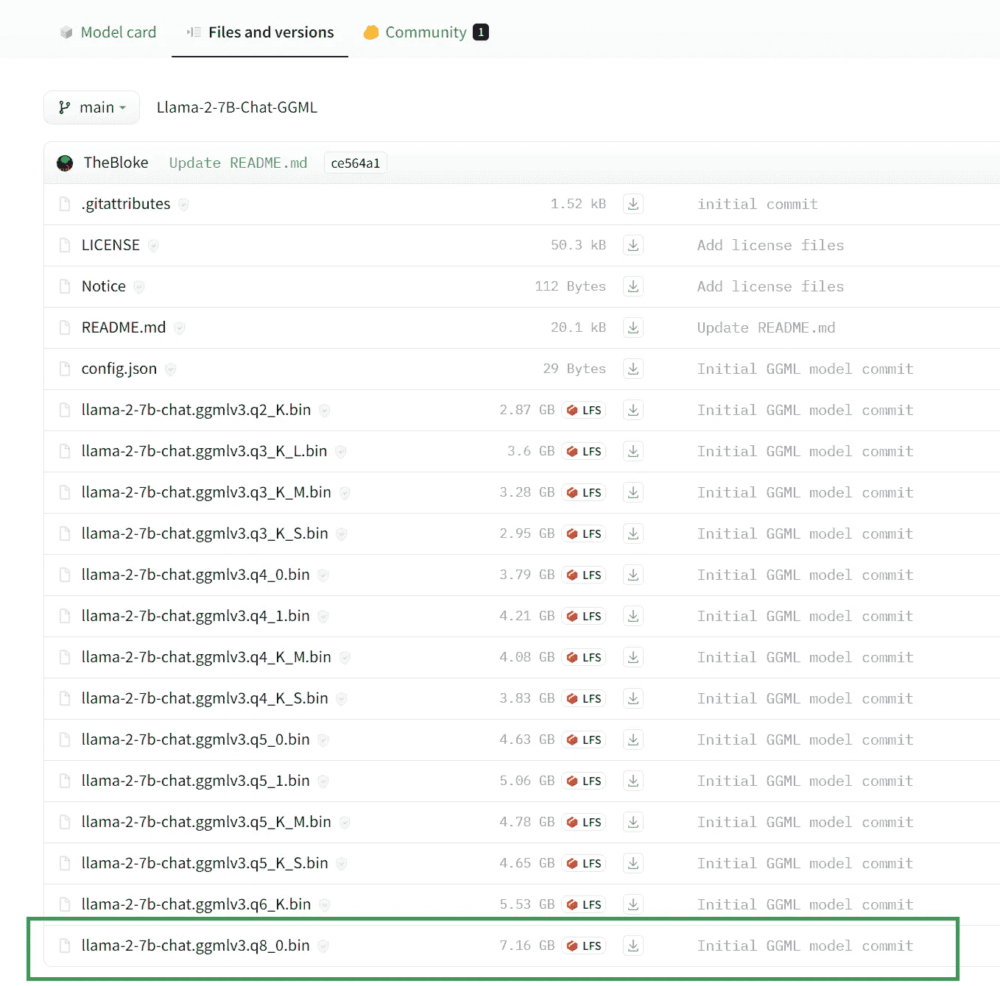
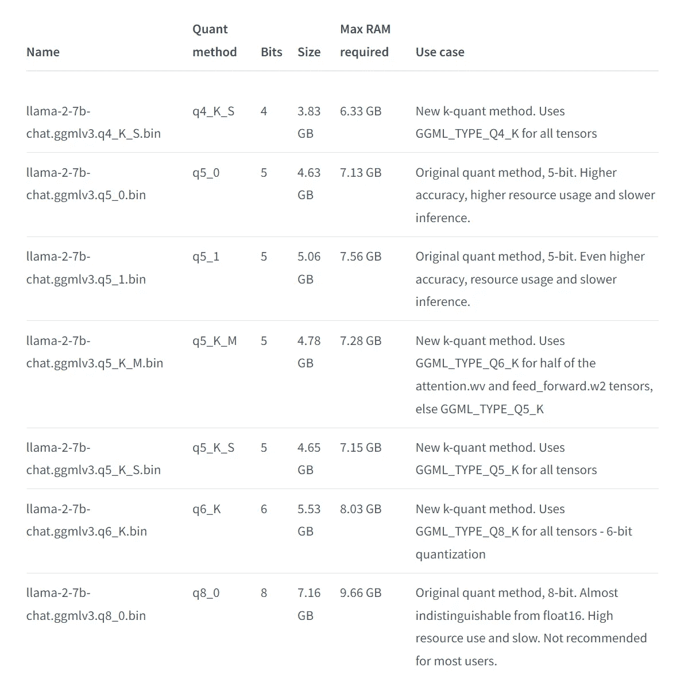
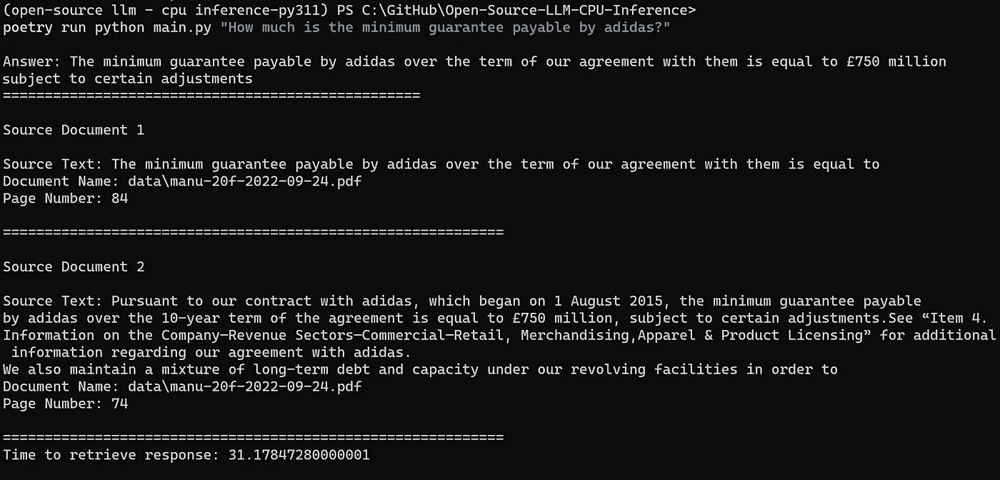

# 在本地运行 Llama 2 进行文档问答的 CPU 推理

> 原文：[`towardsdatascience.com/running-llama-2-on-cpu-inference-for-document-q-a-3d636037a3d8`](https://towardsdatascience.com/running-llama-2-on-cpu-inference-for-document-q-a-3d636037a3d8)

## 清晰解释了如何使用 Llama 2、C Transformers、GGML 和 LangChain 在 CPU 上运行量化开源 LLM 应用程序的指南

[](https://kennethleungty.medium.com/?source=post_page-----3d636037a3d8--------------------------------)[](https://towardsdatascience.com/?source=post_page-----3d636037a3d8--------------------------------) [Kenneth Leung](https://kennethleungty.medium.com/?source=post_page-----3d636037a3d8--------------------------------)

·发表于 [Towards Data Science](https://towardsdatascience.com/?source=post_page-----3d636037a3d8--------------------------------) ·阅读时间 11 分钟·2023 年 7 月 18 日

--


图片由 [NOAA](https://unsplash.com/@noaa?utm_source=unsplash&utm_medium=referral&utm_content=creditCopyText) 提供，照片来自 [Unsplash](https://unsplash.com/s/photos/computing-cloud?orientation=landscape&license=free&utm_source=unsplash&utm_medium=referral&utm_content=creditCopyText)

像 OpenAI 的 GPT4 这样的第三方商业大型语言模型 (LLM) 提供商通过简单的 API 调用使 LLM 的使用实现了民主化。然而，由于数据隐私和合规性的各种原因，团队可能仍需在企业边界内进行自我管理或私有部署以进行模型推理。

开源 LLM 的普及幸运地为我们提供了广泛的选择，从而减少了对这些第三方供应商的依赖。

当我们在本地或云端托管开源模型时，专用计算能力成为关键考虑因素。尽管 GPU 实例可能看起来是最方便的选择，但成本可能会迅速失控。

在这份易于跟随的指南中，我们将探讨如何在 Python 中为检索增强生成（即文档问答）运行开源 LLM 的量化版本。在这个项目中，我们特别利用了最新的高性能 [Llama 2](https://ai.meta.com/llama/) 聊天模型。

# 内容

> ***(1)*** *量化简明指南****(2)*** *工具和数据****(3)*** *开源 LLM 选择****(4)*** *逐步指南****(5)*** *后续步骤*

本文的 GitHub 仓库可以在 [**这里**](https://github.com/kennethleungty/Llama-2-Open-Source-LLM-CPU-Inference) 找到。

# (1) 快速 *量化简明指南*

大型语言模型（LLMs）展示了出色的能力，但它们的计算和内存需求却很高。为了管理这些缺点，我们可以使用量化来压缩这些模型，从而减少内存占用，加速计算推理，同时保持模型性能。

量化是减少表示一个数字或值所用位数的技术。在大型语言模型的背景下，它涉及通过将权重存储在低精度数据类型中来减少模型参数的精度。

由于量化减少了模型的大小，因此它有利于在资源受限的设备上部署模型，如 CPU 或嵌入式系统。

一种常见的方法是将模型权重从其原始的 16 位浮点值量化为较低精度的 8 位整数值。



从 FP16 到 INT8 的权重量化 | 图片作者

# (2) 工具和数据

下图展示了我们将在本项目中构建的文档知识问答应用程序的架构。



文档问答架构 | 图片作者

我们将要运行文档问答的文件是曼彻斯特联足球俱乐部的公共[177 页 2022 年年度报告](https://ir.manutd.com/financial-information/annual-reports/2022.aspx)。

> *数据来源：* 曼彻斯特联队有限公司（2022）。2022 年 20-F 表格年度报告。[`ir.manutd.com/~/media/Files/M/Manutd-IR/documents/manu-20f-2022-09-24.pdf`](https://ir.manutd.com/~/media/Files/M/Manutd-IR/documents/manu-20f-2022-09-24.pdf)（CC0：公共领域，因为[SEC 内容](https://www.sec.gov/os/webmaster-faq#:~:text=All%20Government%2Dcreated%20content%20on,free%20to%20access%20and%20reuse.) 是公共领域且可以自由使用）

本项目的本地机器配备了**AMD Ryzen 5 5600X 6 核处理器**和**16GB RAM**（DDR4 3600）。虽然它还配备了 RTX 3060TI GPU（8GB VRAM），但在本项目中将不使用该 GPU，因为我们将专注于 CPU 的使用。

现在让我们探讨一下在构建这个后台应用程序时将使用的软件工具：

## (i) LangChain

[LangChain](https://python.langchain.com/docs/get_started) 是一个流行的框架，用于开发由语言模型驱动的应用程序。它提供了一整套集成和数据连接器，允许我们将不同的模块链式连接和编排，创建诸如聊天机器人、数据分析和文档问答等高级用例。

## (ii) C Transformers

[C Transformers](https://github.com/marella/ctransformers) 是一个 Python 库，提供了对使用[GGML](https://github.com/ggerganov/ggml)库在 C/C++ 中实现的变换模型的绑定。首先，让我们了解一下 GGML 的内容。

由 [ggml.ai](https://ggml.ai/) 团队构建的 GGML 库是一个用于机器学习的张量库，它使大型模型能够在消费级硬件上高效运行。这是通过整数量化支持和内置优化算法实现的。

结果是，LLM 的 GGML 版本（量化模型的二进制格式）可以在 CPU 上高效运行。鉴于我们在这个项目中使用 Python，我们将使用 C Transformers 库，它本质上提供了 GGML 模型的 Python 绑定。

C Transformers 支持一组选定的开源模型，包括像 Llama、GPT4All-J、MPT 和 Falcon 等流行模型。



支持 C Transformers 的 LLM（及相应的模型类型名称） | 图片由作者提供

## (iii) Sentence-Transformers 嵌入模型

[sentence-transformers](https://github.com/UKPLab/sentence-transformers) 是一个 Python 库，提供了计算句子、文本和图像的嵌入（稠密向量表示）的方法。

它使用户能够计算超过 100 种语言的嵌入，然后可以进行比较以找到具有相似含义的句子。

我们将使用开源的 [all-MiniLM-L6-v2](https://huggingface.co/sentence-transformers/all-MiniLM-L6-v2) 模型，因为它提供了最佳的速度和出色的通用嵌入质量。

## (iv) FAISS

[Facebook AI 相似性搜索（FAISS）](https://github.com/facebookresearch/faiss) 是一个设计用于高效相似性搜索和密集向量聚类的库。

给定一组嵌入，我们可以使用 FAISS 对它们进行索引，然后利用其强大的语义搜索算法在索引中搜索最相似的向量。

虽然它不是传统意义上的完整向量存储（如数据库管理系统），但它以一种优化的方式处理向量存储，以便高效地进行最近邻搜索。

## (v) Poetry

[Poetry](https://python-poetry.org/) 被用于设置虚拟环境和处理 Python 包管理，因为它易于使用且一致性高。

之前使用过 [venv](https://docs.python.org/3/library/venv.html) 的我强烈推荐切换到 Poetry，因为它使依赖管理更高效、更无缝。

*查看* [*这个视频*](https://www.youtube.com/watch?v=0f3moPe_bhk) *以开始使用 Poetry。*

[](https://kennethleungty.medium.com/membership?source=post_page-----3d636037a3d8--------------------------------) [## 通过 Kenneth 的推荐链接加入 Medium

### 作为 Medium 会员，你的一部分会员费将支付给你阅读的作者，并且你可以全面访问每一个故事。

kennethleungty.medium.com](https://kennethleungty.medium.com/membership?source=post_page-----3d636037a3d8--------------------------------)

# (3) 开源 LLM 选择

在开源 LLM 领域已经取得了巨大的进展，许多 LLM 可以在[HuggingFace 的 Open LLM 排行榜](https://huggingface.co/spaces/HuggingFaceH4/open_llm_leaderboard)上找到。

我为这个项目选择了最新的开源[**Llama-2–7B-Chat 模型**](https://huggingface.co/meta-llama/Llama-2-7b-chat-hf) ([GGML 8-bit](https://huggingface.co/TheBloke/Llama-2-7B-Chat-GGML))，这是基于以下考虑：

## 模型类型（Llama 2）

+   这是一个在 C Transformers 库中支持的开源模型。

+   根据 2023 年 7 月的 Open LLM 排行榜，它在多个指标上表现最佳。

+   在原始 Llama 模型设定的基准上表现出巨大的改进。

+   它在社区中被广泛提及和下载。

## 模型大小（7B）

+   鉴于我们正在进行文档问答，LLM 将主要用于相对简单的任务——总结文档块。因此，7B 模型的大小符合我们的需求，因为我们在技术上并不需要过于庞大的模型（例如 65B 及以上）。

## 微调版本（Llama-2-7B-Chat）

+   Llama-2-7B 基础模型是为文本补全构建的，因此缺乏在文档问答用例中获得最佳性能所需的微调。

+   Llama-2–7B-Chat 模型是我们用例的理想选择，因为它是专为对话和问答设计的。

+   该模型（部分）授权用于商业用途。这是因为经过微调的 Llama-2-Chat 模型利用了公开的指令数据集和超过 100 万条人工标注。

## 量化格式（8 位）

+   鉴于 RAM 限制为 16GB，8 位 GGML 版本适合，因为它只需要 9.6GB 的内存。

+   8 位格式也提供了与 16 位相当的响应质量。

+   原始的未量化 16 位模型需要约 15 GB 的内存，这距离 16GB RAM 的限制非常接近。

+   还有其他更小的量化格式（即 4 位和 5 位），但它们在准确性和响应质量上有所折衷。

# (4) 步骤指南

现在我们知道了各种组件，让我们逐步了解如何构建文档问答应用程序。

> *本指南的配套代码可以在* [***这个 GitHub 仓库***](https://github.com/kennethleungty/Llama-2-Open-Source-LLM-CPU-Inference)*中找到，所有依赖项可以在* [*requirements.txt*](https://github.com/kennethleungty/Llama-2-Open-Source-LLM-CPU-Inference/blob/main/requirements.txt) *文件中找到。*

***注意***：由于已有许多教程，我们* ***不会*** *深入探讨一般文档问答组件的复杂性和细节（例如，文本分块、向量存储设置）。我们将重点关注开源 LLM 和 CPU 推断方面的内容。*

## 步骤 1 — 处理数据并构建向量存储

在这一步中，将执行三个子任务：

+   数据摄取和将文本拆分成块

+   加载嵌入模型（sentence-transformers）

+   索引块并存储在 FAISS 向量存储中

运行上述 Python 脚本后，向量存储将被生成并保存在名为 `'vectorstore/db_faiss'` 的本地目录中，并且准备好进行语义搜索和检索。

## 步骤 2 — 设置提示模板

鉴于我们使用的是 Llama-2–7B-Chat 模型，我们必须注意这里使用的提示模板。

例如，OpenAI 的 GPT 模型设计为对话输入和消息输出。这意味着输入模板应该是类似聊天的 [记录格式](https://learn.microsoft.com/en-us/azure/cognitive-services/openai/how-to/chatgpt?pivots=programming-language-chat-ml)（例如，分开的系统和用户消息）。

但是，这些模板在这里无法使用，因为我们的 Llama 2 模型并未特别优化用于那种对话界面。相反，更经典的提示模板，如下所示，将更为合适。

***注意：*** 较小的 LLM，如 7B 模型，似乎对格式特别敏感。例如，当我改变提示模板的空格和缩进时，输出略有不同。

## 步骤 3 — 下载 Llama-2–7B-Chat GGML 二进制文件

由于我们将在本地运行 LLM，因此需要下载量化的 Llama-2–7B-Chat 模型的二进制文件。

我们可以通过访问 [TheBloke 的 Llama-2–7B-Chat GGML 页面，托管在 Hugging Face 上](https://huggingface.co/TheBloke/Llama-2-7B-Chat-GGML)，然后下载名为 `llama-2–7b-chat.ggmlv3.q8_0.bin` 的 GGML 8 位量化文件。



HuggingFace 上 Llama-2–7B-Chat-GGML 页面中的文件和版本页面 | 作者提供的图片

下载的 `.bin` 文件用于 8 位量化模型，可以保存在类似 `/models` 的适当项目子文件夹中。

[模型卡页面](https://huggingface.co/TheBloke/Llama-2-7B-Chat-GGML)还展示了每种量化格式的更多信息和细节：



不同量化格式的详细信息 | 作者提供的图片

***注意：*** *要下载 C Transformers 支持的其他 GGML 量化模型，请访问主* [*TheBloke 在 HuggingFace 的页面*](https://huggingface.co/TheBloke) *以搜索您所需的模型，并查找名称以 '-GGML' 结尾的链接。*

## 步骤 4 — 设置 LLM

为了利用我们下载的 GGML 模型，我们将使用 [C Transformers 和 LangChain 的集成](https://python.langchain.com/docs/ecosystem/integrations/ctransformers)。具体来说，我们将使用 LangChain 中的 CTransformers LLM 包装器，它为 GGML 模型提供了统一的接口。

我们可以为 LLM 定义一系列 [配置设置](https://github.com/marella/ctransformers#config)，例如最大新令牌数、top k 值、温度和重复惩罚。

***注意：*** *我将温度设置为 0.01，而不是 0，因为当温度恰好为零时，我得到了奇怪的响应（例如，一长串重复的字母 E）。*

## 第 5 步 — 构建和初始化 RetrievalQA

准备好提示模板和 C Transformers LLM 后，我们编写了三个函数来构建 LangChain RetrievalQA 对象，使我们能够执行文档问答。

## 第 6 步 — 整合到主脚本中

下一步是将之前的组件整合到 `main.py` 脚本中。由于我们将通过命令行将用户查询传递到应用程序，因此使用了 `argparse` 模块。

鉴于我们将返回源文档，附加代码用于处理文档片段，以获得更好的视觉显示效果。

为了评估 CPU 推理的速度，还使用了 `timeit` 模块。

## 第 7 步 — 运行示例查询

现在是时候对我们的应用程序进行测试了。在从项目目录加载虚拟环境后，我们可以在命令行界面（CLI）中运行一个包含用户查询的命令。

例如，我们可以使用以下命令询问 Adidas（曼联的全球技术赞助商）最低保障金额的值：

```py
poetry run python main.py "How much is the minimum guarantee payable by adidas?"
```

***注意：*** 如果我们不使用 Poetry，我们可以省略前面的 `poetry run`。

## 结果



从用户查询传递到文档问答应用程序的输出 | 图片作者

输出显示我们成功获取了用户查询的正确响应（即 7.5 亿英镑），以及与查询语义相似的相关文档片段。

启动应用程序并生成响应的总时间为 31 秒，考虑到我们在本地使用的是 AMD Ryzen 5600X（虽然是一款不错的 CPU，但绝非市场上最好的），这个时间还是相当不错的。

结果更为令人印象深刻，因为在 GPU 上运行 LLM 推理（例如，直接在 HuggingFace 上）也可能需要两位数的秒数。

## 你的使用情况可能会有所不同

根据你的 CPU，获取响应的时间可能会有所不同。例如，当我在我的笔记本电脑上测试时，可能会在几分钟的范围内。

需要注意的是，将 LLM 适配到消费级硬件仍处于早期阶段，因此我们不能期望达到与 OpenAI API（由大量计算能力驱动）相当的速度。

目前，确实可以考虑在更强大的 CPU 实例上运行此程序，或者切换到使用 GPU 实例（例如 Google Colab 上的免费实例）。

# (5) 下一步

现在我们已经构建了一个运行在 CPU 推理上的文档问答后端 LLM 应用程序，我们可以采取许多令人兴奋的步骤来推进这个项目。

+   使用 Streamlit 构建前端聊天界面，特别是考虑到它最近做出了两个重要公告：[Streamlit 与 LangChain 的集成](https://blog.streamlit.io/langchain-streamlit/)，以及 [Streamlit ChatUI 的发布](https://docs.streamlit.io/knowledge-base/tutorials/build-conversational-apps)，以便轻松构建强大的聊天机器人界面。

+   将应用程序容器化并部署到云 CPU 实例上。虽然我们已经探索了本地推理，但应用程序可以轻松移植到云端。我们还可以利用云端更强大的 CPU 实例来加速推理（例如，[计算优化](https://docs.aws.amazon.com/AWSEC2/latest/UserGuide/compute-optimized-instances.html)的 AWS EC2 实例，如 c5.4xlarge）

+   尝试稍大的 LLMs，如[Llama 13B Chat](https://huggingface.co/TheBloke/Llama-2-13B-chat-GGML)模型。由于我们已经处理了 7B 模型，评估稍大一些的模型的性能是个好主意，因为它们在理论上应该更准确，并且仍能适应内存。

+   尝试使用较小的量化格式，如 4-bit 和 5-bit（包括使用新 k-quant 方法的格式），以客观评估推理速度和响应质量的差异。

+   利用本地 GPU 加速推理。如果我们想测试在[C Transformers 模型上使用 GPU](https://github.com/marella/ctransformers#gpu)，可以通过在 GPU 上运行一些模型层来实现。这是有用的，因为目前只有 Llama 模型类型支持 GPU。

+   评估使用[vLLM](https://vllm.readthedocs.io/en/latest/)，这是一个高吞吐量且内存高效的 LLMs 推理和服务引擎。然而，使用 vLLM 需要使用 GPU。

我将在接下来的几周内处理有关上述想法的文章和项目，敬请关注更多有见地的生成式 AI 内容！

# 离开前

我欢迎你**加入我数据科学发现之旅！** 关注这个[Medium](https://kennethleungty.medium.com/)页面，并访问我的[GitHub](https://github.com/kennethleungty)以获取更多有趣且实用的内容。同时，享受在 CPU 推理上运行开源 LLMs 的乐趣吧！

[](/arxiv-keyword-extraction-and-analysis-pipeline-with-keybert-and-taipy-2972e81d9fa4?source=post_page-----3d636037a3d8--------------------------------) [## arXiv 关键词提取与分析管道，使用 KeyBERT 和 Taipy]

### 在 Python 中构建一个包含前端用户界面和后台管道的关键词分析应用程序

towardsdatascience.com](/arxiv-keyword-extraction-and-analysis-pipeline-with-keybert-and-taipy-2972e81d9fa4?source=post_page-----3d636037a3d8--------------------------------) [](/how-to-dockerize-machine-learning-applications-built-with-h2o-mlflow-fastapi-and-streamlit-a56221035eb5?source=post_page-----3d636037a3d8--------------------------------) [## 如何 Docker 化构建于 H2O、MLflow、FastAPI 和 Streamlit 的机器学习应用程序]

### 一个简单易懂的 Docker 多服务 ML 应用程序容器化指南

towardsdatascience.com [](/micro-macro-weighted-averages-of-f1-score-clearly-explained-b603420b292f?source=post_page-----3d636037a3d8--------------------------------) ## F1 分数的微平均、宏平均与加权平均，详细解释

### 理解多类分类中 F1 分数的微平均、宏平均和加权平均的概念。

[towardsdatascience.com
