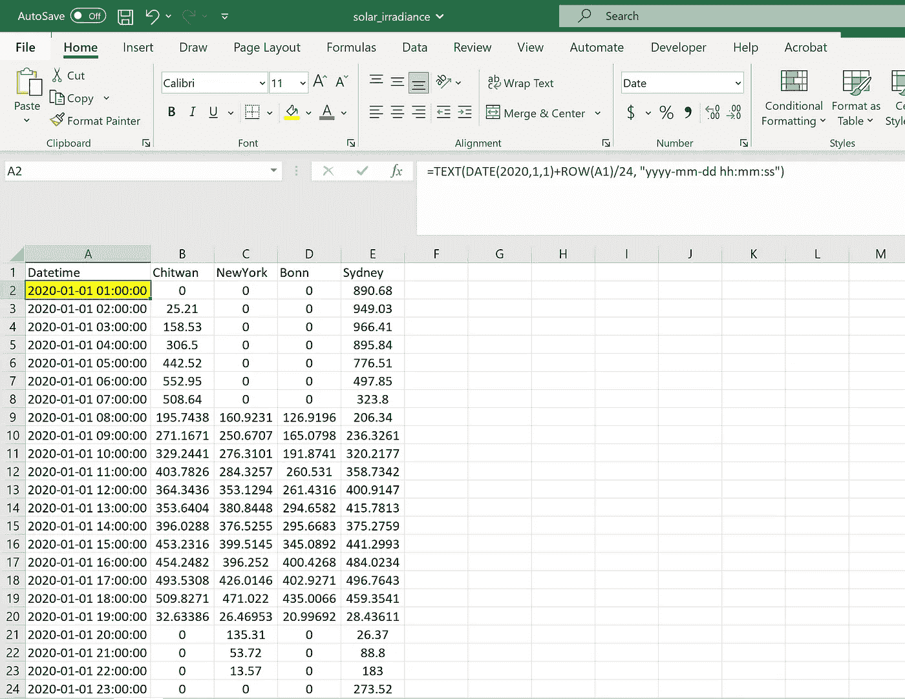

# 通过 Excel VBA 运行 Python —— 时间序列重采样的案例

> 原文：[`towardsdatascience.com/running-python-via-excel-vba-a-case-of-time-series-resampling-fe108610e4e4?source=collection_archive---------8-----------------------#2023-04-17`](https://towardsdatascience.com/running-python-via-excel-vba-a-case-of-time-series-resampling-fe108610e4e4?source=collection_archive---------8-----------------------#2023-04-17)

## 对使用 VBA、Python 和通过 Excel VBA 运行 Python 进行太阳辐射时间序列重采样的综合评估

[](https://medium.com/@himalaya.birshrestha?source=post_page-----fe108610e4e4--------------------------------)[](https://towardsdatascience.com/?source=post_page-----fe108610e4e4--------------------------------) [Himalaya Bir Shrestha](https://medium.com/@himalaya.birshrestha?source=post_page-----fe108610e4e4--------------------------------)

·

[关注](https://medium.com/m/signin?actionUrl=https%3A%2F%2Fmedium.com%2F_%2Fsubscribe%2Fuser%2Fba33e6d0d27b&operation=register&redirect=https%3A%2F%2Ftowardsdatascience.com%2Frunning-python-via-excel-vba-a-case-of-time-series-resampling-fe108610e4e4&user=Himalaya+Bir+Shrestha&userId=ba33e6d0d27b&source=post_page-ba33e6d0d27b----fe108610e4e4---------------------post_header-----------) 发布于 [Towards Data Science](https://towardsdatascience.com/?source=post_page-----fe108610e4e4--------------------------------) ·11 min read·2023 年 4 月 17 日[](https://medium.com/m/signin?actionUrl=https%3A%2F%2Fmedium.com%2F_%2Fvote%2Ftowards-data-science%2Ffe108610e4e4&operation=register&redirect=https%3A%2F%2Ftowardsdatascience.com%2Frunning-python-via-excel-vba-a-case-of-time-series-resampling-fe108610e4e4&user=Himalaya+Bir+Shrestha&userId=ba33e6d0d27b&source=-----fe108610e4e4---------------------clap_footer-----------)

--

[](https://medium.com/m/signin?actionUrl=https%3A%2F%2Fmedium.com%2F_%2Fbookmark%2Fp%2Ffe108610e4e4&operation=register&redirect=https%3A%2F%2Ftowardsdatascience.com%2Frunning-python-via-excel-vba-a-case-of-time-series-resampling-fe108610e4e4&source=-----fe108610e4e4---------------------bookmark_footer-----------)

最近，我频繁使用基于 Excel 的界面和模型。在此期间，我对 Office 的 [Visual Basic for Application (VBA)](https://learn.microsoft.com/en-us/office/vba/library-reference/concepts/getting-started-with-vba-in-office) 进行了了解，它是一种强大的编程语言，用于扩展 Office 应用程序。VBA 用于自动化重复任务、扩展用户交互以及在不同的 Office 应用程序之间进行交互，从而使日常任务更加高效和有效。

由于我有一定的 Python 编程背景，开始学习 VBA 的不同功能和特性时经历了相对陡峭的学习曲线，但随着时间的推移，这种曲线逐渐变得平缓。我意识到学习 VBA 非常有用，因为它可以直接与 Excel 工作簿交互，并能够自动化本身需要用不同编程语言编码的任务。然而，如果能在 Excel VBA 中运行其他编程语言（如 Python）的脚本，这将对自动化我们的日常任务更为有帮助。

在这篇文章中，我将分享使用 Excel VBA 和 Python 执行一个简单任务的经验——对太阳辐射数据进行时间序列重采样。此外，我还将展示如何通过 Excel VBA 运行 Python 脚本来执行相同的任务。让我们开始吧。


图片来自 [Aron Visuals](https://unsplash.com/@aronvisuals) 的 [Unsplash](http://www.unsplash.com)。

## 数据

使用的数据是 2020 年的每小时全空面短波下行辐射（`ALLSKY_SFC_SW_DWN`），时区为 UTC，从 NASA Power [网站](https://power.larc.nasa.gov/data-access-viewer/) 下载，覆盖四个城市：奇特旺（尼泊尔）、纽约（美国）、悉尼（澳大利亚）和波恩（德国）。这些数据通过 NASA Power 的 [API 服务](https://power.larc.nasa.gov/api/pages/?urls.primaryName=Hourly) 使用 Python 脚本访问和下载，我打算在另一篇文章中对此进行详细说明。

太阳辐射是指从太阳获得的每单位面积的功率（W/m²），以电磁辐射的形式存在于测量仪器的波长范围内。太阳辐射在一段时间内的积分值称为太阳辐照量，或称为太阳辐射量（Wh/m²）。

根据 NASA Power 的 [定义](https://power.larc.nasa.gov/#resources)，所使用的参数全空面短波下行辐射（`ALLSKY_SFC_SW_DWN`）指的是在所有天空条件下，地球表面水平面上的总太阳辐射（直接辐射加散射辐射）。总太阳辐射的另一种术语是全球水平辐射（GHI）。由于数据是每小时的，其单位为 Wh/m²。

## Excel 文件中的数据

由于 2020 年是闰年，我获得了四个城市的 8784 小时太阳辐射值。这些值被放置在如下 Excel 文件中的列 B、C、D 和 E 中。



2020 年四个城市的小时太阳辐射值放置在 Excel 文件中。公式栏显示了在突出显示的单元格 A2 中使用的公式。作者插图。

为了以日期格式获取列 A 中的值，Excel 中使用了以下公式（例如，在单元格 A2 中）：

```py
=TEXT(DATE(2020,1,1)+ROW(A1)/24, “yyyy-mm-dd hh:mm:ss”)
```

`ROW(A1)/24` 用于获取一天内的小时值（0–23 小时）。

同样，我将单元格 A1 命名为 `datetime`。

在 Excel 中绘制 2020 年四个城市的原始小时太阳辐射数据如下：


使用 Excel 绘制小时太阳辐射值。作者插图。

# 时间序列重采样

时间序列重采样指的是转换时间序列数据的频率级别。简单来说，[重采样](https://pandas.pydata.org/pandas-docs/stable/user_guide/timeseries.html#resampling) 是一种基于时间的分组操作，随后对每个组应用减少方法。数据必须具有类似日期时间的索引才能实现此目的。

## 1\. 使用 Excel VBA 进行时间序列重采样

Excel 中没有默认的时间序列重采样函数。因此，我编写了一些子例程来获取如下面 a 和 b 节所述的月度和小时平均值。

## a. 将小时值转换为平均月频率的 VBA 代码

本节描述了用于将小时值转换为 VBA 中平均月值的代码片段（见下文）。

数组是 VBA 中的一组变量。VBA 中数组元素的默认下界是 0\. 在子例程的顶部提到 `Option Base 1` 可以将数组元素的下界改为 1\. 我定义了一个名为 `columns(4)` 的数组，作为包含 4 个变量的字符串组。我在这个数组中传递了字符串 B、C、D 和 E。

Excel 中的单元格 A1 被定义为名为 `datetime` 的命名单元格。为了在 VBA 中引用此单元格，我声明了 `datetime` 作为一个范围，并将其分配给 Excel 中具有相同名称的范围。

要从 Excel 中的日期时间列中引用月份，我使用了 `MONTH()` 函数并将其分配给名为 `mnth` 的整数变量。为了循环遍历每行的小时值，我声明了另一个整数变量 `row`。最后，我声明了 `sum` 和 `num_hours` 以计算月度平均值。

```py
'Use Option Base 1 before this subroutine if you want to start the list from 1 instead of 0.
'https://excelchamps.com/vba/arrays/
Option Base 1
Sub GetMonthlyAverage()

'defining an array for 4 strings
Dim columns(4) As String
columns(1) = "B"
columns(2) = "C"
columns(3) = "D"
columns(4) = "E"

'Refer to cell A1
Dim datetime As Range
Set datetime = Range("datetime")

'Definining mnth because Month is a function
Dim mnth As Integer
Dim row As Integer

Dim sum As Double
Dim num_hours As Double 
```

接下来，我创建了一个 for 循环来遍历每个城市的值。在这个 for 循环中，还有两个嵌套循环分别遍历每个月和每年的小时。`sum` 聚合了每个月的小时太阳辐射值，而 `num_hours` 聚合了每个月的小时数。最后，通过将 `sum` 除以 `num_hours`，获得了每个月每个城市的太阳辐射月度平均值。

```py
'Loop through column for each city
For Each column In columns

    'Loop through each month of the year
    For mnth = 1 To 12

        sum = 0
        num_hours = 0

        'Loop through each row
        For row = 2 To 8785

            If MONTH(Cells(row, datetime.column)) = mnth Then
                Range(column & row).Interior.Color = RGB(255, 255, 0)
                num_hours = num_hours + 1
                sum = sum + Range(column & row).Value

            End If

        Next row

        Range(column & mnth).Offset(1, 7).Value = sum / num_hours

    Next mnth

Next column

End Sub
```

作为说明，`Range(column & row).Interior.Color = RGB(255, 255, 0)` 在遍历行（城市）和列（月份）时，用黄色高亮显示每个单元格。

## b. VBA 代码，用于将一年中的每小时值转换为 2020 年每天的 24 小时（0–23 小时）的平均小时值

用于将每小时值（一年）转换为 2020 年每天的 24 小时的平均小时值的代码。

在本节的代码中，首先，我提取了数据表中 `last_row`（8785）的值，使用

`Cells(datetime.row, datetime.column).End(xlDown).row`

用于遍历每一行以进行进一步处理。

我使用了 Excel 中的 `HOUR()` 函数来检索每一行中 A 列对应的小时：

`Hour(Cells(row, datetime.column).column).Value`

本节的完整代码如下所示：

```py
Option Base 1
Sub GetHourlyAverage()

‘defining an array for 4 strings
Dim columns(4) As String
columns(1) = “B”
columns(2) = “C”
columns(3) = “D”
columns(4) = “E”

'Definining mnth because Month is a function
Dim mnth As Integer
Dim row As Integer

Dim sum As Double
Dim num_hours As Double

Dim wb As Workbook
Dim ws As Worksheet
Dim datetime As Range
Dim last_row As Integer

Set wb = ThisWorkbook
Set ws = ThisWorkbook.Sheets("Sheet1")
Set datetime = ws.Range("datetime")
last_row = Cells(datetime.row, datetime.column).End(xlDown).row

Debug.Print datetime.Value
Debug.Print "Row: " & datetime.row & " Column: " & datetime.column
Debug.Print "Last row: " & last_row

'Loop through column for each city
For Each column In columns

    'Loop through each hour of the day
    For hr = 0 To 23

        sum = 0
        num_hours = 0

        'Loop through each row
        For row = datetime.row + 1 To last_row

            If Hour(Cells(row, datetime.column).Value) = hr Then
                Range(column & row).Interior.Color = RGB(255, 255, 0)
                num_hours = num_hours + 1
                sum = sum + Range(column & row).Value

            End If

        Next row

        Range(column & hr + 2).Offset(0, 14).Value = sum / num_hours

    Next hr

Next column

End Sub
```

在上面的代码片段中，`Debug.Print` 命令用于在 VBA 开发空间中的中间窗口打印中间结果，如下所示：


Debug.Print 的输出在即时窗口中可见。由作者插图。

**2\. 使用 Pandas 进行时间序列重采样**

Python 中的 pandas 库提供了一个内置的 [方法](https://pandas.pydata.org/docs/reference/api/pandas.DataFrame.resample.html) 用于时间序列重采样，方法是使用 `df.resample()` 并传递重采样规则。例如，“M” 代表按月，“W” 代表按周，“Q” 代表按季度，“D” 代表按日，“B” 代表按工作日等。有关不同频率级别重采样的完整规则集可以在 [这里](https://pandas.pydata.org/pandas-docs/stable/user_guide/timeseries.html#dateoffset-objects) 找到。

时间序列重采样的前提条件是数据框索引需要使用 `pd.to_datetime()` 转换为 datetime 类型。


数据框索引需要是 DatetimeIndex 类型，这是进行时间序列重采样的前提条件。由作者插图

通过 [Groupby](https://pandas.pydata.org/pandas-docs/stable/reference/groupby.html#api-groupby) 提供的任何内置方法都可以作为 `df.resample()` 返回对象的方法，包括 `min()`、`max()`、`mean()`、`median()`、`std()`、`first()`、`last()`、`ohlc()` 和 `sem()`。在这篇文章中，我只是评估了太阳辐射的平均值。

在下面的 Python 代码中，我允许用户输入他们希望返回和显示的太阳辐射值的频率。选项包括原始数据、月平均值、日平均值、周平均值、季度平均值、以上所有选项以及每小时平均值（每天的 24 小时内每小时）。

```py
import pandas as pd
import matplotlib.pyplot as plt
import os
import sys

#Enter os system to current working directory
os.chdir(sys.path[0])
file = "solar_irradiance.xlsm"

#read all rows and first 5 columns
df = pd.read_excel(file).iloc[:, :5]
df["Datetime"] = pd.to_datetime(df["Datetime"])
df.set_index(["Datetime"], inplace = True)

frequency = input("Enter the frequency you want to display? \n1\. Original \n2\. Monthly average\n3\. Daily average \n4\. Weekly average\n 5.Quarterly average \n 6.All of the above \n 7\. Hourly average \n? ")

if frequency == "Original":
    print (df)
    df.plot()
    plt.title("Original solar irradiance in 2020")
    plt.ylabel("Wh/m$²$")
    plt.legend()
    plt.show()

elif frequency == "Monthly average":
    print (df.resample(rule = "M").mean())
    df.resample(rule = "M").mean().plot()
    plt.title("Monthly average solar irradiance in 2022")
    plt.ylabel("Wh/m$²$")
    plt.legend()
    plt.show()

elif frequency == "Daily average":
    print (df.resample(rule = "D").mean())
    df.resample(rule = "D").mean().plot()
    plt.title("Daily average solar irradiance in 2022")
    plt.ylabel("Wh/m$²$")
    plt.show()

elif frequency == "Weekly average":
    print (df.resample(rule = "W").mean())
    df.resample(rule = "W").mean().plot()
    plt.title("Weekly average solar irradiance in 2022")
    plt.ylabel("Wh/m$²$")
    plt.legend()
    plt.show()

elif frequency == "Quarterly average":
    print (df.resample(rule = "Q").mean())
    df.resample(rule = "Q").mean().plot()
    plt.title("Quarterly average solar irradiance in 2022")
    plt.ylabel("Wh/m$²$")
    plt.legend()
    plt.show()

elif frequency == "All of the above":
    fig, axs = plt.subplots(2, 2, figsize = (20, 10), sharex = True, sharey = True)
    df.resample(rule = "D").mean().plot(ax = axs[0, 0])
    axs[0, 0].set_title("Daily mean")
    axs[0, 0].set_ylabel("Wh/m$²$")
    df.resample(rule = "W").mean().plot(ax = axs[0, 1])
    axs[0, 1].set_title("Weekly mean")
    df.resample(rule = "M").mean().plot(ax = axs[1, 0])
    axs[1, 0].set_title("Monthly mean")
    axs[1, 0].set_ylabel("Wh/m$²$")
    df.resample(rule = "Q").mean().plot(ax = axs[1, 1])
    axs[1, 1].set_title("Quarterly mean")fig.suptitle("Mean solar irradiance in four locations converted to different temporal frequencies")
    plt.show()

elif frequency == "Hourly average":
    #average value in each hour within 24 hours of a day
    print (df.groupby(df.index.hour).mean())
    df.groupby(df.index.hour).mean().plot()
    plt.title("Hourly average solar irradiance in 2022")
    plt.ylabel("Wh/m$²$")
    plt.legend()
    plt.show()

else:
    print ("The frequency you entered is incorrect.")
```

可以通过进入终端/命令提示符并键入 `python -m python_script.py` 来运行此脚本，如果路径与脚本文件相同。要中断运行，可以键入 `Ctrl+C`。

## 3\. 通过 Excel VBA 运行 Python 脚本

上述 Python 脚本也可以通过 Excel VBA 运行。为此，我将上述脚本保存为`python_script.py`文件。

下面的代码片段给出了完整的 VBA 子程序，用于运行 Python 脚本。

```py
Sub RunPythonScript()
Dim objShell As Object
Dim PythonExePath As String, PythonScriptPath As String
ActiveWorkbook.Save

'Enter into the path of given workbook
ChDir Application.ThisWorkbook.Path
Set objShell = VBA.CreateObject(“Wscript.Shell”)

'Enter into the path of given workbook
ChDir Application.ThisWorkbook.Path

    Set objShell = VBA.CreateObject("Wscript.Shell")

    'Goto cmd. Type where python to get this path. Note that there are three quotes below.
    ' The hash symbol # below needs to be filled with the path in your system.
    PythonExePath = """C:\Users\#######################\python.exe"""

    'Get the path of the file.
    PythonScriptPath = Application.ThisWorkbook.Path & "\python_script.py"

    objShell.Run PythonExePath & PythonScriptPath

End Sub
```

首先，我声明了`objShell`变量以引用对象的地址（Wscript.shell）。该对象允许访问 Windows 功能以运行外部程序（此处为 Python 脚本）。

`PythonExePath`指的是计算机系统中 Python 应用程序的路径。在 Windows 系统中，可以通过在 Windows 命令提示符中输入`where python`来找到该路径。

Python 脚本的路径被定义为`PythonScriptPath`中的字符串。请注意，此路径**不应包含空格**，以确保脚本正常运行。

最后，以下行用于通过 Excel VBA 接口使用 Python 应用程序运行 Python 脚本。

`objShell.Run PythonExePath & PythonScriptPath`

## 输出

我将上述子程序/宏（使用 VBA 语言编写的命令）分配给了 Excel 文件中的一个按钮，如下所示：


将宏分配到按钮以运行 Python 脚本。作者插图。

点击按钮会运行 Python 脚本，如下所示，并要求用户输入希望显示输出的频率：


Python 会要求用户输入选项。作者插图。

选择“所有上述选项”后，我得到了 2020 年四个城市日、周、月和季度的太阳辐射平均值输出图。可以观察到，随着时间分辨率从右到左、从上到下增加，线条/曲线变得更加平滑，因为较低时间分辨率的变异性被平均化了。


选择所有上述选项时的输出显示了按日、周、月和季度水平平均化的小时太阳辐射值。作者插图。

## 结论

在这篇文章中，我介绍了三种 2020 年四个城市小时太阳辐射数据时间序列重采样的技术：

1.  使用 Excel VBA

1.  使用 Python 中的 pandas

1.  通过 Excel VBA 接口运行 Python 脚本

Excel VBA 在处理 Excel 数据时非常有用，因为它允许我们执行各种操作，并与同一或不同 Excel 文件中的不同工作表中的数据进行直接交互。此外，通过编写宏并将其分配给交互式按钮/用户表单或其他小部件，可以轻松地与其他用户共享 Excel 文件，对他们而言，功能才是关键，而不是后台代码的具体内容。

Python 的主要优势之一是其包含多个内置功能的包，这使得为常规任务编写单独的代码变得多余。在这种情况下，结合 Excel VBA 和 Python 的优势可能非常有利。这体现在我通过在 Excel 文件上点击按钮来运行时间序列重采样的 Python 脚本的方式上，这与几行简单的 VBA 代码相关联。

包括宏的 Excel 文件和 Python 脚本都可以在这个[仓库](https://github.com/hbshrestha/Data_Analytics)的`script`文件夹中找到。感谢您的阅读！
