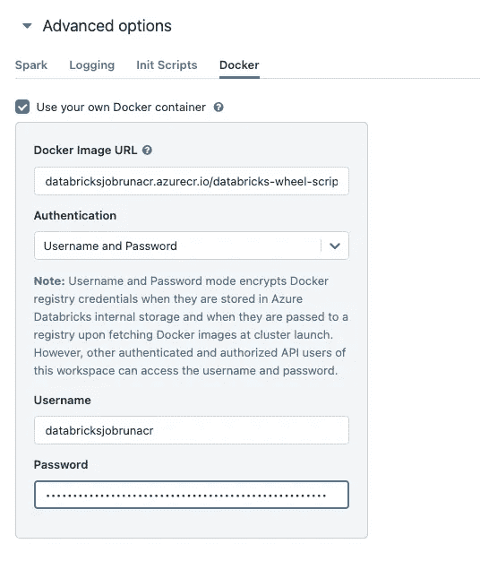

# 在 Databricks 中使用自定义 Docker 容器运行 Python Wheel 任务

> 原文：[`towardsdatascience.com/running-python-wheel-tasks-in-custom-docker-containers-in-databricks-de3ff20f5c79`](https://towardsdatascience.com/running-python-wheel-tasks-in-custom-docker-containers-in-databricks-de3ff20f5c79)

## 一步一步的教程，教你如何在 Databricks 中使用自定义 Docker 镜像构建和运行 Python Wheel 任务（配合 Poetry 和 Typer CLI）。

[](https://johschmidt42.medium.com/?source=post_page-----de3ff20f5c79--------------------------------)[](https://towardsdatascience.com/?source=post_page-----de3ff20f5c79--------------------------------) [Johannes Schmidt](https://johschmidt42.medium.com/?source=post_page-----de3ff20f5c79--------------------------------)

·发表于 [Towards Data Science](https://towardsdatascience.com/?source=post_page-----de3ff20f5c79--------------------------------) ·13 分钟阅读·2023 年 6 月 29 日

--


照片来自 [Lluvia Morales](https://unsplash.com/@hi_lluvia?utm_source=medium&utm_medium=referral) 在 [Unsplash](https://unsplash.com/?utm_source=medium&utm_medium=referral)

数据工程师设计和构建管道以运行 ETL 工作负载，使数据能够在下游用于解决业务问题。在 Databricks 中，对于这样的管道，通常需要创建一个**集群**、一个**笔记本/脚本**并编写一些**Spark** 代码。一旦有了工作原型，就可以使其准备好生产环境，以便通过 Databricks 作业执行代码，例如使用 REST API。对于 Databricks，这意味着通常需要在 Databricks 文件系统中已有一个 Python 笔记本/脚本，或者已将远程 Git 存储库连接到工作区*。但如果你不想做这两种情况呢？还有另一种方法可以在不上传任何文件到 Databricks 工作区或 [连接到远程 Git 存储库](https://docs.databricks.com/repos/index.html) 的情况下将 Python 脚本作为 Databricks 作业运行：**Python wheel 任务**具有声明的入口点，**Databricks 容器服务**允许你启动作业运行，这些作业将使用来自容器注册表的 Docker 镜像。

因此，本教程将向你展示如何做到这一点：在 Databricks 中的**自定义 Docker 镜像**中运行**Python 任务**（Python wheel 任务）。

**要么** [*同步过程将 Git 文件上传到 Databricks 工作区*](https://docs.databricks.com/repos/repos-setup.html) *在代码执行之前，要么提供远程* [*git 引用笔记本/脚本用于作业运行*](https://docs.databricks.com/workflows/jobs/how-to/use-repos.html)。

# 为什么你会想这么做？

你可能有“构建、发布和随处运行”的理念，所以你可能对使用 DataBricks 的传统方式不满意。

让我解释一下。

Databricks 为其平台建议了一些 [CI/CD 技术](https://docs.databricks.com/dev-tools/index-ci-cd.html#dev-tools-ci-cd)。

> 持续集成和持续交付/持续部署（CI/CD）是指通过使用自动化管道，以短而频繁的周期开发和交付软件的过程。

通常，对默认分支或发布的提交会启动一个管道进行代码检查、测试等，并最终导致与 Databricks 交互的操作。这可能是一个 REST API 调用以触发作业运行，其中指定了笔记本/脚本，或者在 Databricks 的情况下，将部署包部署到目标环境，这可以是工作区。

**第一种选择** 通常需要 Databricks 连接到远程 Git 仓库，以便能够使用远程 Git 引用，例如，Github 仓库主分支中的特定笔记本，以触发作业运行。

**第二种选择** 将文件上传到其工作区，但不一定需要 Databricks 连接到远程 Git 仓库。此工作流选项的可视化摘要请见 [此处](https://docs.databricks.com/dev-tools/index-ci-cd.html#dev-tools-ci-cd)。

*部署包* 可以是笔记本、库、工作流等。通常使用 Databricks CLI 或 REST API 将包部署到 Databricks 工作区。实质上，自动化管道将远程 git 仓库中的更改与 Databricks 工作区同步。

我这篇博客的目标是探讨一种不同的 CI/CD 工作流，即不与 Databricks 交互的工作流（将代码与 Databricks 工作区解耦）。所建议的工作流只是创建一个 **Docker 镜像**，并将其推送到容器注册表，将作业运行的执行留给服务。这可以是任何东西，例如 Web 应用、函数、定时任务或 [Apache Airflow](https://docs.databricks.com/workflows/jobs/how-to/use-airflow-with-jobs.html)。

请记住，像这样做并不适用于所有用例，但我认为一些工作负载（例如 ETL）可以从中受益。用常识来决定最适合你的方法。尽管如此，值得探索 Databricks 提供的平台选项。那么，让我们开始吧。

## TLDR

Databricks（标准层*）将在 **Azure** 上提供。将使用 **Poetry** 创建一个具有定义入口点和依赖项的单个 Python **wheel** 文件。该 wheel 文件将被安装在与 Databricks 兼容的 **Docker 镜像** 中，并推送到容器注册表。将创建并触发作业运行，使用 Databricks 工作区 UI 门户和 REST API。

**标准层的 Azure Databricks 工作区不应产生任何费用**。

***替代方案包括* *AWS 或 GCP***

## 前提条件

+   Poetry

+   Docker

+   Azure 或 AWS 账户

+   容器注册表（例如 DockerHub、ACR、ECR）

## 结构

+   Apache Spark 和 Databricks

+   在 Azure 上配置 Databricks

+   启用 Databricks 容器服务

+   创建个人访问令牌（PAT）

+   执行作业运行的选项（Python）

+   使用入口点创建 Python wheel（使用 Poetry 和 Typer CLI）

+   构建一个与 Databricks 兼容的 Docker 镜像

+   创建并触发一个作业运行（UI）

+   创建并触发一个作业运行（REST API）

# Apache Spark 和 Databricks

在介绍中，我已经谈到了 Databricks，并提到了数据工程师的常见用例。如果你需要一个关于 Apache Spark 和 Databricks 的简短定义，请看这里：

**Spark** 是一个用于处理大规模数据的开源引擎。通过将数据和计算分布到集群中的多个节点，它实现了并行性和可扩展性。

**Databricks** 是一个基于云的平台，利用 Spark 执行各种与数据相关的任务，如数据处理、数据分析、机器学习和 AI 工作负载。

# 在 Azure 上配置 Databricks

假设你已经有了**Azure 账户**和**订阅**，如果没有，[创建一个免费的 Azure 账户](https://azure.microsoft.com/en-us/free/search/)，或者继续跟随教程。

让我们在 Azure 上配置 Databricks 资源（工作区）。在此阶段不应产生费用。

我们创建一个资源组，在其中配置 Databricks 资源：*databricks-job-run-rg*


创建资源组 — 作者提供的图片

在此资源组内，我们可以创建**Azure Databricks 工作区**并为其命名：*databricks-job-run*


创建一个 Azure Databricks 工作区 — 作者提供的图片

对于定价层，选择**标准**。你可以保持其余部分为建议设置。*托管资源组名称*可以留空。

**请注意，只有使用 Premium 版，我们才会拥有适当的基于角色的访问控制（RBAC）功能。但为了本教程的方便，我们不需要它。我们将使用个人访问令牌（PAT），允许我们通过 Databricks REST API 创建和触发作业运行。**

部署后，我们的资源组现在包含 Azure Databricks 工作区：


资源组中的 Azure Databricks 服务 — 作者提供的图片

然后我们可以启动工作区，


从 Azure 门户启动 Databricks 工作区 — 作者提供的图片

这将打开一个友好的用户界面（UI），如下所示：


Databricks UI — 作者提供的图片

到目前为止，一切顺利。

# 启用 Databricks 容器服务

Databricks 默认情况下不允许自定义 Databricks Docker 镜像，我们必须先启用此功能。有关步骤，请参阅[这里](https://docs.databricks.com/administration-guide/clusters/container-services.html)。

在*管理员设置*（右上角下拉菜单）中，我们必须启用*容器服务*字段：


工作区设置 — 图片由作者提供

还要确保*个人访问令牌*已启用，我们将在下一节中创建一个。

# 创建个人访问令牌（PAT）

在*用户设置*（右上角下拉菜单）中，有一个按钮允许我们生成一个新令牌：


创建 PAT — 图片由作者提供

将这个令牌保存在安全的地方，因为它可以用于对[Databricks API](https://learn.microsoft.com/en-us/azure/databricks/dev-tools/auth)进行安全认证。我们稍后将需要它。

*请注意：我们使用 PAT，因为标准层不提供 RBAC 功能。为此，我们需要升级到高级版。*

# 执行作业运行的选项（Python）

在我们为 Databricks 作业创建**Python wheel**之前，我想重点关注我们用于创建和运行[Databricks 作业](https://docs.databricks.com/workflows/jobs/create-run-jobs.html)（Python）的选项。有不同的方法可以在集群中执行脚本。

在*工作流/作业*或*工作流/作业运行*面板中创建任务，显示了我们的选项。或者，我们可以通过阅读[文档](https://docs.databricks.com/workflows/jobs/create-run-jobs.html)来了解它们。


在 Databricks 作业中运行脚本的选项 — 图片由作者提供

如前所述，我们基本上可以指定**2**种来源从中获取要执行的笔记本/脚本：**Databricks 工作区**或**远程 Git 仓库**。对于**Python wheels**，我们不能选择来源，而是必须输入*包名称*和*入口点*。wheel 包应存在于 DBFS（Databricks 文件系统）或如 PyPi 等索引上。我认为[文档中的教程](https://docs.databricks.com/workflows/jobs/how-to/use-python-wheels-in-workflows.html)对来源选项的解释不够清晰（2023 年 5 月），或者可能是我无法找到这些信息。但有一篇很好的博客文章展示了如何做：[如何将你的 Python 项目部署到 Databricks](https://godatadriven.com/blog/how-to-deploy-your-python-project-on-databricks/)

不过，实际上并没有提到（尽管这是合理的），如果你提供一个已经安装了你的 Python wheel 任务的**自定义 docker 镜像**，你也可以指定它并且它会被执行。这就是我们要做的。

**对于 Python 脚本，还有一个选项：DBFS（Databricks 文件系统）*

# 使用入口点创建一个 Python wheel（配有 Poetry 和*Typer CLI*）

我已经在*src* *布局*中设置了一个使用**Poetry**的项目，其中包含了构建 wheel 的代码和命令。你可以在这里找到完整的代码：

[`github.com/johschmidt42/databricks-python-wheel-job-run`](https://github.com/johschmidt42/databricks-python-wheel-job-run)

```py
./src
├── dbscript1
│   ├── __init__.py
│   └── script.py
└── dbscript2
    ├── __init__.py
    └── __main__.py
```

在*pyproject.toml*中，这些脚本定义如下：

```py
[tool.poetry]
name = "dbscripts"
version = "1.0.0"

...

packages = [
    {include = "dbscript1", from = "src"},
    {include = "dbscript2", from = "src"},
]

[tool.poetry.scripts]
dbscript1 = "dbscript1.script:main"
dbscript2 = "dbscript2.__main__:main"

...
```

在两个包*dbscript1*和*dbscript2*中，我们找到了一些代码：

src/dbscript1/script.py

和

src/dbscript2/__main__.py

它们基本上做了相同的事情。它们之间唯一明显的区别是*script1* 的名字只是“script”，而另一个的名字是“__main__”。你会很快看到这个区别的影响。这两个脚本都使用 `typer`**库来为 `script1` 或 `script2` 函数创建一个命令行界面（CLI）。

当 `script1` 或 `script2` 函数被带有参数（必需）调用时，它会打印当前文件的名称 (`__file__`) 和传入的 `argument` 参数的值。

从这些文件中，我们可以使用 `Poetry` 创建一个包：

```py
> **poetry build --format wheel**

Building dbscripts (1.0.0)
  - Building wheel
  - Built dbscripts-1.0.0-py3-none-any.whl
```

这将创建一个*wheel*文件在*dist*目录中

```py
dist
└── dbscripts-1.0.0-py3-none-any.whl
```

我们可以使用 `pip` 将这个*wheel*安装到虚拟环境中，看看会发生什么：

```py
**> pip install dist/dbscripts-1.0.0-py3-none-any.whl**

Successfully installed dbscripts-1.0.0
```

如果我们重新启动 shell（bash、zsh 等），我们现在可以调用两个新函数：

```py
(dbscripts-py3.9) databricks-python-wheel-job-run % **dbscript [TAB]**

**dbscript1**  **dbscript2**
```

两者都可以作为函数使用，如 [black](https://github.com/psf/black) 或 [isort](https://pypi.org/project/isort/)：

```py
> **dbscript1 Databricks**

/Users/johannes/learnspace/databricks-python-wheel-job-run/.venv/lib/python3.9/site-packages/dbscript1/script.py
Your argument is: Databricks
```

```py
> **dbscript2 Databricks**

/Users/johannes/learnspace/databricks-python-wheel-job-run/.venv/lib/python3.9/site-packages/dbscript2/__main__.py
Your argument is: Databricks
```

这里是将入口点函数命名为“__main__”的好处：

```py
> **python -m dbscript1 abc**

/Users/johannes/learnspace/databricks-python-wheel-job-run/.venv/bin/python: No module named dbscript1.__main__; 'dbscript1' is a package and cannot be directly executed
```

与之相比

```py
> **python -m dbscript2 abc**

/Users/johannes/learnspace/databricks-python-wheel-job-run/.venv/lib/python3.9/site-packages/dbscript2/__main__.py
Your argument is: abc
```

如果你对两个脚本如何在 shell 中作为函数执行感到困惑，只需查看你的虚拟环境的 bin 目录：*.venv/bin*

```py
# .venv/bin

.
├── activate
...
├── black
├── blackd
├── **dbscript1**
├── **dbscript2**
├── dotenv
├── flake8
...
```

代码看起来像这样：

这些被称为**consol_scripts 入口点**。你可以在[Python 文档](https://packaging.python.org/en/latest/specifications/entry-points/)中阅读相关内容。

**Poetry 是一个依赖、环境和包管理器**

***Typer 是一个基于流行 Python 库 click 的封装器。它允许我们仅通过 Python 类型提示构建 CLI！***

# 构建一个兼容 Databricks 的 Docker 镜像

我们现在有一个 Python wheel 文件，在安装时带有两个控制台脚本入口点。让我们用 docker 容器化它：

Dockerfile

这个 Dockerfile 定义了一个**多阶段**构建用于我们的 Python 应用程序。各个阶段通过 Dockerfile 中的 `#----#` 分隔。

第一个阶段是**基础镜像**，它使用**Databricks Runtime Python 12.2-LTS***作为基础镜像，并将工作目录设置为 `/app`。它还会更新 pip。

**我们也可以构建我们自己的基础镜像，只要我们安装了某些库：** [*构建你自己的 Docker 基础镜像*](https://learn.microsoft.com/en-us/azure/databricks/clusters/custom-containers#option-2-build-your-own-docker-base)

第二阶段是**构建镜像**，它安装 Poetry，复制应用程序文件（包括 `pyproject.toml`、`poetry.lock` 和 `README.md`），并使用 Poetry 构建一个 wheel。

第三阶段是**生产镜像**，它从构建阶段复制 wheel 并使用 pip 安装（我们不希望在生产镜像中使用 Poetry！）。

我们可以通过以下命令从中构建一个 docker 容器：

```py
> **docker build --file Dockerfile --tag databricks-wheel-scripts:latest --target production .**
```

进入（bash）后，我们可以像之前一样执行我们的**console_script**：

```py
> **docker run -it --rm databricks-wheel-scripts:latest /bin/bash**

> root@bca549fdcb50:/app# **dbscript1 some_value**

/databricks/python3/lib/python3.9/site-packages/dbscript1/script.py
Your argument is: some_value
```

或者我们可以一行完成：

```py
> **docker run -it --rm databricks-wheel-scripts:latest /bin/bash -c "dbscript1 hello_world"**
```

*请注意，docker 的入口点是 /bin/bash，因为这个 shell 包含了 $PATH 变量中的 dbscript1 和 dbscript2。*

这个 docker 镜像现在可以推送到我们选择的**容器注册表**。这可以是 DockerHub、ACR、ECR 等。例如，在我的情况下，我选择 Azure Container Registry（ACR），因为 Databricks 工作区也在 Azure 上。

要推送镜像，我运行这些命令：

```py
> **az login** > **az acr login --name databricksjobrunacr**
> **docker tag databricks-wheel-scripts:latest databricksjobrunacr.azurecr.io/databricks-wheel-scripts:latest**
> **docker push databricksjobrunacr.azurecr.io/databricks-wheel-scripts:latest**
```

# 创建并触发一个 Databricks 作业运行（UI）

在 Databricks 工作区（UI）中，我们可以创建一个作业（*工作流选项卡*）并为其定义一个新的集群：


创建一个新的 Databricks 集群 — 作者图片

在这里，我创建了最小的单节点集群，**Standard_F4**，其消耗**0.5 DBU/h**。在*高级* *选项* 部分，我们可以指定 Docker 设置：



使用你自己的 Docker 容器 — 作者图片

这样集群就可以从容器注册表中拉取镜像。我们提供一个容器注册表**用户名**和**密码**，但我们也可以使用“默认身份验证”方法（例如 Azure）。

在作业 UI 中，我们可以创建一个作业：


作业创建 — 作者图片

在这里我们定义**包名**和**入口点**。

请注意，在 UI 中，我们先创建一个作业，然后触发它进行作业运行。REST API 允许我们通过一个调用创建并触发**一次性作业运行**！我们将在下一部分中看到这一点。

在 *作业运行* 选项卡中，我们可以看到作业运行的状态：


待处理的作业运行 — 作者图片

几分钟内，集群就准备好了，并在我们选择的 docker 镜像中运行了我们的控制台脚本：


作业运行成功 — 作者图片

我们可以通过点击运行来获取日志（stdout、stderr）：


作业运行的输出 — 作者图片

太棒了！

# 创建并触发作业运行（REST API）

像 Azure Function 这样的服务不能使用 UI 来启动作业运行。相反，它必须使用 Databricks REST API（Jobs API 2.1）。我们可以使用 [Airflow 的 Databricks 连接器](https://docs.databricks.com/workflows/jobs/how-to/use-airflow-with-jobs.html) 来完成，但编写一些发送单个请求到 REST API 的 Python 代码可能设置更快。因此，让我们编写一些允许我们创建和触发作业运行的 Python 代码。我将把这些代码封装在一个名为**Databricks 服务**的类中：

脚本有两个组件：一个 `SecretsConfig` 类和一个 `DatabricksService` 类。

`SecretsConfig`类用于读取和存储配置设置和秘密，例如 Databricks URL、Databricks 个人访问令牌（PAT）*、Azure 容器注册表（ACR）用户名和密码。这些是我们通过 UI 需要指定的基本参数。

**如果你使用的是 Premium Tier 部署的 Databricks，你无需使用 PAT，而可以通过 OAuth 获取令牌。*

`DatabricksService`类用于与 Databricks API 交互。它允许使用现有集群或新集群创建和触发**一次性作业运行**。API 文档可以在[作业 API 2.1](https://docs.databricks.com/api/azure/workspace/jobs/submit)中找到。该服务本身只有对同一 *submit* 端点的两种变体调用：`create_job_run_on_existing_cluster()`方法用于在现有集群上创建作业运行，而`create_job_run_on_new_cluster()`方法用于在新集群上创建作业运行。

我们简要查看一下`create_job_run_on_new_cluster()`函数：

该方法接受多个参数，例如*image_url*、*package_name*、*entrypoint* 等，并调用 *submit* 端点以在新集群上创建并启动作业运行。

`python_wheel_task_payload`字典用于指定要使用的 Python 包的包名称和入口点。如果提供了位置参数和命名参数，也可以在此字典中指定。

`cluster`字典用于指定新集群的设置。设置包括工作节点数量、Spark 版本、运行时引擎、节点类型 ID 和驱动程序节点类型 ID。

有了这些，我们现在需要一些代码来使用我们的 DatabricksService 调用 Databricks REST API：

示例脚本用于通过 Databricks REST API Jobs2.1 创建作业运行

运行脚本后，我们观察到返回了状态码 200，并且作业运行在一段时间后成功完成：


成功的作业运行（通过 REST API 调用） — 图片由作者提供

然后我们看到输出：


作业运行输出 — 图片由作者提供

很简单！

如果我们想要使用身份访问 Azure 中的资源，我们需要在调用提交端点时（新集群！）提供服务主体的凭据作为**环境变量**。

# 结论

在 Databricks 中运行自定义 Docker 镜像中的 Python 作业不仅是可能的，而且是实用且高效的。这为你的代码和工作流程提供了更多的灵活性、控制权和可移植性。你可以使用这种技术运行任何 Python 脚本（或任何其他代码）作为 Databricks 作业，而无需将任何文件上传到 Databricks 工作区或连接到远程 Git 存储库。

在这个简短的教程中，你已经学习了如何在**自定义 Docker 镜像**中创建**Python wheel 任务**，并使用 Databricks UI 或 REST API 触发作业运行。

你对这个工作流程怎么看？你在 Databricks 中是如何运行你的 Python 作业的？请在评论中告诉我。
