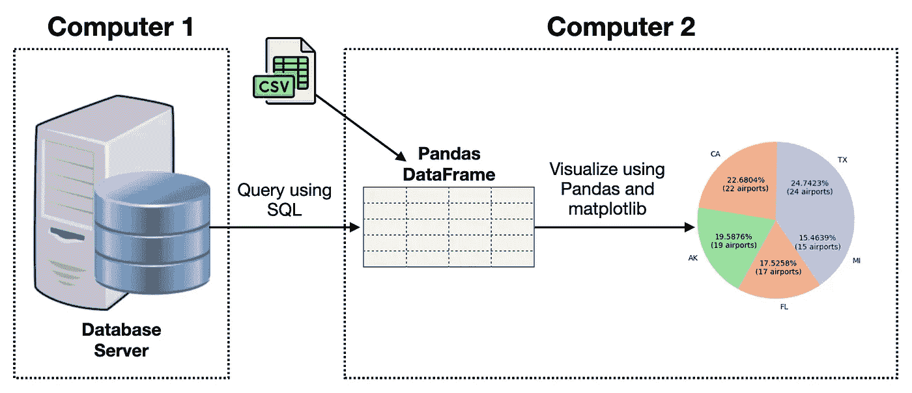

# 在 Jupyter Notebook 中使用 JupySQL、DuckDB 和 MySQL 运行 SQL 查询

> 原文：[`towardsdatascience.com/running-sql-queries-in-jupyter-notebook-using-jupysql-duckdb-and-mysql-3c53fbe40f8d?source=collection_archive---------7-----------------------#2023-02-24`](https://towardsdatascience.com/running-sql-queries-in-jupyter-notebook-using-jupysql-duckdb-and-mysql-3c53fbe40f8d?source=collection_archive---------7-----------------------#2023-02-24)

## 学习如何在 Jupyter Notebooks 中运行 SQL

 [魏梦·李](https://weimenglee.medium.com/?source=post_page-----3c53fbe40f8d--------------------------------)

·

[关注](https://medium.com/m/signin?actionUrl=https%3A%2F%2Fmedium.com%2F_%2Fsubscribe%2Fuser%2F6599e1e08a48&operation=register&redirect=https%3A%2F%2Ftowardsdatascience.com%2Frunning-sql-queries-in-jupyter-notebook-using-jupysql-duckdb-and-mysql-3c53fbe40f8d&user=Wei-Meng+Lee&userId=6599e1e08a48&source=post_page-6599e1e08a48----3c53fbe40f8d---------------------post_header-----------) 发布于 [Towards Data Science](https://towardsdatascience.com/?source=post_page-----3c53fbe40f8d--------------------------------) ·8 分钟阅读·2023 年 2 月 24 日

--

图片由 [Wafer WAN](https://unsplash.com/@waferwan?utm_source=medium&utm_medium=referral) 提供，来源于 [Unsplash](https://unsplash.com/?utm_source=medium&utm_medium=referral)

传统上，数据科学家使用 Jupyter Notebook 从数据库服务器或外部数据集（如 CSV、JSON 文件等）中提取数据，并将其存储到 Pandas 数据框中：

除非另有说明，否则所有图片均由作者提供

然后他们使用数据框进行可视化。这个方法有几个缺点：

+   查询数据库服务器可能会降低数据库服务器的性能，而该服务器可能没有针对分析工作负载进行优化。

+   将数据加载到数据框中会占用宝贵的资源。例如，如果目的是可视化数据集的某些方面，你需要首先将整个数据集加载到内存中，然后才能进行可视化。

为了提高上述性能，理想情况下，数据的处理（所有的数据整理和过滤）应该转移到一个能够高效执行数据分析的客户端，并将结果返回以用于可视化。这就是本文的主题 —— **JupySQL**。
