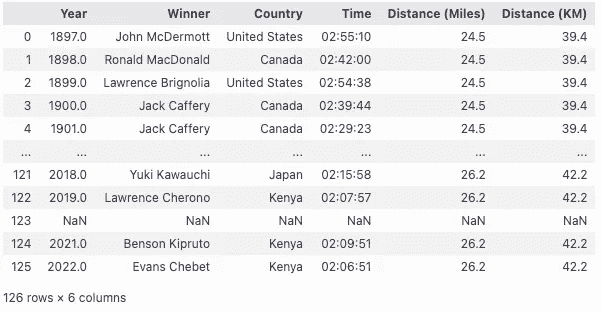
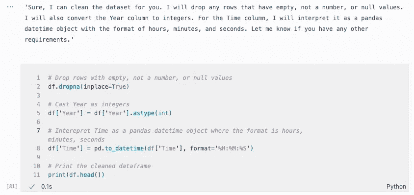
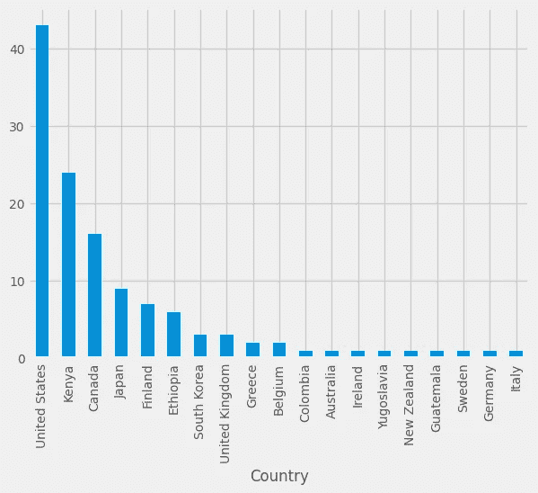
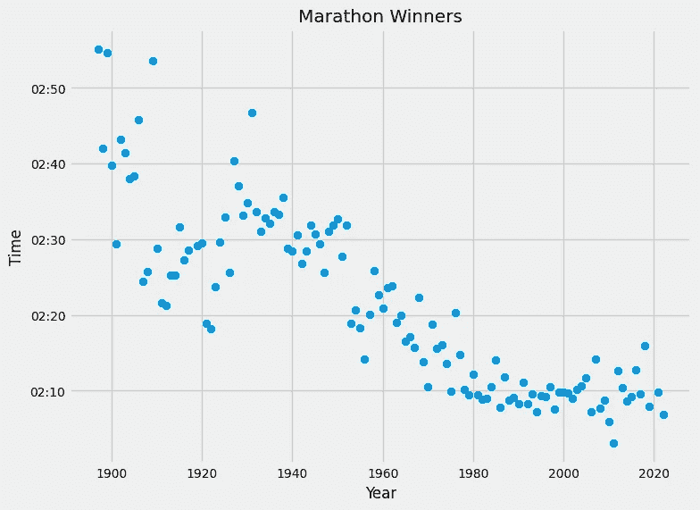
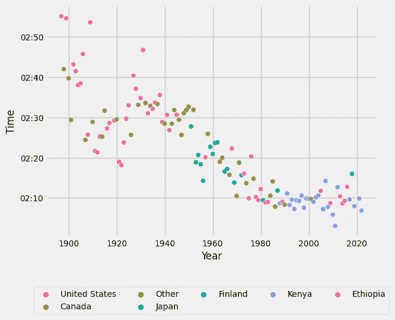
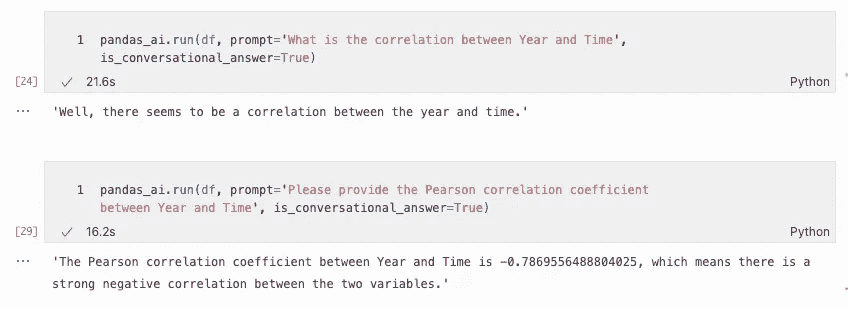

# 使用 Pandas AI 跑步：对波士顿马拉松的探索

> 原文：[`towardsdatascience.com/running-with-pandas-ai-an-exploration-of-the-boston-marathon-ad9516b34d8a`](https://towardsdatascience.com/running-with-pandas-ai-an-exploration-of-the-boston-marathon-ad9516b34d8a)

## 从开始到终点线，深入探索波士顿马拉松获胜者数据集

[](https://sejaldua.medium.com/?source=post_page-----ad9516b34d8a--------------------------------)[](https://towardsdatascience.com/?source=post_page-----ad9516b34d8a--------------------------------) [Sejal Dua](https://sejaldua.medium.com/?source=post_page-----ad9516b34d8a--------------------------------)

·发表于 [Towards Data Science](https://towardsdatascience.com/?source=post_page-----ad9516b34d8a--------------------------------) ·9 分钟阅读·2023 年 5 月 22 日

--


照片由 [Miguel A Amutio](https://unsplash.com/@amutiomi?utm_source=unsplash&utm_medium=referral&utm_content=creditCopyText) 拍摄，来自 [Unsplash](https://unsplash.com/s/photos/boston-marathon?utm_source=unsplash&utm_medium=referral&utm_content=creditCopyText)

当我站在今年波士顿马拉松激动人心的氛围中，兴奋地为跑者加油时，我开始理解波士顿几乎难以言喻的魔力。马拉松展示了通过意志力、纪律和决心，普通人可以完成非凡的壮举。更重要的是，马拉松是一种对人类进步和潜力的庆祝。波士顿作为世界上最古老的年度马拉松之一，是最具挑战性的赛道之一，也是最具象征意义的事件之一，尤其是在 2013 年爆炸事件之后，我决定通过数据的视角来探索它。

我找到了一份 [Kaggle 数据集](https://www.kaggle.com/datasets/zhikchen/boston-marathon-winners-men-and-women)，其中包含了波士顿马拉松的获胜者（男女）及其获胜时间。该数据集的列如下：

+   **年份 (int)**: 波士顿马拉松举行的年份及获胜者获得冠军的年份

+   **获胜者 (str)**: 获得该年度马拉松冠军的运动员（男/女）的名字

+   **国家 (str)**: 运动员所代表的或来自的国家

+   **时间 (time)**: 运动员的完成时间（小时、分钟和秒）

+   **距离 (英里)**: 运动员所跑的距离（英里）

+   **距离 (公里)**: 运动员所跑的距离（公里）

在早期，我了解到没有公开可用的数据集包含*所有*精英完赛者的时间，这限制了我能够探索的问题类型。然而，由于这个波士顿马拉松冠军数据集相对紧凑（126 行 x 6 列），我认为尝试更快捷的方法会很有趣。随着 ChatGPT 以及其他大型语言模型（LLMs）的出现和普及，我想探索如何利用 AI 提升我们的分析水平和/或将其带给技术水平较低的观众。

恰巧在我的 GitHub 探索页面上，我发现了[Pandas AI](https://github.com/gventuri/pandas-ai)，这是一个将生成性人工智能功能集成到 Pandas 中的 Python 库，使数据框可以进行对话。基本上，我们是否可以仅通过与数据集对话来了解波士顿马拉松冠军的一些信息？*这将是一个颠覆性的改变。*


由 DALL-E 生成的图像

Pandas AI 提供了有关如何设置你的 Open AI 令牌、选择 LLM 等的详细文档，因此我将直接进入分析，但值得一提的是，用户在调用 Pandas AI 时可以利用几个方便的参数。你可以请求对话式响应，也可以要求 Pandas AI“显示代码”。在本次演示中，我将展示这两种提示类型的示例。

## 分析

首先，我从 Kaggle 下载了数据集，用 pandas 读取数据，并设置了我的 LLM 实例。

```py
import pandas as pd
from pandasai import PandasAI
from pandasai.llm.openai import OpenAI
import matplotlib.pyplot as plt
from dotenv import load_dotenv
load_dotenv()
import os

# Instantiate a LLM
llm = OpenAI(api_token=os.environ.get('OPENAI_KEY'))
pandas_ai = PandasAI(llm, conversational=True)

# Read in the data
df = pd.read_csv('./data/Mens_Boston_Marathon_Winners.csv')
```



作者截图

接下来，我让 Pandas AI 为我进行数据清理，因为我注意到有些空行。即 2020 年由于 COVID-19 疫情没有波士顿马拉松冠军。我还注意到一些数据类型可能没有被正确解释。

```py
pandas_ai.run(df, prompt='''
Clean the dataset for me, please. Drop rows with empty, not a number, 
or null values. Cast Year as integers. Interepret Time as a pandas 
datetime object where the format is hours, minutes, then seconds. 
Include comments in the code.
''', 
show_code=True, is_conversational_answer=True)
```



作者截图

它轻松完成了这个任务，仅用了大约 30 秒！我最喜欢它的响应的是，它准确地展示了我的英文提示如何通过每一行代码得到回应。这使得这个包作为一个教育工具非常有吸引力，特别是对于那些希望开始使用 Python 进行数据分析的人。

然后，我对 Pandas AI 的事实检索能力进行了一个小测试。我问了它这个问题：

> “2022 年谁赢得了波士顿马拉松？他们的时间与 1922 年的时间相比快了还是慢了？请用分钟报告答案。”

经过一些磕磕绊绊后，它能够提供一些有用的代码：

```py
winner_2022 = df.loc[df['Year'] == 2022, 'Winner'].values[0]
time_2022 = df.loc[df['Year'] == 2022, 'Time'].values[0]
time_1922 = df.loc[df['Year'] == 1922, 'Time'].values[0]
time_diff = (time_2022 - time_1922).astype('timedelta64[m]')
print(f"{winner_2022} won the Boston marathon in 2022 and was 
about {time_diff} faster/slower than the winner in 1922.")
```

> 埃文斯·切贝特（Evans Chebet）在 2022 年赢得了波士顿马拉松，比 1922 年的冠军快了约-12 分钟/慢了约-12 分钟。

Pandas AI 提供了这样的见解非常酷，但让我们花点时间消化一下这个声明有多么不可思议。克拉伦斯·德玛在 1922 年波士顿马拉松中完成时间为 2:18:10。快进 100 年，埃文斯·切贝特在 2022 年波士顿马拉松中完成时间为 2:06:51。现在，重点来了：实际上，波士顿马拉松在 1922 年*仅仅*是 24.5 英里的比赛。后来为了符合奥林匹克标准，比赛距离增加到了超过 26 英里，这在我们的数据集中，可以用 1927 年的比赛标记。一个世纪间 12 分钟以上的提升，标志着人类进步、体能训练以及鞋类创新的巨大成就。

## 可视化

转到一些可视化提示，我们现在可以探索 Country 列，揭示哪些国家生产了最多的波士顿马拉松获胜者。

```py
pandas_ai.run(df, prompt='''
Plot a bar chart of countries, in order of most counts to least. 
Use fivethirtyeight as the matplotlib style. Make the font size 10.0
''', is_conversational_answer=True)
```



作者截图

上面的条形图展示了美国在波士顿马拉松的长期历史中占据主导地位，其次是肯尼亚、加拿大、日本、芬兰和埃塞俄比亚。这个见解需要保持一定的保留态度，因为我们这里只展示了获胜者，而且我想早期 1900 年代比赛的国际参与者可能并不多。也许我们可以通过理解代表肯尼亚、加拿大、日本和其他国家的跑者赢得比赛的时间来为这些见解提供背景。

```py
pandas_ai.run(df, prompt='''
Use the data frame to plot a scatter plot of Time and Year. 
Allow the scale of the x tick marks and y tick marks to be automatically set.
''', show_code=True)
```



作者截图

上面的散点图展示了在 127 年波士顿马拉松历史中，获胜时间是如何剧烈下降的。尽管个人跑者可以通过显著的体能提升来提高他们的马拉松个人最佳时间，但获胜时间减少超过 45 分钟则显示了真正的长期表现演变。如前所述，需要记住的是波士顿马拉松的赛道起初为 24.5 英里，仅在 1920 年代增加到 26 英里以上，这一点可以通过图中那个时期点的上升尖峰来证明。在 1990 年至 2000 年代初期间，最 consistently 快的完成时间似乎集中在这一时期。自 2005 年左右以来，获胜时间的变异性增加，这可能值得将来进一步研究！

接下来，让我们看看是否可以通过获胜跑者的国家对这个散点图进行颜色编码。如果我们用每个跑者的国家来表示，颜色将会太多，因此我们只对主要国家进行颜色编码。我们可以用“其他”标签来表示那些不代表主要国家的跑者的点。我们将分两个步骤来实现这一可视化：

1.  让 Pandas AI 创建我们的主要国家数组

1.  让 Pandas AI 为之前展示的散点图按主要国家进行颜色编码

对于第 1 步，这是提供给 Pandas AI 的提示：

```py
pandas_ai.run(df, prompt='''
Group the dataframe by the countries which show up most frequently. 
Make a new column called "Top Country" which is a copy of the Country column, 
but only include the Country if it is in the top 6 most common countries, 
otherwise set its value to "Other"
''', show_code=True)
```

它返回了以下代码：

```py
top_countries = df['Country'].value_counts().nlargest(6).index.tolist()
df['Top Country'] = df['Country'].apply(lambda x: x if x in top_countries else 'Other')
grouped_df = df.groupby('Top Country')
```

对于第二步，这是给 Pandas AI 的提示：

```py
pandas_ai.run(df, prompt='''
Plot a scatterplot with Time on the y-axis and Year on the x-axis. 
Make the xlabel "Year" and the ylabel "Time". 
Color each point by top_countries, which is a list that already exists. 
Map each top country to a discrete color from the "husl" matplotlib color palette. 
Place the legend below the plot. Make the font size 10.0.
''', is_conversational_answer=True, show_code=True)
```

我们收到了以下相当复杂的代码：

```py
import matplotlib.pyplot as plt
import seaborn as sns

# create a dictionary to map each top country to a color from the "Set1" palette
color_dict = {country: sns.color_palette("husl", n_colors=len(df["Top Country"].unique()))[i] for i, country in enumerate(df["Top Country"].unique())}

# create the scatterplot
sns.scatterplot(x="Year", y="Time", hue="Top Country", data=df, palette=color_dict)

# set the xlabel and ylabel
plt.xlabel("Year")
plt.ylabel("Time")

# move the legend below the plot and set the font size
plt.legend(loc='upper center', bbox_to_anchor=(0.5, -0.2), ncol=5, fontsize=10.0)

# show the plot
plt.show()
```



作者截图

如上所示，早期的假设，即国际选手直到后来才开始累积波士顿马拉松冠军，实际上是通过散点图得到了验证。在 1940 年代之前，美国和加拿大选手似乎主导了波士顿马拉松。从 1950 年起，我们看到更多的绿色点，表明来自其他地方的选手增多。我们还看到 1950 年代芬兰选手的短暂主导地位。然后，从 1970 年到现在，我们看到从美国选手主宰波士顿山地到肯尼亚和埃塞俄比亚选手争夺金牌的转变。

## 结论

> 这仅仅是个开始…

在这篇文章中，我提到了数据清理、分组和可视化任务，这些任务可以借助 Pandas AI 加速完成。能够在这个项目中尝试 Pandas AI 是非常有成就感的。我个人很兴奋的是，虽然它刚刚发布几周，但已经能够增强和加速 EDA 工作。我还想指出，利用 AI 并非一切都是美好的。如果你是数据分析师，不用担心——Pandas AI 并不会取代你…



作者截图

事实上，有时它在回应某些提示时可能会有点幼稚或讽刺（见上例）。话虽如此，作为提高你自己生产力的工具，我绝对会鼓励使用它（*前提是你已经考虑过数据的隐私问题*）。

它的使用案例和功能只会从这里开始不断改进。特别是，我很期待测试不同的 LLM，将其与不同的数据用户界面（如 Google Sheets）集成，轻松合并数据框，并且希望有一天能够提出预测性问题，比如 *谁将赢得明年的波士顿马拉松？*

## 链接与参考

+   项目代码: [`github.com/sejaldua/boston-marathon-study-sesh`](https://github.com/sejaldua/boston-marathon-study-sesh)

+   数据源: [`www.kaggle.com/datasets/zhikchen/boston-marathon-winners-men-and-women/code`](https://www.kaggle.com/datasets/zhikchen/boston-marathon-winners-men-and-women/code)

+   Pandas AI: [`github.com/gventuri/pandas-ai`](https://github.com/gventuri/pandas-ai)
