# Rust Polars：解锁高性能数据分析 — 第一部分

> 原文：[`towardsdatascience.com/rust-polars-unlocking-high-performance-data-analysis-part-1-ce42af370ece?source=collection_archive---------0-----------------------#2023-05-11`](https://towardsdatascience.com/rust-polars-unlocking-high-performance-data-analysis-part-1-ce42af370ece?source=collection_archive---------0-----------------------#2023-05-11)

## 探索 Rust Polars 的世界，系列及更多

[](https://wiseai.medium.com/?source=post_page-----ce42af370ece--------------------------------)[](https://towardsdatascience.com/?source=post_page-----ce42af370ece--------------------------------) [Mahmoud Harmouch](https://wiseai.medium.com/?source=post_page-----ce42af370ece--------------------------------)

·

[跟进](https://medium.com/m/signin?actionUrl=https%3A%2F%2Fmedium.com%2F_%2Fsubscribe%2Fuser%2Fb15db3da5667&operation=register&redirect=https%3A%2F%2Ftowardsdatascience.com%2Frust-polars-unlocking-high-performance-data-analysis-part-1-ce42af370ece&user=Mahmoud+Harmouch&userId=b15db3da5667&source=post_page-b15db3da5667----ce42af370ece---------------------post_header-----------) 发表在 [Towards Data Science](https://towardsdatascience.com/?source=post_page-----ce42af370ece--------------------------------) ·32 min 阅读·2023 年 5 月 11 日[](https://medium.com/m/signin?actionUrl=https%3A%2F%2Fmedium.com%2F_%2Fvote%2Ftowards-data-science%2Fce42af370ece&operation=register&redirect=https%3A%2F%2Ftowardsdatascience.com%2Frust-polars-unlocking-high-performance-data-analysis-part-1-ce42af370ece&user=Mahmoud+Harmouch&userId=b15db3da5667&source=-----ce42af370ece---------------------clap_footer-----------)

--

[](https://medium.com/m/signin?actionUrl=https%3A%2F%2Fmedium.com%2F_%2Fbookmark%2Fp%2Fce42af370ece&operation=register&redirect=https%3A%2F%2Ftowardsdatascience.com%2Frust-polars-unlocking-high-performance-data-analysis-part-1-ce42af370ece&source=-----ce42af370ece---------------------bookmark_footer-----------)

[Kaiwen Sun](https://unsplash.com/@ksun?utm_source=medium&utm_medium=referral) 在 [Unsplash](https://unsplash.com/?utm_source=medium&utm_medium=referral) 上的照片

## 简而言之

在快速发展的数据科学领域，跟上新进展可能令人望而生畏。然而，Rust 已被证明是这一行业中可靠且至关重要的工具。目前，Polars 是 Rust 中最受欢迎的数据操作库之一。

这篇文章作为一个关于在 Polars 中对 Series 进行数据分析相关任务的密集课程。通过实际操作和代码片段，您将掌握关键技能，如在 Series 上执行各种操作以及处理时间序列等。最终目标是为像您这样的读者提供足够的知识，使得执行预处理活动成为一种本能！

> **注意：** 本文假定您对 Rust 编程语言有基本的了解。
> 
> 名为 [**3-polars-tutorial-part-1.ipynb**](https://github.com/wiseaidev/rust-data-analysis/blob/main/3-polars-tutorial-part-1.ipynb) 的笔记本专门为本文撰写，您可以在以下存储库中找到：

[](https://github.com/wiseaidev/rust-data-analysis?source=post_page-----ce42af370ece--------------------------------) [## GitHub - wiseaidev/rust-data-analysis: The ultimate data analysis with Rust course.

### 这个存储库是由 Rust 内核支持的 Jupyter 笔记本的集合。有了这些笔记本，您将…

github.com](https://github.com/wiseaidev/rust-data-analysis?source=post_page-----ce42af370ece--------------------------------)

## 目录表格（TOC）

∘ 介绍

∘ 历史背景

∘ 核心组件

∘ 应用场景

∘ 架构

∘ 核心对象

∘ 系列对象

∘ 描述性统计

∘ 中心趋势测量

∘ 传播测量

∘ 结论

∘ 结束语

∘ 资源

## 介绍


Photo by [Raimond Klavins](https://unsplash.com/@raimondklavins?utm_source=medium&utm_medium=referral) 在 [Unsplash](https://unsplash.com/?utm_source=medium&utm_medium=referral)

[**Polars**](https://github.com/pola-rs/polars) 是数据科学和机器学习社区中非常流行的开源库，是进行数据操作、准备和分析的强大工具。它不仅不依赖于特定的编程语言（例如可以与 [**Python**](https://pola-rs.github.io/polars/py-polars/html/reference/index.html), [**Rust**](https://pola-rs.github.io/polars/polars/index.html), [**Node.JS**](https://pola-rs.github.io/nodejs-polars/index.html) 甚至 [**R**](https://rpolars.github.io/index.html) 配合使用），而且还具有加载不同格式数据以及操作复杂数据集的各种功能，使其成为进行任何形式复杂分析任务时的首选标准。为了充分理解它在今天的重要性，我们必须深入了解其起源，以理解它如何随着时间的推移而发展。

## 历史背景

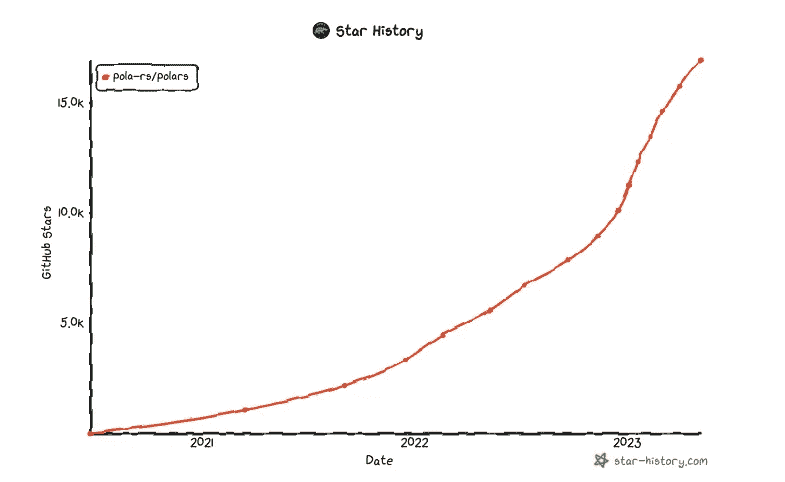

Polars 星历史（由作者生成的图像，来自 [star-history.com](https://star-history.com/)）

[在 2020 年](https://github.com/pola-rs/polars/commit/2714893dd8061644a7aa0fe0e983c2faf17d18c1)，有远见的[Ritchie Vink](https://www.ritchievink.com/about/)从结构工程转行到数据工程，发现市场上对更好数据科学工具的需求未得到满足。对现有工具不满，他决定创建一些真正卓越的东西： [Polars](https://github.com/ritchie46/polars)。

这个出色的工具不仅优雅直观，而且代码量少却性能极高。自诞生以来，由于其无与伦比的处理复杂分析任务和轻松操作大量数据的能力，它在数据科学社区内成为了一场革命。

难怪 Polars 迅速成为今天全球最受欢迎的数据科学工具之一。我们可以说，这个库在某种程度上促使 Rust 编程语言获得了更多的关注！

Polars 在处理各种数据类型方面表现出色，如“表格数据”、“有序数据”、“观察统计数据”等等。

表格数据作为一种数据类型，其中包含不同类型的数值、文本或分类值填充的行和列。另一种形式是有序或无序的系列数据，本质上是包含按顺序或随机排列的数字的列表。

多维矩阵是另一种需要考虑的类型；这些矩阵可以有三维、四维……甚至更多！它们通常用于科学计算和图像处理。最后但同样重要的是，来自多个来源如 SQL 数据库的观察统计数据；它们为我们社会中的复杂问题提供了独特的视角。

## 核心组件

Polars 是数据操作和分析的有效工具。为了高效使用它，理解其结构至关重要。因此，让我们深入了解构成这个 Polars 库的各种组件。

+   `[**Polars/algo**](https://github.com/pola-rs/polars/tree/main/polars/polars-algo)`：这个模块提供的功能确实很了不起，包括 qcut、cut 和 hist。这些函数使用户能够轻松进行复杂计算，同时生成详细的统计数据，无论是对系列还是数据框。

+   `[**Polars/arrow**](https://github.com/pola-rs/polars/tree/main/polars/polars-arrow)`：Polars 的 arrow 组件包含数组转换、数据类型和内核的实现。这个组件使得在不同格式之间转换数据变得更加容易，例如 Polars 数据框和 Apache Arrow 数组。

+   `[**Polars/core**](https://github.com/pola-rs/polars/tree/main/polars/polars-core)`：此组件实现了 Polars 的基础数据结构，包括 Series 和 DataFrames。这些数据结构对于有效地处理数据至关重要，通过提供过滤、分组和合并操作等多种功能来支持各种分析任务。

+   `[**Polars/io**](https://github.com/pola-rs/polars/tree/main/polars/polars-io)`：此模块包含文件和数据的输入输出组件，简化了过程。它们使我们能够轻松从各种来源导入数据，包括 CSV 和文本文件，同时允许轻松导出为文本或 CSV 等格式。这种功能简化了在多个平台之间读取和写入数据的过程，从而提高了处理大量数据时的效率。

+   `[**Polars/lazy**](https://github.com/pola-rs/polars/tree/main/polars/polars-lazy)`：Polars 中的懒惰 API 提供了一种高效的数据分析方法，支持急切 API 的一个子集。此功能类似于 Apache Spark 的查询语言，其中特定领域的查询转换为逻辑计划，概述了执行过程中每一步的操作。在运行这些计划之前，它们会被优化以实现最大性能，通过必要时重新排列操作并添加隐式类型转换，以防止在运行时发生潜在错误。

+   `[**Polars/ops**](https://github.com/pola-rs/polars/tree/main/polars/polars-ops)`：此 Polars 模块提供了强大的工具来处理 DataFrames 和 Series 上的复杂操作。这些高级功能使我们能够轻松提取唯一值、执行整除、计算对数、透视表和连接 DataFrames。此外，这些操作经过优化，性能极快，非常适合处理大型数据集！`Polars/ops`组件内的功能使数据处理变得轻而易举，让分析师能够无缝分析数据，挖掘有价值的见解。

+   `[**Polars/row**](https://github.com/pola-rs/polars/tree/main/polars/polars-row)`：该模块具有一个显著的功能，包括提供额外实用工具的算法，这些功能包括多种编码技术，如整数编码、浮点编码和字典编码，以减少大型数据集所需的存储空间。此外，排序机制如 null 排序算法或反向列排序有助于高效组织和分类数据，特别是在处理大量信息时。利用此组件可以显著提高处理和分析数据集的效率。

+   `[**Polars/SQL**](https://github.com/pola-rs/polars/tree/main/polars/polars-sql)`：该模块包含许多算法，简化了 SQL 数据库与 Polars 函数之间的交互。这些方法包括选择查询、连接操作和其他数据检索技术，简化了与 SQL 数据库的工作。这个功能对于需要访问存储在这些系统中的信息的数据科学家尤其有用，因为他们可以轻松地将其集成到他们的分析中，使用 Polars/sql 功能。

+   `[**Polars/time**](https://github.com/pola-rs/polars/tree/main/polars/polars-time)`：这个 Polars 组件包含处理时间记录和时间序列数据的功能。时间序列数据是基于时间索引的，例如股票价格或天气数据。Polars/time 提供了处理时间数据的功能，如在不同时间格式之间转换、执行时间序列算术运算以及重新采样时间序列数据。这个 Polars 组件对于任何处理时间序列数据的数据科学家来说都是必不可少的。

+   `**p**[**olars/util**](https://github.com/pola-rs/polars/tree/main/polars/polars-utils)`：该模块包含有助于调试的工具。这个模块提供了一系列功能和技术，用于跟踪错误、显示调试数据以及评估代码性能。该模块中的实用工具对于解决在使用 Polars 时遇到的任何问题并提高代码效率，进行更有效的数据操作和分析都非常有帮助。

了解这些组件将使你能够高效地操作和分析数据。

## 使用案例


Polars 使用案例（图片由作者提供）

Polars 具有在各种领域应用的潜力。它帮助专家从数据分析中获得有价值的见解，并做出明智的结论。以下是 Polars 应用的一些领域：

+   **推荐系统**：推荐系统是像 Netflix 和 Amazon 这样的公司强大的工具，因为它们利用数据为用户提供个性化推荐。通过分析用户行为和偏好，Polars 可以帮助做出量身定制的推荐，增加用户参与度，同时推动收入增长。这使得推荐系统在任何公司通过定制内容建议提供卓越客户体验的战略中变得至关重要。

+   **市场营销**：在市场营销中实施 Polars 可以帮助分析消费者行为、偏好和购买模式。这使得公司可以更好地理解目标受众，从而对广告活动做出明智的决策。企业可以通过利用数据驱动的洞察来优化广告效果，从而提高(ROI)。

+   **股票预测**：金融行业可以利用 Polars 来分析过去和现在的财务数据，从而预测股票价格并监控市场趋势。通过检测这些信息中的模式，投资者获得了做出明智投资决策所需的知识——这种决策可能带来显著的经济回报。

+   **神经科学**：Polars 在神经科学领域具有潜力，用于检查和呈现复杂的神经信息。研究人员可以利用 Polars 的特殊数据分析功能，提取有关脑功能和行为的重要知识。

+   **自然语言处理**：NLP 是一个令人印象深刻的工具，可以有效地分析和预处理文本数据。Polars 为企业提供了处理大量客户情感信息的能力，从而在产品开发和服务交付中做出明智决策。NLP 完成的任务包括情感分析、主题建模和文本分类，这些任务提供了有关客户需求的宝贵洞察，同时指导公司朝着数据驱动的改进方向前进，以提供更高质量的产品。

鉴于以上使用案例，你可以看到 Polars 具有广泛的应用，显著影响我们的日常生活。通过掌握这个库，你可以投资于你的分析职业，并在各个行业解锁众多机会。这将为你在当今数据驱动的世界中提供竞争优势。

## 架构

Polars 是一个非常强大的数据处理工具，利用 [**Apache Arrow**](https://arrow.apache.org/) 作为其核心，提供闪电般的计算性能。专为处理大型数据集和执行复杂操作而设计，具有毫不费力的高效性。与其他仅利用 Arrow 读取 **Parquet 文件** 的库不同，Polars 具有强大的集成。它采用基于 Rust 的 Arrow 内存格式实现，按列存储数据，使 Polars 能够利用高度优化和高效的 Arrow 数据结构，同时专注于处理存储的信息。

展望未来的发展，Polars 正在积极扩展其分发系统能力，通过 [**DataFusion**](https://arrow.apache.org/datafusion/) —— 一个旨在成为当今最先进系统之一的新平台！虽然这项创新技术与 [**Apache Spark**](https://spark.apache.org/) 或其他现有竞争产品之间可能存在一些重叠，但请放心，Polars 团队致力于利用通过与 Arrows 后端架构集成提供的每一个可能的优势——确保在每个计算过程中最大限度地提升性能！

## 核心对象

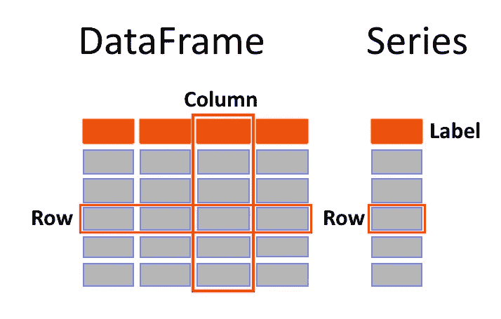

Polars 数据帧和系列表示（作者提供的图片）

在本节中，我们将探索 Polars 的基本概念。为了提升学习体验，[**Jupyter Notebook**](https://github.com/wiseaidev/rust-data-analysis/blob/main/3-polars-tutorial-part-1.ipynb) 被用来执行本文中的代码片段。众所周知，[**Jupyter**](https://jupyter.org/) 是一个通过任何网页浏览器访问的交互式计算平台，使我们能够创建和分享包含实时代码、可视化和解释性文本的文档，使学习变得比以往更具吸引力！

## Series 对象

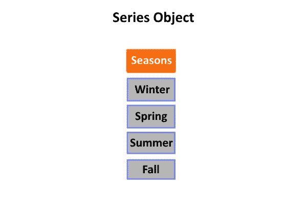

系列对象表示（作者提供的图片）

要全面理解如何使用**Polars**进行**数据清洗**，首先需要从基础开始。这包括处理一维数据，通常用**Series** **对象**来表示。

**Series 对象** 是 Polars 中一个重要的数据结构，表示一维数据，简称 1-D 信息。它结合了 [**vector**](https://doc.rust-lang.org/std/vec/struct.Vec.html) 和 [**HashMap**](https://doc.rust-lang.org/std/collections/struct.HashMap.html) 的特性，具有**有序序列**和**标签**，便于检索。一个简单的类比是想象一列存储实际数据值并附有标签。这使得在代码中管理大量结构化数据变得更加方便和高效。

要在 Polars 中创建一个 Series 对象，请使用 `[**Series::new**](https://docs.rs/polars/latest/polars/prelude/struct.Series.html#method.new-37)` 方法进行初始化。这个强大的函数允许创建具有指定值和推断数据类型的自定义 Series 对象，以满足您的需求。这个过程可以通过以下代码进行演示。通过使用 `[**Series::new**](https://docs.rs/polars/latest/polars/prelude/struct.Series.html#method.new-37)` 方法，我们可以创建一个标记为 `**series**` 的 Series 对象，并为其分配值 `**[1, 2, 3]**`。

```py
use polars::prelude::*;

let series: Series = [1, 2, 3].iter().collect();

// or

let series: Series = Series::new("", &[1, 2, 3]);

println!("{:?}", series);
```

在 Jupyter notebook 单元格中运行上述代码将产生以下输出：

```py
shape: (3,)
Series: ‘’ [i32]
[
 1
 2
 3
]
```

使用 `**Series::new**` 方法创建的 Series 对象的输出显示了 Polars 中一维数据的表示。Series 对象包含一个带标签的有序值序列，以便于轻松检索。索引默认为整数，从 0 开始，每个值的索引递增 1。

值得注意的是，Series 对象在定制化方面相对于其他数据结构具有显著优势。列名用于更好地理解数据。可以将它们视为标签，以更好地理解每一列/特征。

Polars 的系列对象非常灵活，支持多种数据类型，如整数、字符串、布尔值或日期时间值。要创建一个只包含字符串的新系列对象，命名为`**series**`，请使用`**Series::new**`方法，同时传入一个包含`**string**`对象的向量，以将其存储为字符串。

```py
let seasons_ser: Series = Series::new("seasons", &["Winter", "Spring", "Summer", "Fall"]);
println!("{:?}", seasons_ser);
```

运行这段代码将产生以下输出：

```py
shape: (4,)
Series: 'seasons' [str]
[
    "Winter"
    "Spring"
    "Summer"
    "Fall"
]
```

结果是一个在终端上很好地呈现的系列对象。我们可以看到，Polars 已自动识别此系列中的数据类型为`**str**`，并将`**dtype**`属性设置为适当的值。

在**Python**中，处理数据时，常会遇到由 None 类型表示的缺失或空值。然而，当处理像 Python pandas 系列对象那样的有类型列表时，我们必须以不同的方式处理这些缺失值。在这种情况下，[**Pandas**](https://pandas.pydata.org/getting_started.html)会自动将列表转换为对象类型数组，并插入一个`**None**`的占位符值。

为了更好地理解这个概念，我们考虑一个场景，其中有一个季节列表，但一个季节没有名称；我们可以使用`**None**`来表示缺失的信息。

```py
>>> import pandas as pd
>>> seasons = ["Winter", "Spring", "Summer", None]
>>> pd.Series(seasons)

0    Winter
1    Spring
2    Summer
3      None
dtype: object
```

当在**Pandas**中创建包含至少一个`**None**`实例的字符串时，结果系列将被转换为对象类型数组，同时插入`**None**`作为其指定的替代值，从而在数据集中保持其他元素的数据类型的一致性。

以下示例展示了**Pandas**如何处理整数列表中的**null 值**。在这种情况下，**Pandas**会将数据类型转换为浮点数，并生成一个`**NaN**`值。这一功能非常有用，因为它确保了在所有数据类型中表示缺失信息时的一致性。

```py
>>> numbers = [1, 2, None]
>>> pd.Series(numbers)
0    1.0
1    2.0
2    NaN
dtype: float64
```

重要的是要认识到，`**NaN**` 是合法的浮点数，并符合[**IEEE-754 标准**](https://en.wikipedia.org/wiki/IEEE_754)。因此，它可以在数学计算和比较中使用，而不会触发错误。

然而，在**Rust**中，处理整数时，`**None**`值会转换为`**Null**`。虽然乍看之下这似乎是一个微不足道的差异，但在处理大型数据集或进行复杂分析时，可能会对数据类型的保持产生重要影响。

```py
let s: Series = Series::new("seasons", &[None, Some(1), Some(2)]);

// Output:

// shape: (3,)
// Series: 'seasons' [i32]
// [
//  null
//  1
//  2
// ] 
```

如前所述，经过对 **Rust Polars** 中创建 Series 对象过程的深入观察，与 **Python Pandas** 相比，存在一些明显的差异。首先，Rust Polars 使用 null 值表示缺失数据，而不是 **Python Pandas** 中的 **NaN** 值。其次，**Rust Polars** 将 Series 的数据类型设置为 **32 位整数**，而不是像 **Python Pandas** 中那样自动转换为 **浮点数**。这种行为差异可以归因于 Rust 的显式类型系统，它会隐式地分配数据类型。因此，指定 dtype 为 `**int**` 是合适的，因为 1 和 2 是整数。另一方面，在 **Python pandas** 中，缺失数据通过将 **None** 值转换为 **NaN**（浮点数）来表示，而 **整数** 可以 **cast** 为 **float**。

在使用 **Rust** 进行科学计算时，强调 **None** 和 **NaN** 的表示差异至关重要。虽然数据科学家可能会交替使用它们来表示缺失数据，但在底层它们并不以相同的方式表示。一个关键点是 **NaN** 不等于 **None**，并且它们之间的等式测试总是会返回 **False**。

在 Rust 中，**NaN** 不能与自身比较。因此，尝试这样做将产生 **False** 结果。这突显了 **NaN** 与任何值，包括自身，都不等同。

```py
Some(f64::NAN)==None
// false
f64::NAN==f64::NAN
// false
```

因此，在处理包含 `**NaN**` 值的数据时，必须妥善处理这些值。

必须注意的是，**Rust Polars** 将 null 值计为零，删除它们不会消除这些值。这是因为 **Rust Polars** 中的 null 值与 `**NaN**` 不同，后者用一个独特的值表示缺失数据。因此，理解数据集中缺失信息的出现方式对数据的准确分析和处理至关重要。

```py
let s: Series = Series::new("numbers", &[Some(f64::NAN), Some(1.), Some(2.)]);

println!("{:?}", s.null_count());

// Output:

// 0

s.drop_nulls()

// Output:

// shape: (3,)
// Series: 'numbers' [f64]
// [
//     NaN
//     1.0
//     2.0
// ]
```

无疑可以将序列的元素从一种数据类型转换为另一种数据类型。例如，考虑我们之前的示例及其转换为整数值。下面的代码片段有效地演示了这种转换：

```py
let s: Series = Series::new("numbers", &[Some(f64::NAN), Some(1.), Some(2.)]);
println!("{:?}", s.cast(&DataType::Int64).unwrap());

// Output:

// shape: (3,)
// Series: 'numbers' [i64]
// [
//     null
//     1
//     2
// ]
```

`[**cast**](https://docs.rs/polars/latest/polars/prelude/struct.Series.html#method.cast)` 函数用于将初始的 `**s**` 序列转换为新的 **64 位整数** 类型序列。返回值可以使用 `**println!**` 宏进行显示，但值得注意的是，转换后 `**NaN**` 值将变为 null。

重要的是要记住，将一个系列从一种数据类型转换为另一种数据类型可能会导致某些值的丢失或修改。例如，如果你将一个 **浮点系列** 转换成 **整数** **系列**，所有的小数点将会被 **截断**。此外，尝试将系列中的 **非数值** 数据转换为 **数值** 类型会导致错误。因此，执行任何潜在转换之前，务必要全面谨慎地权衡其后果。

## 系列创建

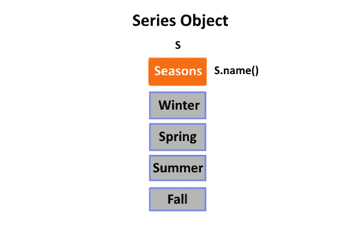

系列对象（图片由作者提供）

本节集中于使用 Polars 创建数据系列。**据我了解**，Polars 提供了 **四种不同的方法** 来创建系列，每种方法都针对特定的需求。创建系列的主要原因是为了处理 **带标签的** **数据**。

初始方法涉及通过利用 `[**new_empty**](https://docs.rs/polars/latest/polars/prelude/struct.Series.html#method.new_empty)` 方法从头创建一个数组：

```py
let s = Series::new_empty("Height", &DataType::Float32);
println!("{:?}", s);

// Output:

// shape: (0,)
// Series: 'Height' [f32]
// [
// ]
```

生成系列的第二种技术是 **利用数据数组**。这一过程涉及直接从给定的集合构建系列，并根据其中包含的值确定其结果数据类型。如果其值是字符串，则 `**str**` 将被指定为该系列实例的结果数据类型。

```py
let s: Series = Series::new("employees", &["Mahmoud", "Ferris"]);
println!("{:?}", s);

// Output:

// shape: (2,)
// Series: 'employees' [str]
// [
//     "Mahmoud"
//     "Ferris"
// ]
```

输出显示由于字符串数据类型，Polars 将 `**str**` 指定为系列的数据类型。在创建系列之后，我们可以使用名称函数检索其名称对象。

```py
s.name()

// Output

// "employees"
```

你也可以使用向量方法来创建系列。通过利用 `[**vec!**](https://doc.rust-lang.org/std/macro.vec.html)` 宏，我们可以创建一个向量，并获得一个与原始向量数据类型相同的系列。当你已经拥有以向量形式存在的数据时，这种方法特别有用，可以方便地转换成系列格式。

```py
let s: Series = Series::new("employees", &vec!["Mahmoud", "Ferris"]);
println!("{:?}", s);

// Output:

// shape: (2,)
// Series: 'employees' [str]
// [
//     "Mahmoud"
//     "Ferris"
// ]
```

此操作的输出与之前的方法相同。

通过利用像 `[**UInt32Chunked**](https://docs.rs/polars/latest/polars/prelude/type.UInt32Chunked.html)` 这样的分块类型，可以实现第四种创建系列的方法。这种技术在处理大规模数据集时特别有用，使你能够从这些数据类型中创建一个系列。将分块类型转换为系列后，其结果数据格式将与原始格式保持一致。

```py
let s = Float64Chunked::new("b", &[1., 2., 3.]).into_series();
println!("{:?}", s);

// Output:

// shape: (3,)
// Series: 'b' [f64]
// [
//     1.0
//     2.0
//     3.0
// ]
```

此操作的输出按预期显示系列的数据元素。

总结来说，本节重点介绍了使用 **Polars** 创建数据系列的四种技术。这些技术包括直接从数据数组创建系列，使用 `**vec!**` 宏创建向量，以及使用像 `**UInt32Chunked**` 这样的分块类型生成序列。每种方法的实用性取决于数据集的性质和结构。因此，在处理 Polars 中的 Series 时，我们可以利用这些方法。

## Datetime 类型

Rust 中的 `[**chrono**](https://docs.rs/chrono/latest/chrono/)` crate 是管理日期和时间的强大工具。借助其提供的功能，我们可以轻松地创建适用于各种用例的 **DateTime** 数据字段。给定的代码片段演示了如何将创建的 **DateTime** 数据字段集成到一个 Series 中，以便进一步操作。

```py
let date: DateTime<Utc> = Utc.with_ymd_and_hms(2020, 1, 1, 0, 0, 0).unwrap();
let s = Series::new("b", &[date.date_naive()]);
println!("{:?}", s);

// shape: (1,)
// Series: 'b' [date]
// [
//     2020-01-01
// ]
```

在这个代码片段中使用 `[**with_ymd_and_hms**](https://docs.rs/chrono/latest/chrono/offset/trait.TimeZone.html#method.with_ymd_and_hms)` 函数使我们能够创建符合我们年、月、日、时、分和秒值需求的 **DateTime** 对象。此函数返回 Result 类型，可以轻松地解包以获取 **DateTime** 对象。这个结果的 **DateTime** 对象作为一个输入参数，在使用 Series::new 方法创建另一个 Series 时使用，该方法只包含一个数据点。

通过调用 `[**date_naive**](https://docs.rs/chrono/latest/chrono/struct.DateTime.html#method.date_naive)` 函数，我们可以在 **DateTime** 对象上创建一个数据类型为日期的 Series。这个巧妙的函数从给定对象中提取相关信息，并将其转换为 **NaiveDate** 格式。要全面观察得到的 Series — 包括形状、名称、数据类型和包含的点 — 只需简单地使用 `**println!**` 宏。

本质上，**Chrono** 包是一个有价值的工具，用于创建可在任何给定系列中轻松集成的适应性 **DateTime** 数据，以促进进一步的分析或操作。

## 索引与切片

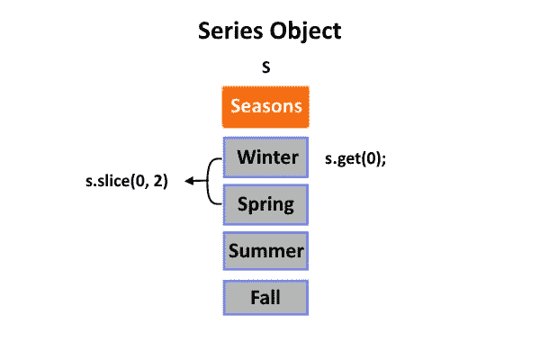

series 的获取和切片方法（作者提供的图片）

到目前为止，您已经看到了让您从 **预定义数据** 创建 **Series** 等对象的操作。一旦初始化了诸如系列之类的数据对象，就可以利用 **Polars** 提供的一些直观功能从该对象中提取相关数据。其中一个功能是 **索引**。

**索引** 或 **子集** 的过程是数据分析中广泛采用的技术之一，用于从系列中提取特定段落。这种方法能够精确地操作和检查数据，对理解复杂数据集至关重要。Rust 的 `[**Series**](https://docs.rs/polars/latest/polars/prelude/struct.Series.html#)` 结构提供了多种索引方法，可用于从系列中检索特定元素。

```py
let s: Series = Series::new("employees", &vec!["Ferris", "Mahmoud"]);
println!("{:?}", s.get(0).unwrap());

// Output:

// Utf8("Ferris")
```

展示的代码片段说明了如何有效地使用 get 方法从 series 中索引特定值。此函数通过提供一个索引值作为输入，检索并返回 series 中的相应数据点。在我们的示例中，我们通过 `**println!**` 宏提取并显示第一个元素（索引 0）。

除了索引单个值外，通过切片，我们可以通过指定偏移量和长度从 series 中提取一个子集。此方法允许高效提取大数据集，因为它返回零拷贝视图。偏移量参数确定起始索引，而要提取的值的数量通过长度参数指定。在我们的代码片段示例中，我们使用切片仅检索一个值——具体来说，就是 series 中的第一个元素，偏移量设置为 0，并且提取一个值（长度=1）。

```py
let s: Series = Series::new("employees", &vec!["Mahmoud", "Ferris"]);
println!("{:?}", s.slice(0, 1));

// Output:

// shape: (1,)
// Series: 'employees' [str]
// [
//     "Mahmoud"
// ]
```

## 长度

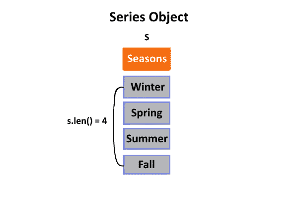

series len 方法（图像由作者提供）

在数据分析中，确定序列中的元素数量通常是非常重要的。幸运的是，有一个简单而有效的方法——`[**len**](https://docs.rs/polars/latest/polars/prelude/trait.SeriesTrait.html#tymethod.len)` 方法。

使用此方法的语法通常很简单，通常表现为 `**fn len(&self) -> usize**`。一旦在所需的 series 上调用，此函数将返回一个整数值，表示其总元素数量。

```py
let s: Series = Series::new("employees", &vec!["Mahmoud", "Ferris"]);
println!("{:?}", s.len());

// Output:

// 2
```

## 反转

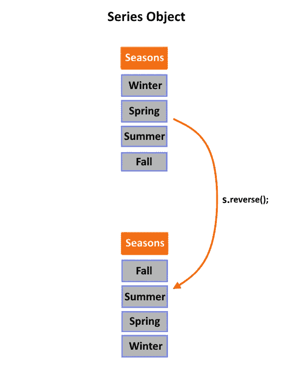

series reverse 方法（图像由作者提供）

`[**reverse**](https://docs.rs/polars/latest/polars/prelude/trait.SeriesTrait.html#tymethod.reverse)` 函数是一个强大的方法，可以帮助你以特定的方式操作数据。如果你曾经需要更改 series 中元素的顺序，可以利用这个方法。

该方法的语法通常很简单——在一个 series 对象上调用函数。调用后，它将创建一个新的、与原始 series 完全相同但顺序相反的 series。

```py
let s: Series = Series::new("employees", &vec!["Mahmoud", "Ferris"]);
println!("{:?}", s.reverse());

// Output:

// shape: (2,)
// Series: 'employees' [str]
// [
//     "Ferris"
//     "Mahmoud"
// ]
```

## 空检查

`[**is_empty**](https://docs.rs/polars/latest/polars/prelude/trait.SeriesTrait.html#method.is_empty)` 方法是一个可以在 Polars Series 对象上调用的方法。它返回一个布尔值，指示 Series 是否为空。如果 Series 为空，则返回 True；否则，返回 False。

```py
let s: Series = Series::new("employees", &vec!["Mahmoud", "Ferris"]);
println!("{:?}", s.is_empty());

// Output:

// false
```

## 丢弃空值

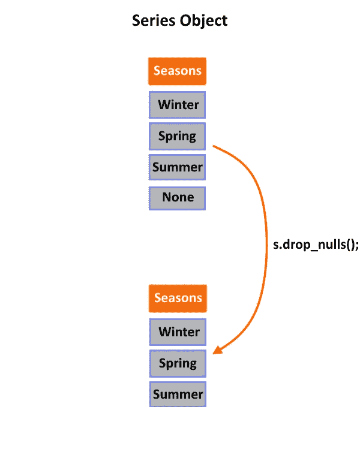

Series drop_nulls 函数可视化（图像由作者提供）

数据分析涉及一个关键方面，即处理缺失信息。Polars 的 `[**drop_nulls**](https://docs.rs/polars/latest/polars/prelude/trait.SeriesTrait.html#method.drop_nulls)` 方法提供了一个有效的解决方案。此函数帮助从 Series 中移除包含空值的行，并有效消除由不完整数据集造成的差异。

```py
let s: Series = Series::new("employees", &vec![Some("Ferris"), None]);
println!("{:?}", s.drop_nulls());

// Output:

// shape: (1,)
// Series: 'employees' [str]
// [
//     "Ferris"
// ]
```

## 总结

作为数据分析师或科学家，你可能经常处理大量数据集。Polars 中用于查询数据的两个强大方法是 Head 和 Tail。`[**head**](https://docs.rs/polars/latest/polars/series/struct.Series.html#method.head)` 方法是一个有用的工具，可以快速预览数据集的初始行。默认情况下，它显示前十行，但可以通过传递参数进行自定义，以显示更多或更少的行。

```py
let s = Series::new("Measurements", &[-1.01,  0.86, -4.60, 3.98,  0.53, -7.04, 3.98,  0.53, -7.04, 0.86, 0.16, 0.26, 0.81]);
println!("{:?}", s.head(None));

// Output:

// shape: (10,)
// Series: 'Measurements' [f64]
// [
//     -1.01
//     0.86
//     -4.6
//     3.98
//     0.53
//     -7.04
//     3.98
//     0.53
//     -7.04
//     0.86
// ]
```

另一方面，`[**tail**](https://docs.rs/polars/latest/polars/series/struct.Series.html#method.tail)` 方法允许你检查数据末尾的趋势和模式。默认情况下，它显示最后十行，但也可以通过参数进行调整。

```py
let s = Series::new("Measurements", &[-1.01,  0.86, -4.60, 3.98,  0.53, -7.04, 3.98,  0.53, -7.04, 0.86, 0.16, 0.26, 0.81]);
println!("{:?}", s.tail(None));

// Output:

// shape: (10,)
// Series: 'Measurements' [f64]
// [
//     3.98
//     0.53
//     -7.04
//     3.98
//     0.53
//     -7.04
//     0.86
//     0.16
//     0.26
//     0.81
// ]
```

## 追加

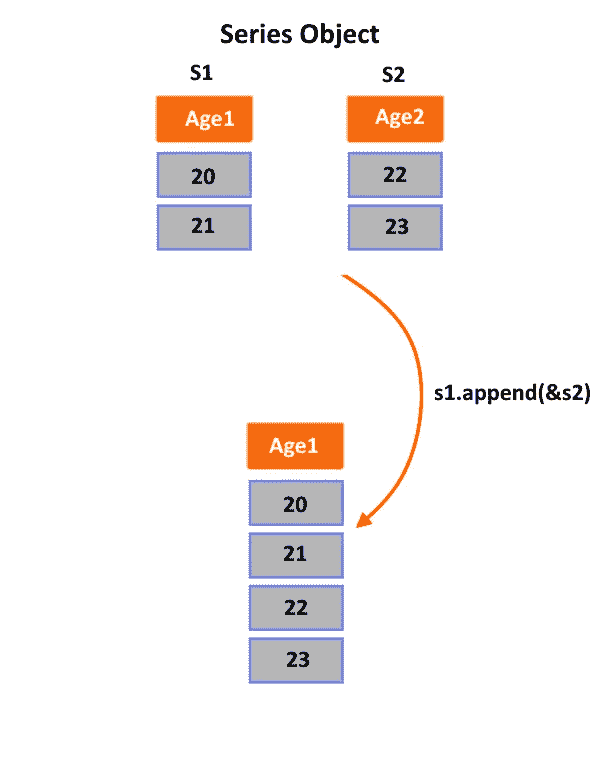

系列追加功能的可视化（作者提供的图片）

通过使用 `[**append**](https://docs.rs/polars/latest/polars/series/struct.Series.html#method.append)` 方法，你可以合并两个不同的系列。此函数将一个系列的块与另一个系列结合起来，需要注意的是，两个系列必须具有相同的数据类型。需要牢记的是，为了使这个过程成功进行，需要一个可以修改给定系列的可变调用者。

```py
let mut s1 = Series::new("Age", &[23., 27.]);
let s2 = Series::new("Height", &[1.84, 1.78]);
println!("{:?}", s1.append(&s2));

// Output;

// shape: (4,)
// Series: 'Age' [f64]
// [
//     23.0
//     27.0
//     1.84
//     1.78
// ]
```

## 转换

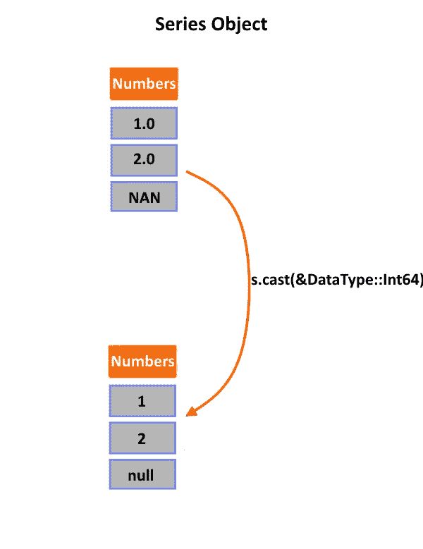

系列转换功能的可视化（作者提供的图片）

**转换** 是将一种数据类型转变为另一种数据类型的重要技术。在 **Polars** 中，这个方法在更改 **Series** 中的列数据类型时尤其有用。例如，你可能需要将列中的字符串值转换为整数或浮点数。幸运的是，通过 `[**cast**](https://docs.rs/polars/latest/polars/series/struct.Series.html#method.cast)` 方法，这种转换变得轻而易举。

有效使用转换功能需要首先选择需要转换的列，然后调用方法时传递所需的目标数据类型作为参数——**Float32** 只是众多可用选项中的一个例子，用于基于浮点数的转换。

```py
let mut s = Series::new("Measurements", &[-1.01,  0.86, -4.60, 3.98,  0.53, -7.04, 3.98,  0.53, -7.04]);
println!("{:?}", s.cast(&DataType::Int32).unwrap());

// Output:

// shape: (9,)
// Series: 'Measurements' [f32]
// [
//     -1
//     0
//     -4
//     3
//     0
//     -7
//     3
//     0
//     -7
// ]
```

需要注意的是，由于存在与浮点型和整数型格式不兼容的非数字字符，某些格式在转换过程中可能会遇到错误。在这种情况下，确保相关数据集在转换之前经过彻底清理是非常重要的，以便它们在未来的使用中能够更有效地转换而不会出现问题。

## 填充空值

作为数据分析师或科学家，你对处理**空值**的挑战并不陌生。幸运的是，**Polars**为处理数据集中的**缺失信息**提供了出色的解决方案。利用其`[**fill_null**](https://docs.rs/polars/latest/polars/series/struct.Series.html#method.fill_null)`方法，你可以轻松地用对分析有意义的特定值替换这些空值。此函数为你提供了选择替换空值时的[**九种不同策略**](https://docs.rs/polars/latest/polars/prelude/enum.FillNullStrategy.html)：

+   **前向填充**（用**前一个**值替换**None**）：

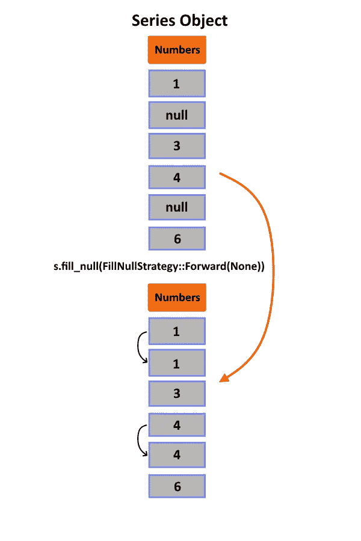

系列前向填充策略（作者提供的图像）

```py
let s = Series::new("some_missing", &[Some(1), None, Some(3), Some(4), None, Some(6)]);
let filled = s.fill_null(FillNullStrategy::Forward(None))?;
println!("{:?}", filled);

// Output

// Ok(shape: (6,)
// Series: 'some_missing' [i32]
// [
//     1
//     1
//     3
//     4
//     4
//     6
// ])
```

+   **后向填充**（用**后一个**值替换**None**）：

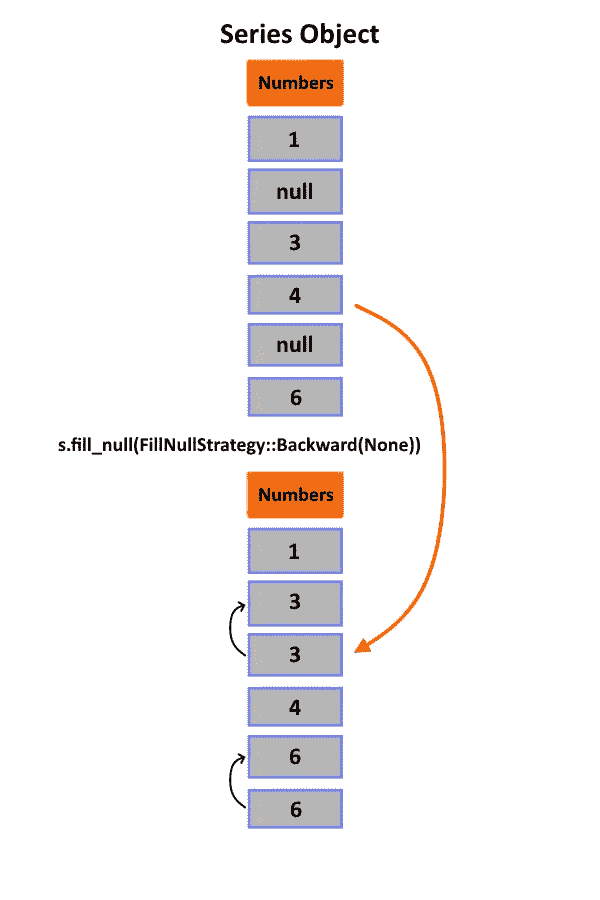

系列后向填充策略（作者提供的图像）

```py
let s = Series::new("some_missing", &[Some(1), None, Some(3), Some(4), None, Some(6)]);
let filled = s.fill_null(FillNullStrategy::Backward(None))?;
println!("{:?}", filled);

// Output

// Ok(shape: (6,)
// Series: 'some_missing' [i32]
// [
//     1
//     3
//     3
//     4
//     6
//     6
// ])
```

+   **均值填充**（用整个数组的**均值**替换**None**）：

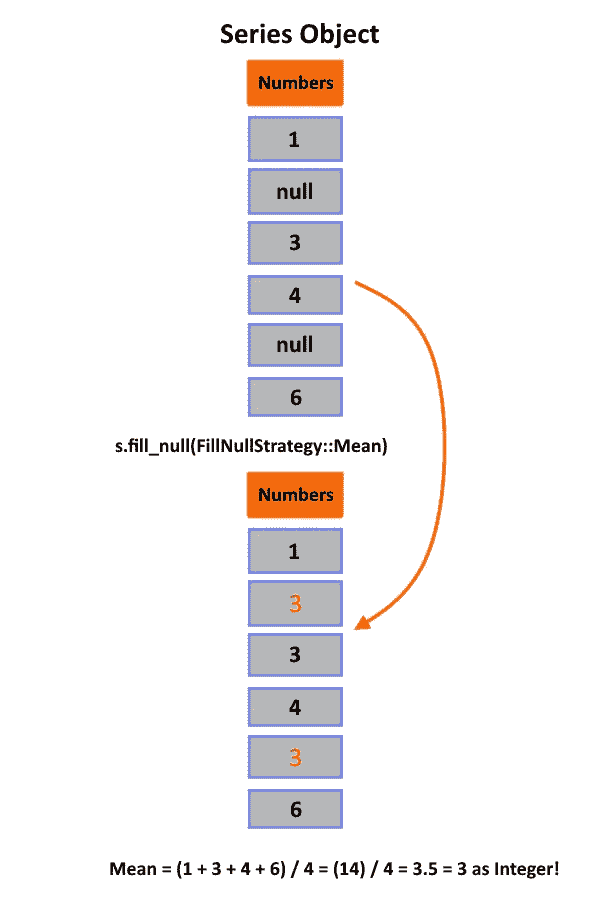

系列均值填充策略（作者提供的图像）

```py
let s = Series::new("some_missing", &[Some(1), None, Some(3), Some(4), None, Some(6)]);
let filled = s.fill_null(FillNullStrategy::Mean)?;
println!("{:?}", filled);

// Output

// Ok(shape: (6,)
// Series: 'some_missing' [i32]
// [
//     1
//     3
//     3
//     4
//     3
//     6
// ])
```

+   **最小值填充**（用整个数组的**最小值**替换**None**）：

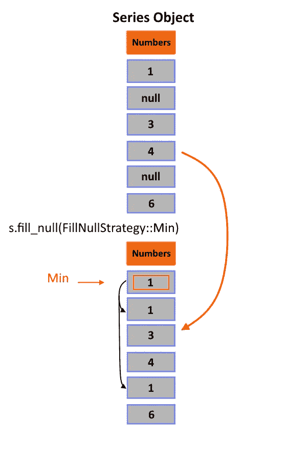

系列最小值填充策略（作者提供的图像）

```py
let s = Series::new("some_missing", &[Some(1), None, Some(3), Some(4), None, Some(6)]);
let filled = s.fill_null(FillNullStrategy::Min)?;
println!("{:?}", filled);

// Output

// Ok(shape: (6,)
// Series: 'some_missing' [i32]
// [
//     1
//     1
//     3
//     4
//     1
//     6
// ])
```

+   **最大值填充**（用整个数组的**最大值**替换**None**）：

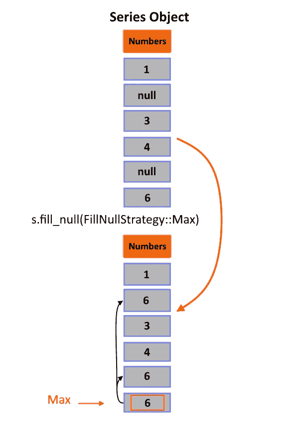

系列最大值填充策略（作者提供的图像）

```py
let s = Series::new("some_missing", &[Some(1), None, Some(3), Some(4), None, Some(6)]);
let filled = s.fill_null(FillNullStrategy::Max)?;
println!("{:?}", filled);

// Output

// Ok(shape: (6,)
// Series: 'some_missing' [i32]
// [
//     1
//     6
//     3
//     4
//     6
//     6
// ])
```

## 抽样


照片由[Testalize.me](https://unsplash.com/@testalizeme?utm_source=medium&utm_medium=referral)提供，来自[Unsplash](https://unsplash.com/?utm_source=medium&utm_medium=referral)

在进行任何分析之前，重要的是要记住我们的**样本**必须是**随机**且**具有代表性**的。这意味着我们需要**无偏的数据**收集方法（例如，不能仅仅问某个体育队的球迷是否喜欢这支队伍）。理想情况下，应该包括来自**人口**中所有**不同群体**的成员在我们的**样本**中。

根据手头的**数据类型**，可能需要采用不同的抽样方法来实现这一目标。对于一般情况下没有明显分组的情况，简单的**随机抽样**通常是最佳选择；在这里，我们使用随机数生成器来**随机选择行**。然而，对于具有明确子组的数据集，应采用随机抽样，以保持整体数据集中每个子组的比例。

在通过这些传统技术无法获得足够相关数据的情况下，例如处理小样本或不平衡样本时，[**自助法**](https://en.wikipedia.org/wiki/Bootstrapping_(statistics))可以通过使用替换选择策略生成额外的随机子集来提供替代解决方案，直到达到所需水平，而不会因为初始回合中的便利选择引入偏差，这些选择可能会使结果倾向于更早发现的更常见值，而不是准确地代表实际的人群！

要对 Polars 系列对象进行部分取样，我们可以使用 `[**sample_n**](https://docs.rs/polars/latest/polars/series/struct.Series.html#method.sample_n)` 方法。

```py
let s = Series::new("Measurements", &[-1.01,  0.86, -4.60, 3.98,  0.53, -7.04, 3.98,  0.53, -7.04]);
// Take 4 samples with replacement and shuffle (Terms used in probability).
println!("{:?}", s.sample_n(4, true, true, Some(9999)));

// Output:

// shape: (4,)
// Series: 'Numbers' [f64]
// [
//     0.53
//     -1.01
//     3.98
//     0.53
// ])
```

## **描述性统计**


[Stephen Dawson](https://unsplash.com/@dawson2406?utm_source=medium&utm_medium=referral) 在 [Unsplash](https://unsplash.com/?utm_source=medium&utm_medium=referral) 的照片

**描述性统计**在数据分析中的重要性不容小觑，因为它使研究人员能够理解他们收集的数据。**单变量统计**是该领域的一个重要组成部分，允许对**单独的** **变量**进行独立分析和评估。通过对每个**变量**单独使用统计测量，如**均值**、**众数**、**中位数**和**标准差**，我们可以揭示数据集中分布模式的**有价值见解**。

例如，如果提供了**100 个观察值**，详细记录了速度和距离对，**单变量统计**将使我们能够单独计算**平均**速度和距离，从而使它们之间的任何**相关性**或**独立性**变得明显。此外，通过这些计算识别**异常值**，我们可以在后续的进一步分析中**最小化**它们对整体结果的影响！

数据分析的初步步骤是确定其**集中趋势**，可以通过均值、中位数或众数来评估。这一测量有助于理解大多数数据点的位置，并作为比较的参考点。此外，通过确定值之间的**差距**或**离散程度**，使用**范围**、**方差**或**标准差**等测量指标来识别**值的离散程度**也至关重要。这种分析提供了对数据集中变异性的有价值见解。

作为研究人员/分析师，描述性统计提供了强大的工具，使**全面**的**数据概览**成为可能，从而基于统计分析中的发现做出明智的决策。

## **集中趋势的测量**

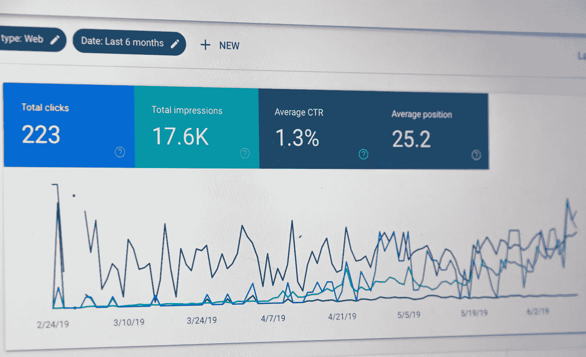

图片由 [Stephen Phillips - Hostreviews.co.uk](https://unsplash.com/@hostreviews?utm_source=medium&utm_medium=referral) 提供，发布于 [Unsplash](https://unsplash.com/?utm_source=medium&utm_medium=referral)

在任何统计分析中，关注数据的**中心**至关重要。**描述性统计**提供了帮助我们理解分布和**集中趋势**度量的工具。最常见的有**均值**、**中位数**和**众数**，每种都有其优点，取决于数据集的特性，如**正态性**或**偏斜性**。

需要注意的是，这些度量仅提供**概览**，而不是对变异性或分布的完整洞察。因此，我们还必须包括其他描述性统计，如**离散度****测量**，以获得对数据集的更全面的视角。

## 均值

**均值**是一个常用的统计函数，用于以易于解释的方式**总结数据**。它让我们洞察数据集的**集中趋势**，无论是对于整个总体还是**一个观察样本**。符号**μ**（发音为“**mu**”）代表总体均值，而**𝑥𝑥̅**则表示样本平均值。在数学术语中，均值的公式是**Σxi/n**。这里，**Σ**（希腊字母大写 sigma）表示从**1 到 n**的求和，其中**n**是观察数。整体变量用大写字母表示，而具体的观察值用小写字母表示。计算这个值涉及到**将所有值相加并除以它们的总数**，就是这么简单！例如，如果我们有数字**0, 4, 3, 2, 和 5**，它们的**总和**（**14**）除以**五**大约等于二点八（**2.8**）。

然而，必须认识到**异常值**可能会显著影响这个度量的准确性。正如你所知，异常值是由完全**不同的过程**生成的，与分布中的其他值相比，可能会**偏斜**结果；例如，一个值远大于或远小于其他值，可能会分别拉高或拉低平均值，从而使其成为不准确的代表数据集的值。

因此，在分析数据时，意识到异常值的存在至关重要。**正如在之前的一篇文章中讨论的**，一种考虑异常值的方法是使用中位数代替均值来测量集中趋势，因为中位数对这些异常值的敏感度较低，同时仍能准确表示数据集中的中间值，即使在这些异常值对整体结果的影响下也是如此。

在使用 Polars 处理数据集时，遇到缺失或空值并不少见。在这种情况下，`[**均值**](https://docs.rs/polars/latest/polars/prelude/trait.SeriesTrait.html#method.mean)`函数可能会非常有用。然而，由于在被分析的数字集合中可能存在缺失条目，因此该函数返回一个其类型标记为`**Option<f64>**`的可选值。本质上，这意味着返回值可能是空值，因此需要用户谨慎处理。

```py
let s = Series::new("Measurements", &[-1.01,  0.86, -4.60, 3.98,  0.53, -7.04, 3.98,  0.53, -7.04]);

println!("{:?}", s.mean().unwrap());

// Output:

// -1.09
```

还应注意，使用此方法计算平均值时，只考虑**非空**值；如果数据集中有**十**个数字，但由于某种原因遗漏了两个，则只有八个数字会参与通过`**均值**`函数进行的任何计算。

## 中位数

在分析数据时，选择适当的集中趋势度量是至关重要的。**均值**通常被青睐，因为它考虑了所有数据点，并提供了对**平均值**的合理近似。然而，**异常值**可能会轻易影响均值的准确性，并**扭曲**整体结果。这时，使用**中位数**变得尤为重要。

**中位数**是一个在统计学中强大的函数，它准确地代表了数据的集中趋势，即使在存在异常值的情况下也是如此。从**有序列表**中选择**中间值**提供了一个精确且可靠的分析测量。在值数量为偶数的情况下，取两个中间值的平均值可以确保准确性。这使得它在处理具有极端或偏斜值的数据集时特别有用，例如[**美国的收入分布**](https://www.statista.com/statistics/203183/percentage-distribution-of-household-income-in-the-us/)。**前 11.6%**的高收入者收入显著高于大多数美国人，这可能会扭曲均值。

然而，通过使用**中位数**计算，我们可以获得更准确的结果，因为它代表了将**一半**（**50%**）高收入者与低收入者分开的数据点，为我们提供了对现实经济趋势的宝贵见解，而不受极端富裕人士收入所带来的统计异常的影响！

**Polars**提供了[这个函数](https://docs.rs/polars/latest/polars/prelude/trait.SeriesTrait.html#method.median)来轻松处理**DataFrame**和**Series**对象。让我们考虑以下示例：

```py
let s = Series::new("Measurements", &[-1.01,  0.86, -4.60, 3.98,  0.53, -7.04, 3.98,  0.53, -7.04]);

println!("{:?}", s.median().unwrap());

// Output:

// 0.53
```

## 众数

**众数**是一个基本的统计概念，在数据分析中扮演着重要角色。它表示数据集中最频繁出现的值，并且可以**揭示模式和趋势**，尤其是在处理**庞大或复杂的数据集**时。如果存在两个众数，例如**双峰****分布**，这可能表明数据集中存在不同的子群体。

尽管乍看之下似乎简单易懂，但了解模式如何融入更广泛的分析框架中，以及如何与均值和中位数等度量方法结合，对从结果中得出准确结论至关重要。

关于**分类数据**，**模式**被认为是衡量集中趋势的首选工具。这个强大的工具表示在数据集中出现频率最高的值，非常适合确定数据集中的常见类别或响应。例如，在分析**调查结果**时，这种方法可以帮助确定参与者选择的**频率更高**的响应。

另一方面，**数值数据集**需要不同的度量，如**均值**或**中位数**值，以准确确定其集中趋势。给定数据集的**平均**值由均值表示。同时，它的**中点**对应于**中位数**，这两种方法都是识别这些类型数据集中的趋势的常用方法。

尽管由于连续集与**分类集**之间的差异，它通常不会在分析中使用，但它仍然具有相关性，因为它有助于描述在任何特定研究结果中发现的**重复模式**，这些模式存在于**相似变量**之间！

**Polars** 提供了一种强大的方法，称为 `[**mode**](https://docs.rs/polars/latest/polars/prelude/trait.SeriesTrait.html#method.mode)` 函数，可以帮助实现这一目标。尽管仅在 `**mode**` crate 功能中可用，但在访问时，它可以为数据集提供有价值的见解。`**mode**` 函数返回的结果值通常以一个 Series 的形式呈现，其中包含数据集中最常见的元素。

```py
let s = Series::new("Measurements", &[-1.01,  0.86, -4.60, 3.98,  0.53, -7.04, 3.98,  0.53, -7.04]);

println!("{:?}", s.mode().unwrap());

// Output:

// shape: (3,)
// Series: 'Measurements' [f64]
// [
//     -7.04
//     0.53
//     3.98
// ]
```

为了有效分析数据，了解每种度量的优缺点是至关重要的。这一知识将使我们能够根据特定情况的具体要求做出明智的决策。准确而高效的分析依赖于这种理解。

## 离散程度度量


[Martin Sanchez](https://unsplash.com/@martinsanchez?utm_source=medium&utm_medium=referral) 提供的照片，来源于 [Unsplash](https://unsplash.com/?utm_source=medium&utm_medium=referral)

在分析数据时，单纯知道**分布的中心点**是不够的。理解数据的**广泛****分散**程度同样重要。这就是离散程度度量发挥作用的地方；它们帮助我们**评估**值之间的距离，并更有效地总结我们的发现。**分散越广，范围越大**；相反，**分布越窄，结果越紧密**。

我们可以用多种统计术语来描述这种扩展：例如，通过**四分位数范围**或**标准差**（各有利弊）。了解哪种度量最适合每种情况取决于具体背景和可用信息；如果处理的是极端异常值，范围可能最有帮助，而通常分布的数据集则可能更适合使用标准差作为指标。

## 四分位数范围

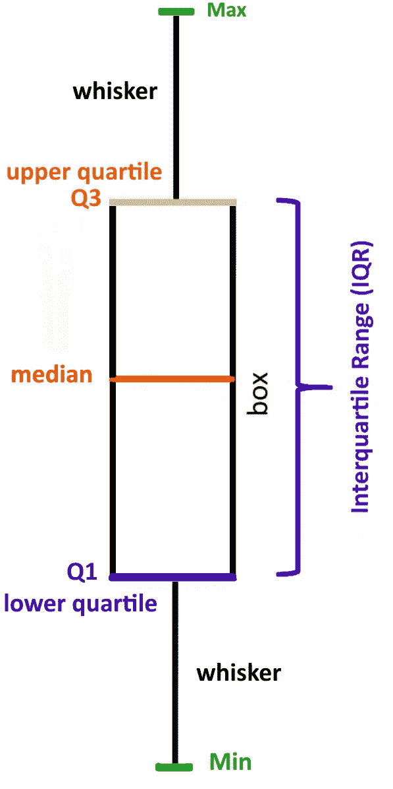

箱形图（图片来源：作者）

`[**quantile_as_series**](https://docs.rs/polars/latest/polars/prelude/trait.SeriesTrait.html#method.quantile_as_series)` 函数是计算统计度量的强大工具，其中最重要之一是 **四分位数范围** (**IQR**)。该度量表示数据变异性的中间 **50**%，通过**Q1** 与 **Q3** 相减来确定。**IQR** 实质上展示了数据点围绕其 **中位数** 的**分布宽度**。**IQR** 用于识别潜在的异常值，因为任何落在 **Q1–1.5 × IQR 和 Q3 + 1.5 × IQR** 之外的数据点都被认为是 **异常值**。

在 Polars 中，`[**quantile_as_series**](https://docs.rs/polars/latest/polars/prelude/trait.SeriesTrait.html#method.quantile_as_series)` 方法可以用于获取 `**ChunkedArray**` 的四分位数，结果是一个长度为 1 的新系列。通过指定分位数参数，如 **0.25** 或 **0.75**，我们可以分别得到 **Q1** 和 **Q3**。插值参数可以设置为 **Nearest**，例如，用于指定在值不完全时如何计算分位数。

```py
use polars::chunked_array::object::QuantileInterpolOptions;

let s = Series::new("Measurements", &[-1.01,  0.86, -4.60, 3.98,  0.53, -7.04, 3.98,  0.53, -7.04]);
println!("{:?}", s.quantile_as_series(0.75, QuantileInterpolOptions::Nearest).unwrap());

// Output:

// shape: (1,)
// Series: 'Measurements' [f64]
// [
//     0.86
// ]
```

**箱形图**通常使用该指标来可视化数据集中潜在的**异常值**，同时准确地表示它们的分布。对于那些希望根据可靠的统计数据而不是单凭猜测做出明智决策的研究人员和科学家来说，使用分位数作为序列计算将提供他们更多对研究结果基础趋势的全面洞察，而不仅仅是标准差范围或简单的最小值-最大值比较。

在本节中，我们关注了 Polars 库提供的最基础数据类型之一——**Series**。你已经了解了 Series 的创建、索引等技巧，其中强大的 **get** 和 **slice** 操作已经对你开放，同时也掌握了 Series 创建的相关知识。

诚然，**Series** 提供了一个优秀的**一维数据**管理解决方案，但真正的挑战在于多维数据。这就是**DataFrames** 发挥作用的地方。在第二部分，我们将简要介绍 **DataFrames**——这个在众多领域中被广泛有效使用的多维数据结构。

## 结论


图片由[Saurav Mahto](https://unsplash.com/@sauravmahto?utm_source=medium&utm_medium=referral)提供，发布在[Unsplash](https://unsplash.com/?utm_source=medium&utm_medium=referral)上

本文使你熟悉了 Polars 中的基本数据结构——Series。此外，我们还探讨了查询和修改 Series 的基本概念。因此，这应该能让你在今后处理 Series 时充满信心。这将是接下来系列文章中的一个重要组成部分。特别是，我们接下来的重点是学习 Polars 的数据框架，以及 Polars 如何促进高效的数据输入/输出操作，这对任何成功的分析项目至关重要！

在这篇文章中，我们涵盖了以下主题：

+   Polars 世界的介绍。

+   探索 Polars 的历史和演变。

+   Polars 的组成部分和应用。

+   理解 Polars 的基本概念，例如 Series。

还有更多内容。随着我们逐步深入接下来的文章，你对 Polars 的知识将扩展到更多高级特性和技术。在第二部分中，我们将深入探索 DataFrames 的强大世界！这些强大的结构在广泛领域中用于轻松管理和分析多维数据。我们将提供对 DataFrames 的清晰而简明的解释，包括聚合函数等。通过掌握这个库，你将获得坚实而宝贵的技能，使你能够轻松应对复杂的数据分析任务，同时轻松处理庞大的数据集。

## 结束语


图片由[Aaron Burden](https://unsplash.com/@aaronburden?utm_source=medium&utm_medium=referral)提供，发布在[Unsplash](https://unsplash.com/?utm_source=medium&utm_medium=referral)上

在我们结束本教程时，我要向所有为完成这项工作付出时间和精力的人员表示诚挚的感谢。能够与你们一起展示 Rust 编程语言的非凡能力，我感到非常荣幸。

一如既往，热爱数据科学的我承诺，从现在开始，我每周至少会撰写一篇关于相关主题的综合文章。如果你对我的工作感兴趣，请考虑通过各种社交媒体平台与我联系，或者直接联系我以获取其他帮助。

感谢！

## 资源

[GitHub - wiseaidev/rust-data-analysis: 使用 Rust 进行终极数据分析课程](https://github.com/wiseaidev/rust-data-analysis?source=post_page-----ce42af370ece--------------------------------)

### 这个库是 Jupyter notebooks 的集合，所有笔记本都由 Rust 内核支持。使用这些笔记本，你将能够……

[github.com](https://github.com/wiseaidev/rust-data-analysis?source=post_page-----ce42af370ece--------------------------------) [## SeriesTrait 在 polars::prelude - Rust

### Rust `SeriesTrait` 特征在 crate `polars` 中的 API 文档。

[docs.rs](https://docs.rs/polars/latest/polars/prelude/trait.SeriesTrait.html?source=post_page-----ce42af370ece--------------------------------)  [## polars::series 中的 Series - Rust

### Series

在 polars::series - Rust Series [docs.rs](https://docs.rs/polars/latest/polars/series/struct.Series.html?source=post_page-----ce42af370ece--------------------------------)  [## chrono 中的 DateTime - Rust

### pub struct DateTime { /* 私有字段 */ } 扩展描述 ISO 8601 组合日期和时间及时区。还有……

[docs.rs](https://docs.rs/chrono/latest/chrono/struct.DateTime.html?source=post_page-----ce42af370ece--------------------------------#) [](https://doc.rust-lang.org/std/index.html?source=post_page-----ce42af370ece--------------------------------) [## std - Rust

### Rust 标准库是可移植 Rust 软件的基础，提供了一组经过最小化和实战检验的共享……

[doc.rust-lang.org](https://doc.rust-lang.org/std/index.html?source=post_page-----ce42af370ece--------------------------------)  [## Rust By Example

### Rust 是一种现代系统编程语言，专注于安全性、速度和并发。它通过这些目标……

[doc.rust-lang.org](https://doc.rust-lang.org/rust-by-example/?source=post_page-----ce42af370ece--------------------------------)  [## Rust 编程语言

### 由 Steve Klabnik 和 Carol Nichols 编写，Rust 社区贡献 这个版本的文本假设你是……

[doc.rust-lang.org](https://doc.rust-lang.org/book/?source=post_page-----ce42af370ece--------------------------------)
