# Rustic Data: 使用 Plotters 的数据可视化 — 第一部分

> 原文：[`towardsdatascience.com/rustic-data-data-visualization-with-plotters-part-1-7a34b6f4a603?source=collection_archive---------8-----------------------#2023-07-25`](https://towardsdatascience.com/rustic-data-data-visualization-with-plotters-part-1-7a34b6f4a603?source=collection_archive---------8-----------------------#2023-07-25)

## 详细指南：如何将原始数据转化为令人惊叹的 Rust 图形

[](https://wiseai.medium.com/?source=post_page-----7a34b6f4a603--------------------------------)[](https://towardsdatascience.com/?source=post_page-----7a34b6f4a603--------------------------------) [Mahmoud Harmouch](https://wiseai.medium.com/?source=post_page-----7a34b6f4a603--------------------------------)

·

[关注](https://medium.com/m/signin?actionUrl=https%3A%2F%2Fmedium.com%2F_%2Fsubscribe%2Fuser%2Fb15db3da5667&operation=register&redirect=https%3A%2F%2Ftowardsdatascience.com%2Frustic-data-data-visualization-with-plotters-part-1-7a34b6f4a603&user=Mahmoud+Harmouch&userId=b15db3da5667&source=post_page-b15db3da5667----7a34b6f4a603---------------------post_header-----------) 发表于 [Towards Data Science](https://towardsdatascience.com/?source=post_page-----7a34b6f4a603--------------------------------) · 20 分钟阅读 · 2023 年 7 月 25 日[](https://medium.com/m/signin?actionUrl=https%3A%2F%2Fmedium.com%2F_%2Fvote%2Ftowards-data-science%2F7a34b6f4a603&operation=register&redirect=https%3A%2F%2Ftowardsdatascience.com%2Frustic-data-data-visualization-with-plotters-part-1-7a34b6f4a603&user=Mahmoud+Harmouch&userId=b15db3da5667&source=-----7a34b6f4a603---------------------clap_footer-----------)

--

[](https://medium.com/m/signin?actionUrl=https%3A%2F%2Fmedium.com%2F_%2Fbookmark%2Fp%2F7a34b6f4a603&operation=register&redirect=https%3A%2F%2Ftowardsdatascience.com%2Frustic-data-data-visualization-with-plotters-part-1-7a34b6f4a603&source=-----7a34b6f4a603---------------------bookmark_footer-----------)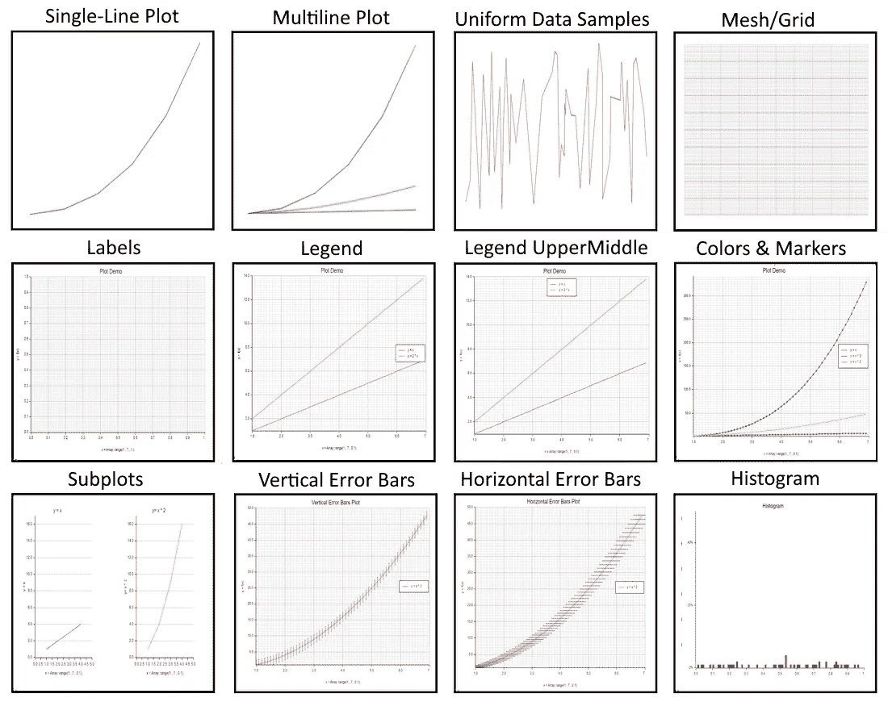

各种 Plotters 特性（作者提供的图片）

## TL;DR

**Plotters** 是一个流行的 Rust 库，用于创建 **数据可视化**。它提供了各种工具和函数，帮助你创建高质量的 **图形**、**图表** 和其他 **可视化**。本文是一个系列文章的 **第一部分**，专注于使用 **Plotters** 准备的可视化的美学方面。从改变 **颜色** **方案** 到添加 **注释**，你将学习如何定制 Plotters 可视化的外观。

到文章结尾，你将对如何使用 Plotters 库创建**专业**的可视化有一个**坚如磐石**的理解，这将**吸引**你的观众。我们在探索各种数据处理工具和方法时，[**Ndarray** **库**](https://wiseai.medium.com/the-ultimate-ndarray-handbook-mastering-the-art-of-scientific-computing-with-rust-ef5ab767212a)也将非常有用。因此，无论你是**业余**还是**资深** **Rust** **程序员**，如果你对用 Plotters 制作**信息丰富**且**美观**的可视化感兴趣，那么阅读这篇文章是必须的。

> **注意：** 本文假设你对 Rust 编程语言有一定的基础了解。
> 
> 为了这篇文章，开发了名为 [**6-plotters-tutorial-part-1.ipynb**](https://github.com/wiseaidev/rust-data-analysis/blob/main/6-plotters-tutorial-part-1.ipynb) 的笔记本，可以在以下仓库中找到：

[## GitHub - wiseaidev/rust-data-analysis: 使用 Rust 的终极数据分析课程。](https://github.com/wiseaidev/rust-data-analysis?source=post_page-----7a34b6f4a603--------------------------------)

### 使用 Rust 的终极数据分析课程。通过创建一个…

[github.com](https://github.com/wiseaidev/rust-data-analysis?source=post_page-----7a34b6f4a603--------------------------------)

## 目录（TOC）

∘ 这篇文章适合谁？

∘ 什么是 Plotters？

∘ Plotters 的优势

∘ 设置 Plotters

∘ 单行图

∘ 多行图

∘ 网格、坐标轴和标签

∘ 颜色和标记

∘ 子图

∘ 误差条

∘ 散点图

∘ 直方图

∘ 结论

∘ 结束语

∘ 资源

## 这篇文章适合谁？


[Myriam Jessier](https://unsplash.com/@mjessier?utm_source=medium&utm_medium=referral) 拍摄的照片，来自 [Unsplash](https://unsplash.com/?utm_source=medium&utm_medium=referral)

对于那些希望在 Rust 中制作**直观**数据可视化的人来说，这篇文章是**必读**的。不论你是**经验丰富的** **数据科学家**还是刚刚**起步，** Rust 中的 Plotters crate 都能帮助你创建引人注目且视觉效果出众的图形，必定能给你的观众留下深刻印象。只需掌握基本的 Rust 编程知识，就能轻松上手。

**Plotters** crate 在创建**惊艳**和**高效**的**可视化**时具备强大的功能，能够**快速**且**轻松**地完成任务——非常适合**个人**项目以及**专业**项目。它是一个可以生成高质量图形的工具，有效传达复杂信息。

如果提升你的可视化技能听起来很有吸引力，那么这个工具正是你的不二之选！**清晰的解释**与有用的图表结合，使得跟随变得简单，而逐步的说明确保你能够快速进步，使用 **Plotters** crate 创建令人惊叹的视觉效果。

## 什么是 Plotters？

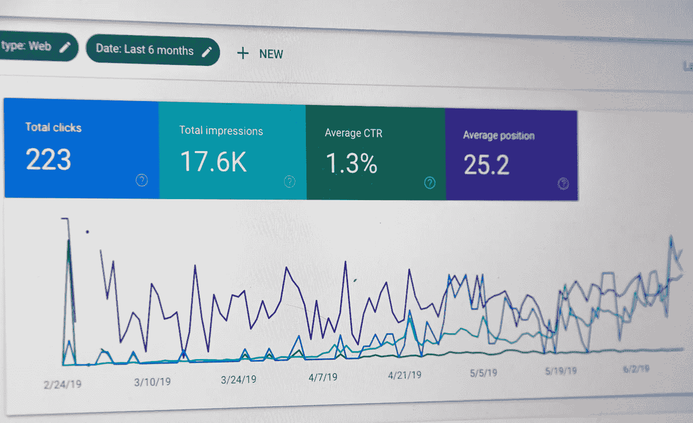

由 [Stephen Phillips - Hostreviews.co.uk](https://unsplash.com/es/@hostreviews?utm_source=medium&utm_medium=referral) 拍摄的照片，来源于 [Unsplash](https://unsplash.com/?utm_source=medium&utm_medium=referral)

[**Plotters**](https://plotters-rs.github.io/home/#!/)是一个强大且灵活的 Rust crate，它使开发人员，如你，能够轻松创建令人惊叹的可视化效果。它的多样性允许创建各种图表，包括折线图、散点图和直方图，同时提供高灵活性的样式选项和自定义注释。

这个**一体化**工具使开发人员能够定义所需的任何类型的可视化——使其成为数据分析任务中不可或缺的资产。一个显著的特点是它对交互式界面的支持，这使得生成静态图形成为可能，同时也能轻松创建基于 Web 的应用程序。这个能力促进了数据集的轻松探索，从而生成适合机器学习或数据科学项目的多样化图表。

此外，**Plotters** 可以无缝集成到流行的开发环境中，如 [**Jupyter Notebook**](https://plotters-rs.github.io/plotters-doc-data/evcxr-jupyter-integration.html)，同时支持专门用于增强数据可视化体验的高级包——提供了更多理由说明这个包应该成为每个开发人员工具包的一部分！

无论你是刚开始你的旅程还是已经在分析复杂的数据集——**Plotters** 提供了无与伦比的适应性和用户友好性；真正值得在今天的顶级工具中获得认可！

## Plotters 优势


由 [UX Indonesia](https://unsplash.com/es/@uxindo?utm_source=medium&utm_medium=referral) 拍摄的照片，来源于 [Unsplash](https://unsplash.com/?utm_source=medium&utm_medium=referral)

数据可视化是数据分析的关键方面，而 **Plotters** 库提供了多个好处来简化这个过程。一个显著的优势是其用户友好性。与常见的数据分析 crate，如 **Ndarray** 的集成，使得与熟悉的结构一起使用变得轻而易举。

使用这个开源工具的另一个值得注意的好处是其成本效益；开发人员和分析师可以免费使用该库，没有使用权限制。此外，任何有兴趣为改进软件做出贡献的人都可以作为[**社区努力**](https://github.com/plotters-rs/plotters/issues/345)的一部分进行贡献。

此外，开源意味着通过各种平台（如论坛（例如 [**stackoverflow**](https://stackoverflow.com/search?q=Rust+plotters&s=844d1eef-6919-410a-b7b7-04df4914cd61)））可以快速获得来自全球成员的在线支持——使问题解决变得高效！

## 设置 Plotters

要充分利用 **Plotters** 的功能，确保正确设置环境至关重要。该库提供了广泛的图表类型，如折线图、散点图、直方图和饼图；然而，未经正确设置，这些功能将无法使用。幸运的是，设置 **Plotters** 过程非常简单——只需在 Jupyter Notebook 中运行一个命令，你就可以开始使用了！

```py
:dep plotters = { version = "⁰.3.5", default_features = false, features = ["evcxr", "all_series", "all_elements"] }
```

一旦导入到你的项目工作区或笔记本会话中，**Plotters** 允许你探索其大量的定制选项，这些选项专门针对你的需求——无论是简单还是复杂的图表。

## 单线图


线性单线图（作者提供的图像）

线图是**Plotters**库中的一个基础可视化工具，它允许我们用直线连接数据点。接下来，我们将探讨单线图的概念，这涉及使用 `[**LineSeries**](https://docs.rs/plotters/0.3.5/plotters/series/struct.LineSeries.html)` 结构体来创建单线的可视化效果。

**Plotters** 中的 `**LineSeries**` 结构体在数据可视化中被广泛使用，特别是在创建单线图时。这些图表非常适合展示两个变量之间的相关性或突出时间序列数据中的模式。

要通过 **Plotters** 创建一维图，请首先导入库，并使用其 `[**draw_series**](https://docs.rs/plotters/latest/plotters/chart/struct.ChartContext.html#method.draw_series)` 函数和 `**LineSeries**` 结构体来绘制你的折线图并分配数据集。例如，如果我们想通过简单图表绘制一维数据，以下是如何使用 `**draw_series**` 函数的方法：

```py
evcxr_figure((640, 240), |root| {
    let mut chart = ChartBuilder::on(&root)
        .build_cartesian_2d(0f32..5f32, 0f32..5f32)?;
    let x_axis = [1.0, 2.0, 3.0, 4.0, 5.0, 6.0];
    chart.draw_series(LineSeries::new(
        x_axis.map(|x| (x, x)),
        &RED,
    ))?;
    Ok(())
}).style("width:100%")
```

在上述代码中，我们有一个数组 x 表示坐标 x 和 y。接下来，让我们查看另一个示例，其中我们使用 **Ndarray** 数组来表示单线图的数据：

```py
evcxr_figure((640, 240), |root| {
    let mut chart = ChartBuilder::on(&root)
        .build_cartesian_2d(0f32..7f32, 0f32..7f32)?;

    let x_axis = Array::range(1., 7., 1.);

    chart.draw_series(LineSeries::new(
        x_axis.into_raw_vec().into_iter().map(|x| (x, x)),
        &RED,
    ))?;
    Ok(())
}).style("width:100%")
```

接下来，让我们可视化一个由方程 `**y = f(x) = x³**` 表示的二次图形。以下是相应的代码：

```py
let points_coordinates: Vec<(f32, f32)> = {
    let x_axis = vec![1.0, 2.0, 3.0, 4.0, 5.0, 6.0];
    let quadratic: Vec<f32> = x_axis.iter().map(|x| i32::pow(*x as i32, 3) as f32).collect::<Vec<f32>>();
    x_axis.into_iter().zip(quadratic).collect()
};
points_coordinates

// Output

// [(1.0, 1.0), (2.0, 8.0), (3.0, 27.0), (4.0, 64.0), (5.0, 125.0), (6.0, 216.0)]
```

现在，我们需要按如下方式绘制这个向量：

```py
evcxr_figure((640, 240), |root| {
    let mut chart = ChartBuilder::on(&root)
        .build_cartesian_2d(0f32..7f32, 0f32..220f32)?;

    chart.draw_series(LineSeries::new(
        points_coordinates.iter().map(|(x, y)| (*x, *y)),
        &RED,
    ))?;
    Ok(())
}).style("width:100%")
```

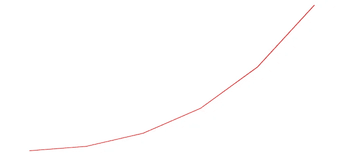

三次函数图（作者提供的图像）

总之，**Plotters**中的**折线图**提供了一种强大的方法来展示数据集中的**相关性**和**趋势**。我们可以利用`**LineSeries**`结构，同时操作**x-values**和**y-values**数组/向量，制作信息丰富而又引人入胜的表现形式。无论你是在探索科学研究成果还是分析商业指标，这些折线图都是进一步探索数据集，同时有效地与他人沟通其见解的不可或缺的工具。

## 多行图

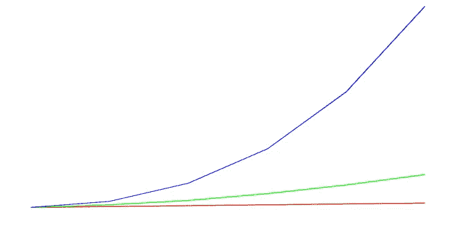

多行图（作者提供的图片）

**Plotters**提供了出色的功能，可以在单个输出中显示**多个图**，这使我们能够在**相同的可视化**上同时展示多个曲线。这个显著的特性便于对数据集进行轻松的比较和分析。为了更深入地理解这一概念，让我们看看一个示例：

```py
evcxr_figure((640, 240), |root| {
    let mut chart = ChartBuilder::on(&root)
        .build_cartesian_2d(0f32..7f32, 0f32..220f32)?;

    chart.draw_series(LineSeries::new(
        linear_coordinates.iter().map(|(x, y)| (*x, *y)),
        &RED,
    ))?;

    chart.draw_series(LineSeries::new(
        quadratic_coordinates.iter().map(|(x, y)| (*x, *y)),
        &GREEN,
    ))?;

    chart.draw_series(LineSeries::new(
        cubic_coordinates.iter().map(|(x, y)| (*x, *y)),
        &BLUE,
    ))?;

    Ok(())
}).style("width:100%")
```

利用提供的代码片段，我们可以轻松生成多个曲线。这是通过多次调用`**draw_series**`函数并定义来自数组的 x-values 和从不同数学表达式派生的 y-values 来实现的。执行此代码后，将显示一个展示所有这些绘制曲线的全面图表，以供观察。

让我们深入另一个示例，以展示多行图的适应性。请观察以下代码片段：

```py
let points_coordinates: Vec<(f32, f32)> = {
    let x_y_axes = array!([[1., 2., 3., 4.], [1., 2., 3., 4.]]);
    let x_axis: Vec<f32> = x_y_axes.slice(s![0, 0, ..]).to_vec();
    let y_axis: Vec<f32> = x_y_axes.slice(s![0, 1, ..]).to_vec();
    x_axis.into_iter().zip(y_axis).collect()
};

// [(1.0, 1.0), (2.0, 2.0), (3.0, 3.0), (4.0, 4.0)]

evcxr_figure((640, 240), |root| {
    let mut chart = ChartBuilder::on(&root)
        .build_cartesian_2d(0f32..5f32, 0f32..5f32)?;

    chart.draw_series(LineSeries::new(
        points_coordinates.iter().map(|(x, y)| (*x, *y)),
        &RED,
    ))?;

    Ok(())
}).style("width:100%")
```

当前的代码片段涉及一个具有两个维度的`**Ndarray**`数组 x，其中包含不同的数据集。每一行表示独特的值。当对整个数组调用`**draw_series**`函数时，**Plotters**将其视为多个需要同时绘制的曲线。结果将两个数据集并排显示，便于比较和分析它们的模式、趋势或任何其他值得注意的特征，以一种直观的方式，使我们能够在视觉上轻松地从中得出有意义的结论。

为了展示多行图的适应性，我们可以使用任意数据创建一个可视化表示。请观察这个代码片段作为示例：

```py
let random_samples: Vec<(f32, f32)> = {
    let x_y_axes = Array::random((2, 5), Uniform::new(0., 1.));
    let x_axis: Vec<f32> = x_y_axes.slice(s![0, ..]).to_vec();
    let y_axis: Vec<f32> = x_y_axes.slice(s![0, ..]).to_vec();
    x_axis.into_iter().zip(y_axis).collect()
};

random_samples

evcxr_figure((640, 240), |root| {
    let mut chart = ChartBuilder::on(&root)
        .build_cartesian_2d(0f32..1f32, 0f32..1f32)?;

    chart.draw_series(LineSeries::new(
        random_samples.iter().map(|(x, y)| (*x, *y)),
        &RED,
    ))?;

    Ok(())
}).style("width:100%")
```

在这个代码片段中，我们使用了`**Ndarray**`函数`**Array::random**`来创建一个填充了任意值的二维数据数组。每次使用此方法时，它会生成一组独特的数据点。通过打印输出结果数组，可以仔细检查这些随机数。`**draw_series**`调用将数据集中的每一行作为单独的曲线展示在一个图表上。由于每次执行会产生不同的随机输出，因此每个生成的图表都是独特的，并且为你的可视化体验带来了一些不可预测性和多样性。

总结来说，使用**Plotters**在一个输出中可视化多个图表是一项强大的数据探索和分析功能。无论是绘制不同的曲线、比较数据集，还是利用随机数据，多行图表都能提供全面的信息视图。通过利用**Plotters**的功能并尝试不同的数据源，你可以创建有影响力的可视化，从而促进更好的理解和决策。

## 网格、坐标轴和标签

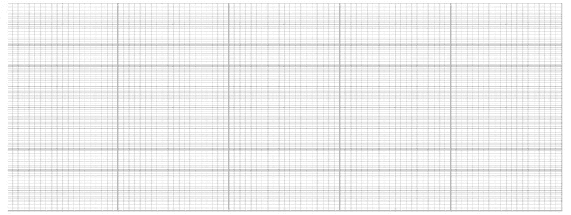

Plotters 网格（图片由作者提供）

在数据可视化的世界里，具有在图表中展示网格的灵活性至关重要。**Plotters**库通过启用[**网格功能**](https://docs.rs/plotters/latest/plotters/chart/struct.ChartContext.html#method.configure_mesh)来实现这一点。只需将`**chart.configure_mesh().draw()?;**`语句添加到我们的代码中，就可以增强图表的视觉吸引力和清晰度。

```py
evcxr_figure((640, 240), |root| {
    let mut chart = ChartBuilder::on(&root)
        .build_cartesian_2d(0f32..1f32, 0f32..1f32)?;

    chart.configure_mesh().draw()?;

    Ok(())
}).style("width:100%")
```

行`**ChartBuilder::on(&root).build_cartesian_2d(0f32..1f32, 0f32..1f32)?;**`允许我们手动设置 x 轴范围从 0 到 1 和 y 轴范围从 0 到 1。通过指定这些范围，我们可以精确控制图表的显示区域，确保最相关的数据点得到突出显示。

为了提高图表的清晰度和理解度，提供适当的坐标轴标签和**描述性标题**至关重要。以下代码片段可以作为示例：

```py
evcxr_figure((640, 480), |root| {
    let mut chart = ChartBuilder::on(&root)
        .caption("Plot Demo", ("Arial", 20).into_font())
        .x_label_area_size(50)
        .y_label_area_size(50)
        .build_cartesian_2d(0f32..1f32, 0f32..1f32)?;

    chart.configure_mesh()
        .x_desc("x = Array::range(1., 7., 0.1);")
        .y_desc("y = f(x)")
        .draw()?;

    Ok(())
}).style("width: 60%")
```

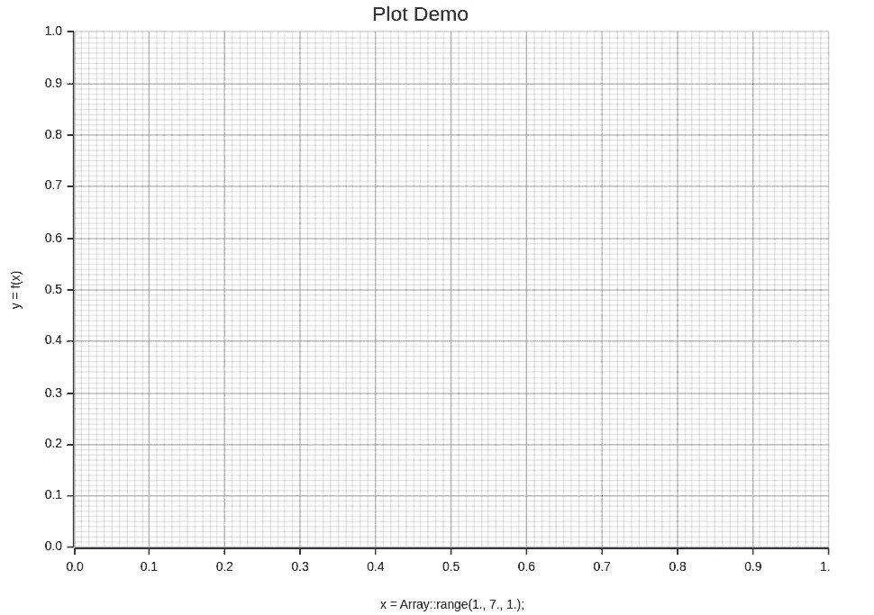

Plotters 标签（图片由作者提供）

在此代码中，我们添加了`**chart.configure_mesh().x_desc(“x = Array::range(1., 7., 1.);”).y_desc(“y = f(x)”).draw()?;**`语句，为我们的图表添加了有意义的注释。通过包括`**x_desc(“x = Array::range(1., 7., 1.);”)**`，我们为 x 轴标注了数据的简要描述。类似地，`**y_desc(“y = f(x)”)**`为 y 轴分配了一个标签，指示函数关系。此外，`**Caption(“Plot Demo”, (“Arial”, 20).into_font())**`提供了一个信息性标题，为图表提供了背景。所有这些元素共同提高了可视化的解释性，确保观众可以轻松理解图表的目的和内容。

除了标签和标题，**Plotters**还允许我们创建一个**图例**，以区分图表中的多个曲线。通过在`**label**`函数中传递标签参数并随后调用`**legend**`函数，我们可以生成一个图例。请参考以下代码示例：

```py
evcxr_figure((640, 480), |root| {
    let mut chart = ChartBuilder::on(&root)
        .caption("Plot Demo", ("Arial", 20).into_font())
        .x_label_area_size(50)
        .y_label_area_size(50)
        .build_cartesian_2d(1f32..7f32, 1f32..14f32)?;

    let x = Array::range(1., 7., 0.1);

    chart.configure_mesh()
        .x_desc("x = Array::range(1., 7., 1.);")
        .y_desc("y = f(x)")
        .draw()?;

    chart.draw_series(LineSeries::new(
        x.iter().map(|x| (*x, *x)),
        &RED
    )).unwrap()
        .label("y = x")
        .legend(|(x,y)| PathElement::new(vec![(x,y), (x + 20,y)], &RED));

    chart.draw_series(LineSeries::new(
        x.iter().map(|x| (*x, *x * 2.0)),
        &GREEN
    )).unwrap()
        .label("y = 2 * x")
        .legend(|(x,y)| PathElement::new(vec![(x,y), (x + 20,y)], &GREEN));

    chart.configure_series_labels()
        .background_style(&WHITE)
        .border_style(&BLACK)
        .draw()?;

    Ok(())
}).style("width: 60%")
```

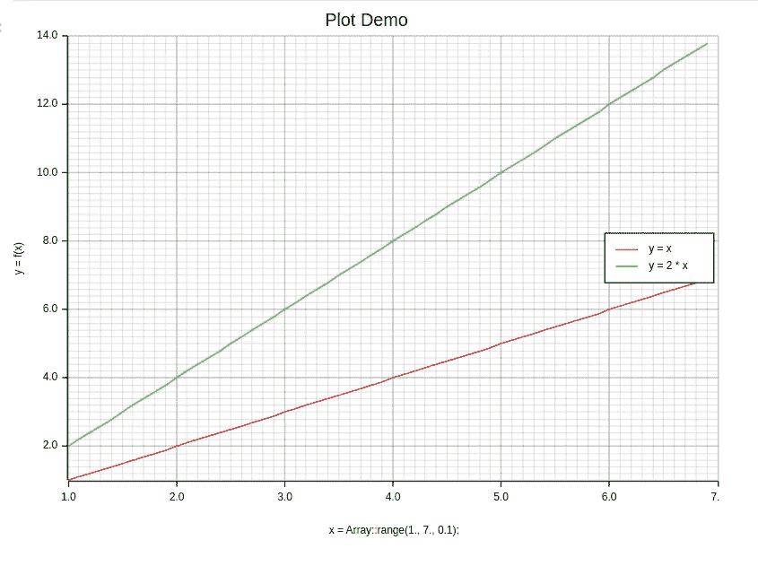

多行图带有标签、图例和网格（图片由作者提供）

通过执行此代码，我们创建了一个与图中各种曲线对应的图例。`**legend()**` 函数会自动生成一个基于 `**draw_series()**` 函数调用后提供的标签的图例。它帮助观众识别和区分不同的绘图函数。与网格、坐标轴标签和标题配合使用，图例提升了图形的整体可读性和理解度。

默认情况下，图例框位于图形的 **中右** 位置。然而，如果我们希望更改图例框的位置，可以通过在 `**position**` 函数中指定 `[**SeriesLabelPosition**](https://docs.rs/plotters/latest/plotters/chart/enum.SeriesLabelPosition.html)` 位置参数来实现。让我们相应地修改我们的代码片段：

```py
evcxr_figure((640, 480), |root| {
    let mut chart = ChartBuilder::on(&root)
        .caption("Plot Demo", ("Arial", 20).into_font())
        .x_label_area_size(50)
        .y_label_area_size(50)
        .build_cartesian_2d(1f32..7f32, 1f32..14f32)?;

    let x = Array::range(1., 7., 0.1);

    chart.configure_mesh()
        .x_desc("x = Array::range(1., 7., 0.1);")
        .y_desc("y = f(x)")
        .draw()?;

    chart.draw_series(LineSeries::new(
        x.iter().map(|x| (*x, *x)),
        &RED
    )).unwrap()
        .label("y = x")
        .legend(|(x,y)| PathElement::new(vec![(x,y), (x + 20,y)], &RED));

    chart.draw_series(LineSeries::new(
        x.iter().map(|x| (*x, *x * 2.0)),
        &GREEN
    )).unwrap()
        .label("y = 2 * x")
        .legend(|(x,y)| PathElement::new(vec![(x,y), (x + 20,y)], &GREEN));

    chart.configure_series_labels()
        .position(SeriesLabelPosition::UpperMiddle)
        .background_style(&WHITE)
        .border_style(&BLACK)
        .draw()?;

    Ok(())
}).style("width: 60%")
```

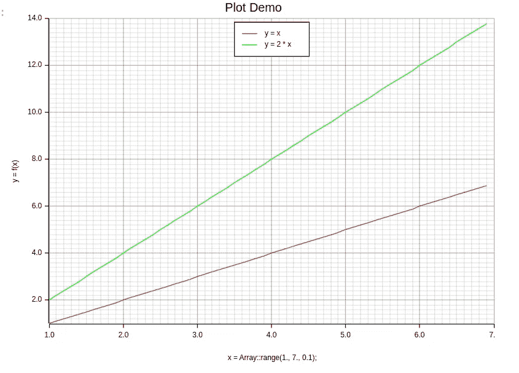

带有图例的多线图，图例位于图形的上中部（作者提供的图像）

通过在 `**configure_series_labels**` 函数中包含参数 `**position(SeriesLabelPosition::UpperMiddle)**`，我们将图例框重新定位到图形的上中部。这使我们能够微调图例的位置，确保其不干扰绘制的曲线或其他注释。自定义图例位置的能力增加了我们图形的多样性和美观性。

通过理解和利用 **Plotters** 中的这些功能，我们可以创建出视觉上吸引人且信息丰富的图形，自定义坐标轴范围，添加标签和标题，结合图例，并将我们的可视化结果保存为图像文件。这些功能使我们能够以引人注目且有意义的方式有效地传达和展示数据。

## 颜色和标记

**Plotters** 提供了广泛的样式和标记，旨在设计视觉上引人注目的易于理解的图形。样式使你能够修改线条的外观，而标记则有助于突出图形中的特定数据点。通过将各种颜色、样式和标记与 **Plotters** 的功能结合使用，你可以创建出专门为你的需求量身定制的独特图形。

**Plotters** 提供了高级的颜色映射，使得能够以各种颜色可视化复杂的数据。通过 **Plotters** 的 `**style**` 参数，你可以从一系列 [**预定义颜色映射**](https://docs.rs/plotters/latest/plotters/prelude/index.html#reexports) 中进行选择，或者使用像 `[**RGBColor**](https://docs.rs/plotters/latest/plotters/prelude/struct.RGBColor.html)` 这样的内置结构设计你自己的个性化颜色映射。这个参数在表示包含广泛值范围的数据或强调特定的绘图线条或其他形状时特别有用。你可以参考 [**完整调色板**](https://docs.rs/plotters/latest/plotters/style/colors/full_palette/index.html#constants) 来获取不同的 RGB 颜色值。

```py
evcxr_figure((640, 480), |root| {
    let mut chart = ChartBuilder::on(&root)
        .caption("Plot Demo", ("Arial", 20).into_font())
        .x_label_area_size(50)
        .y_label_area_size(50)
        .build_cartesian_2d(1f32..7f32, 1f32..14f32)?;

    let x = Array::range(1., 7., 0.1);

    chart.configure_mesh()
        .x_desc("x = Array::range(1., 7., 0.1);")
        .y_desc("y = f(x)")
        .draw()?;

    chart.draw_series(LineSeries::new(
        x.iter().map(|x| (*x, *x)),
        &RGBColor(0,0,255) // red: 0, green: 0, blue: 255 -> the color is blue 
    ))?;

    Ok(())
}).style("width: 60%")
```

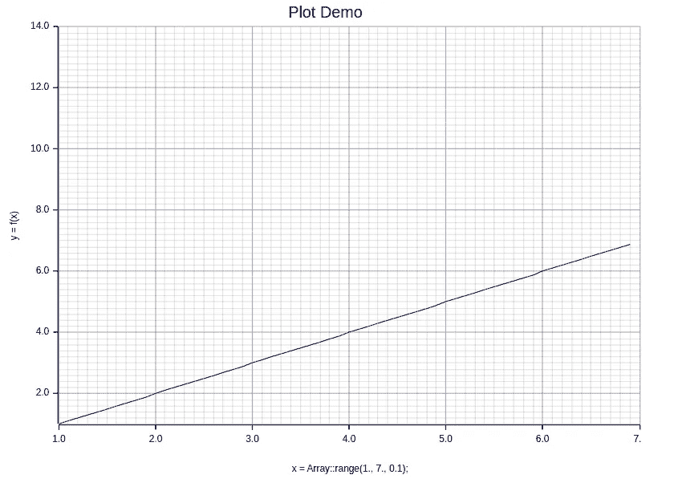

带有蓝色的单行折线图（图片由作者提供）

在这个例子中，我们将线条的颜色更改为蓝色。你也可以使用其他颜色格式，例如[**HSLColor**](https://docs.rs/plotters/latest/plotters/prelude/struct.HSLColor.html)，通过[**HSL 光谱值**](https://en.wikipedia.org/wiki/HSL_and_HSV)指定自定义颜色。

为了提升你在**Plotters**中折线图的视觉效果，考虑加入**标记**以表示每个图表的不同符号。如果你希望个性化，可以通过多种方式来定制这些标记。首先，我们可以利用`**draw_series**`方法，通过标记样式（如大小和颜色）绘制你的数据两次，依据个人偏好或特定的数据集特征。

```py
evcxr_figure((640, 480), |root| {
    let mut chart = ChartBuilder::on(&root)
        .caption("Plot Demo", ("Arial", 20).into_font())
        .x_label_area_size(50)
        .y_label_area_size(50)
        .build_cartesian_2d(1f32..7f32, 1f32..8f32)?;

    let x = Array::range(1., 7., 0.1);

    chart.configure_mesh()
        .x_desc("x = Array::range(1., 7., 0.1);")
        .y_desc("y = f(x)")
        .draw()?;

    chart.draw_series(LineSeries::new(
        x.iter().map(|x| (*x, *x)),
        &RED
    ))?;

    chart.draw_series(x.map(|x| {
        EmptyElement::at((*x, *x))
        + Cross::new((0, 0), 2, GREEN) // coordinates relative to EmptyElement
    }))?;

    Ok(())
}).style("width: 60%")
```

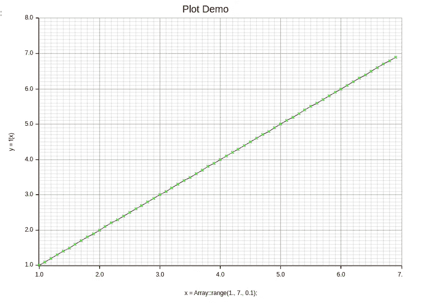

带有标记的线性单行折线图（图片由作者提供）

或者，我们可以使用`**point_size**`方法来设置标记的大小，这允许创建填充或空心圆形标记。

```py
evcxr_figure((640, 480), |root| {
    let mut chart = ChartBuilder::on(&root)
        .caption("Plot Demo", ("Arial", 20).into_font())
        .x_label_area_size(50)
        .y_label_area_size(50)
        .build_cartesian_2d(1f32..7f32, 1f32..8f32)?;

    let x = Array::range(1., 7., 0.1);

    chart.configure_mesh()
        .x_desc("x = Array::range(1., 7., 0.1);")
        .y_desc("y = f(x)")
        .draw()?;

    chart.draw_series(LineSeries::new(
        x.iter().map(|x| (*x, *x)),
        &RED
    ).point_size(2))?; // open circle marker

    Ok(())
}).style("width: 60%")
```

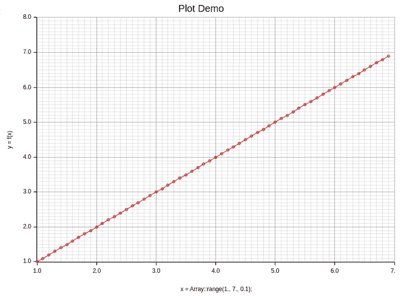

带有标记的折线图（图片由作者提供）

你可以结合所有这些技术（如颜色、标记、图例）来定制可视化，如下所示：

```py
evcxr_figure((640, 480), |root| {
    let mut chart = ChartBuilder::on(&root)
        .caption("Plot Demo", ("Arial", 20).into_font())
        .x_label_area_size(50)
        .y_label_area_size(50)
        .build_cartesian_2d(1f32..7f32, 1f32..342f32)?;

    let x = Array::range(1., 7., 0.1);

    chart.configure_mesh()
        .x_desc("x = Array::range(1., 7., 0.1);")
        .y_desc("y = f(x)")
        .draw()?;

    chart.draw_series(LineSeries::new(
        x.iter().map(|x| (*x, *x)),
        RED.filled()
    ).point_size(2)).unwrap()
        .label("y = x")
        .legend(|(x,y)| PathElement::new(vec![(x,y), (x + 20,y)], &RED));

    chart.draw_series(LineSeries::new(
        x.iter().map(|x| (*x, (*x).powi(3))),
        BLUE
    ).point_size(2)).unwrap()
        .label("y = x ^ 3")
        .legend(|(x,y)| PathElement::new(vec![(x,y), (x + 20,y)], &BLUE));

    chart.draw_series(LineSeries::new(
        x.iter().map(|x| (*x, (*x).powi(2))),
        &GREEN
    )).unwrap()
        .label("y = x ^ 2")
        .legend(|(x,y)| PathElement::new(vec![(x,y), (x + 20,y)], &GREEN));

    chart.draw_series(x.map(|x| {
        EmptyElement::at((*x, (*x).powi(2)))
        + Cross::new((0, 0), 2, WHITE) // coordinates relative to EmptyElement
    }))?;

    chart.configure_series_labels()
        .background_style(&WHITE)
        .border_style(&BLACK)
        .draw()?;

    Ok(())
}).style("width: 60%")
```

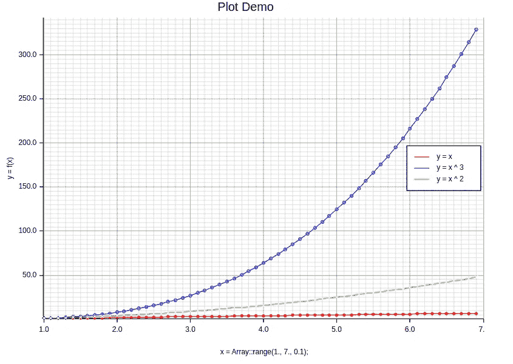

带有不同线条颜色、标记、标签、标题和图例的多行图（图片由作者提供）

总体而言，**Plotters**提供了一种简单而轻松的方式来个性化颜色和标记，使你能够制作出色的可视化图表。通过选择合适的色彩调色板，你的图表可以有效地传达有价值的信息。选择合适的颜色和标记可能会在成功传达信息中产生决定性的差异。

## 子图

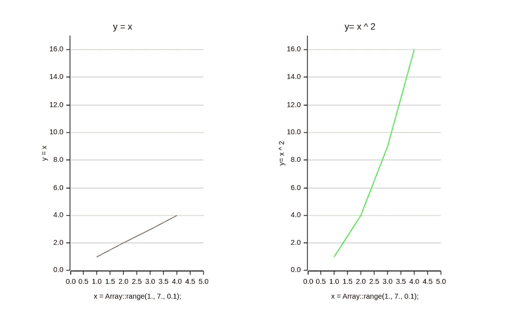

Plotters 子图（图片由作者提供）

子图技术是一种强大的方式，用于在同一输出中显示多个图表。当你想比较不同的数据集或展示单一数据集的不同方面时，这种方法尤其有用。使用**Plotters**，创建子图变得轻而易举，因为它允许你创建一个网格布局，其中每个后续图表的位置可以相对于其前任图表进行指定。

此外，每个子图都有可定制的规格，如标题和标签，这使得用户可以根据特定需求调整输出。子图特别适用于处理科学和数据分析中的复杂信息，因为它有助于简洁而有效地传达重要发现。

要在**Plotters**中生成子图，你可以使用`[**split_evenly**](https://docs.rs/plotters/0.3.5/plotters/drawing/struct.DrawingArea.html#method.split_evenly)`方法，该方法需要一个参数：一个包含行数和列数的元组。例如，如果你想为你的子图创建一个**1x2 布局**，并在第一个子图上绘制数据，则可以使用以下代码片段：

```py
let linear_coordinates: Vec<(f32, f32)> = {
    let x_y_axes = array!([[1., 2., 3., 4.], [1., 2., 3., 4.]]);
    let x_axis: Vec<f32> = x_y_axes.slice(s![0, 0, ..]).to_vec();
    let y_axis: Vec<f32> = x_y_axes.slice(s![0, 1, ..]).to_vec();
    x_axis.into_iter().zip(y_axis).collect()
};
let quadratic_coordinates: Vec<(f32, f32)> = {
    let x_y_axes = array!([[1., 2., 3., 4.], [1., 4., 9., 16.]]);
    let x_axis: Vec<f32> = x_y_axes.slice(s![0, 0, ..]).to_vec();
    let y_axis: Vec<f32> = x_y_axes.slice(s![0, 1, ..]).to_vec();
    x_axis.into_iter().zip(y_axis).collect()
};

evcxr_figure((640, 480), |root| {
    let sub_areas = root.split_evenly((1,2)); // 1x2 grid ( 1 row, 2 columns)

    let graphs = vec![
        ("y = x", linear_coordinates.clone(), &RED),
        ("y= x ^ 2", quadratic_coordinates.clone(), &GREEN),
    ];

    for ((idx, area), graph) in (1..).zip(sub_areas.iter()).zip(graphs.iter()) {
        let mut chart = ChartBuilder::on(&area)
            .caption(graph.0, ("Arial", 15).into_font())
            .x_label_area_size(40)
            .y_label_area_size(40)
            .build_cartesian_2d(0f32..5f32, 0f32..17f32)?;

        chart.draw_series(LineSeries::new(
            graph.1.iter().map(|(x, y)| (*x, *y)),
            graph.2,
        )).unwrap()
            .label(graph.0)
            .legend(|(x,y)| PathElement::new(vec![(x,y), (x + 20,y)], &GREEN));

        chart.configure_mesh()
            .y_labels(10)
            .light_line_style(&TRANSPARENT)
            .disable_x_mesh()
            .x_desc("x = Array::range(1., 7., 0.1);")
            .y_desc(graph.0)
            .draw()?;
    }

    Ok(())
}).style("width:100%")
```

这将创建一个**1x2 网格**的子图，并在两个子图中绘制数据，标题和轴标签已指定。传递给`**split_evenly**`的元组参数表示网格（1 行 2 列）。在**Plotters**中有多种方式进行子图操作，使用 `[**split_vertically**](https://docs.rs/plotters/0.3.5/plotters/drawing/struct.DrawingArea.html#method.split_vertically)`、`[**split_horizontally**](https://docs.rs/plotters/0.3.5/plotters/drawing/struct.DrawingArea.html#method.split_horizontally)`、`[**split_evenly**](https://docs.rs/plotters/0.3.5/plotters/drawing/struct.DrawingArea.html#method.split_evenly)` 和 `[**split_by_breakpoints**](https://docs.rs/plotters/0.3.5/plotters/drawing/struct.DrawingArea.html#method.split_by_breakpoints)`。

利用**Plotters**的子图功能，可以实现令人惊叹的可视化效果，这有助于通过清晰准确地展示见解来促进沟通。

## 错误条

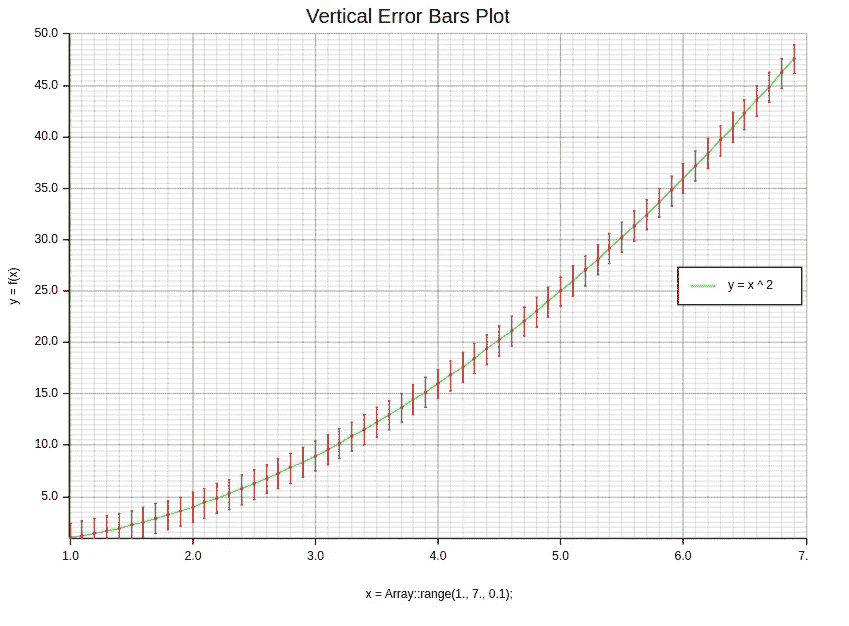

带有垂直误差条的单一图表（图片由作者提供）

为了准确表示数据，必须承认并透明化潜在的误差。这可以通过使用误差条来实现——这些图形表示展示了测量的变异性并指示不确定性水平。**Plotters**提供了一个简单的解决方案，其 `[**ErrorBar**](https://docs.rs/plotters/latest/plotters/element/struct.ErrorBar.html)` 函数，允许用户通过指定**x/y**坐标、**颜色/样式**偏好以及提供相关误差值，将这些重要的视觉辅助工具添加到任何图表中。我们来看以下代码片段：

```py
evcxr_figure((640, 480), |root| {
    let mut chart = ChartBuilder::on(&root)
        .caption("Vertical Error Bars Plot", ("Arial", 20).into_font())
        .x_label_area_size(50)
        .y_label_area_size(50)
        .build_cartesian_2d(1f32..7f32, 1f32..50f32)?;

    let x = Array::range(1., 7., 0.1);

    chart.configure_mesh()
        .x_desc("x = Array::range(1., 7., 0.1);")
        .y_desc("y = f(x)")
        .draw()?;

    chart.draw_series(LineSeries::new(
        x.iter().map(|x| (*x, (*x as f32).powi(2))),
        &GREEN
    )).unwrap()
        .label("y = x ^ 2")
        .legend(|(x,y)| PathElement::new(vec![(x,y), (x + 20,y)], &GREEN));

    chart.draw_series(x.map(|x| {
        ErrorBar::new_vertical(*x, (*x as f32).powi(2) - 1.5, (*x as f32).powi(2), (*x as f32).powi(2) + 1.4, RED.filled(), 2)
    })).unwrap();

    chart.configure_series_labels()
        .background_style(&WHITE)
        .border_style(&BLACK)
        .draw()?;

    Ok(())
}).style("width: 100%")
```

在这个例子中，我们选择在**y 轴**上显示**误差**，因为它通常更为显著。前面的图片是我们数据的可视化表示，展示了每个数据点周围的明显误差条。这些条形表示在一定**置信水平**下可能的值范围；较长的条形表示测量的**不确定性**更大。

然而，有时在两个轴上显示误差数据是有益的——特别是在处理**时间序列**或包含多个独立变量的实验数据时。在这种情况下，使用 `[**ErrorBar::new_horizontal**](https://docs.rs/plotters/latest/plotters/element/struct.ErrorBar.html#method.new_horizontal)` 方法并传递 x 轴误差的数组（对 y 轴误差做类似操作）就足够了。

```py
evcxr_figure((640, 480), |root| {
    let mut chart = ChartBuilder::on(&root)
        .caption("Horizontal Error Bars Plot", ("Arial", 20).into_font())
        .x_label_area_size(50)
        .y_label_area_size(50)
        .build_cartesian_2d(1f32..7f32, 1f32..50f32)?;

    let x = Array::range(1., 7., 0.1);

    chart.configure_mesh()
        .x_desc("x = Array::range(1., 7., 0.1);")
        .y_desc("y = f(x)")
        .draw()?;

    chart.draw_series(LineSeries::new(
        x.iter().map(|x| (*x, (*x as f32).powi(2))),
        &GREEN
    )).unwrap()
        .label("y = x ^ 2")
        .legend(|(x,y)| PathElement::new(vec![(x,y), (x + 20,y)], &GREEN));

    chart.draw_series(x.map(|x| {
        ErrorBar::new_horizontal((*x as f32).powi(2), *x - 0.3, *x, *x + 0.3, RED.filled(), 2)
    })).unwrap();

    chart.configure_series_labels()
        .background_style(&WHITE)
        .border_style(&BLACK)
        .draw()?;

    Ok(())
}).style("width: 100%")
```

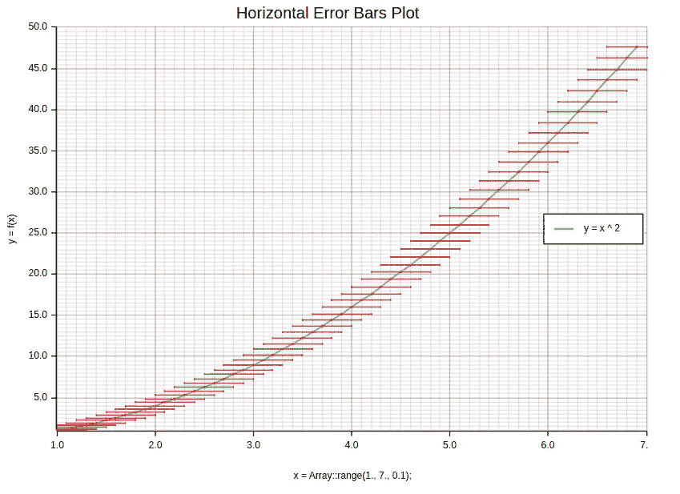

带有`horizontal`误差条的单一图表（图片由作者提供）

通过将这些元素融入你的可视化中——无论是科学家分享研究成果还是业务分析师展示销售数据——观众都能更好地理解与所展示信息相关的任何不确定性。因此，利用这一关键功能将确保精确的细节被准确传达，同时在演示中保持清晰，不会因**Plotters**的功能如误差条导致的数据表示中的错误而造成混淆！

## **散点图**

散点图是可视化数据和洞察**两个变量**之间**关系**的重要工具。**Plotters**通过将一个变量分配到**x 轴**，另一个分配到**y 轴**，并在相应坐标上绘制每个点，使在 Rust 中创建散点图变得轻而易举。通过调整点的颜色和大小，你可以在数据集中表示额外的维度。

使用散点图的主要**优势**在于它们**揭示了数据中的模式**或**簇**，这些在仅通过表格或图表时可能不明显。离群点也可以通过这种方法轻松识别。

此外，这些图形具有直观的特点，使任何人——无论统计专长如何——都能快速理解不同方面之间的关系，因此在展示发现时，它们是有用的沟通工具。

以下代码片段将生成均匀分布数据样本的散点图：

```py
evcxr_figure((640, 480), |root| {
    _ = root.fill(&WHITE);

    let mut chart = ChartBuilder::on(&root)
        .caption("Uniform Distribution Scatter Plot", ("Arial", 20).into_font())
        .x_label_area_size(40)
        .y_label_area_size(40)
        .build_cartesian_2d(0f32..1f32, 0f32..1f32)?;

    chart.configure_mesh()
        .disable_x_mesh()
        .disable_y_mesh()
        .y_labels(5)
        .x_label_formatter(&|x| format!("{:.1}", *x as f64 / 100.0))
        .y_label_formatter(&|y| format!("{}%", (*y * 100.0) as u32))
        .draw()?;

    let _ = chart.draw_series(random_samples.iter().map(|(x,y)| Circle::new((*x,*y), 3, GREEN.filled())));

    Ok(())
}).style("width:100%")
```

生成的散点图如下：

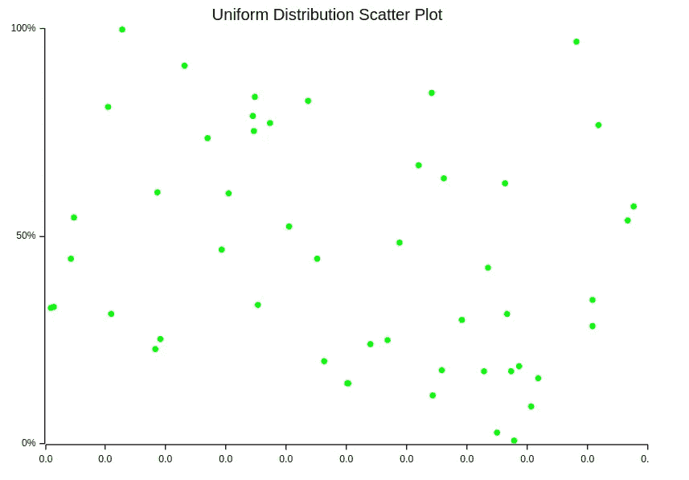

一张均匀分布数据样本的散点图（作者提供的图片）

总之，散点图提供了强大的可视化功能，让我们更好地理解数据集，同时提供了直接的方式与他人分享信息，这主要得益于**Plotters**库函数在 Rust 编程语言环境中的易用性！

## 直方图

直方图在分析数据分布时是一个不可或缺的工具。它们提供了信息如何在不同类别或区间中分布的视觉表示，使我们更容易理解和解读复杂的数据集。**Plotters**通过利用`[**Histogram::vertical**](https://docs.rs/plotters/latest/plotters/series/struct.Histogram.html)`函数，简化了这一过程，该函数使用线性数组将数据点分组为表示每个区间频率的条形图。

例如，如果我们需要绘制随机生成的均匀分布，创建直方图可以详细显示每个可能结果的频率，同时揭示数据集中存在的任何模式或趋势。分析这些图表可以帮助我们发现有关基础分布的宝贵洞察，例如人口中的年龄组分布、照片中记录的光照水平，或城市中观察到的月度降水量。

以下代码片段是绘制随机生成的均匀分布数据样本的示例：

```py
evcxr_figure((640, 480), |root| {
    let mut chart = ChartBuilder::on(&root)
        .caption("Histogram", ("Arial", 20).into_font())
        .x_label_area_size(50)
        .y_label_area_size(50)
        .build_cartesian_2d(0u32..100u32, 0f64..0.5f64)?;

    chart.configure_mesh()
        .disable_x_mesh()
        .disable_y_mesh()
        .y_labels(5)
        .x_label_formatter(&|x| format!("{:.1}", *x as f64 / 100.0))
        .y_label_formatter(&|y| format!("{}%", (*y * 100.0) as u32))
        .draw()?;

    let hist = Histogram::vertical(&chart)
        .style(RED.filled())
        .margin(0)
        .data(random_samples.iter().map(|(x,_)| ((x*100.0) as u32, 0.01)));

    let _ = chart.draw_series(hist);

    Ok(())
}).style("width:100%")
```

生成的直方图如下所示：

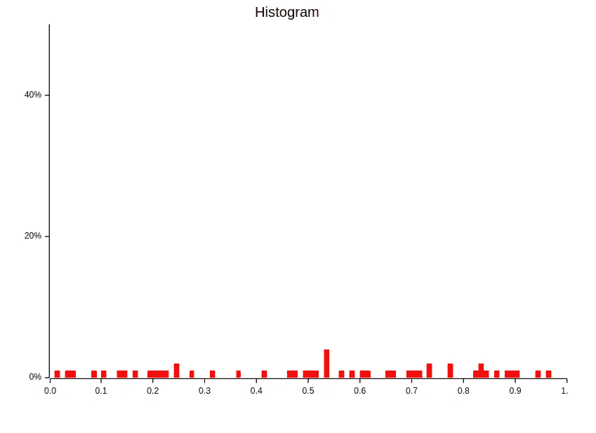

均匀分布数据样本的直方图（作者提供的图像）

总之，直方图提供了强大的工具，用于深入了解各种数据集并准确识别影响它们的关键因素。通过使用**Plotters**的功能，例如专门针对我们需求定制的可调整箱体大小，使我们在快速解释大量信息时更具灵活性，而不牺牲准确性！

## 结论


[Aaron Burden](https://unsplash.com/fr/@aaronburden?utm_source=medium&utm_medium=referral) 的照片，来自 [Unsplash](https://unsplash.com/?utm_source=medium&utm_medium=referral)

本文强调了可视化的重要性以及如何根据各种需求定制**Plotters**。**Plotters**在创建各种类型的图表（如单线图、多线图、散点图和直方图）方面证明了其无价之宝。此外，我们还学习了如何定制颜色线条、标记、图例等布局设计选项。

拥有新获得的知识，您可以自信地轻松导航**Plotters**的各种功能。有效利用这些方法将增强您对数据的理解，并使沟通结果更为准确。

在接下来的系列文章中，特别是第二部分，我们将探索引人入胜的数据可视化，包括但不限于饼图和 3D 可视化。我们的目标是使您能够成为数据的熟练视觉讲述者，揭示前所未有的隐藏洞察！

## 结束语


[Nick Morrison](https://unsplash.com/@nickmorrison?utm_source=medium&utm_medium=referral) 的照片，来自 [Unsplash](https://unsplash.com/?utm_source=medium&utm_medium=referral)

在我们结束本教程时，我想对所有投入时间和精力完成教程的人表达诚挚的感谢。与您一起展示 Rust 编程语言的卓越能力，真是非常愉快。

对数据科学充满热情，我承诺从现在开始每周或左右写至少一篇关于相关主题的综合文章。如果你对我的工作感兴趣，可以通过各种社交媒体平台与我联系，或者直接联系我以获得其他帮助。

谢谢！

## 资源

[## GitHub - wiseaidev/rust-data-analysis: 使用 Rust 进行**终极**数据分析课程](https://github.com/wiseaidev/rust-data-analysis?source=post_page-----7a34b6f4a603--------------------------------)

### 使用 Rust 进行**终极**数据分析课程。通过创建一个...

[github.com](https://github.com/wiseaidev/rust-data-analysis?source=post_page-----7a34b6f4a603--------------------------------) [docs.rs](https://docs.rs/plotters/latest/plotters/?source=post_page-----7a34b6f4a603--------------------------------) [## plotters - Rust]

### Plotters - 一个专注于数据绘图的 Rust 绘图库，适用于 WASM 和本地应用程序 🦀📈🚀

[docs.rs](https://docs.rs/plotters/latest/plotters/?source=post_page-----7a34b6f4a603--------------------------------) [## evcxr-jupyter-integration]

### 因为 evcxr 仅使用 SVG 图像和各种系列，因此我们不需要其他类型的后端。所以我们应该放置…

[plotters-rs.github.io](https://plotters-rs.github.io/plotters-doc-data/evcxr-jupyter-integration.html?source=post_page-----7a34b6f4a603--------------------------------)
