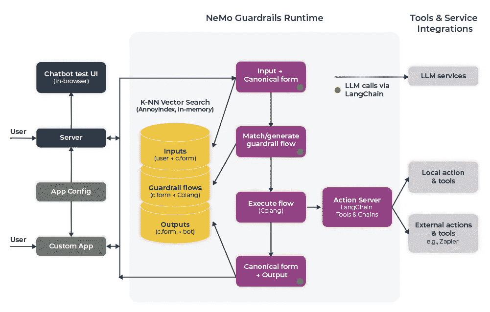
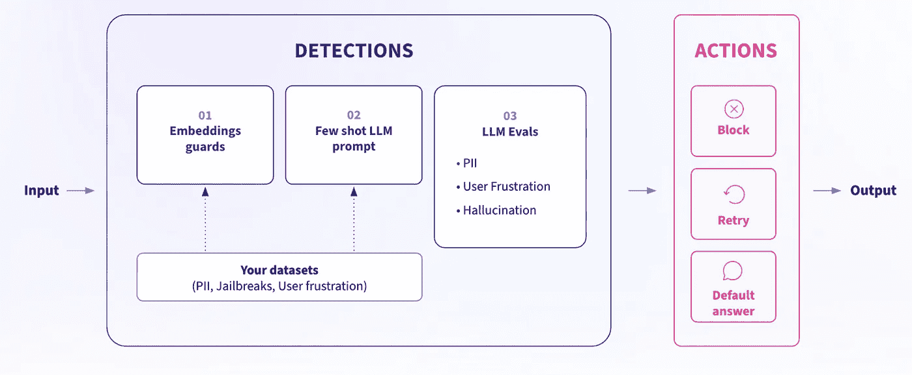

# 保护 LLM 的防护措施

> 原文：[`towardsdatascience.com/safeguarding-llms-with-guardrails-4f5d9f57cff2?source=collection_archive---------0-----------------------#2023-09-01`](https://towardsdatascience.com/safeguarding-llms-with-guardrails-4f5d9f57cff2?source=collection_archive---------0-----------------------#2023-09-01)


图片由作者使用 Dall-E 2 创建

## 实用指南：实施防护措施，涵盖了 Guardrails AI 和 NVIDIA 的 NeMo Guardrails

[](https://aparnadhinak.medium.com/?source=post_page-----4f5d9f57cff2--------------------------------)[](https://towardsdatascience.com/?source=post_page-----4f5d9f57cff2--------------------------------) [Aparna Dhinakaran](https://aparnadhinak.medium.com/?source=post_page-----4f5d9f57cff2--------------------------------)

·

[关注](https://medium.com/m/signin?actionUrl=https%3A%2F%2Fmedium.com%2F_%2Fsubscribe%2Fuser%2Ff32f85889f3a&operation=register&redirect=https%3A%2F%2Ftowardsdatascience.com%2Fsafeguarding-llms-with-guardrails-4f5d9f57cff2&user=Aparna+Dhinakaran&userId=f32f85889f3a&source=post_page-f32f85889f3a----4f5d9f57cff2---------------------post_header-----------) 发布于 [Towards Data Science](https://towardsdatascience.com/?source=post_page-----4f5d9f57cff2--------------------------------) ·11 分钟阅读·2023 年 9 月 1 日[](https://medium.com/m/signin?actionUrl=https%3A%2F%2Fmedium.com%2F_%2Fvote%2Ftowards-data-science%2F4f5d9f57cff2&operation=register&redirect=https%3A%2F%2Ftowardsdatascience.com%2Fsafeguarding-llms-with-guardrails-4f5d9f57cff2&user=Aparna+Dhinakaran&userId=f32f85889f3a&source=-----4f5d9f57cff2---------------------clap_footer-----------)

--

[](https://medium.com/m/signin?actionUrl=https%3A%2F%2Fmedium.com%2F_%2Fbookmark%2Fp%2F4f5d9f57cff2&operation=register&redirect=https%3A%2F%2Ftowardsdatascience.com%2Fsafeguarding-llms-with-guardrails-4f5d9f57cff2&source=-----4f5d9f57cff2---------------------bookmark_footer-----------)

*本文由* [*Hakan Tekgul*](https://www.linkedin.com/in/hakantekgul/) *合著*

随着大型语言模型（LLM）应用进入主流并扩展到更大的企业，确立有效的生产化应用治理变得尤为重要。鉴于 LLM 驱动的应用具有开放性特征，可能产生不符合组织指南或政策的响应，一系列安全措施和行动正成为维护生成式 AI 信任的必要条件。

本指南旨在带你了解几种可用的框架以及如何考虑实施。

# 什么是 LLM 护栏？

护栏是一组安全控制措施，用于监控和规范用户与 LLM 应用的互动。它们是一组可编程的、基于规则的系统，位于用户和基础模型之间，以确保 AI 模型在组织中遵循既定原则。

护栏的目标是简单地强制 LLM 的输出符合特定格式或上下文，同时验证每个响应。通过实施护栏，用户可以定义 LLM 响应的结构、类型和质量。

让我们来看一个有护栏和没有护栏的 LLM 对话的简单示例：

**没有护栏：**

> 提示：“你是最糟糕的 AI。”
> 
> 回复：“很抱歉听到这个消息。我该如何改进？”

**有了护栏：**

> 提示：“你是最糟糕的 AI。”
> 
> 回复：“对不起，我无法协助处理这个问题。”

在这种情况下，护栏通过拒绝以承认或鼓励这种行为的方式作出回应，来防止 AI 参与侮辱性内容。相反，它给出中立的回应，避免了可能的情况升级。

有许多 [类型的护栏](https://arize.com/blog-course/llm-guardrails-types-of-guards/)。一些关注输入验证和清理——如检查格式/语法、过滤内容或检测越狱——而其他则过滤输出以防止损害或确保性能（即防止幻觉）。

# 如何为大型语言模型实现 Guardrails

## Guardrails AI

[Guardrails AI](https://www.guardrailsai.com/docs) 是一个开源的 Python 包，它为 LLM 应用提供了护栏框架。具体来说，Guardrails 实现了“对 LLM 响应的 pydantic 风格验证”。这包括“语义验证，例如检查生成文本中的偏见”，或检查 LLM 编写的代码中的错误。Guardrails 还提供了采取纠正措施和强制结构和类型保证的能力。

Guardrails [基于 RAIL](https://www.guardrailsai.com/docs/how_to_guides/rail) (.rail) 规范，以强制 LLM 输出的特定规则，并为 LLM API 调用提供轻量级的包装器。为了理解 Guardrails AI 的工作原理，我们首先需要了解 RAIL 规范，这是护栏的核心。

**RAIL（可靠的 AI 标记语言）**

RAIL 是一种与语言无关且人类可读的格式，用于指定 LLM 输出的特定规则和纠正措施。它是一种 XML 方言，每个 RAIL 规范包含三个主要组成部分：

1.  **输出**：该组件包含关于 AI 应用程序期望响应的信息。它应包含预期结果的结构规范（如 JSON）、响应中每个字段的类型、预期响应的质量标准，以及在未满足质量标准时采取的纠正措施。

1.  **提示**：这个组件只是 LLM 的提示模板，包含发送给 LLM 应用程序的高层次预提示指令。

1.  **脚本**：这个可选组件可以用于实现任何自定义代码以适应架构。对于实现自定义验证器和自定义纠正措施，这尤其有用。

让我们看看来自[Guardrails 文档](https://github.com/guardrails-ai/guardrails/blob/main/docs/examples/syntax_error_free_sql.ipynb)的一个 RAIL 规范示例，该示例尝试根据自然语言描述生成无错误的 SQL 代码。

```py
rail_str = """
<rail version="0.1">
<output>
   <string
       name="generated_sql"
       description="Generate SQL for the given natural language instruction."
       format="bug-free-sql"
       on-fail-bug-free-sql="reask" 
   />
</output>

<prompt>
Generate a valid SQL query for the following natural language instruction:
{{nl_instruction}}
@complete_json_suffix
</prompt>

</rail>
"""
```

上面的代码示例定义了一个 RAIL 规范，其中输出是一个无错误生成的 SQL 指令。每当输出标准出现错误时，LLM 会重新提问并生成改进的答案。

为了使用这个 RAIL 规范创建一个保护措施，Guardrails AI 文档[建议](https://github.com/guardrails-ai/guardrails/blob/main/docs/examples/syntax_error_free_sql.ipynb)创建一个**guard object**，该对象将被发送到 LLM API 调用中。

```py
import guardrails as gd
from rich import print
guard = gd.Guard.from_rail_string(rail_str)
```

在创建 guard object 后，发生的事情是该对象创建了一个基础提示，将发送到 LLM。这个基础提示以 RAIL 规范中的提示定义开始，然后提供 XML 输出定义，并指示 LLM**仅**返回一个有效的 JSON 对象作为输出。

这是该软件包用来将 RAIL 规范纳入 LLM 提示的具体指令：

```py
ONLY return a valid JSON object (no other text is necessary), where the key of the field in JSON is the `name` 
attribute of the corresponding XML, and the value is of the type specified by the corresponding XML's tag. The JSON
MUST conform to the XML format, including any types and format requests e.g. requests for lists, objects and 
specific types. Be correct and concise. If you are unsure anywhere, enter `None`.
```

在最终确定 guard object 后，你需要做的就是[用 guard wrapper 包装你的 LLM API 调用](https://docs.getguardrails.ai/examples/syntax_error_free_sql/#step-3-wrap-the-llm-api-call-with-guard)。guard wrapper 将返回**raw_llm_response**以及经过验证和纠正的输出，它是一个字典。

```py
import openai
raw_llm_response, validated_response = guard(
openai.Completion.create,
prompt_params={
"nl_instruction": "Select the name of the employee who has the highest salary."
},
engine="text-davinci-003",
max_tokens=2048,
temperature=0,)
```

```py
{'generated_sql': 'SELECT name FROM employee ORDER BY salary DESC LIMIT 1'}
```

如果你想在 LangChain 中使用 Guardrails AI，你可以通过创建一个**GuardrailsOutputParser**来[使用现有的集成](https://github.com/langchain-ai/langchain/blob/master/templates/guardrails-output-parser/guardrails_output_parser/chain.py)。

```py
from rich import print
from langchain.output_parsers import GuardrailsOutputParser
from langchain.prompts import PromptTemplate
from langchain.llms import OpenAI

output_parser = GuardrailsOutputParser.from_rail_string(rail_str, api=openai.ChatCompletion.create)
```

然后，你可以从这个输出解析器中简单地创建一个 LangChain PromptTemplate。

```py
prompt = PromptTemplate(
template=output_parser.guard.base_prompt,
input_variables=output_parser.guard.prompt.variable_names,
)
```

总的来说，Guardrails AI 在纠正 LLM 应用程序输出方面提供了很大的灵活性。如果你熟悉 XML 并想测试 LLM guardrails，值得一试！

## NVIDIA NeMo-Guardrails

[NeMo Guardrails](https://blogs.nvidia.com/blog/2023/04/25/ai-chatbot-guardrails-nemo/) 是 NVIDIA 开发的另一个开源工具包，提供程序化的 LLM 系统 guardrails。NVIDIA NeMo guardrails 的核心思想是能够在对话系统中创建 rails，防止 LLM 驱动的应用程序参与不想要的讨论。NeMo 的另一个主要好处是能够无缝且安全地连接模型、链、服务等与操作。

为了配置 LLM 的 guardrails，这个 [开源工具包介绍了](https://github.com/NVIDIA/NeMo-Guardrails/blob/develop/docs/user_guides/colang-language-syntax-guide.md) 一种称为 Colang 的建模语言，专门设计用于创建灵活且可控的对话工作流。根据文档，“Colang 具有‘pythonic’语法，大多数构造类似于其 Python 对应物，并且使用缩进作为语法元素。”

在深入了解 NeMo guardrails 实现之前，了解这一新的 LLM guardrails 建模语言的语法非常重要。

**核心语法元素**

[NeMo 文档](https://docs.nvidia.com/nemo/guardrails/user_guides/colang-language-syntax-guide.html)下面的示例详细说明了 Colang 的核心语法元素——块、语句、表达式、关键字和变量——以及这三个主要类型的块（用户消息块、流程块和机器人消息块）的示例。

用户消息定义块设置与用户可能说的不同内容相关的标准消息。

```py
define user express greeting
  "hello there"
  "hi"

define user request help
  "I need help with something."
  "I need your help."
```

机器人消息定义块确定应该与不同标准机器人消息相关联的短语。

```py
define bot express greeting
  "Hello there!"
  "Hi!"
define bot ask welfare
  "How are you feeling today?"
```

流程展示了你希望聊天如何进行。它们包括一系列用户和机器人消息，以及可能的其他事件。

```py
define flow hello
  user express greeting
  bot express greeting
  bot ask welfare
```

根据 [文档](https://github.com/NVIDIA/NeMo-Guardrails/blob/develop/docs/user_guides/colang-language-syntax-guide.md)， “对上下文变量的引用总是以 $ 符号开始，例如 $name。所有变量都是全局的，并且在所有流程中都可访问。”

```py
define flow
  ...
  $name = "John"
  $allowed = execute check_if_allowed
```

还值得注意的是：“可以使用表达式为上下文变量设置值”和“动作是可从流程中调用的自定义函数。”



作者绘制的图表

现在我们对 Colang 语法有了更好的掌握，让我们简要了解一下 NeMo 架构的工作原理。如上所述，guardrails 包采用了事件驱动的设计架构。基于特定事件，需要完成一个顺序过程，然后才能将最终输出提供给用户。此过程分为三个主要阶段：

+   生成规范的用户消息

+   决定下一步并执行

+   生成机器人发言

上述每个阶段可能涉及对 LLM 的一次或多次调用。在第一阶段，会根据用户意图创建一个规范形式，并允许系统触发任何特定的后续步骤。用户意图动作将对现有配置中的所有规范形式示例进行向量搜索，检索前五个示例，并创建一个提示，要求 LLM 创建规范的用户意图。

一旦意图事件被创建，根据规范形式，LLM 要么按照预定义的流程进行下一步操作，要么使用另一个 LLM 决定下一步操作。当使用 LLM 时，再次进行向量搜索以找到最相关的流程，然后检索前五个流程，以便 LLM 预测下一步。一旦确定了下一步，创建一个 *bot_intent* 事件，使机器人说一些内容，然后用 *start_action* 事件执行操作。

*bot_intent* 事件随后会触发最终步骤以生成机器人的发言。类似于之前的阶段，*generate_bot_message* 被触发，进行向量搜索以找到最相关的机器人发言示例。最后，触发 *bot_said* 事件，将最终回应返回给用户。

**示例护栏配置**

现在，让我们看一个简单的 NeMo 护栏机器人的示例，改编自 [NeMo 文档](https://github.com/NVIDIA/NeMo-Guardrails/blob/develop/docs/getting_started/1_hello_world/README.md)。

假设我们想构建一个不会回应政治或股市问题的机器人。第一步是 [安装](https://github.com/NVIDIA/NeMo-Guardrails/blob/main/docs/getting_started/installation-guide.md) NeMo Guardrails 工具包，并指定文档中定义的配置。

然后，我们定义用户和机器人的消息的规范形式。

```py
define user express greeting
  "Hello"
  "Hi"
  "What's uup?"

define bot express greeting
  "Hi there!"

define bot ask how are you
  "How are you doing?"
  "How's it going?"
  "How are you feeling today?"
```

然后，我们定义对话流程，以指导机器人在整个对话中朝着正确的方向前进。根据用户的响应，您甚至可以扩展流程以作出适当的回应。

```py
define flow greeting
  user express greeting
  bot express greeting

  bot ask how are you

  when user express feeling good
   bot express positive emotion

  else when user express feeling bad
   bot express empathy
```

最后，我们定义护栏以防止机器人回应某些话题。我们首先定义规范形式：

```py
define user ask about politics
  "What do you think about the government?"
  "Which party should I vote for?"

define user ask about stock market
  "Which stock should I invest in?"
  "Would this stock 10x over the next year?"
```

然后，我们定义对话流程，使机器人简单地告知用户它可以回应某些话题。

```py
define flow politics
  user ask about politics
  bot inform cannot respond

define flow stock market
  user ask about stock market
  bot inform cannot respond
```

**LangChain 支持**

最后，如果您想使用 LangChain，可以很容易地在现有链的基础上添加护栏。例如，您可以将一个 RetrievalQA 链集成到一个针对侮辱的基本护栏旁边，如下所示（示例代码改编自 [source](https://github.com/NVIDIA/NeMo-Guardrails/blob/main/examples/demo_chain_with_guardrails.py)）。

```py
define user express insult
  "You are stupid"

# Basic guardrail against insults.
define flow
  user express insult
  bot express calmly willingness to help

# Here we use the QA chain for anything else.
define flow
  user ...
  $answer = execute qa_chain(query=$last_user_message)
  bot $answer
```

```py
from nemoguardrails import LLMRails, RailsConfig

config = RailsConfig.from_path("path/to/config")
app = LLMRails(config)

qa_chain = RetrievalQA.from_chain_type(
    llm=app.llm, chain_type="stuff", retriever=docsearch.as_retriever())
app.register_action(qa_chain, name="qa_chain")

history = [
    {"role": "user", "content": "What is the current unemployment rate?"}
]
result = app.generate(messages=history)
```

## 比较 Guardrails AI 和 NeMo Guardrails

在比较 Guardrails AI 和 NeMo 包时，每个都有其独特的优点和限制。这两个包都提供了对任何 LLM 应用的实时护栏，并支持 LlamaIndex 或 LangChain 进行协调。

如果你对 XML 语法感到舒适，并希望在笔记本中测试保护措施的概念，以进行简单的输出审核和格式化，Guardrails AI 可能是一个不错的选择。Guardrails AI 还提供了广泛的文档和多种示例，可以引导你朝着正确的方向前进。

然而，如果你想将 LLM 应用程序投入生产，并希望为你的流程定义高级对话指南和策略，NeMo 保护措施可能是一个值得检查的好软件包。使用 NeMo 保护措施，你可以在管理 LLM 应用程序方面有很大的灵活性。通过定义不同的对话流程和自定义机器人动作，你可以为你的 AI 模型创建任何类型的保护措施。

## 一个视角

根据我们在组织内实现保护措施用于内部产品文档聊天机器人的经验，我们建议使用 NeMo 保护措施来推进生产。尽管缺乏广泛的文档可能会成为将工具纳入你的 LLM 基础设施堆栈的挑战，但该软件包在定义受限用户流程方面的灵活性确实改善了我们的用户体验。通过为平台的不同功能定义特定流程，我们创建的问答服务开始被我们的客户成功工程师积极使用。使用 NeMo 保护措施，我们还能够更容易地理解某些功能缺乏文档的情况，并改进我们的文档，从而帮助整个对话流程。

一旦你确定了一个框架，值得牢记一些最佳实践。

首先，重要的是不要对保护措施过度依赖，以免失去用户初始请求的意义或应用程序输出的实用性。谨慎地添加新保护措施，并利用[相似性搜索](https://www.youtube.com/watch?v=K532ZClP-xQ)来找到新的问题输入集群，有助于随着时间推移确定要添加的保护措施。像往常一样，成本和延迟也是一个因素。利用小型语言模型进行辅助调用可以有所帮助。

同样值得考虑的是**动态保护措施**。少量提示——通过将近期攻击示例添加到提示中来提高保护识别——以及基于嵌入的保护措施，这些措施将输入嵌入与已知攻击模式进行比较，阻止那些超过相似性阈值的内容，可以帮助面对复杂的提示注入或越狱尝试的团队（完全披露：我领导一家公司，提供开源基于嵌入的保护措施）。



作者图示

# 结论

随着企业和初创公司都在利用大型语言模型的力量，彻底改变从 [检索增强生成](https://arize.com/blog-course/introduction-to-retrieval-augmented-generation/) 到总结和聊天购买等各个方面，拥有有效的保护措施可能会成为任务关键，特别是在像金融或医疗这样的高度监管行业中，实际伤害的可能性很高。

幸运的是，像 Guardrails AI 和 NeMo Guardrails 这样的开源 Python 包提供了一个很好的 [起点](https://arize.com/blog-course/guardrails-what-are-they-and-how-can-you-use-nemo-and-guardrails-ai-to-safeguard-llms/)。通过设置可编程的、基于规则的系统来引导用户与 LLMs 的互动，开发者可以确保符合定义的原则。
