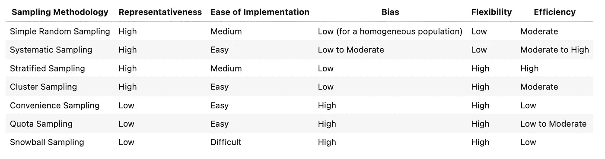

# 采样——数据科学中的无名英雄

> 原文：[`towardsdatascience.com/sampling-the-unsung-hero-of-data-science-5687c1bd1c1e`](https://towardsdatascience.com/sampling-the-unsung-hero-of-data-science-5687c1bd1c1e)

## 采样：方法论、实施与比较

  [Farzad Mahmoodinobar](https://medium.com/@fmnobar?source=post_page-----5687c1bd1c1e--------------------------------)

·发表于[Towards Data Science](https://towardsdatascience.com/?source=post_page-----5687c1bd1c1e--------------------------------) ·6 分钟阅读·2023 年 1 月 18 日

--


一，代表所有，图像由[DALL.E 2](https://openai.com/dall-e-2/)

采样在各种业务中被广泛采用，以进行审计和测量变化——我知道这听起来很简单，但实际上比看起来要复杂得多。我看到今天的数据科学工作中对机器学习有很多关注，但如果没有一个设计良好且具有代表性的样本，所有的努力可能都不会产生效果。例如，在训练一个全新的机器学习模型变体后，我们需要一个具有代表性的样本来确定与模型的前一个版本相比，改进（或退化）的程度——而仅仅收集一个随机样本并不总是正确的解决方案。设计不良的样本如果不能很好地代表总体，可能会导致错误的结论和业务决策。

在这篇文章中，我将介绍和比较各种采样方法，希望可以作为未来采样策略设计的参考。

让我们开始吧！

[## 使用我的推荐链接加入 Medium - Farzad Mahmoodinobar](https://medium.com/@fmnobar/membership?source=post_page-----5687c1bd1c1e--------------------------------)

### 阅读 Farzad（和 Medium 上的其他作者）的每一个故事。您的会员费用直接支持 Farzad 和其他作者…

[medium.com](https://medium.com/@fmnobar/membership?source=post_page-----5687c1bd1c1e--------------------------------)

# 什么是采样？

采样是从一个较大的数据集中收集（或选择）一个子集的过程。收集到的较小子集称为***“样本”***，而从中收集样本的较大集合称为***“总体”***。样本用于对总体的特征（或属性）进行推断。那么为什么需要样本呢？为什么不直接分析总体呢？

有各种原因，但一些最常见的包括：

1.  **成本：** 在某些情况下，例如当总体非常大时，分析整个总体的成本效益较低。换句话说，样本使我们能够通过分析总体的一个更小的子集来对总体进行推断，这个子集就是样本。

1.  **时间：** 这与成本类似。如果总体非常大，可能无法花时间分析整个总体。例如，美国人口普查根据样本对美国人口进行推断，因为分析整个美国人口在成本和时间上都不高效（以及其他原因）。

1.  **效率：** 一个设计良好且收集的样本在理论上能很好地代表整个总体。换句话说，从样本中得出的推断（样本小于总体）可以扩展到整个总体。这使得分析效率大大提高，相较于分析整个总体。

# 抽样方法

抽样方法的选择取决于研究和/或业务问题以及所研究的总体类型。换句话说，我们首先需要理解我们想要测量什么，然后基于此选择合适的抽样方法，以确保结果样本在研究中代表总体，考虑到现有的限制（例如时间、成本等）。

抽样方法可以分为两类：

1.  **概率抽样：** 在这种情况下，总体中每个成员被选中的概率非零（例如通过随机抽样等）。

1.  **非概率抽样：** 在这种情况下，总体中每个成员的选择概率要么为零，要么未知，样本收集主要由便利性或可用性驱动。随着我们对每个组的深入了解，这将更容易理解。

让我们更详细地看一下这两个类别。

## 1\. 概率抽样

## **1.1\. 简单随机抽样 (SRS)**

总体中的每个成员都有相等的机会被选入样本，这也被称为随机抽样。

从 Python 中的一个给定 `population` 中抽取大小为 `k` 的 SRS 可以很简单：

```py
# Import libraries
import random

# Collect the sample
sample = random.sample(population, k)
```

## **1.2\. 系统抽样**

从总体中每隔 *k* 个成员进行收集（从总体中的一个随机点开始），直到达到所需的样本大小。从 Python 中的每隔 *k* 个成员收集大小为 `n` 的样本如下：

```py
# Collect the sample
sample = population[k-1::n]
```

## **1.3\. 分层抽样：**

总体根据总体的一个属性被划分为较小的组或层，然后从每个层中收集样本，样本的大小与该层相对于总体的权重成比例。例如，如果 55%的总体是女性，45%是男性（假设女性与男性是选择的分层策略），为了收集 100 个样本，将从女性层收集 55 个样本（因为该层占总体的 55%），其余的 45 个样本将从男性层收集。

以下是分层抽样的 Python 实现：

```py
# Import libraries
from sklearn.utils import resample

# Create an empty list to store the stratified samples
stratified_samples = []

# Collect the sample
for label, stratum in strata.items():
    # Collect the subset of sample for that lable/stratum
    sample = resample(stratum, n_samples=sample_size)

    # Add the subset to the overall sample
    stratified_samples.append(sample)
```

请注意，上述`strata`是一个字典，其中标签作为键，总体作为值。

## **1.4\. 集群抽样：**

总体被划分为集群，然后随机抽取集群样本。乍一看，集群抽样和分层抽样似乎很相似，所以让我解释一下区别。在分层抽样中，我们从每个层中收集随机样本（类似于上述示例）。但在集群抽样中，总体被分解为“n”个集群，然后随机选择“m”个集群。当一个集群被选择时，整个集群中的观测值都会被收集（不同于分层抽样，其中从每个层中收集了一个随机样本）。

以下是集群抽样的 Python 实现：

```py
# Import libraries
import pandas as pd
import random

# Create a list of clusters from the population dataframe
total_clusters = population['cluster'].unique()

# Select m random clusters from clusters_list
selected_clusters = random.sample(total_clusters, m)

# Select rows of the population dataframe with the randomly-selected clusters
sample = population[population['cluster'].isin(selected_clusters)]
```

## **1.5\. 多阶段抽样**

正如名称所示，这是一种多阶段抽样，对于每个阶段，可以使用上述任何方法，然后将得到的样本作为下一阶段的总体。例如，我们可以从 10,000 个观测值的总体开始，在第一阶段收集 2,000 个简单随机样本。然后这 2,000 个收集到的观测值将成为第二阶段的总体，我们可以使用不同的方法收集另一个样本，例如上述 1 到 4 中的任何一种方法。

> 有时，2 到 5 中的概率抽样方法被称为“复杂抽样”，与第一种相对较简单的抽样类型相比。

## 2\. 非概率抽样

## **2.1\. 便利抽样**

收集那些容易获取或可用的样本。例如，假设一个学生在学校进行研究，并希望找到 100 名志愿者填写问卷。那么学生可能会选择 100 名在那个时间点上 readily available 的学生来填写问卷，这将导致对该学校学生总体的便利抽样。

## **2.2\. 雪球抽样**

有时很难识别属于目标总体的个体。在这种情况下，研究人员从可以识别的成员开始，然后要求这些个体推荐其他成员（这就像雪球效应）。

## **2.3\. 配额抽样**

一种非概率抽样方法，研究人员决定收集多少样本，并在达到所需数量后停止。

# 抽样方法比较

我在下表中创建了对本文讨论的各种抽样方法的比较。我尽量在制作这个表格时去除个人偏见，但总体上这个主题是高度主观的，具体情况可能会根据使用案例的不同而有所变化。



抽样方法比较

下面是每一列的定义：

+   **代表性：** 样本预计能多么紧密地呈现总体的属性

+   **实施难易度：** 实施抽样方法的难易程度

+   **偏差：** 样本可能偏离其代表的总体的程度

+   **灵活性：** 抽样方法对不同场景的适应性

+   **效率：** 样本对其所代表的总体属性的估计准确程度

# 结论

在本文中，我们回顾了抽样的重要性以及根据研究和业务需求设计良好样本的价值。接着，我们审查了各种概率和非概率抽样方法，并进行了比较，以便更好地理解可用的抽样选项。

# 感谢阅读！

如果你觉得这篇文章有帮助，请 [关注我在 Medium](https://medium.com/@fmnobar) 并订阅以接收我最新的文章！
