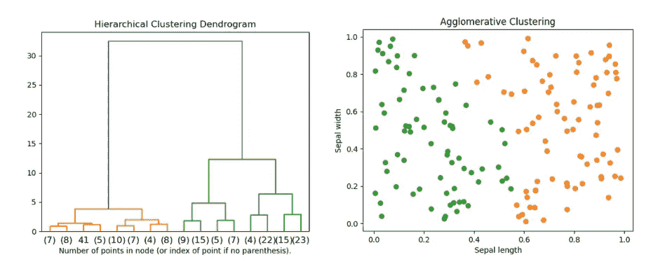
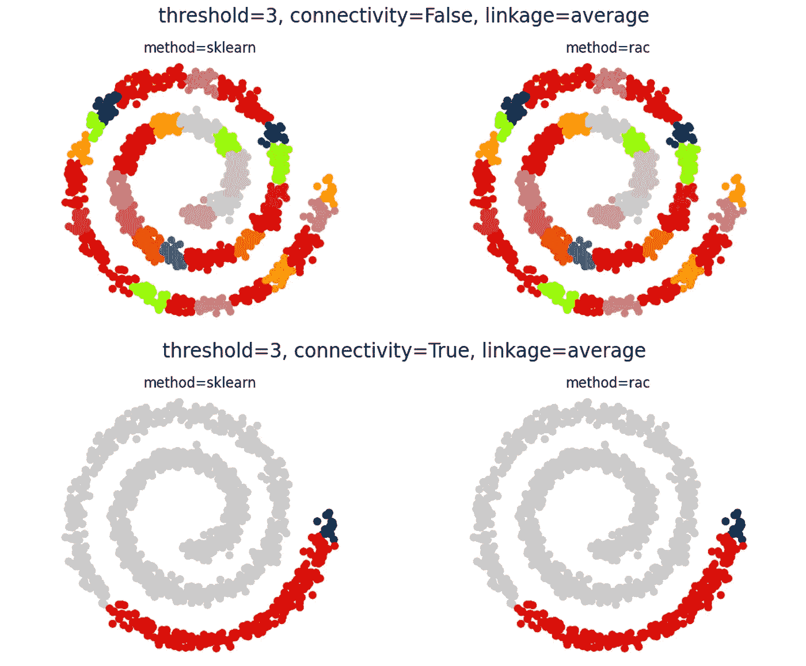
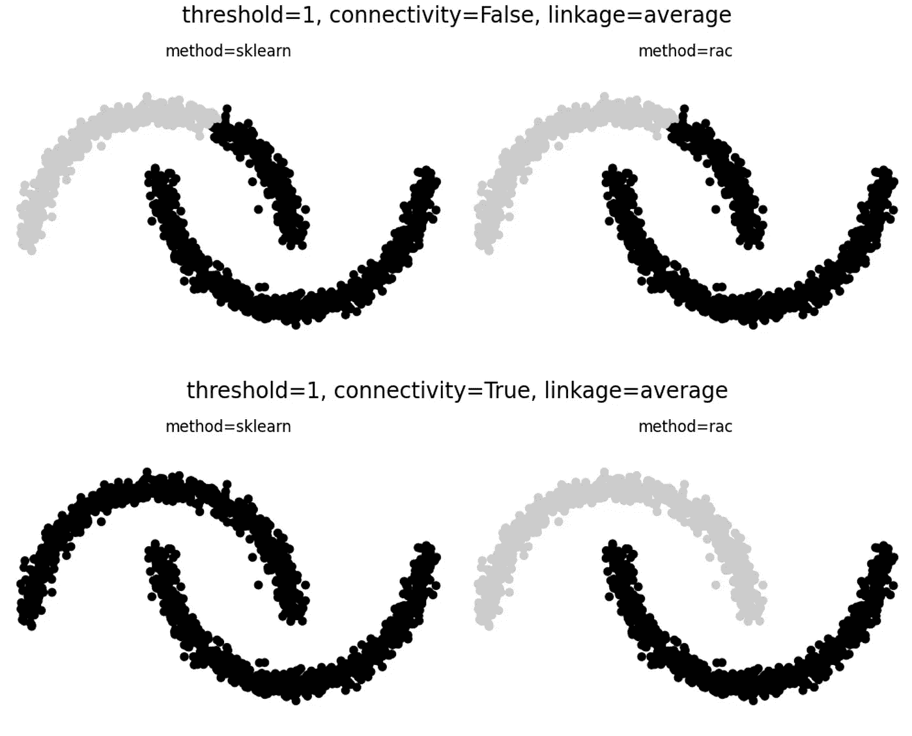
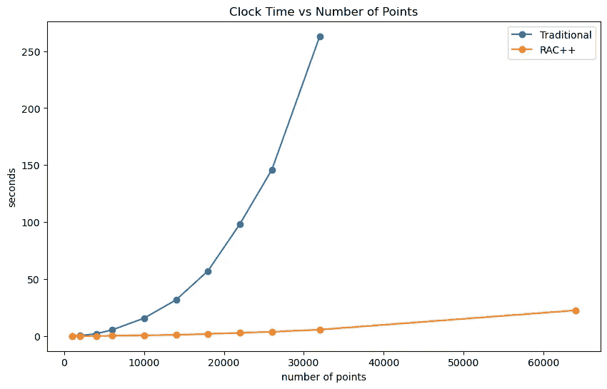
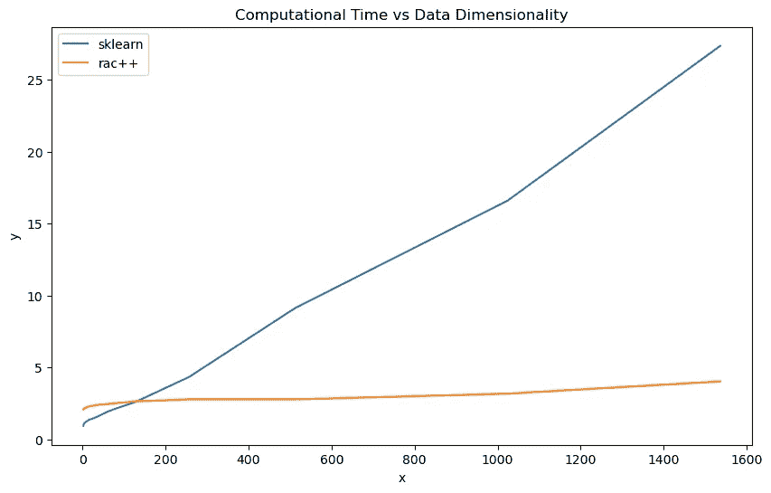
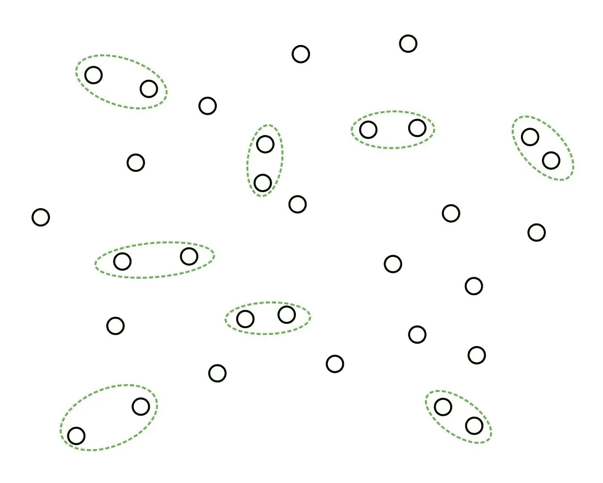
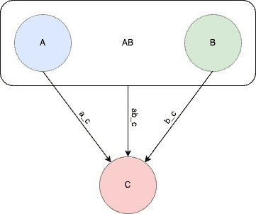
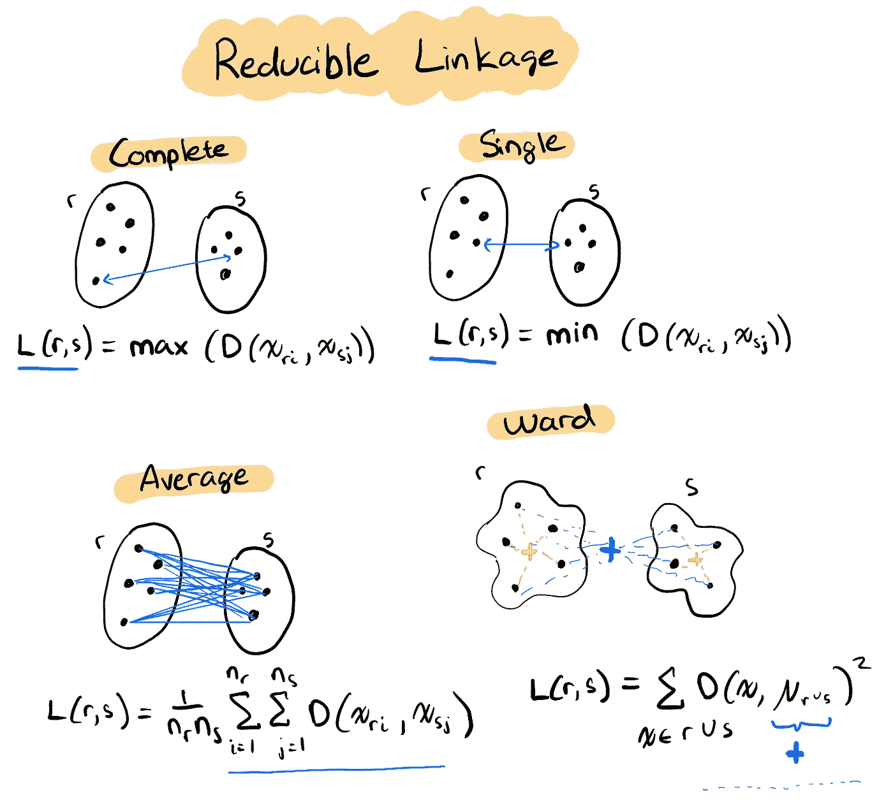
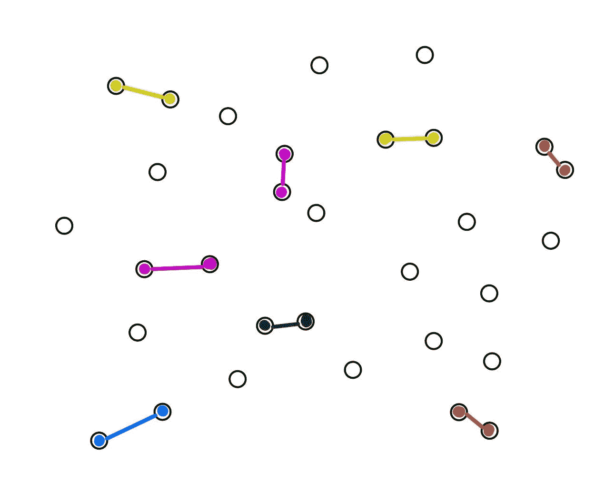
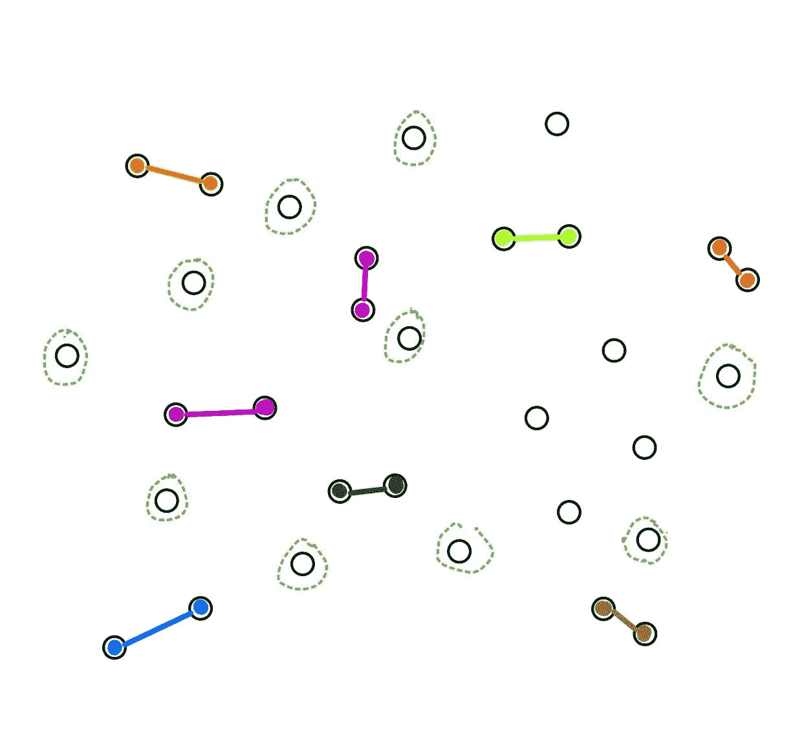

# 扩展聚合聚类以适应大数据

> 原文：[`towardsdatascience.com/scaling-agglomerative-clustering-for-big-data-an-introduction-to-rac-fb26a6b326ad?source=collection_archive---------2-----------------------#2023-08-30`](https://towardsdatascience.com/scaling-agglomerative-clustering-for-big-data-an-introduction-to-rac-fb26a6b326ad?source=collection_archive---------2-----------------------#2023-08-30)

## 了解如何使用互惠聚合聚类（RAC）来提升大数据集的层次聚类

[](https://medium.com/@danielfrees?source=post_page-----fb26a6b326ad--------------------------------)[](https://towardsdatascience.com/?source=post_page-----fb26a6b326ad--------------------------------) [Daniel Frees](https://medium.com/@danielfrees?source=post_page-----fb26a6b326ad--------------------------------)

·

[关注](https://medium.com/m/signin?actionUrl=https%3A%2F%2Fmedium.com%2F_%2Fsubscribe%2Fuser%2Fc941373ce27d&operation=register&redirect=https%3A%2F%2Ftowardsdatascience.com%2Fscaling-agglomerative-clustering-for-big-data-an-introduction-to-rac-fb26a6b326ad&user=Daniel+Frees&userId=c941373ce27d&source=post_page-c941373ce27d----fb26a6b326ad---------------------post_header-----------) 发表在 [Towards Data Science](https://towardsdatascience.com/?source=post_page-----fb26a6b326ad--------------------------------) ·8 min read·2023 年 8 月 30 日[](https://medium.com/m/signin?actionUrl=https%3A%2F%2Fmedium.com%2F_%2Fvote%2Ftowards-data-science%2Ffb26a6b326ad&operation=register&redirect=https%3A%2F%2Ftowardsdatascience.com%2Fscaling-agglomerative-clustering-for-big-data-an-introduction-to-rac-fb26a6b326ad&user=Daniel+Frees&userId=c941373ce27d&source=-----fb26a6b326ad---------------------clap_footer-----------)

--

[](https://medium.com/m/signin?actionUrl=https%3A%2F%2Fmedium.com%2F_%2Fbookmark%2Fp%2Ffb26a6b326ad&operation=register&redirect=https%3A%2F%2Ftowardsdatascience.com%2Fscaling-agglomerative-clustering-for-big-data-an-introduction-to-rac-fb26a6b326ad&source=-----fb26a6b326ad---------------------bookmark_footer-----------)

**照片** 由 [Nastya Dulhiier](https://unsplash.com/@dulhiier) 在 [Unsplash](https://unsplash.com/photos/OKOOGO578eo) 提供。

# **简介**

聚合聚类是数据科学中最好的聚类工具之一，但传统实现无法扩展到大数据集。

在这篇文章中，我将带你了解一些关于凝聚层次聚类的背景，介绍基于[2021 年 Google 研究](https://arxiv.org/abs/2105.11653)的互惠凝聚层次聚类（RAC），`RAC++`与`scikit-learn`的 AgglomerativeClustering 的运行时间比较，以及最后对 RAC 背后理论的简要解释。

## 凝聚层次聚类背景

在数据科学中，对未标记的数据进行聚类通常是很有用的。无论是搜索引擎结果分组，还是基因型分类，还是银行异常检测，聚类都是数据科学家工具箱中的一个重要组成部分。

凝聚层次聚类是数据科学中最受欢迎的聚类方法之一，这也是有充分理由的，它：

✅ 使用简单，几乎无需参数调整

✅ 创建有意义的分类法

✅ 在高维数据上表现良好

✅ 无需事先知道簇的数量

✅ 每次都创建相同的簇

相比之下，像`K-Means`这样的分区方法要求数据科学家猜测簇的数量，而非常流行的基于密度的方法`DBSCAN`需要一些关于密度计算半径（epsilon）和最小邻域大小的参数，而`Gaussian mixture models`对底层簇数据分布做了强假设。

使用凝聚层次聚类，你只需指定一个距离度量。

*从高层次来看，凝聚层次聚类遵循以下算法：*

1.  `识别所有簇对之间的簇距离（每个簇开始时都是一个单独的点）`

1.  `合并两个最接近的簇`

1.  `重复`

*结果：*一个美丽的树状图，可以根据领域知识进行分区。

在生物学和自然语言处理等领域，簇（如细胞、基因或单词）自然地遵循层次关系。因此，凝聚层次聚类使得最终的聚类截止点选择更加自然和数据驱动。

*下图是著名的* [*鸢尾花数据集*](https://www.kaggle.com/datasets/arshid/iris-flower-dataset) *的一个样本凝聚层次聚类*



通过萼片长度和萼片宽度对著名的鸢尾花数据集进行聚类。图形由共同作者 Porter Hunley 生成。

那么为什么不对每一个无监督分类问题都使用凝聚层次聚类呢？

❌ 随着数据集规模的增大，凝聚层次聚类的运行时间*非常糟糕*。

不幸的是，传统的凝聚层次聚类无法扩展。如果用最小堆实现，运行时间为`O(n³)`或`O(n²log(n))`。更糟的是，凝聚层次聚类在单核上顺序运行，无法通过计算资源进行扩展。

在自然语言处理领域，凝聚层次聚类在小型数据集上表现突出。

## 互惠凝聚层次聚类（RAC）

递归凝聚聚类（RAC）是由[谷歌提出的一种方法](https://arxiv.org/abs/2105.11653)，旨在将传统凝聚聚类的优势扩展到更大的数据集。

RAC 减少了运行时间复杂度，同时还将操作并行化，以利用多核架构。尽管进行了这些优化，RAC 在数据*完全连接*时仍然产生与传统凝聚聚类相同的结果（见下文）。

*注意：完全连接的数据意味着可以计算任意一对点之间的距离度量。非完全连接的数据集有连接约束（通常以连接矩阵的形式提供），其中一些点被认为是断开的。*



RAC 在数据完全连接时产生与传统凝聚聚类相同的结果！（上图）并且在有连接约束时通常也会如此（下图）。图表由合著者 Porter Hunley 制作。

即使在有连接约束的情况下（数据不是完全连接的），RAC 和凝聚聚类通常仍然相同，正如上面第二个[Swiss Roll 数据集](https://scikit-learn.org/stable/modules/generated/sklearn.datasets.make_swiss_roll.html)示例所示。

然而，当可能的聚类数量非常少时，可能会出现较大差异。[Noisy Moons 数据集](https://scikit-learn.org/stable/modules/generated/sklearn.datasets.make_moons.html)就是一个很好的例子：



RAC 和 sklearn 之间的结果不一致。图表由合著者 Porter Hunley 制作。

## RAC++ 比 scikit-learn 能处理更大的数据集。

我们可以将 `[RAC++](https://github.com/porterehunley/RACplusplus)`（递归凝聚聚类的实现）与其对应的 [AgglomerativeClustering](https://scikit-learn.org/stable/modules/generated/sklearn.cluster.AgglomerativeClustering.html) 在 `scikit-learn` 中进行比较。

让我们生成一些具有 25 个维度的示例数据，并测试 `racplusplus.rac` 与 `sklearn.cluster.AgglomerativeClustering` 在数据集大小从 1,000 到 64,000 点之间所需的时间。

*注意：我使用了连接矩阵来限制内存消耗。*

```py
import numpy as np
import racplusplus
from sklearn.cluster import AgglomerativeClustering
import time

points = [1000, 2000, 4000, 6000, 10000, 14000, 18000, 22000, 26000, 32000, 64000]
for point_no in points:
  X = np.random.random((point_no, 25))
  distance_threshold = .17
  knn = kneighbors_graph(X, 30, include_self=False)
  # Matrix must be symmetric - done internally in scikit-learn
  symmetric = knn + knn.T
  start = time.time()
  model = AgglomerativeClustering(
    linkage="average",
    connectivity=knn,
    n_clusters=None,
    distance_threshold=distance_threshold,
    metric='cosine'
    )
sklearn_times.append(time.time() - start)
start = time.time()
rac_labels = racplusplus.rac(
  X, distance_threshold, symmetric,
  batch_size=1000, no_cores=8, metric="cosine"
  )
rac_times.append(time.time() - start)
```

这是每种数据集大小的运行时间结果图：



使用 sklearn 时，处理大数据集的运行时间会爆炸，相较于 racplusplus。图表由合著者 Porter Hunley 制作。

如我们所见，RAC++ 和传统的凝聚聚类在运行时间上存在显著差异。

在超过 30k 个点时，`RAC++` 的速度大约快 100 倍！更重要的是，`scikit-learn` 的凝聚聚类在约 35,000 个点时达到时间限制，而 `RAC++` 在达到合理的时间限制时能够扩展到数十万点。

**RAC++ 可以扩展到高维度**

我们还可以比较`RAC++`在高维数据上的扩展效果与其传统对手。



对比 RAC++和 sklearn 的数据维度扩展时间复杂度。图表由共同作者 Porter Hunley 提供。

生成簇的时间与维度对 3000 个点的关系

对于 3000 个点，我们可以看到传统的聚合聚类更快，但它是线性扩展的，而`RAC++`几乎是常量的。在 NLP 领域，使用 768 或 1536 维的嵌入已成为常态，因此扩展维度以满足这些要求非常重要。

**RAC++具有更好的运行时间**

[谷歌的研究人员证明了 RAC 的运行时间为](https://arxiv.org/abs/2105.11653) `[O(nk)](https://arxiv.org/abs/2105.11653)` [，其中](https://arxiv.org/abs/2105.11653) `[k](https://arxiv.org/abs/2105.11653)` [是连接约束](https://arxiv.org/abs/2105.11653) 和 `[n](https://arxiv.org/abs/2105.11653)` [是点的数量](https://arxiv.org/abs/2105.11653) —— 线性运行时间。然而，这不包括初始距离矩阵计算，该计算是`O(n²)` —— 二次运行时间。

我们的结果显示，在进行恒定的 30 邻居连接约束下，确实证实了`O(n²)`的运行时间：

```py
+ — — — — — — -+ — — — — — +
| Data points | Seconds |
+ - - - - - - -+ - - - - - +
| 2000 | 0.051 |
| 4000 | 0.125 |
| 6000 | 0.245 |
| 10000 | 0.560 |
| 14000 | 1.013 |
| 18000 | 1.842 |
| 22000 | 2.800 |
| 26000 | 3.687 |
| 32000 | 5.590 |
| 64000 | 22.499 |
+ - - - - - - -+ - - - - - +
```

数据点翻倍会导致时间增加 4 倍。

二次运行时间限制了 RAC++在数据集变得极其庞大时的性能，但这一运行时间已经比传统的`O(n³)`或最小堆优化的`O(n²log(n))`运行时间有了很大改进。

*注意：* `*RAC++*` *的开发者正在努力将距离矩阵作为参数传递，这将使* `*RAC++*` *具有线性运行时间。*

## RAC 的工作原理

为什么 RAC++如此快速？我们可以将底层算法简化为几个步骤：

1.  `用互为最近邻的点配对簇`

1.  `合并簇对`

1.  `更新邻居`

请注意，这与传统的聚合聚类算法的唯一区别在于我们确保将*互为最近邻的点*配对在一起。这就是名字“互为最近邻的聚合聚类”（RAC）的由来。正如你将看到的，这种互为配对使我们能够并行化最耗费计算的聚合聚类步骤。

**用互为最近邻的点配对簇**

首先我们循环查找具有互为最近邻的簇，这意味着它们的最近邻彼此是*（记住，距离可以是有方向的！）*。



识别互为最近邻的点。图示由共同作者 Porter Hunley 提供。

**合并对**

RAC 是可并行的，因为无论互为最近邻的点以什么顺序合并，只要连接方法是*可还原的*。

链路方法是根据每个簇中包含的点的成对距离来确定两个簇之间距离的函数。*可还原*链路方法保证新合并的簇在合并后不会比其他簇更近。



如果使用可还原链路，则 ab_c 不会比 a_c 或 b_c 更接近。图像由共同作者波特·汉利提供。

幸运的是，四种最流行的链路方法都是可还原的：

+   单链路 — 最小距离

+   平均链路 — 距离的平均值

+   完整链路 — 最大距离

+   Ward 链路 — 最小化方差



4 种可还原链路方法的可视化表示。图像由我绘制，灵感来自于[`www.saedsayad.com/clustering_hierarchical.htm`](http://www.saedsayad.com/clustering_hierarchical.htm)。

由于我们知道识别出的互为最近邻的对彼此是最近邻，并且我们知道可还原链路的合并不会使新合并的簇更接近其他簇，我们可以安全地将所有互为最近邻的对一次性合并。每对最近邻可以放入可用线程中，根据链路方法进行合并。

我们能够同时合并互为最近邻这一事实非常棒，因为合并簇是计算最昂贵的步骤！



可视化准备合并的簇。图像由共同作者波特·汉利提供。

**更新最近邻**

使用可还原链路时，合并后最近邻的更新顺序也不重要。因此，通过一些巧妙的设计，我们也可以并行更新相关的邻居。



在合并后识别新的最近邻。图像由共同作者波特·汉利提供。

## 结论

通过一些测试数据集，我们展示了`RAC++`在运行时间更优的情况下，产生了与传统的凝聚聚类（即`sklearn`）完全相同的结果。了解可还原链路度量和基本的并行编程知识，我们可以理解`RAC++`如此快速的逻辑。

要更全面地理解（并证明）`RAC++`所采用的开源算法，请查看基于的[原始 Google 研究](https://arxiv.org/abs/2105.11653)。

**未来**

波特·汉利开始构建 RAC++ 以创建通过微调 BERT 嵌入生成的临床术语端点的分类法。这些医学嵌入具有 768 个维度，在他尝试的许多聚类算法中，只有凝聚聚类给出了好的结果。

所有其他高尺度聚类方法都需要降低维度才能给出任何连贯的结果。不幸的是，没有万无一失的方法来降低维度——你总会丢失信息。

在发现谷歌关于 RAC 的研究后，Porter 决定构建一个定制的开源聚类实现，以支持他的临床术语聚类研究。Porter 主导了开发，而我则共同开发了 RAC 的部分内容，特别是将 C++实现封装到 Python 中，优化运行时间，并打包软件以供分发。

`RAC++` 支持大量传统聚合聚类方法过于缓慢的聚类应用，并且最终能够扩展到数百万的数据点。

**虽然 RAC++已经可以用于聚类大数据集，但仍有改进的空间… RAC++仍在开发中——请贡献！**

***贡献作者****:*

+   Porter Hunley，Daceflow.ai 的高级软件工程师：[github](https://github.com/porterehunley)

+   Daniel Frees，斯坦福大学统计与数据科学硕士生，IBM 数据科学家：[github](https://github.com/danielfrees)

[**GitHub — porterehunley/RACplusplus: 一种高性能的 Reciprocal Agglomerative 实现…**](https://github.com/porterehunley/RACplusplus)
