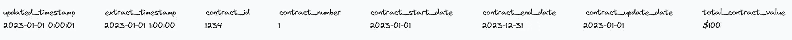
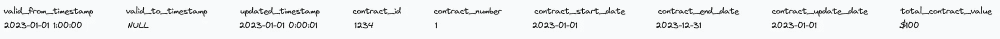
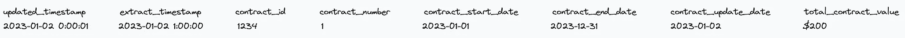
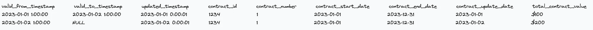
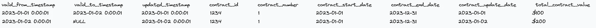
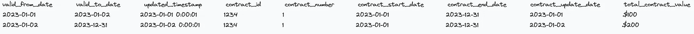
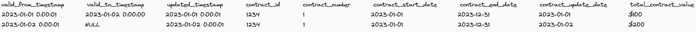

# SCD2 技术的语义

> 原文：[`towardsdatascience.com/scd2-semantics-and-styles-c9faafe9e537`](https://towardsdatascience.com/scd2-semantics-and-styles-c9faafe9e537)

## 小差异如何产生大影响

[](https://medium.com/@cisenbe?source=post_page-----c9faafe9e537--------------------------------)[](https://towardsdatascience.com/?source=post_page-----c9faafe9e537--------------------------------) [Chad Isenberg](https://medium.com/@cisenbe?source=post_page-----c9faafe9e537--------------------------------)

·发布在[Towards Data Science](https://towardsdatascience.com/?source=post_page-----c9faafe9e537--------------------------------) ·阅读时长 7 分钟·2023 年 11 月 16 日

--


图片由[Brad Starkey](https://unsplash.com/@bradstarkey?utm_source=medium&utm_medium=referral)拍摄，[Unsplash](https://unsplash.com/?utm_source=medium&utm_medium=referral)提供

最近，我一直在思考维度建模，特别是我们如何在数据仓库/湖仓中表示不同类型的历史。有许多文章描述了如何在多种语言和平台中构建 SCD2 表格。我想关注的是更微妙且较少讨论的内容：SCD2 的语义以及各种设计选择如何对用例产生重要影响。

我想讨论的两个主要话题是：

1.  你选择用于行版本控制的日期非常重要。这个选择绝不能是任意的，你最常见的用例应该在设计中占据重要位置。

1.  你如何对记录进行行版本控制将决定访问表的模式。在某种程度上，这纯粹是为了方便，但我认为人性化是数据质量的重要方面；作为数据模型师，我们的目标应该是让用户更容易做到正确的事情。

# 选择参考日期

创建 SCD2 表格的最常见模式是利用数据中的某个日期或时间戳。一旦确定某行数据发生了有意义的变化，无论是通过直接比较列还是比较哈希值，你都必须设定日期以“退役”现有记录并插入新记录。

那我们使用哪些日期呢？对于许多类型的数据，我们可以从三个选项中选择一个：

+   提取时间戳

+   源系统时间戳

+   业务（实体/事件）时间戳

让我们深入探讨一下。

## 提取时间戳

这种方法从“我们捕获数据时原始数据的样子”这个角度出发。真实性的来源是你的仓库及其加载过程，而不是数据本身的任何关键属性。

请考虑以下示例：



一行电子表格行表示我们的合同记录

从此记录，我们将生成以下 SCD2 记录（为了可读性省略了一些元数据字段，如代理键、哈希、维度插入时间戳等）：



一行电子表格行表示从合同记录创建的我们的 SCD2 记录

到目前为止，没有特别令人兴奋的事情；需要注意的主要是我们的记录有效期从*我们提取的时间*开始，而不是其他日期。那么，当我们获得新记录时，这是什么样的呢？例如：



一行电子表格行表示我们合同记录的更新视图

这个新记录将导致我们的维度表中出现以下变化：



两行电子表格行表示我们的 SCD2 记录，由新的合同记录创建和修改

我们稍后会更多讨论`valid_to`和`valid_from`时间戳的选择，但现在，让我们集中在表的语义上。当用户使用我们的有效元数据日期查询`dim_contracts`时，这到底意味着什么？

```py
select *
from dim_contracts
where
  valid_from <= '2023-01-01 01:00:00'
  and (valid_to > '2023-01-01 01:00:00'
       or valid_to is null)
```

正如我之前提到的，这种方法将数据在数据仓库中的落地视为我们的主要参考点。我们的用户需要知道（并向他们的消费者说明）记录是根据数据仓库过程而不是业务流程或甚至来源系统过程来确定有效性的。就个人而言，我认为这种方法可能会影响用户的直觉，我更愿意使用其他方法；然而，有些来源可能没有其他时间戳可用，在这种情况下，你只能使用提取时间戳。只要确保你有良好的入职培训和文档，以便用户可以正确解释结果。

## 来源系统时间戳

这种方法从“原始数据在来源系统创建或更新时的样子”来考虑。以我们上面的例子为例，我们来看看插入和更新后的表：



两行电子表格行表示我们的 SCD2 表，使用来源系统时间戳作为参考时间

从根本上说，我们在这里表示的变化与上述相同；关键区别在于我们的语义发生了微妙的变化。我们不再考虑记录有效性与数据落地到数据仓库的时间，而是关注来源系统更新这些记录的时间。这里的优势是用户可以更轻松地讲述故事；记录在来源系统中有效时就是有效的！

这种方法对于不是真正维度的源系统历史表尤其有价值。你将拥有一个可以在构建其他维度和事实表时参考的源系统表示，如果[bitemporal 历史](https://martinfowler.com/articles/bitemporal-history.html)¹对你的分析能力很重要，这是一个必要条件。

## 业务时间戳

这种方法从“业务实体在业务日期下的样子”来考虑。一个主要的优势是用户可以直接在具有业务日期的表上进行联接；有效日期映射到“现实世界”的事件，例如发票创建或合同生效。这些类型的表提供了实体的完整业务历史，而无需了解源系统如何生成记录或仓库如何捕获记录的开销。

让我们考虑一下，如果我们使用业务日期来界定记录，那么一个维度会是什么样的：



使用业务日期作为参考时间表示我们的 SCD2 表的两行电子表格

在这种情况下，我们实际上可以为记录提供一个确定的日期边界，因为合同在 2023 年 12 月 31 日将不再有效，因此记录也不应该从那时起生效。这种方法对于用户来说非常直观，因为记录反映了业务过程。

这种简单性确实有其代价。与其他方法不同，你需要更多地考虑回溯和事后修正。你会执行“类型 1”更新（即，覆盖回溯日期上活动记录的受影响字段），还是会保留这些“错误”的记录以便审计，但以某种方式指示它们不再有效？如果是后者，你将如何帮助用户在日常分析中避免这些记录？视图？数据字典中的条目？示例查询？

# 选择 valid_to 和 valid_from 的格式

在我们的示例中，我们使用了一种流行的策略，通过一些更新列来选择记录的有效日期。dbt 快照通过其[时间戳策略](https://docs.getdbt.com/docs/build/snapshots#timestamp-strategy-recommended)直接提供了这一功能。

使用时的细微注意点是，当“旧”记录的`valid_to`和替代记录的`valid_from`相等时，我们的查询模式需要严格的不等式，如上所示。

如果你选择额外的步骤来偏移这些日期/时间戳，你可以使用略微不同且可能更符合人体工学的访问模式：



使用源系统时间戳和偏移方法表示我们的 SCD2 表的两行电子表格

这一小的变化使我们能够以两种不同的方式查询数据：

```py
select *
from dim_contracts
where
  valid_from <= '2023-01-01 00:00:01'
  and (valid_to >= '2023-01-01 00:00:01'
       or valid_to is null)
```

或：

```py
select *
from dim_contracts
where
  '2023-01-01 00:00:01' between
  valid_from and valid_to
```

然而，我们后面的示例仅适用于已退役的记录；由于`valid_to`中的`NULL`值，“当前”记录将失败。解决这个问题的一种流行方法是使用远未来的日期进行`COALESCE()`，比如 2999–12–31、9999–12–31 等。是否值得进行额外的工作以启用这些查询模式取决于你和你的用户。

# 奖励环节：SCD2 vs. 维度快照

如你所见，SCD2 为你的数据模型引入了大量复杂性，而这个建模练习是否总是值得尚未明确。在 [数据工程最具开创性的著作之一](https://maximebeauchemin.medium.com/functional-data-engineering-a-modern-paradigm-for-batch-data-processing-2327ec32c42a)² 中，Maxime Beauchemin 对此进行了深入讨论。总结来说，我们是否应该维护复杂的逻辑来退役现有行并插入新行，还是仅仅通过每天快照我们的维度表来应对存储开销，这值得我们权衡。

这是一个数学问题。你可以计算出你的维度包含多少记录，表的宽度，然后计算每月的存储成本。如果这些成本是可以接受的，你可以大大简化你的设计；只需在维度更新过程结束时添加一个快照，就完成了。用户也会喜欢，因为他们可以直接基于快照日期进行连接，而不是试图处理有效日期范围。

# 总结

维度建模是任何数据工程师或分析工程师工具箱中的强大工具。能够跟踪历史记录对某些分析用例至关重要，而历史记录可以为你提供有关操作工作流的宝贵见解。虽然处理 SCD2 的方法有很多种，但你需要对你做出的决策保持意识。这些小变化可能看起来抽象且微不足道，但在实际使用中，这些区别将变得清晰明了。第一次你必须解释为什么“丢失”的记录实际上并未丢失，只是在用户期望时并不有效，你将会清楚这些选择的重要性。

¹Martin Fowler. (2021 年 4 月 7 日). *双时间维度历史*。 ([`martinfowler.com/articles/bitemporal-history.html`](https://martinfowler.com/articles/bitemporal-history.html))

²Maxime Beauchemin. (2018 年 1 月 18 日). *功能性数据工程 — 批量数据处理的现代范式*。 [`maximebeauchemin.medium.com/functional-data-engineering-a-modern-paradigm-for-batch-data-processing-2327ec32c42a`](https://maximebeauchemin.medium.com/functional-data-engineering-a-modern-paradigm-for-batch-data-processing-2327ec32c42a)
