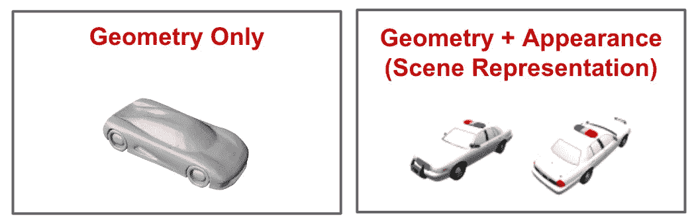

# 场景表示网络

> 原文：[`towardsdatascience.com/scene-representation-networks-bae6186d00d9?source=collection_archive---------14-----------------------#2023-02-22`](https://towardsdatascience.com/scene-representation-networks-bae6186d00d9?source=collection_archive---------14-----------------------#2023-02-22)

## 在无限分辨率下建模复杂的 3D 场景

 [Cameron R. Wolfe, Ph.D.](https://wolfecameron.medium.com/?source=post_page-----bae6186d00d9--------------------------------)

·

[关注](https://medium.com/m/signin?actionUrl=https%3A%2F%2Fmedium.com%2F_%2Fsubscribe%2Fuser%2F28aa6026c553&operation=register&redirect=https%3A%2F%2Ftowardsdatascience.com%2Fscene-representation-networks-bae6186d00d9&user=Cameron+R.+Wolfe%2C+Ph.D.&userId=28aa6026c553&source=post_page-28aa6026c553----bae6186d00d9---------------------post_header-----------) 发表在 [Towards Data Science](https://towardsdatascience.com/?source=post_page-----bae6186d00d9--------------------------------) ·12 分钟阅读·2023 年 2 月 22 日

--

（图片由 [Alexandra Gorn](https://unsplash.com/@alexagorn?utm_source=unsplash&utm_medium=referral&utm_content=creditCopyText) 提供，来源于 [Unsplash](https://unsplash.com/s/photos/living-room?utm_source=unsplash&utm_medium=referral&utm_content=creditCopyText)）

我们最近已经看到（例如，[DeepSDF](https://cameronrwolfe.substack.com/p/3d-generative-modeling-with-deepsdf)和[ONets](https://cameronrwolfe.substack.com/p/shape-reconstruction-with-onets) [3, 5]）如何通过神经网络来表示 3D 几何体。但这些方法存在一些限制，例如需要真实的 3D 几何体进行训练和推断。此外，*如果我们想表示整个场景而不仅仅是一个物体或几何体*，该如何处理？这需要同时建模几何体和外观；下面有一个示例。幸运的是，只要方法正确，神经网络完全能够以这种方式建模 3D 场景。

（来自 [1] 和 [3]）

一种建模 3D 场景的方法是通过场景表示网络（SRNs）[1]。SRNs 将场景建模为一个连续函数，该函数将每个 3D 坐标映射到一个描述该位置物体形状和外观的表示。这个函数是通过前馈神经网络学习的。然后，SRNs 使用一个可学习的渲染算法生成底层 3D 场景的新视角（即，仅 2D 图像）。前馈网络和渲染算法都可以仅使用 2D 场景图像进行端到端训练。
