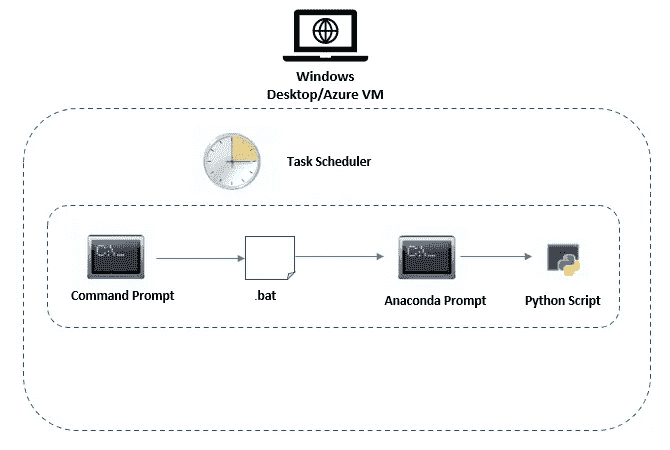

# 在 Windows 桌面/Azure 虚拟机上自动运行 Python 脚本

> 原文：[`towardsdatascience.com/schedule-a-python-script-to-run-automatically-on-a-windows-desktop-azure-vm-8b4f469f969f?source=collection_archive---------7-----------------------#2023-02-20`](https://towardsdatascience.com/schedule-a-python-script-to-run-automatically-on-a-windows-desktop-azure-vm-8b4f469f969f?source=collection_archive---------7-----------------------#2023-02-20)

## 使用任务调度程序自动刷新数据

 [Subha Ganapathi](https://mg-subha.medium.com/?source=post_page-----8b4f469f969f--------------------------------)

·

[关注](https://medium.com/m/signin?actionUrl=https%3A%2F%2Fmedium.com%2F_%2Fsubscribe%2Fuser%2Fe911b9969577&operation=register&redirect=https%3A%2F%2Ftowardsdatascience.com%2Fschedule-a-python-script-to-run-automatically-on-a-windows-desktop-azure-vm-8b4f469f969f&user=Subha+Ganapathi&userId=e911b9969577&source=post_page-e911b9969577----8b4f469f969f---------------------post_header-----------) 发表在 [Towards Data Science](https://towardsdatascience.com/?source=post_page-----8b4f469f969f--------------------------------) ·4 分钟阅读·2023 年 2 月 20 日

--

图片来自 [Ales Nesetril](https://unsplash.com/de/@alesnesetril?utm_source=unsplash&utm_medium=referral&utm_content=creditCopyText)  在 [Unsplash](https://unsplash.com/s/photos/tech?utm_source=unsplash&utm_medium=referral&utm_content=creditCopyText)

**概述**

假设你在 Windows 桌面/Azure 虚拟机上的 Anaconda 环境中开发了一些 Python 脚本。假设你希望按照计划执行这些脚本。在这里，我们讨论一种自动化脚本运行的方法。由于你使用的是 Anaconda 环境，你可能已经在 Anaconda 中安装了所有的 Python 包依赖。

**过程**

下面是一个示意图，展示了自动化过程中涉及的步骤。如下面所示，我们将使用 Windows 任务计划程序来实现。

展示整体过程的示意图（作者提供）

让我们逐步了解这些步骤 -

**步骤 1 — 编写批处理脚本**

批处理脚本完成两项任务 —

1.  它激活 Anaconda 环境

1.  一旦激活环境，它会在该环境中执行 Python 脚本。

在我们开始编写批处理脚本之前，先确定我们计划的 Anaconda 环境…
