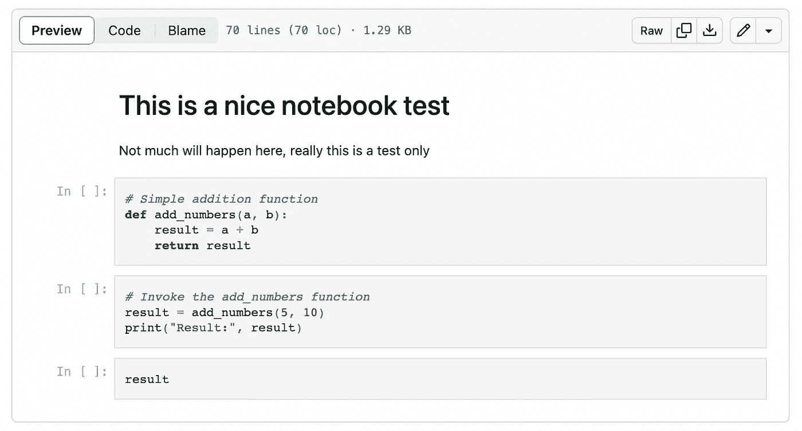
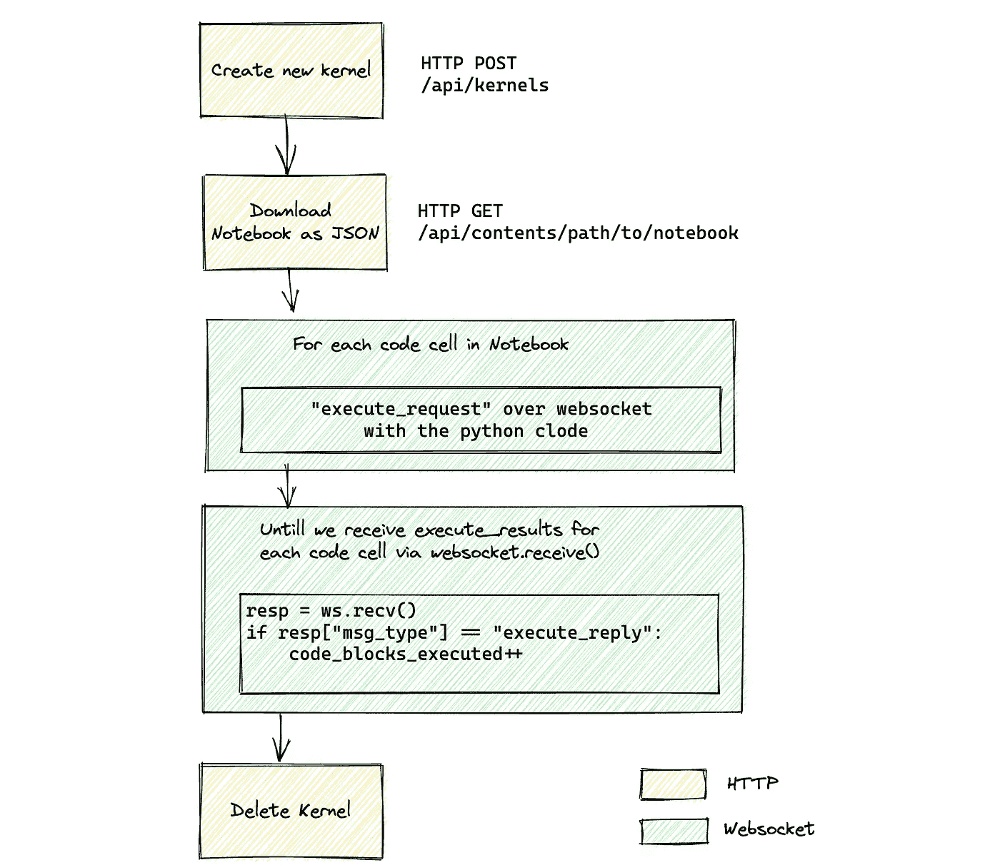
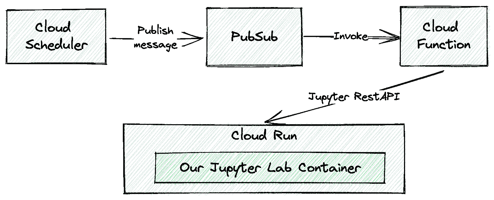
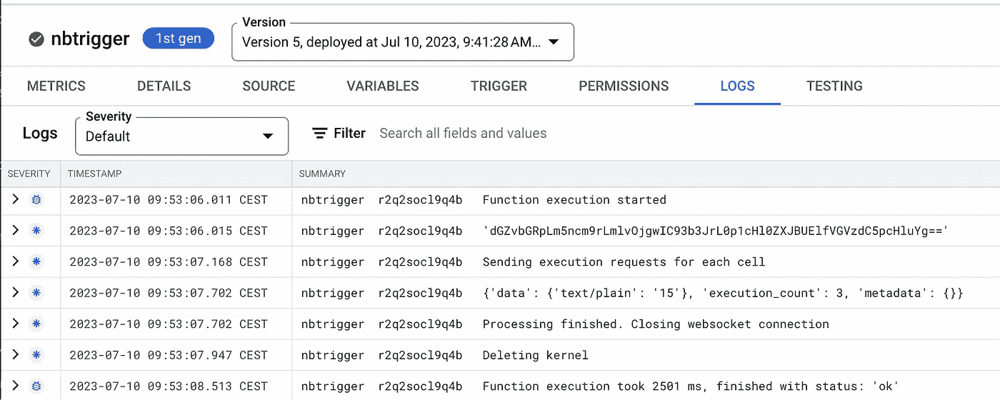
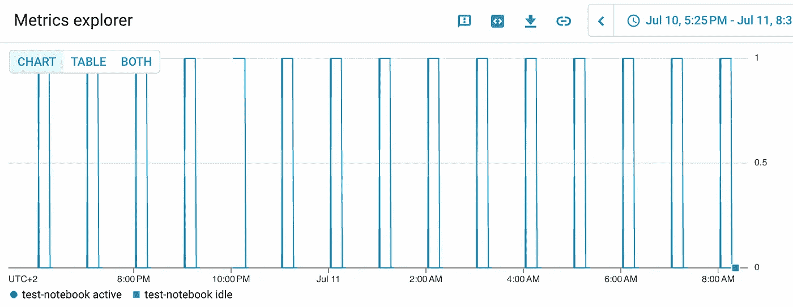
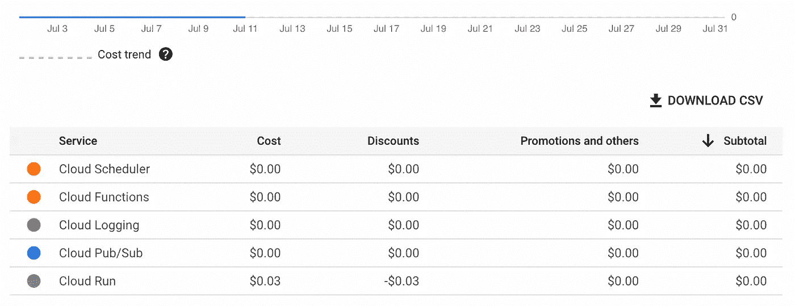

# 使用 Jupyter API 调度和调用笔记本作为网络服务

> 原文：[`towardsdatascience.com/schedule-and-invoke-notebooks-as-web-services-using-jupyter-api-fb71c1e8a008?source=collection_archive---------3-----------------------#2023-08-10`](https://towardsdatascience.com/schedule-and-invoke-notebooks-as-web-services-using-jupyter-api-fb71c1e8a008?source=collection_archive---------3-----------------------#2023-08-10)

[](https://medium.com/@tfoldi?source=post_page-----fb71c1e8a008--------------------------------)[](https://towardsdatascience.com/?source=post_page-----fb71c1e8a008--------------------------------) [Tamas Foldi](https://medium.com/@tfoldi?source=post_page-----fb71c1e8a008--------------------------------)

·

[关注](https://medium.com/m/signin?actionUrl=https%3A%2F%2Fmedium.com%2F_%2Fsubscribe%2Fuser%2Fa586bc473bbf&operation=register&redirect=https%3A%2F%2Ftowardsdatascience.com%2Fschedule-and-invoke-notebooks-as-web-services-using-jupyter-api-fb71c1e8a008&user=Tamas+Foldi&userId=a586bc473bbf&source=post_page-a586bc473bbf----fb71c1e8a008---------------------post_header-----------) 发表在 [Towards Data Science](https://towardsdatascience.com/?source=post_page-----fb71c1e8a008--------------------------------) ·6 min read·2023 年 8 月 10 日[](https://medium.com/m/signin?actionUrl=https%3A%2F%2Fmedium.com%2F_%2Fvote%2Ftowards-data-science%2Ffb71c1e8a008&operation=register&redirect=https%3A%2F%2Ftowardsdatascience.com%2Fschedule-and-invoke-notebooks-as-web-services-using-jupyter-api-fb71c1e8a008&user=Tamas+Foldi&userId=a586bc473bbf&source=-----fb71c1e8a008---------------------clap_footer-----------)

--

[](https://medium.com/m/signin?actionUrl=https%3A%2F%2Fmedium.com%2F_%2Fbookmark%2Fp%2Ffb71c1e8a008&operation=register&redirect=https%3A%2F%2Ftowardsdatascience.com%2Fschedule-and-invoke-notebooks-as-web-services-using-jupyter-api-fb71c1e8a008&source=-----fb71c1e8a008---------------------bookmark_footer-----------)

感谢像 GCP CloudRunner 和 Cloud Functions 这样的无服务器云服务，我们不再需要管理昂贵的虚拟机或服务器来部署我们的笔记本并定期执行它们。通过 Jupyter API，你可以将笔记本迁移到云端，将其转换为网络服务，并与调度系统集成。


在云端调度的 Python 笔记本，由 MidJourney 生成，由作者指导

然而，最常用的方法（除非你使用像 Vertex AI 或 SageMaker 这样的云原生服务）是使用`nbconvert`将笔记本转换为 Python 代码，并将代码添加到新启动的 Tornado 或 Flask 自定义 web 应用程序中。


传统的 Python 笔记本容器化，无图，图片由作者提供

这包括一些编码和外部库，但好消息是我们可以将代码保留在我们的 Jupyter 开发容器中，并直接从那里触发，使用 [Jupyter Rest API](https://jupyter-server.readthedocs.io/en/latest/developers/rest-api.html)。

# 通过 Web API 访问笔记本

在我们深入了解如何使用 Jupyter API 之前，我会展示架构如何工作。首先，让我们使用一个简单的笔记本进行测试。



[简单测试笔记本](https://github.com/tfoldi/jupyterapi_nbrunner/blob/main/tests/test_notebook/JupyterAPI_Test.ipynb) 如果一切正常，将返回“15”。

要在本地使用 Jupyter 运行，最简单的方法是通过 Jupyter Lab 容器运行：

```py
# download the test workbook
wget https://raw.githubusercontent.com/tfoldi/vizallas/main/notebooks/JupyterAPI_Test.ipynb

# Spawn a new Jupyter lab instance with token auth (and without XSRF)
docker run -it --rm -p 8888:8888 \
  -e JUPYTER_TOKEN=ab30dd71a2ac8f9abe7160d4d5520d9a19dbdb48abcdabcd \
  --name testnb -v "${PWD}":/home/jovyan/work jupyter/base-notebook \
  jupyter lab --ServerApp.disable_check_xsrf=true
```

一旦服务启动，你将能够使用 JUPYTER_TOKEN 环境变量中传递的令牌访问笔记本，地址是 [`127.0.0.1:8888/lab/tree/work`](http://127.0.0.1:8888/lab/tree/work)。

## 从命令行调用笔记本

从命令行，你可以下载 [这个](https://github.com/tfoldi/jupyterapi_nbrunner/blob/main/main.py) 小脚本（需要`requests`和`websocket-client`包）或通过 Docker 容器运行：

```py
# check the IP address of our previously started "testnb" container
docker inspect testnb | grep IPAddress
            "SecondaryIPAddresses": null,
            "IPAddress": "172.17.0.2",
                    "IPAddress": "172.17.0.2",

# Invoke our notebook. Replace the IP below with yours from previous step.
docker run -it --rm \
  -e JUPYTER_TOKEN=ab30dd71a2ac8f9abe7160d4d5520d9a19dbdb48abcdabcd \
  tfoldi/jupyterapi_nbrunner 172.17.0.2:8888 /work/JupyterAPI_Test.ipynb

Creating a new kernel at http://172.17.0.2:8888/api/kernels
Sending execution requests for each cell
{'data': {'text/plain': '15'}, 'execution_count': 3, 'metadata': {}}
Processing finished. Closing websocket connection
Deleting kernel
```

该脚本连接到我们新创建的 JupyterLab 服务器，执行我们的笔记本，返回最后一个单元的结果，然后退出。整个过程通过 web 协议进行，无需对笔记本代码或额外的库进行任何修改。

## 底层实现

不幸的是，Jupyter API 中没有一个端点可以端到端地执行笔记本。首先，我们必须初始化一个新的内核（或使用现有的），检索笔记本的元数据，获取所有代码单元，并为每一个发送一个`execute_request`。

要检索结果，我们需要监听 WebSocket 通道中的传入消息。由于没有“所有代码执行结束”的消息，我们必须手动跟踪我们发送了多少个代码块以及其中多少个已实际完成，通过计算所有类型为`execute_reply`的消息。一旦所有执行完成，我们可以停止内核或将其保持在空闲状态以备将来执行。

下图展示了完整的流程：



通过 Rest API 执行 Jupyter Notebook 的步骤。笔记本级别的操作使用 Rest API，而单元级别的调用则在 WebSocket 上。图片由作者提供。

为了保持认证，我们必须为所有 HTTP 和 WebSocket 调用传递`Authorization`头。

如果觉得仅仅为了执行一个 notebook 步骤有些多，我理解。相信在 Jupyter Server 内实现一个更高层次的函数来简化复杂性会很有用。

完整的 [脚本在这里](https://github.com/tfoldi/jupyterapi_nbrunner/blob/main/main.py)，可以在你的应用程序中使用。

# 在 GCP 上安排我们的工作簿免费（几乎）。

虽然有很多选项可以托管 notebook，但最具成本效益的方法是利用 Google Cloud 的 Cloud Run 服务。使用 Cloud Run，你只需为作业的实际运行时间付费，使其成为一个经济高效的选择，用于不频繁触发的任务，而无需额外的软件包或额外的 SaaS 供应商（除了 Google），而且再次强调，无需编写一行代码。

架构和调用流程将如下所示：



我们将仅使用无服务器服务来保持成本低。作者提供的图片。

首先，我们需要在 GCP Cloud Run 中部署我们的 notebook。有多种方式可以将文件添加到 Cloud Run 服务中，但也许最简单的方法是将我们的 notebook 复制到 Docker 容器中。

```py
# Simple dockerfile to host notebooks on a Jupyter Server
FROM jupyter/base-notebook
COPY JupyterAPI_Test.ipynb /home/jovyan/workspaces/
```

要构建并使容器在 Cloud Run 中可用，我们只需在 `gcloud run deploy` 中指定 `--source` 选项，指向包含我们笔记本和 `Dockerfile` 的目录。

```py
# get the source code of the Jupyter notebook and the Dockerfile
git clone https://github.com/tfoldi/jupyterapi_nbrunner.git

# Deploy the test notebook in a jupyter/base-notebook container 
# The Dockerfile and JupyterAPI_Test.ipynb files in the tests/test_notebook 
# folder
gcloud run deploy test-notebook --region europe-west3 --platform managed \
  --allow-unauthenticated --port=8888 \
  --source tests/test_notebook \
  --set-env-vars=JUPYTER_TOKEN=ab30dd71a2ac8f9abe7160d4d5520d9a19dbdb48abcdabcd 

[...]
Service [test-notebook] revision [test-notebook-00001-mef] has been deployed and is serving 100 percent of traffic.
Service URL: https://test-notebook-fcaopesrva-ey.a.run.app
```

JupyterLab 将在服务 URL 上提供。Google Cloud Run 将提供 SSL 证书以及根据请求的到达启动或暂停容器的机制。

要通过 Cloud Scheduler 触发我们新部署的 notebook，我们需要创建一个绑定到 PubSub 主题的 Cloud Function。以下命令将从 [这个仓库](https://github.com/tfoldi/jupyterapi_nbrunner/) 部署 `main.py` 和 `requirements.txt`。`main.py` 是我们之前用来从命令行触发代码的相同脚本。

```py
# make sure you are in the same directory where you cloned the 
# contents of https://github.com/tfoldi/jupyterapi_nbrunner.git 

gcloud functions deploy nbtrigger --entry-point main --runtime python311 \
  --trigger-resource t_nbtrigger --trigger-event google.pubsub.topic.publish \
  --timeout 540s --region europe-west3 \
  --set-env-vars=JUPYTER_TOKEN=ab30dd71a2ac8f9abe7160d4d5520d9a19dbdb48abcdabcd
```

让我们通过向 `t_nbtrigger` 主题发送带有适当参数的消息来测试我们的新 Cloud Function，就像我们在命令行中做的那样：

```py
gcloud pubsub topics publish t_nbtrigger \
  --message="test-notebook-fcaopesrva-ey.a.run.app:443 
       /workspaces/JupyterAPI_Test.ipynb --use-https"
```

如果你查看 `nbtrigger` Cloud Function 的日志，你可能会注意到，向主题发送记录成功触发了我们指定的 notebook 执行：



日志显示我们的 notebook 成功执行。作者提供的图片。

最后一步是创建一个在指定时间运行的计划。在这种情况下，我们打算每小时运行一次 notebook：

```py
gcloud scheduler jobs create pubsub j_hourly_nbtrigger \
  --schedule "0 * * * *" --topic t_nbtrigger --location europe-west3 \
  --message-body "test-notebook-fcaopesrva-ey.a.run.app:443 /workspaces/JupyterAPI_Test.ipynb --use-https --verbose" 
```

一切就绪——你刚刚以无服务器的方式安排了你的第一个 Jupyter Notebook。



CloudRun 在作业执行后会自动关闭我们的容器。如果我们没有指定最小实例，"闲置"状态也不会产生费用。

我们的 Notebook 每天只会消耗几美分，这使得这种部署方式成为 Google Cloud 中最具成本效益的方式之一。



执行几天后的成本大约为三分钱。

# 结论

我们曾经依赖于将 Jupyter Notebooks 转换为 Python 代码，以便使其能够被云原生工具使用，或者依赖于更复杂且昂贵的服务，如 Vertex AI 或 SageMaker。然而，通过利用 Jupyter Rest API 并部署带有其“开发环境”的 Notebooks，你可以跳过额外的步骤，实现对 Notebooks 的网络服务调用或调度。

尽管这种方法不一定适用于需要大量计算资源的长期运行的笔记本的大规模项目，但对于你的家庭自动化或爱好项目来说，这种方法完全适用 — 而无需（过度）花费在基础设施上。
