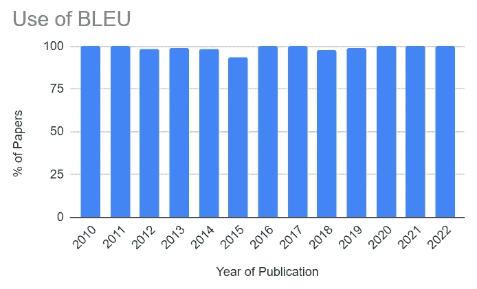
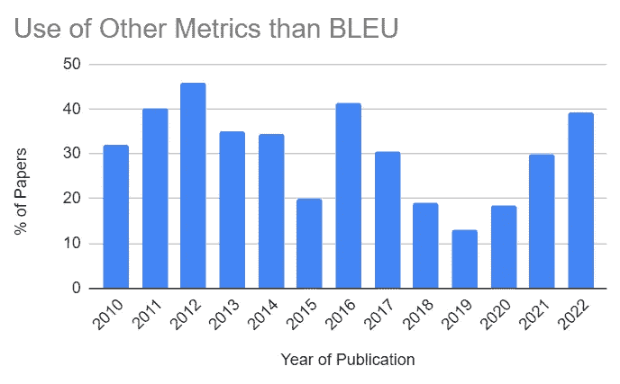
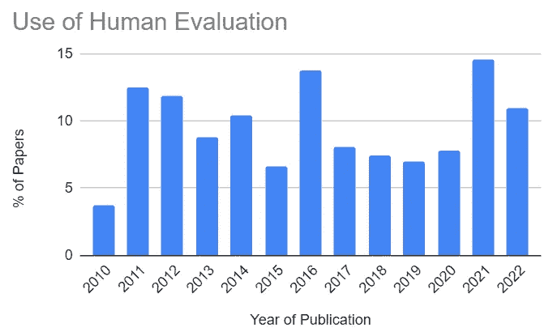
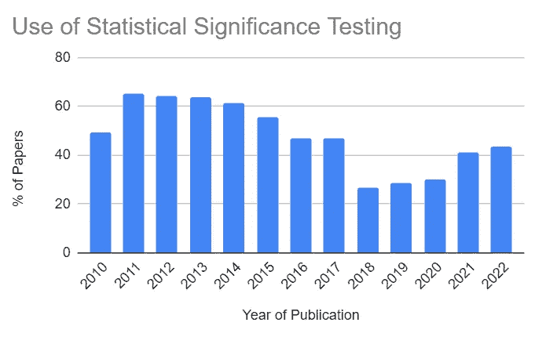
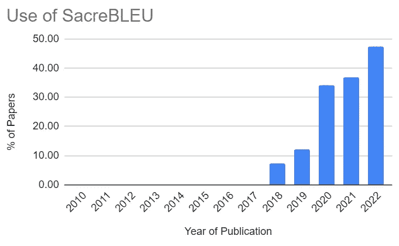
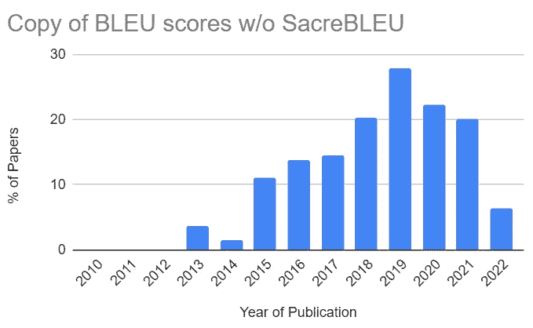
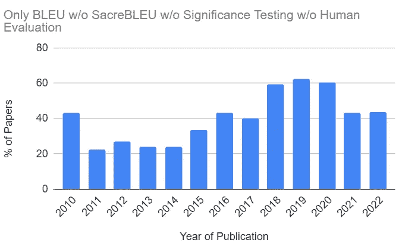
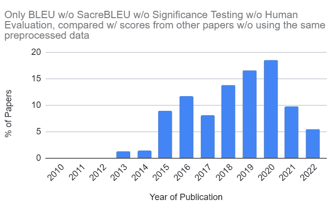

# 机器翻译研究中的科学可信度：陷阱与有前途的趋势

> 原文：[`towardsdatascience.com/scientific-credibility-in-machine-translation-research-pitfalls-and-promising-trends-990ddabe8fb9`](https://towardsdatascience.com/scientific-credibility-in-machine-translation-research-pitfalls-and-promising-trends-990ddabe8fb9)

## 我们是否到了一个转折点？我对 1,000 多篇科学论文的注释结论

 [本杰明·玛丽](https://medium.com/@bnjmn_marie?source=post_page-----990ddabe8fb9--------------------------------)

·发表于 [Towards Data Science](https://towardsdatascience.com/?source=post_page-----990ddabe8fb9--------------------------------) ·10 分钟阅读·2023 年 5 月 11 日

--

图片来自 [Pixabay](https://pixabay.com/illustrations/keywords-change-fish-individuality-2488210/) — 作者编辑

**科学家如何评估机器翻译质量的改进？**

主要通过使用自动评估指标。得分更高的机器翻译系统被认为更好。

由于提高指标分数对于展示机器翻译的进展至关重要，了解这些指标分数是如何计算和比较的非常关键。

2021 年，我和我的同事 Atsushi Fujita 及 Raphael Rubino，[对 2010 年至 2020 年发布的 761 篇机器翻译评估进行了人工注释和分析](https://aclanthology.org/2021.acl-long.566.pdf)（Marie et al., 2021）。

我们的分析结果由 ACL 2021 发布，ACL 2021 是机器翻译出版物中最具选择性的场所之一。我们展示了机器翻译研究缺乏科学可信度。我们突出了一些机器翻译评估中的陷阱和令人担忧的趋势。

我在 ACL 2021 的颁奖环节中展示了这项工作。

**这是两年前的事了。**

*自 2021 年以来，机器翻译研究中的评估有何变化？是有所改善还是变得更糟？有哪些新趋势？*

我更新了分析，包括了 2021 年和 2022 年发布的机器翻译研究论文。注释方法与首次分析中使用的相同，该分析发布于 ACL 2021。

我创建的数据集在这里：

 [## 机器翻译研究的元评估数据集（2023 年 5 月）

### 注释 本数据集包含在*ACL 出版物中*进行的机器翻译评估的注释。如果你…

docs.google.com](https://docs.google.com/spreadsheets/d/1oJ1NUnUKA6sHg08UgZDjnR7oPaX9OlHXrtWFKiUgTO0/edit?usp=sharing&source=post_page-----990ddabe8fb9--------------------------------)

在这篇博客文章中，我展示了我的主要发现。

# 对 1,000 多篇论文的注释

在这项研究中，我手动注释了总共 1,023 篇论文（比 2021 年发布的原始研究多 254 篇）。

我选择了文献进行注释，依据如下标准：

+   由一流的 ACL 会议之一出版，时间范围为 2010 年至 2022 年（包括在内）：AACL、ACL、EACL、EMLP、NAACL 和 CoNLL。我将研究范围限定在 ACL 出版物，因为它们是机器翻译研究人员发布最佳工作的主要选择。提交给 ACL 会议的论文经过双盲同行评审过程。ACL 会议的接受率较低（过去 13 年几乎始终低于 30%）。换句话说，ACL 发布的论文被期望具有很高的科学可信度。

+   标题中包含“translation”或“MT”字眼。

+   关于至少两个机器翻译系统的比较报告。

当然，这个选择遗漏了一些论文，但我认为它包含了足够的文章以观察机器翻译研究的趋势。

这组论文不包括所有其他不专注于 NLP 的 ML/AI 会议上发表的论文。它们远少于 ACL 会议上发表的机器翻译论文，尤其是在 2015 年之前。然而，我相信专注于机器翻译的 ML/AI 论文在这项研究中也应占有一席之地。这些论文中有些也被引用频繁。我希望今年能找到时间，将这项研究扩展到 ICML、NIPS/NeurIPS、ICLR、IJCAI 和 AAAI 会议。

*我注释了机器翻译评估的哪些方面？*

评估的六个不同方面：

+   使用的自动指标

+   使用人工评估

+   结果和比较的统计显著性测试

+   使用一个框架，SacreBLEU，促进机器翻译评估的可重复性

+   从以往工作中复制的指标评分的比较

+   比较未在完全相同的数据集上进行训练/验证/测试的机器翻译系统

所有这些方面都特别容易注释，但也足够有信息量以识别机器翻译研究中的陷阱和趋势。

我的主要观察结果如下。

# 2021–2022：100% BLEU

我列出了所有在评估中使用的自动指标，并将相同指标的所有变体重新归为一个指标标识符。例如，chrF 和 chrF++都标记为 chrF。

BLEU ([Papineni et al., 2002](https://aclanthology.org/P02-1040/)) 是一个极受欢迎的机器翻译评估指标，尽管它存在许多缺陷。

*有多少机器翻译论文使用了 BLEU？*

**几乎所有这些都始于 2010 年。**

作者提供的图像

在 2020 年、2021 年和 2022 年，**100%**的注释论文使用了 BLEU。

这个数字并不意味着这些论文不使用其他指标。确实使用了。但是，除了 BLEU 外使用其他指标的论文仍然是少数。

作者提供的图像

在 2021 年和 2022 年，分别有 29.9%和 39.1%的论文使用了其他指标。考虑到**有无数其他比 BLEU 更好的指标**，这一比例极低。

 ## 传统与神经指标在机器翻译评估中的对比

### 自 2010 年以来新增了 100 多个指标

[towardsdatascience.com

不过，从积极的方面来看，我们可以看到这些百分比比 2020 年要高很多，而 2020 年是本工作第一版中最后一个注释的年份。机器翻译研究人员倾向于使用更多样化的指标。

更详细地看，2022 年使用最频繁的指标除了 BLEU 外还有：

+   chrF: 10.0%

+   COMET: 10.0%

+   METEOR: 5.5%

+   TER: 4.5%

METEOR ([Banerjee and Lavie, 2005](https://aclanthology.org/W05-0909.pdf)) 和 TER ([Snover et al., 2006](https://aclanthology.org/2006.amta-papers.25.pdf)) 是 2010 年前发布的旧指标。作为机器翻译评估的最先进的神经指标仍然很少使用。我无法解释为什么。这是我不理解的事情。

尽管如此，**COMET（**[**Rei et al., 2020**](https://aclanthology.org/2020.emnlp-main.213.pdf)**）作为一种神经指标，使用越来越多。这是令人鼓舞的，我不会惊讶于 2023 年看到这个百分比上升**。

chrF ([Popović, 2015](https://aclanthology.org/W15-3049.pdf)) 的使用保持稳定。

# 人类评估的稀缺性

几乎 100%的机器翻译论文依赖于自动评估。

*但有多少论文还进行人类评估？*

雇佣人类来评估机器翻译系统是极具挑战性且成本高昂的。评估者必须是双语者，并且理想情况下是我们希望翻译的语言的母语者。大多数语言对的可用评估者都很稀少。

这使得机器翻译成为自然语言处理中的一个不寻常的研究领域，其中人类评价很少见。

尽管如此，**人类评价仍然是理想的**，并应在可能的情况下进行。

图片由作者提供

在 2020 年，只有 7.7%的论文进行了某种形式的人类评价，以支持其自动评价的结果。

**在 2021 年和 2022 年，超过 10%的论文进行了人类评价**。这是一个积极的趋势。我还注意到，在我的标注过程中，人类评价变得更加严谨、记录更详细，并且比以前进行得更大规模。

# 统计显著性测试正在慢慢回归

当比较两个系统时，决定哪个更好并不像比较指标得分那么简单。

一个指标得分只是系统在特定评估数据集上的表现概览。

我们应该测试得分的统计显著性，以确保一个系统不是由于偶然获得了更好的得分。

如果你感兴趣，我已经在这里讨论了为什么我们需要机器翻译中的统计显著性测试：

 [## 是的，我们需要统计显著性测试

### 经验法则可能会产生正确的结果，但不能具有科学可信度

pub.towardsai.net](https://pub.towardsai.net/yes-we-need-statistical-significance-testing-927a8d21f9f0?source=post_page-----990ddabe8fb9--------------------------------)

*机器翻译研究人员是否对他们的结果进行统计显著性测试？*

图片由作者提供

确实如此。但自 2015 年以来，统计显著性测试的采用一直在不断减少。它正在慢慢回归。**在 2022 年，43%的论文测试了结果的统计显著性**。

这使得 57%的论文在没有检查其指标得分是否偶然的情况下宣称翻译质量有所改善。

这仍然很多。然而，我认为我们正在朝着正确的方向前进。

*注意：统计显著性测试的重要性在机器翻译社区中并未得到一致认可。知名的机器翻译研究人员明确反对其系统性的采用。更普遍地说，科学中统计显著性测试的必要性是一个有争议的话题。你可以在* [*Wasserstein et al. (2019)*](https://www.tandfonline.com/doi/full/10.1080/00031305.2019.1583913)*的工作中找到有趣的讨论*。

# 几乎没有更多以前工作中的得分副本

我在发布第一版时观察到的一个最令人担忧的趋势是，多个先前工作的得分被复制用于比较。

*为什么这令人担忧？*

假设论文 A 发布了一个 BLEU 分数为 30.0，另一篇论文 B 发布了一个 BLEU 分数为 35.0。你会得出 B 的分数更好的结论，对吧？

实际上，我们不能得出这个结论。BLEU 不仅仅是一个指标。它具有许多选项和参数，这些选项和参数改变了其计算方式。有些选项会人为地提高分数。

这一点在[Post (2018)](https://aclanthology.org/W18-6319.pdf)的工作中得到了很好的讨论。

我们不应假设由两篇不同论文发布的两个指标分数是可比较的。很多时候，它们并不可比。

这令人担忧，因为这意味着一篇论文可能仅仅因为使用了能产生更高 BLEU 分数的 BLEU 变体，就得出其提出的系统更好的结论。

我已经多次证明（例如，[这里](https://medium.com/@bnjmn_marie/science-left-behind-ca0a58231c20)和[这里](https://medium.com/@bnjmn_marie/comparing-the-uncomparable-to-claim-the-state-of-the-art-a-concerning-trend-3d864522a0ba)），复制的分数比较可能导致错误的结论，从而使整个评估结果失真。

机器翻译研究人员还有一个工具可供使用，以确保他们的 BLEU 分数是可比较的。这个工具是[SacreBLEU](https://github.com/mjpost/sacrebleu)。SacreBLEU 生成一个签名，显示用于计算 BLEU 的参数和评估数据等信息，以确保可重复性。由 SacreBLEU 计算出的两个 BLEU 分数，只要具有相同的 SacreBLEU 签名，就是可比较的。

SacreBLEU 是唯一具备这一功能的工具。它在 2018 年发布，并在研究论文中使用越来越多。2022 年，47.3%的论文使用了 SacreBLEU，与 2021 年相比有了显著增加。但仍有 52.7%的研究论文报告了不可重复的 BLEU 分数。

作者提供的图片

好消息是**在 2019 年，未经 SacreBLEU 验证的从前期工作中复制的 BLEU 分数的比较达到了峰值**，当时 27.8%的出版物采用了这种做法：

作者提供的图片

从图表中我们可以看到**我们正在摆脱这种做法**。在 2022 年，只有 6.4%的论文使用了这种方法。

# 结论：朝着更可信的机器翻译评估方向迈进

让我们来总结一下 2021–2022 年的机器翻译评估情况。我将从负面情况开始：

作者提供的图片

43%的论文仍然**完全依赖**于不可重复的 BLEU 分数来得出其提出的方法能改善机器翻译质量的结论。这些分数没有使用 SacreBLEU 计算，也没有得到人工评估或统计显著性测试的支持。

考虑到[BLEU 是一个有 20 年历史且存在许多明确缺陷的指标](https://medium.com/@bnjmn_marie/12-critical-flaws-of-bleu-1d790ccbe1b1)，在机器翻译评估中还有非常大的改进空间。

当我审阅会议和期刊中的机器翻译论文时，我现在会系统性地要求作者提供比 BLEU 分数更多的证据。

我还应该强调，这种对 BLEU 的依赖似乎在减少，并且自 2020 年以来，BLEU 分数越来越多地得到了其他指标的支持。

更好的是，展示所有不同类型机器翻译评估陷阱的论文比例正在减少：

作者提供的图像

这些有问题的论文是：

+   仅使用 BLEU 进行自动评估。

+   不要使用 SacreBLEU，这样它们的分数无法重复。

+   不要进行人工评估。

+   不要测试其结果的统计显著性。

+   比较从不同论文中复制的分数。

+   直接比较在不同预处理数据集上训练、验证和评估的系统，来声称其提出的方法更好。

2020 年在这一类别中的出版物占 18.4%，而 2022 年则为 5.5%。

在我看来这是一个巨大的改进。2023 年会确认这一趋势吗？让我们拭目以待！

总结一下，这里是我对科学可信度的机器翻译评估建议：

+   不要仅仅依赖 BLEU。理想情况下，使用两个不同的指标，一个我称之为“传统”的指标，如 chrF（最好不要用 chrF++，因为它依赖于分词），另一个应该是神经网络指标，如 COMET 或 BLEURT。

+   不要复制和比较之前工作中发布的分数。

+   进行人工评估（如果你有预算并且能找到评估者）。

+   进行统计显著性测试。如果不进行，我们无法知道改进的显著性。

+   只比较在相同数据集上训练/验证/评估的系统生成的翻译。如果更改数据集，我们无法得出改进是来源于数据变化还是提出的方法。换句话说，遵循科学方法。

我会继续关注机器翻译评估。

下一次更新将在 2024 年！

*如果你喜欢这篇文章并且有兴趣阅读接下来的文章，支持我工作的最佳方式是通过这个链接成为 Medium 会员：*

 [## 通过我的推荐链接加入 Medium - Benjamin Marie

### 加入我们的 AI 社区，获取前沿研究。这个博客旨在揭示 AI 的最新进展…

[medium.com](https://medium.com/@bnjmn_marie/membership?source=post_page-----990ddabe8fb9--------------------------------)

*如果你已经是会员并想支持这项工作，* [*只需在 Medium 上关注我*](https://medium.com/@bnjmn_marie)*。*
