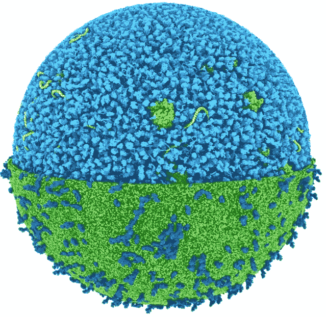

# 科学家们正接近第一次接近原子级别的全细胞模拟

> 原文：[`towardsdatascience.com/scientists-are-approaching-the-first-near-atomic-simulations-of-whole-cells-cb5b6c27cd?source=collection_archive---------9-----------------------#2023-02-28`](https://towardsdatascience.com/scientists-are-approaching-the-first-near-atomic-simulations-of-whole-cells-cb5b6c27cd?source=collection_archive---------9-----------------------#2023-02-28)

## 在 AI 对生物学的影响之后，这可能代表另一个里程碑，这次根植于纯物理学。

 [LucianoSphere (Luciano Abriata, PhD)](https://lucianosphere.medium.com/?source=post_page-----cb5b6c27cd--------------------------------)

·

[关注](https://medium.com/m/signin?actionUrl=https%3A%2F%2Fmedium.com%2F_%2Fsubscribe%2Fuser%2Fd28939b5ab78&operation=register&redirect=https%3A%2F%2Ftowardsdatascience.com%2Fscientists-are-approaching-the-first-near-atomic-simulations-of-whole-cells-cb5b6c27cd&user=LucianoSphere+%28Luciano+Abriata%2C+PhD%29&userId=d28939b5ab78&source=post_page-d28939b5ab78----cb5b6c27cd---------------------post_header-----------) 发表在 [Towards Data Science](https://towardsdatascience.com/?source=post_page-----cb5b6c27cd--------------------------------) ·10 分钟阅读·2023 年 2 月 28 日

--

这是由 Jan Stevens 制作的视频截图，经他许可展示，详见[此 Twitter 线程](https://twitter.com/labriataphd/status/1627404312941830147)。该模型中的每个粒子都代表一个完整的宏观分子，以粗粒度水平建模，这意味着小的原子集合被分组为珠子（详细信息见正文）。

技术的进步和数据科学的兴起导致了生物研究的一个激动人心的新纪元，因为科学家们利用计算方法深入理解细胞的内部运作。事实上，基于计算机的数据分析和数学建模如今在化学、生物学，实际上在所有科学领域都非常普遍。特别是，分子动力学模拟在揭示单个原子的运动和相互作用方面发挥了重要作用，为细胞过程提供了关键见解。然而，由于计算需求，这些模拟传统上仅限于小型系统。最近的突破，如我在此展示的，接近于实现对整个细胞的首次计算模拟，提供了在接近原子级别建模最小完整生物单元的突破性机会。这种新方法根植于纯物理学，有望彻底改变我们对细胞及其复杂行为的理解，为数据驱动的生物学研究和发现开辟新的途径。在这篇文章中，我展示并讨论了数学建模和数据科学……
