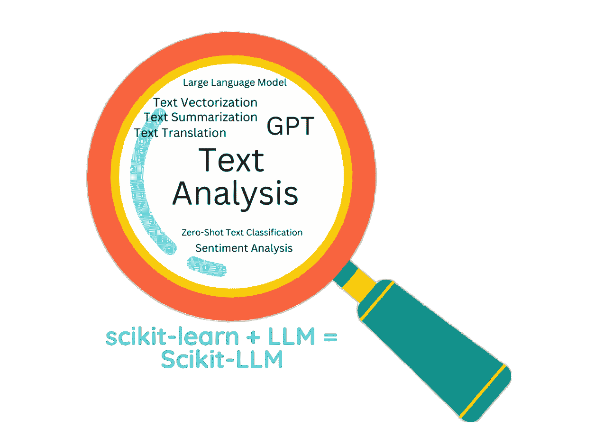

# Scikit-LLM：在 scikit-learn 框架内使用 LLMs 提升 Python 文本分析能力

> 原文：[`towardsdatascience.com/scikit-llm-power-up-your-text-analysis-in-python-using-llm-models-within-scikit-learn-framework-e9f101ffb6d4`](https://towardsdatascience.com/scikit-llm-power-up-your-text-analysis-in-python-using-llm-models-within-scikit-learn-framework-e9f101ffb6d4)

## 实操教程，Python 库

## 使用像 ChatGPT 这样的先进语言模型来进行文本分类，比如情感分析、文本摘要和其他文本分析任务

[](https://medium.ealizadeh.com/?source=post_page-----e9f101ffb6d4--------------------------------)[](https://towardsdatascience.com/?source=post_page-----e9f101ffb6d4--------------------------------) [Essi Alizadeh](https://medium.ealizadeh.com/?source=post_page-----e9f101ffb6d4--------------------------------)

·发布于[Towards Data Science](https://towardsdatascience.com/?source=post_page-----e9f101ffb6d4--------------------------------) ·10 分钟阅读·2023 年 6 月 6 日

--


照片由[Patrick Tomasso](https://unsplash.com/@impatrickt?utm_source=medium&utm_medium=referral)拍摄，发布在[Unsplash](https://unsplash.com/?utm_source=medium&utm_medium=referral)

# 介绍

[Scikit-LLM](https://github.com/iryna-kondr/scikit-llm)是一个 Python 包，将像 OpenAI 的 GPT-3 这样的高级语言模型（LLMs）集成到[scikit-learn](https://scikit-learn.org/)框架中，用于文本分析任务。

Scikit-LLM 旨在与 scikit-learn 框架一起使用。因此，如果你对 scikit-learn 很熟悉，你会对 scikit-llm 感到如鱼得水。该库提供了一系列功能，我们将介绍以下内容：

+   零样本文本分类

+   多标签零样本文本分类

+   文本向量化

+   文本翻译

+   文本摘要



本文涵盖的概念（图片由作者提供）

> 请注意，本文中使用的所有数据集均由作者专门创建和编制。

## 为什么选择这个库？

这个库的主要优点是熟悉的 scikit-learn API，特别是，

+   你可以使用与 scikit-learn 类似的 API，如`.fit()`、`.fit_transform()`和`.predict()`。

+   你可以在 Sklearn 管道中组合 scikit-llm 库中的估算器（请查看我在本文中的最后一个示例）。

# 安装

你可以通过 pip 安装这个库：

```py
pip install scikit-llm
```

# 配置

在开始使用 Scikit-LLM 之前，你需要将你的 OpenAI API 密钥传递给 Scikit-LLM。你可以查看这个[帖子](https://www.howtogeek.com/885918/how-to-get-an-openai-api-key/)来设置你的 OpenAI API 密钥。

```py
from skllm.config import SKLLMConfig

OPENAI_SECRET_KEY = "sk-***"
OPENAI_ORG_ID = "org-***"

SKLLMConfig.set_openai_key(OPENAI_SECRET_KEY)
SKLLMConfig.set_openai_org(OPENAI_ORG_ID)
```

> 请注意，Scikit-LLM 提供了一个方便的接口来访问 OpenAI 的 GPT-3 模型。使用这些模型并非免费，并且需要 API 密钥。虽然 API 成本相对便宜，但根据数据量和调用频率，这些成本可能会累积。因此，计划和管理使用非常重要以控制成本。在开始使用 Scikit-LLM 之前，请务必查看 OpenAI 的 [定价详情](https://openai.com/pricing/) 和使用条款。
> 
> 大致说一下，我至少运行了这个笔记本五次以制作这个教程，总费用为 0.02 美元。我得说，我本以为会更高！

# 零样本文本分类

Scikit-LLM 的一个特点是能够执行零样本文本分类。Scikit-LLM 为此提供了两个类：

+   **ZeroShotGPTClassifier**：用于单标签分类（例如情感分析），

+   **MultiLabelZeroShotGPTClassifier**：用于多标签分类任务。

# 单标签 ZeroShotGPTClassifier

让我们对一些电影评论进行情感分析。为了训练目的，我们为每条评论定义情感（由变量 `movie_review_labels` 定义）。我们用这些评论和标签训练模型，以便我们可以使用训练好的模型预测新的电影评论。

电影评论的样本数据集如下所示：

```py
movie_reviews = [
    "This movie was absolutely wonderful. The storyline was compelling and the characters were very realistic.",
    "I really loved the film! The plot had a few unexpected twists which kept me engaged till the end.",
    "The movie was alright. Not great, but not bad either. A decent one-time watch.",
    "I didn't enjoy the film that much. The plot was quite predictable and the characters lacked depth.",
    "This movie was not to my taste. It felt too slow and the storyline wasn't engaging enough.",
    "The film was okay. It was neither impressive nor disappointing. It was just fine.",
    "I was blown away by the movie! The cinematography was excellent and the performances were top-notch.",
    "I didn't like the movie at all. The story was uninteresting and the acting was mediocre at best.",
    "The movie was decent. It had its moments but was not consistently engaging."
]

movie_review_labels = [
    "positive", 
    "positive", 
    "neutral", 
    "negative", 
    "negative", 
    "neutral", 
    "positive", 
    "negative", 
    "neutral"
]

new_movie_reviews = [
    # A positive review
    "The movie was fantastic! I was captivated by the storyline from beginning to end.",

    # A negative review
    "I found the film to be quite boring. The plot moved too slowly and the acting was subpar.",

    # A neutral review
    "The movie was okay. Not the best I've seen, but certainly not the worst."
]
```

让我们训练模型，然后检查模型对每条新评论的预测。

```py
from skllm import ZeroShotGPTClassifier

# Initialize the classifier with the OpenAI model
clf = ZeroShotGPTClassifier(openai_model="gpt-3.5-turbo")

# Train the model 
clf.fit(X=movie_reviews, y=movie_review_labels)  

# Use the trained classifier to predict the sentiment of the new reviews
predicted_movie_review_labels = clf.predict(X=new_movie_reviews)  

for review, sentiment in zip(new_movie_reviews, predicted_movie_review_labels):
    print(f"Review: {review}\nPredicted Sentiment: {sentiment}\n\n")
```

```py
Review: The movie was fantastic! I was captivated by the storyline from beginning to end.
Predicted Sentiment: positive

Review: I found the film to be quite boring. The plot moved too slowly and the acting was subpar.
Predicted Sentiment: negative

Review: The movie was okay. Not the best I've seen, but certainly not the worst.
Predicted Sentiment: neutral
```

如上所示，模型正确预测了每条电影评论的情感。

# 多标签 ZeroShotGPTClassifier

在上一节中，我们使用了一个单标签分类器（[“positive”, “negative”, “neutral”]）。这里，我们将使用 `MultiLabelZeroShotGPTClassifier` 估计器为餐厅评论列表分配多个标签。

```py
restaurant_reviews = [
    "The food was delicious and the service was excellent. A wonderful dining experience!",
    "The restaurant was in a great location, but the food was just average.",
    "The service was very slow and the food was cold when it arrived. Not a good experience.",
    "The restaurant has a beautiful ambiance, and the food was superb.",
    "The food was great, but I found it to be a bit overpriced.",
    "The restaurant was conveniently located, but the service was poor.",
    "The food was not as expected, but the restaurant ambiance was really nice.",
    "Great food and quick service. The location was also very convenient.",
    "The prices were a bit high, but the food quality and the service were excellent.",
    "The restaurant offered a wide variety of dishes. The service was also very quick."
]

restaurant_review_labels = [
    ["Food", "Service"],
    ["Location", "Food"],
    ["Service", "Food"],
    ["Atmosphere", "Food"],
    ["Food", "Price"],
    ["Location", "Service"],
    ["Food", "Atmosphere"],
    ["Food", "Service", "Location"],
    ["Price", "Food", "Service"],
    ["Food Variety", "Service"]
]

new_restaurant_reviews = [
    "The food was excellent and the restaurant was located in the heart of the city.",
    "The service was slow and the food was not worth the price.",
    "The restaurant had a wonderful ambiance, but the variety of dishes was limited."
]
```

让我们训练模型，然后预测新评论的标签。

```py
from skllm import MultiLabelZeroShotGPTClassifier

# Initialize the classifier with the OpenAI model
clf = MultiLabelZeroShotGPTClassifier(max_labels=3)

# Train the model 
clf.fit(X=restaurant_reviews, y=restaurant_review_labels)

# Use the trained classifier to predict the labels of the new reviews
predicted_restaurant_review_labels = clf.predict(X=new_restaurant_reviews)

for review, labels in zip(new_restaurant_reviews, predicted_restaurant_review_labels):
    print(f"Review: {review}\nPredicted Labels: {labels}\n\n")
```

```py
Review: The food was excellent and the restaurant was located in the heart of the city.
Predicted Labels: ['Food', 'Location']

Review: The service was slow and the food was not worth the price.
Predicted Labels: ['Service', 'Price']

Review: The restaurant had a wonderful ambiance, but the variety of dishes was limited.
Predicted Labels: ['Atmosphere', 'Food Variety']
```

对每条评论的预测标签都是准确的。

# 文本向量化

Scikit-LLM 提供了 `GPTVectorizer` 类来将输入文本转换为固定维度的向量表示。每个生成的向量都是浮点数数组，这是相应句子的表示。

让我们获取以下句子的向量化表示。

```py
from skllm.preprocessing import GPTVectorizer

X = [
    "AI can revolutionize industries.",
    "Robotics creates automated solutions.",
    "IoT connects devices for data exchange."
]

vectorizer = GPTVectorizer()

vectors = vectorizer.fit_transform(X)

print(vectors)
```

```py
[[-0.00818074 -0.02555227 -0.00994665 ... -0.00266894 -0.02135153
   0.00325925]
 [-0.00944166 -0.00884305 -0.01260475 ... -0.00351341 -0.01211498
  -0.00738735]
 [-0.01084771 -0.00133671  0.01582962 ...  0.01247486 -0.00829649
  -0.01012453]]
```

在实际操作中，这些向量是其他机器学习模型的输入，用于分类、聚类或回归等任务，而不是直接检查向量。

# 文本翻译

GPT 模型可以通过从一种语言到另一种语言的准确阅读来进行翻译。我们可以使用 `GPTTranslator` 模块将文本翻译成感兴趣的语言。

```py
from skllm.preprocessing import GPTTranslator
from skllm.datasets import get_translation_dataset

translator = GPTTranslator(openai_model="gpt-3.5-turbo", output_language="English")

text_to_translate = ["Je suis content que vous lisiez ce post."]
# "I am happy that you are reading this post."

translated_text = translator.fit_transform(text_to_translate)

print(
    f"Text in French: \n{text_to_translate[0]}\n\nTranslated text in English: {translated_text[0]}"
)
```

```py
Text in French: 
Je suis content que vous lisiez ce post.

Translated text in English: I am glad that you are reading this post.
```

# 文本摘要

GPT 模型对于总结文本非常有用。Scikit-LLM 库提供了 `GPTSummarizer` 估计器用于文本摘要。让我们通过对下面的长评论进行总结来看看它的效果。

```py
reviews = [
    (
        "I dined at The Gourmet Kitchen last night and had a wonderful experience. " 
        "The service was impeccable, the food was exquisite, and the ambiance was delightful. "
        "I had the seafood pasta, which was cooked to perfection. "
        "The wine list was also quite impressive. "
        "I would highly recommend this restaurant to anyone looking for a fine dining experience."
    ),
    (
        "I visited The Burger Spot for lunch today and was pleasantly surprised. "
        "Despite being a fast food joint, the quality of the food was excellent. "
        "I ordered the classic cheeseburger and it was juicy and flavorful. "
        "The fries were crispy and well-seasoned. "
        "The service was quick and the staff was friendly. "
        "It's a great place for a quick and satisfying meal."
    ),
    (
        "The Coffee Corner is my favorite spot to work and enjoy a good cup of coffee. "
        "The atmosphere is relaxed and the coffee is always top-notch. "
        "They also offer a variety of pastries and sandwiches. "
        "The staff is always welcoming and the service is fast. "
        "I enjoy their latte and the blueberry muffin is a must-try."
    )
]

# NOTE
# string1 = "ABC"
# string2 = ("A" "B" "C")
# print(string1 == string2)
# >>> True
```

请注意，上面的 `reviews` 是一个包含三个项目的列表，每个项目都以易于阅读的方式书写。

```py
from skllm.preprocessing import GPTSummarizer

gpt_summarizer = GPTSummarizer(openai_model = "gpt-3.5-turbo", max_words = 15)

summaries = gpt_summarizer.fit_transform(reviews)

print(summaries)
```

生成每条评论的简短摘要。`max_words`参数设置了摘要长度的大致上限；实际上，摘要可能稍长。

# 在 scikit-learn 管道中使用 scikit-llm

到目前为止，上述所有示例仅使用了 Scikit-LLM 库中的估计器。如前所述，这个库的主要优点是它与 scikit-learn 平台的集成。

以下示例在 scikit-learn 管道中使用了 scikit-llm 估计器，并对之前说明的电影评论示例运行了 XGBoost 分类器。

```py
from sklearn.pipeline import Pipeline
from sklearn.preprocessing import LabelEncoder
from skllm.preprocessing import GPTVectorizer
from xgboost import XGBClassifier

# Define variables with conventional names to reduce confusion
X, y = movie_reviews, movie_review_labels
X_test, y_test = new_movie_reviews, new_movie_review_labels

# Encode labels
le = LabelEncoder()
y_encoded = le.fit_transform(y)
y_test_encoded = le.transform(y_test)

# Use a scikit-learn pipeline 
steps = [("GPT", GPTVectorizer()), ("Clf", XGBClassifier())]
clf = Pipeline(steps)

clf.fit(X, y_encoded)

y_pred_encoded = clf.predict(X_test)

# Revert the encoded labels to actual labels 
y_pred = le.inverse_transform(y_pred_encoded)

print(f"\nEncoded labels (train set): {y_encoded}\n")
print(f"Actual Labels (train set): {y}")

print(f"Predicted labels (encoded): {y_test_encoded}\n")

print("------------------\nEvaluate the performance of XGBoost Classifier:\n")
for test_review, actual_label, predicted_label in zip(X_test, y_test, y_pred):
    print(f"Review: {test_review}\nActual Label: {actual_label}\nPredicted Label: {predicted_label}\n")
```

```py
Encoded labels (train set): [2 2 1 0 0 1 2 0 1]

Actual Labels (train set): ['positive', 'positive', 'neutral', 'negative', 'negative', 'neutral', 'positive', 'negative', 'neutral']
Predicted labels (encoded): [2 0 1]

------------------
Evaluate the performance of XGBoost Classifier:

Review:The movie was fantastic! I was captivated by the storyline from beginning to end.
Actual Label: positive
Predicted Label: positive

Review:I found the film to be quite boring. The plot moved too slowly and the acting was subpar.
Actual Label: negative
Predicted Label: positive

Review:The movie was okay. Not the best I've seen, but certainly not the worst.
Actual Label: neutral
Predicted Label: neutral
```

请注意，上述内容仅为一个用例，用于说明在 SKlearn 管道中集成 Scikit-LLM 估计器的可能性。

如果你喜欢这篇文章，你一定会喜欢我的另一篇文章，内容涉及 NLP 任务中的字符串到字符串算法。

[](/tutorial-string2string-python-pkg-f9126b8474c5?source=post_page-----e9f101ffb6d4--------------------------------) ## 使用 string2string 驯服文本：一个强大的 Python 库，用于字符串到字符串算法

### 利用 string2string 进行自然语言处理任务

[towardsdatascience.com

# 结论

Scikit-LLM 是一个强大的工具，它将像 GPT-3 这样的先进语言模型的力量添加到著名的 scikit-learn 框架中。在本教程中，我们查看了 Scikit-LLM 的一些重要特性：1）零样本文本分类，2）多标签零样本文本分类，3）文本向量化，4）文本摘要，5）语言翻译，以及 6）与 scikit-learn 管道的集成。

正如我之前提到的，这个库的主要优点是它与 scikit-learn 相似的 API 以及其集成到 scikit-learn 管道中的能力。然而，Scikit-LLM 的主要限制是它对 OpenAI 的高度依赖。尽管集成开源模型在[Scikit-LLM 的路线图](https://github.com/iryna-kondr/scikit-llm#roadmap)中已经列出，但库中尚不可用。因此，如果你使用 Scikit-LLM，你应该知道：

+   由于 Scikit-LLM 使用了 OpenAI 模型，因此对 OpenAI 的 API 调用有费用或请求次数限制。

+   Scikit-LLM 必然会有与 OpenAI API 相同的限制，例如无法访问互联网或对给定 OpenAI 模型的最大令牌数（在这篇文章中，主要使用“gpt-3-turbo”模型，该模型的最大令牌数为 4096）。

Scikit-LLM 是一个有前景的工具，它在使用大型语言模型进行文本分析方面开辟了新的可能性。这个库可能是你工具箱中的有用补充，因此我建议你尝试一下。

> 📓 你可以在[GitHub](https://github.com/e-alizadeh/data-science-blog/blob/master/notebooks/Scikit-LLM-tutorial.ipynb)上找到这篇文章的笔记本。

感谢阅读！📚

我是一名高级数据科学家📊和工程师，撰写关于统计学、机器学习、Python 等方面的内容。

> 🌱 我还策划了一份每周新闻通讯，名为 [**AI Sprout**](https://aisprout.beehiiv.com/subscribe)，在其中提供最新 AI 工具和创新的实用评测和分析。[订阅](https://aisprout.beehiiv.com/subscribe) 与我一起探索新兴 AI！

+   [*在 Medium 上关注我*](https://medium.com/@ealizadeh) *👋 获取我的最新文章*

+   *订阅* [*我的邮件列表*](https://ealizadeh.com/) *✉️ 以获取最新更新直接送到你的收件箱*

+   *让我们在* [*LinkedIn*](https://www.linkedin.com/in/alizadehesmaeil/) *和* [*Twitter*](https://twitter.com/es_alizadeh) *上连接* 🤝

[](https://medium.ealizadeh.com/membership?source=post_page-----e9f101ffb6d4--------------------------------) [## 通过我的推荐链接加入 Medium - Esmaeil Alizadeh

### 📖 阅读 Esmaeil Alizadeh 的每一个故事（以及 Medium 上成千上万其他作家的故事）。订阅 Medium 以获取完整内容……

[medium.ealizadeh.com](https://medium.ealizadeh.com/membership?source=post_page-----e9f101ffb6d4--------------------------------)

# 参考资料

[](https://github.com/iryna-kondr/scikit-llm?source=post_page-----e9f101ffb6d4--------------------------------) [## GitHub - iryna-kondr/scikit-llm: 无缝集成强大的语言模型，如 ChatGPT，以增强文本分析任务……

### 无缝集成强大的语言模型，如 ChatGPT，以增强 scikit-learn 的文本分析任务。你可以……

[github.com](https://github.com/iryna-kondr/scikit-llm?source=post_page-----e9f101ffb6d4--------------------------------)

# 有用的链接

[](https://scikit-learn.org/?source=post_page-----e9f101ffb6d4--------------------------------) [## scikit-learn

### “我们使用 scikit-learn 来支持前沿的基础研究 [...]” “我认为这是我使用过的设计最好的 ML 包……”

[scikit-learn.org](https://scikit-learn.org/?source=post_page-----e9f101ffb6d4--------------------------------) [](https://www.howtogeek.com/885918/how-to-get-an-openai-api-key/?source=post_page-----e9f101ffb6d4--------------------------------) [## 如何获取 OpenAI API 密钥

### 现在许多应用程序和 AI 工具要求你提供自己的 OpenAI API 密钥。你可以在 OpenAI 的网站上生成一个……

[www.howtogeek.com](https://www.howtogeek.com/885918/how-to-get-an-openai-api-key/?source=post_page-----e9f101ffb6d4--------------------------------)

*最初发布于* [*https://ealizadeh.com*](https://ealizadeh.com/blog/tutorial-scikit-llm/)*.*
