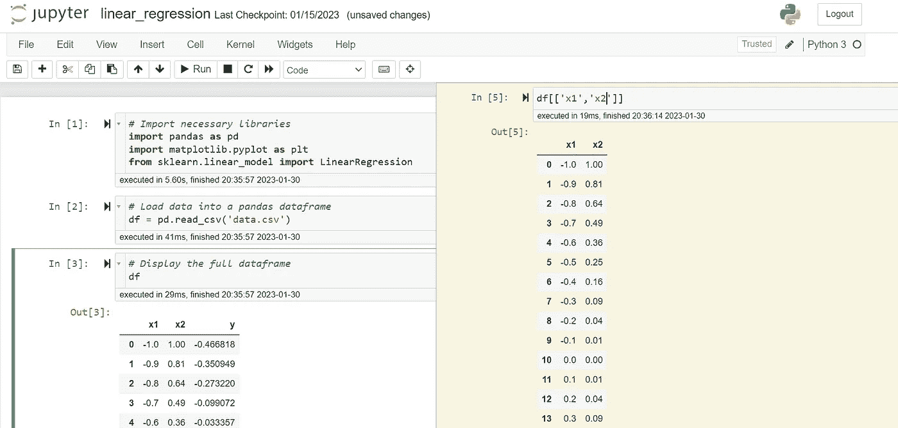

# Scratchpad 插件用于 Jupyter Notebooks 和 Google Colab

> 原文：[`towardsdatascience.com/scratchpad-add-in-for-jupyter-notebooks-and-google-colab-241a8f06eeb5?source=collection_archive---------25-----------------------#2023-01-31`](https://towardsdatascience.com/scratchpad-add-in-for-jupyter-notebooks-and-google-colab-241a8f06eeb5?source=collection_archive---------25-----------------------#2023-01-31)

## 在 Jupyter notebooks 和 Google Colab 中访问 Scratchpad 功能

 [尼古拉斯·刘易斯](https://nrlewis929.medium.com/?source=post_page-----241a8f06eeb5--------------------------------)

·

[关注](https://medium.com/m/signin?actionUrl=https%3A%2F%2Fmedium.com%2F_%2Fsubscribe%2Fuser%2Fa4cd35f7b702&operation=register&redirect=https%3A%2F%2Ftowardsdatascience.com%2Fscratchpad-add-in-for-jupyter-notebooks-and-google-colab-241a8f06eeb5&user=Nicholas+Lewis&userId=a4cd35f7b702&source=post_page-a4cd35f7b702----241a8f06eeb5---------------------post_header-----------) 发表在 [Towards Data Science](https://towardsdatascience.com/?source=post_page-----241a8f06eeb5--------------------------------) · 3 分钟阅读 · 2023 年 1 月 31 日

--

照片由 [贾斯汀·摩根](https://unsplash.com/fr/@justin_morgan?utm_source=medium&utm_medium=referral) 拍摄，来源于 [Unsplash](https://unsplash.com/?utm_source=medium&utm_medium=referral)

我过去几年一直使用 Jupyter notebooks 来开发想法和探索数据。在众多方便的 [插件](https://jupyter-contrib-nbextensions.readthedocs.io/en/latest/) 中，有一个我已彻底融入我的工作流程中，以至于每当我开始使用不同的计算机时，都会立即添加它。那就是下面展示的 Scratchpad。

使用 Jupyter Notebook Scratchpad 扩展的截图。截图由作者提供

在你开发新代码和探索数据时，你可能会发现需要快速测试一下代码片段是否有效。或者，也许你想输出一些东西，但在你当前的工作单元格中这样做会打乱其他内容。使用 scratchpad 便捷极了，只需按下 `ctrl+B` 就能弹出一个新单元格。我几乎比其他任何功能都更常用这个功能。它不仅能帮助我保持代码中不多余的单元格而且不会忘记它们，而且*更快*——只需轻按几下 `ctrl+B` 就能打开和关闭，而不是添加和删除新单元格并上下滚动页面。它就像为你的 Jupyter Notebook 配备了一个双显示器一样。
