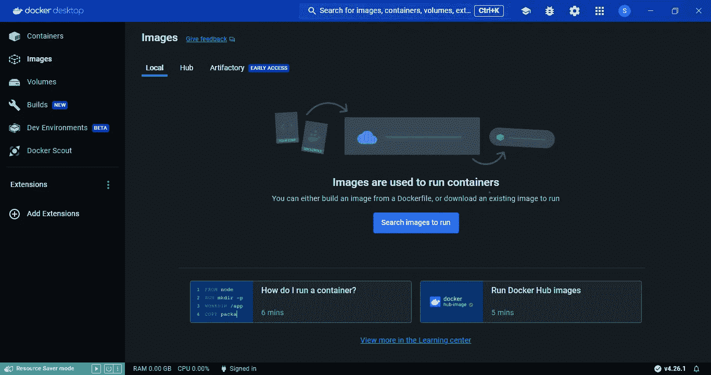
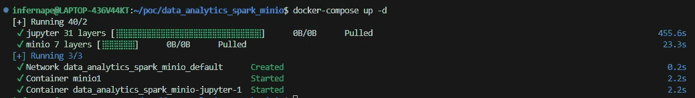
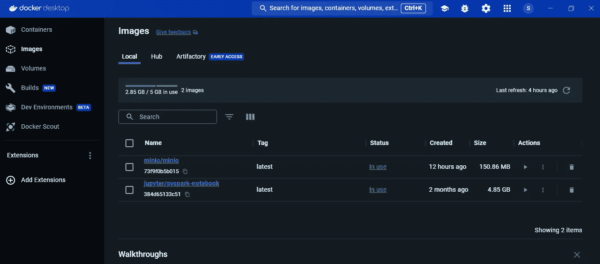
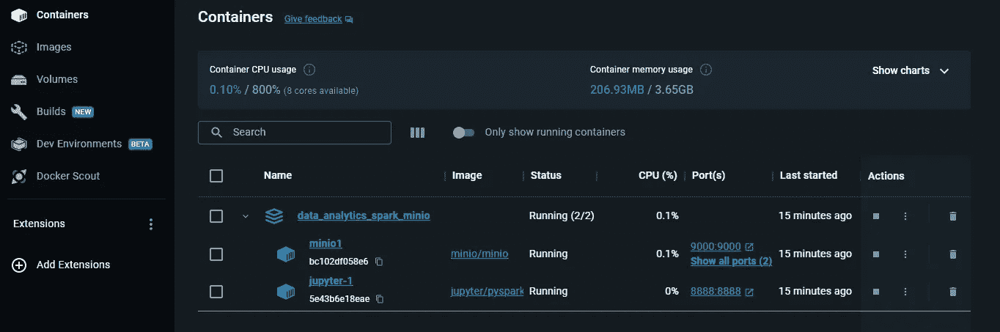
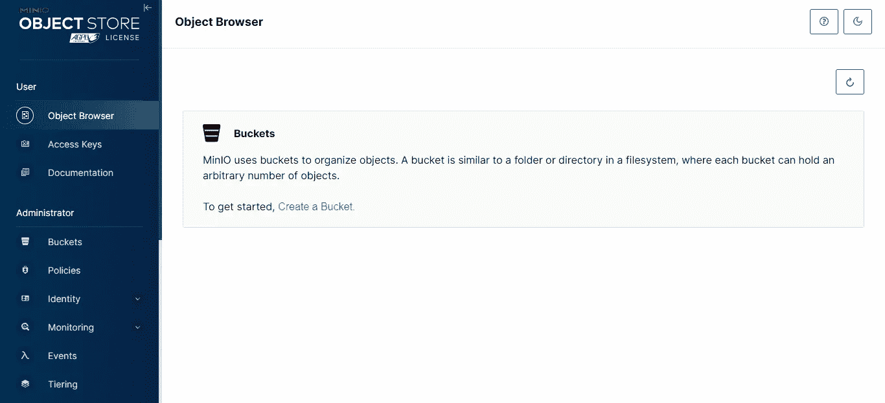
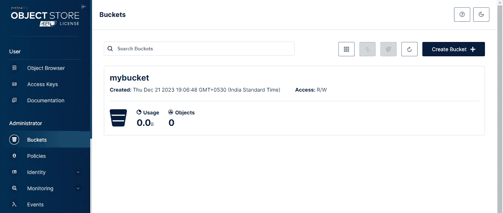
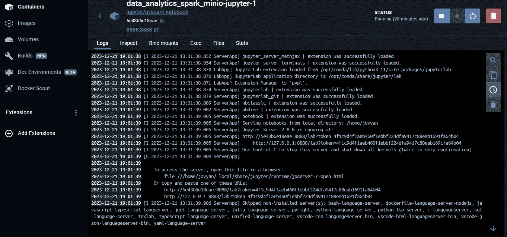
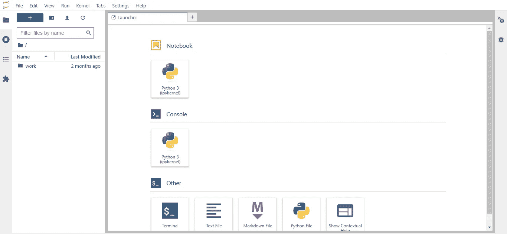
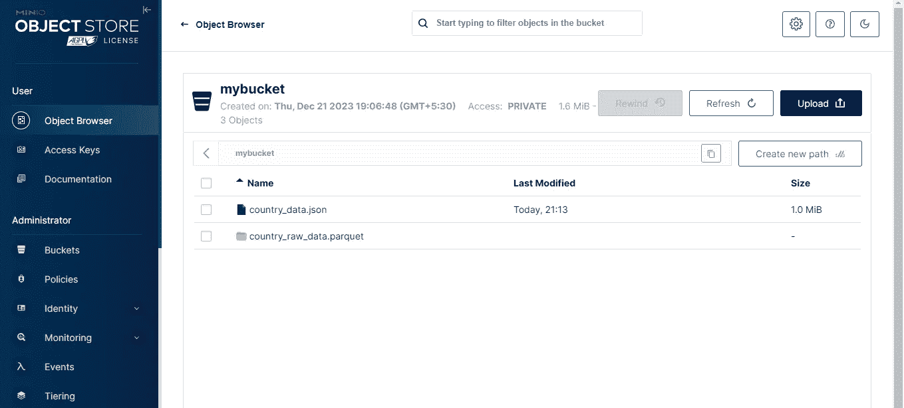
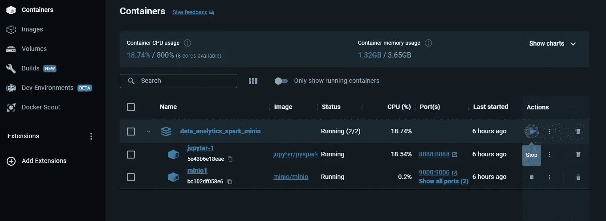

# 无缝数据分析工作流：从 Docker 化的 JupyterLab 和 MinIO 到利用 Spark SQL 的洞察

> 原文：[`towardsdatascience.com/seamless-data-analytics-workflow-from-dockerized-jupyterlab-and-minio-to-insights-with-spark-sql-3c5556a18ce6?source=collection_archive---------5-----------------------#2023-12-21`](https://towardsdatascience.com/seamless-data-analytics-workflow-from-dockerized-jupyterlab-and-minio-to-insights-with-spark-sql-3c5556a18ce6?source=collection_archive---------5-----------------------#2023-12-21)

[](https://medium.com/@sarbahi.sarthak?source=post_page-----3c5556a18ce6--------------------------------)[](https://towardsdatascience.com/?source=post_page-----3c5556a18ce6--------------------------------) [Sarthak Sarbahi](https://medium.com/@sarbahi.sarthak?source=post_page-----3c5556a18ce6--------------------------------)

·

[关注](https://medium.com/m/signin?actionUrl=https%3A%2F%2Fmedium.com%2F_%2Fsubscribe%2Fuser%2F35908b3630e1&operation=register&redirect=https%3A%2F%2Ftowardsdatascience.com%2Fseamless-data-analytics-workflow-from-dockerized-jupyterlab-and-minio-to-insights-with-spark-sql-3c5556a18ce6&user=Sarthak+Sarbahi&userId=35908b3630e1&source=post_page-35908b3630e1----3c5556a18ce6---------------------post_header-----------) 发表在 [Towards Data Science](https://towardsdatascience.com/?source=post_page-----3c5556a18ce6--------------------------------) ·17 分钟阅读·2023 年 12 月 21 日[](https://medium.com/m/signin?actionUrl=https%3A%2F%2Fmedium.com%2F_%2Fvote%2Ftowards-data-science%2F3c5556a18ce6&operation=register&redirect=https%3A%2F%2Ftowardsdatascience.com%2Fseamless-data-analytics-workflow-from-dockerized-jupyterlab-and-minio-to-insights-with-spark-sql-3c5556a18ce6&user=Sarthak+Sarbahi&userId=35908b3630e1&source=-----3c5556a18ce6---------------------clap_footer-----------)

--

[](https://medium.com/m/signin?actionUrl=https%3A%2F%2Fmedium.com%2F_%2Fbookmark%2Fp%2F3c5556a18ce6&operation=register&redirect=https%3A%2F%2Ftowardsdatascience.com%2Fseamless-data-analytics-workflow-from-dockerized-jupyterlab-and-minio-to-insights-with-spark-sql-3c5556a18ce6&source=-----3c5556a18ce6---------------------bookmark_footer-----------)

照片由 [Ian Taylor](https://unsplash.com/@carrier_lost?utm_source=medium&utm_medium=referral) 在 [Unsplash](https://unsplash.com/?utm_source=medium&utm_medium=referral) 提供

本教程将引导你通过一个分析用例，使用 Spark SQL 分析半结构化数据。我们将从数据工程过程开始，从 API 中提取数据，最后将转换后的数据加载到数据湖中（由 [MinIO](https://min.io/) 表示）。此外，我们还将利用 Docker 引入设置环境的最佳实践。现在，让我们深入了解这一切是如何完成的吧！

# 目录

1.  理解构建模块

1.  设置 Docker Desktop

1.  配置 MinIO

1.  开始使用 JupyterLab

1.  数据管道：ETL 过程

1.  分析半结构化数据

1.  资源清理

## 理解构建模块

本教程涉及一系列技术。在实际操作之前，让我们先掌握每一个技术。我们将使用类比来使每个组件的理解变得更容易。

[](https://github.com/sarthak-sarbahi/data-analytics-minio-spark/tree/main?source=post_page-----3c5556a18ce6--------------------------------) [## GitHub - sarthak-sarbahi/data-analytics-minio-spark

### 通过在 GitHub 上创建账户，参与 sarthak-sarbahi/data-analytics-minio-spark 的开发。

[github.com](https://github.com/sarthak-sarbahi/data-analytics-minio-spark/tree/main?source=post_page-----3c5556a18ce6--------------------------------)

想象你是一个船长，准备跨越广阔的海洋。在数据的世界里，这片海洋是从各种来源流出的无尽信息流。我们的船呢？它就是我们用来导航这些水域的工具和技术套件。

+   **使用 Docker Compose 进行 JupyterLab 和 MinIO 配置**：就像船只需要合适的部件才能起航一样，我们的数据之旅也始于组装我们的工具。把 Docker Compose 想象成我们的工具箱，它让我们高效地将 JupyterLab（我们的航海图）和 MinIO（我们的存储甲板）组装在一起。这就像是建造一艘为未来航程量身定制的船只。

+   **使用 Python 获取数据**：现在，是时候规划航线了。使用 Python 就像是将一张大网撒入海中以捕捞鱼（我们的数据）。我们仔细选择捕捞的内容，通过 API 拉取数据并以 JSON 格式存储 —— 这是一种组织我们的“鱼”的方式，使其易于后续访问和使用。

+   **使用 PySpark 读取和转换数据**：有了我们的捕捞，借助 PySpark 这一指南针，我们能够在这片数据的海洋中航行。PySpark 帮助我们清理、组织和理解我们的捕捞，将原始数据转化为有价值的见解，就像熟练的厨师从当天的捕捞中准备出各种菜肴一样。

+   **使用 Spark SQL 进行分析**：最后，我们将更深入地探索，用 Spark SQL 挖掘数据的深处。就像使用复杂的声呐来寻找隐藏在波浪下的宝藏一样。我们进行分析以发现见解和答案，揭示隐藏在我们数据海洋中的珍贵珍珠。

既然我们知道了旅程中将会遇到的内容，让我们开始设置一切吧。

## 设置 Docker Desktop

Docker 是一个使创建、部署和运行应用程序变得更容易的工具。Docker 容器将一个应用程序及其所需的一切（如库和其他依赖项）打包成一个包。这意味着应用程序无论在何处部署 Docker 容器——无论是在你的笔记本电脑、同事的机器还是云服务器上——都会以相同的方式运行。这解决了一个大问题：由于不同的配置，软件在不同机器上运行不同的问题。

在本指南中，我们将同时使用多个 Docker 容器。这是在实际应用中典型的场景，例如 web 应用程序与数据库的通信。**Docker Compose** 使这一切变得简单。它允许我们启动多个容器，每个容器处理应用程序的一部分。Docker Compose 确保这些组件可以相互作用，使应用程序作为一个整体单元运行。

要设置 Docker，我们使用**Docker Desktop**应用程序。Docker Desktop 对个人和教育用途是免费的。你可以从[这里](https://www.docker.com/products/docker-desktop/)下载。



Docker Desktop 应用程序（图片由作者提供）

安装 Docker Desktop 后，我们将开始教程。我们将在集成开发环境（IDE）中启动一个新项目。你可以选择任何你喜欢的 IDE。我使用的是*Visual Studio Code*。

在本指南中，我使用安装了**WSL 2**（Windows Subsystem for Linux）的 Windows 机器。这个设置让我在我的 Windows PC 上运行 Linux 环境，特别是 Ubuntu。如果你也使用 Windows 并想启用 Docker Desktop for WSL 2，可以观看一个有用的[视频](https://www.youtube.com/watch?v=2ezNqqaSjq8)。

接下来，我们将在项目的根目录中创建一个`docker-compose.yml`文件。

Docker Compose 文件（图片由作者提供）

如果这是你第一次遇到这样的文件，不用担心。我会在接下来的部分详细讲解。现在，只需在该文件所在目录运行命令`docker-compose up -d`。此命令将首先从**Docker Hub**获取 JupyterLab 和 MinIO 的 Docker 镜像。



运行命令的结果（图片由作者提供）

**Docker 镜像**就像是创建 Docker 容器的蓝图或配方。把它想象成一个预打包的盒子，里面包含了运行特定软件或应用程序所需的一切。这个盒子（或镜像）包括代码、运行时、系统工具、库和设置——基本上所有运行应用程序所需的部分。

> 容器只是 Docker 镜像的运行实例。

[Docker Hub](https://hub.docker.com/) 就像是一个在线库或商店，大家可以在这里找到和分享 Docker 镜像。



所需的镜像已下载（作者提供的图片）

镜像下载完成后，它将为每个镜像启动一个容器。这个过程将启动两个容器——一个用于 JupyterLab，另一个用于 MinIO。



两个容器正在运行（作者提供的图片）

既然所需的进程已启动，让我们深入了解 MinIO 及其配置。

## 配置 MinIO

MinIO 是一种开源对象存储解决方案，专门设计用于处理大量和多种类的数据。它与 Amazon S3 API 高度兼容，这使其成为云原生应用程序的多功能选择。

> MinIO 就像是在你的电脑上使用‘免费的’ Amazon S3 版本。

我们将利用 MinIO 存储原始数据和处理数据，模拟真实世界的场景。由于 Docker，我们已经让 MinIO 启动并运行。接下来，我们需要学习如何使用它。首先，让我们回顾一下 `docker-compose.yml` 文件。

文件中的 `services` 部分概述了我们将运行的容器以及它们将启动的软件实例。我们这里重点关注 MinIO 服务。


**docker-compose.yml** 文件中的 MinIO 服务（作者提供的图片）

让我们来详细了解一下。

+   `image: minio/minio` 告诉 Docker 使用来自 Docker Hub（Docker 镜像的在线库）的 MinIO 镜像。

+   `container_name: minio1` 给这个容器命名，在这种情况下，命名为 `minio1`。

+   `ports: - "9000:9000" - "9001:9001"` 将容器的端口映射到你的主机上。这允许你通过这些端口在本地机器上访问 MinIO 服务。

+   `volumes: - /mnt/data:/data` 设置一个卷，就像一个存储空间，将你主机上的一个目录 (`/mnt/data`) 映射到容器中的一个目录 (`/data`)。这意味着 MinIO 将使用你机器上的 `/mnt/data` 目录来存储数据。

+   `environment:` 部分设置容器内的环境变量。在这里，它设置了 MinIO 根用户的用户名和密码。

+   `command: server /data --console-address ":9001"` 是将在 MinIO 容器内运行的命令。它启动 MinIO 服务器并指示使用 `/data` 目录。

MinIO 设置完成后，让我们开始使用它。你可以通过 `[`localhost:9001`](http://localhost:9001/)` 访问 MinIO 的 Web 界面。在首次访问时，你需要使用 `docker-compose` 文件中指定的用户名（`minio`）和密码（`minio123`）登录。



MinIO 门户（作者提供的图片）

登录后，继续创建一个桶。点击“创建桶”，并将其命名为 `**mybucket**`。命名后，点击“创建桶”。默认设置现在没问题，但可以随时查看页面右侧的设置说明。



在 MinIO 中创建的桶（作者提供的图片）

做得好！我们现在可以使用 MinIO 了。接下来，让我们探讨如何使用 JupyterLab。

## 开始使用 JupyterLab

JupyterLab 是一个互动的基于网页的界面，帮助我们编写代码、在笔记本上进行分析和处理数据。事实上，JupyterLab 镜像已经包括了 Python 和 PySpark，因此不需要麻烦地设置它们。


JupyterLab 服务在 **docker-compose.yml** 文件中的配置（作者提供的图片）

首先，让我们回顾一下 `docker-compose.yml` 文件，以了解 `jupyter` 服务。

+   `image: jupyter/pyspark-notebook` 指定使用预装 PySpark 的 JupyterLab 镜像。

+   `ports: - "8888:8888"` 将 JupyterLab 端口映射到主机上的同一端口，使您可以通过浏览器访问它。

要访问其网页界面，请在 Docker Desktop 应用程序中导航到“Containers”选项卡。找到并点击标记为 `jupyter-1` 的 JupyterLab 容器。这将显示容器日志。



JupyterLab 容器日志（作者提供的图片）

在这些日志中，您会找到一个类似于这样的 URL：`[`127.0.0.1:8888/lab?token=4f1c9d4f1aeb460f1ebbf224dfa9417c88eab1691fa64b04`](http://127.0.0.1:8888/lab?token=4f1c9d4f1aeb460f1ebbf224dfa9417c88eab1691fa64b04)`。点击这个 URL 启动网页界面。



JupyterLab 网页界面（作者提供的图片）

到达那里后，选择“Notebook”部分下的“Python 3 (ipykernel)”图标。此操作会打开一个新笔记本，我们将在其中编写用于数据检索、转换和分析的代码。在深入编写代码之前，请记得保存并适当地命名您的笔记本。这样，我们就可以开始处理数据了。

## 数据管道：ETL 过程

在深入数据分析之前，我们首先需要收集数据。我们将采用 **ETL**（提取、转换、加载）过程，包括以下步骤：

+   最初，我们将使用公共 API 提取数据。

+   然后，我们将把这些数据作为 JSON 文件加载到 MinIO 存储桶中。

+   然后，我们将使用 PySpark 转换数据，并将其以 Parquet 格式保存回存储桶。

+   最后，我们将从这些 Parquet 数据中创建一个 Hive 表，用于运行 Spark SQL 查询进行分析。

首先，我们需要安装 `s3fs` Python 包，这对在 Python 中使用 MinIO 至关重要。

```py
!pip install s3fs
```

随后，我们将导入必要的依赖项和模块。

```py
import requests
import json
import os
import s3fs
import pyspark
from pyspark.sql import SparkSession
from pyspark import SparkContext
import pyspark.sql.functions as F
```

我们还将设置一些在与 MinIO 交互时有用的环境变量。

```py
# Define environment variables
os.environ["MINIO_KEY"] = "minio"
os.environ["MINIO_SECRET"] = "minio123"
os.environ["MINIO_ENDPOINT"] = "http://minio1:9000"
```

接下来，我们将使用 `requests` Python 包从公共 API 获取数据。我们使用的是开源的 **Rest Countries Project**。它提供有关世界各国的信息——面积、人口、首都、时区等。点击 [这里](https://restcountries.com/#about-this-project) 了解更多信息。

```py
# Get data using REST API
def fetch_countries_data(url):
    # Using session is particularly beneficial 
    # if you are making multiple requests to the same server, 
    # as it can reuse the underlying TCP connection, 
    # leading to performance improvements.
    with requests.Session() as session:
        response = session.get(url)
        response.raise_for_status()

        if response.status_code == 200:
            return response.json()
        else:
            return f"Error: {response.status_code}"

# Fetch data
countries_data = fetch_countries_data("https://restcountries.com/v3.1/all")
```

一旦我们拥有数据，我们将其写入 `mybucket` 桶中的 JSON 文件。

```py
# Write data to minIO as a JSON file

fs = s3fs.S3FileSystem(
    client_kwargs={'endpoint_url': os.environ["MINIO_ENDPOINT"]}, # minio1 = minio container name
    key=os.environ["MINIO_KEY"],
    secret=os.environ["MINIO_SECRET"],
    use_ssl=False  # Set to True if MinIO is set up with SSL
)

with fs.open('mybucket/country_data.json', 'w', encoding='utf-8') as f:
    json.dump(countries_data,f)
```

很好，我们已经成功检索了数据！现在，是时候初始化一个 **Spark 会话** 来运行 PySpark 代码了。如果你对 Spark 不太了解，需知道它是一个大数据处理框架，基于分布式计算原理，将数据拆分成块以进行并行处理。Spark 会话本质上是任何 Spark 应用程序的入口。

```py
spark = SparkSession.builder \
    .appName("country_data_analysis") \
    .config("spark.jars.packages", "org.apache.hadoop:hadoop-aws:3.3.4,com.amazonaws:aws-java-sdk-bundle:1.11.1026") \
    .config("spark.hadoop.fs.s3a.endpoint", os.environ["MINIO_ENDPOINT"]) \
    .config("spark.hadoop.fs.s3a.access.key", os.environ["MINIO_KEY"]) \
    .config("spark.hadoop.fs.s3a.secret.key", os.environ["MINIO_SECRET"]) \
    .config("spark.hadoop.fs.s3a.path.style.access", "true") \
    .config("spark.hadoop.fs.s3a.impl", "org.apache.hadoop.fs.s3a.S3AFileSystem") \
    .enableHiveSupport() \
    .getOrCreate()
```

让我们简化一下，以便更好地理解。

+   `spark.jars.packages`：从 [Maven 仓库](https://mvnrepository.com/) 下载所需的 JAR 文件。Maven 仓库是一个用于存储构建工件（如 JAR 文件、库和其他在基于 Maven 的项目中使用的依赖项）的中央位置。

+   `spark.hadoop.fs.s3a.endpoint`：这是 MinIO 的端点 URL。

+   `spark.hadoop.fs.s3a.access.key` 和 `spark.hadoop.fs.s3a.secret.key`：这是 MinIO 的访问密钥和秘密密钥。注意，它们与访问 MinIO Web 界面时使用的用户名和密码相同。

+   `spark.hadoop.fs.s3a.path.style.access`：设置为 true，以启用 MinIO 桶的路径样式访问。

+   `spark.hadoop.fs.s3a.impl`：这是 S3A 文件系统的实现类。

你可能会想如何选择正确的 JAR 版本。这取决于与我们使用的 PySpark 和 Hadoop 版本的兼容性。以下是检查你的 PySpark 和 **Hadoop** 版本的方法（Hadoop 是另一个用于处理大数据的开源框架）。

```py
# Check PySpark version
print(pyspark.__version__)

# Check Hadoop version
sc = SparkContext.getOrCreate()
hadoop_version = sc._gateway.jvm.org.apache.hadoop.util.VersionInfo.getVersion()
print("Hadoop version:", hadoop_version)
```

选择正确的 JAR 版本对于避免错误至关重要。使用相同的 Docker 镜像，文中提到的 JAR 版本应该能正常工作。如果遇到设置问题，请随时留言。我会尽力协助你 :)

让我们开始使用 PySpark 将 JSON 数据读入 Spark 数据框。

```py
# Read JSON data using PySpark
df = spark.read.option("inferSchema",True).json("s3a://mybucket/country_data.json")
# Returns count of rows in the dataframe
df.count() 
```

请记住，我们的数据框只有 250 行。在数据工程中，这是非常少的量。处理数百万或数十亿行是很常见的。然而，为了方便，我们这里使用了一个较小的数据集。

然后，我们将把这些数据保存为 **Parquet** 文件到 MinIO 桶中。Parquet 是一种在大数据中广泛使用的文件格式，它按列存储数据，以提高查询速度并减少文件大小。它还对数据进行分区，以提高查询性能。

之后，我们将把这些数据读入一个新的数据框中。

```py
# Write same data as Parquet and re-read in dataframe
df.write.mode("overwrite").format("parquet").save("s3a://mybucket/country_raw_data.parquet")
country_raw_data = spark.read.parquet("s3a://mybucket/country_raw_data.parquet")
country_raw_data.count()
```

将原始数据分开存储是一个好的实践。这样，我们可以保留原始数据，即使在转换和保存之后也不例外。在深入转换之前，让我们检查一下 MinIO 桶。

在 MinIO Web 界面中，从左侧菜单中选择“对象浏览器”，然后打开桶。



在 MinIO 中浏览桶的内容（图片来自作者）

在这里，你会找到之前的 JSON 文件以及以 Parquet 格式保存的原始数据。

> Spark 将 Parquet 数据拆分成多个文件，存放在一个文件夹中，从而有效地将数据块化。

现在，让我们继续。我们将按如下方式转换数据：

```py
# Perform transformations to raw data
country_trnsfm_data = (
    country_raw_data
    .selectExpr(
        "name.common as cntry_name",
        "area as cntry_area",
        "borders as border_cntry",
        "capital as capital_cities",
        "continents as cntry_continent",
        "landlocked as is_landlocked",
        "population",
        "startOfWeek",
        "timezones as nr_timezones",
        "unMember as is_unmember"
    )
    .withColumn("cntry_area",F.when(F.col("cntry_area") < 0, None).otherwise(F.col("cntry_area")))
    .withColumn("border_cntry",F.when(F.col("border_cntry").isNull(),F.array(F.lit("NA"))).otherwise(F.col("border_cntry")))
    .withColumn("capital_cities",F.when(F.col("capital_cities").isNull(),F.array(F.lit("NA"))).otherwise(F.col("capital_cities")))    
)

# Print schema of transformed data
country_trnsfm_data.printSchema()
```

代码解析：

+   我们从原始数据中选择特定的列进行分析。要访问这些半结构化数据中的嵌套字段，我们使用点“.”运算符。

+   `cntry_area` 列被修改，使任何负值变为 NULL。

+   对于 `border_cntry` 和 `capital_cities` 这两列，它们是**ArrayType**，我们将 NULL 值替换为 `NA` 的数组。

转换后，我们将打印新数据框的模式。

```py
root
 |-- cntry_name: string (nullable = true)
 |-- cntry_area: double (nullable = true)
 |-- border_cntry: array (nullable = true)
 |    |-- element: string (containsNull = true)
 |-- capital_cities: array (nullable = true)
 |    |-- element: string (containsNull = true)
 |-- cntry_continent: array (nullable = true)
 |    |-- element: string (containsNull = true)
 |-- is_landlocked: boolean (nullable = true)
 |-- population: long (nullable = true)
 |-- startOfWeek: string (nullable = true)
 |-- nr_timezones: array (nullable = true)
 |    |-- element: string (containsNull = true)
 |-- is_unmember: boolean (nullable = true)
```

接下来，我们将转换后的数据写回为一个新的 Parquet 文件。

```py
# Write transformed data as PARQUET
country_trnsfm_data.write.mode("overwrite").format("parquet").save("s3a://mybucket/country_trnsfm_data.parquet")
```

接下来，我们在这个 Parquet 文件上创建一个外部 Hive 表。Hive 是基于 Hadoop 构建的数据仓库软件，便于数据查询和分析。**外部表**意味着 Hive 只处理元数据，实际数据存储在外部位置（我们的 MinIO 存储桶）。

```py
# Create external hive table using PARQUET
spark.sql("""
CREATE EXTERNAL TABLE country_data (
    cntry_name STRING,
    cntry_area DOUBLE,
    border_cntry ARRAY<STRING>,
    capital_cities ARRAY<STRING>,
    cntry_continent ARRAY<STRING>,
    is_landlocked BOOLEAN,
    population BIGINT,
    startOfWeek STRING,
    nr_timezones ARRAY<STRING>,
    is_unmember BOOLEAN
)
STORED AS PARQUET
LOCATION 's3a://mybucket/country_trnsfm_data.parquet';
""").show()
```

一旦我们的 Hive 表准备好后，我们可以用特定命令查看其详细信息。

```py
# Show table details
spark.sql("DESCRIBE EXTENDED default.country_data").show(100,truncate = False)
```

你将看到列名、数据类型、数据库名称、位置、表类型等信息。

现在，让我们查询表中的前五条记录。

```py
# Show first 5 records from the table
spark.sql("SELECT * FROM default.country_data LIMIT 5").show(truncate = False)
```

接下来，我们将表读入数据框并在其上创建一个临时视图。虽然可以直接从表中查询，但在 Spark 中常用数据框的临时视图。让我们也探讨一下。

```py
# Create temporary view using dataframe
spark.table("default.country_data").createOrReplaceTempView("country_data_processed_view")
```

太棒了。通过这个设置，我们准备好开始分析了！

## 分析半结构化数据

现在进入激动人心的部分。让我们通过解决一些有趣的问题来深入我们的数据分析。以下是我们计划探讨的查询：

1.  哪些国家的面积最大？（以平方千米计）

1.  哪个国家拥有最多的邻国？

1.  哪些国家拥有最多的首都城市？

1.  有多少国家位于两个或更多大洲？

1.  每个大洲有多少个内陆国家？

1.  哪个国家拥有最多的时区？

1.  有多少国家不是联合国成员？

知道我们要寻找什么之后，让我们开始编写一些 Spark SQL 查询来揭示这些见解。首先，我们将设置一个在笔记本中显示结果的工具函数，从而避免重复编码。

```py
# Function to show Spark SQL results
def show_results(sql_string):
    return spark.sql(
        sql_string
    ).show(truncate = False)
```

让我们从初始查询开始。

***Q1\. 哪些国家的面积最大？（以平方千米计）***

为此，我们将按 `cntry_area` 列的降序排列数据。

```py
# 1\. Which are the 10 largest countries in terms of area? (in sq. km.)
sql_string = """
    SELECT cntry_name, cntry_area
    FROM country_data_processed_view
    ORDER BY cntry_area DESC
    LIMIT 10
    """
show_results(sql_string)

+-------------+-----------+
|cntry_name   |cntry_area |
+-------------+-----------+
|Russia       |1.7098242E7|
|Antarctica   |1.4E7      |
|Canada       |9984670.0  |
|China        |9706961.0  |
|United States|9372610.0  |
|Brazil       |8515767.0  |
|Australia    |7692024.0  |
|India        |3287590.0  |
|Argentina    |2780400.0  |
|Kazakhstan   |2724900.0  |
+-------------+-----------+
```

我们发现俄罗斯的面积最大，其次是南极洲。虽然关于南极洲是否为国家存在争议，但它被包含在这个数据集中。

***Q2\. 哪个国家拥有最多的邻国？***

接下来，我们关注 `border_cntry` 列。它是一个数组类型，列出每个国家邻国的代码。通过使用 `array_size` 函数，我们计算数组的长度并相应地排序数据，排除 `border_cntry` 为 `NA` 的行。

```py
# 2\. Which country has the largest number of neighbouring countries?
sql_string = """
    SELECT cntry_name, border_cntry, array_size(border_cntry) as ngbr_cntry_nr
    FROM country_data_processed_view
    WHERE NOT array_contains(border_cntry,'NA')
    ORDER BY array_size(border_cntry) DESC
    LIMIT 1
    """
show_results(sql_string)

+----------+--------------------------------------------------------------------------------+-------------+
|cntry_name|border_cntry                                                                    |ngbr_cntry_nr|
+----------+--------------------------------------------------------------------------------+-------------+
|China     |[AFG, BTN, MMR, HKG, IND, KAZ, NPL, PRK, KGZ, LAO, MAC, MNG, PAK, RUS, TJK, VNM]|16           |
+----------+--------------------------------------------------------------------------------+-------------+
```

这揭示了中国是邻国最多的国家——总共有 16 个。

***Q3\. 哪些国家拥有最多的首都城市？***

我们将对下一个问题采用类似的方法，将 `array_size` 应用于 `capital_cities` 列。

```py
# 3\. Which countries have the highest number of capital cities?
sql_string = """
    SELECT cntry_name, capital_cities, array_size(capital_cities) as total_capital_cities
    FROM country_data_processed_view
    WHERE NOT array_contains(capital_cities,'NA')
    ORDER BY array_size(capital_cities) DESC
    LIMIT 2
    """
show_results(sql_string)

+------------+-----------------------------------+--------------------+
|cntry_name  |capital_cities                     |total_capital_cities|
+------------+-----------------------------------+--------------------+
|South Africa|[Pretoria, Bloemfontein, Cape Town]|3                   |
|Palestine   |[Ramallah, Jerusalem]              |2                   |
+------------+-----------------------------------+--------------------+
```

结果显示南非和巴勒斯坦是唯一拥有多个首都城市的国家。

***Q4\. 有多少个国家跨越两个或更多大陆？***

我们将再次使用 `array_size` 函数，这次应用于 `cntry_continent` 列。

```py
# 4\. How many countries lie on two or more continents?
sql_string = """
    SELECT cntry_name, cntry_continent, array_size(cntry_continent) as total_continents
    FROM country_data_processed_view
    ORDER BY array_size(cntry_continent) DESC
    LIMIT 3
    """
show_results(sql_string)

+----------+---------------+----------------+
|cntry_name|cntry_continent|total_continents|
+----------+---------------+----------------+
|Turkey    |[Europe, Asia] |2               |
|Azerbaijan|[Europe, Asia] |2               |
|Russia    |[Europe, Asia] |2               |
+----------+---------------+----------------+
```

结果显示，土耳其、阿塞拜疆和俄罗斯分别跨越两个大陆——欧洲和亚洲。

***Q5\. 每个大陆有多少个内陆国家？***

我们将构建一个子查询，包含国家名称、一个表示内陆状态的布尔值，以及一个针对每个 `cntry_continent` 数组条目的 explode 函数。由于一个国家可能跨越多个大陆，我们将按大陆汇总并计算内陆国家的布尔值总和。

```py
# 5\. How many landlocked countries per continent?
sql_string = """
    SELECT continent, SUM(is_landlocked) as landlocked_nr
    FROM (SELECT cntry_name, case when is_landlocked then 1 else 0 end as is_landlocked, explode(cntry_continent) as continent
    FROM country_data_processed_view)
    GROUP BY continent
    ORDER BY SUM(is_landlocked) DESC
    """
show_results(sql_string)

+-------------+-------------+
|continent    |landlocked_nr|
+-------------+-------------+
|Europe       |16           |
|Africa       |16           |
|Asia         |12           |
|South America|2            |
|North America|0            |
|Antarctica   |0            |
|Oceania      |0            |
+-------------+-------------+
```

这表明考虑到一个国家可能被计算多次，如果它跨越多个大陆，欧洲和非洲拥有最多的内陆国家。

***Q6\. 哪个国家拥有最多的时区？***

在这里，我们对 `nr_timezones` 列使用 `array_size`，并按降序排序结果。

```py
# 6\. Which country has the highest number of time zones?
sql_string = """
    SELECT cntry_name, nr_timezones, array_size(nr_timezones) as total_timezones
    FROM country_data_processed_view
    ORDER BY array_size(nr_timezones) DESC
    LIMIT 1
    """
show_results(sql_string)

+----------+----------------------------------------------------------------------------------------------------------------------------------------------------------+---------------+
|cntry_name|nr_timezones                                                                                                                                              |total_timezones|
+----------+----------------------------------------------------------------------------------------------------------------------------------------------------------+---------------+
|France    |[UTC-10:00, UTC-09:30, UTC-09:00, UTC-08:00, UTC-04:00, UTC-03:00, UTC+01:00, UTC+02:00, UTC+03:00, UTC+04:00, UTC+05:00, UTC+10:00, UTC+11:00, UTC+12:00]|14             |
+----------+----------------------------------------------------------------------------------------------------------------------------------------------------------+---------------+
```

有趣的是，法国位居榜首，这可能是因为其领土超出了法国本土。

***Q7\. 有多少个国家不是联合国会员国？***

在这里，我们计算 `is_unmember` 为 False 的国家数量。

```py
# 7\. How many countries are not UN members?
sql_string = """
    SELECT COUNT(*) AS count
    FROM country_data_processed_view
    WHERE NOT is_unmember
    """
show_results(sql_string)

+-----+
|count|
+-----+
|57   |
+-----+
```

根据数据集，57 个国家不是联合国会员国，这个数字包括独立领土和被分类为国家的地区。你可以在 [这里](https://github.com/sarthak-sarbahi/data-analytics-minio-spark/blob/main/country_analysis.ipynb) 找到完整的笔记本。

这就是我们分析的总结！但在结束之前，让我们讨论一下如何正确清理资源。

## 资源清理

完成后，不要忘记保存你的笔记本。然后，是时候停止 Docker 容器了。在 Docker Desktop 应用程序中，只需点击 *stop* 按钮。



一次停止所有容器（作者提供的图片）

该操作将同时停止两个容器。或者，你可以逐个停止每个容器。你可以选择保留这些容器或删除它们。

请注意，删除 JupyterLab 容器将意味着丢失你的笔记本，因为新的 JupyterLab 实例将从头开始。然而，你的 MinIO 数据将保持完整，因为它存储在主机机器上，而不是容器的内存中。

如果选择删除容器，你可能还想删除 JupyterLab 和 MinIO 的 Docker 镜像，特别是当存储空间紧张时。你可以在 Docker Desktop 应用程序的“镜像”部分进行操作。

## 结论

在这个故事中，我们探讨了一个简单而引人入胜的数据分析案例。我们首先使用 Docker Compose 配置了环境。接着，我们从 API 获取了数据，模拟了一个真实的场景。然后，我们将这些数据以 JSON 格式保存到类似 Amazon S3 的桶中。使用 PySpark，我们对这些数据进行了增强，并将其持久化存储在 Parquet 格式中。我们还学会了如何在这些数据上创建外部 Hive 表。最后，我们使用了这个表进行分析，其中涉及到处理复杂的数据类型如数组。

我真诚地希望这个指南对你有所帮助。如果你有任何问题，请随时在下方评论中提问。

## 参考资料

+   GitHub repository: [`github.com/sarthak-sarbahi/data-analytics-minio-spark/tree/main`](https://github.com/sarthak-sarbahi/data-analytics-minio-spark/tree/main)

+   Docker Compose: [`docs.docker.com/compose/`](https://docs.docker.com/compose/)

+   MinIO: [`min.io/docs/minio/linux/index.html`](https://min.io/docs/minio/linux/index.html)

+   PySpark: [`spark.apache.org/docs/latest/api/python/index.html`](https://spark.apache.org/docs/latest/api/python/index.html)
