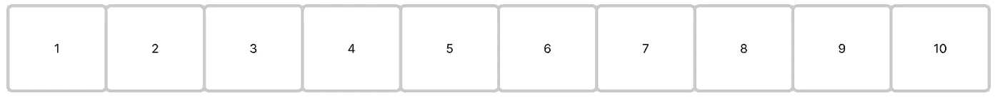
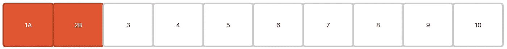
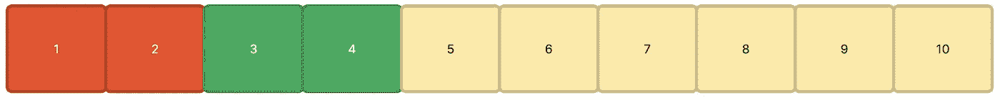
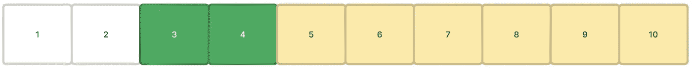
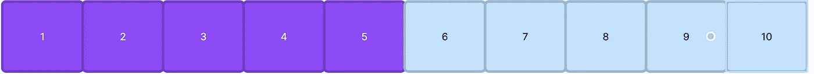
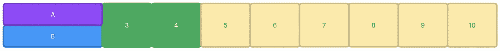

# 给你的 AB 测试实验调味

> 原文：[`towardsdatascience.com/seasoning-your-ab-testing-experiments-e585ab2ef2d2`](https://towardsdatascience.com/seasoning-your-ab-testing-experiments-e585ab2ef2d2)

## 盐如何帮助你的实验？

[](https://markeltsefon.medium.com/?source=post_page-----e585ab2ef2d2--------------------------------)[](https://towardsdatascience.com/?source=post_page-----e585ab2ef2d2--------------------------------) [Mark Eltsefon](https://markeltsefon.medium.com/?source=post_page-----e585ab2ef2d2--------------------------------)

·发表于[Towards Data Science](https://towardsdatascience.com/?source=post_page-----e585ab2ef2d2--------------------------------) ·阅读时间 5 分钟·2023 年 3 月 13 日

--


照片由[Manuel Asturias](https://unsplash.com/es/@manuel_asturias?utm_source=medium&utm_medium=referral)提供，来源于[Unsplash](https://unsplash.com/?utm_source=medium&utm_medium=referral)

AB 测试是衡量新特性实施效果的最著名方法之一。其主要思想是将你的流量（或仅部分流量）随机分成两个或更多组。然而，确保分组真正随机且无偏见是非常重要的，这样才能对结果有信心。这就是盐的作用所在。盐的目的是消除可能影响 AB 测试结果的偏差或可预测性来源。如果没有盐，可能会有一些用户因为其特征、行为或其他因素而更可能被分配到网页或应用程序的特定变体，从而导致结果偏差。

## 哈希和分组。

让我们深入探讨如何将用户分成不同的实验和组。为了更清楚地说明，最好使用一个示例。我们可以将整个流量分成 10 个桶。



10 个原始桶。图片由作者提供

在实际将用户分配到桶之前，让我们回顾一下哈希函数是什么。

哈希函数用于将输入数据转换为固定大小的唯一值，该值可以表示原始数据。这有什么好处？它可以将用户的一个独特方面，通常是用户 ID，转换为一个数字，我们可以利用这个数字将他们分配到其中一个桶中。

```py
user_id = "a4234jf3345" 

# Get the hash value of the user
hash_value = hash(user_id)

# Convert the hash value to a positive number
number = abs(hash_value)

# Print the number
print(number)

# Print the bucket that we assigned our user to 
print(number%10)
```

如果哈希值除以 10 的余数等于 1，则用户会被分配到桶 1，依此类推。

## 为什么我们需要盐？

首先，让我们讨论一下领域的概念。领域指的是你自己定义的产品的具体方面，例如购物篮、登录页面或结账页面。领域最重要的特点是，你可以自信地在不同领域之间重叠你的实验。这意味着在一个领域进行的任何实验（或大部分实验）不应对另一个领域产生任何变化。

使用领域盐帮助我们克服了两个挑战：

1.  如果没有领域盐，用户在所有实验中都会进入相同的桶，导致实验结果的偏差。

1.  我们受到流量的限制，但通过添加领域盐，我们可以根据领域的数量扩展我们可以进行的实验数量。对于每个领域，我们使用唯一的盐创建自己的桶。

在 Python 中，代码大致如下：

```py
user_id = "a3d45f6g6j7"

# Get the hash value of the user with the domain salt
hash_value = hash(user_id + 'Basket')

# Convert the hash value to a positive number
number = abs(hash_value)

# Print the number
print(number)
```

## 用户分配

为了将用户分配到实验中，特定的桶被分配给每个实验。在给定的例子中，实验 #1 被分配了桶 1 和 2，其中 A 代表对照组，B 代表处理组。我们假设我们在一个领域内进行实验。



图片由作者提供

在频繁实验过程中，大多数桶通常分配给正在进行的实验。



红色 — #1 实验，绿色 — #2 实验，黄色 — #3 实验。图片由作者提供

然而，当我们的实验（#1 红色）结束后，会释放出一些可以分配给新实验的桶，这会发生什么呢？

假设现在 20% 的桶是空闲的（因为第一个实验已经结束），我们想要启动实验 #4。



图片由作者提供

我们是否可以简单地使用哈希和之前的领域盐？

答案是否定的，原因是**延续效应**。

**延续效应**发生在用户接受某种处理后，可能会影响他们在之后的行为。实质上，人们往往会记住过去的经历，这可能导致未来实验结果的偏差。为了解决这个问题，我们引入了一种新盐——**洗牌盐**，它对每个实验都是独特的。

现在，我们的桶分配代码变为如下。

```py
user_id = "a3d45f6g6j7"

# Get the hash value of the user with the domain and shuffle salts
hash_value = hash(user_id + 'Basket' + 'Experiment_with_basket')

# Convert the hash value to a positive number
number = abs(hash_value)

# Print the number of the bucket
print(number % 10)
```

## **洗牌盐**是如何工作的？

我们将前两个桶细分为 10 个各自的桶，并将用户分配到这些子桶中，以提供更高的实验细节。



细分前两个桶。图片由作者提供

图片中的图像使用紫色和蓝色分别区分实验的对照组和处理组。

现在，它如何融入更大的图景。



实验 #4 的启动。图片由作者提供

在我们需要少于 20%流量的情况下，我们将失去一定比例的用户。例如，如果我们需要 15%的整体流量，我们必须获得 2 桶，因为我们不能得到 1.5 桶。因此，我们最终会损失 5%的流量。

不幸的是，没有办法完全消除这种损失。

实际上，大多数公司使用这两种盐。然而，一些公司也可能使用额外的盐，例如专用盐（用于测试重大变化）或更细粒度的领域盐（用于测试特定国家的变化）。

# 结论

从头开始构建一个 AB 测试系统并不是最简单的任务，因为有许多细微之处人们往往忽略。然而，你不应害怕尝试，并且不要忘记使用盐。

愿偏见与你无关！
