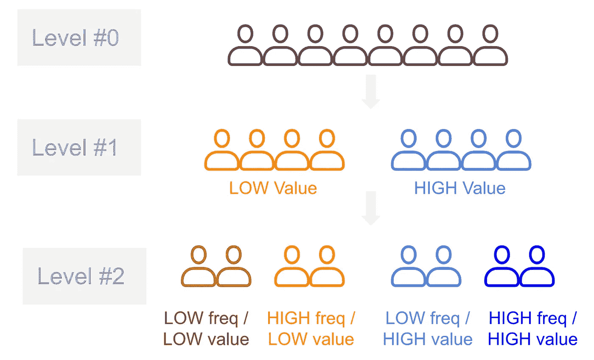

# 成功细分的秘密

> 原文：[`towardsdatascience.com/secret-sauce-of-successful-segmentation-74e0c48d84ba`](https://towardsdatascience.com/secret-sauce-of-successful-segmentation-74e0c48d84ba)

## 细分不仅仅是你工具箱中的另一项工具，而是你会经常使用的工具，以便了解你的客户。

 [Deepak Chopra | Talking Data Science](https://medium.com/@deepakchopra2911?source=post_page-----74e0c48d84ba--------------------------------)

·发布于[Towards Data Science](https://towardsdatascience.com/?source=post_page-----74e0c48d84ba--------------------------------) ·8 分钟阅读·2023 年 1 月 17 日

--

摄影作品来自[Kaitlyn Chow](https://unsplash.com/@kaitlynraeann?utm_source=medium&utm_medium=referral)，发布于[Unsplash](https://unsplash.com/?utm_source=medium&utm_medium=referral)

大数据分析赋予了组织基于客户的思维、情感和行为提供超个性化服务的能力。随着一对一定位的承诺的出现，细分看起来可能显得粗糙和过时。然而，当正确使用时，细分仍然代表着一种巨大的竞争优势潜力，是倾听客户、了解他们的需求和愿望的一种手段。

> 分割让你的**客户拥有强大的发言权**，在设定战略优先事项和做出战术决策时，这种声音可以在 KPIs、统计数据和趋势的喧嚣中被淹没。

接下来，我将讨论成功细分的要素。但在此之前，让我们快速了解一下什么是细分。

*请注意，我所指的是客户细分，因为这是细分的最常见用例，但相同的原则适用于任何实体的细分。*

# 细分…什么和为什么

在今天这个竞争激烈的世界中，**了解客户的需求和愿望是提供一种将来仍然受到青睐的服务（或产品）的关键**，从而保持你的组织运转。

对于所有类型的组织，其客户基础通常由若干个个人或个人组（*例如：*其他组织/集团等）组成——这个数量可以从几百个（*对于企业对企业服务组织*）到几百万个（*对于零售商/消费品公司*），有时甚至到数十亿个（*对于社交媒体平台*）。

> *从实际角度来看，了解客户基础的每一个方面一对一是不可行的*（……因为其规模巨大），*也不是一个好的策略将其视为一个统一的整体*（……因为实际上存在需要理解的差异）。

这导致我们需要一个**折衷方案，即在一对一和一刀切方法之间的中间地带**；即将客户基础分组为可管理的客户集——在每个集中的客户在关注的特征上较为相似，而不同集中的客户在同一关注特征上足够不同。

**→ 细分市场** 是将大量实体**‘分组’或‘细分’成较少数量的实体**；前提是**一个细分市场内的实体是同质的** *(彼此相似)*，而**不同细分市场之间的实体是异质的** *(彼此不同)*

# 细分市场……成功的 5 大法则！

# 1\. 实际需求——至少一个使用案例。

成功实施客户细分的第一个关键是清楚**其用途是什么，并确保它适合这个任务**。特别是在提出方案时，一个关键步骤是明确不同细分市场中的客户所重视的内容，这在我们将注意力集中在单一的、互不重叠的、完全包容的客户分类细分市场上时会更容易。

> 记住，通过创建一个细分市场，你是在将新的文献引入到整个组织中。

**必须有一个真正的“需求”；即一个准备好“使用案例”，企业将在你开发细分后准备好行动。**

> 组织必须避免“细分的死亡”；因此，首先请准备好一个使用案例。

每当你考虑构建一个“新”的细分市场以理解*XYZ*时，总是建议评估现有细分市场在多大程度上已经解释了*XYZ*的行为。

→ 如果现有细分市场在可接受的程度上解释了这些，那么你不需要构建“新”的细分市场，而是利用现有的细分市场来完成任务。

# 2\. 建立层级细分市场。

将每个客户描述为他们所属的细分市场的优势在于，这通常比将每个人描述为与平均客户具有相同特征更准确、更连贯。

***成本是为每个细分市场制定并执行不同策略所需的时间和精力。***

业务的不同部分可能有或没有时间规划和执行策略，或创建自己的细分。我们也可能不希望他们创建自己的细分 *(不要死于细分!!)*。

> 我们可以**通过提供对细分的额外深度来满足不同业务团队的更广泛需求**，通常通过将较大的细分拆分为较小的子细分来实现，尽可能做到合理。

→ 优势在于，不同团队仍然可以‘使用相同的语言’，而**更精细的策略结果可以汇总到大多数业务关注的顶层细分目标上**。

*例如*，在下图中，知道哪些客户是高价值客户与低价值客户（第#1 层次细分）确实很重要。然而，在‘高价值’群体中，进一步区分‘低频率、高价值’客户与‘高频率、高价值’客户（第#2 层次细分）也非常有价值。*对于进一步细分‘低价值’群体也是如此。*

figure 1: 一个简单的层次细分视图（图片来源于作者）

# 3\. 对客户基础的态度建模。

客户行为数据是通过技术手段在客户与产品和服务互动时捕获的数据。每一个细节，如点击、页面浏览、页面停留时间、加入/移除购物车、使用折扣、购买等都被记录下来。***虽然行为数据本身非常丰富，但它无法捕捉客户的“感受”，如愿望和挫折感。***

这种信息通常是**通过对客户进行问卷调查收集的数据来获取的**，这不仅可以深入了解客户对当前环境的感受，还可以了解他们希望改进的地方——这些信息可以共同转化为组织的战略细分。

尽管调查数据可以提供最丰富和全面的客户需求和愿望信息，但**收集大量和详细数据可能昂贵或完全不可行**。

> 所以，挑战来了——**我们是否应该以我们拥有回应的小样本客户为基础来获取洞察？**
> 
> 答案是……**不！**

我们可以将客户行为数据与调查数据结合起来，用于我们拥有这两部分信息的小样本客户。**我们可以使用机器学习技术基于行为产品/服务使用详细数据建模调查基础的细分。** 一旦准确度达到合理水平，基于调查的细分可以推广到整个客户基础。

*— 我们不需要仅仅依赖小样本；而是要基于从整个客户群体中获得的洞察来制定策略。*

# 4\. 为你的利益相关者实现可视化。

成功的细分会嵌入业务中，并且被关键决策者很好地理解。**他们需要理解它，认可它，并在正确的用例中依赖它。** 在总部办公室内，几乎没有与客户的互动，良好细分的一个关键好处是通过图像、视频、引用等故事帮助决策者更接近客户，而不是仅仅用数据。

> 细分是一种新语言，是你向业务利益相关者介绍的新文献。

客户细分能够影响企业做出更好决策的最强大方式之一是帮助讲述一个关于客户的难忘故事。通过“去平均化”客户，细分的集体平均行为开始感觉像是一个有自身特点的连贯个体的行为。

+   **细分的力量：** 用简单的术语向你的利益相关者解释你的细分如何区分客户，以及整体细分预测的客户行为。

+   **建立细分档案**：提供一个额外的层次，讲述一个单一战略客户细分的详细且引人入胜的故事。通过强调他们是谁，他们做什么以及如何/为什么去做，来使你的细分生动起来。

> *为了说明‘新’文献*，利用已经嵌入组织中的文献，使其具有相关性并且易于理解。将你的**‘新’细分与已知的客户属性、产品行为、人口统计或其他现有细分**进行叠加。

上述做法将有助于为你的利益相关者描绘‘细分’的图景；它将帮助他们通过访问产品和服务“可视化”这些细分。

# 5\. 追踪它。

有意义的细分必须导致基于细分需求和欲望的策略。**设定细分级别的目标是一个吸引人的方式，可以通过确保所有行动都以最初的客户目标为导向来推动客户变化。**

*当然，这些目标依赖于细分的构建方式，使其在时间上保持可比性。*

为了确保可追踪性，你必须确保细分的可刷新性。也就是说，

+   细分必须在一个合理的、预先决定的频率下进行刷新，以便定期考虑新客户或流失客户。

+   为确保公平比较，将客户分配到细分的规则必须保持不变或尽可能相似。

+   定义客户细分的数据应对广泛的人群具有可识别性和意义，以避免基于个人解释的任何偏见 *(即客户应该能够准确地‘自我识别’为特定细分)*

# 结论！

数据科学是“艺术”和“科学”的结合，这对于创建有意义且可操作的“细分”也同样适用。

构建成功的细分的关键可以总结为以下五条准则。

1.  提前创建你的使用案例，并构建“适合”它的细分。

1.  构建一个层级化的细分，以满足更多的使用案例。

1.  利用数据科学算法对客户群体的态度进行建模

1.  通过将其带入实际操作中，将其嵌入到你的利益相关者之间

1.  不断更新并跟踪细分，以监控进展。

# 连接、学习与成长..

如果你喜欢这篇文章并对类似内容感兴趣，可以在[***Medium***](https://medium.com/@deepakchopra2911)、[***LinkedIn***](https://www.linkedin.com/in/deepakchopra2911/)、[***与我一对一联系***](https://topmate.io/deepakchopra2911)、[***加入我的邮件列表***](https://medium.com/subscribe/@deepakchopra2911)上关注我，并且*(如果你还没有的话)*，成为[***Medium 家族的成员***](https://medium.com/@deepakchopra2911/membership)以获取数千篇有用的文章。*(如果你使用上面的链接，我将获得你会费的~50%）*

***.. 继续学习，继续成长！***
