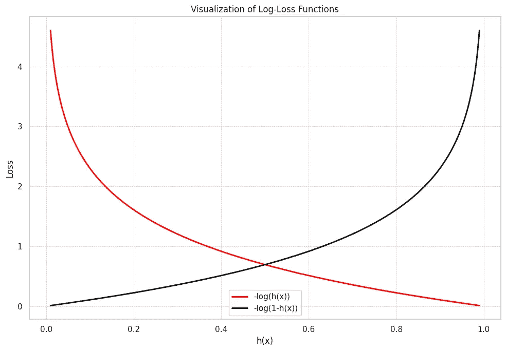

# 揭示对数损失的秘密

> 原文：[`towardsdatascience.com/secrets-of-log-loss-84c668f4024a?source=collection_archive---------7-----------------------#2023-11-23`](https://towardsdatascience.com/secrets-of-log-loss-84c668f4024a?source=collection_archive---------7-----------------------#2023-11-23)

## 为机器学习工程师提供数学、理论和直观理解

 [Joseph Robinson, Ph.D.](https://jvision.medium.com/?source=post_page-----84c668f4024a--------------------------------)

·

[关注](https://medium.com/m/signin?actionUrl=https%3A%2F%2Fmedium.com%2F_%2Fsubscribe%2Fuser%2F8049fa781539&operation=register&redirect=https%3A%2F%2Ftowardsdatascience.com%2Fsecrets-of-log-loss-84c668f4024a&user=Joseph+Robinson%2C+Ph.D.&userId=8049fa781539&source=post_page-8049fa781539----84c668f4024a---------------------post_header-----------) 发表在 [Towards Data Science](https://towardsdatascience.com/?source=post_page-----84c668f4024a--------------------------------) · 12 min read · 2023 年 11 月 23 日

--

让我们深入探讨对数损失，揭示这一关键机器学习目标的数学严谨性、理论基础和直观方面。本文将提供深入见解，帮助你更有效地优化模型，并理解对数损失在实际应用中的作用！

**对数损失曲线**：展示了预测概率与真实标签偏离时惩罚的增加。曲线越陡，错误的成本越高。图由作者生成。

# 目录

· 介绍

· 对数损失的基础

· 对数损失背后的数学

· 对数损失的理论基础

· 对数损失的直观理解

· 机器学习的实际应用

· 优化模型

· 常见陷阱及如何避免

· 结论

# 介绍

神秘的对数损失既迷人又关键。它处于机器学习的核心，蕴含着数学的优雅。此外，对数损失是概率分类器的核心；它以更强大、准确的模型为我们许下承诺。

但让我们不要沉溺于惊叹与幻想中。我们还有工作要做！
