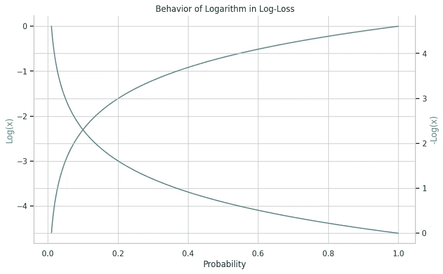
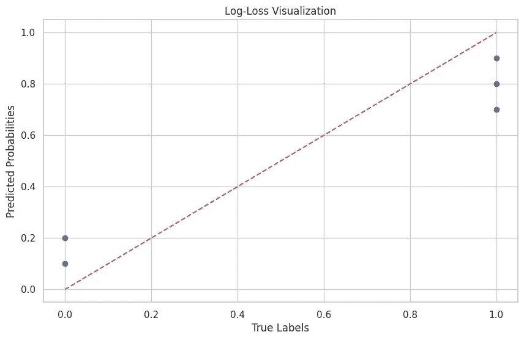

# 揭示对数损失的秘密

> 原文：[`towardsdatascience.com/secrets-of-log-loss-84c668f4024a`](https://towardsdatascience.com/secrets-of-log-loss-84c668f4024a)

## 数学、理论和直观理解，专为机器学习工程师准备

[](https://jvision.medium.com/?source=post_page-----84c668f4024a--------------------------------)[](https://towardsdatascience.com/?source=post_page-----84c668f4024a--------------------------------) [Joseph Robinson, Ph.D.](https://jvision.medium.com/?source=post_page-----84c668f4024a--------------------------------)

· 发表在 [Towards Data Science](https://towardsdatascience.com/?source=post_page-----84c668f4024a--------------------------------) · 12 分钟阅读 · 2023 年 11 月 23 日

--

让我们深入探讨对数损失，并揭开这个关键机器学习目标的神秘面纱：它的数学严谨性、理论基础和直观方面。这个博客将提供深入见解，以更有效地优化你的模型，并理解对数损失在现实应用中的意义！


**对数损失曲线**：展示了预测概率与真实标签偏离时惩罚的增加。曲线越陡峭，错误的代价越高。图表由作者生成。

# 目录

· 介绍

· 对数损失的基础

· 对数损失背后的数学

· 支撑对数损失的理论

· 对数损失的直观理解

· 机器学习的实际应用

· 优化模型

· 常见陷阱及其避免方法

· 结论

# 介绍

神秘的对数损失既引人入胜又至关重要。它处于机器学习的核心，沐浴在数学的优雅之中。此外，对数损失是概率分类器的核心；它以更强大、更准确的模型为承诺吸引我们。

但让我们不要在惊叹和惊奇中耽搁。我们还有工作要做！

为什么作为机器学习工程师的你应该深入研究对数损失这一数学和概念的漩涡？很简单。**对数损失是一把瑞士军刀。** 更深刻的理解使你能够超越简单的准确度，细致审视分类器性能的细微差别。因此，对数损失不仅仅是一个数字——它是你机器学习模型稳健性的试金石，让你可以以其他指标难以达到的细腻程度进行微调和优化。

我们在这个博客中的目标是深入理解对数损失的复杂层次。我们的行程包括数学推导的严谨性，解开深藏其间的理论基础，探索直观，找出抽象中的可关联性。我们将探讨对数损失的基础，分解其数学成分，并揭示它与信息理论的关系。通过现实世界的应用和案例研究，强调这个指标的实际力量。我们将讨论一些陷阱——那些容易让你绊倒的细微差别——以及如何优雅地避免它们。最后，我们将使用可视化来更好地理解这一数学构造的理论和实践。

准备好了吗？让我们深入探讨。

# 对数损失基础

让我们深入探讨：什么是对数损失，何时它是你机器学习冒险中的骑士？

## 定义与公式

对数损失，正式称为逻辑损失或对数损失，是一个用于分类模型的性能指标，模型输出概率：数值越小越好，完美模型的对数损失为零。它在需要概率结果而非硬分类的场景中很受欢迎。对数损失量化了你的预测与实际结果之间的偏差，比单纯的准确率更具说明性。

在数学上，二分类器的对数损失通常表示为：


在这里，*N* 是样本的数量，y_i 是第 i^{th} 样本的真实标签，p_i 是第 i^{th} 样本被预测为类别 1 的概率。

这是一个简单的 Python 代码片段，使用 NumPy 计算对数损失：

```py
import numpy as np
​
def calculate_log_loss(y_true, y_pred):
    return -np.mean(y_true * np.log(y_pred) + (1 - y_true) * np.log(1 - y_pred))
​
# Example usage
y_true = np.array([0, 1, 1, 0])
y_pred = np.array([0.1, 0.9, 0.8, 0.2])
log_loss = calculate_log_loss(y_true, y_pred)
print(f"Log Loss: {log_loss}")
```

输出：

```py
Log Loss: 0.164252033486018
```

## 何时使用对数损失

对数损失在需要细致解读结果的问题中特别有用。比如医学诊断，不仅仅是标签（即生病或健康），而是生病的概率，这具有巨大的重要性。或者推荐系统：你不仅仅是对喜欢或不喜欢进行分类，还要决定用户是否可能点击推荐的项目。

对数损失与其他指标不同，后者往往笼统却忽略了细微差别（例如准确率）。准确率例如统计正确预测的事件数量，但并未说明置信度。还有 F1 分数，它是精度和召回率的调和均值，适用于不平衡数据集。然而，它也无法窥见分类的分级置信度。

另一方面，对数损失惩罚错误的同时也惩罚模型对错误的置信度。它对概率的敏感性使它成为在需要更为精细评估的情况下的宝贵指标。


**对数损失景观**：该 3D 图揭示了对数损失函数的复杂性。观察当预测偏离真实标签时，对数损失如何显著增加，直观地强调了自信错误预测的更陡罚款。同时请注意，对数损失对假阳性和假阴性有不同的惩罚。图表由作者生成。

因此，对数损失不仅仅是一个指标；它是衡量模型表现的叙事工具，尤其在风险高、细节丰富时效果显著。

# 对数损失背后的数学

数学是宇宙的语言，也是对数损失之谜存在的基础。

## 公式的推导

在统计学领域，我们通常从似然性这一概念开始，它是衡量模型如何解释观察数据的指标。对于二分类问题，似然性*L*可以表达如下。


这个公式直观但计算起来繁琐。概率的乘积可能会导致下溢，特别是当*N*很大时。


**似然面可视化**：该 3D 图捕捉了成功次数与估计成功概率之间的关系。表面上的峰值表示较高的似然性，强调了在不同概率估计和观察到的成功中，我们对预测成功的信心如何变化。图表由作者生成。

引入自然对数；我们使用自然对数将似然转化为和，我们称之为对数似然：


这里是对数损失公式的核心：该对数似然的负平均：


在这里，我们使用负号将最大化问题（即最大化对数似然）转化为最小化问题——这是优化中更为熟悉的领域——这一概念在下图中得以阐释。



对数在对数损失中的表现：一个双轴图展示了对数和负对数的行为，这两个是对数损失中的关键组成部分。图表由作者生成。

## 数学深度探讨

*那么，为何使用对数？* 你可能会问。对数不仅仅是数学上的方便工具：对数函数是单调的，保持了概率之间的顺序。而且，它**放大了错误但自信预测的惩罚**。例如，如果你预测的概率为 0.01，而真实标签为 1，那么对数将增加你的损失，促使你重新思考你错误的自信。

对数损失**对异常值敏感且具有抗干扰性**，这是一个让人着迷的悖论。预测一个接近 0 或 1 的极端概率；如果你错了，对数损失会变得惩罚性十足，不留情面。另一方面，它比其他度量标准（例如，均方误差，对极端值给予不成比例的权重）更不容易受到异常值的影响。

这是一个快速的 Python 代码片段，演示了异常值的影响：

```py
# With an outlier
y_true_with_outlier = np.array([0, 1, 1, 0, 1])
y_pred_with_outlier = np.array([0.1, 0.9, 0.8, 0.2, 0.99])  # The 0.99 is the outlier
log_loss_with_outlier = calculate_log_loss(y_true_with_outlier, y_pred_with_outlier)
​
# Without the outlier
log_loss_without_outlier = calculate_log_loss(y_true, y_pred)
​
print(f"Log Loss with outlier: {log_loss_with_outlier}")
print(f"Log Loss without outlier: {log_loss_without_outlier}")
```

输出：

```py
Log Loss with outlier: 0.1334116939595147
Log Loss without outlier: 0.164252033486018
```

注意，带有异常值的对数损失与没有异常值的情况相比，并没有显著偏离，展示了它对极端值的相对抗干扰性。

对数损失的数学不仅仅是一系列抽象符号；它是一种叙事。它讲述了可能性和对数，平衡了信心和惩罚。

# 对数损失的理论基础

现在，让我们超越数学，深入理论领域。与方程式搏斗是一回事，理解其知识基础并问道：“这个度量标准为什么存在？”这又是另一回事。你准备好进入理论的深度探讨了吗？

## 概率基础

从本质上讲，对数损失与信息理论紧密相连——一个量化信息的领域。信息理论说，“告诉我一些我不知道的事情，你就给了我信息。”对数损失是惊讶的度量（即，[不确定性](https://en.wikipedia.org/wiki/Entropy_(information_theory))）。你的模型的预测越是偏离实际结果，人们会越“惊讶”（即传达的信息越多）。

因此，熵的概念量化了信息内容。对于一个概率为 *p* 的单一事件，熵 *H* 为：


更进一步，让我们看看交叉熵，它衡量真实分布 *y* 和预测分布 *p* 之间的距离。对于二分类，交叉熵为：


这张图展示了熵和交叉熵值如何随着真实概率 (p) 的变化而变化。熵随着概率接近 0 或 1 而减少，表示事件结果的确定性增加。交叉熵显示为一条稳定的线，强调它在测量两个概率分布之间差异中的作用。图表由作者生成。

于是，我们发现自己又回到了熟悉的对数损失，这是所有实例上交叉熵的平均值。


熵与对数损失的分布比较：直方图突出显示了这两种指标的频率分布，并叠加了表示其期望分布的曲线。熵显示了向高值集中，而对数损失则展示了更分散的分布，峰值在低值附近，体现了它们的固有差异以及数据在每种指标下的表现。图由作者生成。

在 Python 中，可以使用以下方式计算交叉熵：

```py
def calculate_cross_entropy(y_true, y_pred):
    return -np.mean(y_true * np.log(y_pred) + (1 - y_true) * np.log(1 - y_pred))
​
# Example usage
cross_entropy = calculate_cross_entropy(y_true, y_pred)
print(f"Cross Entropy: {cross_entropy}")
```

输出：

```py
Cross Entropy: 0.164252033486018
```

## 哲学方面

使用对数损失并非没有假设。它**假设你的预测是概率**，在 0 和 1 之间，并且**标签是真正的二元**。如果偏离这些条件，指标可能会误导你，产生难以解读的数字。

从本质上讲，对数损失衡量的是模型预测中的不确定性。它体现的哲学思想是校准概率。在理想的世界中，一个 90%信心的预测应该在 90%的时间内是正确的。因此，对数损失保持你的模型诚实，惩罚过于自信的错误答案和过于不自信的正确答案。


通过了解对数损失敏感的区域及曲线的性质，机器学习工程师可以更好地理解模型在实际环境中的表现。**主要曲线（蓝色实线）**：显示对数损失如何随正类的真实概率变化。**完美校准曲线（红色虚线）**：一个假设的线条，表示完美校准模型的对数损失应有的样子。**黄色阴影区域**：突出显示对数损失函数对真实概率变化的敏感性。在这个区域内的微小变化会导致对数损失的显著波动。**注释和文本**：提供了额外的见解，指出曲线上的特定点，使理解对数损失行为更加容易。图由作者生成。

# 对数损失的直观理解

是时候摆脱形式主义的束缚，以全新的视角探索对数损失的领域了。

## 类比与现实世界的例子

将对数损失视为谎言的代价。假设你在赛马中下注。你对某一结果赋予的概率越高，你如果判断错误损失的就越大。那如果是一个轻微的谎言，你本来就不太确定呢？相反，损失较少。如果是一个极大的谎言，而你非常有信心，那么损失就更大了！

回到推荐系统的应用中，使用对数损失作为用户的烦恼程度。以高度确定性推荐一部鲜有人观看的电影，你会让用户感到烦恼；若推荐正确，你则是英雄。在医疗保健中，考虑一下诊断测试。以低概率预测患者患有某种疾病，可能会导致严重后果。

这里是一个模仿基本医疗诊断模型的 Python 示例：

```py
# Assume '1' means the patient has the disease, and '0' means they don't.
y_true = np.array([0, 1, 1, 0, 1])
y_pred = np.array([0.1, 0.9, 0.8, 0.2, 0.7])  # Predicted probabilities from the model
​
log_loss_healthcare = calculate_log_loss(y_true, y_pred)
print(f"Healthcare Log-Loss: {log_loss_healthcare}")
```

输出：

```py
Healthcare Log-Loss: 0.20273661557656092
```

## 视觉化对数损失

可视化对数损失的最有效方法之一是通过绘制真实标签与预测概率的图表。当你偏离理想的对角线（预测概率与真实标签匹配的地方）时，你的对数损失会增加，直观地显示出模型的缺陷。在这个图表上，完美的模型将是一条从左下角到右上角的直对角线。



**剖析对数损失：** 虚线完美地匹配真实标签和预测概率。蓝点突出了实际预测与这一理想之间的偏差，说明了对数损失的概念，其中离线距离越大表示预测误差越高。图表由作者生成。

# 机器学习的实际影响

现在是时候将理论付诸实践了。我们已经穿越了数学领域，涉足了直观的湖泊。那么实际的土壤如何？对数损失的理解如何为机器学习项目的花园施肥？

# 优化模型

***如何通过最小化对数损失来获得更强健的模型***

让我们切入正题。最小化对数损失是一个模型校准的过程。把它看作是调音：你越接近完美音符（即真实标签），你的表现就越好。当你最小化对数损失时，你是在告诉你的模型对真实结果“惊讶”得更少，从而做出更准确、可靠的预测。

***优化的技术和策略***

现在，你如何给这个植物浇水？有很多方法：梯度下降法、超参数调整、集成技术等。一种广泛使用的方法是结合交叉验证的网格搜索。

```py
from sklearn.model_selection import GridSearchCV
from sklearn.linear_model import LogisticRegression
​
params = {'C': [0.1, 1, 10], 'solver': ['liblinear', 'lbfgs']}
grid_search = GridSearchCV(LogisticRegression(), params, scoring='neg_log_loss', cv=5)
grid_search.fit(X_train, y_train)
​
print(f"Best Parameters: {grid_search.best_params_}")
```

通过微调这些拨轮，你可以优化对数损失，从而创建一个更强健的模型。

## 案例研究

对数损失优化的一个突破性应用可以在医疗行业找到，特别是在早期癌症检测中。通过降低对数损失，模型能更好地发现癌细胞，这对于早期开始治疗至关重要。

另一个案例来自金融领域，信用评分模型已经通过使用对数损失作为性能指标进行了微调。结果？更准确的风险评估和更聪明的借贷决策。

所以，我们现在站在理论与实践结合的沃土上。对数损失不仅仅是一个数学抽象或知识辩论的主题；它是一个强大、可操作的杠杆，可以将机器学习项目的轨迹从普通转向非凡。

# 常见陷阱及如何避免它们

## 数值稳定性

数值稳定性——或缺乏稳定性——是许多人跌入的陷阱。在计算概率的对数时，将那个数字不断推向零会导致数值不稳定，从而在计算中引发混乱。

为了缓解这个问题，通常会对预测的概率应用一个小的 epsilon ϵ：


这个图表全面展示了 epsilon 值如何影响对数损失计算的稳定性，这一点在处理接近 0 或 1 的概率时尤为重要。图表由作者生成。

你可以这样修改一个 Python 对数损失函数：

```py
def calculate_stable_log_loss(y_true, y_pred, epsilon=1e-15):
    y_pred = np.clip(y_pred, epsilon, 1 - epsilon)
    return -np.mean(y_true * np.log(y_pred) + (1 - y_true) * np.log(1 - y_pred))
​
# Example usage
log_loss_stable = calculate_stable_log_loss(y_true, y_pred)
print(f"Stable Log-Loss: {log_loss_stable}")
```

输出：

```py
Stable Log-Loss: 0.20273661557656092
```

## 什么时候不使用对数损失

现在，即使是最锋利的刀子也不适用于每个任务。对数损失也是如此。在类别不平衡严重或假阳性和假阴性的成本差异很大的分类问题中，像 F1-score、精度或召回率这样的指标可能更适合。


另一个有价值的角度是对比平衡数据集与不平衡数据集中的对数损失变化。这是一个关键洞察，尤其是对处理常见类别不平衡的实际问题的机器学习工程师来说。在这些直方图中： 平衡数据集的对数损失分布：第一个图展示了类别平衡时对数损失值的分布。值倾向于分布在更广的范围内，反映出模型的不同确定性水平。不平衡数据集的对数损失分布：第二个图展示了不平衡数据集中对数损失值的分布。注意范围通常较窄，反映出由于不平衡，模型可能对其预测过于自信。理解平衡和不平衡数据集中对数损失的细微差别可以帮助机器学习工程师更有效地调整模型评估和调整策略。图表由作者生成。

另一种情况？对于具有两个以上标签的多类别问题，虽然可以将对数损失推广到这些情境中，但通常需要更加直接和易于解释。在这些情况下，像分类交叉熵或简单准确率这样的指标可能更有效。

# 结论

在这里，我们站在对数损失复杂领域智力之旅的顶峰。掌握了理论和实践智慧后，我们可以重温我们所开辟的路径。让我们回顾一下。

理解对数损失就像掌握调节复杂仪器的艺术。它让你具备了调整概率模型的能力，生成可靠且易于解释的预测。在数据时代，模型影响着从医疗保健到金融的方方面面，这种掌握不仅是美好之事，而是必需的。

知识在应用时最为有益。是时候卷起袖子，把手深入你项目的肥沃土壤中了。调整超参数，尝试不同的优化技术，不要畏惧采取计算过的风险。在实验的熔炉中，理论的金属被锻造成应用的利剑。

当我们结束这个博客时，我相信对更深层次理解的追求不会止步于此。如果知识的追求不是一段无尽的旅程，那它是什么呢？你是否将带着这份新获得的智慧，勇敢迈向你的项目？地平线在召唤。

# 联系

想要联系？关注罗宾逊博士的[LinkedIn](https://www.linkedin.com/in/jrobby/)、[Twitter](https://twitter.com/jrobvision)、[Facebook](https://www.facebook.com/joe.robinson.39750)和[Instagram](https://www.instagram.com/doctor__jjj/)。访问我的主页，获取论文、博客、邮件注册及更多内容！

[](https://www.jrobs-vision.com/?source=post_page-----84c668f4024a--------------------------------) [## 主页 | 乔·罗宾逊的网站 | 研究工程师 | 企业家

### 罗宾逊博士在计算机视觉、模式识别、MM 和多模态方面有超过 35 篇论文。曾在各个行业工作过……

www.jrobs-vision.com](https://www.jrobs-vision.com/?source=post_page-----84c668f4024a--------------------------------)
