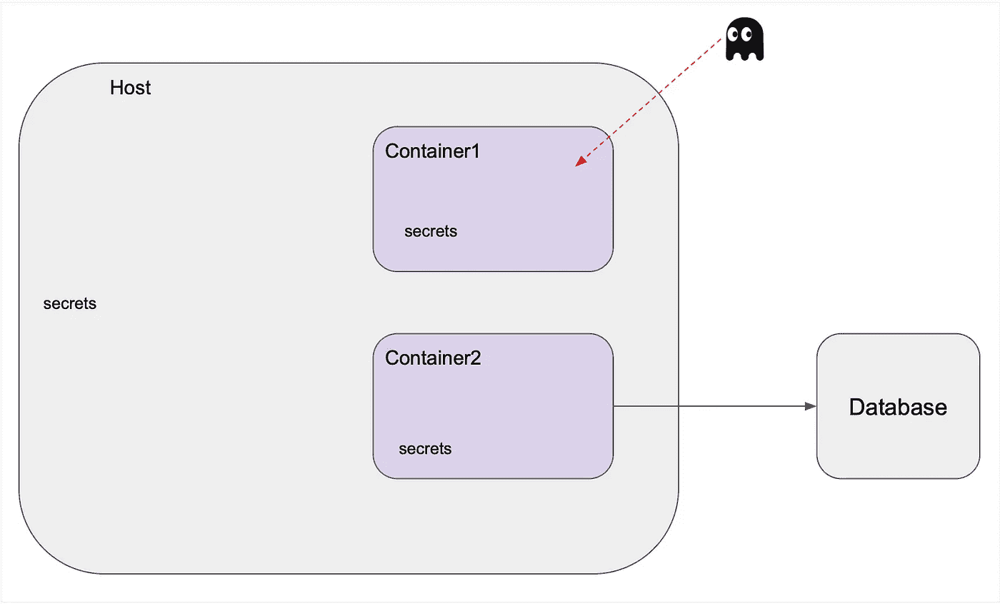

# 保护你的容器化模型和工作负载

> 原文：[`towardsdatascience.com/securing-your-containerised-models-and-workloads-3bff4d90a07b?source=collection_archive---------5-----------------------#2023-10-24`](https://towardsdatascience.com/securing-your-containerised-models-and-workloads-3bff4d90a07b?source=collection_archive---------5-----------------------#2023-10-24)

## 切换到非 root 用户！

[](https://medium.com/@teosiyang?source=post_page-----3bff4d90a07b--------------------------------)[](https://towardsdatascience.com/?source=post_page-----3bff4d90a07b--------------------------------) [Jake Teo](https://medium.com/@teosiyang?source=post_page-----3bff4d90a07b--------------------------------)

·

[关注](https://medium.com/m/signin?actionUrl=https%3A%2F%2Fmedium.com%2F_%2Fsubscribe%2Fuser%2F52b0d82d5bf5&operation=register&redirect=https%3A%2F%2Ftowardsdatascience.com%2Fsecuring-your-containerised-models-and-workloads-3bff4d90a07b&user=Jake+Teo&userId=52b0d82d5bf5&source=post_page-52b0d82d5bf5----3bff4d90a07b---------------------post_header-----------) 发表在 [Towards Data Science](https://towardsdatascience.com/?source=post_page-----3bff4d90a07b--------------------------------) ·8 分钟阅读·2023 年 10 月 24 日[](https://medium.com/m/signin?actionUrl=https%3A%2F%2Fmedium.com%2F_%2Fvote%2Ftowards-data-science%2F3bff4d90a07b&operation=register&redirect=https%3A%2F%2Ftowardsdatascience.com%2Fsecuring-your-containerised-models-and-workloads-3bff4d90a07b&user=Jake+Teo&userId=52b0d82d5bf5&source=-----3bff4d90a07b---------------------clap_footer-----------)

--

[](https://medium.com/m/signin?actionUrl=https%3A%2F%2Fmedium.com%2F_%2Fbookmark%2Fp%2F3bff4d90a07b&operation=register&redirect=https%3A%2F%2Ftowardsdatascience.com%2Fsecuring-your-containerised-models-and-workloads-3bff4d90a07b&source=-----3bff4d90a07b---------------------bookmark_footer-----------)

容器化现在是*事实上的*应用部署方式，其中 Docker 是推动其普及的前沿软件。随着其受欢迎程度的提升，也带来了更多的攻击风险[1]。因此，确保我们的 Docker 应用程序安全将大有裨益。做到这一点的最基本方法是确保在容器内设置非 root 用户。

```py
CONTENTS
========

Why use non-root?

What you can & cannot do as a default non-root user

The Four Scenarios
  1) Serve a model from host (Read Only)
  2) Run data processing pipelines (Write within Container)
  3) Libraries automatically writing files (Write within Container)
  4) Save trained models (Write to Host)

Summary
```

# 为什么使用非 root 用户？

或者说，为什么不使用 root 用户呢？让我们以下面的虚拟架构为例。



一个黑客进入一个具有 root 访问权限的容器。图片由作者提供

安全通常被视为多层次的方法。如果攻击者设法进入容器，那么作为用户所拥有的权限将是第一层防御。如果容器用户被赋予了 root 访问权限，攻击者将可以完全控制容器中的一切。由于这种广泛的访问权限，它还可以利用任何潜在的漏洞并使用…
