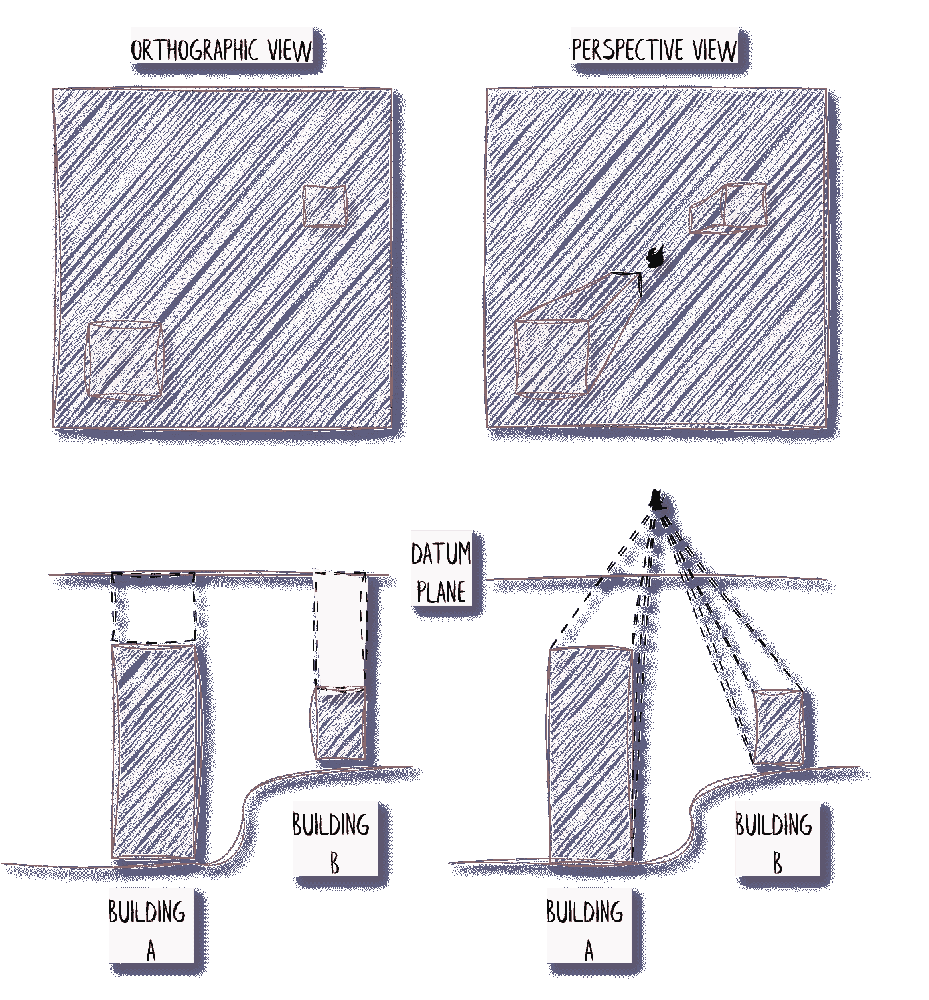
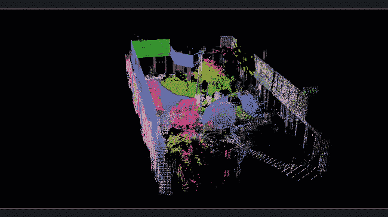

# Segment Anything 3D for Point Clouds: 完整指南 (SAM 3D)

> 原文：[`towardsdatascience.com/segment-anything-3d-for-point-clouds-complete-guide-sam-3d-80c06be99a18`](https://towardsdatascience.com/segment-anything-3d-for-point-clouds-complete-guide-sam-3d-80c06be99a18)

## 3D Python

## 如何利用 SAM 和 Python 构建 3D 点云的语义分割应用程序。附加内容：投影和 3D 点与 2D 像素之间关系的代码。

[](https://medium.com/@florentpoux?source=post_page-----80c06be99a18--------------------------------)[](https://towardsdatascience.com/?source=post_page-----80c06be99a18--------------------------------) [Florent Poux, Ph.D.](https://medium.com/@florentpoux?source=post_page-----80c06be99a18--------------------------------)

·发表于 [Towards Data Science](https://towardsdatascience.com/?source=post_page-----80c06be99a18--------------------------------) ·阅读时间 27 分钟·2023 年 12 月 13 日

--


针对 3D 环境的 Segment Anything 模型。我们将使用 3D 点云数据集检测室内空间的物体。特别鸣谢 [Mimatelier](https://linktr.ee/mimatelier)，这位才华横溢的插画师创作了这张图片。

科技的飞跃真是疯狂，特别是看到人工智能（AI）应用于 3D 挑战时。能够利用最新的前沿研究来进行高级 3D 应用是非常令人振奋的。尤其是在将人类级别的推理能力带入计算机时，明确从我们观察到的 3D 实体中提取出正式化的意义显得尤为重要。

> 在本教程中，我们旨在将令人惊叹的人工智能进展与利用 3D 点云的 3D 应用程序结合起来。— *🐲* **Florent & Ville**

这不是一件容易的事，但一旦掌握，3D 点云与深度学习的融合将开辟对我们视觉世界的新维度的理解和解释。


人工智能与 3D 点云。© [F. Poux](https://learngeodata.eu/)

在这些进展中，Segment Anything 模型是最近的创新灯塔，尤其是在无需监督的全自动化方面。


我们用于 3D 数据的 Segment Anything 模型架构。它包括一个图像编码器、图像嵌入以及一些预处理操作，最后传递给解码器和提示编码器，输出结果为掩模。© [F. Poux](https://learngeodata.eu/)

在这份**终极指南**中，我们将开始一个实际的旅程，从模型的诞生到实际分割应用。但这里的目标是什么？

# 任务 🥷

好了，任务简报时间到了！你现在是你国家特种部队的多类成员，你必须在不被发现的情况下找到隐藏在特定建筑物中的危险材料（这里是 ITC 大楼）。

利用你出色的互联网黑客技能，你成功找到了你感兴趣的建筑部分的 3D 扫描。你现在需要快速找到定义你危险材料回收队的路径的方法。之后，队伍可以在不被察觉的情况下进行材料回收，你也就成功拯救了世界！

经过仔细研究并利用你的各种技能，你开发了一个 3D 数据处理工作流程，其中包括设置 3D Python 代码环境，通过 Segment Anything 模型处理 3D 点云，以突出场景的组成，如下所示。


Segment Anything 3D 的工作流程。我们有五个主要步骤（3D 项目设置、Segment Anything 模型、3D 点云投影、无监督分割和定性分析），并在下图中进一步细化。© [F. Poux](https://learngeodata.eu/)

这将允许你生成一个 3D 语义地图，在队伍到达现场之前的九十分钟内，能够准确定位材料的位置。你准备好了吗？

🎵**读者注意**: 这个实践指南是* [***UTWENTE***](https://www.itc.nl/) *与合著者***F. Poux*** *和***V. Lehtola*** *的联合工作的一部分。我们感谢来自数字双胞胎* [*@ITC*](http://twitter.com/ITC) *项目的资助，该项目由特温特大学 ITC 学院授予。*

# 1\. 3D 项目设置

在我们深入探讨 Segment Anything 模型的奇迹之前，建立一个稳固的基础至关重要。设置适当的环境可以确保我们在整个过程中顺利进行，从而实现无缝的实验和探索。

在这个阶段，我们要确保我们的编码环境设置正确，并且具有强大的库。准备好了吗？

🤠 **Ville**: *这是在行动开始之前。如果你是从零开始做这件事，比如可能需要更新 CUDA 驱动程序，请单独预留一个或两个小时。你将下载几 GB 的内容。*


3D 项目设置。我们首先设置环境，然后附加基础库、深度学习库和 IDE 设置。© [F. Poux](https://learngeodata.eu/)

## 1.1\. 3D 代码环境设置

现在是时候动手了！我们的目标是使用 Segment Anything Model 对 3D 点云进行语义分割。这绝非易事！所以，首先的反应是查看 Segment Anything 的依赖项：[访问 SAM Github](https://github.com/facebookresearch/segment-anything)。

从那里，我们检查包的必要前提条件：


Segment Anything 中突出的依赖项。

🦊 **Florent**：*无论何时处理深度学习库或深度学习的新研究代码，都必须检查依赖项和安装建议。这将极大地影响实验的后续进展和复制所需的时间。*

如你所见，我们需要使用以下库版本：

```py
python ≥ 3.8
pytorch ≥ 1.7
torchvision ≥ 0.8
```

现在这一点搞定后，我们将生成一个虚拟环境以确保顺利进行！如果你想详细了解这一过程，建议你查看以下指南：

[](/3d-python-workflows-for-lidar-point-clouds-100ff40e4ff0?source=post_page-----80c06be99a18--------------------------------) ## 3D Python Workflows for LiDAR City Models: A Step-by-Step Guide

### 解锁 3D 城市建模应用程序的精简工作流的终极指南。教程涵盖了 Python…

towardsdatascience.com

为了不让你感到无助，下面是另一种快速轻量级的设置策略，使用 [Miniconda](https://docs.conda.io/projects/miniconda/en/latest/miniconda-install.html)。

💡 **注意**：*Miniconda 是一个免费的 Conda 最小安装程序。它是 Anaconda 的“微型”版本，仅包含最少的依赖项。这些包括 Conda 包管理器、一个 Python 版本、它们所依赖的包以及其他有价值的包如 pip 和 zlib。这使得我们可以以轻量的方式只安装我们需要的东西。*

🤠**Ville***：虚拟环境的酷炫之处在于，你可以将其导出并在强大的 Linux 计算机和超级集群上直接运行你的代码！这对于训练网络非常有用！*

在从 [这里](https://docs.conda.io/projects/miniconda/en/latest/miniconda-other-installer-links.html) 下载适合你操作系统的 Miniconda 版本后（建议选择 Python 3.9 或 3.10 版本以确保与包的兼容性），你可以按照安装过程中的各种步骤进行安装。


miniconda 安装程序窗口。© [F. Poux](https://learngeodata.eu/)

就这样！你现在已经完成了最简单的 Python 安装，使用轻量级的 miniconda 使得隔离受控的虚拟环境变得非常容易。在继续下一步之前，我们启动 miniconda 及其命令行访问：


在 Windows 中，只需搜索“miniconda”即可找到

一旦进入 Anaconda 提示符，我们按照下面显示的简单四步过程进行操作。


设置 Python 环境以使用 3D Segment Anything Model 的工作流程。© [F. Poux](https://learngeodata.eu/)

1.  要创建新环境，我们输入：`conda create -n GEOSAM python=3.10`

1.  切换到新创建的环境，我们输入：`conda activate GEOSAM`

1.  要检查 Python 版本，输入 `python --version`，检查已安装的软件包：`conda list`。这应分别显示 Python 3.10 和基础库列表。

1.  在新环境中安装 pip，我们输入：`conda install pip`

就这些！我们现在准备安装必要的库以进行 SAM 的操作。

[## 3D 创新者通讯

### 每周提供实用内容、见解、代码和资源，掌握 3D 数据科学。我写关于点云、人工智能……

[learngeodata.eu](https://learngeodata.eu/3d-newsletter/?source=post_page-----80c06be99a18--------------------------------)

## 1.2\. 基础库


本教程中使用的基础库（Numpy、Matplotlib、Laspy）。© [F. Poux](https://learngeodata.eu/)

我们现在安装用于 SAM 的基础库：`NumPy`、`LasPy`、`OpenCV` 和 `Matplotlib`。`NumPy` 可能是最推荐的数值计算库，`OpenCV` 用于计算机视觉任务，`Laspy` 处理 LIDAR 数据，而 `Matplotlib` 是一个绘图和数据可视化库。

🦊 **Florent**：*这些库是任何 3D 项目的基础和坚实的基石。如果你想深入了解它们，我建议你去* [*这个教程*](https://medium.com/towards-data-science/how-to-automate-lidar-point-cloud-processing-with-python-a027454a536c) *，它探讨了其深奥的内容* 🪸。

要安装这些库，我们可以用一行代码通过 pip：

```py
pip install numpy matplotlib laspy opencv-python
```

很好；是时候设置深度学习库了！

## 1.2 深度学习库


深度学习库。

我们现在将着手安装深度学习库。当然，我们首先探索的是我迄今为止最喜欢的：Pytorch。自 2017 年推出以来，Pytorch 优先考虑其灵活性和可黑客性，其次是性能。因此，今天，使用 Pytorch 进行深度学习应用是绝佳的选择，如果你需要 (1) 高性能执行，(2) Pythonic 内部实现，以及 (3) 有价值任务的良好抽象。

🦊 **Florent**: *自 2017 年以来，硬件加速器（如 GPU）在计算任务中的速度提高了约 15 倍。你只能猜测接下来几年会发生什么。因此，必须关注灵活的库，它们可以快速适应，甚至对“内部”进行重构，如 Pytorch 所做的那样。*

🤠**Ville***: SAM 作者推荐使用 8GB 内存的 GPU。然而，我们提供了一些如何在内存较少的情况下进行教程的技巧。如果你收到‘MemoryError’或‘Out-of-bounds memory access’或‘Illegal memory access’消息，请使用这些技巧。我使用 6GB 内存成功运行了它。*

为了无忧地安装 Pytorch 的相关发行版，而不必为如何安装 CUDA（这并不简单）而烦恼，他们制作了一个简单的网页应用程序，生成代码以复制并粘贴到你的命令行中。为此，你可以访问这个 [Pytorch 入门页面](https://pytorch.org/get-started/locally/) 并选择最相关的安装方式，如下所示。


如何根据你的操作系统和配置安装 Pytorch。

💡 **注意**: *我们希望充分利用我们的 GPU。因此，重要的是要注意我们希望进行 CUDA 安装。但这只有在你写这篇文章时拥有 Nvidia GPU 时才可能。如果没有，你可能需要使用 CPU 或切换到像 Google Colab 这样的云计算服务。*

因此，我们的代码行如下：

```py
conda install pytorch torchvision torchaudio pytorch-cuda=11.7 -c pytorch -c nvidia
```

这行代码将触发必要元素的检索和安装，以便 Pytorch 可以顺利运行。


Pytorch 的安装。

我们要使用的第二个深度学习库是 Segment Anything。在 Pytorch 安装的同时，我们可以下载并安装“软件”，这将使我们更容易管理版本和访问在线库。这就是**Git**，可以在这里访问：[Git 官网](https://git-scm.com/download/win)。

你可以下载并安装 git，一旦安装完成，Pytorch 也应该在你的环境中顺利安装。因此，为了安装 segment-anything，我们可以写如下代码：

```py
pip install git+https://github.com/facebookresearch/segment-anything.git
```

这将再次需要一些时间，直到你看到如下消息。


安装 Pytorch 的 CLI 结果。

在这一阶段，我们已经安装了基础库以及深度学习库。在使用它们之前，让我们安装一个 IDE，以便一切顺利运行。

## 4\. 设置 IDE


Jupyter lab IDE 安装后的界面。

我们设置的最后一步是安装一个 IDE。我们仍在环境中的命令行界面下，输入：`pip install jupyterlab`，这将会在我们的环境中安装 jupyterlab。

要在指定的本地文件夹中使用它，我们可以首先为我们的项目创建一个父目录（我们称之为 `SAM`），该目录将包含一个 `CODE` 文件夹和一个 `DATA` 文件夹。完成后，在控制台中，我们通过写入 `cd C://COURSES/POUX/SAM` 来切换到创建的目录。

我们通过在控制台输入 `jupyter lab` 来从这个位置启动 jupyterlab，这将会在你的网页浏览器（Chrome、Firefox 或 Safari）中打开一个新的本地主机页面。

在 Jupyter 中，你可以创建一个笔记本 (.ipynb)，并在第一个单元格中写入导入语句，以使用所有已安装的软件包：

```py
# The Base libraries
import numpy as np
import matplotlib.pyplot as plt
import cv2
import laspy

# The Deep Learning libraries
import torch
from segment_anything import sam_model_registry
from segment_anything import SamAutomaticMaskGenerator
```

好的！我们已经准备好了一切。在开始编码模型的其他步骤之前，现在正是提取我们 3D 数据集的好时机。

## 5\. 3D 数据集整理

在之前的教程中，我们展示了多个 3D 数据集中的点云处理和网格化，其中一些使用了 AHN4 LiDAR 活动的航空 LiDAR。

[](/3d-deep-learning-python-tutorial-pointnet-data-preparation-90398f880c9f?source=post_page-----80c06be99a18--------------------------------) ## 3D 深度学习 Python 教程：PointNet 数据准备

### 终极 Python 指南，用于结构化大型 LiDAR 点云，以训练 3D 深度学习语义分割……

towardsdatascience.com

这次，我们将使用一个使用地面激光扫描仪收集的数据集：2023 年乌特勒支大学 ITC 的新建筑，如下所示。它包含一个室内绿色区域，内有精美的复杂树叶，分割后可以进行评估。


ITC UTwente 新建筑的 3D 点云，包括其室内“丛林”。© [F. Poux](https://learngeodata.eu/)

你可以从这里下载数据： [指南数据集（Google Drive）](https://drive.google.com/drive/folders/1pIaP-vJAWh8cFtk9zQ3poxcR5DuEIkmt?usp=sharing)，并将其放入你保存数据集的文件夹中（在我的例子中是“DATA”）。

在这个过程中阶段，我们有一个良好的编码设置，所有必要的库都在一个轻量级、隔离的 GEOSAM conda 环境中。

🦊 **Florent**: 到目前为止做得很好！如果你急于运行一些测试以检查 Pytorch 是否正常工作，即 CUDA 是否被识别，你可以写下以下代码行：

```py
import torch
print('CUDA available -> ', torch.cuda.is_available())
print('CUDA GPU number -> ', torch.cuda.device_count())
print('GPU -> ', torch.cuda.get_device_name())
```


上述打印结果的配置。

现在是时候对数据进行分割了！

[](https://learngeodata.eu/3d-newsletter/?source=post_page-----80c06be99a18--------------------------------) [## 3D 创新者通讯

### 每周实用内容、见解、代码和资源，以掌握 3D 数据科学。我写关于点云、人工智能等内容……

[learngeodata.eu](https://learngeodata.eu/3d-newsletter/?source=post_page-----80c06be99a18--------------------------------)

# 2\. 设置 Segment Anything 模型

我们的小冒险的核心是 Segment Anything Model，这是一种强大的创作，具有极好的 3D 点云语义分割潜力。凭借其创新的架构和训练过程，该模型是室内应用测试的理想候选者。让我们先来了解一下其核心概念。

## 2.1\. Segment Anything 基础知识

MetaAI 已深入探讨自然语言处理（NLP）和计算机视觉的迷人领域，其 Segment Anything Model 使 **零-shot** 和 **少-shot 学习** 在新数据集和任务上成为可能，使用基础模型。

🦊 **Florent**: *好吧，我承认有很多脏话。为了清晰起见，这里是我对每个复杂术语的总结尝试。零-shot 学习指的是在未见过某物的情况下识别它（零次见过）。类似地，少-shot 学习使用有限数量的标记示例来处理每个新类别，目标是根据这些少量的标记数据进行预测。*

🤠**Ville***: 此外，所谓的* ***基础模型*** *是一个在大量数据上训练的模型。它如此庞大，可以适应来自不同场景的各种任务。*

让我们为你拆解一下：

总体而言，SAM “AI” 算法可以显著减少进行图像分割所需的人力。为此，你需要向模型提供前景/背景点、粗略的框或掩码、一些文本或任何其他指示你想要在图像中分割的输入。Meta AI 团队已训练 Segment Anything Model 以生成合适的分割掩码。这个掩码是模型的输出，应该是一个适合划定提示可能指向的事物的掩码。例如，如果你在房子屋顶上标出一个点，输出应该正确识别你是指屋顶还是房子。


Segment Anything Model (SAM) 是如何工作的？解释分割提示以生成有效的掩码（以房屋为例）。© [F. Poux](https://learngeodata.eu/)

该分割任务可以用于模型预训练，并指导解决各种下游分割问题。

从技术角度来看，我们所称的图像编码器为每张图像创建了一个独特的嵌入（表示），而一个轻量级的编码器迅速将任何查询转换为嵌入向量。这两个数据源通过一个（轻量级的）掩码解码器合并，以预测分割掩码，如下所示。


Segment Anything Model 的工作流程图。图像经过图像编码器处理。然后它被嵌入，最后在使用提示和提示编码器后合并，以生成我们 3D 点云的最终掩码。© [F. Poux](https://learngeodata.eu/)

这种有效的架构，加上大规模的训练阶段，使 Segment Anything Model 达到了四个里程碑：

+   **轻松对象分割 🔥**: 使用 SAM，用户可以通过简单选择要包括或排除的点来轻松分割对象。你还可以使用边界框作为模型的提示。

+   **处理不确定性 🔥**: SAM 能够处理对象分割中的不确定情况。它可以生成多个有效的掩码，这对于有效解决实际的分割挑战至关重要。

+   **自动对象检测与掩膜 🔥**: SAM 使得自动对象检测和掩膜变得轻而易举。它简化了这些任务，节省了你的时间和精力。

+   **实时交互 🔥**: 得益于预计算的图像嵌入，SAM 可以即时提供任何提示的分割掩膜。这意味着你可以与模型进行实时交互。

既然这些都解决了，你准备好使用它了吗？

## 2.1\. SAM 参数

SAM 模型可以通过三种不同的编码器加载：ViT-B、ViT-L 和 ViT-H。ViT-H 的结果优于 ViT-B，但与 ViT-L 相比仅有微小的提升。

```py
|     Encoder          |   #parameters    |     Speed      |   Quality    |
|----------------------|------------------|----------------|--------------|
|   ViT-B   (basic)    |       91M        |     Fastest    |   Low        |
|   ViT-L   (large)    |       308M       |     Fast       |   High       |
|   ViT-H   (huge)     |       636M       |     Slow       |   Highest    |
```

**🤠 Ville**: *为了帮助选择，我在 NVIDIA GeForce GTX 1650、6 Gb VRAM 和 Win11 上测试了 ViT-B。*

这三种编码器具有不同的参数数量，这为应用程序的调优提供了更多自由。ViT-B（最小）有 9100 万个参数，ViT-L 有 3.08 亿个参数，而 ViT-H（最大）有 6.36 亿个参数。

这种大小差异也会影响推断速度，因此这应有助于你为你的具体用例选择编码器。按照本指南，我们将使用重型武器：ViT-H，带有一个可以从[Github](https://github.com/facebookresearch/segment-anything#model-checkpoints)（2.4 Gb）下载的模型检查点，并将其放置在你的当前父文件夹中，例如。

在这里，我们可以定义两个变量，以使你的代码在之后稍微更灵活一些：

```py
MODEL = "../../MODELS/sam_vit_h_4b8939.pth"

#You can run the line below to test if you have the ability to leverage CUDA
torch.cuda.is_available()

#Choose between cpu or cuda training. For cpu, input 'cpu' instead 'cuda:0'
USED_D = torch.device('cuda:0')
```

从这里，我们可以用以下两行代码初始化我们的 SAM 模型：

```py
sam = sam_model_registry"vit_h"

#Cast your model to a specific device (cuda or cpu)
sam.to(device = USED_D)
```

一切都准备好了！也许最后一步，试试看它在你桌面上的随机图像上的表现如何？

## 2.2 在 2D 图像上的性能

让我们测试一下在随机图像上的效果是否如预期。我们对地理空间应用感兴趣，所以我去[Google Earth](https://earth.google.com/)并放大一个感兴趣的点：


选择来自 Biscarosse 的图像数据集。© [F. Poux](https://learngeodata.eu/)

🦊 **Florent**: *这个点有偏见，对吧？希望这能给你一些法国假期的感觉，你很自豪地经历了这段美妙的岁月，充满了激动人心的项目！*

从那里，我会截取一个感兴趣区域的屏幕截图：


一个来自 Biscarosse plage 区域的图像数据集。© [F. Poux](https://learngeodata.eu/)

然后我用 openCV 将图像加载到内存中：

```py
#When loading an image with openCV, it is in bgr by default
loaded_img = cv2.imread("../DATA/biscarosse.jpg")

#Now we get the R,G,B image
image_rgb = cv2.cvtColor(loaded_img, cv2.COLOR_BGR2RGB)
```

🦚 **注意**: *如你所见，默认情况下，OpenCV 通过切换到蓝色、绿色和红色通道（BGR）来加载图像，我们通过第二行将其排序为 RGB，并存储在* `image_rgb` *变量中。*

现在，我们可以用两行代码在图像上应用 SAM：

```py
mask_generator = SamAutomaticMaskGenerator(sam)
result = mask_generator.generate(image_rgb)
```

大约 6 秒钟后，这将返回一个填充了字典的列表，每个字典代表一个特定对象的自动提取掩膜，并附有其分数和元数据。详细查看时，结果是一个字典列表，每个`dict`包含以下信息：

+   `segmentation` : 这会生成形状为`(W, H)`（和`bool`类型）的掩膜，其中`W`（宽度）和`H`（高度）针对原始图像尺寸；

+   `area` : 这是以像素为单位的掩膜面积

+   `bbox` : 这是`xywh`格式的边界框检测

+   `predicted_iou` : 模型对掩膜质量的预测 IoU 指标。

+   `point_coords` : 这是用于生成掩膜的采样输入点的列表

+   `stability_score` : 稳定性得分是掩膜质量的附加衡量指标。查看论文获取更多细节 😉

+   `crop_box` : 这是用于生成该掩膜的 crop_box 坐标列表，格式为`xywh`（可能与边界框不同）

现在你对我们正在处理的内容有了更好的了解，要查看结果，我们可以用以下函数在图像上绘制掩膜：

```py
def sam_masks(anns):
    if len(anns) == 0:
        return
    sorted_anns = sorted(anns, key=(lambda x: x['area']), reverse=True)
    ax = plt.gca()
    ax.set_autoscale_on(False)
    c_mask=[]
    for ann in sorted_anns:
        m = ann['segmentation']
        img = np.ones((m.shape[0], m.shape[1], 3))
        color_mask = np.random.random((1, 3)).tolist()[0]
        for i in range(3):
            img[:,:,i] = color_mask[i]
        ax.imshow(np.dstack((img, m*0.8)))
        c_mask.append(img)
    return c_mask
```

🦊 **Florent**: *我承认，这有点直接。但在这个函数中，我会按掩膜面积对它们进行排序，以随机颜色和透明度参数在图像上绘制它们。*

🤠**Ville***: 内存错误可能会毁掉法国假期的氛围！记得使用 Google Colab 选项！如果重启不能解决问题且分配内存过高，以下代码可以清除 GPU 内存中的额外分配。用它来解决内存问题。*

```py
print('Mem allocated by other programs: ', torch.cuda.memory_allocated(), 'reserved:', torch.cuda.memory_reserved())
import os
os.environ["PYTORCH_CUDA_ALLOC_CONF"] = "max_split_size_mb:512"
import gc
gc.collect()
torch.cuda.empty_cache()

If the GPU memory is not freed enough, try rebooting your (Windows) computer.
ALSO, try using the following line if memory problems persist
mask_generator = SamAutomaticMaskGenerator(sam, points_per_batch=16)
```

*如果 GPU 内存未充分释放，请尝试重启你的（Windows）计算机。如果内存问题仍然存在，可以尝试使用以下行：* `mask_generator = SamAutomaticMaskGenerator(sam, points_per_batch=16)`

现在，要绘制和导出图像，我们写下以下内容：

```py
fig = plt.figure(figsize=(np.shape(image_rgb)[1]/72, np.shape(image_rgb)[0]/72))
fig.add_axes([0,0,1,1])
plt.imshow(image_rgb)
color_mask = sam_masks(result)
plt.axis('off')
plt.savefig("../test_result.jpg")
```

这导致：


在 Segment Anything Model 之前和之后。© [F. Poux](https://learngeodata.eu/)

因此，在这个阶段，我们已经有了令人兴奋的结果，SAM 工作得非常好！例如，你可以看到几乎所有的屋顶都是分段的一部分，三个泳池（两个蓝色和一个绿色）也是分段的一部分。因此，这可能是完全自动检测的起点

🦊 **Florent**: *根据你的计算机设置，绘制掩膜时可能会遇到内存错误。在这种情况下，加载一个更轻的 SAM 模型应该能解决你的问题。* 😉

既然我们已经有了一个有效的 SAM 设置，让我们将这些辛苦获得的知识应用于 3D 点云。

# 3\. 3D 点云到图像投影

为了理解复杂的 3D 世界，我们*深入探讨*点云投影的艺术。通过像正射和球面投影这样的技术，我们弥合了维度之间的差距，使我们能够在 2D 领域中可视化点云的复杂性，这正是 SAM 所需的输入。点云映射为这一投影过程增添了一层理解。

## 3.1 正射投影：平展维度，扩展洞察

让我们看看正射投影的变革性技术。此方法作为 3D 点云的多维复杂性与 2D 图像的可理解世界之间的绝佳桥梁。通过正射投影，我们“平展”维度，同时揭示了使用 SAM 进行分割的直接方法。

这个想法基本上是生成一个俯视视图平面，并生成一个不受单一视角限制的图像。你可以将正射投影视为将点云中的可见点（最高点）推送到持有空图像的平面上，以填充所有必要的像素。你可以看到与透视视图的不同之处，如下所示。



解释正射视图和透视视图在 3D 投影中的区别。透视视图与一个单独的视点相关，这会扭曲维度。© [F. Poux](https://learngeodata.eu/)

为了完成这个过程，我们可以定义一个 3D 到 2D 的投影函数，它将点云的点及其颜色和所需分辨率作为输入，计算正射投影并从点云中返回正射图像。这将转化为以下内容：

```py
def cloud_to_image(pcd_np, resolution):
    minx = np.min(pcd_np[:, 0])
    maxx = np.max(pcd_np[:, 0])
    miny = np.min(pcd_np[:, 1])
    maxy = np.max(pcd_np[:, 1])
    width = int((maxx - minx) / resolution) + 1
    height = int((maxy - miny) / resolution) + 1
    image = np.zeros((height, width, 3), dtype=np.uint8)
    for point in pcd_np:
        x, y, *_ = point
        r, g, b = point[-3:]
        pixel_x = int((x - minx) / resolution)
        pixel_y = int((maxy - y) / resolution)
        image[pixel_y, pixel_x] = [r, g, b]
    return image
```

很好，现在是时候进行测试了，你同意吗？为此，让我们加载一个点云数据集，将其转换为 numpy 数组，应用这个函数，并导出这个点云的图像：

```py
#Reading the point cloud with laspy
pcd = laspy.read("../DATA/34FN2_18.las")

#Transforming the point cloud to Numpy
pcd_np = np.vstack((pcd.x, pcd.y, pcd.z, (pcd.red/65535*255).astype(int), (pcd.green/65535*255).astype(int), (pcd.blue/65535*255).astype(int))).transpose()

#Ortho-Projection
orthoimage = cloud_to_image(pcd_np, 1.5)

#Plotting and exporting
fig = plt.figure(figsize=(np.shape(orthoimage)[1]/72, np.shape(orthoimage)[0]/72))
fig.add_axes([0,0,1,1])
plt.imshow(orthoimage)
plt.axis('off')
plt.savefig("../DATA/34FN2_18_orthoimage.jpg")
```

这允许我们获得以下内容：


从 3D 点云到正射图像的工作流程。我们首先按照正射投影模式对点云进行投影，然后确保包括点到像素的映射用于反投影。© [F. Poux](https://learngeodata.eu/)

让我们继续球面投影

## 3.2 3D 点云球面投影

我们的旅程在遇到球面投影时变得非常有趣。这种技术提供了独特的视角，使我们能够通过“模拟”虚拟扫描站来可视化数据。为此，我们通过以下四个步骤进行： (1) 考虑 3D 点云， (2) 将这些点投影到球体上， (3) 定义一个几何体来检索像素， (4) “平展”这个几何体以生成图像。

**🤠 Ville**: *球面投影就像是在 3D 点云内部，拍摄你看到的 360 度照片*。


3D 点云球面投影工作流。我们获取 3D 点云，创建一个 3D 投影球体，定义映射平面，并生成等距圆柱投影。© [F. Poux](https://learngeodata.eu/)

为了实现 3D 投影到球面，我们希望获得如下所示的点。


如何将 3D 点云的点投影到球面。© [F. Poux](https://learngeodata.eu/)

然后，我们将根据几何形状（圆柱体）展开，以获得等距圆柱图像，如下所示。


如何从球面到等距圆柱图像。我们有一个投影机制，允许我们将像素“展开”到圆柱体上。© [F. Poux](https://learngeodata.eu/)

现在让我详细介绍允许实现这一点的功能：

```py
def generate_spherical_image(center_coordinates, point_cloud, colors, resolution_y=500):
    # Translate the point cloud by the negation of the center coordinates
    translated_points = point_cloud - center_coordinates

    # Convert 3D point cloud to spherical coordinates
    theta = np.arctan2(translated_points[:, 1], translated_points[:, 0])
    phi = np.arccos(translated_points[:, 2] / np.linalg.norm(translated_points, axis=1))

    # Map spherical coordinates to pixel coordinates
    x = (theta + np.pi) / (2 * np.pi) * (2 * resolution_y)
    y = phi / np.pi * resolution_y

     # Create the spherical image with RGB channels
    resolution_x = 2 * resolution_y
    image = np.zeros((resolution_y, resolution_x, 3), dtype=np.uint8)

    # Create the mapping between point cloud and image coordinates
    mapping = np.full((resolution_y, resolution_x), -1, dtype=int)

    # Assign points to the image pixels
    for i in range(len(translated_points)):
        ix = np.clip(int(x[i]), 0, resolution_x - 1)
        iy = np.clip(int(y[i]), 0, resolution_y - 1)
        if mapping[iy, ix] == -1 or np.linalg.norm(translated_points[i]) < np.linalg.norm(translated_points[mapping[iy, ix]]):
            mapping[iy, ix] = i
            image[iy, ix] = colors[i]
    return image
```

🌱 **Growing**：*消化这个功能是至关重要的。它看起来很简单，但在多个阶段有一些巧妙的技巧。例如，你对 3D 点云到球面坐标步骤有什么看法？映射的作用是什么？在将点分配给像素时，使用映射作为条件语句的意义何在？*

现在，为了使用这个方便的功能，我们首先加载并准备 ITC 室内点云：

```py
#Loading the las file from the disk
las = laspy.read("../DATA/ITC_BUILDING.las")

#Transforming to a numpy array
coords = np.vstack((las.x, las.y, las.z))
point_cloud = coords.transpose()

#Gathering the colors
r=(las.red/65535*255).astype(int)
g=(las.green/65535*255).astype(int)
b=(las.blue/65535*255).astype(int)
colors = np.vstack((r,g,b)).transpose()
```

准备好后，我们可以定义投影所需的参数。这些参数包括投影中心（基本上是我们希望虚拟扫描站的位置）和最终图像的分辨率（以像素表示，即图像的最小边）。

```py
resolution = 500

#Defining the position in the point cloud to generate a panorama
center_coordinates = [189, 60, 2]
```

最后，我们可以调用新的函数，绘制并将结果导出为图像。

```py
#Function Execution
spherical_image, mapping = generate_spherical_image(center_coordinates, point_cloud, colors, resolution)

#Plotting with matplotlib
fig = plt.figure(figsize=(np.shape(spherical_image)[1]/72, np.shape(spherical_image)[0]/72))
fig.add_axes([0,0,1,1])
plt.imshow(spherical_image)
plt.axis('off')

#Saving to the disk
plt.savefig("../DATA/ITC_BUILDING_spherical_projection.jpg")
```

所有这些过程会产生以下图像：


3D 点云通过投影转化为等距圆柱图像。© [F. Poux](https://learngeodata.eu/)

你觉得怎么样？你可以调整各种参数，如分辨率或投影中心，以确保在“无数据”像素和相关全景之间取得良好的平衡。

🦊 **Florent**：*你刚刚解锁了一项强大的新技能——将 3D 点云转换为等距圆柱图像。确实，它允许你在你认为有意义的地方生成虚拟扫描，并开启使用图像处理和深度学习技术处理图像的可能性。你还可以将提供的功能扩展到其他映射投影，以增加你的工具库。*

🤠**Ville**：*我几乎可以看到讲座大厅和我的办公室，荷兰的工作氛围！*

## 3.3 3D 点到像素的映射

我们将原始点数据转换为结构化的栅格表示，理清看似散乱的信息。点云映射是我们在 2D 投影中处理 3D 点云的指南针。好消息是：我们已经处理了这个映射。

确实，如果你仔细查看函数`generate_spherical_image`，你会发现我们返回了`mapping`变量并将其捕获到另一个变量中以便后续处理。这确保了我们可以拥有一致的 3D 点到像素的映射。

# 4\. 使用 SAM 的无监督分割

无监督分割以 Segment Anything 模型的形式出现。在非标记输出的情况下，我们通过 SAM 的分割架构，这属于聚类应用。这与大多数监督学习方法提供标记输出的方式相对，如下所示。


无监督学习和监督学习之间的区别。在无监督学习中，我们旨在定义一些相似的数据“点”组，而在监督学习中，我们旨在满足监督需求（通常通过提供标记数据）。© [F. Poux](https://learngeodata.eu/)

因此，像素预测的转移，加上无缝的点云导出，展示了革新物体检测和场景理解等应用的潜力。

## 4.1\. SAM 分割

要执行程序，我们可以重新执行我们用于测试 SAM 功能在 2D 图像上的代码片段，这些代码片段是：

```py
sam = sam_model_registry"vit_h"
sam.to(device = USED_D)

mask_generator = SamAutomaticMaskGenerator(sam)

temp_img = cv2.imread("../DATA/ITC_BUILDING_spherical_projection.jpg")
image_rgb = cv2.cvtColor(temp_img, cv2.COLOR_BGR2RGB)

t0 = time.time()
result = mask_generator.generate(image_rgb)
t1 = time.time()
```

然后，我们可以在图像上绘制结果

```py
fig = plt.figure(figsize=(np.shape(image_rgb)[1]/72, np.shape(image_rgb)[0]/72))
fig.add_axes([0,0,1,1])

plt.imshow(image_rgb)
color_mask = sam_masks(result)
plt.axis('off')
plt.savefig("../DATA/ITC_BUILDING_spherical_projection_segmented.jpg")
```

这将得到：


3D 点云投影上的 Segment Anything 模型的结果。© [F. Poux](https://learngeodata.eu/)

这看起来我们正在勾画出图像中的重要部分。让我们继续前进。

## 4.2\. 点预测转移

让我们用这张图像为点云上色。因此我们定义一个上色函数：

```py
def color_point_cloud(image_path, point_cloud, mapping):
    image = cv2.imread(image_path)
    h, w = image.shape[:2]
    modified_point_cloud = np.zeros((point_cloud.shape[0], point_cloud.shape[1]+3), dtype=np.float32)
    modified_point_cloud[:, :3] = point_cloud
    for iy in range(h):
        for ix in range(w):
            point_index = mapping[iy, ix]
            if point_index != -1:
                color = image[iy, ix]
                modified_point_cloud[point_index, 3:] = color
    return modified_point_cloud
```

这意味着要为我们的点云上色，我们可以使用以下代码行调用我们的新函数：

```py
modified_point_cloud = color_point_cloud(image_path, point_cloud, mapping)
```

这一行返回一个 numpy 数组，该数组保存了点云。

现在是 3D 点云导出的时候了！

## 4.3\. 点云导出

要导出点云，你可以使用 numpy 或 laspy 直接提取一个.las 文件。我们将采用第二种解决方案：

```py
def export_point_cloud(cloud_path, modified_point_cloud):
    # 1\. Create a new header
    header = laspy.LasHeader(point_format=3, version="1.2")
    header.add_extra_dim(laspy.ExtraBytesParams(name="random", type=np.int32))

    # 2\. Create a Las
    las_o = laspy.LasData(header)
    las_o.x = modified_point_cloud[:,0]
    las_o.y = modified_point_cloud[:,1]
    las_o.z = modified_point_cloud[:,2]
    las_o.red = modified_point_cloud[:,3]
    las_o.green = modified_point_cloud[:,4]
    las_o.blue = modified_point_cloud[:,5]
    las_o.write(cloud_path)

    print("Export succesful at: ", cloud_path)
    return
```

这样，我们可以导出我们的 modified_point_cloud 变量：

```py
export_point_cloud("../DATA/pcd_results.las", modified_point_cloud)
```

在这一阶段，我们成功地获取了各种来自 3D 点云投影过程的 2D 图像。我们对其应用了 SAM 算法，基于其预测对其上色，并导出了一个彩色点云。因此我们可以开始获取一些关于我们所得到的东西的见解。

🦊 **Florent**：*为了快速在 Python 之外分析结果，我建议使用 CloudCompare 开源软件。如果你想要一个清晰的使用指南，可以阅读下面的文章。*

[](/3d-deep-learning-python-tutorial-pointnet-data-preparation-90398f880c9f?source=post_page-----80c06be99a18--------------------------------) ## 3D 深度学习 Python 教程：PointNet 数据准备

### 《终极 Python 指南》用于构建大型 LiDAR 点云以训练 3D 深度学习语义分割…

[towardsdatascience.com

# 5. 定性分析与讨论

随着我们的旅程接近巅峰，现在是关注定性分析的时候了。特别地，我们不会进行定量分析，因为在这个阶段我们需要适当的标签。

🤠 **Ville**: 没有标签？你刚刚做的是零样本学习（砰！）或少样本学习（砰！砰！）。我们不能确定是哪种，因为我们不知道 SAM 的训练方式。因此对我们来说它有点像黑箱，但没关系。

我们仔细检查光栅和点云结果，得出的见解揭示了 SAM 的性能。同时，让我们保持脚踏实地，承认模型的局限性，同时展望未来。

## 5.1 光栅结果

SAM 在我们实施下的成果通过下述光栅结果得到了生动的展示。这些视觉效果作为画布，快速评估 SAM 的分割，帮助我们理解模型对场景的 2D 表示。


Segment Anything Model 在 3D 点云投影上的另一个结果。© [F. Poux](https://learngeodata.eu/)

如你所见，即使在点分布不均和“黑区”下，SAM 仍能识别出点云的主要部分。具体而言，它可能突出了左侧的绿色区域，即危险材料所在的位置，以及为我们提取团队提供最直接路线的门窗！

## 5.2 点云结果

然而，正是在点云结果中，SAM 的真正能力得以显现。当我们在点云中穿梭时，SAM 的分割预测为经典的“点云混乱”带来了清晰度，展示了其在实际应用中的潜力。



使用 Segment Anything 3D 进行的 3D 点云无监督分割结果。我们看到构成场景的主要元素的明显区别。© [F. Poux](https://learngeodata.eu/)

如我们所见，我们可以直接链接到基础点，这真是极其棒！想想这能为你的应用程序解锁什么。一个拥有不到五个主要断点的 100%自动化分割过程？不错！

## 5.3. 局限性

但，我们的探险只有在承认过程中存在的粗糙点后才算完成。SAM，尽管令人印象深刻，也不例外地存在局限性。通过认识这些不足，我们为改进和成长铺平道路。

首先是所有“未见”的点仍然保持未标记（下图中的白点）。这可能会成为完整处理的一个限制，如果你使用基本模型或大模型，你会看到比使用巨大模型时更多的未标记点。


从中央视角 360°模拟扫描位置的第一次扫描中，未标记点与标记点的比例。 © [F. Poux](https://learngeodata.eu/)

此外，在这个阶段，我们使用了自动提示引擎，它触发了大约 50 个兴趣点，即分割任务的种子。虽然这对于获得直接结果非常好，但如果能够进行调整会更棒。

最后，此阶段的映射相对简单；它将大大受益于遮挡剔除和特定像素的点选择。

## 5.4. 视角

Segment Anything 模型只是 3D 点云分割更大领域中的一步。然而，如今的实现应该能够很好地适用于任何具有某种独特初始特征的 SAM 应用程序。正如下图所示，它也适用于俯视的航空点云。


Segment Anything 3D 在航空点云中的结果。© [F. Poux](https://learngeodata.eu/)

扩展到室内场景，你会发现也能得到一些相当不错和有趣的结果。这甚至对自动更换大厅灯具的灯泡是有用的，当然是由机器人自动完成的（更换一个灯泡需要多少机器人？）！


Segment Anything 3D 在另一个室内场景中的结果。© [F. Poux](https://learngeodata.eu/)

因此，除了泛化外，第一个视角是解锁生成全景图和融合不同视角预测的方法。当然，另一个视角是扩展到自定义提示，最终解决在 2D-3D 映射中提高点到像素精度的挑战。

# 结论

如果你是 13.37%中实际使代码正常工作的 3D 创作者中的一员，那么对你表示由衷的赞赏！


我们在这篇文章中覆盖的工作流程。 © [F. Poux](https://learngeodata.eu/)

这是一个巨大的成就，你现在拥有了一个非常强大的工具来处理 3D 场景理解的语义提取任务。通过 Segment Anything 模型，你可以在许多产品中封装创新，改变我们感知和解读 3D 点云的方式。

我们的探索应该为这一开创性模型从起步到其影响描绘了一个全面、实用的图景。你现在可以探索这些变体，并根据之前部分发现的限制扩展其相关性。

🦊 **Florent**：*我期待你未来的项目能加以利用！*

🤠 **Ville**：*继续编码！*

# 参考文献

1.  Kirillov, A.，Mintun, E.，Ravi, N.，Mao, H.，Rolland, C.，Gustafson, L.，Xiao, T.，Whitehead, S.，Berg, A.C.，Lo, W.Y. 和 Dollár, P.，2023\. 分割任何东西。[*arXiv 预印本 arXiv:2304.02643*](https://arxiv.org/pdf/2304.02643)。

1.  **Poux, Florent**，Mattes, C.，Selman, Z. 和 Kobbelt, L.，2022\. 用于大规模点云分割的自动区域生长系统。*建筑自动化*，*138*，第 104250 页。 [Elsevier 链接](https://www.sciencedirect.com/science/article/pii/S0926580522001236?casa_token=xnUGwDXoM5gAAAAA%3A1mJlkrTyNZGnbmJnn-9p2qehNHReZvXLX3uJEuXVa6Y5chGjmM-vVAJhezR8wqeKf8XdeR6eng)

1.  **Lehtola, Ville**，Kaartinen, H.，Nüchter, A.，Kaijaluoto, R.，Kukko, A.，Litkey, P.，Honkavaara, E.，Rosnell, T.，Vaaja, M.T.，Virtanen, J.P. 和 Kurkela, M.，2017\. 对选定的先进 3D 室内扫描和点云生成方法的比较。*遥感*，*9*(8)，第 796 页。 [MDPI 链接](https://www.mdpi.com/2072-4292/9/8/796/pdf)


## 🔷其他资源

+   🍇 在这里获取数据：[3D 数据集](https://drive.google.com/drive/folders/1RPM69xjPpdBqdwZKC-chRBxkmhDiND9v?usp=sharing)

+   👨‍🏫 3D 在线数据科学课程：[3D 学院](https://learngeodata.eu/)

+   📖 订阅以获得 3D 教程的早期访问权限：[3D AI 自动化](https://medium.com/@florentpoux/subscribe)

+   🧑‍🎓获得硕士学位：[ITC Utwente](https://www.itc.nl/education/?_ga=2.57523758.507481808.1702288503-2061064516.1700473140)

## 🎓作者推荐

要构建完整的室内语义提取场景，你可以将这种方法与“*3D 点云形状检测用于室内建模*”文章中解释的方法结合起来：

[](/3d-point-cloud-shape-detection-for-indoor-modelling-70e36e5f2511?source=post_page-----80c06be99a18--------------------------------) ## 3D 点云形状检测用于室内建模

### 一份 10 步 Python 指南，用于自动化 3D 形状检测、分割、聚类和体素化…

towardsdatascience.com [](https://learngeodata.eu/3d-newsletter/?source=post_page-----80c06be99a18--------------------------------) [## 3D 创新者通讯

### 每周提供实用内容、见解、代码和资源，以掌握 3D 数据科学。我写关于点云、人工智能…

learngeodata.eu](https://learngeodata.eu/3d-newsletter/?source=post_page-----80c06be99a18--------------------------------)
