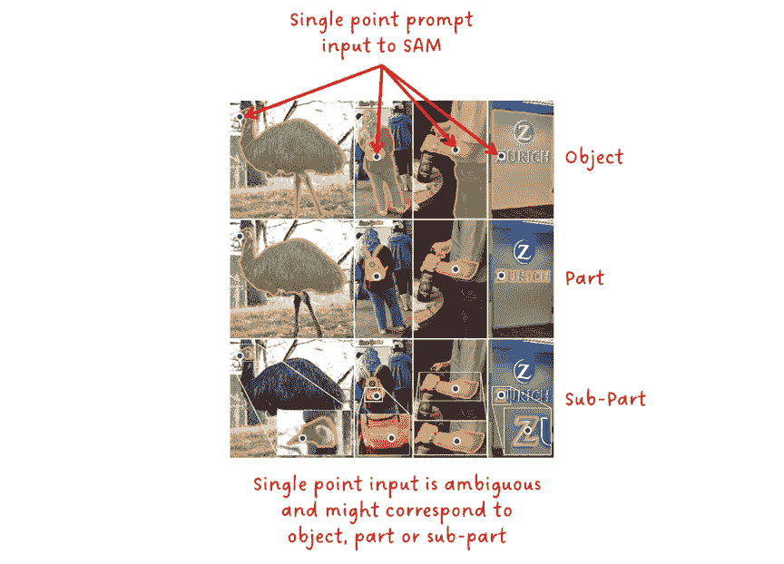
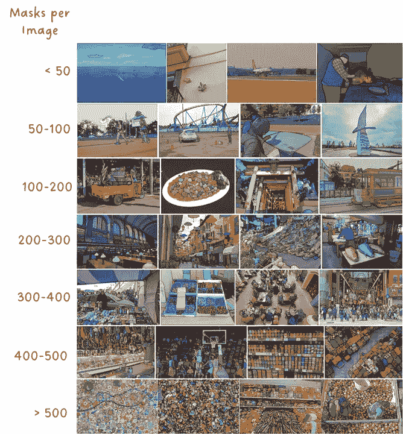
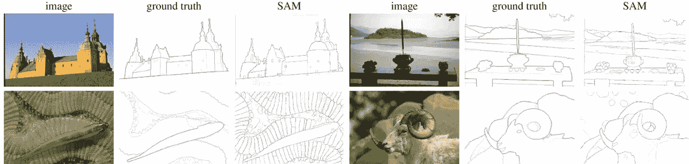

# Segment Anything: 可提示的任意对象分割

> 原文：[`towardsdatascience.com/segment-anything-promptable-segmentation-of-arbitrary-objects-f28958c5612d`](https://towardsdatascience.com/segment-anything-promptable-segmentation-of-arbitrary-objects-f28958c5612d)

## [🚀Sascha 的论文俱乐部](https://towardsdatascience.com/tagged/saschas-paper-club)

## Segment Anything 由 A. Krillov 等人

 [Sascha Kirch](https://medium.com/@SaschaKirch?source=post_page-----f28958c5612d--------------------------------)

·发表于 [Towards Data Science](https://towardsdatascience.com/?source=post_page-----f28958c5612d--------------------------------) ·12 分钟阅读·2023 年 9 月 14 日

--

今天的论文讲解将是视觉化的！我们将分析 *Segment Anything*，这是 Meta AI 研究团队的一篇论文，它不仅在研究界引起了关注，也在各种深度学习从业者和支持者中引起了广泛关注。

Segment Anything 引入了可提示的分割任务，介绍了 segment anything 模型（SAM），并详细描述了生成一个包含超过 10 亿个掩膜的 1100 万张图片的新公开数据集。SAM 已被广泛采纳，并产生了一些新的最先进基础模型，如 [Grounded-SAM](https://github.com/IDEA-Research/Grounded-Segment-Anything)，它将 [Grounding DINO](https://arxiv.org/abs/2303.05499) 与 SAM 结合起来。

图片来源于 [出版物](https://arxiv.org/abs/2304.02643) 由 [Sascha Kirch](https://medium.com/@SaschaKirch)

> **论文:** [Segment Anything](https://arxiv.org/abs/2304.02643) 由 [Alexander Kirillov](https://arxiv.org/search/cs?searchtype=author&query=Kirillov%2C+A) 等人，2023 年 4 月 5 日
> 
> **资源:** [GitHub](https://github.com/facebookresearch/segment-anything) — [演示](https://segment-anything.com/demo) — [项目页面](https://segment-anything.com/) — [数据集](https://segment-anything.com/dataset/index.html) — [HuggingFace](https://huggingface.co/docs/transformers/main/model_doc/sam)
> 
> **类别:** 分割、零-shot 预测、计算机视觉、提示、大规模
> 
> [**其他教程**](https://medium.com/@SaschaKirch/list/paper-walkthroughs-by-sascha-kirch-89c7847da8e2)**:**
> 
> [BYOL] — [CLIP] — [GLIP] — [[Depth Anything](https://medium.com/towards-data-science/depth-anything-a-foundation-model-for-monocular-depth-estimation-8a7920b5c9cc?sk=fc6197edd68e6137c3396c83e50f65cb)] — [DINO] — [DDPM]

# 大纲

1.  背景与背景

1.  SAM — Segment Anything Model

1.  SA-1B — 具有 10 亿个掩码的数据集

1.  实验与消融

1.  结论

1.  进一步阅读与资源

# 背景与背景

《Segment Anything》的作者明确声明：“*我们目标是建立一个图像分割的基础模型。*” 基础模型源于自然语言处理（NLP）的巨大成功。这些模型在自监督的方式下经过了大规模的训练。通常，这些模型在零-shot 任务中表现非常好，即它们可以解决与训练时不同的任务，并表现得相当不错，甚至比其监督型对手更优秀。近年来，许多研究人员致力于将 NLP 基础模型的成功带到计算机视觉等其他领域。

模型如 CLIP 和 GLIP 使得可以根据文本提示对图像分类或对象检测任务进行条件限制，而不是固定的类别集合。其他模型，如 BYOL 或 DINO，提出了不同的技术来学习输入图像的语义丰富表示，这也是许多计算机视觉应用的关键要求。

《Segment Anything》论文旨在：

1.  通过提示启用零-shot 分割

1.  训练一个大规模模型（SAM）作为演示模型

1.  收集并发布最大的公开可用分割数据集。

***但为什么零-shot 性能如此重要？*** — 答案有两个方面。首先，最初计算机视觉模型是以监督方式训练的，这不仅需要数据，还需要大量的真实标签。收集这些数据是极其耗时和昂贵的。其次，模型可以预测的类别仅限于训练时使用的固定类别集合。如果你想向模型中添加一个新类别，你需要首先收集数据并重新训练模型。

***如何对分割模型进行提示？*** — 你可能对来自 ChatGPT、CLIP 或 GLIP 等模型的文本提示比较熟悉。虽然 SAM 原则上也经过了文本提示的测试，但它主要通过掩码、点、框或点网格来进行提示，如下图所示。

图 1：不同输入提示和生成的掩码。照片由[Terence Burke](https://unsplash.com/@ancientwanderer?utm_source=medium&utm_medium=referral)拍摄，发布于[Unsplash](https://unsplash.com/?utm_source=medium&utm_medium=referral) + 掩码由[Sascha Kirch](https://medium.com/@SaschaKirch)用[SAM](https://segment-anything.com/demo)生成

了解了 SAM 的背景后，让我们转到重点，详细了解 Segment Anything Model，即 SAM。

[Sascha Kirch](https://medium.com/@SaschaKirch?source=post_page-----f28958c5612d--------------------------------)

## Sascha Kirch 的论文讲解

[查看列表](https://medium.com/@SaschaKirch/list/paper-walkthroughs-by-sascha-kirch-89c7847da8e2?source=post_page-----f28958c5612d--------------------------------)7 个故事

# SAM — Segment Anything Model

Segment Anything Model（SAM）是一个多模态模型，它输入一张图像和一个或多个提示，并输出一个有效的分割掩码。该模型由三个主要模块组成：图像编码器、提示编码器和掩码解码器。

SAM 可以通过掩码、一组点、边界框或文本，或这些的任何组合来进行提示。

> 注意：尽管论文提到并实验了文本作为提示，但截至 2023 年 9 月，文本提示尚未在[官方实现](https://github.com/facebookresearch/segment-anything)或[SAM 演示](https://segment-anything.com/demo)中发布。

图 2：SAM 架构。[图片来源](https://arxiv.org/abs/2304.02643) + 注释由[Sascha Kirch](https://medium.com/@SaschaKirch)

**图像编码器** — 为给定的输入图像输出图像嵌入。SAM 实现并适配了一个预训练的 ViT-H/16 掩码自编码器。这是一个相对较大的模型，性能强劲。

**提示编码器** — 稀疏提示（例如点、框和文本）被转换为嵌入向量。文本提示在输入提示编码器之前，使用 CLIP 转换为文本嵌入。密集提示（例如掩码）则简单地通过步幅卷积下采样，并与图像嵌入相加。所有嵌入随后被送入最终阶段：掩码解码器。

**掩码解码器** — 接受一组图像嵌入（可选地包含密集掩码嵌入）和一组提示嵌入，并输出有效的分割掩码。

还有两个细节我们应该讨论：提示的歧义性和性能。

简而言之，提示包含的上下文越少，就越模糊，对模型提供正确输出的难度也越大。对于文本提示，我们已经在 CLIP 和 GLIP 中看到了输入文本的具体性与模型性能之间的这种联系。同样，提供一个单点作为输入可能会产生多种可能的掩码。因此，SAM 输出一组三种掩码，分别对应于有效掩码的对象级别、部件级别和子部件级别，如下图所示。

图 3：单点提示的歧义性。[图片来源](https://arxiv.org/abs/2304.02643) + 由 [Sascha Kirch](https://medium.com/@SaschaKirch) 注释

我想提到的第二个细节是推理速度方面的性能。你是否注意到图像编码器是 SAM 中最大的一部分？好吧，这个问题有点不公平，因为我之前没有告诉你，但 SAM 的设计目的是拥有语义丰富的图像嵌入（通常需要一个大型模型），然后通过一个轻量级的提示编码器和轻量级的掩码解码器来处理这些嵌入。好的一点是：每张图像只需运行一次图像编码器，然后可以使用相同的图像嵌入多次提示模型。这使得 SAM 可以在浏览器中运行，仅需 ~50ms 来预测给定提示的掩码（在图像嵌入计算后）。

让我们更详细地看看轻量级掩码解码器。它输入图像嵌入和提示嵌入，并输出一组带有相应分数的掩码。在内部，两个连续的解码器块通过自注意力和交叉注意力的组合生成图像与提示之间的强依赖关系。一个简单的上采样网络结合另一个交叉注意力块生成掩码和分数。

图 4：掩码解码器的详细架构。 [图片来源](https://arxiv.org/abs/2304.02643) + [Sascha Kirch](https://medium.com/@SaschaKirch) 的注释

# SA-1B — 具有 10 亿掩码的数据集

*Segment Anything* 的第二个重大成果是创建和发布了一个大规模的分割数据集。它包含 1100 万张高分辨率和许可的图像，大约有 11 亿个掩码。虽然数据集的原始版本平均有 3300x4950 像素，但发布版本经过下采样，使最短边为 1500 像素。它在不同场景和每张图像掩码数量上都具有多样性，范围从不到 50 个到超过 500 个。

图 5：来自 SA-1B 的不同掩码。 [图片来源](https://arxiv.org/abs/2304.02643) + [Sascha Kirch](https://medium.com/@SaschaKirch) 的注释

该数据集是在一个三阶段数据引擎中创建的，该引擎结合了人工标注和 SAM 生成的自动标注。

**阶段 1：辅助手动阶段** — 一组专业标注员在 SAM 的早期版本的帮助下对图像进行了标注，SAM 在常见的分割数据集上进行了训练。他们被要求标注最显著的对象，并被鼓励在 30 秒后继续。在此阶段结束时，SAM 通过新的标签进行重新训练（总计 12 万张图像和 430 万个掩码）。

**阶段 2：半自动阶段** — 在这一阶段的目标是通过首先让 SAM 预测一些掩码，然后让标注员标注缺少的、不太显著的对象，以增加掩码的多样性。在此阶段结束时，SAM 再次进行重新训练，包括新的样本（总计 30 万张图像和 1020 万个掩码）。

**阶段 3：完全自动阶段** — 在这一阶段，注释完全自动化。SAM 通过 32x32 的网格点生成掩码，并应用一些后处理。

## 数据集分析

现在让我们仔细看一下论文中关于 SA-1B 数据集的一些分析。

在第一次评估中，作者创建了掩码中心点的标准化分布。有趣的是，这些分布会受到摄影师的偏差，即大多数照片将感兴趣的对象置于图像的中心和主轴上。

图 6：图像中对象中心点位置的分布。 [图片来源](https://arxiv.org/abs/2304.02643) + [Sascha Kirch](https://medium.com/@SaschaKirch) 的注释

SA-1B 的一个主要优点是每张图像的掩码数量相比其他数据集更高（见图 7 左）。这也意味着 SA-1B 有许多小掩码（见图 7 中）。比较掩码的凹凸度，作为复杂性的衡量标准，SA-1B 与其他手动标注的数据集非常相似（见图 7 右）。

图 7：SA-1B 的掩码属性与其他数据集的比较。 [图片来源](https://arxiv.org/abs/2304.02643) + [Sascha Kirch](https://medium.com/@SaschaKirch) 注释

高度关注负责任的人工智能（RAI），在这里，不仅分析对某些人群的偏见，还尝试减轻这些偏见。如图 8 所示，世界上大多数国家的图像数量超过 1000 张，前 3 名国家来自不同地区。虽然低收入国家的样本相对较少（占所有样本的 0.9%），但绝对数量仍超过 900 万张，比其他分割数据集更多。

图 8：SA-1B 图像的估计地理分布。 [图片来源](https://arxiv.org/abs/2304.02643) + [Sascha Kirch](https://medium.com/@SaschaKirch) 注释

作者进一步研究了感知性别展示、感知年龄组和感知肤色之间的性能差异。他们提供了预测掩码与真实掩码之间的平均 IoU（交并比）以及 95%的置信区间。SAM 的提示可以是单个点或三个点。主要信息是，在一个组内，结果非常相似（且置信区间重叠），这表明该组的任何成员都没有被偏袒。唯一的例外是感知年龄组中的老年人。

图 9：SAM 在感知性别展示、年龄组和肤色方面的分割性能。 [图片来源](https://arxiv.org/abs/2304.02643) + [Sascha Kirch](https://medium.com/@SaschaKirch) 注释

[## 每当 Sascha Kirch 发布新内容时获取电子邮件 🚀](https://medium.com/@SaschaKirch/subscribe?source=post_page-----f28958c5612d--------------------------------)

### [每当 Sascha Kirch 发布新内容时获取电子邮件 🚀 想了解更多关于深度学习的知识或只是保持更新…](https://medium.com/@SaschaKirch/subscribe?source=post_page-----f28958c5612d--------------------------------)

[medium.com](https://medium.com/@SaschaKirch/subscribe?source=post_page-----f28958c5612d--------------------------------)

# 实验和消融研究

Segment Anything 确实为我们提供了一系列实验，主要集中在其零-shot 性能上，因为这是作者的主要目标：找到一个可提示的零-shot 分割模型。同时，我们也知道其他模型如 CLIP 和 GLIP 的表现，提示调整几乎与模型微调在性能上等效。

为了进行实验，编制了一套包含 23 个多样化数据集的集合。它包含了来自各种数据分布的样本，如图 10 所示。

图 10：来自 23 个数据集的样本。[图片来源](https://arxiv.org/abs/2304.02643) + 注释由 [Sascha Kirch](https://medium.com/@SaschaKirch)

## 零-Shot 单点有效掩码评估

记住，零-Shot 意味着模型从未在评估过程中接触过的数据上进行训练。同样，单点提示由于其模糊性，如图 3 所示，是一项相当困难的任务。

在这个第一次实验中，作者将 SAM 与 [RITM](https://arxiv.org/abs/2102.06583)进行了比较，RITM 是一种强大的交互式分割器，作者表示其在他们的基准测试中表现最佳。

记住，当用单个点进行提示时，SAM 会输出 3 个不同的掩码及其相关分数。在这个实验中，选择分数最高的掩码进行评估。由于这种情况有时会出现错误，作者还对最佳掩码进行了评估，通过将预测结果与真实掩码进行比较，选择重叠度最高的掩码。这些是“oracle”预测。

> 在 23 个数据集中，SAM 在 16 个数据集中中的零-Shot 单点有效掩码预测中表现优于 RITM。在进行 oracle 预测时，它在所有 23 个数据集中都优于 RITM。

图 11：在 23 个数据集上的 SAM 与 RITM 对比。[图片来源](https://arxiv.org/abs/2304.02643) + 注释由 [Sascha Kirch](https://medium.com/@SaschaKirch)

## 零-Shot 文本到掩码

在这个实验中，SAM 通过文本进行提示。作者将此功能称为概念验证，因此既没有进行广泛的实验，也没有在其官方代码实现中发布此功能。

看图 12，你可以看到 SAM 能够为像“海狸牙齿格栅”这样的复杂对象返回正确的掩码。在其他一些情况下，模型仅通过文本提示失败，他们展示了在提供点的上下文时，SAM 能够正确预测单个或多个擦拭器，显示出不仅点被用于预测，文本也被考虑在内。

图 12：零-shot 文本到掩码。[图片来源](https://arxiv.org/abs/2304.02643) + 注释由 [Sascha Kirch](https://medium.com/@SaschaKirch)

## 零-Shot 边缘检测

有趣的是，SAM 也可以用于边缘检测，这是一项它在训练过程中未被考虑的任务，也没有访问相关数据。

为了预测图像，SAM 首先使用 16x16 点的网格进行提示，生成 768 个预测的掩码（每个 256 个点的对象、部分和子部分）。然后对生成的掩码进行筛选和后处理，以获取边缘掩码。

如图 13 所示，与真实数据相比，SAM 预测了更多的细节。但为了公平起见，如果真实数据不完整或覆盖了不同的抽象层次，这种比较对我来说似乎不太公平。但总的来说，性能还是相当不错的！

图 13：SAM 的零样本边缘预测。 [图片来源](https://arxiv.org/abs/2304.02643) + 注释由 [Sascha Kirch](https://medium.com/@SaschaKirch)

## 零样本实例分割

对于这个实验，SAM 以 [COCO](https://cocodataset.org/#home) 和 [LVIS](https://www.lvisdataset.org/) 上训练的完全监督的 ViTDet-H 的边界框输出作为提示。然后将生成的掩码连同初始边界框一起输入到 SAM 中，以精细化结果。图 14 显示了 ViTDet 和 SAM 的比较。

图 14：在 LVIS v1 上的零样本实例分割。 [图片来源](https://arxiv.org/abs/2304.02643) + 注释由 [Sascha Kirch](https://medium.com/@SaschaKirch)

这里有两件事需要注意：如果你查看 [COCO](https://cocodataset.org/#home) 和 [LVIS](https://www.lvisdataset.org/)，你会发现掩码与对象的像素对齐并不完全。这种偏差在 ViTDet 中也存在，这就是为什么 SAM 的质量似乎更好的原因。由于基准真实值具有相同的偏差，而与差的 GT 相比，SAM 的表现可能更差。因此，他们要求人工进行视觉检查。其次，为什么这只大象只有 3 条腿 😅。无论我怎么努力，我都看不到第四条腿…

## 消融实验

在消融实验部分，作者主要关注于扩展数据集、提示点数量和图像编码器的大小（见图 13）。性能以平均 IoU 报告。

图 15：消融研究。 [图片来源](https://arxiv.org/abs/2304.02643) + 注释由 [Sascha Kirch](https://medium.com/@SaschaKirch)

有趣的是，尽管数据扩展和模型规模扩展影响了 mIoU 性能，但它达到饱和状态。这可能表明模型已经足够好，没有太多改进的空间，或者可能是他们方法的局限性。

# 结论

Segment Anything 引入了可提示的 Segment Anything Model (SAM) 以及一个包含超过 10 亿个掩码的分割大规模数据集，涵盖超过 1100 万张图像。能够提示分割模型带来了很多灵活性，比如将训练好的模型适应于未见过的任务或检测未知类别。虽然有些人讨论 SAM 是否可以被视为基础模型，因为它是以监督方式训练的，但它仍然显示出了显著的成果，并已被广泛采用。

# 进一步阅读与资源

正如你自己可能知道的那样：深度学习领域正在以令人难以置信的速度发展。因此，SAM 发布后，许多新项目在其成功的基础上进一步改进了预测质量、减少了推理时间，或者使模型适用于边缘应用，这也就不足为奇了。

以下是一些有趣的资源，它们在 SAM 的基础上进行扩展：

1.  [基础分割任何内容](https://github.com/IDEA-Research/Grounded-Segment-Anything)

1.  [高质量分割任何内容](https://arxiv.org/abs/2306.01567)

1.  [快速分割任何内容](https://arxiv.org/abs/2306.12156)

1.  [更快的分割任何内容：朝着适用于移动应用的轻量级 SAM](https://arxiv.org/abs/2306.14289)

在这里，我分享一些链接，如果你想亲自体验 SAM 和 SA-1B：

+   [SA-1B 数据集下载](https://ai.meta.com/datasets/segment-anything-downloads/)

+   [分割任何内容演示](https://segment-anything.com/demo)

+   [分割任何内容 GitHub](https://github.com/facebookresearch/segment-anything)

+   [Python 笔记本用于实验 SAM](https://github.com/facebookresearch/segment-anything/blob/main/notebooks/automatic_mask_generator_example.ipynb)

这里是我一些文章的链接，带你了解一些相关的基础模型：

 ## CLIP 基础模型

### 论文总结— 从自然语言监督中学习可迁移的视觉模型

towardsdatascience.com  ## GLIP: 将语言-图像预训练引入物体检测

### 论文总结：基础语言-图像预训练

towardsdatascience.com  ## BYOL - 对比自监督学习的替代方案

### 论文分析—Bootstrap Your Own Latent: 自监督学习的新方法

towardsdatascience.com
