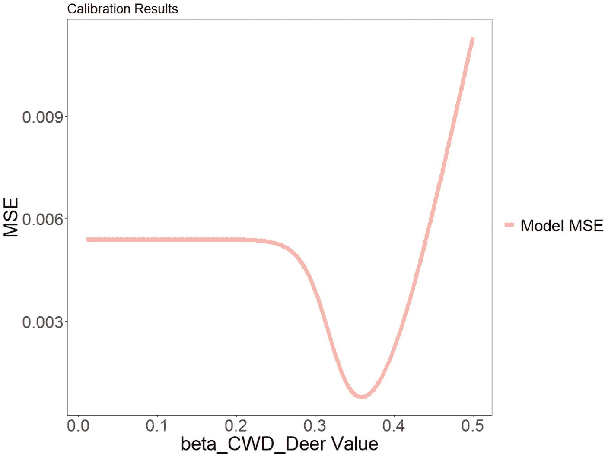

# R 中的 SEIR 建模使用 deSolve — 鹿中的慢性消耗性疾病

> 原文：[`towardsdatascience.com/seir-modeling-in-r-using-desolve-chronic-wasting-disease-in-deer-d88b4de2d6c6?source=collection_archive---------12-----------------------#2023-03-01`](https://towardsdatascience.com/seir-modeling-in-r-using-desolve-chronic-wasting-disease-in-deer-d88b4de2d6c6?source=collection_archive---------12-----------------------#2023-03-01)

## 使用小数据集获取健康政策洞察

[](https://medium.com/@gspmalloy?source=post_page-----d88b4de2d6c6--------------------------------)[](https://towardsdatascience.com/?source=post_page-----d88b4de2d6c6--------------------------------) [Giovanni Malloy](https://medium.com/@gspmalloy?source=post_page-----d88b4de2d6c6--------------------------------)

·

[关注](https://medium.com/m/signin?actionUrl=https%3A%2F%2Fmedium.com%2F_%2Fsubscribe%2Fuser%2Fa0442a984e63&operation=register&redirect=https%3A%2F%2Ftowardsdatascience.com%2Fseir-modeling-in-r-using-desolve-chronic-wasting-disease-in-deer-d88b4de2d6c6&user=Giovanni+Malloy&userId=a0442a984e63&source=post_page-a0442a984e63----d88b4de2d6c6---------------------post_header-----------) 发布于 [Towards Data Science](https://towardsdatascience.com/?source=post_page-----d88b4de2d6c6--------------------------------) ·14 分钟阅读·2023 年 3 月 1 日[](https://medium.com/m/signin?actionUrl=https%3A%2F%2Fmedium.com%2F_%2Fvote%2Ftowards-data-science%2Fd88b4de2d6c6&operation=register&redirect=https%3A%2F%2Ftowardsdatascience.com%2Fseir-modeling-in-r-using-desolve-chronic-wasting-disease-in-deer-d88b4de2d6c6&user=Giovanni+Malloy&userId=a0442a984e63&source=-----d88b4de2d6c6---------------------clap_footer-----------)

--

[](https://medium.com/m/signin?actionUrl=https%3A%2F%2Fmedium.com%2F_%2Fbookmark%2Fp%2Fd88b4de2d6c6&operation=register&redirect=https%3A%2F%2Ftowardsdatascience.com%2Fseir-modeling-in-r-using-desolve-chronic-wasting-disease-in-deer-d88b4de2d6c6&source=-----d88b4de2d6c6---------------------bookmark_footer-----------)

图片由 [Acton Crawford](https://unsplash.com/es/@acton_crawford?utm_source=medium&utm_medium=referral) 提供，来自 [Unsplash](https://unsplash.com/?utm_source=medium&utm_medium=referral)

收集大量数据是训练和测试监督学习模型以及进行预测的前提。然而，使用少量数据和简单但基础的数学模型，我们可以生成大量见解，从而为缓解传染病威胁提供政策参考。这些类型的模型在数据科学界经常被忽视，但它们同样是生成见解的重要工具。

目前，困扰鹿和麋鹿种群的最突出疾病之一是慢性消耗病（CWD）。CWD 是一种“传染性海绵状脑病或朊病毒病”，类似于疯牛病，主要“影响鹿、麋鹿、驯鹿、四不像和驼鹿”[[1](https://pubmed.ncbi.nlm.nih.gov/11974617/), [2](https://www.cdc.gov/prions/cwd/index.html)]。这种疾病存在于自由放养的鹿种群中，并且可以通过“体液如粪便、唾液、血液或尿液的直接接触，或通过土壤、食物或水的环境污染进行间接传播”[2]。目前，它不会影响人类，但保持 CWD 感染动物不进入食品供应链是健康安全的重要目标。建模这种疾病的传播对于理解未来 CWD 发生率如何增加是很重要的。利用我在[上一篇博客文章](https://medium.com/dev-genius/a-quick-intro-to-infectious-disease-modeling-in-r-for-beginners-5f4dbdf68e9e)中描述的一些简单建模工具，我们可以使用在威斯康星州白尾鹿种群上收集的数据，在 R 中建立一个 CWD 的 SEIR 模型。

**SEIR 模型**

首先，我们将为鹿种群中的 CWD 开发简单的 SEIR 模型。SEIR 代表易感、暴露、传染、恢复/移除，这些疾病状态将构成我们分隔模型的基础。一般来说，易感状态包括所有尚未感染 CWD 但可能会被感染的鹿。通过模型中的出生、死亡以及感染，易感状态会有进出。模型中的暴露状态将包括感染了 CWD 但尚未传染的鹿种群。鹿在暴露于 CWD 后进入这个阶段，直到[潜伏期](https://en.wikipedia.org/wiki/Latent_period_(epidemiology))（从感染到具有传染性的时间）过去。传染状态是吸收性的。也就是说，唯一的出路是通过死亡。现在，让我们在数学上描述 SEIR 模型：


作者提供的图像

**参数**

许多参数值可以通过文献综述或与主题专家咨询后的假设来实例化。理想情况下，我们希望最小化校准的参数数量。许多不同的参数集可以实现对数据的近似相同拟合，没有一个参数集能完美拟合。

有时，我们会在文献中找到可以调整以适应我们模型的数据。例如，一只鹿的预期寿命约为 4.5 年[[3](https://www.jstor.org/stable/3803059?seq=7#metadata_info_tab_contents)]，CWD 的潜伏期约为 15 个月[1]，CWD 将死亡率提高到健康鹿的约 4.5 倍[[4](https://www.dec.ny.gov/docs/wildlife_pdf/cwdfactsheet.pdf)]。此外，威斯康星州公布了猎物采集数据[[5](https://dnr.wi.gov/wideermetrics/DeerStats.aspx)]，这将影响我们的死亡率，并且公布了猎杀天数的数据[[9](https://dnr.wi.gov/wideermetrics/DeerStats.aspx?R=HunterSurvey)]。我们将在模型中使用的 CWD 发生率数据（1999–2019 年）直接来自威斯康星州公布的检测结果，可以在此处找到：[CWD 全州监测总结](https://dnr.wi.gov/wmcwd/Summary/Zone) [8]。在我们拥有数据的时期，大约 99%的报告 CWD 病例发生在威斯康星州南部农田区，因此我们将把模型人口限制在该区域。

**R 编程**

我们首先导入数据，并使用 deSolve 库定义我们的模型。在这里，我们将模型定义为一个函数。注意，我们明确考虑了自然死亡和因狩猎而死亡的情况，以及遗传（beta_CWD_Natural）和传染性（beta_CWD_Deer）CWD。

```py
require('deSolve')
require('ggplot2')

#Original Data
df_1999_2019_SouthernFarmland <- read.csv('./CWD Year 1999-2019 Southern Farmland Population Only.csv')

##################
# Section 1\. Model
##################
CWD_mod <- function(Time, State, Pars)
{
  with(as.list(c(State,Pars)),{
    N_Deer <- S_Deer + E_Deer + I_Deer
    births_in <- death_rate_S*S_Deer + hunt_kill_rate*S_Deer*N_Hunters + death_rate_E*E_Deer + hunt_kill_rate*E_Deer*N_Hunters + death_rate_I*I_Deer + hunt_kill_rate*I_Deer*N_Hunters
    d_S_Deer <- births_in - death_rate_S*S_Deer - beta_CWD_Deer*S_Deer*(I_Deer)/N_Deer - beta_CWD_Natural*S_Deer/N_Deer - hunt_kill_rate*S_Deer*N_Hunters
    d_E_Deer <- beta_CWD_Deer*S_Deer*(I_Deer)/N_Deer + beta_CWD_Natural*S_Deer/N_Deer - epsilon_Deer*E_Deer - death_rate_E*E_Deer - hunt_kill_rate*E_Deer*N_Hunters
    d_I_Deer <- epsilon_Deer*E_Deer - death_rate_I*I_Deer - hunt_kill_rate*I_Deer*N_Hunters
    return(list(c(d_S_Deer, d_E_Deer, d_I_Deer)))
  })
}
```

现在，我们使用文献回顾和一些经过充分考量的假设来定义除 CWD 传播率之外的所有参数。为了方便起见，我在注释中包含了用于参数化模型的网站/参考资料。

```py
##########################
# Section 2\. Parameters
##########################
S_Deer <- 1377100/4
E_Deer <- 0
I_Deer <- 3
births_in <- 100
life_expectancy_deer <- 4.5 # years https://www.jstor.org/stable/3803059?seq=7#metadata_info_tab_contents
life_expectancy_deer <- life_expectancy_deer * 12
death_rate_S <- 1/life_expectancy_deer
epsilon_Deer <- 1/15 #https://pdfs.semanticscholar.org/75eb/8b27d8cd507c23f2a74bfc7f4391505a7b4a.pdf
death_rate_E <- 1/(life_expectancy_deer)
risk_ratio_CWD_Deer <- 4.5 # https://www.dec.ny.gov/docs/wildlife_pdf/cwdfactsheet.pdf
death_rate_I <- death_rate_S * risk_ratio_CWD_Deer

hunter_harvest_2017 <- 322054 #https://dnr.wi.gov/wideermetrics/DeerStats.aspx
Avg_days_hunted_2017 <- 4.3 # https://dnr.wi.gov/topic/WildlifeHabitat/documents/reports/gundeer2.pdf
hunter_days_2017 <- 2695768 # https://dnr.wi.gov/topic/WildlifeHabitat/documents/reports/gundeer2.pdf
num_hunters_2017 <- 2695768/4.3
num_deer_2017 <- 1377100
num_deers_per_hunter_2017 <- hunter_harvest_2017/num_hunters_2017
hunter_kill_rate_year <- num_deers_per_hunter_2017/num_deer_2017
hunter_kill_rate_month <- hunter_kill_rate_year/12
beta_CWD_Natural <- .000001
```

现在，我们已经到了至关重要的校准步骤。正如我之前提到的，有许多不同的参数集可以生成适合的模型。我们现在的任务是估计 CWD 的传播率，该传播率最能符合威斯康星州的发病数据，同时保持所有其他参数不变。

校准模型的方法有很多种，因为参数值具有无限的可能范围。对于 CWD 的传播率，传播率的可能值可以从 0 到正无穷。在这种情况下，我进行了一些初步探索，认为 beta_CWD_Deer 的值会在 0.01 和 0.5 之间。在这种情况下，我将测试 0.01 到 0.5 之间的所有值，增量为 0.001。这是最简单的方法，但当我们关注政策或简单性时，它完全可以满足需求。我们将寻找使得每年记录的病例数与模型每年报告的病例数之间的均方误差最小化的 beta_CWD_Deer 值。

```py
##########################
# Section 3\. Calibration
##########################
beta_CWD_Deer <- 0.01

# Define list of possible values for beta_CWD_Deer
list_beta_CWD_Deer <- seq(0.01,0.5,by = 0.001)
# This is a placeholder value that also serves as a sanity check
best_beta_CWD_Deer <- 100
# Set the best score to something absurdly high as a santiy check
best_beta_CWD_Deer_Score <- 10000000000000000000000000

#Track for plot
list_all_betas <- c()
list_all_mse_scores <- c()

for(i in 1:length(list_beta_CWD_Deer))
{
  # Test the possible value of beta_CWD_Deer
  beta_CWD_Deer <- list_beta_CWD_Deer[i]
  #Initialize the model population
  ini_cwd_mod <- c(S_Deer = S_Deer, E_Deer = E_Deer, I_Deer = I_Deer)
  #Run the model for 252 months
  times_cwd_mod <- seq(1,252,by = 1) #By Month
  #Initialize the parameters in the model
  pars_cwd_mod <- c(births_in = births_in, death_rate_S = death_rate_S, 
                    beta_CWD_Deer = beta_CWD_Deer, 
                    beta_CWD_Natural = beta_CWD_Natural, 
                    hunt_kill_rate = hunter_kill_rate_month,
                    epsilon_Deer = epsilon_Deer, 
                    death_rate_E = death_rate_E,
                    death_rate_I = death_rate_I, 
                    N_Hunters = num_hunters_2017)

  #Output using our previously defined function
  CWD_mod_Out <- ode(ini_cwd_mod, times_cwd_mod, CWD_mod, pars_cwd_mod)

  #create a data frame of the results
  yS_Deer <- CWD_mod_Out[,"S_Deer"]
  yE_Deer <- CWD_mod_Out[,"E_Deer"]
  yI_Deer <- CWD_mod_Out[,"I_Deer"]
  CWD_Results <- data.frame(yS_Deer, yE_Deer, yI_Deer)
  #Calculate the model predicted prevalence each year
  CWD_Results$Prevalence <- CWD_Results$yI_Deer / (CWD_Results$yS_Deer +
                                                     CWD_Results$yE_Deer +
                                                     CWD_Results$yI_Deer)
  CWD_Results_Year <- CWD_Results[c(12,24,36,48,60,72,84,96,108,120,
                                    132,144,156,168,180,192,204,
                                    216,228,240,252),]
  # Compare to the data
  CWD_Results_Year$Prevalence_Data <- df_1999_2019_SouthernFarmland$Incidence
  CWD_Results_Year$Year <- df_1999_2019_SouthernFarmland$Year

  CWD_Results_Year$Prevalence_Data <- as.numeric(as.character(CWD_Results_Year$Prevalence_Data))
  CWD_Results_Year$Prevalence <- as.numeric(as.character(CWD_Results_Year$Prevalence))
  # Calculate the mean squared error
  curr_mean_sq_err <- mean((CWD_Results_Year$Prevalence - CWD_Results_Year$Prevalence_Data)²)

  list_all_betas <- c(list_all_betas, beta_CWD_Deer)
  list_all_mse_scores <- c(list_all_mse_scores, curr_mean_sq_err)

  #If it is the lowest MSE, save the beta value and the score as the best
  if(curr_mean_sq_err < best_beta_CWD_Deer_Score)
  {
    best_beta_CWD_Deer <- beta_CWD_Deer
    best_beta_CWD_Deer_Score <- curr_mean_sq_err
    print(curr_mean_sq_err)
  }
  print(i)
}
```

我们可以使用 ggplot 绘制均方误差随时间的变化，以直观地查看模型在不同参数值下的改进情况。

```py
plot_df <- as.data.frame(matrix(c(list_all_betas, list_all_mse_scores), ncol = 2, byrow = FALSE))
colnames(plot_df) <- c('beta_CWD_Deer', 'Model_MSE')

ggplot()+
  geom_line(data = plot_df, aes(x = beta_CWD_Deer, y = Model_MSE, color = 'Model MSE'), size = 3)+
  xlab('beta_CWD_Deer Value')+
  ylab('MSE')+
  ggtitle('Calibration Results')+
  theme_bw()+
  theme(axis.text.x = element_text(size = 24),
        axis.text.y = element_text(size = 24),
        axis.title = element_text(size = 28),
        axis.title.x = element_text(size = 28),
        axis.title.y = element_text(size = 28),
        title = element_text(size = 16),
        legend.text = element_text(size = 24))+
  scale_color_brewer(palette="Pastel1")+
  theme(panel.grid.major = element_blank(), panel.grid.minor = element_blank())+
  labs(color=' ', shape = '')
```



图片由作者提供

最小化模型误差的 beta_CWD_Deer 值为 0.359。我们可以从图中看到，当值低于大约 0.25 时，爆发不会发生，因此误差保持不变。

**结果**

现在，我们可以使用假设的和校准的参数集运行我们的完整模型。

```py
###############################################
# Section 4\. Plot Results
###############################################

beta_CWD_Deer <- best_beta_CWD_Deer

ini_cwd_mod <- c(S_Deer = S_Deer, E_Deer = E_Deer, I_Deer = I_Deer)

times_cwd_mod <- seq(1,252,by = 1) #By Month

pars_cwd_mod <- c(births_in = births_in, death_rate_S = death_rate_S, 
                  beta_CWD_Deer = beta_CWD_Deer, 
                  beta_CWD_Natural = beta_CWD_Natural, 
                  hunt_kill_rate = hunter_kill_rate_month,
                  epsilon_Deer = epsilon_Deer, 
                  death_rate_E = death_rate_E,
                  death_rate_I = death_rate_I, 
                  N_Hunters = num_hunters_2017)

#Output
CWD_mod_Out <- ode(ini_cwd_mod, times_cwd_mod, CWD_mod, pars_cwd_mod)

yS_Deer <- CWD_mod_Out[,"S_Deer"]
yE_Deer <- CWD_mod_Out[,"E_Deer"]
yI_Deer <- CWD_mod_Out[,"I_Deer"]
CWD_Results <- data.frame(yS_Deer, yE_Deer, yI_Deer)
CWD_Results$Prevalence <- CWD_Results$yI_Deer / (CWD_Results$yS_Deer +
                                                  CWD_Results$yE_Deer +
                                                  CWD_Results$yI_Deer)
CWD_Results_Year <- CWD_Results[c(12,24,36,48,60,72,84,96,108,120,
                                  132,144,156,168,180,192,204,
                                  216,228,240,252),]
CWD_Results_Year$Prevalence_Data <- df_1999_2019_SouthernFarmland$Incidence
CWD_Results_Year$Year <- df_1999_2019_SouthernFarmland$Year

CWD_Results$Year <- seq((1998+(1/12)),2019,by=(1/12))

ggplot()+
  geom_point(data = df_1999_2019_SouthernFarmland, aes(x = Year, y = Incidence, color = 'Southern Farmland Zone Data'), size = 3)+
  geom_line(data = CWD_Results, aes(x = Year, y = Prevalence, color = 'Model'), size = 2)+
  xlab('Year')+
  ylab('Prevalence')+
  ggtitle('Chronic Wasting Disease, Whitetail Deer, Wisconsin')+
  theme_bw()+
  theme(axis.text.x = element_text(size = 24),
        axis.text.y = element_text(size = 24),
        axis.title = element_text(size = 28),
        axis.title.x = element_text(size = 28),
        axis.title.y = element_text(size = 28),
        title = element_text(size = 16),
        legend.text = element_text(size = 24),
        legend.position = c(0.3,0.9))+
  scale_y_continuous(breaks = c(0,0.05,0.1,0.15),
                     labels = c('0%','5%','10%','15%'))+
  scale_x_continuous(breaks = c(1999,2005,2011,2017),
                     labels = c('1999', '2005', '2011', '2017'))+
  scale_color_brewer(palette="Pastel1")+
  theme(panel.grid.major = element_blank(), panel.grid.minor = element_blank())+
  labs(color=' ', shape = '')
```


图片来源：作者

从图中我们可以看到，模型在 2016 年之前低估了 CWD 的流行率。之后，模型开始过度拟合流行率。SEIR 模型永远无法完美拟合数据，也不设计为这样做。它旨在作为对疾病传播的优雅近似。我们可以将模型运行到数据之外的时间段，以观察长期的情况：

```py
###############################################
# Section 5\. Plot Predicted prevalence 10 years forward
###############################################

beta_CWD_Deer <- best_beta_CWD_Deer

ini_cwd_mod <- c(S_Deer = S_Deer, E_Deer = E_Deer, I_Deer = I_Deer)

times_cwd_mod <- seq(1,492,by = 1) #By Month

pars_cwd_mod <- c(births_in = births_in, death_rate_S = death_rate_S, 
                  beta_CWD_Deer = beta_CWD_Deer, 
                  beta_CWD_Natural = beta_CWD_Natural, 
                  hunt_kill_rate = hunter_kill_rate_month,
                  epsilon_Deer = epsilon_Deer, 
                  death_rate_E = death_rate_E,
                  death_rate_I = death_rate_I, 
                  N_Hunters = num_hunters_2017)

#Output
CWD_mod_Out <- ode(ini_cwd_mod, times_cwd_mod, CWD_mod, pars_cwd_mod)

yS_Deer <- CWD_mod_Out[,"S_Deer"]
yE_Deer <- CWD_mod_Out[,"E_Deer"]
yI_Deer <- CWD_mod_Out[,"I_Deer"]
CWD_Results <- data.frame(yS_Deer, yE_Deer, yI_Deer)
CWD_Results$Prevalence <- CWD_Results$yI_Deer / (CWD_Results$yS_Deer +
                                                   CWD_Results$yE_Deer +
                                                   CWD_Results$yI_Deer)
CWD_Results_Year <- CWD_Results[c(12,24,36,48,60,72,84,96,108,120,
                                  132,144,156,168,180,192,204,
                                  216,228,240,252,
                                  264,276,288,300,
                                  312,324,336,348,360,372,
                                  384,396,408,420,432,
                                  444,456,468,480,492),]

CWD_Results$Year <- seq((1998+(1/12)),2039,by=(1/12))

ggplot()+
  geom_point(data = df_1999_2019_SouthernFarmland, aes(x = Year, y = Incidence, color = 'Southern Farmland Zone Data'), size = 3)+
  geom_line(data = CWD_Results, aes(x = Year, y = Prevalence, color = 'Model'), size = 2)+
  xlab('Year')+
  ylab('Prevalence')+
  ggtitle('Chronic Wasting Disease, Whitetail Deer, Wisconsin')+
  theme_bw()+
  theme(axis.text.x = element_text(size = 24),
        axis.text.y = element_text(size = 24),
        axis.title = element_text(size = 28),
        axis.title.x = element_text(size = 28),
        axis.title.y = element_text(size = 28),
        title = element_text(size = 16),
        legend.text = element_text(size = 24),
        legend.position = c(0.3,0.9))+
  scale_y_continuous(breaks = c(0,0.05,0.1,0.15),
                     labels = c('0%','5%','10%','15%'))+
  scale_x_continuous(breaks = c(2000,2005,2010,2015,2020,2025,2030,2035),
                     labels = c('2000','2005','2010','2015','2020','2025','2030','2035'))+
  scale_color_brewer(palette="Pastel1")+
  theme(panel.grid.major = element_blank(), panel.grid.minor = element_blank())+
  labs(color=' ', shape = '')
```


图片来源：作者

模型预测，从 2023 年开始，群体中的 CWD 流行率将保持相对稳定的 22%。这应理解为，如果基础疾病和人口动态不发生变化，威斯康星州南部农田地区的白尾鹿的 CWD 流行率应为约 22%。

在 2022 年，威斯康星州自然资源部发现 CWD 的流行率略高于 18% [6]。

**政策评估**

现在我们已经有了模型和基线预测，我们可以探索一些假设的干预措施及其对 CWD 传播的影响。例如，目前的狩猎规定授权在威斯康星州每张许可证猎杀一只鹿 [[7](https://widnr.widen.net/s/pdxppzfsrb/2022wi_huntregulations)]。然而，州政府正在考虑允许无限制猎杀出现 CWD 症状的鹿。让我们设想几个可能的情景：

1.  预计该法律将使 CWD 感染鹿的猎杀率增加 35%，而没有 CWD 的鹿猎杀率增加 15%（由于误诊）。

1.  法律已制定，但朊病毒病已变异为传播性提高 30%。

1.  法律已经制定，朊病毒病发生了突变，并开发了新的 AI 辅助技术，该技术利用计算机视觉来完美区分感染的和未感染的鹿。因此，预计该法律将使患有 CWD 的鹿的猎杀率增加 70%，而没有 CWD 的鹿猎杀率保持不变（0%）。

在模型中，我们将所有情景的起点设定为 2020 年（当时我们没有数据）。虽然我们会调整猎杀率和传播率，但我们将继续保持简化假设，即人口保持不变（出生人数 = 死亡人数）。以下是实现和绘制我们情景比较的 R 代码：

```py
###################################
# Section 6\. Policy Evaluation
###################################

# Run period with data
beta_CWD_Deer <- best_beta_CWD_Deer

ini_cwd_mod <- c(S_Deer = S_Deer, E_Deer = E_Deer, I_Deer = I_Deer)

times_cwd_mod <- seq(1,252,by = 1) #By Month

pars_cwd_mod <- c(births_in = births_in, death_rate_S = death_rate_S, 
                  beta_CWD_Deer = beta_CWD_Deer, 
                  beta_CWD_Natural = beta_CWD_Natural, 
                  hunt_kill_rate = hunter_kill_rate_month,
                  epsilon_Deer = epsilon_Deer, 
                  death_rate_E = death_rate_E,
                  death_rate_I = death_rate_I, 
                  N_Hunters = num_hunters_2017)

#Output
CWD_mod_Out <- ode(ini_cwd_mod, times_cwd_mod, CWD_mod, pars_cwd_mod)

yS_Deer <- CWD_mod_Out[,"S_Deer"]
yE_Deer <- CWD_mod_Out[,"E_Deer"]
yI_Deer <- CWD_mod_Out[,"I_Deer"]
CWD_Results_data <- data.frame(yS_Deer, yE_Deer, yI_Deer)
CWD_Results_data$Prevalence <- CWD_Results_data$yI_Deer / (CWD_Results_data$yS_Deer +
                                                             CWD_Results_data$yE_Deer +
                                                             CWD_Results_data$yI_Deer)
CWD_Results_data$Year <- seq((1998+(1/12)),2019,by=(1/12))

# Baseline model continues 20 years
beta_CWD_Deer <- best_beta_CWD_Deer

ini_cwd_mod <- c(S_Deer = CWD_Results_data$yS_Deer[252], E_Deer = CWD_Results_data$yE_Deer[252], I_Deer = CWD_Results_data$yI_Deer[252])

times_cwd_mod <- seq(253,492,by = 1) #By Month

pars_cwd_mod <- c(births_in = births_in, death_rate_S = death_rate_S, 
                  beta_CWD_Deer = beta_CWD_Deer, 
                  beta_CWD_Natural = beta_CWD_Natural, 
                  hunt_kill_rate = hunter_kill_rate_month,
                  epsilon_Deer = epsilon_Deer, 
                  death_rate_E = death_rate_E,
                  death_rate_I = death_rate_I, 
                  N_Hunters = num_hunters_2017)

#Output
CWD_mod_Out <- ode(ini_cwd_mod, times_cwd_mod, CWD_mod, pars_cwd_mod)

yS_Deer <- CWD_mod_Out[,"S_Deer"]
yE_Deer <- CWD_mod_Out[,"E_Deer"]
yI_Deer <- CWD_mod_Out[,"I_Deer"]
CWD_Results_baseline_projection <- data.frame(yS_Deer, yE_Deer, yI_Deer)
CWD_Results_baseline_projection$Prevalence <- CWD_Results_baseline_projection$yI_Deer / (CWD_Results_baseline_projection$yS_Deer +
                                                                                           CWD_Results_baseline_projection$yE_Deer +
                                                                                           CWD_Results_baseline_projection$yI_Deer)
CWD_Results_baseline_projection$Year <- seq((2019+(1/12)),2039,by=(1/12))

# Scenario 1 model continues 20 years
CWD_mod_diff_hunt_rates <- function(Time, State, Pars)
{
  with(as.list(c(State,Pars)),{
    N_Deer <- S_Deer + E_Deer + I_Deer
    births_in <- death_rate_S*S_Deer + hunt_kill_rate_S*S_Deer*N_Hunters + death_rate_E*E_Deer + hunt_kill_rate_EI*E_Deer*N_Hunters + death_rate_I*I_Deer + hunt_kill_rate_EI*I_Deer*N_Hunters
    d_S_Deer <- births_in - death_rate_S*S_Deer - beta_CWD_Deer*S_Deer*(I_Deer)/N_Deer - beta_CWD_Natural*S_Deer/N_Deer - hunt_kill_rate_S*S_Deer*N_Hunters
    d_E_Deer <- beta_CWD_Deer*S_Deer*(I_Deer)/N_Deer + beta_CWD_Natural*S_Deer/N_Deer - epsilon_Deer*E_Deer - death_rate_E*E_Deer - hunt_kill_rate_EI*E_Deer*N_Hunters
    d_I_Deer <- epsilon_Deer*E_Deer - death_rate_I*I_Deer - hunt_kill_rate_EI*I_Deer*N_Hunters
    return(list(c(d_S_Deer, d_E_Deer, d_I_Deer)))
  })
}

beta_CWD_Deer <- best_beta_CWD_Deer

ini_cwd_mod <- c(S_Deer = CWD_Results_data$yS_Deer[252], E_Deer = CWD_Results_data$yE_Deer[252], I_Deer = CWD_Results_data$yI_Deer[252])

times_cwd_mod <- seq(253,492,by = 1) #By Month

pars_cwd_mod <- c(births_in = births_in, death_rate_S = death_rate_S, 
                  beta_CWD_Deer = beta_CWD_Deer, 
                  beta_CWD_Natural = beta_CWD_Natural, 
                  hunt_kill_rate_S = hunter_kill_rate_month*1.15,
                  hunt_kill_rate_EI = hunter_kill_rate_month*1.35,
                  epsilon_Deer = epsilon_Deer, 
                  death_rate_E = death_rate_E,
                  death_rate_I = death_rate_I, 
                  N_Hunters = num_hunters_2017)

#Output
CWD_mod_Out <- ode(ini_cwd_mod, times_cwd_mod, CWD_mod_diff_hunt_rates, pars_cwd_mod)

yS_Deer <- CWD_mod_Out[,"S_Deer"]
yE_Deer <- CWD_mod_Out[,"E_Deer"]
yI_Deer <- CWD_mod_Out[,"I_Deer"]
CWD_Results_scenario_1_projection <- data.frame(yS_Deer, yE_Deer, yI_Deer)
CWD_Results_scenario_1_projection$Prevalence <- CWD_Results_scenario_1_projection$yI_Deer / (CWD_Results_scenario_1_projection$yS_Deer +
                                                                                               CWD_Results_scenario_1_projection$yE_Deer +
                                                                                               CWD_Results_scenario_1_projection$yI_Deer)
CWD_Results_scenario_1_projection$Year <- seq((2019+(1/12)),2039,by=(1/12))

# Scenario 2 model continues 20 years
beta_CWD_Deer <- best_beta_CWD_Deer*1.3

ini_cwd_mod <- c(S_Deer = CWD_Results_data$yS_Deer[252], E_Deer = CWD_Results_data$yE_Deer[252], I_Deer = CWD_Results_data$yI_Deer[252])

times_cwd_mod <- seq(253,492,by = 1) #By Month

pars_cwd_mod <- c(births_in = births_in, death_rate_S = death_rate_S, 
                  beta_CWD_Deer = beta_CWD_Deer, 
                  beta_CWD_Natural = beta_CWD_Natural, 
                  hunt_kill_rate_S = hunter_kill_rate_month*1.15,
                  hunt_kill_rate_EI = hunter_kill_rate_month*1.35,
                  epsilon_Deer = epsilon_Deer, 
                  death_rate_E = death_rate_E,
                  death_rate_I = death_rate_I, 
                  N_Hunters = num_hunters_2017)

#Output
CWD_mod_Out <- ode(ini_cwd_mod, times_cwd_mod, CWD_mod_diff_hunt_rates, pars_cwd_mod)

yS_Deer <- CWD_mod_Out[,"S_Deer"]
yE_Deer <- CWD_mod_Out[,"E_Deer"]
yI_Deer <- CWD_mod_Out[,"I_Deer"]
CWD_Results_scenario_2_projection <- data.frame(yS_Deer, yE_Deer, yI_Deer)
CWD_Results_scenario_2_projection$Prevalence <- CWD_Results_scenario_2_projection$yI_Deer / (CWD_Results_scenario_2_projection$yS_Deer +
                                                                                               CWD_Results_scenario_2_projection$yE_Deer +
                                                                                               CWD_Results_scenario_2_projection$yI_Deer)
CWD_Results_scenario_2_projection$Year <- seq((2019+(1/12)),2039,by=(1/12))

# Scenario 3 model continues 20 years
beta_CWD_Deer <- best_beta_CWD_Deer*1.3

ini_cwd_mod <- c(S_Deer = CWD_Results_data$yS_Deer[252], E_Deer = CWD_Results_data$yE_Deer[252], I_Deer = CWD_Results_data$yI_Deer[252])

times_cwd_mod <- seq(253,492,by = 1) #By Month

pars_cwd_mod <- c(births_in = births_in, death_rate_S = death_rate_S, 
                  beta_CWD_Deer = beta_CWD_Deer, 
                  beta_CWD_Natural = beta_CWD_Natural, 
                  hunt_kill_rate_S = hunter_kill_rate_month,
                  hunt_kill_rate_EI = hunter_kill_rate_month*1.7,
                  epsilon_Deer = epsilon_Deer, 
                  death_rate_E = death_rate_E,
                  death_rate_I = death_rate_I, 
                  N_Hunters = num_hunters_2017)

#Output
CWD_mod_Out <- ode(ini_cwd_mod, times_cwd_mod, CWD_mod_diff_hunt_rates, pars_cwd_mod)

yS_Deer <- CWD_mod_Out[,"S_Deer"]
yE_Deer <- CWD_mod_Out[,"E_Deer"]
yI_Deer <- CWD_mod_Out[,"I_Deer"]
CWD_Results_scenario_3_projection <- data.frame(yS_Deer, yE_Deer, yI_Deer)
CWD_Results_scenario_3_projection$Prevalence <- CWD_Results_scenario_3_projection$yI_Deer / (CWD_Results_scenario_3_projection$yS_Deer +
                                                                                               CWD_Results_scenario_3_projection$yE_Deer +
                                                                                               CWD_Results_scenario_3_projection$yI_Deer)
CWD_Results_scenario_3_projection$Year <- seq((2019+(1/12)),2039,by=(1/12))

ggplot()+
  geom_point(data = df_1999_2019_SouthernFarmland, aes(x = Year, y = Incidence, color = 'Southern Farmland Zone Data'), size = 3)+
  geom_line(data = CWD_Results_data, aes(x = Year, y = Prevalence, color = 'Calibrated Model'), size = 2)+
  geom_line(data = CWD_Results_baseline_projection, aes(x = Year, y = Prevalence, color = 'Baseline Projection'), size = 2)+
  geom_line(data = CWD_Results_scenario_1_projection, aes(x = Year, y = Prevalence, color = 'Scenario 1 Projection'), size = 2)+
  geom_line(data = CWD_Results_scenario_2_projection, aes(x = Year, y = Prevalence, color = 'Scenario 2 Projection'), size = 2)+
  geom_line(data = CWD_Results_scenario_3_projection, aes(x = Year, y = Prevalence, color = 'Scenario 3 Projection'), size = 2)+
  xlab('Year')+
  ylab('Prevalence')+
  ggtitle('Chronic Wasting Disease, Whitetail Deer, Wisconsin')+
  theme_bw()+
  theme(axis.text.x = element_text(size = 24),
        axis.text.y = element_text(size = 24),
        axis.title = element_text(size = 28),
        axis.title.x = element_text(size = 28),
        axis.title.y = element_text(size = 28),
        title = element_text(size = 16),
        legend.text = element_text(size = 24),
        legend.position = c(0.2,0.8))+
  scale_y_continuous(breaks = c(0,0.05,0.1,0.15),
                     labels = c('0%','5%','10%','15%'))+
  scale_x_continuous(breaks = c(2000,2005,2010,2015,2020,2025,2030,2035),
                     labels = c('2000','2005','2010','2015','2020','2025','2030','2035'))+
  theme(panel.grid.major = element_blank(), panel.grid.minor = element_blank())+
  labs(color=' ', shape = '')
```


图片来源：作者

我们可以看到，增加对 CWD 感染鹿的猎杀对 CWD 的总体流行率几乎没有影响。情景 1 导致长期流行率约为 18.5%，情景 2 导致长期流行率约为 23%，情景 3 导致长期流行率约为 20.2%。实际上，还有其他环境和生态后果在这个方法中未考虑。

**结论**

仅凭 20 个数据点，我们能够开发一个简单的模型，用 SEIR 模型解释威斯康星州南部白尾鹿群体中 CWD 的传播。这种模型在结合了学科专业知识时尤其有助于指导政策。虽然不如 AI 方法准确或新颖，但数学模型在极少量数据下的表现非常出色。

除非另有说明，否则所有图片均由作者提供。

数据在威斯康星州自然资源部书面许可下使用。

**参考文献**

[1] Williams ES, Miller MW. 北美鹿和麋鹿的慢性消耗病。Rev Sci Tech. 2002 年 8 月;21(2):305–16\. doi: 10.20506/rst.21.2.1340\. PMID: 11974617.

[2] 疾病控制与预防中心。 [慢性消耗病 (CWD) | 普里昂病 | CDC](https://www.cdc.gov/prions/cwd/index.html). 2023.

[3] Lopez, R. R., Mark E. P. Vieira, Silvy, N. J., Frank, P. A., Whisenant, S. W., & Jones, D. A. (2003). 佛罗里达群岛鹿的生存、死亡率和预期寿命。*野生动物管理杂志*, *67*(1), 34–45\. [`doi.org/10.2307/3803059`](https://doi.org/10.2307/3803059)

[4] 纽约州环境保护部。 [慢性消耗病 — 纽约州环境保护部](https://www.dec.ny.gov/animals/7191.html). 2016.

[5] 威斯康星州自然资源部。 [鹿统计数据 (wi.gov)](https://dnr.wi.gov/wideermetrics/DeerStats.aspx). 2020.

[6] 威斯康星州自然资源部。 [CWD 2022 年度报告 (wi.gov)](https://dnr.wi.gov/wmcwd/Summary/YearZone/2022). 2023.

[7] 威斯康星州狩猎规定：2022 秋季-2023 春季\. (2022). 威斯康星州自然资源部。 [2022WI_HuntRegulations.pdf (widen.net)](https://widnr.widen.net/s/pdxppzfsrb/2022wi_huntregulations).

[8] 威斯康星州自然资源部。 [CWD 全州监测总结](https://dnr.wi.gov/wmcwd/Summary/Zone). 2023.

[9] 威斯康星州自然资源部。 [鹿统计数据 (wi.gov)](https://dnr.wi.gov/wideermetrics/DeerStats.aspx?R=HunterSurvey). 2019.

对我的内容感兴趣？ 请考虑在 Medium 上关注我。

所有代码和数据可以在 GitHub 上找到： [gspmalloy/SEIR_CWD_Deer: 使用 deSolve 的 SEIR 模型 — 鹿的慢性消耗病 (github.com)](https://github.com/gspmalloy/SEIR_CWD_Deer)

在 Twitter 上关注我： @malloy_giovanni

你在用有限数据开发模型方面的经验如何？ 或者在开发模型以提供政策建议方面的经验如何？ 请在下方评论中分享你的想法或经验！
