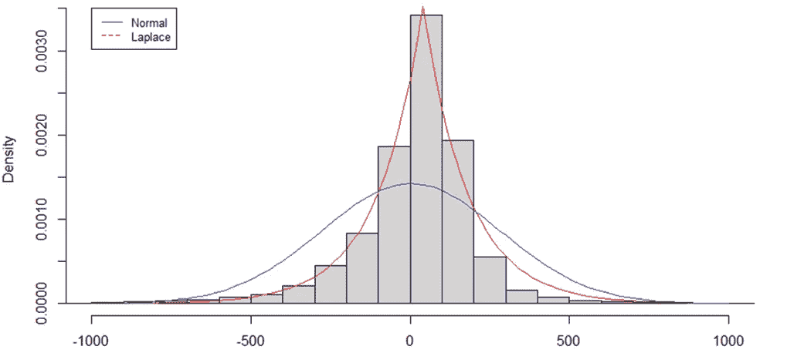

# 在 SageMaker 中选择正确的 XGBoost 损失函数

> 原文：[`towardsdatascience.com/selecting-the-right-xgboost-loss-function-in-sagemaker-60e545a75c47?source=collection_archive---------4-----------------------#2023-02-18`](https://towardsdatascience.com/selecting-the-right-xgboost-loss-function-in-sagemaker-60e545a75c47?source=collection_archive---------4-----------------------#2023-02-18)

## 何时以及为何应使用绝对误差或平方误差

 [Andrew Charabin](https://medium.com/@andrewcharabin?source=post_page-----60e545a75c47--------------------------------)

·

[关注](https://medium.com/m/signin?actionUrl=https%3A%2F%2Fmedium.com%2F_%2Fsubscribe%2Fuser%2Ff282e085f18e&operation=register&redirect=https%3A%2F%2Ftowardsdatascience.com%2Fselecting-the-right-xgboost-loss-function-in-sagemaker-60e545a75c47&user=Andrew+Charabin&userId=f282e085f18e&source=post_page-f282e085f18e----60e545a75c47---------------------post_header-----------) 发表在 [Towards Data Science](https://towardsdatascience.com/?source=post_page-----60e545a75c47--------------------------------) ·7 min 阅读·2023 年 2 月 18 日

--

*图片来源于 VectorStock，版权归 Andrew Charabin 所有*

[XGBoost](https://xgboost.readthedocs.io/en/stable/) 是一个开源软件库，用于将梯度提升框架应用于监督学习（SL）任务。由于其在解决各种 SL 问题中的有效性、速度和稳健性，目前的说法是，针对你的 SL 问题，最佳的模型类型要么是深度学习算法，要么是 XGBoost。由于其名副其实的流行，XGBoost 已作为内置模型在 Amazon SageMaker 这款云机器学习平台中提供。

凭借对 XGBoost 框架的基本了解，任何数据科学家都可以轻松地将数据集插入到 SageMaker 中并生成一个 XGBoost 模型。由于 SageMaker 提供了贝叶斯超参数调优，它将重新训练并选择不同超参数下的最佳模型，用户可以无需完全理解诸如 max_depth 和 eta 等关键输入。然而，在训练 XGBoost 时，通常很少考虑要使用的损失函数（目标），尽管它可能是过程中的最重要的人为决策。本文旨在提供更多关于如何在训练 XGBoost 或其他回归任务的 SL 模型时选择正确损失函数的见解。

我们从解释梯度提升算法开始。一个有用的起点是理解什么不是梯度提升——例如集成决策树算法随机森林。集成决策树算法的目标是生成多个“弱学习者”树，这些树在网络中组合起来时可以产生一个“强学习者”。假设我们有一个由 100 棵树组成的集成，随机森林从概念上讲是并行生成这些树，使用“自助采样”选择观察值和维度的子集来生成每棵树，然后对所有 100 棵树的预测结果进行加权平均，以获得回归问题的最终预测。

与 XGBoost 的关键区别在于，单棵树不能并行生成，必须按顺序生成。具体来说，XGBoost 模型中的每棵后续树用于预测前一棵树的误差。通过结合“自助采样”（从一个袋子中提取不同的观察值和维度）和“提升”（按顺序构建树）的集成方法，XGBoost 框架能够减少模型偏差而不出现过拟合。此外，XGBoost 和其他基于树的模型对高方差数据集和低重要性维度具有鲁棒性。

现在我们从高层次上理解了 XGBoost 的工作原理，让我们回到损失函数上。损失函数接受一组观察值的模型预测，并告诉你这些预测距离实际结果有多远。对于回归问题，本讨论的重点是人们脑海中最简单的损失函数是均绝对误差——我们从实际值中减去预测值（或反之），取绝对值，然后对所有观察值取平均。换句话说，错了 200 比错了 100 要糟糕两倍。

但大多数 XGBoost 用例使用的标准损失函数是‘reg:squarederror’，在 SageMaker 中以前称为‘reg:linear’。正如名字所示，平方误差和绝对误差的唯一区别在于，错误在被平均之前会被平方。由于平方效应在错误大小增加时具有累积效应，均方误差对大错误的惩罚程度比均绝对误差更大。错了 200 现在比错了 100 要糟糕 4 倍。

但为什么均方误差会成为训练 XGBoost 和其他 SL 模型时的标准、无可争议的损失函数，而它并不像均值绝对误差那样简单或直观？

首先要理解的区别是预测损失和估计损失。

（图表由作者提供）

预测损失是业务所承担的损失，而估计损失是模型与“真实情况”模型的距离。正确的估计损失函数并不总是最小化预测损失的函数。正如我稍后所展示的，你可以通过选择不同的估计损失函数来减少预测损失。

给定的均值平均误差在许多实际案例中很好地量化了遗漏的惩罚，为什么均方误差在估计最佳模型参数时常常胜出？

一切归结为模型误差被假设为正态分布的实际假设。

（图表由作者提供）

假设有两个组件需要完美地解释一个结果 Y。首先，是可以从模型维度中得出的信号。在这种情况下，假设一个具有单一维度和偏置项的线性模型是足够的（下面的 mX + b）。其次，是一个遵循独立方差正态分布的随机变量 Z。

从某种意义上说，最佳的估计损失函数是当应用于模型时最大化产生观察到的数据的可能性。在这种情况下，它被证明是均方误差。

平方项的出现可以追溯到正态分布的概率密度函数，这对产生钟形曲线是必不可少的。

但如果误差，特别是随机成分 Z，并不是正态分布呢？在回归问题中观察到的另一种常见预测误差分布是拉普拉斯分布。

（图表由作者提供）

当观察到拉普拉斯分布的概率密度函数时，绝对误差公式立即显现出来。缺乏平方导致分布在 X 轴上的 0 附近出现尖峰。

此外，事实证明，当模型误差遵循拉普拉斯分布时，均值绝对误差是最大化观察到数据的可能性的损失函数。

然而，正态分布和拉普拉斯分布只是回归任务中可以观察到的几种误差分布。对于基于计数的数据问题，误差可能遵循泊松分布。因此，在其他情况下，可能需要进一步研究以找到匹配的误差分布和相关的损失函数，以便获得最佳的参数估计。

在不进一步讨论的情况下，我们已经有了一种改进的算法来选择适用于 XGBoost 模型的正确损失函数。

1.  生成一个任意模型。

1.  观察误差，并检查它们是否与正态分布或拉普拉斯分布相似。

1.  如果相似，请分别选择均方误差或平均绝对误差作为损失函数。

1.  如果不相似，请研究并测试与观察到的误差匹配且对类似问题常见的其他分布。然后，找到能够导致最可能的参数估计的损失函数。

作为这个简单算法应用的商业案例，我将分享一个我遇到的真实 SL 回归案例。

1.  使用均方误差损失训练的 XGBoost 模型产生了如下的预测误差分布。

（图表由作者提供）

2\. 预测误差与拉普拉斯分布非常相似。

3\. 应该使用平均绝对误差作为损失函数。

唯一的问题是，XGBoost 和深度学习算法，作为我们解决众多 SL 问题的首选，需要平滑的损失函数来进行梯度下降（或类似的优化算法）。因此，我们需要找到一个平滑的损失函数，其与平均绝对误差非常相似。在 SageMaker 中最好的选择是伪 Hubbard 分布；下面显示的 Hubbard 分布在 delta 为 1 时与绝对误差非常接近。

（图表由作者提供）

那么，对于我的用例来说，从均方误差损失函数切换到伪 Hubbard 和平均绝对误差对模型训练和超参数调优有什么影响？

（图表由作者提供）

在图表中，你可以看到，当伪 Hubbard 损失与 MAE 超参数调优配对时，平均绝对误差（MAE）下降了 30%。更有趣的是，即使对业务最重要的目标是均方根误差（RMSE），使用均值绝对误差作为估计损失函数仍然能带来改善的业务成果。

# 结束语

虽然 XGBoost 和类似的集成决策树模型使数据科学家能够轻松地在不同的数据集上进行插件式操作，并以最小的努力获得良好的模型性能，但这种表面上的理解是有代价的。选择正确的损失函数是一个简单的例子，我展示了它可以带来 30%以上的模型改进。

从更深层次来看，数据科学就是不断问“为什么”，追求重要的细节以揭示答案，并舍弃那些附属的细节。它需要直觉，追求好奇心，遇到惊讶时深入探究，并从大局到细节拆解问题。本文概述了我理解为什么均方误差被认为是 XGBoost 回归任务的标准损失函数的过程。结果是一个简单的系统，可以为各种情况推荐最佳损失函数。希望这篇文章对你在理解为什么以及使用你发现的东西来帮助解决重要的商业挑战的过程中有所帮助。

> *感谢阅读！如果你喜欢这篇文章，请关注我以获取我新帖子通知。同时，欢迎随时分享任何评论/建议。*
