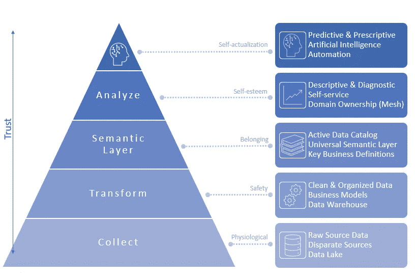
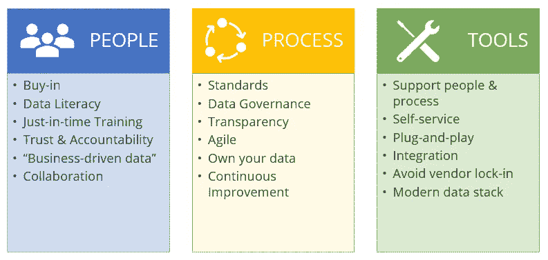
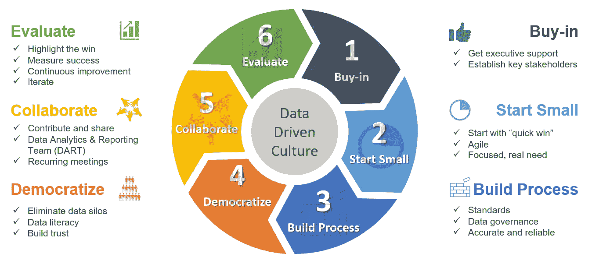

# 自助数据分析的需求层次

> 原文：[`towardsdatascience.com/self-service-data-analytics-as-a-hierarchy-of-needs-19bb68551640?source=collection_archive---------0-----------------------#2023-11-22`](https://towardsdatascience.com/self-service-data-analytics-as-a-hierarchy-of-needs-19bb68551640?source=collection_archive---------0-----------------------#2023-11-22)

## 从食品和住房到自我实现：如何使用科学的方法创建支持自助分析的基础

 [安德鲁·塔夫特](https://medium.com/@andrew.d.taft?source=post_page-----19bb68551640--------------------------------)

·

[关注](https://medium.com/m/signin?actionUrl=https%3A%2F%2Fmedium.com%2F_%2Fsubscribe%2Fuser%2F37b485fe475b&operation=register&redirect=https%3A%2F%2Ftowardsdatascience.com%2Fself-service-data-analytics-as-a-hierarchy-of-needs-19bb68551640&user=Andrew+Taft&userId=37b485fe475b&source=post_page-37b485fe475b----19bb68551640---------------------post_header-----------) 发表在 [Towards Data Science](https://towardsdatascience.com/?source=post_page-----19bb68551640--------------------------------) · 15 分钟阅读 · 2023 年 11 月 22 日

--

自助需求层次（作者提供的图片）

我一直在回顾 90 年代，当时自助式商业智能（BI）工具如 Business Objects 和 Cognos 首次推出。像所有过于热情的软件工程师一样，我甚至在短暂的花旗集团工作期间帮助构建了一个。那时候，我的年轻自我做出了两个非常快速的预测：

1.  **Excel 已死**

1.  **自助数据将迅速取而代之**

好吧，我并不是诺斯特拉达姆斯。在花旗银行之后，我发现自己在商业智能顾问的职业生涯中已经度过了十年——进行一些数据工程（当时是 ETL，而不是 ELT），在其上加装 BI 工具，培训业务用户，反复循环。我们建立了一些“伟大的东西”，但每一个项目之后都留下了令人不满的结果：

**业务用户未按我们预期的速度采用软件进行自主服务。**

一小部分“高级用户”（通常是技术人员）会拿起工具，创建各种不同水平的仪表板和报告，但在业务端并没有普遍采纳。而且依然严重依赖顾问。

> BI 供应商的销售宣传：100%自助数据民主化
> 
> 我的期望：60–80%的采纳率
> 
> 现实情况是：乐观估计下的采纳率不到 20%。

过了一段时间，这些项目开始感觉像是一次很棒的学习机会，而不是一次绝对的失败。到底是什么原因导致这种情况？工具？用户？IT？顾问？我们来到了 2010 年左右，开始有大量关于失败 BI 项目的文档。并非“失败”指的是项目从未产生有意义的结果，而是很少能充分发挥其潜力。业务领域依然严重依赖 IT 来获取数据。清洁、可信赖的数据并未迅速可用。

在这一时期发生了一件有趣的事情：一个名为 Tableau 的数据可视化产品开始广泛被采用。它无处不在，是数据民主化的解决方案。接着，Power BI 作为一个集数据可视化和报告功能于一体的最佳工具进入竞争。然而，十年或更长时间以来，我们仍然看到这些新工具同样面临着 BI 工具自助采纳率低的问题。显然，我并不孤单。

> 全球各组织的商业智能（BI）采纳率为**26%**。（360Suite 2021）

 [## 2021 年惊人的商业智能统计数据

### 随着 BI 市场的不断发展，这些统计数据显示了商业智能工具将继续至关重要的原因……

www.trustradius.com](https://www.trustradius.com/vendor-blog/business-intelligence-statistics-and-trends?source=post_page-----19bb68551640--------------------------------)

我不能坐视不管。自然而然地，我不得不创造世界一直需要的东西：解决自助服务的 BI 工具。是的，我告诉自己，我终于能做对了。于是我创建了[FlexIt Analytics](https://flexitanalytics.com)并设定了这个目标。好吧，还记得我之前的预测吗？是的，我再次错了。让我直奔主题：

**并不存在，也永远不会有一种单一神奇的解决方案，能够以有意义的方式使数据分析对大众更加可接近。**

没有 BI 工具可以解决自我服务的问题。然而，我们可以退一步，从“大图景”的非技术角度考虑这个问题，也许能获得一些有价值的见解和策略来前进。

# 马斯洛的需求层次

回到高中时代，试着回忆那堂令人振奋的关于人类动机的心理学讲座。如果你在学校里没有学习过这部分内容，或者记不起来了，这里有一个总结：

> 美国心理学家亚伯拉罕·马斯洛提出了一种人类动机理论，认为在一个人能够满足更高层次的需求之前，必须先满足基本需求。随着我们在层级上升，我们从如食物和水这样的低层次短期需求转向更高层次的需求，这些需求持续时间更长，更复杂，并且越来越难以满足。最高层次是自我实现和超越。

 [## 马斯洛需求层次

### 马斯洛的需求层次是激励人的需求金字塔。个人最基本的需求，在底层…

[自我服务需求层次](https://www.simplypsychology.org/maslow.html?source=post_page-----19bb68551640--------------------------------)

简而言之，你需要一个基本的基础才能进入下一个层次。任何在数据领域的人都会立刻认出这一点，并理解它直接应用于实现“数据的自我实现”，这显然是“自我服务”。来吧，它们都有“自我”，这绝不是巧合。让我们深入探讨一下。

# 自我服务需求层次

我们将从顶部展示相同的图像，因为它不仅是一个值得在 Instagram 上分享的美图，而且在我们即将进行的分析中也非常有帮助。像马斯洛的层次结构一样，自我服务数据分析需求层次展示了每个层次如何支持和使上层层次成为可能。此外，你会看到，随着你向上移动，更多的信任既是必要的也是交付的。

再来一次，DJ：

自我服务需求层次（作者图片）

**收集**

在底层，马斯洛的生理需求是显而易见的：食物、水、住所。同样，自我服务需求层次的底层也是显而易见的——数据收集。你需要先收集数据。再进一步说，你的基础需要从不同来源收集原始数据。在现代数据世界中，这就是 ELT（提取、加载、转换）的提取和加载部分，结果是我们称之为数据湖的东西。请注意与传统/旧的数据仓储概念 ETL（提取 -> 转换 -> 加载）之间的区别，后者没有数据湖，迫使我们在需要原始源数据时返回到不同的源数据库。

最后一点是，从这一层级产生的任何数据分析都需要由更高技能的分析师/数据科学家来完成，并且信任度较低，因为它没有经过层级的更高层级。类比可以是这样的：你能否直接跳到顶层的超越？也许可以，但在周末聚会结束时，你不太可能持续这种状态。

**转型**

马斯洛层级中的下一层是安全性，包括安全、社会稳定、可预测性和控制。在我们的自助服务层级中，我们通过在数据仓库中将数据清理和组织成业务模型来实现这种可预测性、稳定性和控制。这通常采用多维星型模式的形式。使用来自下层集合的原始源数据，分析师可能需要将大量不同的表连接在一起以获得客户数据。在这一层级中，这些不同的数据已经在一个共同的表中整合，称为客户维度。在这一过程中，数据会被清理（去重、同一客户的名称不匹配），并进行有用的计算（例如，首次订单日期），使得 SQL 变得更简单。

最终，我们建立了另一层的数据安全性和信任，同时也赋能了一个新的自助分析师群体，因为他们无需了解基础源数据的业务复杂性。同样值得注意的是，在这一层级，我们应该看到业务领域所有者的参与。转型过程旨在支持实际的业务需求，因此必须有业务所有者参与。在现代数据世界中，我们开始看到“分析工程师”作为支持这种混合需求的关键角色。

**语义层**

马斯洛的第三层级是通过关系和联系来获得爱与归属感。与我们的自助服务层级的相关性惊人，因为语义层实际上是你建立关系（表连接）的地方，并且是将一切结合在一起的部分。我可以继续深入探讨语义层，并在此处链接的帖子中详细说明：

 ## “语义自由”是商业智能的未来

### dbt、度量、无头和通用语义层如何实现“语义自由”商业智能

towardsdatascience.com

我认为这一层级是实现真正自助服务的最重要层级，业务领域的拥有者需要深度参与。“通用语义层”可以提供一个单一的真相来源，通过数据素养、简洁性和信任来驱动自助分析。分析师可以依赖于友好的字段和实体名称、数据目录描述，最重要的是，他们不需要知道表如何连接（或者至少如何编写 SQL）。我们还可以访问诸如数据源追溯（追踪字段回到源表）、同义词（你称之为“销售”，我称之为“收入”）以及数据新鲜度（数据上次刷新时间）等关键内容。

这里有一件重要的事情需要注意，特别是对于那些可能会说“Business Objects 在 90 年代就有这个功能”的历史学家们。我们还没有达到“分析层”（BI 工具层级）。由于许多原因，这些原因在上面链接的文章中有详细阐述（“没有语义的未来是商业智能的未来”），你必须避免将业务逻辑语义层塞进 BI 工具中。在我们的自助服务层级体系中，“语义层”级别应该支持下一个层级，而不是代替它。

**分析**

在这一层，我们开始讨论 BI 工具、报告、仪表盘，以及当我们谈论自助分析时大多数人想到的东西。如果你对语义层与马斯洛需求层次理论的关联感到如我一样的惊讶，那么请准备好迎接马斯洛的自尊层级。在这里，他将需求分为“较低”版本的需求，如地位、认可、名声、威望和关注，以及“较高”版本的需求，如力量、能力、掌握、自信、独立和自由。你好，“数据英雄”、“禅宗大师”和大师们。

在我们的自助服务层级体系中，这一层级开始关注业务领域的拥有权和自助分析，重点是四种分析类型中的两种：

> 1\. 描述性 — 显示发生了什么的报告和仪表盘
> 
> 2\. 诊断性 — 显示为何发生了这些事情的分析

你是从一个干净的数据仓库开始构建你的仪表盘，数据仓库上有一个良好建模的转换层和通用的语义层，对吗？

自相矛盾的是，可能正是那些我们认为能够实现自助服务的 BI 工具实际上做出了最大的负面贡献。我们知道 Tableau（一个极为出色的可视化工具，确实具有巨大的价值）最早通过绕过缓慢的 IT 部门直接向业务部门销售获得了早期的关注，并继续利用这一分歧。过多的实施涉及从手写 SQL 的源数据库或静态 BI 报告中导出数据，并将这些.CSV 文件导入 Tableau。虽然你可以在这个自助餐中选择健康饮食，但现实往往大相径庭。随之而来的混乱常常使得企业陷入困境，以至于他们永远无法达到下一个层级，因此他们继续只生成描述性仪表盘，展示过去发生的事情。

**自我实现与超越**

马斯洛需求层次的最高级别涉及自我实现、个人成长和发挥全部潜力。类似于生活，在数据世界中，没有一个可以达到的顶峰然后说“就这样，完成了。”这是一个持续的工作进程，非常难以实现，似乎可以永远进行下去。在这个层级，我们超越了基本的描述性和诊断性分析，建立了对数据和流程的高度信任。这使得接下来的两种分析成为可能：

> 3\. 预测性——预测接下来会发生什么
> 
> 4\. 规范性——基于预测，推荐最佳前进路径

此时，我们在所有数据层面上都建立了坚实的基础，可以开始在利用人工智能、自动化业务流程和处理更高级的用例方面取得有意义的进展。

# 数据驱动组织的组成部分

好的，我们已经建立了一个改善“数据生命周期”的框架，目标是数据自我实现。现在，让我们深入探讨如何实现这个目标。首先，让我们看看需要关注的方面：人员、流程和工具。

数据驱动组织的组成部分（图由作者提供）

**人员**

我来自技术领域，所以希望创建技术解决方案来解决业务问题。当然，如果我获得一些业务需求，锁自己在一个黑暗的房间里编写代码，那么我可以创建一个满足业务需求的软件。我犯的错误，以及许多其他人犯的错误，是忽视了软性方面：人员。这听起来显而易见，但我认为我们这些技术人员需要承认，我们经常创建出色的软件产品，然后把它们交给业务用户，说“瞧，这就是了！”当这些软件没有按照我们预期的方式使用，或者他们“就是不理解”时，我们感到困惑。

技术的人性化可能令人困惑和神秘，但这并非必须如此。在这一核心问题上，我们需要通过专注于一些关键领域来建立信任和能力。首先，必须有采纳，否则反对你的力量会使即使是出色的技术解决方案也偏离轨道。除此之外，必须有严肃的协作，理念是我们在朝向“业务驱动”的数据解决方案而不是“数据驱动”的解决方案。我们所做的一切都必须考虑到业务需求。在我们构建时，我们需要考虑如何在我们交付的产品中实现能力。在数据世界中，我们如何促进“数据素养”？当然，企业应该了解他们的数据，但是当我们把他们的业务通过技术研磨后再呈现给他们时，并不总是那么明显。我们需要通过数据目录和语义层促进数据素养。最后，当我们推出我们的解决方案时，我们不能只做标准的推出会议和讲习班，这些会议和讲习班给人的感觉是演讲。我们需要专注于“及时”培训，专注于业务用户在需要解决实际数据问题时的真实数据需求。

**流程**

即使我们把人性化部分做得很好，我们仍然很容易偏离轨道。为了保持在正轨上，我们还需要做好过程部分。在过去几十年中，特别是在技术领域，最明显的问题之一是许多项目采用了瀑布方法，即在项目开始时就要确定最终结果。我们的第一步，特别是在数据世界中，建立我们的数据驱动型组织可能需要多年时间，是灵活并专注于不断变化的业务需求采取敏捷方法。

> 敏捷方法被开发为一种灵活的方法，欢迎在过程的后期甚至方向的改变，并在整个过程中考虑利益相关者的反馈。 — Forbes

 [## 敏捷 vs. 瀑布：哪种项目管理方法适合您？

### 敏捷和瀑布是两种广为人知的项目管理方法。它们在软件领域都很流行...

[Forbes](https://www.forbes.com/advisor/business/agile-vs-waterfall-methodology/?source=post_page-----19bb68551640--------------------------------)

做“敏捷”的一个大错误是进行一系列不同的冲刺项目，但这些项目并未形成一个连贯的最终产品。我们必须有一个明确的最终目标，即使我们不是采取瀑布式的方法。必须有标准和数据治理机制，以确保我们始终关注这个最终目标。业务方也需要对他们的数据负责，而不是技术部门。他们需要深入参与这个过程。最后，流程需要专注于持续改进。什么有效？什么无效？为什么？然后，去修复这些问题，并继续交付。

**工具**

早期，我们依赖工具作为解决问题的魔法解决方案。正如我之前所阐述的，工具不是解决方案。它们甚至不到解决方案的三分之一。我认为这大致是 50% 人员，30% 过程，只有 20% 工具。作为一个 BI 工具提供商，这是一个粗略的看法。但这确实是事实。

话虽如此，工具可以做一些事情来支持整体的人员和流程组件。显然，它们需要直观，以便不需要深入了解如何使用它们，我认为许多现代 BI 工具做得很好。我认为它们不足的一个方面是“即插即用”。正如我之前提到的，我们在工具中放入了过多的业务逻辑，因此从一个工具切换到另一个工具是一项重大工作。更不用说许多组织拥有 3 个或更多的 BI 工具，通常访问相同的数据集。我们需要做的是将这些业务逻辑从 BI 工具中移除，并推送到一个所有 BI 工具都可以接入的集中语义层中。

此外，我们的工具需要与其他工具集成，而不是试图成为一个全能的单体工具。这是“现代数据堆栈”做对的一点，但重要的是我们不要走得太远，导致有数百种工具，造成混乱和杂乱的架构。归根结底，记住工具只是为了支持人员和流程。

# 创建数据驱动组织的步骤

现在我们已经建立了一个框架和数据驱动组织的整体组成部分，接下来让我们谈谈*如何*实现这一目标。

**第 1 步：获得支持**

首先，你需要确定关键利益相关者，并获得高层的支持。没有这些，你可能会面临缺乏“人力资源”来实施你的自助服务框架和组件的风险。获得广泛的支持可能非常困难，所以找出谁可以成为早期的倡导者。在这些步骤结束时，你将重新开始第 1 步，继续建立你的数据驱动组织，并在此过程中获得更多的支持。你是在追求滚雪球效应。

**第 2 步：从小处开始**

继续使用雪球类比，我们在打造一个雪人。自然地，我们从小做起，逐步扩大。我们将我们所构建的东西视为组件，采取敏捷的方法来满足实际的业务需求。我们希望在第一次迭代中取得一个“快速胜利”，以便在这些积极结果上积累更多，吸引更多的人参与其中。

**第三步：建立流程**

这些敏捷的“快速胜利”有可能导致混乱的架构。这就是为什么我们立即建立标准和数据治理，这为我们提供了基础，并保持我们专注于交付高质量、准确和可靠的数据产品。像 Github 这样的工具在支持我们的标准和数据治理方面发挥了重要作用。

**第四步：民主化**

数据治理将使我们能够更加安全地推出这些数据产品，增强信心并降低风险。在实现数据民主化时，我们需要：

+   **消除数据孤岛** —— 这些是由一个部门（通常是技术部门）控制的“黑箱”数据源，与整个组织隔离。

+   **提升数据素养** —— 我们不能期望业务用户立即理解 IT 提供的内容，即使这些数据是他们自己的。数据目录可以大大支持数据素养，但这可能很棘手。我们经常得到的是逐渐过时的电子表格数据字典，最终积灰尘。我们需要转向更动态、主动的数据目录，使业务用户能够对数据目录实体采取行动，并提供对定义等的反馈，以便持续改进。

+   **建立信任** —— 为了实现数据民主化，IT 部门需要信任业务部门会正确使用数据。业务部门需要信任 IT 部门会提供准确、可靠、及时的数据。每一步都需要建立和维护信任。

**第五步：合作**

现在我们已经采取措施来实现数据民主化，我们需要确保我们在合作和共同开发解决方案的同时，也提供关键反馈来改进工作。重要的是组成一个类似 DART（数据分析和报告团队）的跨部门小组，从技术到业务都有成员，并定期开会解决问题。

**第六步：评估**

最后，我们需要突出胜利，同时确保建设性地讨论未能奏效或需要改进的方面。在不采取过于教条主义的态度，也不编造 KPI 的情况下，我们需要找出一种衡量成功的方法。人们对第一次迭代的结果满意吗？我们是否创建了一个立刻有用的数据产品？然后，我们进行迭代，持续改进有效的和无效的部分。

然后，反复进行，从第 1 步开始，获得更多的支持和以结果为驱动的下一个项目。

# 结束语

总结一下，我们涵盖了三个关键领域，以专注于建立数据驱动型组织并实现自助服务。需要特别注意的是，我们不是从零开始进行自助服务，逐步实现完全的数据民主化。我们正在一点一点地推动进展，并不断改进，以便让组织中的更多人参与到数据中来。回顾一下，这里有三种方法可以集中精力：

1.  **框架** — 一种需求层级结构，可以指导我们需要构建什么，以实现数据驱动型组织。

1.  **组件** — 这个数据驱动型组织的组件，即人员、流程和工具。

1.  **创建步骤** — 一种六步法，专注于这些组件，以在框架内建立我们的数据驱动型组织。

祝你在自助服务方面好运！

请评论，我很想听听你的想法，或者联系[Andrew Taft](https://www.linkedin.com/in/ataft/)。
