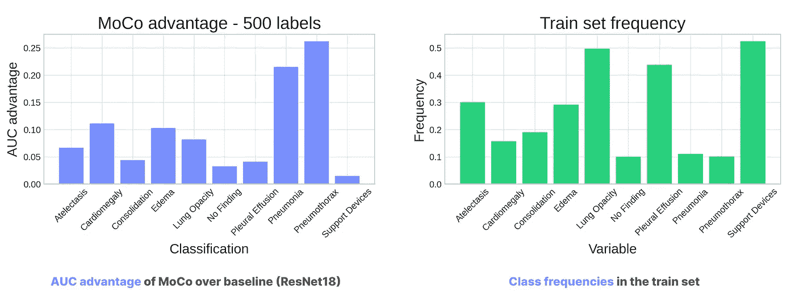

# 自监督学习在计算机视觉中的应用

> 原文：[`towardsdatascience.com/self-supervised-learning-in-computer-vision-fd43719b1625`](https://towardsdatascience.com/self-supervised-learning-in-computer-vision-fd43719b1625)

## 如何用仅有的几个标记示例来训练模型

 [Michał Oleszak](https://michaloleszak.medium.com/?source=post_page-----fd43719b1625--------------------------------)

·发表于[数据科学前沿](https://towardsdatascience.com/?source=post_page-----fd43719b1625--------------------------------)·18 分钟阅读·2023 年 1 月 29 日

--

迄今为止，AI 所提供的大部分价值来自于在越来越大的数据集上训练的监督模型。许多这些数据集由人工标注，这是一项单调、耗时、容易出错且有时昂贵的工作。自监督学习（SSL）是一种不同的学习范式，允许机器从未标注的数据中学习。在本文中，我们将深入探讨 SSL 的工作原理以及如何将其应用于计算机视觉。我们将比较简单的方法和最先进的技术，并展示 SSL 在医学诊断中的实际应用，这个领域可以从中受益颇多，但同时也需要深入理解该方法以正确实施。

# 什么是自监督学习？

[根据 Yann LeCun 的说法](https://ai.facebook.com/blog/self-supervised-learning-the-dark-matter-of-intelligence/)，Meta 的首席 AI 科学家，自监督学习是“构建背景知识并在 AI 系统中逼近一种常识形式的最有前途的方法之一”。自监督方法背后的理念是用没有注释的数据来训练模型。

> 自监督学习是构建背景知识并在 AI 系统中逼近一种常识形式的最有前途的方法之一。
> 
> ~ Yann LeCun

考虑另外两种学习范式：监督学习和无监督学习。在监督学习中，我们向模型提供一些输入及相应的标签，模型的任务是找到一种映射关系，使其能够对新数据进行泛化。

另一方面，在无监督学习中，我们只有输入而没有标签，学习目标是探索输入数据中的模式，目的是对相似的示例进行聚类、减少数据维度或检测异常等。

学习范式。图片由作者提供。

自监督学习在某种程度上介于这两者之间。它类似于无监督学习，因为它从未标记的数据中学习，但同时也具有监督性质，因为模型在训练过程中创建自己的伪标签来进行学习。

这个想法并不完全新鲜。自监督学习在过去已经被广泛使用，最著名的是在 NLP 中用于训练大型语言模型，如 BERT 或 GPT。这些模型可能会被提供原始文本，并要求预测序列中的下一个标记。因此，对于每个训练样本，模型会将其伪标签设置为句子中的下一个词，例如。

> 以自监督方式训练的模型从未标记的数据中创建自己的伪标签。

但在过去的三年中，自监督学习在计算机视觉领域被重新发现，取得了突破性的进展，相关论文来自 [Google](https://arxiv.org/abs/2002.05709)、[DeepMind](https://arxiv.org/pdf/2006.07733.pdf) 和 [Meta](https://arxiv.org/pdf/1911.05722.pdf)。然而，原则仍然相同：模型创建自己的伪标签，例如通过遮挡图像的一部分并尝试预测它，或通过旋转图像并尝试预测旋转角度。我们稍后将讨论具体的技术。

现在我们对自监督学习有了基本的了解，让我们看看它在医疗应用中为何特别有用。

# 医疗数据中的注释稀缺。

医疗行业产生了大量的图像。根据 IBM 的数据，高达 90% 的医疗数据以图像形式存在。这些数据是通过进行各种检查获得的，例如 X 射线，根据 WHO 的数据，每年进行 36 亿次 X 射线检查。

这些大量的数据似乎为应用机器学习算法提供了极大的机会，这些算法依赖于数据，以帮助人类进行诊断和治疗。然而，有一个问题存在。

传统的监督学习模型，为了从数据中学习，除了训练样本，还需要注释或标签：当我们在训练过程中向监督模型展示一张 X 射线图像时，我们需要告诉它需要识别哪些医疗条件。

不幸的是，在医学领域，注释资源稀缺，获取这些注释是一项具有挑战性的任务。它们通常需要由专家医生提供，而专家医生的时间昂贵，且无疑更好地用于照顾他们的病人。这时自监督学习就派上用场了。

# 自监督学习解决了注释稀缺的问题。

在诸如识别 X 光图像中的医疗条件等标注稀少的环境中，我们通常发现自己处于下图左侧所示的情况：我们有大量数据，但只有一小部分是标注的。

如果我们采用传统的监督方法，我们只能使用少量的标记数据来训练模型。然而，得益于自监督学习，我们也可以从未标记的图像中学习。让我们看看怎么做。

自监督学习工作流程。图像来源：作者。

首先，我们让自监督模型从未标记的数据中生成其伪标签并进行训练。这被称为**自监督预训练**，在这个过程中模型解决一个称为**预文本任务**的问题。之前提到过，这可能是预测一个被遮蔽的图像片段或旋转角度，我们会在后面讨论如何选择预文本任务。

上述结果是一个预训练的模型，它已经学习了未标记数据中存在的模式。这个模型对特定的医疗条件一无所知（因为这种信息只有在标签中才会出现，而它未曾见过），但它可能已经学会了**一些 X 光图像在一致的方式上有所不同**。这就是 LeCun 所说的建立背景知识。

> 自监督学习工作流程包括两个步骤：在未标记数据上进行预训练以建立背景知识，并在标记数据上进行微调以学习解决下游任务。

第二步是**以常规、监督的方式对这个预训练模型进行微调**，在数据的标记部分进行。关键在于，现在模型已经有了一些关于数据集中模式的背景知识，提供给它仅仅几个带注释的例子就足以让它学习如何解决**下游任务**，在我们的例子中就是检测 X 光图像中的医疗条件。

# 预文本任务

现在让我们讨论模型在预训练步骤中解决的预文本任务。文献中提出了许多这种任务，可能性几乎是无限的。唯一的要求是我们必须能够从输入数据本身创建伪标签。让我们看几个最受欢迎的传统方法。

## 被遮蔽的预测

被遮蔽的预测简单地意味着遮蔽输入图像的一部分，并让模型尝试从剩余的图像中预测。

被遮蔽的预测。图像来源：作者。

## 转换预测

存在一个完整的家族方法，这些方法可以归纳在一个广泛的名称下——变换预测。在这些任务中，我们对图像应用一些变换，比如旋转它、改变颜色等。然后，模型的任务是预测变换的参数：角度比例、颜色变化量等。

变换预测。图像由作者提供。

## 拼图

另一种方法是让模型解决拼图。我们将输入图像切成若干块，随机重新排列，然后要求模型找出正确的原始排列。

拼图。图像由作者提供。

## 实例识别

其他一些方法将预训练任务集中在实例识别上。这要求你拥有同一对象的多个视图，例如，从不同角度或不同地点拍摄的同一只猫的照片。这种方法的变体会自动生成视图，例如，从 3D 点云中生成或使用生成模型。预训练任务就是识别两张图像是否表示完全相同的对象。

迄今为止，我们讨论的每一个预训练任务的目标都是迫使模型学习数据中的结构和模式。然而，最新的研究发现，有一种稍微不同的方法在实现这一目标时效果最佳。成功的方法基于**对比学习**。

# 对比学习

对比学习的原则是将样本相互对比，以学习样本之间的共同模式以及区分它们的模式。

> 对比学习将样本相互对比，以学习它们之间的共同模式以及区分它们的模式。

## 监督式对比学习

这种方法不仅限于自监督学习。事实上，它最初是作为监督式少样本问题的解决方案出现的。想象一下，你负责办公楼的安全，并且你想安装一个只有经过验证的员工才能打开的自动门。你只有少量每个员工的照片来训练模型。

这里的一个解决方案可能是训练一个模型来识别给定的两张图像是否描绘了同一个人。系统可以将每个来访者的面部与员工照片数据库进行比对，并寻找匹配。这些模型通常以对比方式进行训练。在训练过程中，它们会被呈现三张照片以进行对比：两张是同一个人，一张是不同的。目标是学习前两张彼此相似，而与第三张不同。这种对比方法是监督的，因为你知道每张照片中的人是谁，并可以利用这些知识生成训练样本。

> 对比学习可以用于有监督和自监督学习任务。

一种略有不同的对比学习方法证明非常适合自监督问题。

## 自监督对比学习

在这种方法中，我们还向模型呈现三张图片。

+   第一张是训练数据集中一张随机图片，被称为**锚点图片**。

+   第二张图片是相同的锚点图片，但以某种方式进行了变换，例如通过旋转或颜色偏移，被称为**正样本**。

+   第三张图片是训练数据中的另一张随机图片，与第一张不同，被称为**负样本**。

对比自监督学习。图片来自作者。

学习的目标是教会模型前两张图片是相似的，我们希望它们的潜在表示彼此接近（毕竟，旋转的黑白猫仍然是一只猫），而最后一张图片与前两张图片不同，它的潜在表示或嵌入应该远离。

现在我们来更详细地讨论几种自监督对比架构。

## 三元组损失

可以想象的最简单的方法是基于三元组损失的模型。我们将锚点、正样本和负样本图像通过一个骨干模型，例如 ResNet 或视觉变换器，以获取它们的嵌入，然后将这些嵌入传递给三元组损失函数，其目标是教会模型将锚点和正样本图像在潜在空间中彼此靠近，而将锚点和负样本图像远离。

基于简单三元组损失的模型架构。图片来自作者。

基于三元组损失的模型是一个简单的模型。现在，让我们看一看一些最先进的方法。

## SimCLR

对比学习的简单框架，简称 SimCLR，已在 2020 年由[Google Research 的一篇论文](https://arxiv.org/abs/2002.05709)中提出。

模型接收两张输入图片：锚点图片及其变换版本或正样本，然后将每张图片通过 ResNet 编码器、多层感知器和一个可学习的非线性层。噪声对比估计（NCE）损失旨在最大化两个嵌入之间的相似度，同时最小化与同一小批次中其他图片的嵌入的相似度。

SimCLR 架构。图片来源：[LINK](https://generallyintelligent.com/blog/2020-08-24-understanding-self-supervised-contrastive-learning/)。

SimCLR 在图像识别中取得了很好的结果。不幸的是，正如作者所示，它在批量大小达到 4096 时效果最佳，并且需要长时间训练。这使得它对于那些不愿在云计算上花费大量资金的个人和公司几乎不可用。

## MoCo

Facebook AI 研究团队的 [Momentum Contrast](https://arxiv.org/abs/1911.05722)（简称 MoCo）缓解了 SimCLR 的一些缺点。他们通过一个巧妙的技巧成功将批量大小减少到 256。

MoCo 有两个编码器网络，它们的参数分别优化，一个用于锚点图像（*在线编码器*），另一个用于正例（*动量编码器*）。在线编码器通过基于梯度下降的算法进行优化，而动量编码器则基于在线编码器权重的指数移动平均进行更新。

最重要的是，MoCo 维护了一个动量编码器嵌入的记忆库，并从中抽取负例来计算 NCE 损失。这消除了对大批量大小的需求。

MoCo 架构。图片来源：[LINK](https://generallyintelligent.com/blog/2020-08-24-understanding-self-supervised-contrastive-learning/)。

在 MoCo 之前，记忆库已经被用于对比学习，但它们通常存储由在线编码器生成的表示。因此，这样的记忆库同时存储了在训练的不同阶段生成的图像，从而导致不一致。基于在线权重移动平均的动量更新的引入，使 MoCo 能够保持一致的记忆库，成为计算损失的良好负例来源。

在发布时，MoCo 在许多不同的计算机视觉任务中超越了顶级监督模型。

## BYOL

[Bootstrap Your Own Latent](https://arxiv.org/abs/2006.07733)（简称 BYOL）是 DeepMind 的一项成果。它基于 MoCo， 同样利用了两个网络，其中一个网络的权重由另一个网络的移动平均更新。

然而，BYOL 并没有使用对比损失函数，而是学习将正例和归一化的锚点映射到嵌入空间中的同一位置。换句话说，在线网络被训练去预测另一网络的表示。这消除了对负例和记忆库的需求。

BYOL 架构。图片来源：[LINK](https://generallyintelligent.com/blog/2020-08-24-understanding-self-supervised-contrastive-learning/)。

尽管 BYOL 没有明确地将不同图像进行对比，但 [一次全面调查](https://generallyintelligent.com/blog/2020-08-24-understanding-self-supervised-contrastive-learning/) 发现它实际上是在以对比的方式进行学习，尽管是间接的。

## 其他

目前存在许多其他现代自监督架构，几乎每个月都会出现更多新的架构，这些新架构的结果超越了它们的前任。目前的研究往往更多关注模型在许多不同下游任务中的迁移性。大多数这些研究来自 Meta 研究人员。一些显著的例子包括[Barlow Twins](https://arxiv.org/abs/2103.03230)、[SwAV](https://arxiv.org/pdf/2006.09882.pdf)、[SimSiam](https://arxiv.org/abs/2011.10566)，以及最新的[Tico](https://arxiv.org/pdf/2206.10698.pdf)和[VICRegL](https://arxiv.org/abs/2210.01571)。

# 选择变换

我们已经讨论了自监督学习是如何工作的，以及它如何解决医学数据中普遍存在的稀缺标注问题。我们还检查了各种前置任务和最先进的对比架构，这些架构将锚点图像与其变换版本进行对比。我们缺少的最后一块拼图是如何选择要应用于锚点图像的变换。而这个选择被证明是成功将自监督学习应用于实际问题的关键步骤。

> 在对比学习中正确选择变换对于成功解决实际问题至关重要。

包括 SimCLR 和 MoCo 论文在内的最先进文献声称已识别出最佳的变换集合。他们建议使用随机裁剪、颜色抖动和模糊。作者已经证明这些变换在广泛的下游任务中效果最佳。

不幸的是，事情并不那么简单。不同的变换会向模型引入不同的不变性，这可能并不总是令人满意的。

## 不应对比的内容

Xiao 等人撰写的一篇优秀论文，[What Should Not Be Contrastive in Contrastive Learning](https://arxiv.org/abs/2008.05659)，很巧妙地展示了这一现象。

考虑一个包含三类图像的数据集：鸟类、花卉和大象，以及在对比预训练期间可以应用于锚点图像的三种可能变换：颜色偏移、旋转和纹理变化。根据你选择的变换，你将能够解决一些下游任务，但不能解决其他任务。

> 不同的变换会向模型引入不同的不变性，这可能并不总是令人满意的。

如果你将颜色偏移作为你的变换，你将**向模型引入颜色不变性**：在对比预训练步骤中，损失函数会迫使模型在嵌入空间中将语义相似但颜色不同的图像靠近彼此。

不同的变换会向模型引入不同的不变性。来源：[LINK](https://arxiv.org/pdf/2008.05659.pdf)。

然后你可以对模型进行微调，以执行粗粒度分类任务，例如区分鸟类和大象，因为它们在许多方面的差异远超过颜色。然而，细粒度分类任务，例如区分不同的鸟类或花卉物种，将会更困难。在这些情况下，类别通常主要通过颜色来区分，而因为模型在预训练期间被教导忽略颜色，它可能在这些下游任务中表现不佳。

> 选择转换应该根据我们想要解决的下游任务来指导。

我鼓励你花一点时间查看上面论文中的图，并思考旋转和纹理转换如何影响模型可能表现不佳的任务。

从以上示例中得到的启示是，转换的选择应该根据我们想要解决的下游任务的具体情况来指导。使用错误的转换进行预训练实际上可能会阻碍模型在后续任务中的表现。

## 胸部 X 光片的转换

现在让我们看看转换选择对 X 光图像的重要性。假设我们忽略将图像分类为不同医学状况的下游任务，而仅仅遵循 Google 和 Meta 的研究人员的建议，使用随机裁剪作为我们的转换。

选择适合 X 光图像的转换。图片来源：作者。

让橙色圆圈代表图像中的一部分，指示某种特定的情况，例如肺部的某种损伤。通过随机裁剪，我们可能会得到一个积极的例子，如上图所示：损伤区域被裁剪掉。

对比损失会教会模型损伤的肺和没有损伤的肺是相似的。这种预训练可能使微调模型以识别这种类型的肺损伤变得困难。

另外两个声称最佳的转换对于 X 光数据也不适用。对灰度图像应用颜色抖动或模糊可能会适得其反，因为灰度的阴影或局部模糊可能表明某种特定的医学状况。再次强调，转换必须始终根据特定的数据集和下游任务来选择。

理论方面的内容就到这里了；让我们看看自监督对比学习在 X 光分类中的实际应用！

# 自监督学习下的 X 光分类

我们与 Tooploox 的同事一起，开始探索自监督学习在医学诊断中的价值。

我们使用了[CheXpert 数据集](https://aimi.stanford.edu/chexpert-chest-x-rays)，该数据集包含约 220k 张标注有十个互斥类别的胸部 X 光图像，指示不同的医疗条件和病人是否使用了辅助设备。我们仅使用了超过 200k 张正面图像的子集。

我们选择了约 200k 张图像的随机子集进行自监督预训练。经过一系列实验，我们决定使用轻微的随机旋转、水平翻转和随机透视作为对锚图像应用的变换。所有 CheXpert 中的图像都有标签，但我们在预训练数据中忽略了这些标签。

来自 CheXpert 数据集的示例图像。来源：[链接](https://aimi.stanford.edu/chexpert-chest-x-rays)。

在预训练之后，我们在不同大小的标注数据集上以监督方式微调了模型：从 250 张到 10k 张图像。目标是研究性能如何随着标注集大小的变化而变化。

最后，我们在 300 张手动标注的图像上测试了这些模型（微调数据的标签是由数据集作者通过自动解析病人的记录获得的，这可能引入了一些噪声；而测试标签则是由医生手动标注的，质量较高）。

## 性能评估

我们比较了三种模型架构：

+   一种传统的迁移学习方法，使用 ResNet18。仅在标注微调集上以监督方式进行训练。这反映了我们不使用自监督学习的情况，因此不得不忽略那些未标注的数据。

+   如前所述的简单三重损失模型，使用相同的 ResNet18 作为骨干，但使用三重损失和我们选择的变换以对比方式进行预训练。

+   Meta 的 MoCo，使用相同的 ResNet18 骨干和我们的变换集。

每个模型已被训练和测试十次，每次使用不同大小的标注微调集。我们通过 ROC 曲线下面积或 AUC 来比较它们。

## 结果

不同架构和标注集大小的 AUC 如下面的图所示。

模型比较。图片由作者提供。

自监督模型明显超越了监督基准。然而，从这些结果中还有其他有趣的结论：

+   自监督预训练在**标注集最小**时提供了**最大的提升**：仅用 250 个标注样本就超越了监督基准 10 个百分点。

+   自监督预训练**即使在标注数据集较大**时也能改进监督基准：即使有 10k 个标注样本，提升仍达到约 6 个百分点。

+   **MoCo 相比 Triplet Loss 在基准上获得的增益更多**，特别是当标注数据集较小时。

让我们更仔细地查看数据中的类别频率。下图左侧面板显示了 MoCo 相对于基线的优势（通过 AUC 差异来衡量），按每个类别单独计算。右侧面板显示了数据集中各类别的频率。

虽然自监督学习对每个类别都带来了一些收益，但对于相对稀有的类别收益似乎最大。这与之前的图表结果一致，后者显示了在标记集较小的情况下改进最为显著。

# 结论

自监督学习在计算机视觉领域在过去三年里取得了巨大的进展。由大型 AI 研究实验室发布的对比架构（以 Meta 为首）不断提高标准。这有两个主要的影响。

首先，高效利用未标记数据集的能力将在许多数据稀缺的行业中引发变革。

其次，训练这些所谓的基础模型，从未标记的数据中学习背景知识，并将其转移到多个不同的下游任务中，是推动 AI 泛化的重要一步。

# 致谢

这篇文章基于我在 2022 年 12 月 18 日在波兰华沙举办的数据科学峰会上的演讲。演示文稿幻灯片可以在[这里](https://drive.google.com/file/d/1op183zxDNBchTNdih91yDsWbizXkgieR/view)查看。

将自监督学习应用于医疗应用的研究是我与 Tooploox 的同事们的共同努力。你可以在[公司博客](https://tooploox.com/self-supervised-learning-in-healthcare)上阅读更多内容。

感谢阅读！

如果你喜欢这篇文章，为什么不[**订阅电子邮件更新**](https://michaloleszak.medium.com/subscribe)以便获取我新文章的通知呢？通过[**成为 Medium 会员**](https://michaloleszak.medium.com/membership)，你可以支持我的写作，并无限制访问其他作者以及我自己的所有故事。

想要始终保持对不断加速发展的机器学习和 AI 领域的关注吗？查看我的新通讯[**AI Pulse**](https://pulseofai.substack.com/)。需要咨询？你可以[**在这里**](https://topmate.io/michaloleszak)问我任何问题或预约 1 对 1 咨询。

你还可以尝试[我其他的文章](https://michaloleszak.github.io/blog/)。无法决定？选择以下其中之一：

 ## 蒙特卡洛 Dropout

### 用一个小技巧免费提高你的神经网络，同时获得模型不确定性的估计作为额外福利。

[towardsdatascience.com  ## 生活中贝叶斯思维的重要性

### 这种简单的思维转变将帮助你更好地理解你周围不确定的世界。

[towardsdatascience.com  ## 确立因果关系：第四部分

### 利用政策变动的差分法

[towardsdatascience.com
