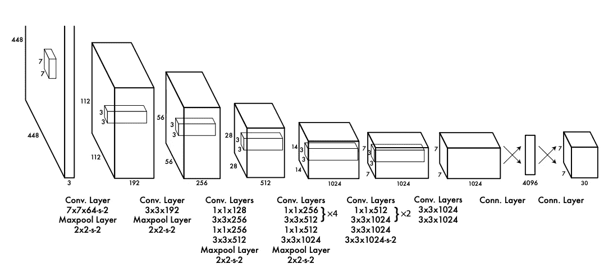

# 使用投影头的自监督学习

> 原文：[`towardsdatascience.com/self-supervised-learning-using-projection-heads-b77af3911d33`](https://towardsdatascience.com/self-supervised-learning-using-projection-heads-b77af3911d33)

## 使用无标记数据提升性能

[](https://medium.com/@danielwarfield1?source=post_page-----b77af3911d33--------------------------------)[](https://towardsdatascience.com/?source=post_page-----b77af3911d33--------------------------------) [丹尼尔·沃菲尔德](https://medium.com/@danielwarfield1?source=post_page-----b77af3911d33--------------------------------)

·发布于 [Towards Data Science](https://towardsdatascience.com/?source=post_page-----b77af3911d33--------------------------------) ·阅读时间 13 分钟·2023 年 6 月 29 日

--


“自监督”由丹尼尔·沃菲尔德使用 p5.js 实现

在这篇文章中，你将学习自监督学习、如何利用它提升模型性能，以及投影头在自监督学习过程中的作用。我们将涵盖直觉、一些文献以及 PyTorch 中的计算机视觉示例。

**适合谁？** 任何拥有无标记且可增补数据的人。

**这篇文章的难度如何？** 本文的开头对初学者概念上是可及的，但例子更多地集中在中级和高级数据科学家上。

**前提条件：** 对卷积网络和密集网络有较高水平的理解。

**代码：** 完整代码请见[这里](https://github.com/DanielWarfield1/MLWritingAndResearch/blob/main/sslDemo.ipynb)。

# 自监督与其他方法

通常，当人们想到模型时，他们会考虑两类：监督模型和无监督模型。

+   **监督学习** 是基于**标记**信息训练模型的过程。例如，在训练一个预测图像是否包含猫或狗的模型时，首先收集一组标记为猫或狗的图像，然后训练模型（使用 [梯度下降](https://medium.com/@danielwarfield1/what-are-gradients-and-why-do-they-explode-add23264d24b)）来理解包含猫和狗图像之间的差异。

+   **无监督学习** 是向模型提供某种**无标记**信息，并通过对数据进行某种转化来提取有用的推断。无监督学习的经典例子是聚类；在此过程中，从未分组的数据中基于局部位置提取信息组。

自监督学习介于两者之间。**自监督使用** **程序生成的标签** **而非人工标签。** 在某些方面，它是监督式学习，因为模型从标记的数据中学习，但在其他方面，它是无监督的，因为训练算法没有提供标签。因此称为自监督。

> 自监督学习（SSL）的目标是在没有任何人工标记数据注释的情况下生成有用的特征表示。— K Gupta 等

# 自监督概述

自监督使用对数据的变换，加上巧妙的损失函数，来教模型**理解相似的数据**。我们可能不知道图像包含什么（它是无人标记的），但我们知道**稍微修改的图像仍然是那个东西的图像**。因此，你可以将一张图像及其翻转图像标记为包含相同的东西。


即使我们不知道这张图像包含一只猫，我们也知道图像包含的内容不论如何操控图像都是相同的。

这个想法是，通过训练模型学习数据是否包含相似的东西，你是在教模型理解数据，而不论数据是如何呈现的。换句话说，**你是在训练模型理解图像，通常情况下，不论类别**。一旦自监督完成，模型可以在少量标记数据上进行精炼，以理解最终任务（是狗的图像还是猫的图像）。


自监督学习如何融入一般工作流程的基本概念

我在这个例子中使用的是图像，但自监督可以应用于任何数据，这些数据通过增强方法来改变数据，而不改变其从最终建模问题的角度来看本质。例如，音频数据的增强可以使用波表进行，具体说明见[这篇文章](https://medium.com/roundtableml/use-frequency-more-frequently-14715714de38)。

附言：另一种常见的概念化方式是**风格不变性**。换句话说，你是在训练一个模型来忽略图像中的风格差异。

# 投影头

随着机器学习作为一个学科的发展，一些架构选择已经证明是普遍有用的。例如，在卷积网络中，一些网络有主干，一些有颈部，还有一些有头部。**头部，通常来说，是一个位于较大网络末端的密集网络，将特征转化为最终输出**。



第一篇 YOLO 论文是经典的卷积架构。它可以被认为有两个部分：一系列卷积将原始图像转换为关键特征（主干），以及一个密集网络将这些特征转化为最终结果（头部）。[来源](https://arxiv.org/pdf/1506.02640.pdf)

这个头部的功能通常被描述为**投影**。在数学和许多其他学科中，投影是将某种信息从一个空间映射到另一个空间的概念，就像灯光如何将你的三维形态映射到墙上的二维阴影中一样。**投影头是一个位于较大网络末端的密集网络，负责将一些信息转换为其他信息**。在我们的玩具示例中，猫与狗，投影头将图像的通用理解作为特征映射到猫与狗的预测中。

# 为什么投影头在自监督学习中如此重要。

想象一下你正在玩大富翁游戏。有很多需要学习的东西；投资房地产可以带来收益，做出投资前需要考虑未来，经过“起点”并获得 200 美元，对鞋子和顶针之间没有根本区别等等。**在大富翁游戏中，有两种类型的信息：一般适用的信息和任务特定的信息**。你不应该在日常生活中每次看到“起点”这个词就兴奋：那是任务特定的。你应该仔细考虑你的投资：那是普遍有用的。

**我们可以把自监督看作是一场“游戏”，在这场游戏中，模型学习识别相似或不相似的图像**。通过玩这个游戏，模型学习到一般的图像理解，以及实现两张图像是否相同的具体规则。


在一个经典的卷积网络中，颈部和头部是常见的直觉，其中卷积提取特征、风格、纹理以及其他用于一般图像理解的必要信息。另一方面，密集头部则将这些发现的特征映射到任务特定的输出中（例如，识别两张图片是否相同，类似于自监督学习）。

一旦我们在相似数据上训练了一个自监督模型，并且现在想根据标记数据来细化这个模型，我们不再关心识别两张图像是否相同的任务特定逻辑。我们希望保留一般的图像理解，但用分类知识替换任务特定知识。为此，**我们丢弃投影头，并用一个新的投影头替换它**。


模型在自监督学习（顶部）和监督学习（底部）中被丢弃的部分。卷积骨干网络被保留，而负责任务特定逻辑的投影头则被丢弃。

在自监督学习过程中使用投影头是当前的研究热点（[这篇](https://arxiv.org/pdf/2212.11491.pdf)文章对这一主题进行了很好的阐述），但直观上是这样的：在自监督学习中**你必须具备必要的逻辑才能在自监督任务中表现良好，以便你能学习到一般适用的特征表示**。一旦你学会了这些特征，包含优化自监督逻辑的投影头可以被丢弃。

创建和使用投影头与传统建模有所不同。投影头的目标并不是*必然*要创建一个擅长自监督任务的模型，而是引导生成在后续任务中更有用的特征表示。

# PyTorch 中的自监督

在这个例子中，我们将使用 MNIST 数据集的一个修改版，MNIST 是一个经典的数据集，包含手写数字的图像，并配有标记以表示图像所代表的数字。

MNIST 包含 60,000 张有标签的训练图像和 10,000 张有标签的测试图像。然而，在这个例子中，**我们将丢弃除了 200 个训练标签之外的所有标签**。这意味着我们将有 200 张有标签的图像用于训练，以及 59,800 张无标签的图像用于训练。**这个修改反映了自监督最有用的应用类型：数据量大但标记成本高的数据集。**

完整的代码可以在[这里](https://github.com/DanielWarfield1/MLWritingAndResearch/blob/main/sslDemo.ipynb)找到。

MNIST 数据集在[GNU 通用公共许可证 v3.0](https://github.com/sharmaroshan/MNIST-Dataset/blob/master/LICENSE)下授权使用，而用于加载它的 torchvision 模块在[BSD 3-Clause “New” or “Revised” License](https://github.com/UiPath/torchvision/blob/master/LICENSE)下授权使用，两者都允许商业使用。

## 1) 加载数据

加载数据集

```py
"""
Downloading and rendering sample MNIST data
"""

#torch setup
import torch
import torchvision
import torchvision.datasets as datasets
device = 'cuda' if torch.cuda.is_available() else 'cpu'

#downloading mnist
mnist_trainset = datasets.MNIST(root='./data', train=True,
                                download=True, transform=None)
mnist_testset = datasets.MNIST(root='./data', train=False,
                               download=True, transform=None)

#printing lengths
print('length of the training set: {}'.format(len(mnist_trainset)))
print('length of the test set: {}'.format(len(mnist_testset)))

#rendering a few examples
for i in range(3):
  print('the number {}:'.format(mnist_trainset[i][1]))
  mnist_trainset[i][0].show()
```


下载的数据集，包含一些样本

## 2) 将数据分为有标签和无标签数据

在这个例子中，我们将人工忽略大部分训练集中的标签，以模拟一种容易收集大量数据但难以或资源密集型地标记所有数据的用例。这个代码块还执行了一些必要的数据操作，以便利用 PyTorch。

```py
"""
Creating un-labled data, and handling necessary data preprocessing
"""

from tqdm import tqdm
import numpy as np
from sklearn.preprocessing import OneHotEncoder

# ========== Data Extraction ==========
# unlabeling some data, and one hot encoding the labels which remain
# =====================================

partition_index = 200

def one_hot(y):
  #For converting a numpy array of 0-9 into a one hot encoding of vectors of length 10
  b = np.zeros((y.size, y.max() + 1))
  b[np.arange(y.size), y] = 1
  return b

print('processing labeld training x and y')
train_x = np.asarray([np.asarray(mnist_trainset[i][0]) for i in tqdm(range(partition_index))])
train_y = one_hot(np.asarray([np.asarray(mnist_trainset[i][1]) for i in tqdm(range(partition_index))]))

print('processing unlabled training data')
train_unlabled = np.asarray([np.asarray(mnist_trainset[i][0]) for i in tqdm(range(partition_index,len(mnist_trainset)))])

print('processing labeld test x and y')
test_x = np.asarray([np.asarray(mnist_testset[i][0]) for i in tqdm(range(len(mnist_testset)))])
test_y = one_hot(np.asarray([np.asarray(mnist_testset[i][1]) for i in tqdm(range(len(mnist_testset)))]))

# ========== Data Reformatting ==========
# adding a channel dimension and converting to pytorch
# =====================================

#adding a dimension to all X values to put them in the proper shape
#(batch size, channels, x, y)
print('reformatting shape...')
train_x = np.expand_dims(train_x, 1)
train_unlabled = np.expand_dims(train_unlabled, 1)
test_x = np.expand_dims(test_x, 1)

#converting data to pytorch type
torch_train_x = torch.tensor(train_x.astype(np.float32), requires_grad=True).to(device)
torch_train_y = torch.tensor(train_y).to(device)
torch_test_x = torch.tensor(test_x.astype(np.float32), requires_grad=True).to(device)
torch_test_y = torch.tensor(test_y).to(device)
torch_train_unlabled = torch.tensor(train_unlabled.astype(np.float32), requires_grad=True).to(device)

print('done')
```


从格式化过程中的打印输出

**3) 定义模型**

为了加快训练，这个问题使用了一个超简单的卷积网络和最少的超参数探索。这个模型有两个主要部分：卷积主干和密集连接的头部。

```py
"""
Using PyTorch to create a modified, smaller version of AlexNet
"""
import torch.nn.functional as F
import torch.nn as nn

#defining model backbone
class Backbone(nn.Module):
    def __init__(self):
        super(Backbone, self).__init__()
        self.conv1 = nn.Conv2d(1, 16, 3)
        self.conv2 = nn.Conv2d(16, 16, 3)
        self.conv3 = nn.Conv2d(16, 32, 3)

        if torch.cuda.is_available():
            self.cuda()

    def forward(self, x):
        x = F.max_pool2d(F.relu(self.conv1(x)), 2)
        x = F.max_pool2d(F.relu(self.conv2(x)), 2)
        x = F.max_pool2d(F.relu(self.conv3(x)), 2)
        x = torch.flatten(x, 1)
        return x

#defining model head
class Head(nn.Module):
    def __init__(self, n_class=10):
        super(Head, self).__init__()
        self.fc1 = nn.Linear(32, 32)
        self.fc2 = nn.Linear(32, 16)
        self.fc3 = nn.Linear(16, n_class)

        if torch.cuda.is_available():
            self.cuda()

    def forward(self, x):
        x = F.relu(self.fc1(x))
        x = F.relu(self.fc2(x))
        x = self.fc3(x)
        return F.softmax(x,1)

#defining full model
class Model(nn.Module):
    def __init__(self):
        super(Model, self).__init__()
        self.backbone = Backbone()
        self.head = Head()

        if torch.cuda.is_available():
            self.cuda()

    def forward(self, x):
        x = self.backbone(x)
        x = self.head(x)
        return x

model_baseline = Model()
print(model_baseline(torch_train_x[:1]).shape)
model_baseline
```


输出维度和模型架构。

## 4) 使用仅有监督学习作为基准进行训练和测试

为了了解自监督如何提高性能，我们将在仅有的 200 个标记样本上训练我们的基线模型。

```py
"""
Training model using only supervised learning, and rendering the results.
This supervised training function is reused in the future for fine tuning
"""

def supervised_train(model):

    #defining key hyperparamaters explicitly (instead of hyperparamater search)
    batch_size = 64
    lr = 0.001
    momentum = 0.9
    num_epochs = 20000

    #defining a stocastic gradient descent optimizer
    optimizer = torch.optim.SGD(model.parameters(), lr=lr, momentum=momentum)

    #defining loss function
    loss_fn = torch.nn.CrossEntropyLoss()

    train_hist = []
    test_hist = []
    test_accuracy = []

    for epoch in tqdm(range(num_epochs)):

        #iterating over all batches
        for i in range(int(len(train_x)/batch_size)-1):

            #Put the model in training mode, so that things like dropout work
            model.train(True)

            # Zero gradients
            optimizer.zero_grad()

            #extracting X and y values from the batch
            X = torch_train_x[i*batch_size: (i+1)*batch_size]
            y = torch_train_y[i*batch_size: (i+1)*batch_size]

            # Make predictions for this batch
            y_pred = model(X)

            #compute gradients
            loss_fn(model(X), y).backward()

            # Adjust learning weights
            optimizer.step()

        with torch.no_grad():

            #Disable things like dropout, if they exist
            model.train(False)

            #calculating epoch training and test loss
            train_loss = loss_fn(model(torch_train_x), torch_train_y).cpu().numpy()
            y_pred_test = model(torch_test_x)
            test_loss = loss_fn(y_pred_test, torch_test_y).cpu().numpy()

            train_hist.append(train_loss)
            test_hist.append(test_loss)

            #computing test accuracy
            matches = np.equal(np.argmax(y_pred_test.cpu().numpy(), axis=1), np.argmax(torch_test_y.cpu().numpy(), axis=1))
            test_accuracy.append(matches.sum()/len(matches))

    import matplotlib.pyplot as plt
    plt.plot(train_hist, label = 'train loss')
    plt.plot(test_hist, label = 'test loss')
    plt.legend()
    plt.show()
    plt.plot(test_accuracy, label = 'test accuracy')
    plt.legend()
    plt.show()

    maxacc = max(test_accuracy)
    print('max accuracy: {}'.format(maxacc))

    return maxacc

supervised_maxacc = supervised_train(model_baseline)
```


监督模型在训练过程中的测试准确率。考虑到随机猜测的准确率为 10%，而这个模型仅接触了 200 个标记样本，我对其表现如此之好感到惊讶。尽管如此，通过结合自监督学习，我们仍然可以做得更好。

## 5) 定义数据增强

自监督学习需要数据增强。这个函数将一批图像增强两次，结果是得到一对随机增强的图像，用于对比学习。

```py
import torch
import torchvision.transforms as T

class Augment:
   """
   A stochastic data augmentation module
   Transforms any given data example randomly
   resulting in two correlated views of the same example,
   denoted x ̃i and x ̃j, which we consider as a positive pair.
   """

   def __init__(self):

       blur = T.GaussianBlur((3, 3), (0.1, 2.0))

       self.train_transform = torch.nn.Sequential(
           T.RandomAffine(degrees = (-50,50), translate = (0.1,0.1), scale=(0.5,1.5), shear=0.2),
           T.RandomPerspective(0.4,0.5),
           T.RandomPerspective(0.2,0.5),
           T.RandomPerspective(0.2,0.5),
           T.RandomApply([blur], p=0.25),
           T.RandomApply([blur], p=0.25)
       )

   def __call__(self, x):
       return self.train_transform(x), self.train_transform(x)

"""
Generating Test Augmentation
"""
a = Augment()
aug = a(torch_train_unlabled[0:100])

i=1
f, axarr = plt.subplots(2,2)
#positive pair
axarr[0,0].imshow(aug[0].cpu().detach().numpy()[i,0])
axarr[0,1].imshow(aug[1].cpu().detach().numpy()[i,0])
#another positive pair
axarr[1,0].imshow(aug[0].cpu().detach().numpy()[i+1,0])
axarr[1,1].imshow(aug[1].cpu().detach().numpy()[i+1,0])
plt.show()
```


同一批次内的两个正样本对

## 6) 定义对比损失

对比损失是用于将正样本对在嵌入空间中紧密放置，而将负样本对放置得更远的损失函数。

```py
class ContrastiveLoss(nn.Module):
   """
   Vanilla Contrastive loss, also called InfoNceLoss as in SimCLR paper
   """
   def __init__(self, batch_size, temperature=0.5):
       """
       Defining certain constants used between calculations. The mask is important
       in understanding which are positive and negative examples. For more
       information see https://theaisummer.com/simclr/
       """
       super().__init__()
       self.batch_size = batch_size
       self.temperature = temperature
       self.mask = (~torch.eye(batch_size * 2, batch_size * 2, dtype=bool)).float().to(device)

   def calc_similarity_batch(self, a, b):
       """
       Defines the cosin similarity between one example, and all other examples.
       For more information see https://theaisummer.com/simclr/
       """
       representations = torch.cat([a, b], dim=0)
       return F.cosine_similarity(representations.unsqueeze(1), representations.unsqueeze(0), dim=2)

   def forward(self, proj_1, proj_2):
       """
       The actual loss function, where proj_1 and proj_2 are embeddings from the
       projection head. This function calculates the cosin similarity between
       all vectors, and rewards closeness between examples which come from the
       same example, and farness for examples which do not. For more information
       see https://theaisummer.com/simclr/
       """
       batch_size = proj_1.shape[0]
       z_i = F.normalize(proj_1, p=2, dim=1)
       z_j = F.normalize(proj_2, p=2, dim=1)

       similarity_matrix = self.calc_similarity_batch(z_i, z_j)

       sim_ij = torch.diag(similarity_matrix, batch_size)
       sim_ji = torch.diag(similarity_matrix, -batch_size)

       positives = torch.cat([sim_ij, sim_ji], dim=0)

       nominator = torch.exp(positives / self.temperature)

       denominator = self.mask * torch.exp(similarity_matrix / self.temperature)

       all_losses = -torch.log(nominator / torch.sum(denominator, dim=1))
       loss = torch.sum(all_losses) / (2 * self.batch_size)
       return loss

"""
testing
"""
loss = ContrastiveLoss(torch_train_x.shape[0]).forward
fake_proj_0, fake_proj_1 = a(torch_train_x)
fake_proj_0 = fake_proj_0[:,0,:,0]
fake_proj_1 = fake_proj_1[:,0,:,0]
loss(fake_proj_0, fake_proj_1)
```


损失函数的输出。关键是存在`grad_fn`，意味着该函数是可微的，因此可以更新模型参数。

## 7) 自监督训练

训练模型通过自监督和对比损失理解图像的相似性和差异。由于这是一个中间步骤，很难创建清晰和直观的性能指标。因此，我选择花费一些额外的计算来深入理解损失，这对于调整参数以获得一致的模型改进非常有用。

```py
from torch.optim.lr_scheduler import ExponentialLR

#degining a new model
model = Model()
model.train()

#defining key hyperparameters
batch_size = 512
epoch_size = round(torch_train_unlabled.shape[0]/batch_size)-1
num_epochs = 100
patience = 5
cutoff_ratio = 0.001

#defining key learning functions
optimizer = torch.optim.Adam(model.parameters(), lr=1e-3)
num_examples = train_unlabled.shape[0]
lossfn = ContrastiveLoss(batch_size).forward
augmentfn = Augment() #augment function

#for book keeping
loss_hist = []
improvement_hist = []
schedule_hist = []

#for exponentially decreasing learning rate
scheduler = ExponentialLR(optimizer,
                          gamma = 0.95)

#for early stopping
patience_count=0

#Training Loop
avg_loss = 1e10
for i in range(num_epochs):

    print('epoch {}/{}'.format(i,num_epochs))

    total_loss = 0
    loss_change = 0

    for j in tqdm(range(epoch_size)):

        #getting random batch
        X = torch_train_unlabled[j*batch_size: (j+1)*batch_size]

        #creating pairs of augmented batches
        X_aug_i, X_aug_j = augmentfn(X)

        #ensuring gradients are zero
        optimizer.zero_grad()

        #passing through the model
        z_i = model(X_aug_i)
        z_j = model(X_aug_j)

        #calculating loss on the model embeddings, and computing gradients
        loss = lossfn(z_i, z_j)
        loss.backward()

        # Adjust learning weights
        optimizer.step()

        #checking to see if backpropegation resulted in a reduction of the loss function
        if True:
            #passing through the model, now that parameters have been updated
            z_i = model(X_aug_i)
            z_j = model(X_aug_j)

            #calculating new loss value
            new_loss = lossfn(z_i, z_j)

            loss_change += new_loss.cpu().detach().numpy() - loss.cpu().detach().numpy()

        total_loss += loss.cpu().detach().numpy()

        #step learning rate scheduler
        schedule_hist.append(scheduler.get_last_lr())

    scheduler.step()

    #calculating percentage loss reduction
    new_avg_loss = total_loss/epoch_size
    per_loss_reduction = (avg_loss-new_avg_loss)/avg_loss
    print('Percentage Loss Reduction: {}'.format(per_loss_reduction))

    #deciding to stop if loss is not decreasing fast enough
    if per_loss_reduction < cutoff_ratio:
        patience_count+=1
        print('patience counter: {}'.format(patience_count))
        if patience_count > patience:
            break
    else:
        patience_count = 0

    #setting new loss as previous loss
    avg_loss = new_avg_loss

    #book keeping
    avg_improvement = loss_change/epoch_size
    loss_hist.append(avg_loss)
    improvement_hist.append(avg_improvement)
    print('Average Loss: {}'.format(avg_loss))
    print('Average Loss change (if calculated): {}'.format(avg_im
```


训练的前几个时期输出，包含若干基于损失的性能指标，这些指标对于调整参数非常有用。

## 8) 自监督训练进展

这是自监督学习带来的损失改进。你可以看到指数递减的学习率与损失值之间的关系。

```py
plt.plot(schedule_hist, label='learning rate')
plt.legend()
plt.show()
plt.plot(loss_hist, label = 'loss')
plt.legend()
plt.show()
```


学习率按样本绘制，而损失按时期绘制，但你可以理解。损失下降然后收敛，学习在损失减少变得微不足道时停止。

## 9) 用监督学习微调自监督模型

使用之前的监督函数在监督数据上训练自监督模型。这做了两次：一次使用原始自监督学习头部，一次使用新随机初始化的头部。

```py
import copy

#creating duplicate models for finetuning
model_same_head = copy.deepcopy(model)
model_new_head = copy.deepcopy(model)

#replacing the projection head with a randomly initialized head
#for one of the models
model_new_head.head = Head()

#training models
same_head_maxacc = supervised_train(model_same_head)
new_head_maxacc = supervised_train(model_new_head)
```


使用原始头部（左）和随机初始化头部（右）的训练结果

## 10) 讨论

如图所示，纯监督学习表现最差，自监督学习与监督学习结合表现第二好，而自监督学习与新头部结合表现最佳。

这些结果仅用于演示；没有进行显著的超参数优化，这在实际应用中是必要的。然而，本笔记本确实支持自监督的理论效用，并且强调了投影头谨慎使用的重要性。

+   仅监督学习：52.5%准确率

+   SSL 和在 SSL 头上的监督：59.7%准确率

+   SSL 和在新头上的监督：63.6%

**仅考虑 200 张标记图像的情况下，63.6%的准确率非常令人印象深刻！**

# 关注以获取更多信息！

在未来的帖子中，我还会描述 ML 领域的几篇重要论文，重点是实用和直观的解释。

**归属：** 本文档中的所有图像均由 Daniel Warfield 创建，除非另有来源说明。你可以在非商业目的下使用本文中的任何图像，只要你引用本文，[`danielwarfield.dev`](https://danielwarfield.dev/)，或两者皆可。
