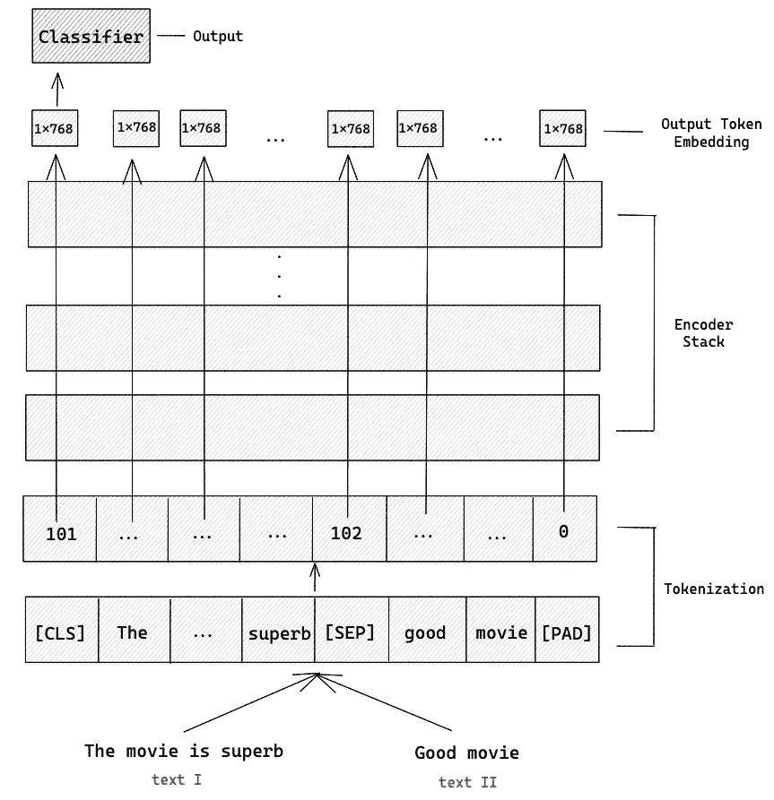

# 使用 BERT 进行语义文本相似度分析

> 原文：[`towardsdatascience.com/semantic-textual-similarity-with-bert-fc800656e7a3`](https://towardsdatascience.com/semantic-textual-similarity-with-bert-fc800656e7a3)

## 如何使用 BERT 计算两段文本之间的语义相似度

[](https://medium.com/@marcellusruben?source=post_page-----fc800656e7a3--------------------------------)[](https://towardsdatascience.com/?source=post_page-----fc800656e7a3--------------------------------) [Ruben Winastwan](https://medium.com/@marcellusruben?source=post_page-----fc800656e7a3--------------------------------)

·发表于 [Towards Data Science](https://towardsdatascience.com/?source=post_page-----fc800656e7a3--------------------------------) ·阅读时间 11 分钟·2023 年 2 月 15 日

--


图片来源于 Leeloo Thefirst: [`www.pexels.com/photo/brown-wooden-ruler-and-colored-pencils-on-papers-8970296/`](https://www.pexels.com/photo/brown-wooden-ruler-and-colored-pencils-on-papers-8970296/)

自从 2017 年由 Google Brain 团队首次推出以来，Transformers 迅速成为计算机视觉和自然语言处理领域中各种应用的**最先进模型**。其卓越的性能促成了多个**最先进模型**的开发，如 BERT 及其变体 distilBERT 和 RoBERTa。

BERT 在各种自然语言处理任务中优于旧的递归模型，如文本分类、命名实体识别（NER）、问答系统，甚至是我们在本文中将重点讨论的任务——语义文本相似度（STS）。

因此，在本文中，我们将探讨如何利用 Sentence Transformers 库训练 BERT 模型以执行 STS 任务。接下来，我们将使用训练好的模型来预测未知数据。但作为开始，我们需要首先了解 STS 任务的实际内容以及我们将用于该任务的数据集。

# 语义文本相似度及数据集

语义文本相似度（STS）指的是一个任务，我们比较一段文本与另一段文本的相似性。


图片由作者提供

我们从模型得到的 STS 任务输出通常是一个浮点数，表示比较的两个文本之间的相似度。

有几种方法可以量化一对文本之间的相似度。让我们以本文将使用的数据集为例，即 [STSB 数据集](https://huggingface.co/datasets/stsb_multi_mt)（使用 CC-Share Alike 4.0 许可）。

```py
!pip install datasets

from datasets import load_dataset
dataset = load_dataset("stsb_multi_mt", name="en", split="train")

print(dataset[0])
>>> {'sentence1': 'A plane is taking off.',
 'An air plane is taking off.',
 'similarity_score': 5.0}

print(dataset[1])
>>> {'sentence1': 'A man is playing a large flute.',
 'sentence2': 'A man is playing a flute.',
 'similarity_score': 3.799999952316284}
```

一对文本之间的相似性被标记为从 1 到 5 的数字；如果一对文本完全不相似，则标记为 1；如果一对文本在语义意义上完全相似，则标记为 5。

然而，有一个问题。当我们想要使用 Sentence Transformers 库训练 BERT 模型时，我们需要将相似性分数标准化到 0 到 1 之间。这可以通过简单地将每个相似性分数除以 5 来实现。

```py
similarity = [i['similarity_score'] for i in dataset]
normalized_similarity = [i/5.0 for i in similarity]
```

现在我们知道了要使用的数据集，接下来让我们继续讨论本文中要使用的模型。

# 如何基于 Transformers 的模型衡量一对文本之间的相似性

基于 Transformers 的模型，如 BERT、distilBERT 或 RoBERTa，期望输入为标记序列。因此，第一步应该是将输入文本转换为标记序列。这个过程称为标记化。

BERT 模型的标记化过程包括两个步骤。首先，将输入文本分割成几个小块，称为标记；一个标记可以是一个词或一个子词。其次，在标记序列的开头和结尾添加两个特殊标记。这两个特殊标记是：

+   **[CLS]:** 这是每个标记序列中的第一个标记

+   **[SEP]:** 这个标记对于给 BERT 提供哪个标记属于哪个序列的提示是很重要的。如果只有一个标记序列，那么这个标记将是序列中的最后一个标记。

根据你事先定义的标记器的最大序列长度，一些 **[PAD]** 标记也会在 **[SEP]** 标记之后被追加。

标记化的输入将被传递到模型中，作为输出，我们将获得每个标记的嵌入向量。每个嵌入向量具有 768 个维度。

如果我们使用 BERT 进行分类目的，那么通常我们会取 **[CLS]** 标记的嵌入向量，并将其传递给最终的 softmax 或 sigmoid 层，这一层将作为分类器。


图片由作者提供

如果我们使用 BERT 进行 STS 任务，工作流程将类似于以下步骤：



图片由作者提供

使用上述工作流程，BERT 在 STS 基准测试中达到了最先进的性能。然而，这种工作流程有一个主要的缺点：可扩展性因素。

假设我们有一段全新的文本。接下来，我们希望在包含 10 万个不同文本的数据库中查询与这段新文本最相似的条目。如果我们使用上面提到的 BERT 架构，那么我们需要将新文本与数据库中的每一个条目进行 10 万次比较。这意味着需要进行 10 万次的标记化过程和前向传递。

这个可扩展性因素的主要问题是 BERT 输出的是每个标记的嵌入向量，而不是每个文本/句子的嵌入向量。


图片由作者提供

如果 BERT 能够给我们提供有意义的句子级嵌入，那么我们可以将每个条目的嵌入保存到我们的数据库中。一旦我们有了新的文本，我们只需通过余弦相似度将新文本的句子嵌入与数据库中每个条目的句子嵌入进行比较，这是一种更快的方法。

这是 Sentence BERT (SBERT) 试图解决的问题。你可以将 SBERT 视为通过应用孪生网络模型架构来微调的 BERT，如下所示：


作者提供的图像

上述架构的问题在于它仍然生成 token 级嵌入。因此，SBERT 在 BERT 的基础上实现了一个额外的池化层。SBERT 实现了三种不同的池化策略：

+   使用 **[CLS]** token 的嵌入

+   使用所有 token 级嵌入向量的均值（这是默认实现）

+   使用时间上的最大 token 级嵌入向量


作者提供的图像

上述插图是 SBERT 模型的最终架构。我们在池化层之后得到的嵌入是一个具有 768 维度的文本向量。然后，可以通过成对距离或余弦相似度对这些嵌入进行比较，这正是 STS 任务的核心。

要实现 SBERT，我们可以使用 `sentence-transformers` 库。如果你还没有安装，可以通过 pip 安装：

```py
!pip install sentence-transformers
```

现在我们将实现基于 BERT 的 SBERT 模型，但你也可以使用如 distilBERT 或 RoBERTa 等 BERT 变体来实现 SBERT，或者加载一个在特定数据集上预训练的模型。你可以在[这里找到所有可用的模型](https://huggingface.co/sentence-transformers)。

```py
from sentence_transformers import SentenceTransformer, models

word_embedding_model = models.Transformer('bert-base-uncased', max_seq_length=128)
pooling_model = models.Pooling(word_embedding_model.get_word_embedding_dimension())
sts_bert_model = SentenceTransformer(modules=[word_embedding_model, pooling_model])
```

从上面的代码片段中，我们首先加载 BERT 模型作为我们的词嵌入模型，然后在 BERT 模型上应用一个池化层，最终获得句子级嵌入。

假设我们有一对句子，我们想要获取每个句子的句子级嵌入。我们可以通过以下步骤做到这一点：

```py
!pip install transformers

from transformers import BertTokenizer

tokenizer = BertTokenizer.from_pretrained('bert-base-uncased')

sentence_1 = [i['sentence1'] for i in dataset]
sentence_2 = [i['sentence2'] for i in dataset]
text_cat = [[str(x), str(y)] for x,y in zip(sentence_1, sentence_2)][0]

input_data = tokenizer(text_cat, padding='max_length', max_length = 128, truncation=True, return_tensors="pt")
output = sts_bert_model(input_data)

print(output['sentence_embedding'][0].size())
>>> torch.Size([768])

print(output['sentence_embedding'][1].size())
>>> torch.Size([768])
```

# 语义文本相似度实现

在本节中，我们将对在前一节中讨论的 STS 任务数据集进行 SBERT 模型训练。

## 模型架构定义

首先定义模型架构。

```py
import torch

class STSBertModel(torch.nn.Module):

    def __init__(self):

        super(STSBertModel, self).__init__()

        word_embedding_model = models.Transformer('bert-base-uncased', max_seq_length=128)
        pooling_model = models.Pooling(word_embedding_model.get_word_embedding_dimension())
        self.sts_model = SentenceTransformer(modules=[word_embedding_model, pooling_model])

    def forward(self, input_data):

        output = self.sts_model(input_data)

        return output
```

上述模型架构类似于我们在前一节中看到的内容。我们使用 BERT 基础模型作为我们的词嵌入模型。该模型的输出仍然是 token 级嵌入。因此，我们需要在其上添加一个池化层。

从我们的 SBERT 模型中得到的最终输出是 768 维的句子级嵌入向量。由于模型的输入是一对文本，因此输出也将是一对 768 维的句子级嵌入向量。

## 数据加载器

数据加载器是创建数据集批次所必需的。这个过程很重要，因为我们不能在训练过程中一次性将整个数据集输入到模型中。

```py
class DataSequence(torch.utils.data.Dataset):

    def __init__(self, dataset):

        similarity = [i['similarity_score'] for i in dataset]
        self.label = [i/5.0 for i in similarity]
        self.sentence_1 = [i['sentence1'] for i in dataset]
        self.sentence_2 = [i['sentence2'] for i in dataset]
        self.text_cat = [[str(x), str(y)] for x,y in zip(self.sentence_1, self.sentence_2)]

    def __len__(self):

        return len(self.text_cat)

    def get_batch_labels(self, idx):

        return torch.tensor(self.label[idx])

    def get_batch_texts(self, idx):

        return tokenizer(self.text_cat[idx], padding='max_length', max_length = 128, truncation=True, return_tensors="pt")

    def __getitem__(self, idx):

        batch_texts = self.get_batch_texts(idx)
        batch_y = self.get_batch_labels(idx)

        return batch_texts, batch_y

def collate_fn(texts):

  num_texts = len(texts['input_ids'])
  features = list()
  for i in range(num_texts):
      features.append({'input_ids':texts['input_ids'][i], 'attention_mask':texts['attention_mask'][i]})

  return features
```

我们已经在上面的部分中了解了我们的数据集是什么样的以及如何准备它，以便模型可以用于 STS 任务。上面的代码正是做了这些事情：

+   每对文本之间的相似度得分被归一化，这将作为模型训练的真实标签。

+   每对文本都使用完全相同的分词器和步骤进行分词，这与我们在前一节中看到的一样。分词后的文本对将作为我们训练模型的输入。

上面的 collate_fn 函数在分词处理后将每对文本分组在一起，以便于批处理，这是一个重要的功能。

## 损失函数

在 STS 任务中，我们的目标是训练一个模型，使其能够根据语义意义区分相似和不相似的文本对。这意味着我们希望模型将不相似的文本对的距离推得更远，同时将相似的文本对的距离保持得更近。

我们可以使用几个常见的损失函数来实现这个目标：余弦相似度损失、三元组损失和对比损失。

通常，我们可以使用对比损失来处理这种情况。然而，对比损失期望我们的标签是二进制的，即如果文本对在语义上相似，标签为 1，否则为 0。与此同时，我们在这个数据集中获得的标签是一个范围在 0 到 1 之间的浮动数值，因此余弦相似度损失将是一个更好的损失函数。

```py
class CosineSimilarityLoss(torch.nn.Module):

    def __init__(self,  loss_fct = torch.nn.MSELoss(), cos_score_transformation=torch.nn.Identity()):

        super(CosineSimilarityLoss, self).__init__()
        self.loss_fct = loss_fct
        self.cos_score_transformation = cos_score_transformation
        self.cos = torch.nn.CosineSimilarity(dim=1)

    def forward(self, input, label):

        embedding_1 = torch.stack([inp[0] for inp in input])
        embedding_2 = torch.stack([inp[1] for inp in input])

        output = self.cos_score_transformation(self.cos(embedding_1, embedding_2))

        return self.loss_fct(output, label.squeeze())
```

这个损失函数接收每个文本的句子级嵌入，然后计算两个嵌入之间的余弦相似度。结果是，损失函数将在向量空间中将不相似的文本对推得更远，同时将相似的文本对保持得更近。

## 模型训练

现在我们已经设置好了模型的架构、数据加载器和损失函数，是时候训练模型了。代码只是一个标准的 Pytorch 训练脚本，如下所示：

```py
from torch.optim import Adam
from torch.utils.data import DataLoader
from tqdm import tqdm

def model_train(dataset, epochs, learning_rate, bs):

    use_cuda = torch.cuda.is_available()
    device = torch.device("cuda" if use_cuda else "cpu")

    model = STSBertModel()

    criterion = CosineSimilarityLoss()
    optimizer = Adam(model.parameters(), lr=learning_rate)

    train_dataset = DataSequence(dataset)
    train_dataloader = DataLoader(train_dataset, num_workers=4, batch_size=bs, shuffle=True)

    if use_cuda:
        model = model.cuda()
        criterion = criterion.cuda()

    best_acc = 0.0
    best_loss = 1000

    for i in range(epochs):

        total_acc_train = 0
        total_loss_train = 0.0

        for train_data, train_label in tqdm(train_dataloader):

            train_data['input_ids'] = train_data['input_ids'].to(device)
            train_data['attention_mask'] = train_data['attention_mask'].to(device)
            del train_data['token_type_ids']

            train_data = collate_fn(train_data)

            output = [model(feature)['sentence_embedding'] for feature in train_data]

            loss = criterion(output, train_label.to(device))
            total_loss_train += loss.item()

            loss.backward()
            optimizer.step()
            optimizer.zero_grad()

        print(f'Epochs: {i + 1} | Loss: {total_loss_train / len(dataset): .3f}')
        model.train()

    return model

EPOCHS = 8
LEARNING_RATE = 1e-6
BATCH_SIZE = 8

# Train the model
trained_model = model_train(dataset, EPOCHS, LEARNING_RATE, BATCH_SIZE)
```

在上面的实现中，我们将模型训练 8 个周期，学习率设置为 10e-6，批量大小设置为 8。这些是你可以调整以适应自己需求的超参数。

如果你运行上面的`model_train`函数，你将看到类似这样的训练进度：


图片由作者提供

## 模型预测

在训练完模型后，我们现在可以使用它来预测未见的数据，即未见的文本对。然而，在将模型输入未见的文本对之前，让我们创建一个函数，以便从模型中获取相似度预测。

```py
# Load test data
test_dataset = load_dataset("stsb_multi_mt", name="en", split="test")

# Prepare test data
sentence_1_test = [i['sentence1'] for i in test_dataset]
sentence_2_test = [i['sentence2'] for i in test_dataset]
text_cat_test = [[str(x), str(y)] for x,y in zip(sentence_1_test, sentence_2_test)]

# Function to predict test data
def predict_sts(texts):

  trained_model.to('cpu')
  trained_model.eval()

  test_input = tokenizer(texts, padding='max_length', max_length = 128, truncation=True, return_tensors="pt")
  test_input['input_ids'] = test_input['input_ids']
  test_input['attention_mask'] = test_input['attention_mask']
  del test_input['token_type_ids']

  test_output = trained_model(test_input)['sentence_embedding']
  sim = torch.nn.functional.cosine_similarity(test_output[0], test_output[1], dim=0).item()

  return sim
```

上面的代码实现包括了数据的所有预处理步骤以及获取模型预测的步骤。

假设我们有一对类似的文本，如下所示：

```py
print(text_cat_test[420])
>>> ['four children are playing on a trampoline.',
 'Four kids are jumping on a trampoline.']

print(predict_sts(text_cat_test[420]))
>>> 0.8608950972557068
```

现在我们只需调用`predict_sts`函数，就可以得到由我们的模型推断出的两个文本之间的余弦相似度。在这个例子中，我们得到的相似度为 0.860。这意味着我们的文本对彼此非常相似。

进行对比，现在让我们用一对不同的文本来测试模型。

```py
print(text_cat_test[245])
>>> ['A man spins on a surf board.', 
'A man is putting barbecue sauce on chicken.']

print(predict_sts(text_cat_test[245]))
>>> 0.05531075596809387
```

如上所示，当我们处理一对不同的文本时，相似度仅为 0.055，这意味着在向量空间中两个文本的嵌入彼此相距较远。这正是我们的模型经过训练的目的。

# 结论

在这篇文章中，我们实现了一个用于语义文本相似度任务的 BERT 模型。具体来说，我们使用了 Sentence-Transformers 库来微调 BERT 模型为 Siamese 架构，从而能够获取每个文本的句子级嵌入。然后，可以通过余弦相似度比较每个文本的句子级嵌入。

你可以在[**这个笔记本**](https://github.com/marcellusruben/medium-resources/blob/main/STS_BERT/STS_BERT.ipynb)中找到本文实现的所有代码。
