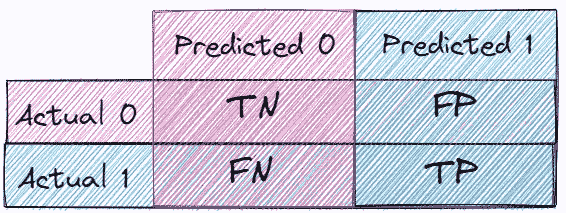
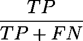
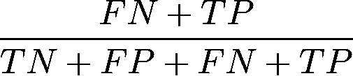
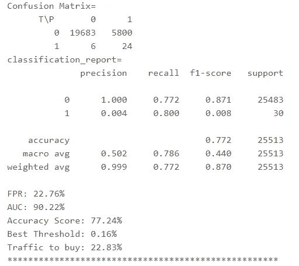

# 预测建模中的敏感性：用更少的流量购买付费客户的指南

> 原文：[`towardsdatascience.com/sensitivity-in-predictive-modeling-a-guide-to-buying-paying-customers-with-less-traffic-c2ab97f6d629?source=collection_archive---------14-----------------------#2023-02-20`](https://towardsdatascience.com/sensitivity-in-predictive-modeling-a-guide-to-buying-paying-customers-with-less-traffic-c2ab97f6d629?source=collection_archive---------14-----------------------#2023-02-20)

## 通过定义和评估模型敏感性，发现一种经济高效的广告活动策略，并提供逐步指南和 Python 实现

 [Dina Bavli](https://medium.com/@dinabavli?source=post_page-----c2ab97f6d629--------------------------------)

·

[关注](https://medium.com/m/signin?actionUrl=https%3A%2F%2Fmedium.com%2F_%2Fsubscribe%2Fuser%2Fae5cca1dfa71&operation=register&redirect=https%3A%2F%2Ftowardsdatascience.com%2Fsensitivity-in-predictive-modeling-a-guide-to-buying-paying-customers-with-less-traffic-c2ab97f6d629&user=Dina+Bavli&userId=ae5cca1dfa71&source=post_page-ae5cca1dfa71----c2ab97f6d629---------------------post_header-----------) 发表在 [Towards Data Science](https://towardsdatascience.com/?source=post_page-----c2ab97f6d629--------------------------------) · 7 分钟阅读 · 2023 年 2 月 20 日

--

图片由 [Joey Kyber](https://unsplash.com/@jtkyber1?utm_source=medium&utm_medium=referral) 提供，来源于 [Unsplash](https://unsplash.com/?utm_source=medium&utm_medium=referral)

本博客文章概述了一种利用付费流量的广告策略。目标是以最小的流量获取付费客户，同时最大化效率。预测建模用于评估和提升模型在实现这一目标上的效果。通过定义和分析模型敏感性，公司可以在节省成本的同时实现预期结果。本文提供了 Python 实现和详细的逐步指南。

我们将涵盖以下内容：

· 介绍

· 理解业务中的混淆矩阵

· 与我谈 Python

· 这是完整代码

· 总结

# 介绍

以较少流量购买付费客户是使用付费流量进行广告的公司面临的常见挑战。目标是通过减少流量同时尽可能获得更多购买客户，从而提高效率。实现这一目标的一种方法是使用预测建模来评估和优化模型的性能。

预测建模涉及使用统计技术根据历史数据预测未来事件或结果。在此背景下，目标是预测哪些客户可能会购买，以便公司可以将广告投放目标对准这些客户。

评估预测模型性能时，可以使用混淆矩阵。混淆矩阵是一种表格，用于定义分类算法的性能，特别是在评估二分类模型时非常有用，如我们讨论的模型。矩阵比较模型的预测结果与实际结果。

评估二分类模型性能的常用指标之一是召回率。召回率是模型预测为购买客户的次数与实际购买客户的数量之比。换句话说，它衡量模型识别正例的能力，在我们的例子中即购买客户。

另一个重要的指标是阈值。阈值是将预测结果视为正例的点。提高阈值会增加假阳性的数量，从而降低精确度。而降低阈值则会增加假阴性的数量，从而降低召回率。

精确度和召回率之间的平衡被称为权衡。找到最佳阈值以最大化召回率同时最小化精确度非常重要，从而在减少流量的情况下获得尽可能多的付费客户。

在本博客文章中，我们将讨论一种以较少流量购买付费客户的策略。通过定义模型敏感性来评估模型，公司可以在实现预期结果的同时节省资金。

# 理解业务中的混淆矩阵

在商业预测建模中，拥有一个能够准确识别购买客户的模型至关重要，因为购买客户通常是稀有而有价值的群体。衡量分类算法准确性的一种方法是使用混淆矩阵。

混淆矩阵是一个表格，通过比较预测值和实际值，总结分类模型的性能。

二分类混淆矩阵中的四个类别是：

+   真正正例（TP）：模型正确预测为正例的正例数量。

+   假正例（FP）：模型错误地将负例预测为正例的数量。

+   真正负例（TN）：模型正确预测为负例的负例数量。

+   假负例（FN）：模型错误地将正例预测为负例的数量。

由作者创建，使用 [`excalidraw.com/`](https://excalidraw.com/)

真正正例（TP）、假正例（FP）、假负例（FN）和真正负例（TN）。TP 表示模型预测为购买客户且预测准确的次数，而 FN 表示模型漏掉的购买客户次数。FP 表示模型预测为非购买客户但预测错误的次数，而 TN 表示模型预测为非购买客户且预测正确的次数。

由作者创建，使用 [`editor.codecogs.com/`](https://editor.codecogs.com/)

召回率指标，也称为敏感性或真正正例率，衡量模型正确识别的实际购买客户的比例。计算公式为 TP/(TP+FN)，表示模型预测为购买客户且预测正确的次数，除以实际购买客户的总数。

由作者创建，使用 [`editor.codecogs.com/`](https://editor.codecogs.com/)

除了测量模型对购买客户的敏感性外，混淆矩阵还可以提供有关从特定阈值可以预期的流量和购买客户的洞察。通过计算 (FN + TP)/(TN + FP + FN + TP)，可以确定在特定阈值下，模型将正确识别的购买客户占所有客户的百分比。

然而，需要注意的是，提高阈值会增加假正例，从而降低精确度。平衡模型的敏感性和精确度的一种方法是设置所需的支付客户百分比，并根据特定模型计算达到该百分比的阈值。

理解混淆矩阵及其指标可以为商业中预测模型的表现提供宝贵的见解，特别是在识别稀有且有价值的客户群体时。通过分析混淆矩阵，企业可以优化其模型，并做出数据驱动的决策，从而获得更好的结果。

# Talk Python To Me

机器学习模型通过各种指标（如准确率、精确度和召回率）进行评估。在某些情况下，实现特定的召回水平比最大化准确率更为重要。在这篇文章中，我们将通过 Python 代码展示如何基于期望的召回水平评估模型。

问题：假设我们有一个二分类问题，我们希望预测用户是否会购买产品。数据集包含 200,000 条记录，其中 30,630 条为正例，169,070 条为负例。我们的目标是训练一个能够以高召回率预测用户是否会购买产品的模型。

解决方案：我们可以使用以下 Python 函数来评估模型在期望召回水平下的性能：

1.  `extract_threshold_given_recall(y_test, probabilities, given_recall)` 该函数接受三个输入：

+   y_test：测试集的目标值

+   probabilities：测试集的预测概率

+   given_recall：期望的召回水平

该函数使用`y_test`和概率计算精度-召回曲线，并返回给定召回值的阈值。

1.  `get_model_results_for_recall(model, X_test, y_test, X_train, y_train, given_recall, with_plots=True)` 该函数接受六个输入：

+   model：训练好的机器学习模型

+   X_test：测试集的特征矩阵

+   y_test：测试集的目标值

+   X_train：训练集的特征矩阵

+   y_train：训练集的目标值

+   given_recall：期望的召回水平

函数首先使用模型计算测试集的预测概率。然后，它使用`extract_threshold_given_recall`函数计算 ROC 曲线和期望召回值的最佳阈值。最后，它计算混淆矩阵、分类报告、FPR、AUC、准确度分数、最佳阈值和购买流量。可选地，函数还可以绘制 ROC 曲线。

输出将如下所示 👇

作者截屏

# 下面是完整代码：

# 总结

在本文中，我们看到了如何评估机器学习模型的性能，以达到所需的召回率水平。通过通过定义模型的敏感度来评估模型，公司可以在节省金钱的同时仍实现他们购买付费客户的期望结果，而不需要增加流量。我们提供了一个 Python 实现，可以帮助通过找到最大化召回率的最佳阈值来实现这一过程。最大化召回率可以减少购买未付费客户，因为召回率是衡量实际正例（即付费客户）被预测模型正确识别为正例的比例的指标。通过优化模型以最大化召回率，模型更擅长识别付费客户，这意味着公司可以避免购买不太可能产生付费客户的流量。这可以降低客户获取成本，并提高公司广告预算的效率。
