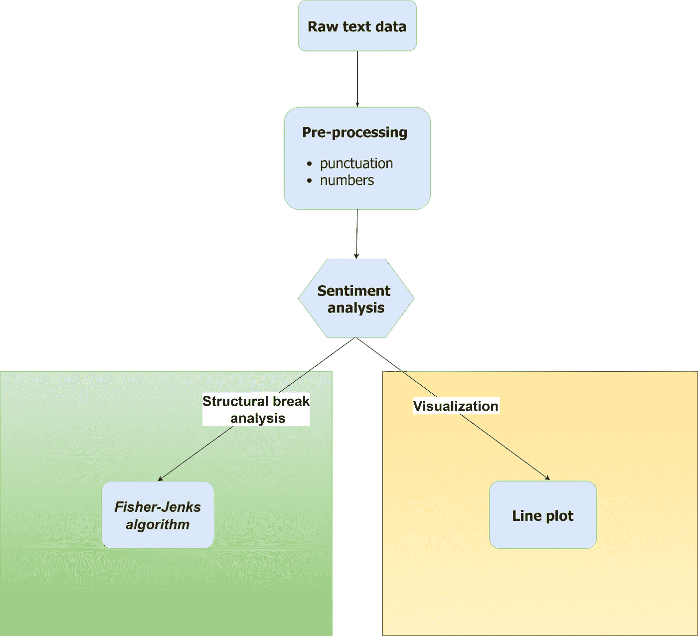
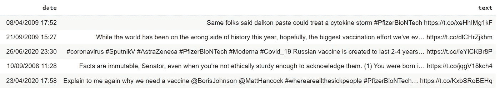
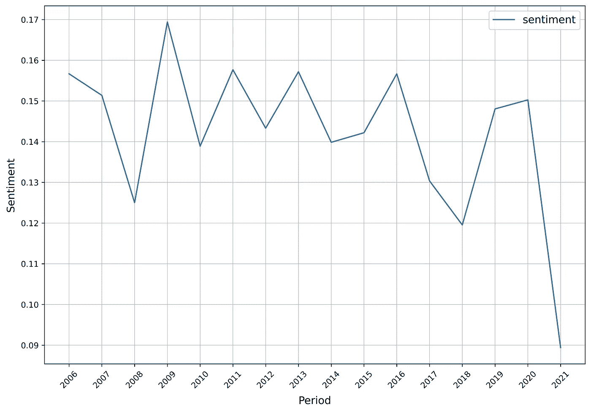
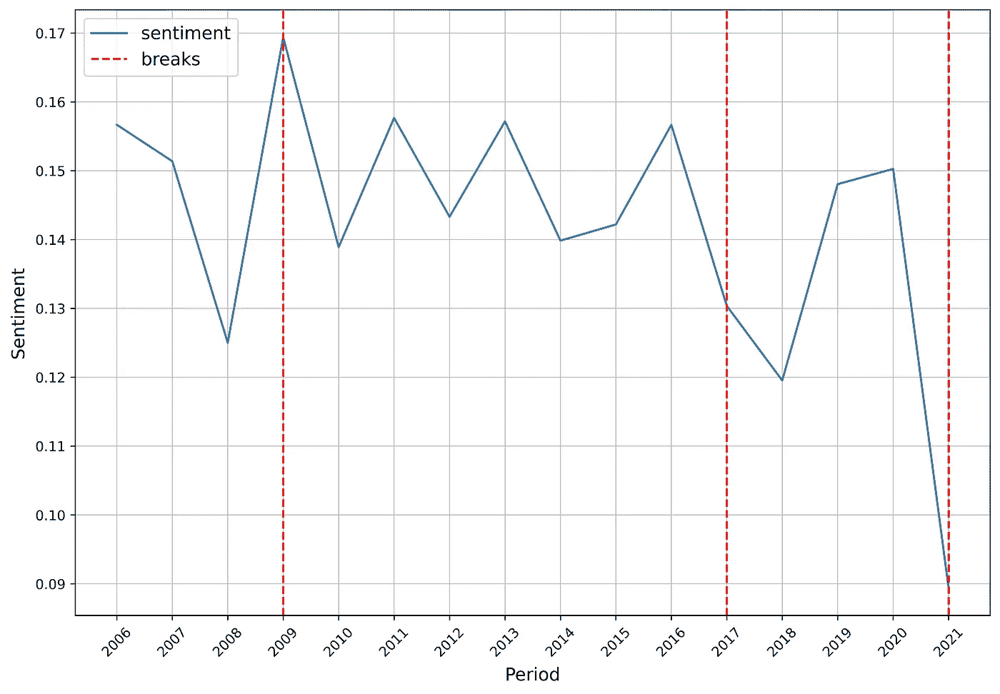
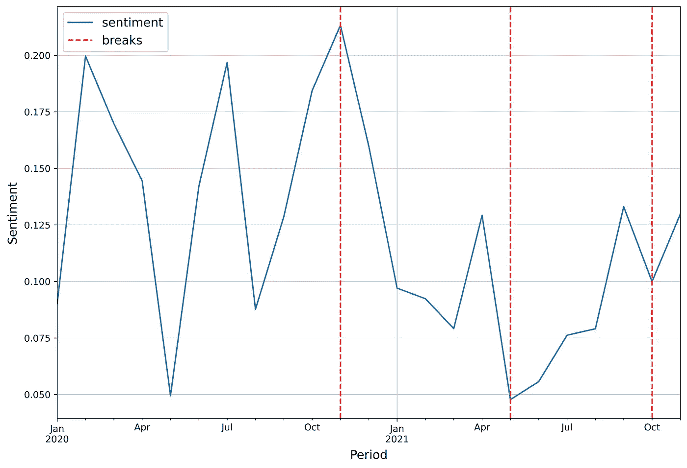
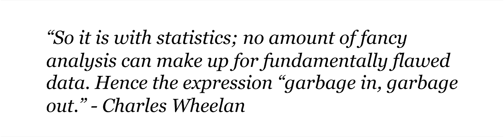

# 情感分析与时间序列文本数据中的结构性断裂

> 原文：[`towardsdatascience.com/sentiment-analysis-and-structural-breaks-in-time-series-text-data-8109c712ca2`](https://towardsdatascience.com/sentiment-analysis-and-structural-breaks-in-time-series-text-data-8109c712ca2)

## Arabica 现在提供结构性断裂和情感分析模块，以丰富时间序列文本挖掘

[](https://petrkorab.medium.com/?source=post_page-----8109c712ca2--------------------------------)[](https://towardsdatascience.com/?source=post_page-----8109c712ca2--------------------------------) [Petr Korab](https://petrkorab.medium.com/?source=post_page-----8109c712ca2--------------------------------)

·发表于 [Towards Data Science](https://towardsdatascience.com/?source=post_page-----8109c712ca2--------------------------------) ·阅读时间 7 分钟·2023 年 3 月 6 日

--


图片由 [Adam Śmigielski](https://unsplash.com/@smigielski?utm_source=medium&utm_medium=referral) 提供，来源于 [Unsplash](https://unsplash.com/?utm_source=medium&utm_medium=referral)

# 介绍

文本数据包含大量定性信息，可以通过各种方法进行量化，包括情感分析技术。这些模型用于识别、提取和量化文本数据中的情感，并广泛应用于商业和学术研究。由于文本通常以时间序列的形式记录，因此文本数据集可能会显示出结构性断裂，因为定量信息可能因多种因素而变化。

作为业务分析师，衡量客户对特定品牌的感知变化可能是关键任务之一。在研究角色中，可能会关注弗拉基米尔·普京公开声明随时间的变化。[**Arabica**](https://pypi.org/project/arabica/) 是一个专门设计用于处理类似问题的 Python 库。它包含以下时间序列文本数据集的探索性分析方法：

+   **arabica_freq** 用于描述性 n-gram 基础的探索性分析（EDA）

+   **cappuccino** 是一个可视化模块，包括 ***热力图***、***词云*** 和 ***折线图***，用于 unigram、bigram 和 trigram 频率

+   **coffee_break** 实现情感和结构性断裂分析。

本文将介绍**Coffee-break**，情感与结构断点分析模块。阅读 [文档](https://arabica.readthedocs.io/en/latest/index.html) 和这两个方法的教程：arabica_freq、[cappuccino](https://medium.com/towards-data-science/visualization-module-in-arabica-speeds-up-text-data-exploration-47114ad646ce)。

***编辑 2023 年 7 月****：Arabica 已更新。请查看* [***文档***](https://arabica.readthedocs.io/en/latest/index.html) *以获取完整的参数列表。*

# 2\. Coffee_break: 算法和结构

*coffee_break* 模块具有简单的后端架构。以下是它的工作原理示意图：



图 1\. Coffee_break 架构。来源：draw.io

原始文本使用 [cleantext](https://pypi.org/project/cleantext/#description) 进行清理，包括标点符号和数字的清除。停用词（语言中最常见但意义不大的词）在**预处理步骤**中不会被移除，因为它们不会对情感分析产生负面影响。然而，使用 `skip` 参数，我们可以移除一系列附加的停用词或不需要的字符串（词或词组），这些不会影响情感分析。

**情感分析** 实现了 **VADER**（[*Valence Aware Dictionary and Sentiment Reasoner*](https://ojs.aaai.org/index.php/ICWSM/article/view/14550)），一种通用的预训练情感分类器 [1]。它是在 Twitter 的社交媒体数据上训练的，但也非常适用于其他类型的数据集。我之前的文章 提供了关于模型和 Python 编码的更详细介绍。

Coffee_break 使用 VADER 的复合指标进行情感评估。总体情感的计算方法如下：


其中 *t* 是聚合周期。总指标范围为 [-1: 1]，正情感接近 1，负情感接近 -1。

聚合的情感创建了一个时间序列，显示出一定程度的时间变化。**结构性断点** 在时间序列中通过 *Fisher-Jenks 算法* 或 *Jenks 优化方法* 识别，最初由 George F. Jenks 提出 [2]。

这是一种基于聚类的方法，旨在找到将值最佳安排到不同类别（聚类）中的方法。`jenks_breaks` 函数通过 `jenkspy` 库实现，返回一个值列表，这些值对应于类别的边界。这些结构性断点在图中标记为垂直线，直观地指示了文本数据时间序列中的断点。

**实施的库** 包括 [Matplotlib](https://pypi.org/project/matplotlib/)（可视化）、[vaderSentiment](https://pypi.org/project/vaderSentiment/)（情感分析）和 [jenkspy](https://pypi.org/project/jenkspy/)（结构性断裂）。[Pandas](https://pypi.org/project/pandas/) 和 [Numpy](https://pypi.org/project/numpy/) 进行处理操作。

# 3\. 使用案例：Twitter 情感分析

让我们在[辉瑞疫苗推文数据集](https://www.kaggle.com/datasets/gpreda/pfizer-vaccine-tweets)上展示编码，该数据集使用 Twitter API 收集。数据包含 11,000 条关于辉瑞与 BioNTech 疫苗的推文，发布于 2006 年至 2021 年之间。该数据集根据[CC0: 公共领域](https://creativecommons.org/publicdomain/zero/1.0/)许可发布，符合[Twitter 开发者政策](https://developer.twitter.com/en/developer-terms/commercial-terms)。

数据包含大量标点符号和数字，在进行任何进一步的步骤之前需要清理：



图 2\. 辉瑞疫苗推文数据集

*coffee_break* 方法的参数是：

```py
def coffee_break(text: str,                 # Text column
                 time: str,                 # Time column
                 date_format: str,          # Date format: 'eur' - European, 'us' - American
                 time_freq: int ='',        # Aggregation period: 'Y'/'M'
                 preprocess: bool = False,  # Clean data from numbers and punctuation
                 skip: [] ,                 # Remove additional stop words
                 n_breaks: int =''          # Number of breaks: min. 2
)
```

# 3\. 1\. 随时间变化的情感分析

我们的数据涵盖了 15 年的时间跨度，包括 Covid-19 危机。关于疫苗接种的公众情绪变化、关于疫苗的虚假新闻以及许多其他因素预计会导致情感随时间发生显著变化。

## 编码

首先，导入*coffee_break*：

```py
from arabica import coffee_break
```

Arabica 读取 **美国风格（*MM/DD/YYYY*）** 和 **欧洲风格** (*DD/MM/YYYY*) 日期和时间格式。数据相当原始，涵盖了 15 年。因此，以月份显示情感并不是很有帮助。

让我们使用以下代码清理数据并按年份汇总情感：

```py
coffee_break(text = data['text'],
             time = data['date'],
             date_format = 'eur',  # Read dates in European format
             time_freq = 'Y',      # Yearly aggregation
             preprocess = True,    # Clean data - punctuation + numbers
             skip = None ,         # No other stop words removed
             n_breaks = None)      # No structural break analysis
```

## 结果

Arabica 返回一张可以手动保存为 PNG 或 JPEG 的图片。



图 3\. 情感分析 — 每年

与此同时，Arabica 返回一个包含相应数据的数据框。只需将函数分配给一个对象即可保存表格：

```py
# generate a dataframe
df = coffee_break(text = data['text'],
                  time = data['date'],
                  date_format = 'eur',
                  time_freq = 'Y',
                  preprocess = True,
                  skip = None ,
                  n_breaks = None)

# save is as a csv
df.to_csv('sentiment_data.csv')
```

> **结果解读：** 我们可以看到，情感在 2021 年辉瑞疫苗开始用于对抗 Covid 后显著下降（图 2）。原因可能是全球大流行以及这些年普遍的负面情绪。

# 3.2\. 结构性断裂分析

接下来，让我们在统计上形式化情感中的结构性断裂。*coffee_break* 能够识别最少 2 个断点。以下代码返回一张带有 3 个断点的图，并附有相应时间序列的表格：

```py
coffee_break(text = data['text'],
             time = data['date'],
             date_format = 'eur', # Read dates in European format
             time_freq = 'Y',     # Yearly aggregation
             preprocess = True,   # Clean data
             skip = None,         # No other stop words removed
             n_breaks = 3)        # 3 breaktpoints
```

图：



图 4\. 结构性断裂分析 — 每年

将数据子集化到两个 Covid 年份（2020–2021），我们可以观察到公众情绪的月度变化，保持 `n_breaks = 3` 并设置 `time_freq = 'M'`：



图 5\. 结构性断裂分析 — 每月

该图表信息不够丰富。这个子集中有 1577 行数据和 24 次时间观测，清理原始数据后，时间序列非常波动。使用基于聚类的算法对如此有限的数据量做出结论并不是一个好主意。

> **结果解释：** 年度频率的结构性断裂分析在统计上确认了我们从图 3 中的情感时间序列中看到的情况。Fisher-Jenks 算法识别出了三个结构性断裂点——分别在 2009 年、2017 年和 2021 年。我们只能猜测 2009 年以及 2016 年至 2018 年之间的下降原因。2021 年的下降可能是由于 Covid-19 危机造成的。

# 4\. 结构性断裂分析的最佳实践

让我们总结一下*coffee_break*的最有效使用建议：

+   如果对应的时间序列中存在 NAN 值，请不要使用结构性断裂分析。

+   在较长时间序列中（至少 12 次观测），识别 3 个以上的断裂点是有意义的。

+   断裂点识别在高度波动的数据集中可能效果不好。剧烈变化的原因可能不是情感的变化，而是数据的质量。

+   分析的准确性仅与基础情感数据的质量有关。在实际使用之前，简要探索原始文本数据集，以检查 (1) 是否在每个时期的行数上不太不平衡，以及 (2) 是否包含足够的情感评估信息（文本不太短，且不包含大多数数字和特殊字符）。



作者提供的图片

# 结论

*coffee_break* 的一个缺点是目前它仅适用于**英文文本**。由于 Arabica 主要是一个基于 Pandas 的包（包括某些部分的 Numpy 向量化），*coffee_break* 在评估大型数据集时相对较慢。它在处理最多约 40 000 行的数据集时比较高效。

阅读这些教程，了解更多关于 n-gram 和情感分析以及时间序列文本数据可视化的信息：

+   [***Arabica 中的可视化模块加速文本数据探索***](https://medium.com/towards-data-science/visualization-module-in-arabica-speeds-up-text-data-exploration-47114ad646ce)

+   ***客户满意度测量：N-gram 和情感分析***

+   [***研究文章元数据描述变得快捷而简单***](https://pub.towardsai.net/research-article-meta-data-description-made-quick-and-easy-57754e54b550)

+   [***Python 中最受欢迎的预训练情感分类器***](https://medium.com/towards-data-science/the-most-favorable-pre-trained-sentiment-classifiers-in-python-9107c06442c6)

*Coffee_break* 是与布尔诺理工大学的 Jitka Poměnková教授合作开发的。这个教程中的完整代码在我的[GitHub](https://github.com/PetrKorab/Arabica/blob/main/docs/examples/coffee_break_examples.ipynb)上。

*你喜欢这篇文章吗？你可以邀请我* [*喝咖啡*](https://www.buymeacoffee.com/petrkorab) *来支持我的写作。你也可以订阅我的* [*电子邮件列表*](https://medium.com/subscribe/@petrkorab) *以便接收到我新文章的通知。谢谢！*


照片由[Content Pixie](https://unsplash.com/@contentpixie?utm_source=medium&utm_medium=referral)提供，来源于[Unsplash](https://unsplash.com/?utm_source=medium&utm_medium=referral)。

# 参考文献

[1] Hutto, C., Gilbert, E. (2014). [VADER: 一种简约的基于规则的社交媒体文本情感分析模型](https://ojs.aaai.org/index.php/ICWSM/article/view/14550)。*国际 AAAI 网络与社交媒体会议论文集*，*8*(1)，216–225。

[2] Jenks, G.F. (1977). *最优数据分类用于分层地图*。堪萨斯大学地理气象系，临时论文第 2 号。
