# 九月还是“Septemquake”？用 R 分析和可视化墨西哥的地震活动数据

> 原文：[`towardsdatascience.com/september-or-septemquake-analysis-and-visualization-of-seismic-activity-data-in-mexico-with-r-f051be5f1fb`](https://towardsdatascience.com/september-or-septemquake-analysis-and-visualization-of-seismic-activity-data-in-mexico-with-r-f051be5f1fb)

## 如何使用 SSN（国家地震学服务）数据分析和可视化墨西哥的地震历史

[](https://cosmoduende.medium.com/?source=post_page-----f051be5f1fb--------------------------------)[](https://towardsdatascience.com/?source=post_page-----f051be5f1fb--------------------------------) [Saúl Buentello](https://cosmoduende.medium.com/?source=post_page-----f051be5f1fb--------------------------------)

·发布于 [Towards Data Science](https://towardsdatascience.com/?source=post_page-----f051be5f1fb--------------------------------) ·13 分钟阅读·2023 年 9 月 21 日

--

当我在去年 9 月 30 日开始撰写这篇文章时，又一个月结束了，但这不是一个普通的月份。对许多墨西哥人来说，这个特别的月份常常让人忧虑，因为这个月份经常见证了我们国家因地震而动摇的情景，通常这些地震的强度都很大。本文旨在通过数据分析和可视化，为读者提供有关墨西哥地震历史的有价值的见解。虽然它不做预测或制定政策，但它提供了对地震趋势和模式的深入了解。通过获得这些知识，读者可以更好地为地震事件做好准备，并为建筑和灾难准备方面的知情决策做出贡献。

一个特别的日期突显出来，并激励了这篇文章：**9 月 19 日**。在 1985 年这一天，墨西哥经历了有记录以来最具破坏性的地震，震中在里氏 8.1 级。大约有 40,000 人遇难，近 4,000 人从由于构造运动而坍塌的无数建筑物和房屋的废墟中被救出。


图片来源 [Mr. Dimentio](https://commons.wikimedia.org/wiki/File:Album_de_imagenes_del_terremoto_de_1985_UsoLibre.png) 于 [Wikimedia Commons](https://commons.wikimedia.org/wiki/Main_Page)

自那时起已经过去了 32 年，2017 年，墨西哥人再次在 9 月 19 日被 7.1 级里氏震级的地震所震惊，这让许多经历过 1985 年灾难的人再次感受到了旧伤。在 2017 年之前，我无法理解为什么我的父母在听到墨西哥城安装的地震警报声时会如此紧张，这种警报至少可以让我们提前几秒钟预知即将发生的事情。在 2017 年之前，我对警报声并不认真对待，但在经历了在九楼（我曾经工作的地方）的地震后，从那里你可以看到附近建筑物倒塌时的尘土云，听到恐惧的人们的统一尖叫，同时建筑物发出如同要断裂的声音，震动把你摔倒在地，这一切终身难忘。

[## 2017 年 9 月 19 日在墨西哥城的地震 #地震 #earthquake #Sismo #temblor](https://www.youtube.com/shorts/0Yd5XzQeBqE?source=post_page-----f051be5f1fb--------------------------------)

### 编辑描述

[www.youtube.com](https://www.youtube.com/shorts/0Yd5XzQeBqE?source=post_page-----f051be5f1fb--------------------------------)

当天在墨西哥录得近 400 人遇难，7000 多人受伤。在地震发生时，我的女友（现在是我们美丽小宝贝的母亲）和我紧紧相拥，忘记了那天早晨的争执。从那时起，每当听到地震警报声，都会让我浑身发抖，就像现在生活在墨西哥城的许多人一样。

不管怎样，我们来到了 2022 年，去年 9 月 19 日下午 1 点左右，我们再次被响遍全城的地震警报惊醒，预示着即将发生的是 7.7 级里氏震级的地震。尽管为了防范这样的事件建造了更坚固、更雄伟的房屋和建筑，但自然力量永远没有免疫保证。这次事件中，至少有两人报告遇难，3000 多处财产受到影响。这让许多人产生了疑问：这个日期有什么特别之处吗？为什么墨西哥在这个特定的日子会发生强震？这会不会是阿兹特克神灵要求牺牲的惩罚？

> — 这是发生在九月。不是今年的九月，而是去年的。还是说是前年，梅利顿？
> 
> — 不，那是在去年。
> 
> — 是的，我现在记起来了。是在去年九月二十一号。嘿，梅利顿，九月二十一号不是正是地震那天吗？
> 
> — 那是稍早一点。我认为是在十八号。
> 
> — 你说得对。我那时在图斯卡库斯科（Tuzcacuexco）。我甚至看到房屋像太妃糖一样倒塌，扭曲并做出各种面部表情，然后整个墙壁轰然倒下。
> 
> … 摘自 1955 年墨西哥作家胡安·鲁尔福（Juan Rulfo）的故事《崩溃之日》（“El día del derrumbe”）。

本文旨在通过数据分析，为读者提供对墨西哥人特别是在这个月广泛讨论的问题的更全面的理解。需要指出的是，墨西哥的地震活动非常频繁，位于五个不同的构造板块交汇处，使其比其他国家更为脆弱。

## 我可以在哪里获得可靠的墨西哥地震活动数据？

有许多来源可以获得地震活动的历史数据；你使用的数据集已获得商业用途许可。幸运的是，我推荐一个非常可靠的来源，即国家地震服务中心（SSN）。SSN 维护了全国范围的地震监测网络，并提供适合商业用途的数据许可证。他们的数据集涵盖了从 1900 年至今的记录，并且几乎即时更新新的地震事件记录。

你可以在他们的网站上下载完整的历史记录 CSV 格式的数据，或者选择感兴趣的特定时间段：[`www2.ssn.unam.mx:8080/catalogo/`](http://www2.ssn.unam.mx:8080/catalogo/)

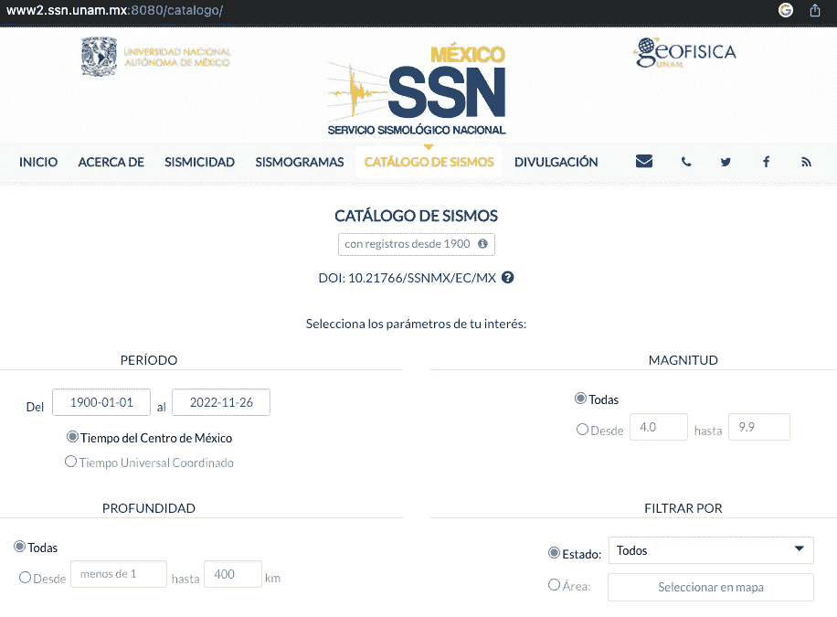

九月还是“震动九月”？使用 R 对墨西哥的地震活动数据进行分析和可视化 — SSN 网站截图（作者提供的图像）

## 数据加载和准备

在新的 R 脚本中，你将首先加载相关的库来进行分析。除了从国家地震服务中心网站提取的数据外，为了实用起见，你还需要从 INEGI 门户网站下载墨西哥共和国的政治分区地图，网址是 [`www.inegi.org.mx/app/mapas/`](https://www.inegi.org.mx/app/mapas/) 以 SHP 格式提供。众所周知，你可以在 R 中处理这种格式。最后，你还将获得一个州名和标识符的列表，以便在后续与其他内容结合使用。

```py
# LOADING LIBRARIES

library(data.table)
library(magrittr)
library(sf)
library(tmap)
library(sp)
library(ggpubr)
library(ggplot2)
library(lattice)

# PALETTE & FUNCTION 

myColors <- c('#d9ef8b','#91cf60','#fee08b','#fc8d59','#d73027','#1a9850')

decade <- function(date){
  year <- data.table::year(date)
  y <-year - year %% 10
  return(y)
}

# LOAD DATA AND SHAPES

dataSSN <- fread("SSNMX_catalogo_19000101_20221126.csv", header = T, skip = 4, sep=",", fill=T)

mxMap <- st_read("dest20gw/dest20gw.shp")

statesNames <- fread("nombres_estados.csv", encoding = "UTF-8",header = T)

skipLast <- grep(pattern = "Fecha y hora local",as.character(unlist(dataSSN[,1])))

dataSSN <- dataSSN[-skipLast:-dim(dataSSN)[1],]

names(dataSSN)<- tolower(names(dataSSN))

names(dataSSN)<- gsub("[[:space:]]", ".", names(dataSSN))
```

你还将按震级对地震数据进行分类，并将 CSV 数据格式化以提高可读性，因为它包含了如震级、日期、震中和其他详细信息等精确数据。

```py
# ADJUSTMENTS TO DATA

dataSSN <- dataSSN %>% 
  .[, state := gsub(".*,\\s*", "\\1", referencia.de.localizacion)] %>%  
  .[, state := gsub("[[:space:]]","", state)] %>% 
  .[, state := fifelse(state=="N", "NL", state)] %>% 
  .[, date  := as.Date(fecha)] %>% 
  .[, intensity := suppressWarnings( as.numeric(magnitud))] %>% 
  .[, intensityRanges := fcase(
    intensity>=0 & intensity<= 2 , "0-2", intensity>=2 & intensity<= 4 , "2-4",
    intensity>=4 & intensity<= 6 , "4-6", intensity>=6 & intensity<= 8 , "6-8",
    intensity>=8 & intensity<= 10 , "8-10", intensity>10, "10 +",
    is.na(intensity), "Unmeasured magnitude")] %>% 
  .[, intensityRanges := factor(intensityRanges, levels = c("0-2", "2-4", "4-6", 
                                                            "6-8", "8-10","10+", 
                                                            "Unmeasured magnitude"))] %>% 
  .[, theDecade := decade(date)] %>% 
  .[, monthDate := as.Date(cut(date, "month"))] %>% 
  .[, weekDate := as.Date(cut(date, "week"))] %>% 
  .[, month := data.table::month(date)] %>% 
  .[, monthName := format(date, "%B")] %>% 
  .[, dayName := format(date, "%A")] %>%
  .[, monthDay := format(as.Date(date), "%m-%d")] %>% 
  .[, year := data.table::year(date)] %>% 
  .[, day := data.table::mday(date)] %>% 
  .[date >= "1900-01-01"]

dataSSN <- merge(dataSSN, statesNames, by.x="state", by.y="id.estado")
```

## 自 1900 年至今记录的地震活动

使用你的数据，你可以大致查看自 1900 年以来记录到的地震数量是否有所增加或减少。

```py
# SEISMIC ACTIVITY SINCE 1900

dataSSN %>% 
  .[, .(seismicCount = .N), by=date] %>% 
  ggplot(aes(x= date, y= seismicCount)) +
  geom_line(color="darkcyan") +
  xlab("Year") +
  ylab("Earthquakes count") +
  ggtitle("Earthquakes per day reported by the SSN", "Since 1900 to 2022") 
```

请注意，虽然历史数据可以追溯到 1900 年，但直到 2010 年之后，国家才安装了更多的地震传感器。这清楚地显示了记录到的地震数量的增长，但这并不一定表明地震活动的增加。

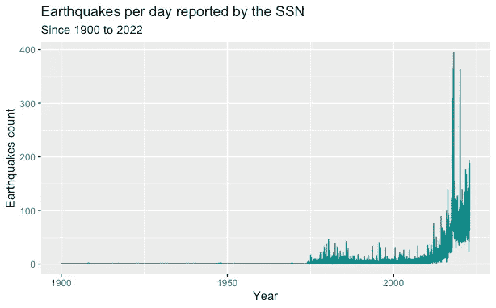

九月还是“震动九月”？使用 R 对墨西哥的地震活动数据进行分析和可视化 — RStudio 绘图“自 1900 年至今记录的地震活动”（作者提供的图像）

## 哪种震级主导了墨西哥的地震活动？

正如你之前按震级对数据进行了分类，现在你可以可视化并更具体地了解记录到的地震震级随时间的变化。

```py
# SEISMIC ACTIVITY SINCE 1900 BY INTENSITY

timeSeries1 <- dataSSN %>% 
  .[, .(seismicCount = .N), by=list(date, intensityRanges)] %>% 
  na.omit %>% 
  ggplot(aes(x= date, y= seismicCount, color=intensityRanges)) +
  geom_line(size=1)+
  scale_color_manual(values= myColors, name="Richter Scale") +
  theme(legend.position="top")+
  ggtitle("Earthquakes per day reported by the SSN", "Magnitude ranges since 1900 to 2022")+
  xlab("Year") +
  ylab("Earthquakes count") 

timeSeries2 <- dataSSN %>% 
  .[, .(seismicCount = .N), by=list(date, intensityRanges)] %>% 
  na.omit %>% 
  ggplot(aes(x= date, y= seismicCount, color=intensityRanges)) +
  geom_line(size=1)+
  scale_color_manual(values= myColors) +
  scale_x_date(breaks = "4 year")+
  theme(legend.position="top", axis.text.x = element_text(angle=90))+
  xlab("Year") +
  ylab("Earthquakes count") +
  facet_wrap(~intensityRanges, scales = "free_y") 

ggarrange(timeSeries1, timeSeries2,
          nrow = 2)
```

正如你所见，震中震级在里氏 2 到 4 级的地震占据主导地位。再提醒一下，在 2000 年之前，安装的传感器不多。

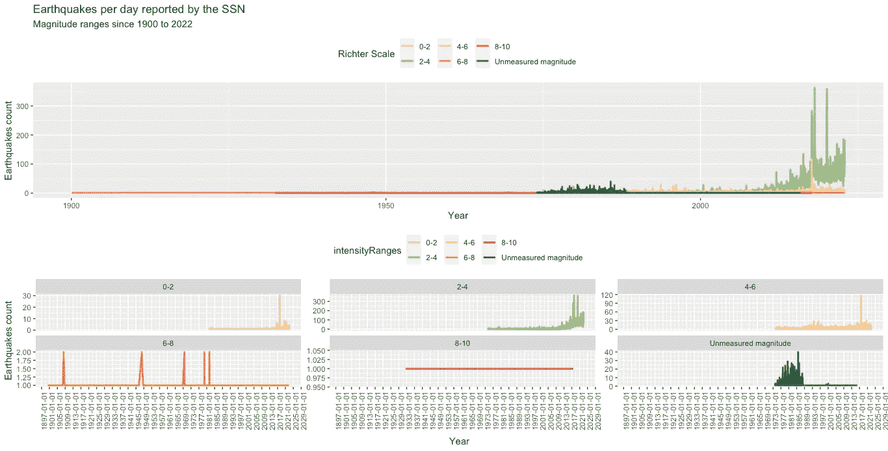

九月还是“九月震”？使用 R 进行的墨西哥地震活动数据分析和可视化——RStudio 图表“哪一月份地震活动最强？”（作者提供的图像）

## 墨西哥发生了多少次震级超过 6 的地震？

你还可以从总体上查看地震的发生情况，特别是震级超过 6 的地震（被视为高风险地震）。

```py
# SEISMIC ACTIVITY SINCE 1900 BY INTENSITY (>6)

dataSSN %>% 
  .[intensity>6] %>% 
  .[, .(seismicCount = .N), by=list(date, intensityRanges)] %>%
  ggplot(aes(x= (date), y= seismicCount)) +
  geom_segment( aes(x=(date), xend=date, y=0, yend=seismicCount, color=intensityRanges)) +
  geom_point(size=3, alpha=0.6, aes(color= intensityRanges))+
  scale_color_manual(values= c("darkcyan", "darkred"), name="Range Magnitude Richter Scale") +
  scale_x_date(breaks = "5 years")+
  scale_y_continuous(breaks = seq(0,2,1))+
  theme(legend.position="top", axis.text.x = element_text(angle=45))+
  ggtitle("Earthquakes reported by the SSN", "Intensity > 6 (Since 1900 to 2022)")+
  xlab("Year") +
  ylab("Earthquakes count")
```

虽然在你获得的图像中可能不易察觉，但放大后会显示震级达到 8 的地震，这些地震确实给国家带来了震动。

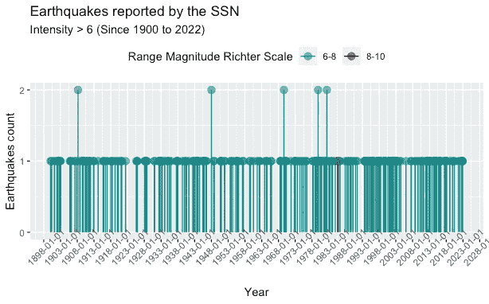

九月还是“九月震”？使用 R 进行的墨西哥地震活动数据分析和可视化——RStudio 图表“墨西哥发生了多少次震级超过 6 的地震？”（作者提供的图像）

## 墨西哥哪个月份地震活动最强？

根据获得的数据，你可以回答这个问题，很多人在九月时曾关心过。值得注意的是，目前没有严格的科学依据解释为何特定月份的地震活动会增加。

```py
# SEISMIC ACTIVITY REPORTED SINCE 1900 (PER MONTH)

dataSSN %>% 
  .[, .(seismicCount = .N), by=list(month, monthName)] %>% 
  .[order(month)] %>% 
  ggplot(aes(x= reorder(monthName, month), y= seismicCount)) +
  geom_bar(stat = "identity") +
  geom_col(aes(fill = seismicCount)) +
  theme(axis.text.x = element_text(angle=45)) +
  geom_label(aes(reorder(monthName, month), y= seismicCount,
                 label=seismicCount) ) +
  xlab("Month") +
  ylab("Earthquakes count")+
  ggtitle("Earthquakes reported by the SSN", "Earthquakes per month (Since 1900 to 2022)")
```

然而，数据本身说明了问题，显示出九月确实记录了比其他月份更多的地震。

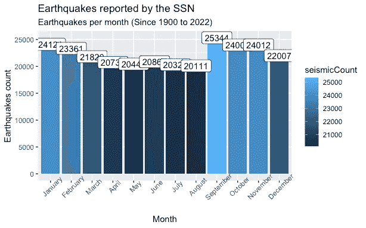

九月还是“九月震”？使用 R 进行的墨西哥地震活动数据分析和可视化——RStudio 图表“哪个月份地震活动最强？”（作者提供的图像）

## 按强度分组的墨西哥地震活动最高的月份？

假设你想更深入地了解先前获得的结果。你可以按强度分组，以确定除了九月是地震活动最强的月份外，九月是否也与较高的震级相关。

```py
# SEISMIC ACTIVITY REPORTED SINCE 1900 (PER MONTH AND INTENSITY)

rangesMonth <- dataSSN %>% 
  .[, .(seismicCount = .N), by=list(monthName, month, intensityRanges)] %>% 
  ggplot(aes(x= reorder(monthName, month), y= seismicCount, fill= intensityRanges)) +
  geom_bar(stat = "identity") +
  scale_fill_manual(name = "Response", values = myColors) +
  theme(axis.text.x = element_text(angle=45), legend.position="top") +
  xlab("Month") +
  ylab("Earthquakes count")+
  ggtitle("Earthquakes reported by the SSN", "Earthquakes per month (Grouped by intensity since 1900 to 2022)")

rangesMonth
```

下面的图表可能不会显示震级 8 的地震，但它们确实存在，6 月份有一次，9 月份有两次。如果你愿意，可以使用 **plotly** 进行更明显的可视化。

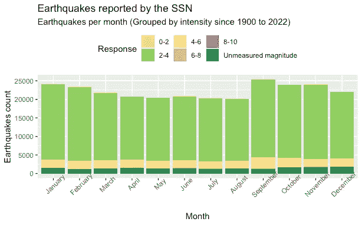

九月还是“九月震”？使用 R 进行的墨西哥地震活动数据分析和可视化——RStudio 图表“按强度分组的墨西哥地震活动最强的月份？”（作者提供的图像）

## 墨西哥哪个月份的地震活动最强，震级超过 6 度？

考虑到震中达到 6 度或更高的地震通常更为显著，假设你想更深入地研究之前获得的图表，以筛选出那些明显超过 6 度的地震。

```py
# SEISMIC ACTIVITY REPORTED SINCE 1900 (GROUPED BY INTENSITY >6)

dataSSN %>% 
  .[intensity>6] %>% 
  .[, .(seismicCount = .N), by=list(monthName, month, intensityRanges)] %>% 
  ggplot(aes(x= reorder(monthName, month), y= seismicCount, fill= intensityRanges)) +
  geom_bar(stat = "identity")+
  scale_y_continuous(breaks = seq(0,100,1))+
  theme(axis.text.x = element_text(angle=45), legend.position="top")+
  scale_fill_manual(values= c("darkcyan", "darkred"), name="Range Magnitude Richter Scale")+  
  xlab("Month") +
  ylab("Earthquakes count")+
  geom_label(aes(reorder(monthName, month), y= seismicCount, label=seismicCount) )+
  ggtitle("Earthquakes reported by the SSN", "Earthquakes per month (Intensity > 6 since 1900 to 2022)")
```

这一次，情况变得更加清晰，尤其是震级超过 8 度的地震发生的月份。12 月似乎是震级超过 6 度的地震最多的月份。

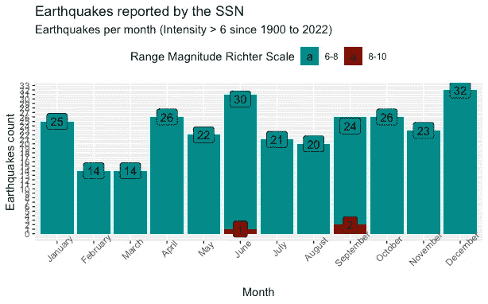

9 月还是“九月地震”？使用 R 对墨西哥的地震活动数据进行分析和可视化 — RStudio 绘图“哪一个月份的地震活动最高，震级超过 6 度？”（图片由作者提供）

## 哪一天的“生日”地震数量最多，震级超过 6 度？

假设你还想了解在同一天和同一个月份但不同年份中发生了三次或更多次震级达到 6 度或以上的地震的日期。

```py
# DAYS THAT AN EARTHQUAKE OF INTENSITY >6 HAS BEEN REPEATED AT LEAST 3 OR MORE TIMES

dataSSN %>% 
  .[intensity>=6] %>%
  .[, .(seismicCount = .N), by=list(month, monthDay)] %>% 
  .[order(month)] %>% 
  .[seismicCount>=3] %>%
  ggplot(aes(x= reorder(monthDay, month), y= seismicCount)) +
  geom_bar(stat = "identity", fill="darkcyan")+
  geom_col(aes(fill = seismicCount)) +
  theme(axis.text.x = element_text(angle=45)) +
  geom_label(aes(reorder(monthDay, month), y= seismicCount, label=seismicCount) ) +
  xlab("Date (month-day)") +
  ylab("Earthquakes count")+
  ggtitle("Earthquakes reported by the SSN", "Dates that have occurred three or more earthquakes on the same day 
and month but different year (Intensity >= 6 since 1900 to 2022)")
```

你会看到 6 月 7 日以七次符合条件的地震居于榜首。我们是否应该在这些日期佩戴头盔并避免高楼？

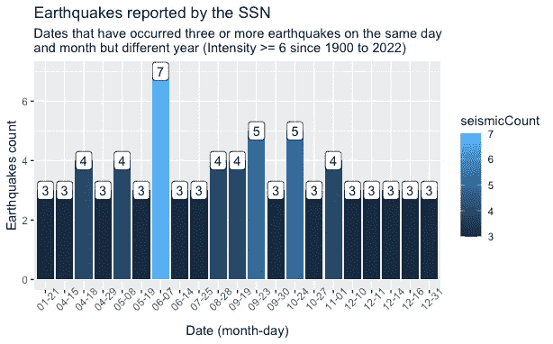

9 月还是“九月地震”？使用 R 对墨西哥的地震活动数据进行分析和可视化 — RStudio 绘图“哪一天的‘生日’地震数量最多，震级超过 6 度？”（图片由作者提供）

## 一周中的哪一天墨西哥的地震活动最高，震级超过 7 度？

这可能是另一个你可以通过建立震中等于或大于 7 度的地震发生情况来回答的问题。

```py
# WEEKDAYS THAT AN EARTHQUAKE OF INTENSITY >7 HAS BEEN REPEATED MORE TIMES

dataSSN %>% 
  .[intensity>=7] %>%
  .[order(dayName)] %>% 
  .[, .(seismicCount = .N), by=list(dayName)] %>% 
  ggplot(aes(x= dayName, y= seismicCount)) +
  geom_bar(stat = "identity", fill="darkcyan")+
  geom_col(aes(fill = seismicCount)) +
  theme(axis.text.x = element_text(angle=45)) +
    xlab("Mes") +
  ylab("Conteo Sismos")+
  ggtitle("Earthquakes reported by the SSN", "Weekdays with greater occurrences of earthquakes (Intensity >= 7 since 1900 to 2022)")
```

你将得到如下图表，显示出星期五记录的地震活动最高，而星期天的记录较少。

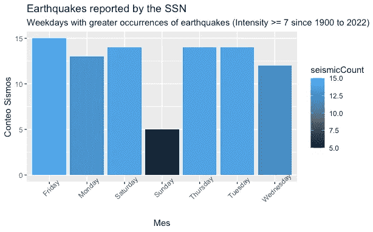

9 月还是“九月地震”？使用 R 对墨西哥的地震活动数据进行分析和可视化 — RStudio 绘图“一周中的哪一天墨西哥的地震活动最高，震级超过 7 度？”（图片由作者提供）

## 墨西哥地震活动图

在这样的练习中，拥有地理参考总是很有用。你可以创建一张地图，以概括地可视化该国的地震活动。

```py
# MAP SEISMIC ACTIVITY BY STATE 1 

dataSSN %>% 
  .[, .(seismicCount = .N), by=list(nombreEstado)] %>% 
  merge(., mxMap, by.x="nombreEstado", by.y="NOM_ENT") %>% 
  st_as_sf() %>% 
  ggplot()+
  geom_sf(aes(fill = seismicCount)) + 
  ggtitle("Earthquakes reported by the SSN", "Map of seismic activity in Mexico (Since 1900 to 2022)")
```

结果会突出显示瓦哈卡，该地区的地震数量最高。

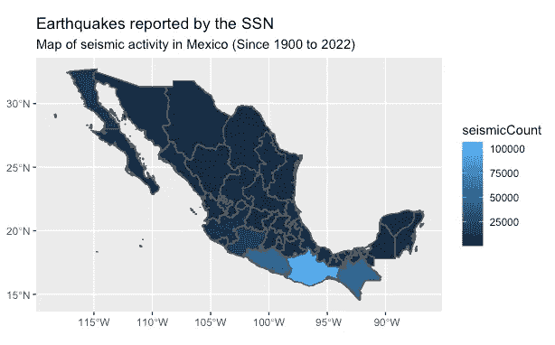

9 月还是“九月地震”？使用 R 对墨西哥的地震活动数据进行分析和可视化 — RStudio 绘图“墨西哥地震活动图”（图片由作者提供）

如果你愿意，可以为你的地图提供更具美感的格式。

```py
# MAP SEISMIC ACTIVITY BY STATE 2

tmap_style("classic")

statesMap <- dataSSN %>% 
  .[, .(seismicCount = .N), by=list(nombreEstado)] %>% 
  merge(., mxMap, by.x="nombreEstado", by.y="NOM_ENT") %>% 
  st_as_sf() %>% 
  tm_shape() +
  tm_polygons("seismicCount", 
              title = "Number of earthquakes range")+
  tm_layout("Number of earthquakes 
              by State (Since 1900 to 2022)", title.position = c('right', 'top'))

statesMap
```

你可以试验**“tmap_style()”**函数的可用样式，以选择你喜欢的样式。

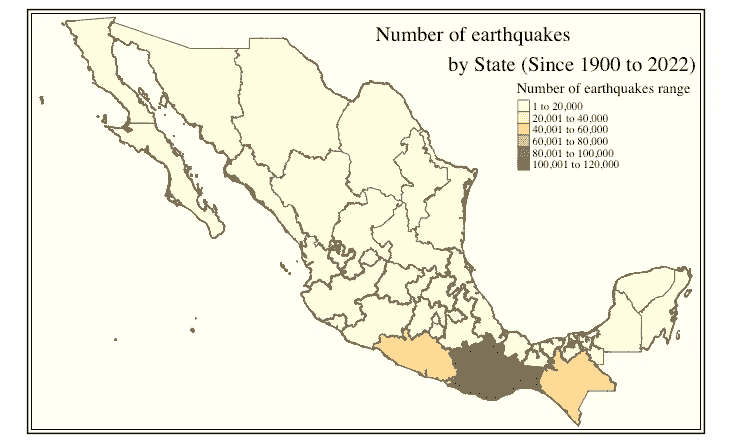

9 月还是“九月地震”？使用 R 对墨西哥的地震活动数据进行分析和可视化 — RStudio 绘图“墨西哥地震活动图”（图片由作者提供）

## **哪个州的地震活动最强？**

尽管您已经获得了一个地图来回答这个问题，但制作另一个图表来用更多细节加强结果也不会有坏处。

```py
# SEISMIC ACTIVITY GROUPED BY STATE 

paretoData <- dataSSN %>% 
  .[, .(seismicCount = .N), by=list(nombreEstado)]  %>% 
  .[, total := sum(seismicCount)] %>% 
  .[order(seismicCount, decreasing = T)] %>% 
  .[, accumulatedSum := cumsum(seismicCount)] %>% 
  .[, percentage := seismicCount/total] %>% 
  .[, accumulatedPercentage := accumulatedSum/total]

listPercentage <- 0:100

statesBars <- ggplot(data= data.frame(paretoData), aes(x=nombreEstado)) +
  geom_bar(aes(x=reorder(nombreEstado, -seismicCount), y=seismicCount), fill='darkcyan', stat="identity") + 
  scale_y_continuous(limits = c(0, (max(paretoData$seismicCount))+15000 ))+
  theme(axis.text.x = element_blank(), axis.title.x = element_blank())+
  ylab("Earthquakes count")+
  geom_text(aes(reorder(nombreEstado, -seismicCount), y= seismicCount, label=seismicCount), vjust=-1, angle=45, hjust=0)+
  ggtitle("Earthquakes reported by the SSN", "Earthquakes grouped by State (Since 1900 to 2022)")

statesPercentage <- ggplot(data= data.frame(paretoData)) +
  geom_bar(aes(x=reorder(nombreEstado, -seismicCount), y=percentage), fill='darkcyan', stat="identity") + 
  theme(axis.text.x = element_text(angle=45, hjust=1))+
  scale_y_continuous(labels = scales::percent, breaks = seq(0,1,0.1), limits=c(0,0.7))+
  xlab("State") +
  ylab("Earthquakes count")+
  geom_text(aes(x= reorder(nombreEstado, -seismicCount), y = percentage,
                label=paste0(round(percentage*100, 3),"%"), vjust=0, angle=45, hjust=0))+
  ggtitle(" ", "Percentage of earthquakes by State (Since 1900 to 2022)")

ggarrange(statesBars, statesPercentage, nrow = 2)
```

如果您在寻找一个可以摆脱地震担忧的地方，尤卡坦、克雷塔罗、阿瓜斯卡连特斯或杜兰戈可能是不错的选择。

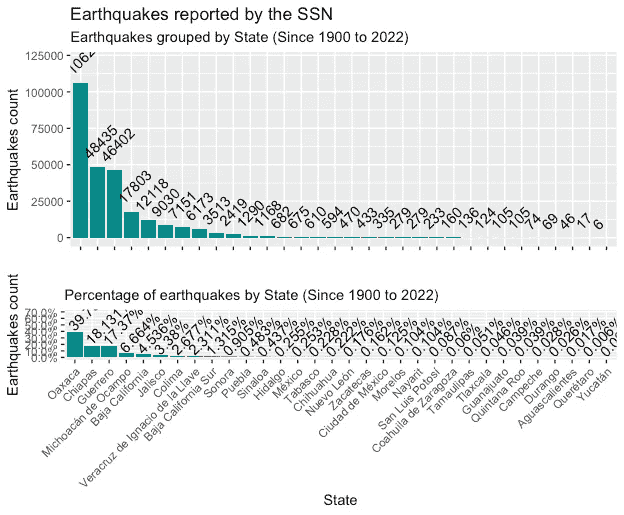

九月还是“九月地震”？使用 R 对墨西哥地震活动数据进行分析和可视化 — RStudio 图表“墨西哥哪个州的地震活动最强？”（图片由作者提供）

## 里氏震级大于 7.5 的地震地图

讨论震中强度等于或大于 7.5 的地震意味着讨论可能导致灾难性损失的震动。您可以查看这些被记录为历史上最强烈的地震的起源地图。

```py
# MAP TOP EARTHQUAKES >= 7.5

topEarthquakes <- dataSSN %>%  
  .[intensity>=7.5]

ggplot(data = mxMap) +
  geom_sf()+
  geom_point(data= topEarthquakes, aes(x= longitud, y= latitud, size= intensity), color="darkcyan")+
  scale_color_manual( name="Magnitud escala de Richter")+
  theme(axis.text = element_blank(), axis.title = element_blank(), legend.position="top")+
  ggrepel::geom_text_repel(data= topEarthquakes, aes(x= longitud, y= latitud, label= intensity), color="darkred")+
  ggtitle("Earthquakes reported by the SSN", "Map of strongest earthquakes locations (Intensity >= 7.5 since 1900 to 2022)")
```

结果将显示，太平洋沿岸的州是墨西哥记录到的最强烈地震发生地。


九月还是“九月地震”？使用 R 对墨西哥地震活动数据进行分析和可视化 — RStudio 图表“里氏震级大于 7.5 的地震地图”（图片由作者提供）

总结来说，本文通过数据分析和可视化揭示了墨西哥的地震历史。虽然它没有提供预测或政策建议，但它为读者提供了对地震趋势的宝贵理解。这些知识可以对个人安全、城市规划和建筑实践产生重大影响。通过了解地震活动最可能发生的时间和地点，个人和社区可以做出明智的决策以减少风险。无论您是墨西哥城的居民还是设计抗震结构的工程师，从这次分析中获得的见解都可以产生真正的影响。保持安全，保持知情，并记住，知识在地震准备中是一个强大的工具。

感谢您的细心阅读。如果您目前居住在地震活动频繁的地区，请务必注意自身安全。和我的其他文章一样，我在这里分享了完整的代码：[`github.com/cosmoduende/r-earthquakes`](https://github.com/cosmoduende/r-earthquakes)

祝您在分析中获得愉快的体验，把一切付诸实践，并对结果感到惊讶和娱乐！
