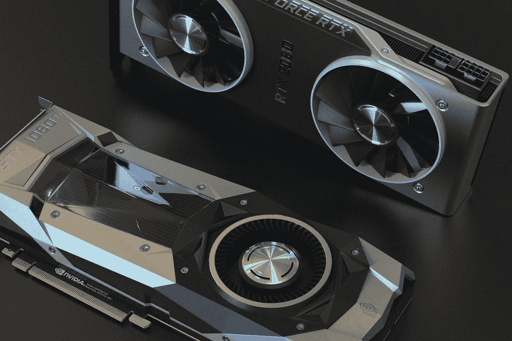

# 从你的电脑上提供大语言模型服务，通过文本生成推理

> 原文：[`towardsdatascience.com/serve-large-language-models-from-your-computer-with-text-generation-inference-54f4dd8783a7`](https://towardsdatascience.com/serve-large-language-models-from-your-computer-with-text-generation-inference-54f4dd8783a7)

## 使用 Falcon-7B 的指令版本的示例

[](https://medium.com/@bnjmn_marie?source=post_page-----54f4dd8783a7--------------------------------)[](https://towardsdatascience.com/?source=post_page-----54f4dd8783a7--------------------------------) [本杰明·玛丽](https://medium.com/@bnjmn_marie?source=post_page-----54f4dd8783a7--------------------------------)

·发表在[Towards Data Science](https://towardsdatascience.com/?source=post_page-----54f4dd8783a7--------------------------------) ·阅读时间 6 分钟·2023 年 7 月 13 日

--



图片由[Nana Dua](https://unsplash.com/@nanadua11?utm_source=medium&utm_medium=referral)提供，来源于[Unsplash](https://unsplash.com/?utm_source=medium&utm_medium=referral)

通过量化方法如 QLoRa 和[GPTQ](https://github.com/IST-DASLab/gptq)，现在可以在消费者硬件上本地运行非常大的语言模型（LLM）。

考虑到加载大语言模型的时间，我们可能还希望将 LLM 保持在内存中以便即时查询并获取结果。如果你使用标准的推理管道，你必须每次重新加载模型。如果模型非常大，你可能需要等待几分钟才能生成输出。

有各种框架可以在服务器（本地或远程）上托管大语言模型（LLMs）。在我的博客中，我已经介绍了[NVIDIA 开发的非常优化的 Triton 推理服务器框架](https://medium.com/towards-data-science/deploy-your-local-gpt-server-with-triton-a825d528aa5d)，它用于服务多个 LLMs，并在 GPU 之间平衡负载。但是，如果你只有一个 GPU，并且希望在你的电脑上托管模型，使用 Triton 推理可能会显得不太合适。

在这篇文章中，我介绍了一种替代方案，称为文本生成推理。这是一个更简单的框架，实现了运行和服务 LLMs 所需的所有基本功能，适用于消费者硬件。

阅读完本文后，你将在你的电脑上拥有一个本地部署并等待查询的聊天模型/LLM。

# 文本生成推理

[文本生成推理](https://github.com/huggingface/text-generation-inference)（TGI）是一个用 Rust 和 Python 编写的框架，用于部署和服务 LLM。它由 Hugging Face 开发，并以 [Apache 2.0 许可证](https://github.com/huggingface/text-generation-inference/blob/main/LICENSE) 进行分发。Hugging Face 在生产中使用它来驱动他们的推理小部件。

尽管 TGI 已针对 A100 GPU 进行了优化，但由于对量化和 [分页注意力](https://medium.com/towards-data-science/vllm-pagedattention-for-24x-faster-llm-inference-fdfb1b80f83)的支持，我发现 TGI 非常适合自托管的 LLM，在如 RTX GPU 这样的消费级硬件上表现出色。然而，它需要特定的安装来支持 RTX GPU，这一点我将在本文后续部分详细说明。

最近，我还发现 Hugging Face 正在优化一些 LLM 架构，以便它们在 TGI 下运行更快。

这尤其适用于 Falcon 模型，这些模型在使用标准推理管道时运行较慢，但在使用 TGI 时运行更快。[一位 Falcon 模型的作者在 Twitter 上告诉我](https://twitter.com/slippylolo/status/1673721277025009664?s=20)，这是因为他们在多查询注意力的实现上匆忙，而 Hugging Face 则优化了它以便与 TGI 配合使用。

有几种 LLM 架构以这种方式进行了优化，以便在 TGI 下运行得更快：BLOOM、OPT、GPT-NeoX 等。完整列表可以在 TGI 的 GitHub 上找到，并定期更新。

# 设置文本生成推理

## 硬件和软件要求

我在 RTX 3060 12 GB 上进行了测试。它应该适用于所有 RTX 30x 和 40x，但请注意 TGI 特别优化了 A100 GPU。

要运行这些命令，你需要一个 UNIX 操作系统。我使用了通过 Windows WSL2 的 Ubuntu 20.04。

它在 Mac OS 上也应该可以正常工作。

TGI 需要 Python ≥ 3.9。

我将首先介绍如何从零开始安装 TGI，我认为这并不简单。如果你在安装过程中遇到问题，可能需要改用 Docker 镜像。我将讨论这两种情况。

## 设置

TGI 是用 Rust 编写的。你需要先安装它。如果你没有安装，运行以下命令：

```py
curl --proto '=https' --tlsv1.2 -sSf https://sh.rustup.rs | sh
```

这应该花费不到 2 分钟。我建议重启你的 shell，例如，打开一个新的终端，以确保所有环境变量正确更新。

然后，我们创建一个专用的 conda 环境。此步骤是可选的，但我更喜欢为每个项目创建一个独立的环境。

```py
conda create -n text-generation-inference python=3.9 
conda activate text-generation-inference
```

我们还需要安装 Protoc。Hugging Face 目前推荐版本 21.12。你需要具有 sudo 权限。

```py
PROTOC_ZIP=protoc-21.12-linux-x86_64.zip
curl -OL https://github.com/protocolbuffers/protobuf/releases/download/v21.12/$PROTOC_ZIP
sudo unzip -o $PROTOC_ZIP -d /usr/local bin/protoc
sudo unzip -o $PROTOC_ZIP -d /usr/local 'include/*'
rm -f $PROTOC_ZIP
```

我们已经安装了所有要求。现在，我们可以安装 TGI。

首先，克隆 GitHub 仓库：

```py
git clone https://github.com/huggingface/text-generation-inference.git
```

然后安装 TGI：

```py
cd text-generation-inference/
BUILD_EXTENSIONS=False make install
```

*注意：我将 BUILD_EXTENSIONS 设置为 False 以停用自定义 CUDA 内核，因为我没有 A100 GPU。*

应该可以顺利安装……但在我的计算机上却没有。我不得不手动运行 server/Makefile 文件中的所有命令。我怀疑是由于“make”由于某种原因切换到不同的 shell，导致我的环境变量没有正确加载。你可能也需要这样做。

*注意：如果安装失败，不用担心！Hugging Face 创建了一个 Docker 镜像，你可以启动它以启动服务器，我们将在下一部分中看到。*

# 使用 TGI 启动模型

对于以下示例，我使用的是 [Falcon-7B 模型](https://huggingface.co/tiiuae/falcon-7b-instruct) 的 instruct 版本，它在 Apache 2.0 许可证下分发。如果你想了解更多关于 Falcon 模型的信息，我在上一篇文章中做了介绍：

[## Open LLM Falcon-40B 介绍：性能、训练数据和架构](https://example.org/introduction-to-the-open-llm-falcon-40b-performance-training-data-and-architecture-98388fa40226?source=post_page-----54f4dd8783a7--------------------------------)

### 开始使用 Falcon-7B、Falcon-40B 及其 instruct 版本

[towardsdatascience.com](https://example.org/introduction-to-the-open-llm-falcon-40b-performance-training-data-and-architecture-98388fa40226?source=post_page-----54f4dd8783a7--------------------------------)

## 不使用 Docker

安装创建了一个新的命令“text-generation-launcher”，它将启动 TGI 服务器。

```py
text-generation-launcher --model-id tiiuae/falcon-7b-instruct --num-shard 1 --port 8080 --quantize bitsandbytes
```

+   model-id：模型名称在 [Hugging Face Hub](https://huggingface.co/models)。

+   num-shard：设置为你拥有的 GPU 数量，以及你希望利用的数量。

+   port：你希望服务器监听的端口。

+   quantize：如果你使用的 GPU 内存少于 24 GB，你需要对模型进行量化，以避免内存不足。我选择了“bitsandbytes”进行即时量化。GPTQ（“gptq”）也可用，但我对这个算法不太熟悉。

## 使用 Docker（如果手动安装失败）

*注意：如果 Docker 守护进程未运行，并且你通过 WSL 运行 Ubuntu，请在另一个终端中使用“sudo dockerd”启动守护进程。*

```py
volume=$PWD/data
sudo docker run --gpus all --shm-size 1g -p 8080:80 -v $volume:/data ghcr.io/huggingface/text-generation-inference:0.9 --model-id tiiuae/falcon-7b-instruct --num-shard 1  --quantize bitsandbytes
```

参数几乎与 text-generation-launcher 一样。如果你只有一个 GPU，你可以将“all”替换为“0”。

保持这个 Docker 镜像运行，只要你想使用服务器。

# 使用 TGI 查询模型

要用 Python 脚本查询 TGI 提供的模型，你需要安装以下库：

```py
pip install text-generation
```

然后在 Python 脚本中，写类似这样的代码：

```py
from text_generation import Client

client = Client("http://127.0.0.1:8080")
print(client.generate("Translate the following into French: 'What is Deep Learning?'", max_new_tokens=500).generated_text)
```

它应该打印：

```py
Qu'est-ce que la profondeur de l'apprentissage ?
```

这是一种较差质量的翻译。这是对一个 70 亿参数模型的预期。它在编码任务上略好一些：

```py
from text_generation import Client

client = Client("http://127.0.0.1:8080")
print(client.generate("Code in Javascript a function to remove all spaces in a string and then print the string twice.", max_new_tokens=500).generated_text)
```

它生成：

```py
Here is an example code snippet in JavaScript to remove all spaces in a string and then print the string twice:

```javascript

function removeSpaces(str) {

return str.replace(/\s+/g, '');

}

console.log(removeSpaces('Hello World'));

console.log(removeSpaces('Hello World'));

```py
```

你也可以用 curl 进行查询，而不是 Python 脚本：

```py
curl 127.0.0.1:8080/generate \
    -X POST \
    -d '{"inputs":"Code in Javascript a function to remove all spaces in a string and then print the string twice.","parameters":{"max_new_tokens":500}}' \
    -H 'Content-Type: application/json'
```

TGI 确实很快。使用 Falcon-7B 并将最大 token 数设置为 500，仅需几秒钟，我的 RTX 3060 GPU 即可完成。

使用标准推理管道，几乎需要 40 秒，还不包括加载模型所需的时间。

# 结论

自托管聊天模型（即，指导 LLM）有很多优势。主要的是你不会将数据发送到互联网。另一个是你完全控制操作成本，这只反映在你的电费账单上。

然而，如果你使用消费级 GPU，你将无法运行最先进的 LLM。即使是较小的 LLM，我们也必须将其量化，以便在配备少于 24 GB VRAM 的 GPU 上运行。量化还会降低 LLM 的准确性。

尽管如此，即使是小型量化 LLM 也仍然适合简单任务：简单的编码问题、二元分类……

现在，你可以通过查询你的自托管 LLM 在计算机上完成所有这些任务。

*如果你喜欢这篇文章并对阅读接下来的文章感兴趣，支持我工作的最佳方式是通过这个链接成为 Medium 会员：*

[](https://medium.com/@bnjmn_marie/membership?source=post_page-----54f4dd8783a7--------------------------------) [## 通过我的推荐链接加入 Medium - Benjamin Marie]

### 作为 Medium 会员，你的一部分会员费会给你阅读的作者，并且你可以全面访问每一个故事……

medium.com](https://medium.com/@bnjmn_marie/membership?source=post_page-----54f4dd8783a7--------------------------------)

*如果你已经是会员并且想支持这项工作，* [*只需关注我在 Medium 上的账户*](https://medium.com/@bnjmn_marie)*。*
