# 设置 Python 项目：第 V 部分

> 原文：[`towardsdatascience.com/setting-up-python-projects-part-v-206df3c1e3d3`](https://towardsdatascience.com/setting-up-python-projects-part-v-206df3c1e3d3)

## 掌握 Python 项目设置的艺术：逐步指南

[](https://johschmidt42.medium.com/?source=post_page-----206df3c1e3d3--------------------------------)[](https://towardsdatascience.com/?source=post_page-----206df3c1e3d3--------------------------------) [Johannes Schmidt](https://johschmidt42.medium.com/?source=post_page-----206df3c1e3d3--------------------------------)

·发表于[Towards Data Science](https://towardsdatascience.com/?source=post_page-----206df3c1e3d3--------------------------------) ·阅读时间 20 分钟·2023 年 1 月 14 日

--


照片由[Zoya Loonohod](https://unsplash.com/@loonohod?utm_source=medium&utm_medium=referral)拍摄，来自[Unsplash](https://unsplash.com/?utm_source=medium&utm_medium=referral)

无论你是经验丰富的开发者还是刚刚开始接触🐍 **Python**，了解如何构建稳健且易于维护的项目都很重要。本教程将指导你使用一些行业内最流行且有效的工具来设置 Python 项目。你将学习如何使用[GitHub](https://github.com/)和[GitHub Actions](https://github.com/features/actions)进行版本控制和持续集成，以及其他工具进行测试、文档编写、打包和分发。本教程的灵感来源于[Hypermodern Python](https://medium.com/@cjolowicz/hypermodern-python-d44485d9d769)和[新 Python 项目的最佳实践](https://mitelman.engineering/blog/python-best-practice/automating-python-best-practices-for-a-new-project/)。然而，这并不是唯一的方法，你可能有不同的偏好或观点。教程旨在对初学者友好，同时涵盖一些高级主题。在每个部分，你将自动化一些任务，并为你的项目添加徽章，以展示你的进展和成就。

该系列的代码库可以在[github.com/johschmidt42/python-project-johannes](https://github.com/johschmidt42/python-project-johannes)找到

这一部分的灵感来自于这篇博客文章：

[**Python、Poetry 与 GitHub Actions 的语义化发布 🚀**

*由于我的同事们的兴趣，我计划向 Dr. Sven 添加一些功能。在此之前，我需要…*](https://mestrak.com/blog/semantic-release-with-python-poetry-github-actions-20nn)

# 要求

+   **操作系统**: Linux、Unix、macOS、Windows（WSL2，例如 Ubuntu 20.04 LTS）

+   **工具**：python3.10, bash, git, tree

+   **版本控制系统（VCS）主机**： [GitHub](https://github.com/)

+   **持续集成（CI）工具**： [GitHub Actions](https://github.com/features/actions)

预计你对版本控制系统（VCS）[git](https://git-scm.com/)有所了解。如果不了解，以下是一个复习： [Git 介绍](https://realpython.com/python-git-github-intro/)

提交将基于 [最佳 git 提交实践](https://deepsource.io/blog/git-best-practices/) 和 [传统提交](https://www.conventionalcommits.org/en/v1.0.0/)。你可以使用 [PyCharm 的传统提交插件](https://plugins.jetbrains.com/plugin/13389-conventional-commit) 或 [VSCode 扩展](https://github.com/vivaxy/vscode-conventional-commits) 来帮助你以这种格式编写提交。

## 概述

+   [第一部分（GitHub，IDE）](https://johschmidt42.medium.com/setting-up-python-projects-part-i-408603868c08)

+   第二部分（格式化，Linting，CI）

+   第三部分（测试，CI）

+   [第四部分（文档，CI/CD）](https://johschmidt42.medium.com/setting-up-python-projects-part-iv-82059eba4ca4)

+   **第五部分（版本控制与发布，CI/CD）**

+   [第六部分（容器化，Docker，CI/CD）](https://johschmidt42.medium.com/setting-up-python-projects-part-vi-cbdbf28eff53)

## 结构

+   Git 分支策略 (*GitHub 流程*)

+   什么是发布？ (*zip, tar.gz*)

+   语义版本控制 (*v0.1.0*)

+   手动创建发布 (*git tag, GitHub*)

+   自动创建发布 (*传统提交，语义发布*)

+   CI/CD (*release.yml*)

+   创建个人访问令牌（PAT）

+   GitHub Actions 流程 (*编排工作流*)

+   徽章 (*发布*)

+   奖励 (*强制执行传统提交*)

发布软件是软件开发过程中的重要步骤，因为它使新功能和修复程序可供用户使用。发布软件的一个关键方面是版本控制，它有助于跟踪和传达每个发布中的变化。语义版本控制是一种广泛使用的软件版本控制标准，它使用格式为 Major.Minor.Patch（例如 1.2.3）的版本号来指示发布中所做更改的级别。

传统提交是一种为提交消息添加人类和机器可读意义的规范。它是一种以一致的方式格式化提交消息的方法，这使得确定所做更改的类型变得简单。传统提交通常与语义版本控制结合使用，因为提交消息可以用来自动确定发布的版本号。语义版本控制和传统提交一起提供了一种清晰且一致的方法来跟踪和传达每个软件项目发布中的更改。

# Git 分支策略

git 有许多不同的分支策略。很多人倾向于使用[GitFlow](http://datasift.github.io/gitflow/IntroducingGitFlow.html)（或变种）、[Three Flow](https://www.nomachetejuggling.com/2017/04/09/a-different-branching-strategy/)或[Trunk based Flows](https://trunkbaseddevelopment.com/)。一些人使用这些策略中的混合策略，例如这个[策略](https://brightinventions.pl/blog/how-do-we-use-git/)。我使用非常简单的[GitHub flow](https://guides.github.com/introduction/flow/)分支策略，其中所有的 bug 修复和功能都有各自的独立分支，完成后，每个分支都会合并到主分支并进行部署。简单、好用且易于操作。

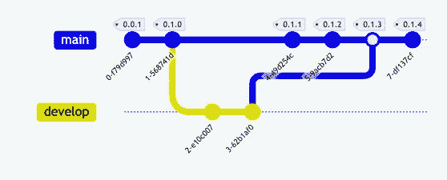

GitHub Flow 分支策略

无论你的策略是什么，最终你都会合并一个拉取请求，并（可能）创建一个版本发布。

# 什么是版本发布？

简而言之，发布就是将一个版本的代码打包（例如压缩文件），并推送到生产环境（这对你来说可能是任何东西）。

版本管理可能会很混乱。因此，需要有一个简明的方法（以及其他人也跟随的方法），定义什么是版本发布，以及一个版本与下一个版本之间的变化。如果你不跟踪版本之间的变化，你可能不会理解每个版本中发生了什么变化，也无法识别新代码中可能引入的任何问题。没有变更日志，很难理解软件如何随着时间的推移而发展。它也可能使回滚更改变得困难（如果必要的话）。

# 语义化版本控制

[语义化版本控制](https://semver.org/)只是一个编号方案和业界的标准实践。它指示了该版本与前一个版本之间的变更程度。一个语义版本号有三个部分，例如**1.8.42**，遵循以下模式：

+   *MAJOR.MINOR.PATCH*

每个部分代表了不同程度的变化。PATCH 版本发布表示错误修复或微小更改（例如从 1.0.0 到 1.0.1）。MINOR 版本发布表示添加/删除功能或向后兼容的功能更改（例如从 1.0.0 到 1.1.0）。MAJOR 版本发布表示添加/删除功能以及可能的向后不兼容的更改，例如破坏性更改（例如从 1.0.0 到 2.0.0）。

我推荐[迈克·迈尔斯](https://www.youtube.com/watch?v=4wPjo5C-v8Y)的一个讲座，如果你想要一个关于语义版本发布的视觉介绍。它总结了什么是发布，以及如何利用[git 标签](https://git-scm.com/book/en/v2/Git-Basics-Tagging)来创建版本发布。

关于**git 标签**：git 中有轻量级标签和注释标签。一个*轻量级*标签只是指向特定提交的指针，而*注释*标签则是 git 中的一个完整对象。

# 手动创建版本发布

让我们先手动创建一个版本发布，然后再进行自动化处理。

如果你记得，我们的 example_app 的 `__init__.py` 文件包含了版本信息。

```py
# src/example_app/__init__.py

__version__ = "0.1.0"
```

以及 `pyproject.toml` 文件

```py
# pyproject.toml

[tool.poetry]
name = "example_app"
version = "0.1.0"
...
```

所以我们首先必须做的是创建一个注释的 git 标签 `v0.1.0` 并将其添加到主分支的最新提交中：

```py
> git tag -a v0.1.0 -m "version v0.1.0"
```

请注意，如果在命令末尾没有指定提交哈希，则 git 会使用你当前所在的提交。

我们可以通过以下命令获取标签列表：

```py
> git tag

v0.1.0
```

如果我们想要再次删除它：

```py
> git tag -d v0.1.0

Deleted tag 'v0.1.0'
```

并通过以下命令获取有关该标签的更多信息：

```py
> git show v0.1.0

tag v0.1.0

Tagger: Johannes Schmidt <johannes.schmidt.vik@gmail.com>
Date:   Sat Jan 7 12:55:15 2023 +0100
version v0.1.0
commit efc9a445cd42ce2f7ddfbe75ffaed1a5bc8e0f11 (HEAD -> main, tag: v0.1.0, origin/main, origin/HEAD)
Author: Johannes Schmidt <74831750+johschmidt42@users.noreply.github.com>
Date:   Mon Jan 2 11:20:25 2023 +0100
...
```

我们可以通过以下命令将新创建的标签推送到 origin：

```py
> git push origin v0.1.0

Enumerating objects: 1, done.
Counting objects: 100% (1/1), done.
Writing objects: 100% (1/1), 171 bytes | 171.00 KiB/s, done.
Total 1 (delta 0), reused 0 (delta 0), pack-reused 0
To github.com:johschmidt42/python-project-johannes.git
 * [new tag]         v0.1.0 -> v0.1.0
```

使得这个 git 标签现在可以在 GitHub 上使用：

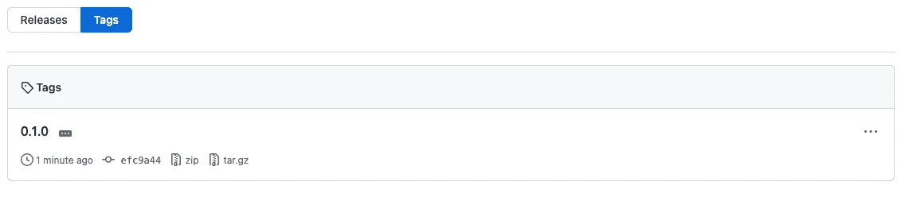

让我们手动在 GitHub 上创建一个新的版本发布，并使用这个 git 标签：


我们点击 `Create a new release`，选择我们现有的标签（已经绑定到提交），然后通过点击 `Generate release notes` 按钮自动生成发布说明，最后用 `Publish release` 按钮发布该版本。

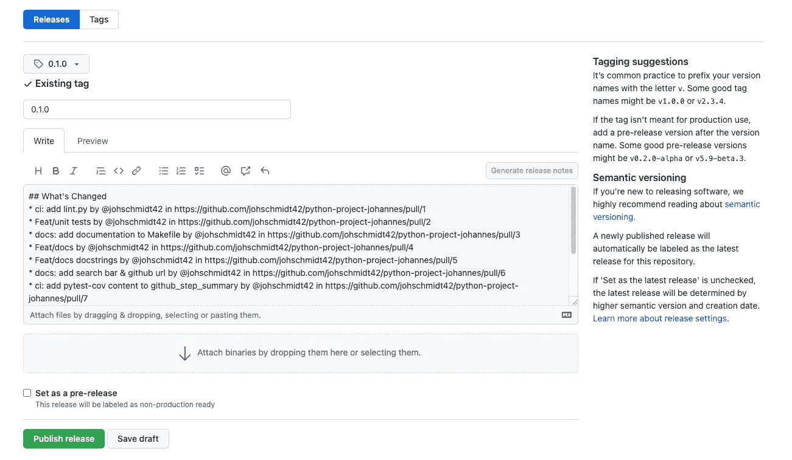

GitHub 将自动为源代码创建 `tar` 和 `zip`（资产），但不会构建应用程序！结果将如下所示：

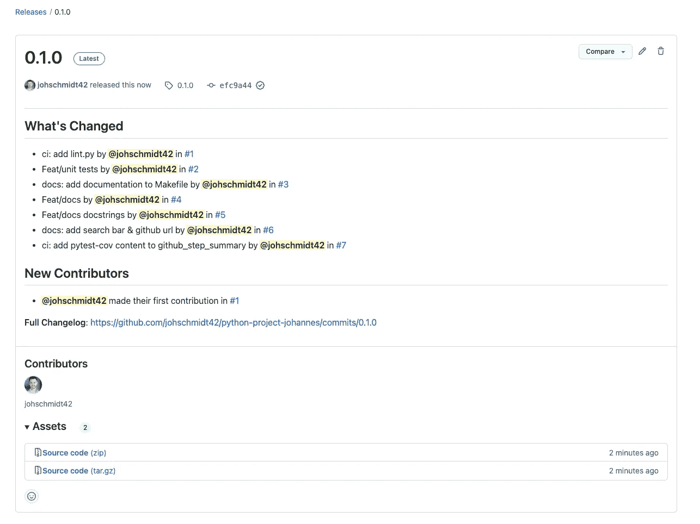

总结一下，发布的步骤是：

+   从你的默认分支创建一个新分支（例如功能或修复分支）

+   进行更改并增加版本（例如 *pyproject.toml* 和 *__init__.py*）

+   将功能/错误修复提交到默认分支（可能通过 Pull Request）

+   添加一个 *注释的* git 标签（语义版本）到提交中

+   在 GitHub 上发布版本，并附加一些额外信息

# 自动创建发布

作为程序员，我们不喜欢重复自己。因此，有很多工具可以让这些步骤变得非常简单。在这里，我将介绍[Semantic Releases](https://python-semantic-release.readthedocs.io/en/latest/)，一个专门为 Python 项目设计的工具。

这是一个自动在你的仓库中设置版本号、用版本号标记代码并创建发布的工具！这一切都是基于 **约定式提交** 风格消息的内容完成的。

## 约定式提交

语义版本控制和 [conventional-commits](https://www.conventionalcommits.org/en/v1.0.0/) 之间有什么联系？

某些提交类型可以用于自动确定语义版本的提升！

+   一个 `fix` 提交是 PATCH。

+   一个 `feat` 提交是 MINOR。

+   一个带有 `BREAKING CHANGE` 或 `!` 的提交是 MAJOR。

其他类型的提交，例如 `build`、`chore`、`ci`、`docs`、`style`、`refactor`、`perf`、`test` 通常不会增加版本。

查看最后的附加部分，了解如何在你的项目中强制执行约定式提交！

## 自动语义版本发布（本地）

我们可以通过以下命令添加库：

```py
> poetry add --group semver python-semantic-release
```

让我们深入配置设置，以便自动生成变更日志和发布。在 `pyproject.toml` 中，我们可以将 *semantic_release* 作为工具添加：

```py
# pyproject.toml

...
[tool.semantic_release]
branch = "main"
version_variable = "src/example_app/__init__.py:__version__"
version_toml = "pyproject.toml:tool.poetry.version"
version_source = "tag"
commit_version_number = true # required for version_source = "tag"
tag_commit = true
upload_to_pypi = false
upload_to_release = false
hvcs = "github" # gitlab is also supported
```

+   `branch`：指定发布应基于的分支，在这种情况下是 "main" 分支。

+   `version_variable`：指定源代码中版本号的文件路径和变量名称。在这种情况下，版本号存储在文件 `src/example_app/__init__.py` 中的 `__version__` 变量中。

+   `version_toml`：指定`pyproject.toml`文件中版本号的文件路径和变量名称。在这种情况下，版本号存储在 `pyproject.toml` 文件的 `tool.poetry.version` 变量中。

+   `version_source`：指定版本号的来源。在这种情况下，版本号来自标签（而不是提交）。

+   `commit_version_number`：当`version_source = "tag"`时，此参数是必需的。它指定是否将版本号提交到仓库。在这种情况下，它设置为 true，这意味着版本号将被提交。

+   `tag_commit`：指定是否为发布提交创建新的标签。在这种情况下，它设置为 true，这意味着将创建一个新的标签。

+   `upload_to_pypi`：指定是否将软件包上传到 PyPI 包仓库。在这种情况下，它设置为 false，这意味着软件包不会上传到 PyPI。

+   `upload_to_release`：指定是否将软件包上传到 GitHub 发布页面。在这种情况下，它设置为 false，这意味着软件包不会上传到 GitHub 发布页面。

+   `hvcs`：指定项目的托管版本控制系统。在这种情况下，它设置为 "github"，这意味着项目托管在 GitHub 上。"gitlab" 也是支持的。

我们可以更新定义项目/模块版本的文件。为此，我们使用变量`version_variable`用于普通文件，`version_toml`用于*.toml* 文件。`version_source`定义了版本的真实性来源。由于这两个文件中的版本与 git 注释标签紧密耦合，例如我们每次发布时自动创建 git 标签（标志`tag_commit`设置为 true），我们可以使用源`tag`，而不是默认值`commit`，后者在提交信息中查找最后一个版本。为了能够更新文件并提交更改，我们[需要设置](https://github.com/relekang/python-semantic-release/issues/104) `[commit_version_number](https://github.com/relekang/python-semantic-release/issues/104)` [标志为 true](https://github.com/relekang/python-semantic-release/issues/104)。因为我们不想将任何东西上传到 Python 索引 [PyPi](https://pypi.org/)，所以标志`upload_to_pypi`设置为 false。现在我们也不想将任何东西上传到我们的发布页面。`hvcs`设置为`github`（默认），其他值可以是：`gitlab`。

我们可以通过运行几个命令在本地测试这一点，我将直接将这些命令添加到我们的 Makefile 中：

```py
# Makefile

...

##@ Releases

current-version: ## returns the current version
 @semantic-release print-version --current

next-version: ## returns the next version
 @semantic-release print-version --next

current-changelog: ## returns the current changelog
 @semantic-release changelog --released

next-changelog: ## returns the next changelog
 @semantic-release changelog --unreleased

publish-noop: ## publish command (no-operation mode)
 @semantic-release publish --noop
```

使用命令*current-version*我们可以从 git 树中的最后一个 git 标签获取版本：

```py
> make current-version

0.1.0
```

如果我们以传统提交风格添加一些提交，例如 `feat: new cool feature` 或 `fix: nasty bug`，那么命令 **next-version** 将计算版本号的增量：

```py
> make next-version

0.2.0
```

目前，我们的项目中没有 CHANGELOG 文件，因此当我们运行：

```py
> make current-changelog 
```

输出将是空的。但根据提交记录，我们可以使用以下方法创建即将发布的变更日志：

```py
> make next-changelog### Feature
* Add releases (#8)) (`5343f46`))
* Docstrings (#5)) (`fb2fa04`))
* Add application in app.py (`3f07683`))### Documentation
* Add search bar & github url (#6)) (`3df7c48`))
* Add badge pages.yml to README.py (`b76651c`))
* Add documentation to Makefile (#3)) (`2294ee1`))
```

如果我们推送新的提交（直接到主分支或通过 PR），我们现在可以发布一个新版本：

```py
> semantic-release publish
```

发布命令将执行一系列操作：

1.  更新或创建变更日志文件。

1.  运行 [semantic-release version](https://python-semantic-release.readthedocs.io/en/latest/index.html#cmd-version)。

1.  将更改推送到 git。

1.  运行 [build_command](https://python-semantic-release.readthedocs.io/en/latest/configuration.html#config-build-command) 并将分发文件上传到你的仓库。

1.  运行 [semantic-release changelog](https://python-semantic-release.readthedocs.io/en/latest/index.html#cmd-changelog) 并发布到你的 VCS 提供者。

1.  将由 [build_command](https://python-semantic-release.readthedocs.io/en/latest/configuration.html#config-build-command) 创建的文件附加到 GitHub 发布中。

每一步当然都可以配置或禁用！

# CI/CD

让我们使用 GitHub Actions 构建一个 CI 流水线，每次提交到主分支时运行 semantic-release 的发布命令。

虽然整体结构与 *lint.yml*、*test.yml* 或 *pages.yml* 相同，但有一些变化需要说明。在步骤 `Checkout repository` 中，我们添加了一个新的 token，用于检出分支。这是因为默认值 `GITHUB_TOKEN` 没有操作受保护分支所需的权限。因此，我们必须使用一个包含 [个人访问令牌](https://help.github.com/en/github/authenticating-to-github/creating-a-personal-access-token-for-the-command-line) 权限的秘密 (**GH_TOKEN**) 。稍后我会展示如何生成个人访问令牌。我们还定义了 `fetch-depth: 0` 以提取所有分支和标签的全部历史记录。

```py
with:
  ref: ${{ github.head_ref }}
  token: ${{ secrets.GH_TOKEN }}
  fetch-depth: 0
```

我们仅安装 semantic-release 工具所需的依赖项：

```py
- name: Install requirements
  run: poetry install --only semver
```

在最后一步，我们更改一些 git 配置并运行 semantic-release 的发布命令：

```py
- name: Python Semantic Release
  env:
    GH_TOKEN: ${{ secrets.GH_TOKEN }}
  run: |
    set -o pipefail
    # Set git details
    git config --global user.name "github-actions"
    git config --global user.email "github-actions@github.com"
    # run semantic-release
    poetry run semantic-release publish -v DEBUG -D commit_author="github-actions <action@github.com>"
```

通过更改 git 配置，提交的用户将会是“github-actions”。我们以 DEBUG 日志（stdout）运行发布命令，并显式将 `commit_author` 设置为“github-actions”。除了这个命令，我们还可以直接使用 semantic-release 的 GitHub action，但设置步骤 [非常少](https://github.com/relekang/python-semantic-release/blob/master/action.sh)，且该 action 每次都需要拉取 docker 容器。因此，我更倾向于采用简单的运行步骤。

因为发布命令会生成提交，您可能会担心我们会陷入触发工作流的无限循环。但请放心，生成的提交不会触发另一个 GitHub Actions 工作流运行。这是由于 [GitHub 设定的限制](https://docs.github.com/en/actions/security-guides/automatic-token-authentication#using-the-github_token-in-a-workflow)。

# 创建个人访问令牌（PAT）

> 个人访问令牌是使用密码进行 GitHub Enterprise Server 身份验证的替代方案，当使用 [GitHub API](https://docs.github.com/en/enterprise-server@3.4/rest/overview/other-authentication-methods#via-oauth-and-personal-access-tokens) 或 [命令行](https://docs.github.com/en/enterprise-server@3.4/authentication/keeping-your-account-and-data-secure/creating-a-personal-access-token#using-a-token-on-the-command-line) 时。个人访问令牌旨在代表您访问 GitHub 资源。要代表组织访问资源或用于长期集成，您应该使用 GitHub 应用。有关更多信息，请参见“[关于应用](https://docs.github.com/en/enterprise-server@3.4/developers/apps/getting-started-with-apps/about-apps)”。

换句话说：我们可以创建一个 **P**ersonal **A**ccess **T**oken，并让 GitHub Actions 存储并使用该 **secret** 代表我们执行某些操作。请记住，如果 PAT 被泄露，可能会被用于对您的 GitHub 仓库执行恶意操作。因此，建议在组织中使用 GitHub OAuth 应用和 GitHub 应用。为了本教程的目的，我们将使用 PAT 允许 GitHub Actions 流水线代表我们操作。

我们可以通过导航到 GitHub 用户的 `Settings` 部分并按照 [创建个人访问令牌](https://docs.github.com/en/enterprise-server@3.4/authentication/keeping-your-account-and-data-secure/creating-a-personal-access-token) 中总结的说明来创建新的访问令牌。这将给我们一个看起来像这样的窗口：

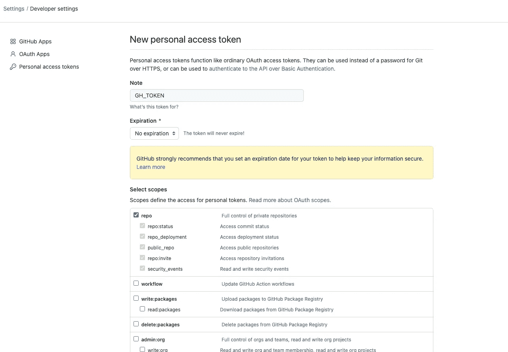

具有推送访问权限的管理员帐户的个人访问令牌。

通过选择作用域，我们定义令牌将具有的权限。对于我们的用例，我们需要 **push access** 权限，因此新的 PAT `GH_TOKEN` 应该具有 `repo` 权限作用域。该作用域将授权对受保护分支的推送，前提是您没有在受保护分支的设置中启用 *包括管理员*。

回到代码库概览，在 **设置** 菜单中，我们可以在 **密钥** 部分添加环境设置或库设置：

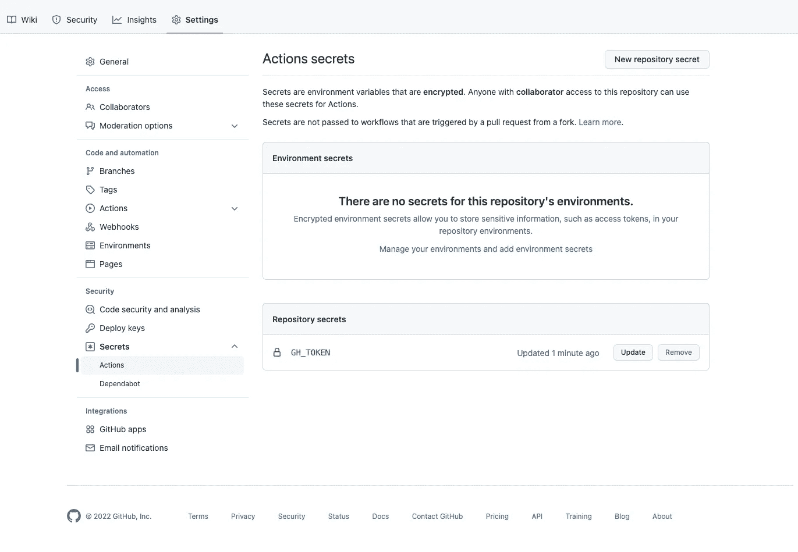

仓库密钥特定于单个仓库（及其中使用的所有环境），而环境密钥特定于环境。GitHub 运行器可以配置为在特定环境中运行，这允许它访问该环境的密钥。这在考虑不同阶段（例如 DEV 与 PROD）时是有意义的，但对于本教程，我对**仓库密钥**感到满意。

# GitHub Actions 流程

现在我们有了几个管道（linting、testing、releasing、documentation），我们应该考虑主分支提交的动作流程！有一些我们需要注意的事项，其中一些是特定于 GitHub 的。

理想情况下，我们希望主分支的提交创建一个推送事件，从而触发测试和 linting 工作流。如果这些工作流成功，我们将运行发布工作流，该工作流负责基于传统提交检测是否需要版本提升。如果是这样，发布工作流将直接推送到主分支，提升版本，添加 git 标签并创建发布。发布的版本应当例如通过运行文档工作流来更新文档。

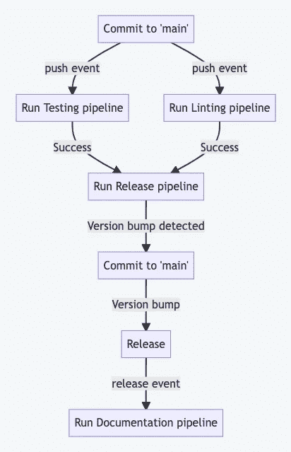

预期的动作流程

## 问题与考虑

1.  如果你仔细阅读上一段或查看上面的流程图，你可能会注意到有两个主分支的提交。一个是初始的（即来自 PR），另一个是用于发布的。由于我们的*lint.yml*和*test.yml*在主分支的推送事件下会触发，因此它们会运行两次！为了节省资源，我们应该避免两次运行。为此，我们可以在版本提交消息中添加`[skip ci]`字符串。可以在*pyproject.toml*文件中为工具*semantic_release*定义自定义提交消息。

```py
# pyproject.toml

...

[tool.semantic_release]
...
commit_message = "{version} [skip ci]" # skip triggering ci pipelines for version commits
...
```

2\. 工作流*pages.yml*当前在推送到主分支时运行。更新文档可能只是我们希望在有新版本发布时做的事情（我们可能会在文档中引用版本）。我们可以相应地更改*pages.yml*文件中的触发器：

```py
# pages.yml

name: Documentation

on:
  release:
    types: [published]
```

现在，构建文档将需要**已发布的版本**。

3\. 发布工作流应该依赖于 linting 和 testing 工作流的成功。目前，我们在工作流文件中没有定义依赖关系。我们可以让这些工作流依赖于特定分支上定义的工作流运行的完成，使用`[workflow_run](https://docs.github.com/en/actions/using-workflows/events-that-trigger-workflows#workflow_run)`事件。然而，如果我们为`workflow_run`事件指定多个`workflows`：

```py
on:
  workflow_run:
    workflows: [Testing, Linting]
    types:
    - completed
    branches:
    - main
```

仅一个工作流需要完成！这不是我们所期望的。我们期望所有**工作流**都必须完成（并成功）。只有在这种情况下，发布工作流才应运行。这与在单个工作流中定义**作业**之间的依赖关系时得到的结果相反。更多关于这种不一致和不足的内容，请阅读[这里](https://github.com/community/community/discussions/16059)。

作为替代方案，我们可以使用流水线的顺序执行：

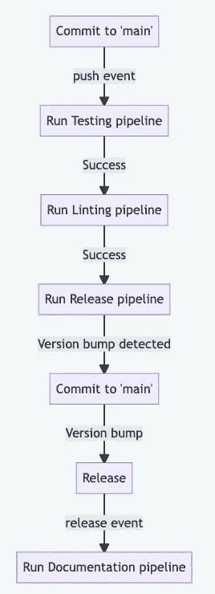

这种想法的一个大缺点是它 **a)** 不允许并行执行和 **b)** 我们将无法在 GitHub 中查看依赖图。

## 解决方案

目前，我认为解决上述问题的唯一方法是将工作流在一个协调器工作流中进行协调。

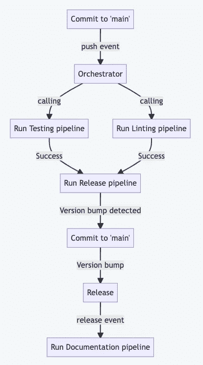

让我们创建这个工作流文件：

当我们推送到 `main` 分支时，协调器被触发。

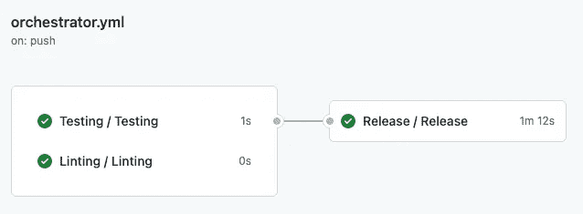

只有在两个工作流：Testing 和 Linting 都成功时，才会调用发布工作流。这在 `needs` 关键字中定义。如果我们希望对作业执行（工作流）有更细致的控制，也可以考虑使用 `if` 关键字。但要注意，如 [这篇文章](https://samanpavel.medium.com/github-actions-conditional-job-execution-e6aa363d2867) 所述的*令人困惑*行为。

为了使我们的工作流 `lint.yml`、`test.yml` 和 `release.yml` 可以被另一个工作流调用，我们需要更新触发器：

```py
# lint.yml

---
name: Linting

on:
  pull_request:
    branches:
      - main
  workflow_call:

jobs:
...
```

```py
# test.yml

---
name: Testing

on:
  pull_request:
    branches:
      - main
  workflow_call:

jobs:
...
```

```py
# release.yml

---
name: Release

on:
  workflow_call:

jobs:
...
```

现在，新工作流（Release）应该仅在质量检查工作流成功的情况下运行，这里指的是 linting 和 testing。

# 徽章

要创建徽章，这次我将使用平台 [shields.io](https://shields.io/)。

这是一个为项目生成徽章的网站，徽章显示诸如版本、构建状态和代码覆盖率等信息。它提供了广泛的模板，并允许定制外观和创建自定义徽章。徽章会自动更新，提供项目的实时信息。

对于发布徽章，我选择了 `GitHub release (latest SemVer)`：

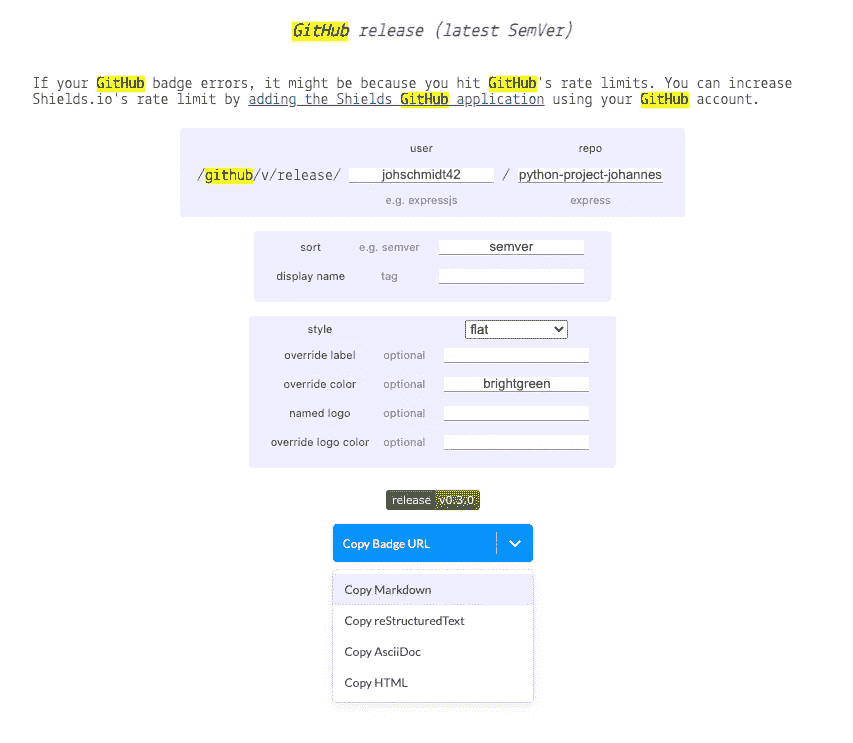

徽章的 Markdown 可以复制并添加到 *README.md* 中：

我们的 GitHub 登录页面现在看起来是这样的 ❤（我稍微整理了一下，并提供了描述）：

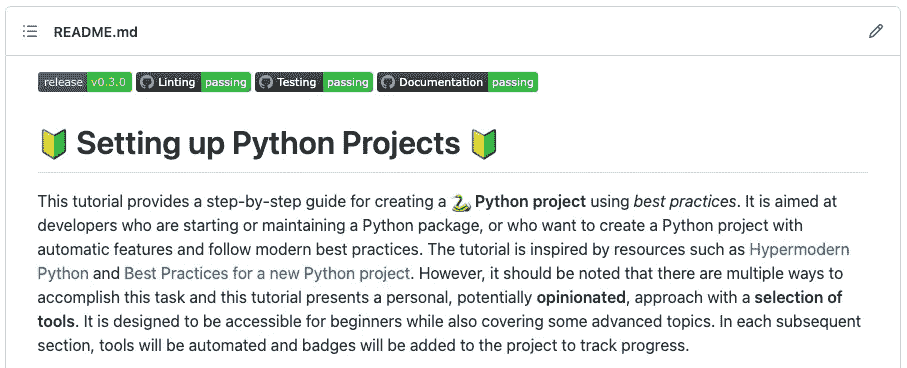

恭喜！你已经完成了本教程的主要部分！你已经学习了管理 **软件发布** 的基本步骤。我们首先手动创建了一个发布，然后利用 **Conventional Commits** 的力量，通过 **CI pipeline** 自动化我们的发布过程，处理版本控制。最后，我们在 README.md 文件中添加了 **徽章**，为用户提供了项目最新版本的清晰而简洁的显示。掌握了这些技巧，你将能够高效而有效地管理你的软件发布。

下一部分将是最后一部分，涵盖：**容器化**！

[](https://johschmidt42.medium.com/membership?source=post_page-----206df3c1e3d3--------------------------------) [## 通过我的推荐链接加入 Medium - Johannes Schmidt

### 阅读 Johannes Schmidt 的每一篇故事（以及 Medium 上其他数千名作者的故事）。您的会员费直接…

[johschmidt42.medium.com](https://johschmidt42.medium.com/membership?source=post_page-----206df3c1e3d3--------------------------------)

# 奖励

## 确保使用规范提交

我们已经看到，按照定义格式的提交可以帮助我们进行版本控制。在一个协作项目中，我们可能希望对所有提交到默认分支的提交强制执行这种格式。两个流行的工具可以帮助开发者遵循规范提交格式：

+   [commitizen](https://github.com/commitizen/cz-cli)

+   [commitlint](https://github.com/conventional-changelog/commitlint)

然而，一些开发者觉得这些工具有点限制性，因此避免使用它们*。所以仅仅希望总是有规范提交可能不是一个好主意。因此，在服务器端强制执行规则，如规范提交格式，才是明智的！

**同样适用于* [*pre-commit*](https://pre-commit.com/) *钩子，这也是我在这一系列中排除它们的原因。*

不幸的是，目前（2023 年 5 月）在 GitHub 上基于规则阻止提交仍然不可行，因为 [该功能仍在开发中](https://github.com/github/roadmap/issues/476)。但我们可以通过**分支保护规则**和**CI 工作流**尽可能接近这个目标。以下是我们在仓库中需要的策略：

+   对受保护的默认分支（例如 main）的提交应该限制为**拉取请求**（PR）提交。

+   只有 [压缩提交](https://docs.github.com/en/repositories/configuring-branches-and-merges-in-your-repository/configuring-pull-request-merges/configuring-commit-squashing-for-pull-requests) 应该被允许*。

+   合并拉取请求时展示的**默认提交信息**应该是**拉取请求** **标题**。

如果对**受保护**的默认分支（例如 main）的唯一提交方式是通过拉取请求（[压缩提交](https://docs.github.com/en/repositories/configuring-branches-and-merges-in-your-repository/configuring-pull-request-merges/configuring-commit-squashing-for-pull-requests) 仅限），我们可以使用 GitHub Action，如 [amannn/action-semantic-pull-request](https://github.com/amannn/action-semantic-pull-request)，确保拉取请求的标题符合 [规范提交规范](https://www.conventionalcommits.org/)。这样，当我们 `squash and merge` PR 分支（假设所有必需的流水线成功）时，建议的提交信息就是 PR 标题，该标题之前由 GitHub action 运行检查过。

**Squash and merge 策略是一种流行的代码合并方法，它将功能分支中的多个提交合并为一个提交。这种方法创建了一个线性的、一致的 git 历史记录，其中每个提交代表一个特定的更改。然而，这种方法也有其缺点，因为它丢弃了详细的提交历史记录，这对于理解开发过程是有价值的。虽然可以使用 rebase 合并来保留这些信息，但这可能会给工作流带来复杂性。从这个角度来看，squash and merge 策略因其简单性而受到青睐。*

## 工作流

让我们为这个策略创建 GitHub Actions 工作流：

**触发事件** `pull_request_target` 的解释见 [这里](https://github.com/amannn/action-semantic-pull-request#event-triggers)。我使用了建议的类型 `opened` 、`edited` 、`synchronize` 。`GITHUB_TOKEN` 被作为 `env` 传递给 action。因此，每当 PR 的标题发生变化时，管道就会触发。只有当 PR 的标题符合约定的提交格式时，管道才会成功。

请注意

> 你需要在主分支中拥有此配置，以便 action 能够运行（例如，它不会在初次添加 action 的 PR 中运行）。此外，如果你在 PR 中更改配置，当前 PR 中的更改将不会被反映 —— 只有在更改被合并到主分支后，随后的 PR 才会反映这些更改。

所以我们必须首先在默认分支 `main` 中拥有这个工作流，只有这样我们才能看到它的实际效果。

## 分支保护规则

接下来，在 GitHub 仓库的 *设置* 部分，我们可以为 *main* 分支创建一个 **分支保护规则**：

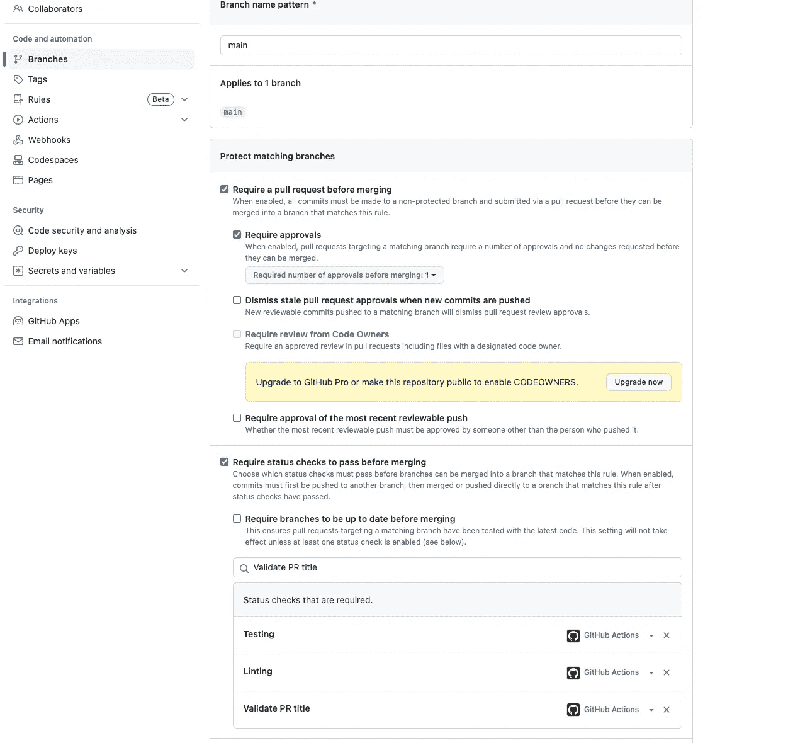

主要分支的分支保护规则 — 作者提供的图片

现在一个提交需要一个通过状态检查（必需工作流）的 PR 才能合并*。

> 一个 [必需的工作流](https://docs.github.com/en/actions/using-workflows/required-workflows) 由拉取请求事件触发，并作为必需的状态检查出现，这会阻止合并拉取请求，直到必需的工作流成功。


所需工作流 — 作者提供的图片

组织所有者有能力在其组织内强制执行特定的工作流，例如要求对拉取请求进行状态检查。不幸的是，这个功能仅对组织可用，个人账户无法激活，因此无法阻止合并。

**请注意，规则不会在私有仓库中生效，直到它被* [*迁移到 GitHub Team 或 Enterprise 组织账户*](https://github.com/move_work/new)*！*

## Squash & merge 策略

最后，我们可以配置 PR 选项，以便在选择 squash and merge 按钮时使用 PR 的标题作为默认提交消息：

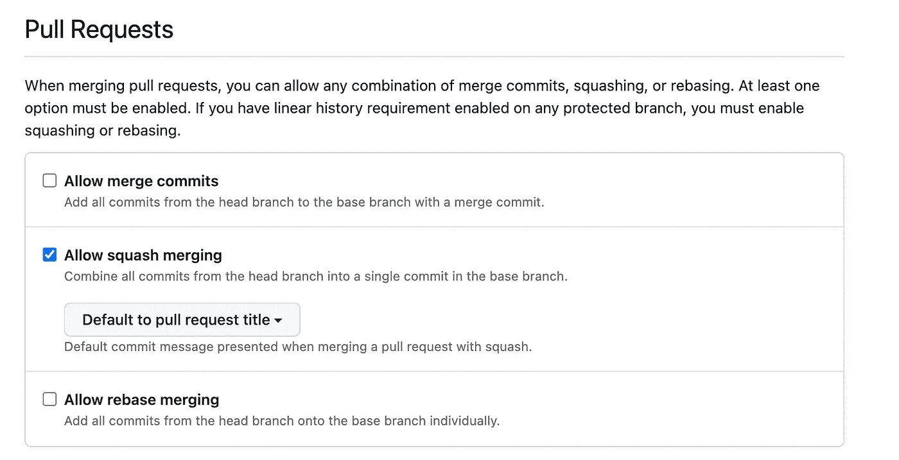

默认的提交消息在“压缩和合并”时 — 图片由作者提供

这样，我们会看到一个类似这样的窗口：


在 PR 中的“压缩和合并”对话框 — 图片由作者提供

*请注意，开发者可能会在合并过程中更改标题名称，这将绕过策略！*

尽管我们还不能完全确保在 GitHub 上使用传统的提交方式，但我们应尽量做到尽可能接近。
