# 设置 Python 项目: 第六部分

> 原文：[`towardsdatascience.com/setting-up-python-projects-part-vi-cbdbf28eff53`](https://towardsdatascience.com/setting-up-python-projects-part-vi-cbdbf28eff53)

## 掌握 Python 项目设置的艺术: 一步一步的指南

[](https://johschmidt42.medium.com/?source=post_page-----cbdbf28eff53--------------------------------)[](https://towardsdatascience.com/?source=post_page-----cbdbf28eff53--------------------------------) [Johannes Schmidt](https://johschmidt42.medium.com/?source=post_page-----cbdbf28eff53--------------------------------)

·发布于 [Towards Data Science](https://towardsdatascience.com/?source=post_page-----cbdbf28eff53--------------------------------) ·阅读时间 26 分钟·2023 年 4 月 10 日

--

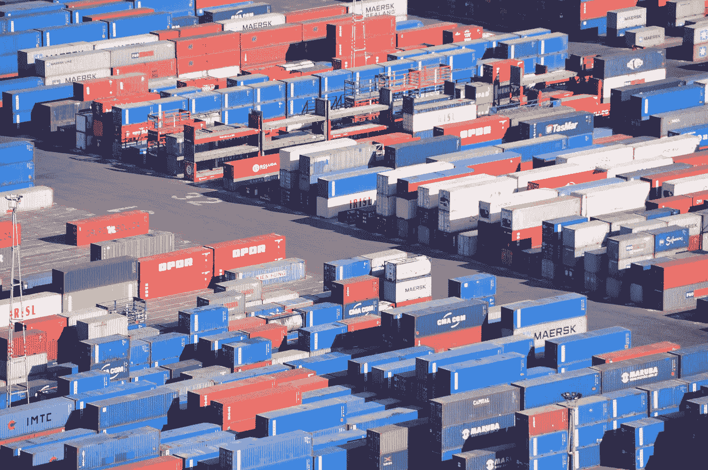

图片由 [Amira El Fohail](https://unsplash.com/@amirasartistry?utm_source=medium&utm_medium=referral) 提供，来源于 [Unsplash](https://unsplash.com/?utm_source=medium&utm_medium=referral)

无论你是经验丰富的开发者还是刚刚开始接触🐍 **Python**，了解如何构建稳健且可维护的项目都是很重要的。本文教程将引导你完成使用一些行业内最受欢迎和有效的工具来设置 Python 项目的过程。你将学习如何使用 [GitHub](https://github.com/) 和 [GitHub Actions](https://github.com/features/actions) 进行版本控制和持续集成，以及其他用于测试、文档编写、打包和分发的工具。该教程灵感来源于 [Hypermodern Python](https://medium.com/@cjolowicz/hypermodern-python-d44485d9d769) 和 [新 Python 项目的最佳实践](https://mitelman.engineering/blog/python-best-practice/automating-python-best-practices-for-a-new-project/)。然而，这并不是唯一的方法，你可能有不同的偏好或意见。教程旨在对初学者友好，同时也涵盖一些高级主题。在每个部分，你将自动化一些任务，并为你的项目添加徽章以展示你的进展和成就。

本系列的代码库可以在 [github.com/johschmidt42/python-project-johannes](https://github.com/johschmidt42/python-project-johannes) 找到

# 要求

+   **操作系统**: Linux, Unix, macOS, Windows (WSL2，例如 Ubuntu 20.04 LTS)

+   **工具**: python3.10, bash, git, tree

+   **版本控制系统 (VCS) 主机**: [GitHub](https://github.com/)

+   **持续集成 (CI) 工具**: [GitHub Actions](https://github.com/features/actions)

预计你对版本控制系统 (VCS) [git](https://git-scm.com/) 已经熟悉。如果不熟悉，这里有一个复习资料：[Git 入门介绍](https://realpython.com/python-git-github-intro/)

提交将基于 [最佳 git 提交实践](https://deepsource.io/blog/git-best-practices/) 和 [约定式提交](https://www.conventionalcommits.org/en/v1.0.0/)。对于 PyCharm，有 [约定式提交插件](https://plugins.jetbrains.com/plugin/13389-conventional-commit) 或者 [VSCode 扩展](https://github.com/vivaxy/vscode-conventional-commits) 可以帮助你按照这种格式撰写提交。

## 概述

+   [第一部分 (GitHub, IDE)](https://johschmidt42.medium.com/setting-up-python-projects-part-i-408603868c08)

+   第二部分 (格式化、Linting、CI)

+   第三部分 (测试、CI)

+   [第四部分 (文档、CI/CD)](https://johschmidt42.medium.com/setting-up-python-projects-part-iv-82059eba4ca4)

+   [第五部分 (版本控制与发布，CI/CD)](https://medium.com/@johschmidt42/setting-up-python-projects-part-v-206df3c1e3d3)

+   **第六部分 (容器化、Docker、CI/CD)**

# 结构

+   容器化

+   Docker

+   Dockerfile

+   Docker 镜像

+   Docker 容器

+   Docker 阶段 (*基础、构建、生产*)

+   容器注册中心 (*ghcr.io*)

+   Docker 推送

+   CI (*build.yml & build_and_push.yml*)

+   徽章 (*构建*)

+   奖励 (*trivy*)

在这篇文章中，我们将深入探讨**容器化**的概念及其好处，以及如何与**Docker**结合使用，以创建和管理容器化应用。我们将使用**GitHub Actions**来持续构建 Docker 镜像并在发布新版本时将其上传到我们的仓库。

# 容器化

容器化是一项现代技术，它彻底改变了软件应用的开发、部署和管理方式。近年来，由于它能够解决软件开发和部署中的一些重大挑战，已获得广泛采用。

简单来说，容器化是将应用程序及其所有依赖项打包成一个单一的**容器**的过程。这个容器是一个轻量、可移植、自给自足的单元，可以在不同的计算环境中一致地运行。它为应用程序提供了一个隔离的环境，确保它在任何底层基础设施下都能一致运行。它使开发者能够创建可扩展、可移植且易于管理的应用程序。此外，容器通过将应用程序与宿主系统隔离，提供了额外的安全层。如果你听到有人说“*它在我的电脑上能工作*”，这已经不再有效，因为你可以并且应该在 Docker 容器中测试你的应用。这确保了它在不同环境中的一致性。

总之，容器化是一项强大的技术，它允许开发者创建可靠、高效且易于管理的容器化应用，使他们能够专注于开发优秀的软件。

# Docker

Docker 是一个流行的容器化平台，允许开发人员创建、部署和运行容器化应用程序。它提供了一系列工具和服务，使得将应用程序打包和部署为容器化格式变得简单。使用 Docker，开发人员可以在几分钟内创建、测试和部署应用程序，而不是几天或几周。

要使用 docker 创建这样的容器化应用程序，我们需要

1.  从**Dockerfile**构建一个**Docker 镜像**

1.  从 Docker 镜像创建一个**容器**

为此，我们将使用 docker CLI。

# Dockerfile

Dockerfile 是一个包含所有构建给定镜像所需命令的文本文件。它遵循特定的格式和指令集，你可以在[这里](https://docs.docker.com/develop/develop-images/dockerfile_best-practices/)找到相关信息。

本节的目标是创建一个**构建我们 Python 包的 wheel 文件**的 Dockerfile：

```py
**FROM python:3.10-slim** 
**WORKDIR /app** # install poetry **ENV POETRY_VERSION=1.2.0
RUN pip install "poetry==$POETRY_VERSION"** # copy application **COPY ["pyproject.toml", "poetry.lock", "README.md", "./"]
COPY ["src/", "src/"]** # build wheel **RUN poetry build --format wheel** # install package **RUN pip install dist/*.whl**
```

这个 Dockerfile 本质上是一组指令，告诉 Docker 如何为 Python 应用程序构建一个容器。它以`python:3.10-slim`作为基础镜像开始，这是一种已经预装了一些基本库和依赖项的 Python 3.10 精简版镜像。

第一个指令`WORKDIR /app`将工作目录设置为容器内的`/app`，应用程序将被放置在此目录中。

下一个指令`ENV POETRY_VERSION=1.2.0`设置一个名为`POETRY_VERSION`的环境变量为`1.2.0`，此变量将在下一条命令中用于安装 Poetry 包管理器。

`RUN pip install "poetry==$POETRY_VERSION"`命令在容器内安装 Poetry 包管理器，用于管理 Python 应用程序的依赖项。

下一个指令`COPY ["pyproject.toml", "poetry.lock", "README.md", "./"]`将项目文件（包括`pyproject.toml`、`poetry.lock`和`README.md`）复制到容器中。

`README.md`文件是必需的，因为在 pyproject.toml 中有引用。没有它，我们将无法构建 wheel。

指令`COPY ["src/", "src/"]`将应用程序的源代码复制到容器中。

`RUN poetry build --format wheel`命令使用`poetry.lock`文件和应用程序的源代码为 Python 应用程序构建一个[Python wheel](https://realpython.com/python-wheels/)包。

最后，最后一条指令`RUN pip install dist/*.whl`使用`pip`安装包，并安装位于`dist`目录中的生成的`.whl`包文件。

**总之**，这个 Dockerfile 设置了一个包含 Python 3.10 和已安装 Poetry 的容器，复制了应用程序源代码和依赖项，构建了一个包 wheel 并安装它。

**这还不会运行应用程序**。但不用担心，我们将在接下来的章节中更新它。我们必须首先了解使用 Docker 的流程。

# Docker 镜像

我们已经创建了一个 **Dockerfile**，其中包含构建 Docker 镜像的指令。为什么我们需要 **Docker 镜像**？因为它允许我们构建 **Docker 容器**！

让我们运行 **docker build** 命令来创建我们的镜像：

```py
**> docker build --file Dockerfile --tag project:latest .**

...
 => [7/7] RUN pip install dist/*.whl                                                                                                                                                                                                                                                                              30.7s
 => exporting to image                                                                                                                                                                                                                                                                                             0.5s 
 => => exporting layers                                                                                                                                                                                                                                                                                            0.5s 
 => => writing image sha256:bb2acf440f4cf24ac00f051b1deaaefaf4e41b87aa26c34342cbb6faf6b55591                                                                                                                                                                                                                       0.0s 
 => => naming to docker.io/library/project:latest
```

此命令用于从 Dockerfile 构建 Docker 镜像，并使用指定的名称和版本标记它。让我们来解析一下命令：

+   `docker build`：这是用于构建 Docker 镜像的命令。

+   `--file Dockerfile`：此选项指定用于构建镜像的 Dockerfile 的路径和名称。在这种情况下，它被简单地命名为 `Dockerfile`，所以它使用了默认名称。

+   `--tag project:latest`：此选项指定要创建的镜像的名称和版本。在这种情况下，镜像名称为 `project`，版本为 `latest`。`project` 是给镜像的名称，而 `latest` 是版本号。你可以用你选择的名称和版本替换 `project` 和 `latest`。

+   `.`：此选项指定了构建上下文，即用于构建镜像的文件位置。在这种情况下，`.` 指当前执行命令的目录。

因此，当执行此命令时，Docker 会读取当前目录中的 Dockerfile，并使用它来构建一个名为 `project:latest` 的新镜像。我们可以通过运行以下命令找到有关结果镜像（及其他镜像）的更多信息：

```py
**> docker images**

REPOSITORY   TAG       IMAGE ID       CREATED         SIZE
project      latest    bb2acf440f4c   2 minutes ago   271MB
```

我们的镜像大小为 **271 mb**。大小将在后续减少。

# Docker 容器

我们可以使用 `docker run` 命令从 Docker 镜像创建/运行一个 Docker 容器。该命令需要一个参数，即镜像的名称。例如，如果你的镜像名为 `myimage`，你可以使用以下 [命令](https://docs.docker.com/language/python/run-containers/) 运行它：`docker run myimage`

如果我们像这样运行我们的应用：

```py
**> docker run -it --rm project:latest**
```

它将打开一个 Python 终端（你可以使用 **CTRL + D** 或 **CMD + D** 关闭会话；`-it` 选项用于以交互模式运行容器，并提供伪终端（终端仿真）。这允许你与容器的 shell 进行交互，并实时查看其输出。`-rm` 选项用于在容器退出时自动删除容器。）

```py
Python 3.10.10 (main, Mar 23 2023, 03:59:34) [GCC 10.2.1 20210110] on linux
Type "help", "copyright", "credits" or "license" for more information.
>>>
```

为什么它会打开一个 Python 会话？这是因为 Docker 镜像的 entrypoint 默认指向标准 **python:3.10-slim** 镜像中的 Python 解释器。如果我们想查看容器内部，我们必须覆盖 entrypoint。因为 **bash** 默认安装在此构建中，我们可以通过以下命令运行 Docker 容器并进入其中：

```py
**> docker run -it --rm project:latest /bin/bash**

root@76eb4cb2d8fb:/app#
```

所以我们用 **/bin/bash** 覆盖了 entrypoint。

现在我们可以检查容器内部的内容：

```py
app
├── README.md
├── dist
│   └── example_app-0.3.0-py3-none-any.whl
├── poetry.lock
├── pyproject.toml
└── src
    └── example_app
```

我们可以使用以下命令检查已安装的包：

```py
**> pip freeze**

...
dulwich==0.20.50
**example-app** @ file:///app/dist/example_app-0.3.0-py3-none-any.whl
fastapi==0.85.2
...
```

太好了，我们可以进入容器，这对于故障排除非常有用。但我们如何让它**运行我们的应用程序**？我们的应用程序安装在哪里？默认情况下，包可以在 Python 安装的**site-packages** 目录中找到。要获取这些信息，我们可以使用**pip show** 命令：

```py
**> pip show example-app**

Name: example-app
Version: 0.3.0
Summary: 
Home-page: https://github.com/johschmidt42/python-project-johannes
Author: Johannes Schmidt
Author-email: johannes.schmidt.vik@gmail.com
License: MIT
Location: **/usr/local/lib/python3.10/site-packages**
Requires: fastapi, httpx, uvicorn
Required-by:
```

由于**uvicorn**（我们的 ASGI 服务器实现）默认安装，我们可以**cd** 进入 */usr/local/lib/python3.10/site-packages/example_app*

并使用**uvicorn 命令**运行应用程序：

```py
**> uvicorn app:app --host 0.0.0.0 --port 80 --workers 1**

INFO:     Started server process [17]
INFO:     Waiting for application startup.
INFO:     Application startup complete.
INFO:     Uvicorn running on http://0.0.0.0:80 (Press CTRL+C to quit)
```

其中 `app:app` 遵循 `<file_name>:<variable_name>` 模式。

应用程序在 docker 容器中运行在**端口 80**，并使用**1 个工作进程**。为了在主机（你的机器）上访问，我们需要暴露容器端口并将其发布到主机。这可以通过在 docker run 命令中添加 `--expose` 和 `--publish` 标志来完成。或者，我们可以通过在**Dockerfile**中定义某个端口来让容器暴露该端口。我们稍后会做这个。之前，我们要做的是：

我们的应用程序可以在 site-packages 目录中找到。这要求我们在运行 `uvicorn app:app` 命令之前更改目录。如果我们想避免更改目录，我们可以创建一个文件来为我们导入应用程序。以下是一个示例：

添加一个 `main.py`：

```py
# main.py

from example_app.app import app

if __name__ == '__main__':
    print(app.title)
```

在 `main.py` 中导入应用程序，以便 uvicorn 可以使用它。如果我们现在将这个文件复制到我们的 `/app` 目录：

```py
# Dockerfile
...
**COPY ["main.py", "./"]**
...
```

我们可以运行应用程序

```py
**> uvicorn main:app --host 0.0.0.0 --port 80 --workers 1**

INFO:     Started server process [8]
INFO:     Waiting for application startup.
INFO:     Application startup complete.
INFO:     Uvicorn running on http://0.0.0.0:80 (Press CTRL+C to quit)
```

太好了。现在让我们将这个命令设置为启动容器时的**入口点**。

```py
FROM python:3.10-slim

WORKDIR /app

# install poetry
ENV POETRY_VERSION=1.2.0
RUN pip install "poetry==$POETRY_VERSION"

# copy application
COPY ["pyproject.toml", "poetry.lock", "README.md", "**main.py**", "./"]
COPY ["src/", "src/"]

# build wheel
RUN poetry build --format wheel

# install package
RUN pip install dist/*.whl

# expose port
**EXPOSE 80**

# command to run
**CMD ["uvicorn", "main:app", "--host", "0.0.0.0", "--port", "80", "--workers", "1"]**
```

现在我们将 `main.py` 文件复制到 `/app` 目录。`EXPOSE` 指令通知 Docker 容器在运行时监听指定的网络端口。在这种情况下，它暴露了**端口 80**。

`CMD` 指令指定了在容器内运行的命令。在这里，它运行命令 `uvicorn main:app --host 0.0.0.0 --port 80 --workers 1`。这个命令启动了一个 uvicorn 服务器，运行 `main:app` 应用程序，监听主机 `0.0.0.0` 和端口 `80`，使用 `1` 个工作进程。

然后我们可以使用**docker run** 命令运行容器：

```py
> **docker run -p 9000:80 -it --rm project:latest**

[2023-01-30 21:04:33 +0000] [1] [INFO] Starting gunicorn 20.1.0
[2023-01-30 21:04:33 +0000] [1] [INFO] Listening at: http://0.0.0.0:80 (1)
[2023-01-30 21:04:33 +0000] [1] [INFO] Using worker: uvicorn.workers.UvicornWorker
[2023-01-30 21:04:33 +0000] [7] [INFO] Booting worker with pid: 7
[2023-01-30 21:04:34 +0000] [7] [INFO] Started server process [7]
[2023-01-30 21:04:34 +0000] [7] [INFO] Waiting for application startup.
[2023-01-30 21:04:34 +0000] [7] [INFO] Application startup complete.
```

`docker run` 命令中的 `-p` 标志用于将容器的端口发布到主机。在这种情况下，它将主机上的端口 `9000` 映射到容器上的端口 `80`。这意味着任何发送到主机端口 `9000` 的流量都会被转发到容器端口 `80`。

我们可以看到在容器中运行的应用程序可以被访问：

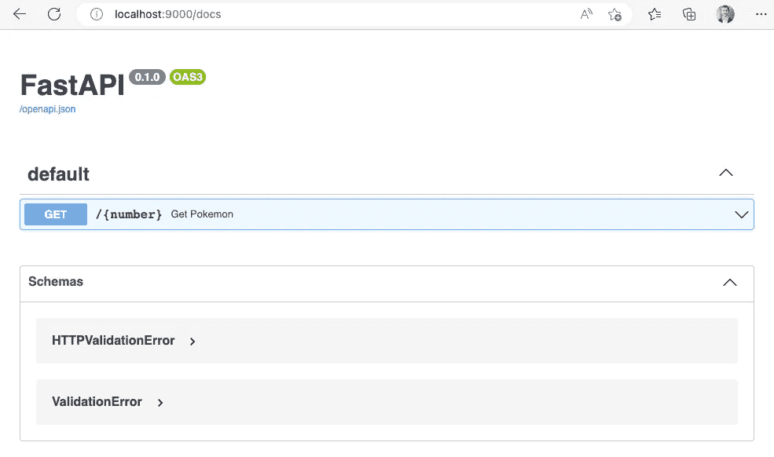

运行在 Docker 容器中的 fastAPI 应用程序 — 作者图片

**重要备注**：我建议在生产构建中使用 [**gunicorn**](https://gunicorn.org/) 代替 uvicorn！为了完整性，这里是 Dockerfile 的替代版本：

```py
FROM python:3.10-slim

WORKDIR /app

# install poetry
ENV POETRY_VERSION=1.2.0
RUN pip install "poetry==$POETRY_VERSION"

# install gunicorn (ASGI web implementation)
**RUN pip install gunicorn==20.1.0**

# copy application
COPY ["pyproject.toml", "poetry.lock", "README.md", "./"]
COPY ["src/", "src/"]

# build wheel
RUN poetry build --format wheel

# install package
RUN pip install dist/*.whl

# expose port
EXPOSE 80

# command to run
CMD ["**gunicorn**", "main:app", "**--bind**", "**0.0.0.0:80**", "--workers", "1", "**--worker-class", "uvicorn.workers.UvicornWorker**"]
```

这两个有什么区别？

Uvicorn 是一个支持 ASGI 协议的 ASGI 服务器。它建立在 [uvloop](https://uvloop.readthedocs.io/) 和 [httptools](https://pypi.org/project/httptools/) 之上，并以其性能优势而闻名。[然而，它作为进程管理器的能力还有待提高](https://stackoverflow.com/questions/66362199/what-is-the-difference-between-uvicorn-and-gunicornuvicorn)。

Gunicorn 另一方面是一个成熟且功能全面的服务器和进程管理器。[它是从 Ruby 的 Unicorn 项目移植而来的预叉工人模型，并与各种 web 框架广泛兼容](https://stackshare.io/stackups/gunicorn-vs-uvicorn)。

# Docker 阶段

Docker 阶段是一项功能，允许你在 Dockerfile 中创建多个阶段。每个阶段可以有自己的 **基础镜像** 和指令集。你可以选择性地将工件从一个阶段复制到另一个阶段，留下你不想要的内容。[此功能很有用，因为它可以通过减少 Docker 镜像的大小和复杂性来优化 Docker 镜像](https://docs.docker.com/build/building/multi-stage/)。

使用 Docker 阶段，我们可以（并且应该！）优化我们的 Docker 镜像。所以我们想要实现的是：

+   poetry 不应该出现在生产构建中

+   生产构建应该仅包含运行应用程序所需的最少内容

这就是我们要做到的方法：我们创建一个干净的 **基础** 阶段。从基础阶段，我们有一个 **构建** 阶段，安装 poetry 并构建 wheel。另一个阶段，**生产，** 可以从构建阶段复制这个工件（.whl 文件）并使用它。这样我们可以避免在生产构建中安装 poetry，同时也将其限制为仅包含必要内容，从而减少最终镜像的大小。

## 关于 Docker 中的 poetry

我见过不同的策略将 poetry 与 Docker 结合使用。

+   创建一个 **虚拟环境**，然后将整个 **venv** 从一个阶段复制到另一个阶段。

+   从 **poetry.lock** 文件创建 **requirements.txt** 文件，并使用这些文件通过 pip 安装要求。

在第一种情况下，Poetry 在构建镜像时安装。在第二种情况下，Poetry 不在 Docker 构建中安装，但需要使用 Poetry 来创建 requirements.txt 文件。

在这两种情况下，我们需要以某种方式安装 Poetry——无论是在 Docker 镜像中还是在运行 Docker 构建命令的主机上。

将 Poetry 放入 Docker 中会稍微增加构建时间，而将其放在 Docker 之外则需要你在主机上安装 Poetry，并为构建过程添加额外步骤（从 poetry.lock 创建 requirements.txt 文件）。在 Docker 构建 **CI 流水线** 的上下文中，主机上的 Poetry 安装可以被缓存，构建过程通常会更快。这两种方法都有其优缺点，最佳方法将取决于你的具体需求和偏好。

为了本教程的目的，我将保持简单，使用上面描述的 **venv 策略**。所以这是新的 Dockfile，其中包含阶段（为了识别不同的阶段，通过 **FROM** 语句分隔，我将这些行用 **粗体** 高亮）：

```py
**FROM python:3.10-slim as base**

WORKDIR /app

# ignore 'Running pip as the root user...' warning
ENV PIP_ROOT_USER_ACTION=ignore

# update pip
RUN pip install --upgrade pip

**FROM base as builder**

# install poetry
ENV POETRY_VERSION=1.3.1
RUN pip install "poetry==$POETRY_VERSION"

# copy application
COPY ["pyproject.toml", "poetry.lock", "README.md", "./"]
COPY ["src/", "src/"]

# build wheel
RUN poetry build --format wheel

**FROM base as production**

# expose port
EXPOSE 80

# copy the wheel from the build stage
COPY --from=builder /app/dist/*.whl /app/

# install package
RUN pip install /app/*.whl

# copy entrypoint of the app
COPY ["main.py", "./"]

# command to run
CMD ["uvicorn", "main:app","--host", "0.0.0.0", "--port", "80", "--workers", "1"] 
```

这个 Dockerfile 定义了一个包含三个阶段的多阶段构建：`base`、`builder` 和 `production`。

1.  `base` 阶段从 Python 3.10-slim 镜像开始，将工作目录设置为 `/app`。它还设置了一个环境变量以忽略关于以 root 用户身份运行 pip 的警告，并将 pip 更新到最新版本。

1.  `builder` 阶段从 `base` 阶段开始，并使用 pip 安装 Poetry。然后，它复制应用程序文件，并使用 Poetry 为应用程序构建一个 wheel 文件。

1.  `production` 阶段再次从 `base` 阶段开始，并暴露端口 80。它复制在 `builder` 阶段构建的 wheel 文件，并使用 pip 安装。它还复制应用程序的入口点，并将命令设置为使用 uvicorn 运行应用程序。

我们现在可以使用以下命令重新构建我们的 Docker 镜像：

```py
**> docker build --file Dockerfile --tag project:latest --target production .**
```

我们可以使用 `--target` 标志指定我们希望构建的阶段。

文件大小现在减少了 **~70 Mb**，总共为 **197MB**：

```py
**> docker images**

REPOSITORY   TAG       IMAGE ID       CREATED          SIZE
project      latest    f1be09c32a55   14 minutes ago   **197MB**
```

我们可以使用以下命令运行它：

```py
**> docker run -p 9000:80 -it --rm project:latest**
```

API 将在浏览器中通过 [`localhost:9000`](http://localhost:9000) 提供。


fastAPI 应用程序在 Docker 容器中运行 — 作者图片

# 容器注册表

容器注册表是用于存储和访问容器镜像的仓库或仓库集合。容器注册表可以支持基于容器的应用程序开发，通常作为 [DevOps](https://realpython.com/learning-paths/python-devops/) 过程的一部分。它们可以直接连接到像 [Docker 和 Kubernetes](https://www.redhat.com/en/topics/cloud-native-apps/what-is-a-container-registry) 这样的容器编排平台。

最受欢迎的容器注册表是 [Docker Hub](https://hub.docker.com/)。每个云服务提供商都有自己的注册表。Azure 的 ACR、AWS 的 ECR 以及更多。GitHub 有一个名为 [GitHub Packages](https://github.com/features/packages) 的包注册解决方案。

由于我们到目前为止基本上都在 GitHub 上完成了所有操作，所以在本教程中我们将使用 **GitHub Packages**。


GitHub Packages — 作者图片

GitHub 为普通用户提供了免费的层级。这允许我们为我们的容器使用最多 **500 MB** 的存储空间。这对我们的应用程序来说足够了。

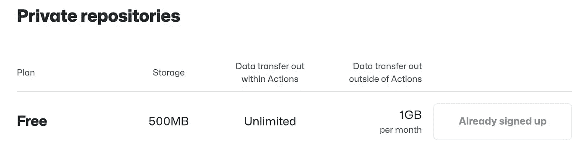

GitHub Packages 定价和免费层 — 作者图片

# Docker push

`docker push` 命令用于 **上传** Docker 镜像到容器注册表。这允许你与其他人分享你的镜像或将其部署到不同的环境中。该命令需要你指定要推送的镜像名称和要推送到的注册表名称作为参数。在推送镜像之前，你需要登录到注册表。

这是将 Docker 镜像推送到容器注册表的步骤：

1.  **标记**（重命名）你的镜像，使用注册表名称：`docker tag project:latest <registry-name>/<project>:latest`

1.  **登录**到容器注册表：`docker login <registry-url>`

1.  **推送**你的镜像到注册表：`docker push <registry-name>/<project>:latest`

我们将把镜像推送到[GitHub Packages](https://github.com/features/packages)：

## GitHub Packages

GitHub Packages 仅支持使用个人访问令牌进行身份验证（2023 年 2 月）。但我们在[第五部分](https://medium.com/@johschmidt42/setting-up-python-projects-part-v-206df3c1e3d3)创建了一个个人访问令牌（PAT），所以我们也可以在这里使用它。

我们需要[登录到容器注册表](https://docs.github.com/en/packages/learn-github-packages/connecting-a-repository-to-a-package)：

```py
> CR_PAT="XYZ"
> echo $CR_PAT | docker login ghcr.io -u johschmidt42 --password-stdin

Login Succeeded
```

这是一个 shell 命令，使用管道将两个命令连接起来。管道是一个符号（`|`），它将一个命令的输出重定向到另一个命令的输入。在这种情况下，第一个命令是 `echo $(CR_PAT)`，它将 CR_PAT 变量的值打印到标准输出。第二个命令是 `docker login ghcr.io -u johschmidt42 --password-stdin`，它使用 johschmidt42 作为用户名，并从标准输入读取密码来登录 ghcr.io。通过使用管道，echo 命令的输出成为 docker login 命令的输入，这意味着 CR_PAT 变量的值被用作登录密码。

让我们把它添加到我们的 Makefile 中

```py
# Makefile

...

login: ## login to ghcr.io using a personal access token (PAT)
 @if [ -z "$(CR_PAT)" ]; then\
  echo "CR_PAT is not set";\
 else\
  echo $(CR_PAT) | docker login ghcr.io -u johschmidt42 --password-stdin;\
 fi

...
```

我们需要在**bash**中写一个小的 if-else 语句，以便这个目标登录需要我们首先设置**CR_PAT**。

这使我们现在可以像这样登录：

```py
> **make login CR_PAT="XYZ"**
```

对于任何对 bash 命令感到困惑的人，这里有一个解释：

这个 shell 命令使用 if-else 语句来检查一个条件，并根据不同的条件执行不同的操作。条件是 `[ -z "$(CR_PAT)" ]`，这意味着“CR_PAT 变量为空吗？” `-z` 标志测试零长度。`$(CR_PAT)` 部分在括号内展开 CR_PAT 变量的值。如果条件为真，那么 `then` 后的操作会被执行，即 `echo "CR_PAT is not set"`。这将一条消息打印到标准输出。如果条件为假，则执行 `else` 后的操作，即 `echo $(CR_PAT) | docker login ghcr.io -u johschmidt42 --password-stdin`。每行末尾的 `\` 意味着命令继续在下一行。末尾的 `fi` 标志着 if-else 语句的结束。

现在我们已登录，我们需要重命名 docker 文件，以便使用 docker tag 命令将其推送到远程注册表：

```py
> **docker tag project:latest ghcr.io/johschmidt42/project:latest**
```

```py
# Makefile

...

tag: ## tag docker image to ghcr.io/johschmidt42/project:latest
 @docker tag project:latest ghcr.io/johschmidt42/project:latest

...
```

我们可以通过以下命令查看有关我们的 docker 镜像的信息：

```py
**> docker images**

REPOSITORY                     TAG       IMAGE ID       CREATED             SIZE
project                        latest    f1be09c32a55   About an hour ago   197MB
ghcr.io/johschmidt42/project   latest    f1be09c32a55   About an hour ago   197MB
```

如果我们现在尝试将镜像推送到注册表，它会**失败**：

```py
> **docker push ghcr.io/johschmidt42/project:latest** 
denied: permission_denied: The token provided does not match expected scopes.
```

```py
# Makefile

...

push: tag ## docker push to container registry (ghcr.io)
 @docker push ghcr.io/johschmidt42/project:latest

...
```

这是因为我们的令牌**没有预期的范围**。消息没有告诉我们需要哪些范围（权限），但我们可以在[文档](https://docs.github.com/en/packages/learn-github-packages/about-permissions-for-github-packages)中找到这些信息。

所以我们需要添加这些范围：

+   **read:packages**

+   **delete:packages**

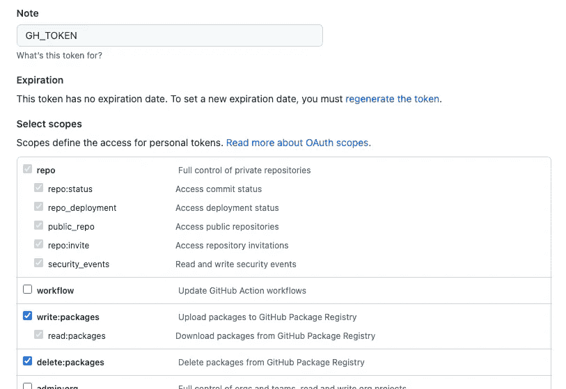

GH_TOKEN — 作者提供的图片

现在我们看到它被推送到容器注册表：

```py
> **make push**

1a3ba1c1448c: Pushed 
0ad139eaf32a: Pushing [========================================>          ]   43.3MB/54.08MB
0e0b5d4aea1e: Pushed 
a179cef7de6a: Pushing [==================================================>]  18.15MB
22f1e17dcfe4: Pushed 
805fe34ec92b: Pushing [==================================================>]  12.76MB
fa04dee82d1b: Pushed 
42d55226bf51: Pushing [==================================================>]  30.83MB
7d13900c8624: Pushed 
650abce4b096: Pushing [==============>                                    ]  22.72MB/80.51MB
latest: digest: sha256:57d409bb564f465541c2529e77ad05a02f09e2cc22b3c38a93967ce1b277f58a size: 2414 
```

在 GitHub 中，`profile`下的`packages`标签中现在有一个 docker 镜像：

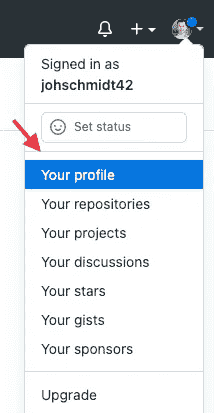

你的个人资料 — 作者提供的图片

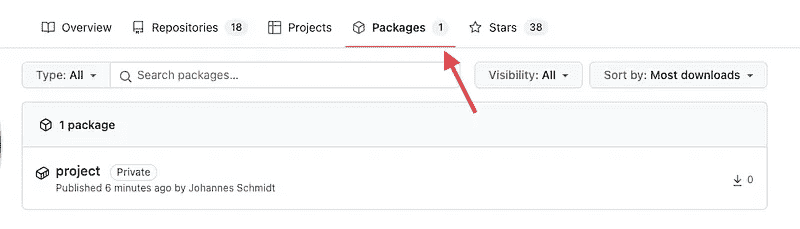

GitHub packages — 作者提供的图片

点击它，可以[将包连接到我们的仓库](https://docs.github.com/en/packages/learn-github-packages/connecting-a-repository-to-a-package)：

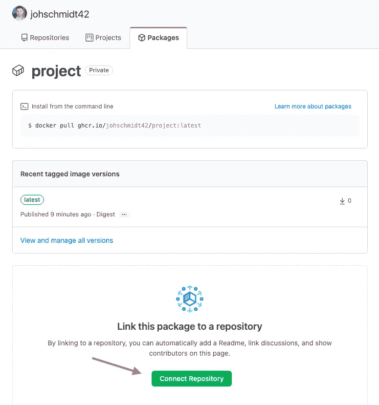

GitHub packages: 连接仓库 — 作者提供的图片

现在，这个 docker 镜像可以在仓库的首页找到 [github.com/johschmidt42/python-project-johannes](https://github.com/johschmidt42/python-project-johannes)：

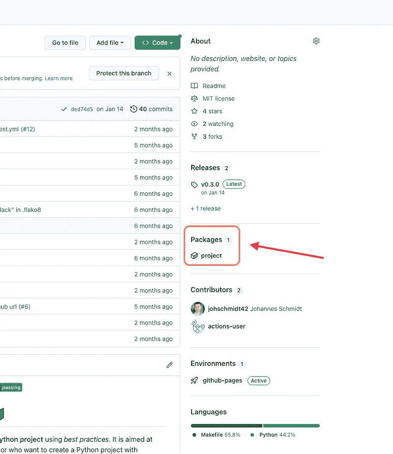

GitHub Packages 首页 — 作者提供的图片

很好。我们已经创建了一个 Docker 镜像，将其推送到远程仓库，链接到我们当前的版本，现在每个人都可以通过运行 docker pull 命令来测试我们的应用：

```py
**> docker pull ghcr.io/johschmidt42/python-project-johannes:v0.4.1**
```

# CI/CD：

CI/CD 代表持续集成和持续部署。通过 Docker 镜像，CI/CD 可以自动化构建、测试和部署镜像的过程。在本教程中，我们将重点关注持续构建我们的 Docker 镜像并在有新版本时将其推送到远程容器注册表（CI）。然而，在本教程中，我们不会部署镜像（CD）（请关注未来的博客文章）。我们的 Docker 容器将在以下情况构建：

+   提交到一个有打开的 PR 的分支

+   提交到默认分支（main）

+   创建一个新版本（这会将镜像推送到容器注册表）

第一个动作帮助我们及早发现错误。第二个动作使我们能够在 README.md 文件中创建并使用徽章。最后一个动作创建 Docker 镜像的新版本并将其推送到容器注册表。整体动作流程总结如下：

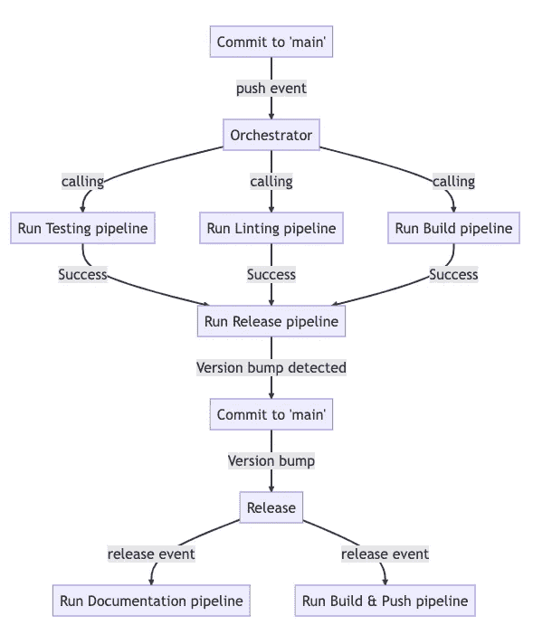

GitHub Actions 流程 — 作者提供的图片

让我们创建`build`管道：

这个 GitHub Actions 工作流构建了一个 Docker 镜像。当有**push**或**pull request**到**main**分支时，或者当工作流被调用时，它会被触发。这个工作是命名为“Build”，包含两个步骤。第一步使用`actions/checkout`动作检出仓库。第二步通过运行`make build`命令来构建 Docker 镜像。就是这样。

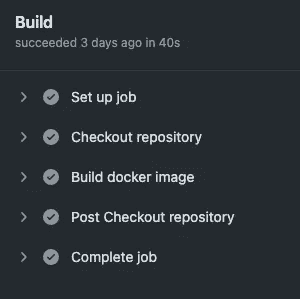

工作流运行 — 作者提供的图片

我们还需要相应地更新 `orchestrator.yml`：

当我们推送到 `main` 分支时，会触发 orchestrator。

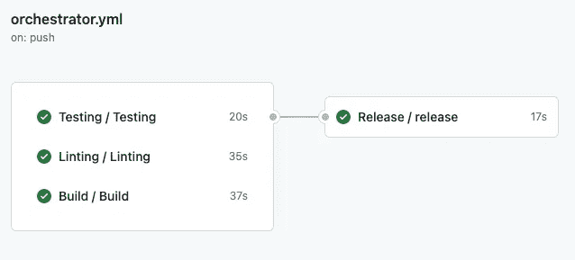

orchestrator.yml — 图片由作者提供

为了在我们的 GitHub 存储库中发布每个 **新版本** 时构建新的 Docker 镜像，我们需要创建一个新的 GitHub Actions 工作流：

这是一个 GitHub Actions 工作流，当发布版本时，它会构建并推送 Docker 镜像到 GitHub Container Registry (ghcr.io)。名为“build_and_push”的作业有三个步骤。第一步使用 `actions/checkout` 操作检出存储库。第二步使用 `docker/login-action` 登录到 GitHub Container Registry。第三步使用 `docker/build-push-action` 构建并推送 Docker 镜像。

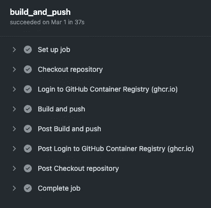

build_and_push — 图片由作者提供

请注意，为了使用 [docker/login-action@v2](https://github.com/docker/login-action) 登录到 GitHub Container Registry，我们需要提供 **GH_TOKEN** 这个 PAT，正如我们在 [Part V](https://medium.com/@johschmidt42/setting-up-python-projects-part-v-206df3c1e3d3) 中定义的那样。

以下是最后一步中使用的参数的简要说明 [docker/build-push-action@4](https://github.com/docker/build-push-action)：

+   `context: .` 指定构建上下文为当前目录。

+   `push: true` 指定在构建后将图像推送到注册表。

+   `tags: ghcr.io/${{ github.repository }}:${{ github.ref_name }}` 指定图像的标签。在这种情况下，它使用存储库的名称和触发工作流的分支或标签名称进行标记。

+   `labels:` 指定图像的标签。在这种情况下，它设置了图像的源、标题和版本标签。

+   `target: production` 指定在多阶段 Dockerfile 中构建的目标阶段。

+   `github-token: ${{ secrets.GH_TOKEN }}` 指定用于认证的 GitHub 令牌。

我们可以在 GitHub 上看到我们的新 Docker 镜像：

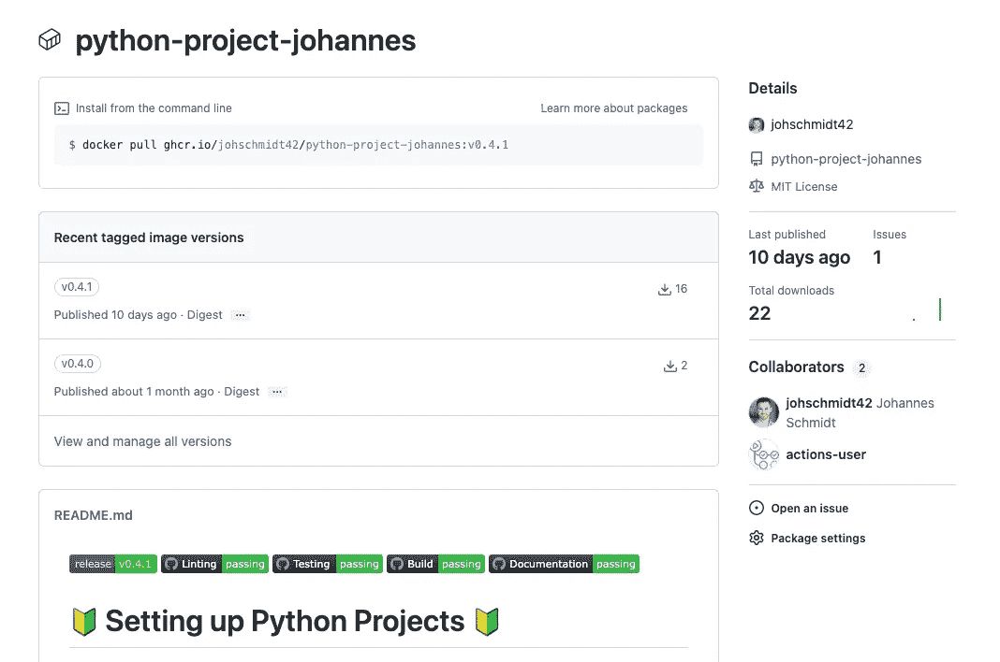

GitHub 上的图像 — 图片由作者提供

# 徽章：

对于这部分，我们将像以前一样向我们的 repo 添加一个徽章。这一次是针对 **构建** 管道的。当我们点击 *build.yml* 工作流运行时，可以检索徽章：

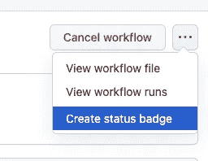

创建状态徽章 — 图片由作者提供

从 GitHub 上的工作流文件创建状态徽章

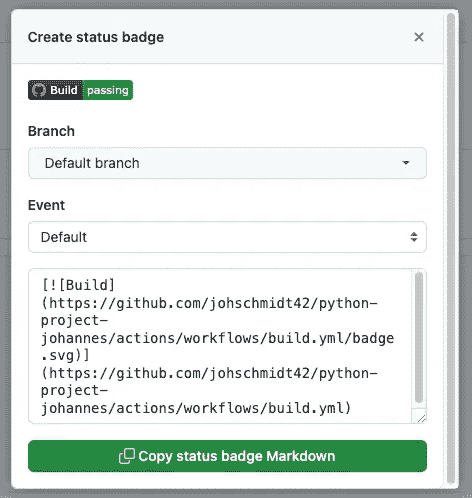

复制状态徽章 Markdown — 图片由作者提供

并选择主分支。徽章的 Markdown 可以复制并添加到 *README.md* 中：

我们的 GitHub 登陆页面现在看起来是这样的 ❤：

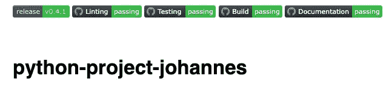

README.md 中的第五个徽章：构建 — 图片由作者提供

如果你想了解如何神奇地显示 *main* 中最后一次管道运行的当前状态，请查看 GitHub 上的提交 [statuses API](https://docs.github.com/en/rest/commits/statuses)。

这就结束了教程的核心部分！我们成功创建了一个**Dockerfile**，并使用它构建了一个**Docker 镜像**，使我们能够在**Docker 容器**中运行我们的应用程序。此外，我们实施了一个**CI/CD** 管道，自动构建我们的 Docker 镜像并将其推送到**容器注册表**。最后，我们在 *README.md* 文件中添加了一个徽章，向世界展示我们功能齐全的构建管道！

这就是最后一部分！这个教程是否帮助你在 GitHub 上构建了一个 Python 项目？有任何改进建议吗？让我知道你的想法！

[](https://johschmidt42.medium.com/membership?source=post_page-----cbdbf28eff53--------------------------------) [## 通过我的推荐链接加入 Medium - Johannes Schmidt

### 阅读 Johannes Schmidt 的每个故事（以及 Medium 上的其他成千上万名作者的故事）。你的会员费直接…

johschmidt42.medium.com](https://johschmidt42.medium.com/membership?source=post_page-----cbdbf28eff53--------------------------------)

# 奖励

## 清理：

以下是使用 Docker CLI 时的一些有用命令：

要停止所有容器并删除它们：

```py
> docker stop $(docker ps -a -q) && docker rm $(docker ps -a -q)
```

要删除所有未使用的 Docker 镜像：

```py
> docker rmi $(docker images --filter "dangling=true" -q --no-trunc)
```

## Docker 镜像中的漏洞扫描

漏洞扫描是确保 Docker 镜像**安全性**的关键步骤。它帮助你识别并修复可能会危害应用程序或数据的潜在弱点或风险。其中一个可以帮助你的工具是 [**trivy**](https://github.com/aquasecurity/trivy)。

这个开源工具是一个简单快速的**Docker 镜像漏洞扫描器**，支持多种格式和来源。我将演示如何在本地使用它。理想情况下，你应该考虑创建一个 GitHub Actions 工作流，每当你构建 Docker 镜像时都运行！

我们首先应根据 [文档](https://aquasecurity.github.io/trivy/v0.43/getting-started/installation/) 安装 **trivy**。在构建生产 Docker 镜像后

```py
> docker build --file Dockerfile --tag project:latest --target production .
```

我们可以用以下命令扫描构建的镜像

```py
> **trivy image project:latest --scanners vuln --format table --severity  CRITICAL,HIGH**
```

这将从数据库下载已知的最新漏洞并扫描镜像。输出将以表格形式`--format table`显示，仅包含严重性为 CRITICAL 或 HIGH 的发现`--severity CRITICAL,HIGH`：

```py
project:latest (debian 12.0)

Total: 27 (HIGH: 27, CRITICAL: 0)

┌────────────────┬────────────────┬──────────┬───────────────────┬───────────────┬──────────────────────────────────────────────────────────────┐
│    Library     │ Vulnerability  │ Severity │ Installed Version │ Fixed Version │                            Title                             │
├────────────────┼────────────────┼──────────┼───────────────────┼───────────────┼──────────────────────────────────────────────────────────────┤
│ linux-libc-dev │ CVE-2013-7445  │ **HIGH**     │ 6.1.27-1          │               │ kernel: memory exhaustion via crafted Graphics Execution     │
│                │                │          │                   │               │ Manager (GEM) objects                                        │
│                │                │          │                   │               │ https://avd.aquasec.com/nvd/cve-2013-7445                    │
│                ├────────────────┤          │                   ├───────────────┼──────────────────────────────────────────────────────────────┤
│                │ CVE-2019-19449 │          │                   │               │ kernel: mounting a crafted f2fs filesystem image can lead to │
│                │                │          │                   │               │ slab-out-of-bounds read...                                   │
│                │                │          │                   │               │ https://avd.aquasec.com/nvd/cve-2019-19449                   │
│                ├────────────────┤          │                   ├───────────────┼──────────────────────────────────────────────────────────────┤
│                │ CVE-2019-19814 │          │                   │               │ kernel: out-of-bounds write in __remove_dirty_segment in     │
│                │                │          │                   │               │ fs/f2fs/segment.c                                            │
│                │                │          │                   │               │ https://avd.aquasec.com/nvd/cve-2019-19814                   │
│                ├────────────────┤          │                   ├───────────────┼──────────────────────────────────────────────────────────────┤
│                │ CVE-2021-3847  │          │                   │               │ low-privileged user privileges escalation                    │
│                │                │          │                   │               │ https://avd.aquasec.com/nvd/cve-2021-3847                    │
│                ├────────────────┤          │                   ├───────────────┼──────────────────────────────────────────────────────────────┤
│                │ CVE-2021-3864  │          │                   │               │ descendant's dumpable setting with certain SUID binaries     │
│                │                │          │                   │               │ https://avd.aquasec.com/nvd/cve-2021-3864                    │
│                ├────────────────┤          │                   ├───────────────┼──────────────────────────────────────────────────────────────┤
│                │ CVE-2023-1194  │          │                   │               │ use-after-free in parse_lease_state()                        │
│                │                │          │                   │               │ https://avd.aquasec.com/nvd/cve-2023-1194                    │
│                ├────────────────┤          │                   ├───────────────┼──────────────────────────────────────────────────────────────┤
│                │ CVE-2023-2124  │          │                   │ 6.1.37-1      │ OOB access in the Linux kernel's XFS subsystem               │
│                │                │          │                   │               │ https://avd.aquasec.com/nvd/cve-2023-2124                    │
│                ├────────────────┤          │                   │               ├──────────────────────────────────────────────────────────────┤
│                │ CVE-2023-2156  │          │                   │               │ IPv6 RPL protocol reachable assertion leads to DoS           │
│                │                │          │                   │               │ https://avd.aquasec.com/nvd/cve-2023-2156                    │
│                ├────────────────┤          │                   ├───────────────┼──────────────────────────────────────────────────────────────┤
│                │ CVE-2023-2176  │          │                   │               │ Slab-out-of-bound read in compare_netdev_and_ip              │
│                │                │          │                   │               │ https://avd.aquasec.com/nvd/cve-2023-2176                    │
│                ├────────────────┤          │                   ├───────────────┼──────────────────────────────────────────────────────────────┤
│                │ CVE-2023-3090  │          │                   │ 6.1.37-1      │ out-of-bounds write caused by unclear skb->cb                │
│                │                │          │                   │               │ https://avd.aquasec.com/nvd/cve-2023-3090                    │
│                ├────────────────┤          │                   ├───────────────┼──────────────────────────────────────────────────────────────┤
│                │ CVE-2023-31248 │          │                   │               │ use-after-free in nft_chain_lookup_byid()                    │
│                │                │          │                   │               │ https://avd.aquasec.com/nvd/cve-2023-31248                   │
│                ├────────────────┤          │                   ├───────────────┼──────────────────────────────────────────────────────────────┤
│                │ CVE-2023-32247 │          │                   │ 6.1.37-1      │ session setup memory exhaustion denial-of-service            │
│                │                │          │                   │               │ vulnerability                                                │
│                │                │          │                   │               │ https://avd.aquasec.com/nvd/cve-2023-32247                   │
│                ├────────────────┤          │                   │               ├──────────────────────────────────────────────────────────────┤
│                │ CVE-2023-32248 │          │                   │               │ tree connection NULL pointer dereference denial-of-service   │
│                │                │          │                   │               │ vulnerability                                                │
│                │                │          │                   │               │ https://avd.aquasec.com/nvd/cve-2023-32248                   │
│                ├────────────────┤          │                   │               ├──────────────────────────────────────────────────────────────┤
│                │ CVE-2023-32250 │          │                   │               │ session race condition remote code execution vulnerability   │
│                │                │          │                   │               │ https://avd.aquasec.com/nvd/cve-2023-32250                   │
│                ├────────────────┤          │                   │               ├──────────────────────────────────────────────────────────────┤
│                │ CVE-2023-32252 │          │                   │               │ session NULL pointer dereference denial-of-service           │
│                │                │          │                   │               │ vulnerability                                                │
│                │                │          │                   │               │ https://avd.aquasec.com/nvd/cve-2023-32252                   │
│                ├────────────────┤          │                   │               ├──────────────────────────────────────────────────────────────┤
│                │ CVE-2023-32254 │          │                   │               │ tree connection race condition remote code execution         │
│                │                │          │                   │               │ vulnerability                                                │
│                │                │          │                   │               │ https://avd.aquasec.com/nvd/cve-2023-32254                   │
│                ├────────────────┤          │                   │               ├──────────────────────────────────────────────────────────────┤
│                │ CVE-2023-32257 │          │                   │               │ session race condition remote code execution vulnerability   │
│                │                │          │                   │               │ https://avd.aquasec.com/nvd/cve-2023-32257                   │
│                ├────────────────┤          │                   │               ├──────────────────────────────────────────────────────────────┤
│                │ CVE-2023-32258 │          │                   │               │ session race condition remote code execution vulnerability   │
│                │                │          │                   │               │ https://avd.aquasec.com/nvd/cve-2023-32258                   │
│                ├────────────────┤          │                   │               ├──────────────────────────────────────────────────────────────┤
│                │ CVE-2023-3268  │          │                   │               │ out-of-bounds access in relay_file_read                      │
│                │                │          │                   │               │ https://avd.aquasec.com/nvd/cve-2023-3268                    │
│                ├────────────────┤          │                   │               ├──────────────────────────────────────────────────────────────┤
│                │ CVE-2023-3269  │          │                   │               │ distros-[DirtyVMA] Privilege escalation via                  │
│                │                │          │                   │               │ non-RCU-protected VMA traversal                              │
│                │                │          │                   │               │ https://avd.aquasec.com/nvd/cve-2023-3269                    │
│                ├────────────────┤          │                   │               ├──────────────────────────────────────────────────────────────┤
│                │ CVE-2023-3390  │          │                   │               │ UAF in nftables when nft_set_lookup_global triggered after   │
│                │                │          │                   │               │ handling named and anonymous sets...                         │
│                │                │          │                   │               │ https://avd.aquasec.com/nvd/cve-2023-3390                    │
│                ├────────────────┤          │                   ├───────────────┼──────────────────────────────────────────────────────────────┤
│                │ CVE-2023-3397  │          │                   │               │ slab-use-after-free Write in txEnd due to race condition     │
│                │                │          │                   │               │ https://avd.aquasec.com/nvd/cve-2023-3397                    │
│                ├────────────────┤          │                   ├───────────────┼──────────────────────────────────────────────────────────────┤
│                │ CVE-2023-35001 │          │                   │               │ stack-out-of-bounds-read in nft_byteorder_eval()             │
│                │                │          │                   │               │ https://avd.aquasec.com/nvd/cve-2023-35001                   │
│                ├────────────────┤          │                   ├───────────────┼──────────────────────────────────────────────────────────────┤
│                │ CVE-2023-35788 │          │                   │ 6.1.37-1      │ out-of-bounds write in fl_set_geneve_opt()                   │
│                │                │          │                   │               │ https://avd.aquasec.com/nvd/cve-2023-35788                   │
│                ├────────────────┤          │                   ├───────────────┼──────────────────────────────────────────────────────────────┤
│                │ CVE-2023-35827 │          │                   │               │ race condition leading to use-after-free in ravb_remove()    │
│                │                │          │                   │               │ https://avd.aquasec.com/nvd/cve-2023-35827                   │
│                ├────────────────┤          │                   ├───────────────┼──────────────────────────────────────────────────────────────┤
│                │ CVE-2023-3640  │          │                   │               │ a per-cpu entry area leak was identified through the         │
│                │                │          │                   │               │ init_cea_offsets function when...                            │
│                │                │          │                   │               │ https://avd.aquasec.com/nvd/cve-2023-3640                    │
├────────────────┼────────────────┤          ├───────────────────┼───────────────┼──────────────────────────────────────────────────────────────┤
│ perl-base      │ CVE-2023-31484 │          │ 5.36.0-7          │               │ CPAN.pm before 2.35 does not verify TLS certificates when    │
│                │                │          │                   │               │ downloading distributions over...                            │
│                │                │          │                   │               │ https://avd.aquasec.com/nvd/cve-2023-31484                   │
└────────────────┴────────────────┴──────────┴───────────────────┴───────────────┴──────────────────────────────────────────────────────────────┘
```

存在**2 个操作系统库**，其严重性为 **HIGH**。这两个库都没有提供可以升级到的版本（参见 *Fixed Version* 列），以修复我们 Docker 镜像中的漏洞。因此，我们将按以下方式处理它们：

**linux-libc-dev**：

这是一个运行应用程序时不需要的包。因此，最好还是**卸载**它！

**perl-base**

这个操作系统包提供了 Perl 解释器，并且是我们应用程序使用的其他库所必需的。这意味着我们不能卸载它，也不能修复它。因此，我们必须**接受风险**。接受已知漏洞应由管理层确认和批准。然后，我们可以将漏洞，例如 CVE-2023–31484，添加到 .*trivyignore* 文件中，再次运行扫描程序。

这里是变更内容：

```py
# Dockerfile
...

FROM base as production

# expose port
EXPOSE 80

# copy the wheel from the build stage
COPY --from=builder /app/dist/*.whl /app/

# install package
RUN pip install /app/*.whl

# copy entrypoint of the app
COPY ["main.py", "./"]

**# Remove linux-libc-dev (CVE-2023-31484)
RUN apt-get remove -y --allow-remove-essential linux-libc-dev**

# command to run
CMD ["uvicorn", "main:app","--host", "0.0.0.0", "--port", "80", "--workers", "1"]
```

```py
# .trivyignore

# vulnerabilities to be ignored by trivy are added here
CVE-2023-31484
```

当我们再次运行命令（这次包含 .*trivyignore* 文件）时：

```py
> trivy image project:latest --scanners vuln --format table --severity  CRITICAL,HIGH **--ignorefile .trivyignore**
```

不再报告严重性为 HIGH 或 CRITICAL 的漏洞：

```py
project:latest (debian 12.0)

Total: 0 (HIGH: 0, CRITICAL: 0)
```

干杯！
