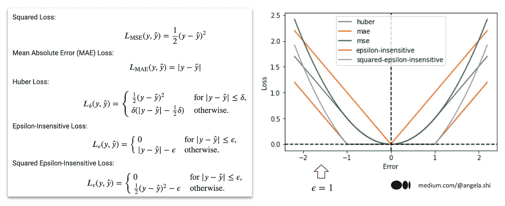
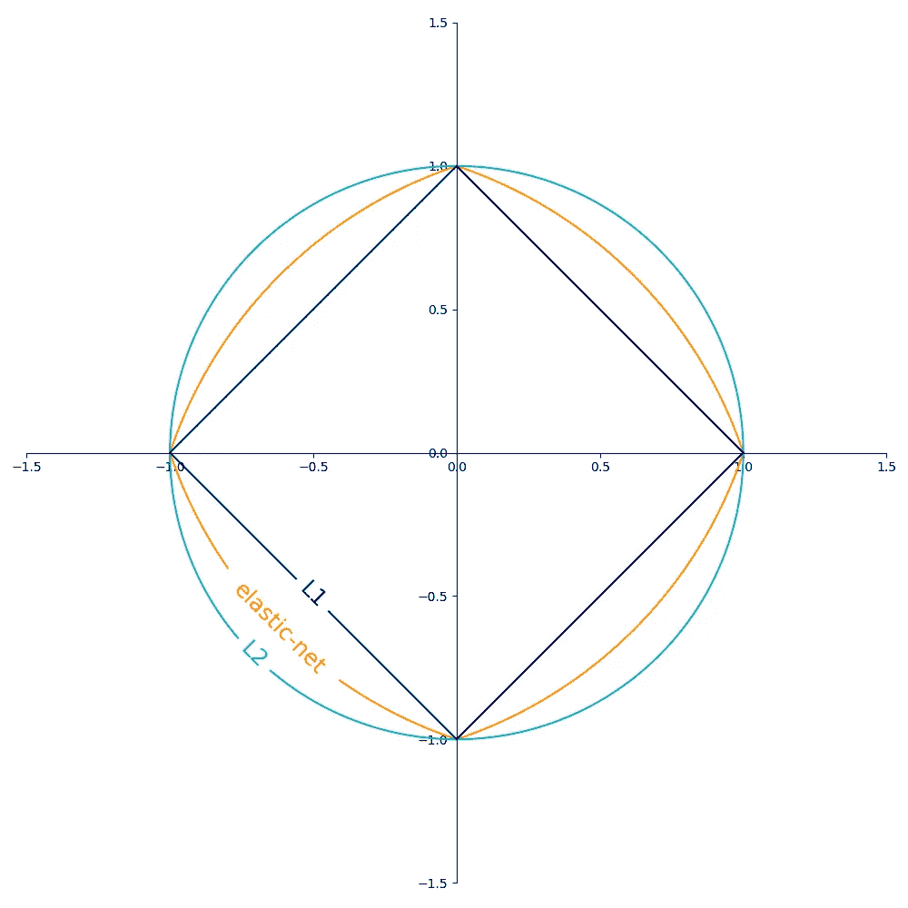
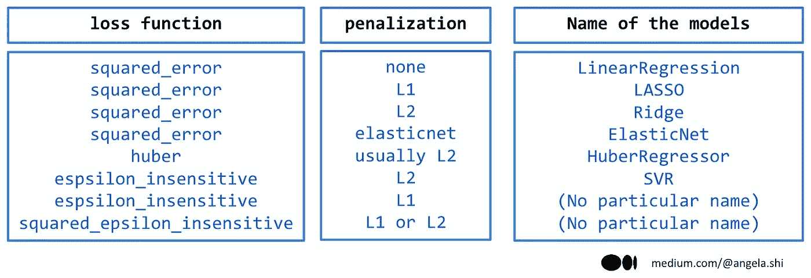
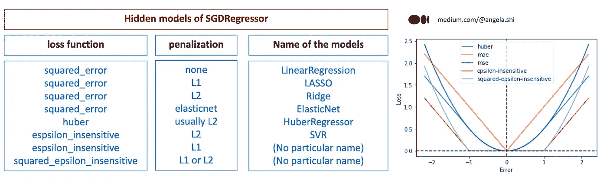

# 使用 Scikit-Learn 的 SGDRegressor：你需要知道的未授课程

> 原文：[`towardsdatascience.com/sgdregressor-with-scikit-learn-untaught-lessons-you-need-to-know-cf2430439689`](https://towardsdatascience.com/sgdregressor-with-scikit-learn-untaught-lessons-you-need-to-know-cf2430439689)

## 通过令人困惑的名称揭示隐藏的算法关系

[](https://medium.com/@angela.shi?source=post_page-----cf2430439689--------------------------------)[](https://towardsdatascience.com/?source=post_page-----cf2430439689--------------------------------) [Angela and Kezhan Shi](https://medium.com/@angela.shi?source=post_page-----cf2430439689--------------------------------)

·发表于 [Towards Data Science](https://towardsdatascience.com/?source=post_page-----cf2430439689--------------------------------) ·阅读时间 13 分钟·2023 年 3 月 8 日

--

在机器学习领域，线性模型是一种基本技术，广泛用于根据输入数据预测数值。Scikit-learn 中的 SGDRegressor 估算器是一个强大的工具，可以让机器学习从业者快速高效地进行线性回归。

然而，SGDRegressor 的名称对于初学者来说可能有些混淆。本文将解释它的工作原理，并探讨为何这个名称对于刚开始学习机器学习的初学者来说可能会产生误导。

此外，我们将深入探讨 SGDRegressor 中实际上隐藏了多个模型的观点，每个模型都有其特定的参数和超参数。这将引发关于机器学习中模型定义的有趣问题。例如，岭回归或 SVR 是一个独立的模型，还是一个调优过的线性模型？

在你读完这篇文章时，你将更好地理解 SGDRegressor 的内部工作原理，并对线性模型在机器学习中的复杂性以及*其实*的简单性有新的认识。

# 1\. SGDRegressor 的通常教学内容

SGDRegressor 是 Scikit-Learn 中的一种机器学习算法，它实现了随机梯度下降（SGD）来解决回归问题。由于其处理高维数据集的能力和快速的训练时间，它是大规模回归任务的热门选择。

`SGDRegressor` 通过使用训练数据的小随机子集而不是整个数据集来迭代地更新模型权重，这使得它在处理大数据集时计算上更高效。它还包括几个可以调整的超参数，以优化性能，包括学习率、惩罚或正则化项和迭代次数。

## 1.1 线性回归

`SGDRegressor` 是一个线性模型，使用线性函数来预测目标变量。线性函数的形式为：

y = w[0] + w[1] * x[1] + … + w[p] * x[p]

其中 x[1] 到 x[p] 是输入特征，w[1] 到 w[p] 是线性模型的系数，w[0] 或 b 是截距项。`SGDRegressor` 算法的目标是找到 w 和 b 的值，使得在预测值和目标变量的实际值之间定义的损失函数最小化。

## 1.2 随机梯度下降 vs. 梯度下降

`SGDRegressor` 算法使用随机梯度下降进行优化。随机梯度下降是一种迭代优化算法，它在小批量数据中更新模型参数。该算法使用相对于参数的代价函数的梯度来更新参数。

虽然 SGD 和 GD 都是机器学习中广泛使用的优化算法，但它们的效果取决于具体的问题。SGD 通常对大数据集和非凸问题更快且效果更好，而 GD 对小数据集和凸问题更可靠。

## 1.3 在 scikit-learn 中使用 `SGDRegressor`

使用 `SGDRegressor` 在 scikit-learn 中非常简单。首先，我们需要从 scikit-learn 的 `linear_model` 模块中导入 `SGDRegressor` 类。然后，我们可以创建一个 `SGDRegressor` 类的实例，并将模型拟合到我们的训练数据上。

以下是如何在 scikit-learn 中使用 `SGDRegressor` 的示例：

```py
from sklearn.linear_model import SGDRegressor
from sklearn.datasets import load_boston
from sklearn.model_selection import train_test_split
from sklearn.metrics import mean_squared_error

# Load the Boston housing dataset
X, y = load_boston(return_X_y=True)
# Split the dataset into training and test sets
X_train, X_test, y_train, y_test = train_test_split(X, y, test_size=0.2, random_state=42)
# Create an instance of SGDRegressor
sgd_reg = SGDRegressor(max_iter=1000, tol=1e-3, penalty=None, eta0=0.1)
# Fit the model to the training data
sgd_reg.fit(X_train, y_train)
# Make predictions on the test data
y_pred = sgd_reg.predict(X_test)
# Calculate the mean squared error of the predictions
mse = mean_squared_error(y_test, y_pred)
print("Mean squared error:", mse)
```

在这个示例中，我们加载了波士顿房价数据集，并使用 `train_test_split` 函数将其拆分为训练集和测试集。然后，我们创建了一个 `SGDRegressor` 实例，并使用 `fit` 方法将模型拟合到训练数据上。最后，我们使用 `predict` 方法对测试数据进行预测，并使用 `mean_squared_error` 函数计算预测的均方误差。

# 2\. 解开 SGDRegressor 对初学者的困惑名字

在本节中，我们将讨论为什么 `SGDRegressor` 这个名字对机器学习初学者来说可能会令人困惑。尽管领域内的专家可能熟悉这个名字及其相关算法，但对于新手来说，可能无法立即理解它的功能或工作原理。

然而，我们还将解释，对于专家来说，这个名字不一定是困惑的来源。这是因为他们已经熟悉了该算法及其目的，并且能够很容易地将其与其他类似的算法区分开来。

## 2.1 为什么它会令人困惑

在我的文章《三步学会机器学习：如何高效学习》中，我解释了如何通过将学习过程分解为三个不同的步骤：模型算法、拟合算法和调优算法，来提高你对机器学习算法的学习。尽管这种方法简单，但在实践中可能难以应用。SGDRegressor 算法就是一个典型的例子。

我认为，选择一个准确反映机器学习算法特征的合适名称对于理解和有效使用该算法至关重要。然而，这并不总是如此，例如混淆的“SGDRegressor”算法。

在 scikit-learn 中，根据机器学习模型是用于回归还是分类任务，有一个惯例是将“regressor”或“classifier”添加到模型名称中。这一惯例在许多示例中都很明显，例如 DecisionTreeClassifier 与 DecisionTreeRegressor，KNeighborsClassifier 与 KNeighborsRegressor 等。

然而，“SGDRegressor”这个名称的问题在于，如果我们将这一命名惯例应用于它，它会暗示“SGD”是一个机器学习模型，而实际上它是一个拟合算法。这对于可能对机器学习算法的不同组件没有清晰理解的初学者来说尤其困惑。

## 2.2 如何解释这一命名

对于专家来说，“SGDRegressor”的命名惯例可能看起来可以接受。使用“SGD”暗示该模型基于数学函数或参数模型，而非距离或树状模型。因此，“SGD”暗示了尽管 SGD 本身是一个拟合算法，但所使用的隐藏模型。

虽然理论上 SGD 可以用于线性和非线性模型，例如神经网络，但实际上，这个估计器仅实现了线性模型。因此，你会说这个估计器的一个更精确和简洁的名称可能是“**LinearSGDRegressor**”！是的，没错！但你是否也注意到“SGDRegressor”位于“linear_model”模块中，该模块定义上只实现了线性模型？！

最终，虽然 SGD 指的是具体的拟合算法，但由于此算法仅用于基于数学函数的模型，因此 SGDRegressor 这个名称似乎是合适的。此外，鉴于 SGDRegressor 位于“linear_model”模块中，这表明所使用的模型是线性模型。

# 3\. SGDRegressor 中的隐藏模型

SGDRegressor 中可用的参数让我们能够选择不同的损失函数（squared_error、huber、epsilon_insensitive 或 squared_epsilon_insensitive）和惩罚函数（l1、l2、elasticnet 或 none）的组合。这些组合中的一些对应于传统的统计模型。

有趣的是，历史上，统计学家根据不同的假设和目标开发和构建了不同的模型。相比之下，机器学习提供了一个更统一的框架，其中线性模型保持不变，但损失函数和惩罚可以更改，以实现不同的目标。

## 3.1 损失函数

损失函数 squared_error、huber、epsilon_insensitive 和 squared_epsilon_insensitive 在对模型及其性能的影响上有所不同。

+   squared_error 损失函数，也称为均方误差（MSE），对较大的错误的惩罚程度比对较小的错误更重，使其对异常值敏感。这个损失函数在线性回归中常用。

+   huber 损失函数比 squared_error 损失函数对异常值的敏感性更低，因为它在较大的残差下从二次误差过渡到线性误差。这使得它在处理有些异常值的数据集时是一个不错的选择。

+   epsilon_insensitive 损失函数用于目标值预计在一定范围内的回归问题。它忽略小于某一阈值（称为 epsilon）的错误，并对较大的错误进行线性惩罚。这个损失函数在支持向量回归中常用。

+   squared_epsilon_insensitive 损失函数类似于 epsilon_insensitive 损失函数，但它通过对较大的错误进行平方惩罚来加重对较大错误的惩罚。当较大的错误需要比线性更多地惩罚时，这个损失函数可以很有用，但较小的错误可以被忽略。

总的来说，损失函数的选择会影响模型处理异常值的能力以及对错误的敏感性。为确保最佳性能，选择适合特定问题的损失函数是非常重要的。

这里是一张总结所有损失函数及其数学表达式的图片。也提供了 Python 实现，允许我们可视化和比较它们的行为。如果你想访问 Python 代码，你可以通过以下链接在 Ko-fi 上支持我：[`ko-fi.com/s/4cc6555852`](https://ko-fi.com/s/4cc6555852)。



SGDRegressor 中的损失函数 — 图片由作者提供

需要注意的是，尽管 SGDRegressor 并未明确提供 MAE 损失，但可以通过将 epsilon 不敏感损失函数的超参数 epsilon 设置为零来实现 MAE 损失。这是因为，当 epsilon 为零时，epsilon 不敏感损失的数学表达式等同于 MAE 损失。

最终，尽管损失函数的种类繁多，我们可以观察到它们的构造基于两个基本概念：基本损失是二次的或绝对的，以及引入 epsilon-tube 概念，它创建了两个不同的区域——中央区域和边缘区域——具有不同类型的损失函数。

通过采用这种方法，您可以潜在地创建自己定制的损失函数！

## 3.2 惩罚项

使用 SGDRegressor 时，我们还可以指定除了所选择的损失函数外还使用的惩罚项。可用的惩罚项包括 L1、L2、Elastic Net 和 None。

L1 惩罚将系数的绝对值添加到损失函数中，从而导致一些系数被设置为零的稀疏模型。该惩罚对特征选择和减少过拟合是有用的。

L2 惩罚将系数的平方添加到损失函数中，从而导致较小但非零的系数。该惩罚还可以帮助减少过拟合并提高模型的泛化能力。

Elastic Net 惩罚结合了 L1 和 L2 惩罚，允许既有稀疏性又有非零系数。它有两个超参数：alpha 控制 L1 和 L2 惩罚之间的权重，l1_ratio 控制 L1 和 L2 惩罚之间的平衡。

最后，None 意味着不使用惩罚，模型仅用所选择的损失函数进行拟合。

选择合适的惩罚项取决于具体问题和数据的性质。一般来说，L1 和 Elastic Net 惩罚有助于特征选择和稀疏模型，而 L2 惩罚有助于泛化和避免过拟合。

这里是来自[scikit learn 文档](https://scikit-learn.org/stable/auto_examples/linear_model/plot_sgd_penalties.html)的有趣可视化



来自 [scikit learn](https://scikit-learn.org/stable/auto_examples/linear_model/plot_sgd_penalties.html) 的惩罚项

## 3.3 隐藏模型的展示

SGDRegressor 提供了在指定不同组合的损失和惩罚参数方面的灵活性。在 SGDRegressor 中，某些损失和惩罚参数的组合对应于具有特定名称的知名模型。以下图像提供了这些选项的概述，包括相应的模型名称，我们将详细探讨其中的一些。



SGDRegressor 中的损失函数和惩罚项及其对应模型名称 — 图像由作者提供

**平方误差**

在 SGDRegressor 中，最简单的组合是 squared_error 无惩罚，这对应于 Scikit-learn 的 LinearRegression 估计器中的经典线性回归模型。然而，这种命名方式可能会产生误导。虽然所有这些模型都是回归模型且为线性模型，但将它们称为“线性回归”可能会造成混淆。为了避免这种情况，最好使用“线性模型”一词，而将“线性回归”一词专门保留用于 OLS 回归。

Lasso 是一种具有 L1 正则化的线性 (OLS) 回归模型，鼓励系数估计的稀疏性。

另一方面，岭回归在线性 (OLS) 回归模型中添加了 L2 惩罚，以帮助减轻多重共线性的影响。

ElasticNet 结合了 L1 和 L2 正则化的惩罚，以在 Lasso 的稀疏性和 Ridge 的稳定性之间取得平衡。

使用平方误差时，我们可以轻松识别每个惩罚对应的具体模型名称。然而，对于其他损失函数，并不总是有特定的名称与每个惩罚关联。在我看来，研究人员历史上专注于寻找正则化或线性回归系数的惩罚效果，导致每种惩罚类型都有特定名称。对于其他损失函数，添加惩罚项似乎不再新颖。

**Huber 损失**

Huber 损失函数是一种对离群值不那么敏感的替代损失函数，适用于具有显著离群值的数据集。Huber 损失函数是平方损失函数和绝对损失函数的组合。对于小误差，它的行为像平方损失函数，而对于大误差，它的行为像绝对损失函数。这使得它比平方损失函数对离群值更具鲁棒性，同时对小误差仍提供良好的性能。

**Epsilon 不敏感损失**

Epsilon-不敏感损失是另一种常用于线性模型的损失函数。epsilon 参数用于定义在此范围内的误差被视为零。此损失函数对具有噪声输出变量的数据集非常有用，因为它可以帮助减少输出变量中小波动的影响。

实际上，Epsilon 不敏感损失和 L2 正则化的组合也被称为 SVR（支持向量回归）。使用 epsilon 不敏感管道概念使得添加惩罚成为强制性，因为没有它可能会有无限多的解决方案。术语“支持向量”之所以被使用，是因为正如 L1 正则化项对系数会导致某些系数变为零一样，应用于数据集的 L1 损失（绝对损失）将导致某些数据点不用于计算系数，只留下其余的数据点，这些数据点被称为支持向量。

值得注意的是，Huber 回归通常被描绘为不那么敏感，但它与 SVR 共享这一特性，因为两者都对较大的值使用绝对值。虽然“epsilon 不敏感”一词强调误差为零的中心区域，但较大值的绝对误差对最终模型也可以有显著影响。

要了解有关 SVR 和 Epsilon 不敏感损失及其在 Scikit-learn 中的应用，可以阅读这篇文章：[使用 Scikit-learn 理解 SVR 和 Epsilon 不敏感损失](https://medium.com/towards-data-science/understanding-svr-and-epsilon-insensitive-loss-with-scikit-learn-28ec03a3d0d9)

**平方 epsilon 不敏感损失**

我们可能以前从未听说过这个：**平方 epsilon 不敏感损失！** 正如其名，它基于**epsilon 不敏感损失**，但使用的是平方误差而非绝对误差。问题是，为什么使用这个特定的损失函数？嗯，为什么不呢。

答案是，在机器学习中，“没有免费的午餐”理论表明，一个模型不能在所有数据集上表现良好，因此需要测试不同的损失函数。在某些情况下，平方 epsilon 不敏感损失可能是最佳选择。

## 3.4 一个可调模型还是不同模型？

为了理解这些模型的不同名称，我们可以从两个不同的角度来分析：统计学角度和机器学习角度。

在统计学领域，多年来已经开发出各种模型来解决不同类型的问题。因此，存在许多具有不同假设、约束和特性的模型。另一方面，机器学习框架相对简单，因为它围绕线性模型展开，可以通过更改损失函数和应用惩罚来避免过拟合，从而轻松修改。

这种简单性和灵活性使得机器学习从业者更容易进行实验并适应不同的问题设置，从而开发出适用于各种应用的新型有效模型。

在我之前的文章“三步学习机器学习：如何高效学习它”中，我强调了区分算法的三个部分——模型算法、模型拟合算法和模型调优算法的重要性。这种方法有助于简化对机器学习算法的理解。

至于 SGDRegressor，以下是三个步骤：

+   模型：我们可以将 LASSO、Ridge、弹性网、SVM 和 Huber 回归视为一个整体模型，即线性模型表示为 y = wX + b。

+   拟合：使用的拟合算法是随机梯度下降（SGD）。

+   调优：可以调节的超参数包括损失和惩罚等。

尽管 sci-kit learn 在同一个 linear_model 模块中有多个独立的模型如 LinearRegression、LASSO 和 Ridge，但是否这些模型实际上是同一个模型并不重要。重点应放在理解它们的内部功能上，因为名字可能会产生误导。

在总结本节之前，我想到一个问题：估计器 LinearRegression 是否真的属于机器学习模型，因为它不可调且没有任何需要调整的超参数？



# 结论和主要要点

总之，scikit-learn 中的 SGDRegressor 提供了一个灵活且强大的线性回归工具。它的多种损失函数和惩罚选项为用户提供了许多自定义模型以满足特定需求的选择。此外，使用 SGD 拟合非凸函数的能力相较于标准梯度下降是一个显著的优势。需要注意的是，损失和惩罚参数应被视为需要调整的超参数。通过应用模型、拟合和调整的学习框架，数据科学家可以利用 SGDRegressor 在他们的线性回归任务中实现最佳结果。
