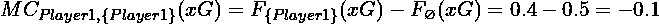
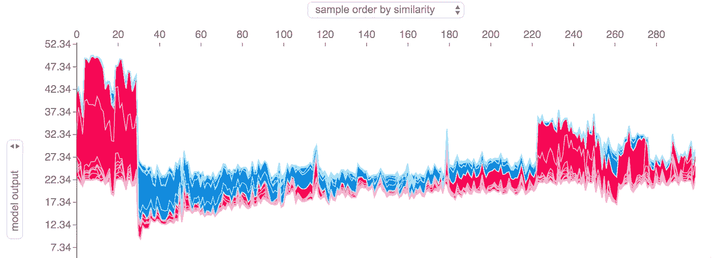

# SHAP：在 Python 中解释任何机器学习模型

> 原文：[`towardsdatascience.com/shap-explain-any-machine-learning-model-in-python-72f0bea35f7c`](https://towardsdatascience.com/shap-explain-any-machine-learning-model-in-python-72f0bea35f7c)


照片由 [Priscilla Du Preez](https://unsplash.com/@priscilladupreez?utm_source=medium&utm_medium=referral) 提供，来源于 [Unsplash](https://unsplash.com/?utm_source=medium&utm_medium=referral)

## 您的 SHAP、TreeSHAP 和 DeepSHAP 综合指南

[](https://louis-chan.medium.com/?source=post_page-----72f0bea35f7c--------------------------------)[](https://towardsdatascience.com/?source=post_page-----72f0bea35f7c--------------------------------) [Louis Chan](https://louis-chan.medium.com/?source=post_page-----72f0bea35f7c--------------------------------)

·发表于 [Towards Data Science](https://towardsdatascience.com/?source=post_page-----72f0bea35f7c--------------------------------) ·阅读时间 13 分钟·2023 年 1 月 11 日

--

## 动机

故事时间！

想象一下你训练了一个机器学习模型来预测抵押贷款申请者的违约风险。一切都很好，性能也很出色。但模型是如何工作的？模型是如何得出预测值的？

我们站在那里说模型考虑了几个变量，而这些多维关系和模式复杂到用简单的语言无法解释。

这就是模型可解释性可以拯救局面的地方。在可以剖析机器学习模型的算法中，SHAP 是该领域中较为中立的算法之一。在这篇博客中，我们将深入探讨以下内容：

+   什么是 Shapley 值？

+   如何计算 Shapley 值？

+   如何在 Python 中使用它？

+   SHAP 如何支持局部和全局可解释性？

+   SHAP 库中有哪些可用的可视化？

+   SHAP 的常见变体如何工作？— TreeSHAP 和 DeepSHAP

+   LIME 与 SHAP 相比如何？

# Shapley 值

## **让我们玩个游戏**

当一支由十一名球员组成的球队赢得世界杯时，谁是最有价值的球员？Shapley 值是一种分解算法，客观地将最终结果分配给一组因素。在解释机器学习模型时，Shapley 值可以理解为单个输入特征对模型预测值的贡献程度。

## 快速示例 — Shapley 值是如何工作的？

为了简单起见，假设我们有三名进攻球员，每名球员有不同的预期进球数。我们还知道这三名球员并不总是相互配合良好，这意味着根据这三名球员的组合，预期进球数可能会有所不同：


作者提供的图片

作为基准，我们不使用这三名球员，即特征数 **f** = 0，团队的预期进球数将是 0.5。每一个箭头向下的矩阵表示包含一个新特征（或在我们情况下是一个新球员）时可能的逐步增量。

遵循逐步扩展玩家集的思路，这意味着我们可以计算每一个箭头的边际变化。例如，当我们从不使用任何玩家（用空集符号 ∅ 表示）移动到仅使用玩家 1 时，边际变化是：



作者提供的图片

要获得玩家 1 在所有三名玩家中的总体贡献，我们需要对每一个可能出现玩家 1 边际贡献的情景重复相同的计算：


作者提供的图片

通过所有边际变化，我们可以使用以下公式计算它们的权重：


作者提供的图片

或者，简单来说：这只是指向同一行的所有边的数量的倒数。这意味着：


作者提供的图片

有了这些，我们现在可以计算玩家 1 的 SHAP 值，以获得预期进球数：


作者提供的图片

对另外两名玩家进行相同的操作，我们将得到：

+   玩家 1 的 SHAP = -0.1133

+   玩家 2 的 SHAP = -0.0233

+   玩家 3 的 SHAP = +0.4666

如果我是主教练，我在这种情况下只会使用玩家 3。

> 这与另一种操作符 Choquet Integral 非常相似，对于那些数学更精通的朋友。

## 计算复杂度

以上述仅有 3 个特征的例子为例，我们需要考虑 8 个不同的模型，每个模型有不同的输入特征集，以全面解释所有特征。事实上，对于一个完整的***N***特征集，总子集的数量将是***2^N***。因此，在使用 SHAP 解释训练有大量且更重要的是宽数据集的机器学习模型时，我们需要注意预期的运行时间。

在接下来的章节中，我们将首先深入探讨如何在 Python 中使用 SHAP，然后将大部分注意力转向 SHAP 的不同变体，这些变体旨在通过近似技术或针对模型拓扑特定的技术来应对 SHAP 的复杂性。


Pascal 三角形 — 图片来源于 [维基百科](https://commons.wikimedia.org/wiki/File:Pascal_triangle.svg)

# Python 中的 SHAP

接下来，让我们探讨如何在 Python 中使用 SHAP。

SHAP (**SH**apley **A**dditive ex**P**lanations) 是一个兼容大多数机器学习模型拓扑的 Python 库。安装非常简单，只需 `pip install shap`。

SHAP 提供了两种解释机器学习模型的方法——全局解释和本地解释。

## **使用 SHAP 进行本地可解释性**

本地可解释性试图解释特定预测背后的驱动因素。在 SHAP 中，个体 Shapley 值就是用来做这个的，如早期部分的快速示例所示。

在 SHAP 的工具集中，有两种可视化方法用于解释个体预测：瀑布图和力图。瀑布图让你更好地理解逐步推导预测结果的过程，而力图旨在提供特征对预测结果偏差的相对贡献强度。

> **注意：** 两种可视化都包括了一个整体期望预测值（或基准值）。这可以理解为训练集上模型输出的平均值。

**瀑布图**

```py
# Code snippet from SHAP github page
import xgboost
import shap

# train an XGBoost model
X, y = shap.datasets.boston()
model = xgboost.XGBRegressor().fit(X, y)

# explain the model's predictions using SHAP
# (same syntax works for LightGBM, CatBoost, scikit-learn, transformers, Spark, etc.)
explainer = shap.Explainer(model)
shap_values = explainer(X)

# visualize the first prediction's explanation
shap.plots.waterfall(shap_values[0])
```


图片来自 [SHAP GitHub 页面](https://github.com/slundberg/shap)（MIT 许可证）

+   在 y 轴上，你可以找到特征的名称和值。

+   在 x 轴上，你可以找到基准值 `E[f(X)] = 22.533`，这表示训练集上的平均预测值。

+   图中红色条形表示特征对预测值的正贡献。

+   图中蓝色条形表示特征对预测值的负贡献。

+   条形上的标签表示归因于参数的模型基准预测值的偏差。例如，AGE = 65.2 对预测值的偏差从基准值 22.533 上贡献了 +0.19。

+   条形按其对预测值的绝对重要性降序排列。

**力图**

```py
# Code snippet from SHAP github page
# visualize the first prediction's explanation with a force plot
shap.plots.force(shap_values[0])
```


图片来自 [SHAP GitHub 页面](https://github.com/slundberg/shap)（MIT 许可证）

+   在 x 轴上，你可以找到基准值。这表示训练集上平均预测值的大致位置。

+   在 x 轴上，你还可以找到用粗体数字标记的模型输出。这表示该记录的预测值。

+   在图表底部，你可以找到特征的名称和值，标记为红色或蓝色。

+   所有在模型输出左侧的红色条形是对预测偏离基准值有正面贡献的特征。特征的名称在条形的底部。条形的长度表示特征的贡献。

+   模型输出右侧的所有蓝色条形图表示对预测偏离基准值产生负面贡献的特征。特征的名称位于条形图底部。条形图的长度表示特征的贡献。

## **SHAP 的全球可解释性**

全球可解释性可以理解为在整个数据集中理解每个特征的整体重要性，并提供对数据和潜在模式的一般了解。由于分解个体预测贡献和在数据中聚合的模糊性，尝试全球可解释性的方法不止一种。示例包括信息增益、汇总权重、基于置换的特征重要性和 Shapley 值。SHAP 当然专注于最后一个。

SHAP 提供了一种可视化方法，我们可以查看特征在数据集中的平均 Shapley 值。与其他使用统计上更复杂解释来提供重要性度量的机制不同，SHAP 的全球可解释性通过让你能够说，平均而言，特征关系使得“Class 1”数据记录的预测值比“Class 0”数据记录高约 1.0，从而提供了一个立即可理解的影响。


图像来自[SHAP GitHub 页面](https://github.com/slundberg/shap)（MIT 许可证）

SHAP 的全球可解释性功能允许我们排查或调查模型偏差。以上面的图像为例，年龄通常是一个非常重要的特征。这是否可能表明模型对特定年龄组存在不必要的偏见？此外，一个非常重要的特征是否可能是潜在的数据泄露？所有这些问题都使我们在部署更负责任且强健的机器学习模型之前，能够改进模型。

> **注意：** 如果你有兴趣了解更多关于负责任的人工智能，我还写了一篇关于如何通过 5 个简单步骤来实现这一目标的文章。

[## 解锁负责任的人工智能：确保伦理系统的 5 个步骤](https://pub.towardsai.net/unlock-the-power-of-responsible-ai-5-steps-to-ensure-ethical-systems-a5aeeb5ff65c?source=post_page-----72f0bea35f7c--------------------------------)

### 负责任的人工智能系统的 5 个步骤

[pub.towardsai.net](https://pub.towardsai.net/unlock-the-power-of-responsible-ai-5-steps-to-ensure-ethical-systems-a5aeeb5ff65c?source=post_page-----72f0bea35f7c--------------------------------)

SHAP 支持的另一种可视化是局部可解释性部分的力图堆叠版本。通过堆叠力图，我们可以可视化模型与不同输入值的特征之间的交互。这为我们提供了基于 Shapley 值的聚类视图，并提供了模型如何看待数据的视角。这对修正和验证假设以及基础业务逻辑非常有用。在分析所有 Shapley 值后，你可能还会发现数据分割的新方法！

```py
# Code snippet from SHAP github page
# visualize all the training set predictions
shap.plots.force(shap_values)
```



图片来源于[SHAP GitHub 页面](https://github.com/slundberg/shap)（MIT 许可证）

# SHAP 的变体

## **TreeSHAP**

+   **优点：** 高效且准确的算法，用于计算基于树模型的 Shapley 值。

+   **缺点：** 仅适用于基于树的模型。

与原始 SHAP 不同，TreeSHAP 是特定于基于树的机器学习模型的。这意味着 TreeSHAP 仅适用于决策树、随机森林、梯度提升机等模型。

TreeSHAP 特定于树模型，因为它利用树结构来更高效地计算准确的 Shapley 值。由于这些结构在其他模型拓扑中不存在，因此 TreeSHAP 仅限于基于树的模型。

TreeSHAP 可以通过干预和树路径依赖的方法计算 Shapley 值。这可以在`feature_perturbation`参数中指定。树路径依赖方法递归地计算条件期望的变化。我们以一个接受 2 个特征**(x, y)**的简单决策树为例：


示例决策树 — 作者提供的图片

在上面的示例中，我们有一个包含 7 个节点的决策树，接受两个特征**(x, y)**来预测**z**，并且已经用**8**个训练样本进行了训练。为了计算在联盟**(x=10, y=5)**中**y**对**z**预测的**局部**贡献，我们需要考虑以下因素：

1.  对于**(x=10, y=5)**，模型将从节点 1 移动到节点 3 并到达节点 6。由于节点 6 是叶节点，模型确定预测为**z=4**。

1.  对于**(x=10)**，模型将从节点 1 移动到节点 3。然而，由于节点 3 不是叶节点，预测值可以推断为节点 3 所有叶节点的加权和。在通过节点 3 的 5 个训练样本中，有两个预测为**z=4**，而其他的预测为**z=24**。加权和为**4*(2/5) + 24*(3/5)=1.6 + 14.4 = 16**。

1.  在联盟**(x=10, y=5)**中，**y**对**z**预测的边际贡献可以计算为**Prediction(x=10, y=5) — Prediction(x=10) = 4–16= -12**。

> **注意：** 这里的负贡献并不意味着特征**y**不重要，而是特征**y**将预测值推高了**-12**。

通过对所有特征继续这一过程，TreeSHAP 将获得所有 Shapley 值，并提供局部可解释性（使用上述方法）和全局可解释性（对训练集中的所有局部可解释性结果进行平均）

顾名思义，干预方法通过人为调整感兴趣特征的值来计算 Shapley 值。在我们上述的例子中，这可能是将**y**从 5 改为 4。为了估计敏感性，TreeSHAP 需要反复使用背景集/训练集作为参考点（当我们在最后一节讨论 LIME 时会再次提到），其线性运行时间复杂度。因此，在使用干预方法时，我们应更加关注 TreeSHAP 的可扩展性。

```py
import shap

# Load the data
X_train, y_train, X_test, y_test = load_data()

# Train the model
model = MyModel.train(X_train, y_train)

# Explain the model's predictions using the tree path dependent approach
explainer = shap.TreeExplainer(
    model,
    X_train,
    feature_perturbation='tree_path_dependent')
shap_values_path = explainer.shap_values(X_test)

# Display the explanations
shap.summary_plot(shap_values_path, X_test)

# Explain the model's predictions using the interventional approach
explainer = shap.TreeExplainer(
    model,
    X_train,
    feature_perturbation='interventional')
shap_values_interv = explainer.shap_values(X_test)

# Display the explanations
shap.summary_plot(shap_values_interv, X_test)
```

## **DeepSHAP**

+   **优点：** 高效的算法，用于近似深度学习或基于神经网络的模型的 Shapley 值。兼容 Tensorflow 和 PyTorch

+   **缺点：** 仅适用于深度学习或基于神经网络的模型。由于算法的近似特性，比 SHAP 的准确性低。

讨论可解释性时，我们不能忽视神经网络。DeepSHAP 是 SHAP 和 DeepLIFT 的结合，旨在揭示深度学习模型背后的哲学。它专为深度学习模型设计，这使得 DeepSHAP 仅适用于基于神经网络的模型。

DeepSHAP 试图近似 Shapley 值。解释 DeepSHAP 的一种相对原始的方法是，它试图通过使用梯度或偏导数来分配特征**x**的局部边际贡献，前提是使用一个有意义的背景/参考点（例如，图像识别模型的全黑背景，预测暴富机会的 0%）。

> 注意：有进一步研究发布了 DeepSHAP 的通用版本——G-DeepSHAP。你可以在[arxiv](https://arxiv.org/pdf/2105.00108.pdf)阅读。

```py
import shap

# Load the data
X_train, y_train, X_test, y_test = load_data()

# Train the model
model = MyModel.train(X_train, y_train)

# Explain the model's predictions using TreeSHAP
explainer = shap.DeepExplainer(model, X_train)
shap_values = explainer.shap_values(X_test)

# Display the explanations
shap.summary_plot(shap_values, X_test)
```

## LIME — SHAP 的替代方法

LIME（局部可解释模型无关解释）是解释预测的 SHAP 的替代方法。它是一种模型无关的方法，默认假设内核大小（解释个体预测时考虑的局部邻域的大小）来近似特征对局部实例的贡献。一般来说，选择较小的内核大小时，LIME 提供的结果将更倾向于局部解释特征值对预测的贡献。（即，较大的内核大小往往提供更全局的视角）

然而，内核大小的选择应根据数据和模式仔细决定。因此，在使用 LIME 时，我们应考虑相应地调整内核大小，以获得对机器学习模型的合理解释。

要尝试一下，我们可以安装并使用该软件包：

```py
pip install lime
```

```py
import lime
import lime.lime_tabular

# Load the data
X_train, y_train, X_test, y_test = load_data()
feature_names = X_train.columns

# Train the model
model = MyModel.train(X_train, y_train)

# Explain the model's predictions using LIME
explainer = lime.lime_tabular.LimeTabularExplainer(
    X_train, feature_names=feature_names)

# Choose a kernel size for the local neighborhood
kernel_size = 10

# Explain the model's prediction for a single instance
instance = X_test[0]
exp = explainer.explain_instance(
    instance,
    model.predict,
    num_features=10,
    kernel_size=kernel_size)

# Display the explanations
exp.show_in_notebook(show_all=False)
```

## 结论

最后总结一下，这里是对本文讨论内容的简要总结：

+   SHAP 是一种基于博弈论的方法，用于解释机器学习模型。

+   SHAP 考虑所有可能的特征组合以评估每个特征的影响。

+   特征 **f** 对于本地预测实例的 SHAP 值是由于特征的引入在包含 **f** 的所有可能特征组合中的边际变化的加权总和。

+   边际变化的权重根据 ***f* × *C(F, f)*** 的倒数进行，其中 ***F*** 是实际模型考虑的特征数量，而 ***f*** 是计算边际变化时考虑的特征数量。

+   由于 SHAP 考虑了所有可能的特征组合，因此算法不会线性扩展，会受到维度灾难的影响。

+   为了应对 SHAP 的计算复杂性，已经常用几种 SHAP 的变体：


图片来源于作者

+   我们应该考虑对基于树的模型使用 TreeSHAP，对基于深度学习的模型使用 DeepSHAP。

+   LIME 是一种替代 SHAP 的模型无关方法，用于近似特征的贡献。

+   LIME 的解释可以根据内核大小的选择显著不同。

关于 SHAP 的这次全面介绍就是这些了。我希望你发现这些内容对提升你的写作水平或开始写作有所帮助。如果你喜欢这篇文章，你也可以通过下面的我的附属链接订阅 Medium 来支持我。这是一个我发现了很多有趣读物的平台。即使你完全不打算订阅，你也可以通过点“赞”来支持我和我的创作。

[](https://louis-chan.medium.com/membership?source=post_page-----72f0bea35f7c--------------------------------) [## 通过我的推荐链接加入 Medium — Louis Chan

### 阅读 Louis Chan 的每一个故事（以及 Medium 上成千上万的其他作家的故事）。你的会员费直接支持…

louis-chan.medium.com](https://louis-chan.medium.com/membership?source=post_page-----72f0bea35f7c--------------------------------)

最后但绝对不是最不重要的，如果我遗漏或误解了任何关键内容，请随时在评论中指出或通过 LinkedIn 给我发消息。让我们一起保持知识的流动，共同在这个领域中进步！

[](https://www.linkedin.com/in/louis-chan-b55b9287?source=post_page-----72f0bea35f7c--------------------------------) [## Louis Chan — 主任级 GCP 数据与 ML 工程师 — 副总监 — KPMG 英国 | LinkedIn

### 有抱负、好奇且富有创意的个人，坚信知识领域之间的相互联系。

www.linkedin.com](https://www.linkedin.com/in/louis-chan-b55b9287?source=post_page-----72f0bea35f7c--------------------------------)

## 参考文献

1.  Lundberg, Scott M., 和 Su-In Lee. “统一的模型预测解释方法。” 神经信息处理系统进展，2017。

1.  Lundberg, Scott, 和 Su-In Lee. “一致的个性化特征归因用于树集成。” arXiv 预印本 arXiv:1802.03888, 2018.

1.  Ribeiro, Marco Tulio, Sameer Singh, 和 Carlos Guestrin. “我为什么应该相信你？解释任何分类器的预测。” 第 22 届 ACM SIGKDD 国际知识发现与数据挖掘大会论文集, 2016.

1.  Ribeiro, Marco Tulio, Sameer Singh, 和 Carlos Guestrin. “Anchors: 高精度模型无关解释。” arXiv 预印本 arXiv:1802.07814, 2018.
