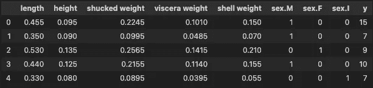
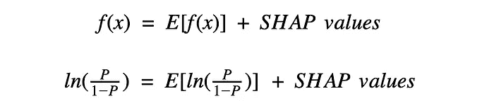
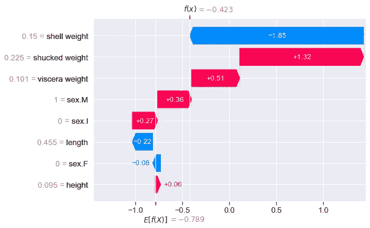
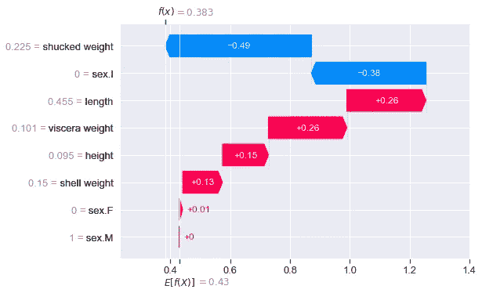
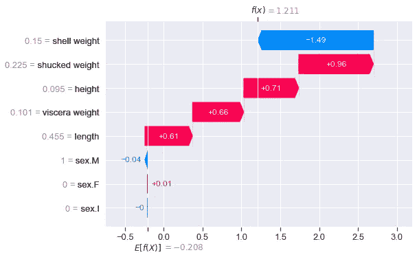
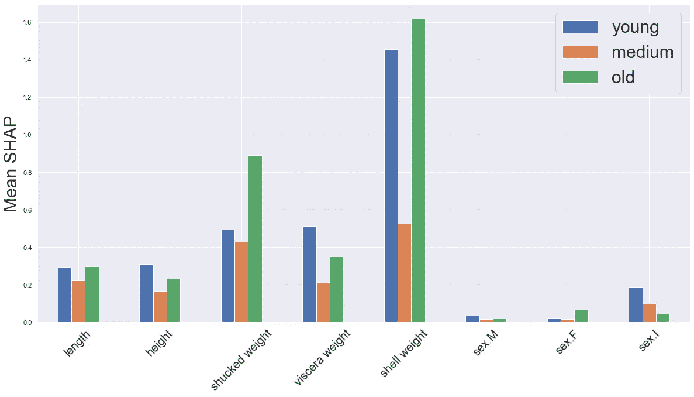
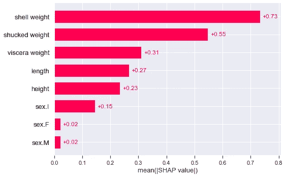
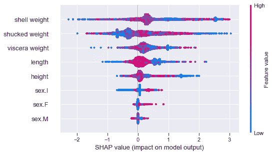

# 二元和多类目标变量的 SHAP

> 原文：[`towardsdatascience.com/shap-for-binary-and-multiclass-target-variables-ff2f43de0cf4`](https://towardsdatascience.com/shap-for-binary-and-multiclass-target-variables-ff2f43de0cf4)

## 提供一个指南，讲解当模型预测分类目标变量时如何编写代码和解读 SHAP 图

[](https://conorosullyds.medium.com/?source=post_page-----ff2f43de0cf4--------------------------------)[](https://towardsdatascience.com/?source=post_page-----ff2f43de0cf4--------------------------------) [Conor O'Sullivan](https://conorosullyds.medium.com/?source=post_page-----ff2f43de0cf4--------------------------------)

·发表于 [Towards Data Science](https://towardsdatascience.com/?source=post_page-----ff2f43de0cf4--------------------------------) ·9 分钟阅读·2023 年 9 月 4 日

--


照片由 [Nika Benedictova](https://unsplash.com/@nika_benedictova?utm_source=medium&utm_medium=referral) 提供，来源于 [Unsplash](https://unsplash.com/?utm_source=medium&utm_medium=referral)

SHAP 值展示了模型特征对预测的贡献。这在我们使用 SHAP 进行分类时也同样适用。不同的是，对于**二元目标变量**，我们用**对数几率**来解释这些值。对于**多类目标**，我们使用**softmax**。我们将：

+   更深入地讨论这些解释

+   提供用于显示分类问题的 SHAP 图的代码

+   探索聚合 SHAP 值的新方法以适应多类目标

你还可以观看关于该主题的视频：

# 之前的 SHAP 教程

我们继续之前的 SHAP 教程。它深入探讨了连续目标变量的 SHAP 图。你将发现这些图及其见解对于分类目标变量也是类似的。你还可以在 [GitHub](https://github.com/conorosully/SHAP-tutorial) 上找到完整的项目。

[](/introduction-to-shap-with-python-d27edc23c454?source=post_page-----ff2f43de0cf4--------------------------------) ## 使用 Python 进行 SHAP 介绍

### 如何创建和解读 SHAP 图：瀑布图、力图、均值 SHAP、蜜蜂散点图和依赖图

towardsdatascience.com

总结一下，我们使用 SHAP 解释了基于[海螺数据集](https://archive.ics.uci.edu/ml/datasets/abalone)构建的模型。该数据集包含**4,177**个实例，下面可以看到特征的示例。我们使用**8**个特征来预测 y——海螺壳上的**环数**。环数与海螺的年龄有关。在本教程中，我们将 y 分成不同的组，以创建二元和多类目标变量。



X 特征矩阵（来源：[UCI 机器学习库](https://archive.ics.uci.edu/ml/datasets/abalone)）（许可证：CC0：公共领域）

# 二元目标变量

对于连续目标变量，我们发现每个实例都有 8 个 SHAP 值——每个模型特征一个。如**图 1**所示，如果我们将这些值与平均预测值**E[f(x)]**相加，我们就得到了该实例的预测值**f(x)**。对于二元目标变量，我们也有相同的性质。区别在于我们将值解释为*正*预测的对数几率。



图 1：根据对数几率解释 SHAP 值（来源：作者）

为了理解这一点，让我们深入研究 SHAP 图。我们从创建一个二元目标变量（第 2 行）开始。我们基于 y 创建了两个组：

+   **1** 如果海螺的环数高于平均水平

+   **0** 否则

```py
#Binary target varibale
y_bin = [1 if y_>10 else 0 for y_ in y]
```

我们使用这个目标变量和 8 个特征来训练一个**XGBoost 分类器**（第 2-3 行）。该模型的准确率为**96.6%。**

```py
#Train model 
model_bin = xgb.XGBClassifier(objective="binary:logistic")
model_bin.fit(X, y_bin)
```

我们现在计算 SHAP 值（第 2-3 行）。我们输出这个对象的形状（第 5 行），得到**(4177, 8)**。因此，与连续目标变量一样，我们每个预测和特征都有一个 SHAP 值。稍后，我们将看到这对于多类目标变量是如何不同的。

```py
#Get shap values
explainer = shap.Explainer(model_bin)
shap_values_bin = explainer(X)

print(shap_values_bin.shape) #output: (4177, 8)
```

我们为第一个实例显示了一个瀑布图（第 6 行）。我们可以在**图 2**中看到结果。注意，代码与连续变量的代码相同。除了数字外，瀑布图也看起来类似。

```py
# waterfall plot for first instance
shap.plots.waterfall(shap_values_bin[0])
```

现在**E[f(x)] = -0.789** 给出了所有 4,177 个海螺的平均预测对数几率。这是正预测（1）的对数几率。对于这个特定的海螺，模型预测其有**0.3958**的概率具有高于平均水平的环数（即**P = 0.3958**）。这给出了预测的对数几率**f(x) = ln(0.3958/(1–0.3958)) = -0.423**。



图 2：带有二元目标变量的瀑布图（来源：作者）

因此，SHAP 值表示预测对数几率与平均预测对数几率之间的差异。正的 SHAP 值增加对数几率。例如，剥壳重量增加了**1.32**的对数几率。换句话说，这个特征增加了模型预测环数高于平均水平的概率。类似地，负值则减少对数几率。

我们也可以以之前相同的方式聚合这些值。好消息是，像蜜蜂散点图或均值 SHAP 这样的图形解释将保持不变。只需记住，我们处理的是对数赔率。现在让我们看看这种解释如何在多类别目标变量中发生变化。

# 多类别目标变量

我们通过创建一个新的目标变量 (**y_cat**) 来开始，该变量有 3 个类别——年轻（0）、中等（1）和老（2）。如前所述，我们训练了一个 XGBoost 分类器来预测这个目标变量（第 5–6 行）。

```py
#Categorical target varibale
y_cat = [2 if y_>12 else 1 if y_>8 else 0 for y_ in y]

#Train model 
model_cat = xgb.XGBClassifier(objective="binary:logistic")
model_cat.fit(X, y_cat)
```

对于这个模型，我们不能再谈论“正预测”。如果我们输出第一个实例的预测概率（第 2 行），我们可以看到这一点。这给我们 **[0.2562, 0.1571, 0.5866]**。在这种情况下，第三个概率最高，因此海洋蜗牛被预测为老（2）。这对 SHAP 意味着我们不能再只考虑正类的值。

```py
# get probability predictions
model_cat.predict_proba(X)[0]
```

当我们计算 SHAP 值时可以看到这一点（第 2–3 行）。代码与二分类模型相同。然而，当我们输出形状（第 5 行）时，我们得到 **(4177, 8, 3)**。现在我们为每个实例、特征和*类别*都有一个 SHAP 值。

```py
#Get shap values
explainer = shap.Explainer(model_cat)
shap_values_cat= explainer(X)

print(np.shape(shap_values_cat))
```

因此，我们必须在单独的瀑布图中显示每个类别的 SHAP 值。我们在下面的代码中为第一个实例执行此操作。

```py
# waterfall plot for class 0
shap.plots.waterfall(shap_values_cat[0,:,0])

# waterfall plot for class 1
shap.plots.waterfall(shap_values_cat[0,:,1])

# waterfall plot for class 2
shap.plots.waterfall(shap_values_cat[0,:,2])
```

**图 3** 给出了类别 0 的瀑布图。该图解释了每个特征如何对模型预测*为此类别*做出贡献。也就是说，与该类别的平均预测相比。我们看到该类别的概率相对较低（即 **0.2562**）。我们可以看到，去壳重量特征对这一低概率做出了最显著的贡献。



图 3：类别 0 的瀑布图（来源：作者）

**图 4** 给出了其他类别的输出。你会注意到 **f(x) = 1.211** 在类别 2 中是最大的。这是有道理的，因为我们看到这个类别的概率也是最大的（**0.5866**）。在分析该实例的 SHAP 值时，可能要重点关注这个瀑布图。这是该海洋蜗牛的类别预测。



图 4：类别 1 和 2 的瀑布图（来源：作者）

## 使用 Softmax 解释值

由于我们现在处理的是多个类别，**f(x)** 是以 softmax 形式给出的。我们可以使用下面的函数将 softmax 值转换为概率。**fx** 给出了上述瀑布图中的三个 f(x) 值。结果是 **[0.2562, 0.1571, 0.5866]**。这就是我们看到的实例 0 的预测概率！

```py
def softmax(x):
    """Compute softmax values for each sets of scores in x"""
    e_x = np.exp(x - np.max(x))
    return e_x / e_x.sum(axis=0)

# convert softmax to probability
fx = [0.383,-0.106,1.211]
softmax(fx)
```

## 聚合多类别 SHAP 值

这些 SHAP 值可以使用任何 SHAP 图进行汇总。然而，像瀑布图一样，每个类别都会有单独的图。分析这些可能会很繁琐，尤其是当目标变量中有很多类别时。因此，我们将讨论一些其他的汇总方法。

首先是平均 SHAP 图的一个版本。我们分别计算每个类别的 SHAP 值的绝对平均值（第 2–4 行）。然后我们创建一个条形图，每个类别和特征都有一个条形。

```py
# calculate mean SHAP values for each class
mean_0 = np.mean(np.abs(shap_values_cat.values[:,:,0]),axis=0)
mean_1 = np.mean(np.abs(shap_values_cat.values[:,:,1]),axis=0)
mean_2 = np.mean(np.abs(shap_values_cat.values[:,:,2]),axis=0)

df = pd.DataFrame({'small':mean_0,'medium':mean_1,'large':mean_2})

# plot mean SHAP values
fig,ax = plt.subplots(1,1,figsize=(20,10))
df.plot.bar(ax=ax)

ax.set_ylabel('Mean SHAP',size = 30)
ax.set_xticklabels(X.columns,rotation=45,size=20)
ax.legend(fontsize=30)
```

我们可以在**图 5**中看到输出。有一点需要提到的是，每个条形图显示的是所有预测的平均值。然而，实际的预测类别在每种情况下都会有所不同。因此，您可能会因为 SHAP 值不能解释预测类别而使均值产生偏差。这可能是我们看到中等类别均值较小的原因。



图 5：多分类目标变量中每个类别的平均 SHAP 值（来源：作者）

为了避免这个问题，我们可以集中在预测类别的 SHAP 值上。我们首先获取每个实例的预测类别（第 2 行）。我们创建一组新的 SHAP 值（**new_shap_values**）。这是通过遍历原始值并仅选择与该实例预测相对应的那一组值来完成的（第 5–7 行）。

```py
# get model predictions
preds = model_cat.predict(X)

new_shap_values = []
for i, pred in enumerate(preds):
    # get shap values for predicted class
    new_shap_values.append(shap_values_cat.values[i][:,pred])
```

然后我们将原始对象中的 SHAP 值替换掉（第 2 行）。现在，如果我们输出形状，得到的是(4177, 8)。换句话说，我们回到了每个实例一组 SHAP 值的情况。

```py
# replace shap values
shap_values_cat.values = np.array(new_shap_values)
print(shap_values_cat.shape)
```

这种方法的一个好处是可以轻松使用内置的 SHAP 图。例如，**图 6**中的平均 SHAP 图。我们可以将这些值解读为特征对预测类别的平均贡献。

```py
shap.plots.bar(shap_values_cat)
```



图 6：多分类目标变量中预测类别的平均 SHAP 值（来源：作者）

我们也可以使用 beeswarm 图。然而，注意到我们没有看到 SHAP 值与特征值之间的明确关系。这是因为特征的关系会根据预测类别而有所不同。年长的鲍鱼体型会更大。例如，大的壳重会导致老年（2）预测的概率更高。年轻（0）预测则相反。

```py
shap.plots.beeswarm(shap_values_cat)
```



图 6：多分类目标变量的 beeswarm 图（来源：作者）

希望现在清楚如何解读二分类和多分类目标变量的 SHAP 值。然而，您可能会想知道为什么它们以对数几率和 softmax 的形式给出。将它们解释为概率可能更有意义。

这源于 SHAP 值的计算方式。即同时通过线性模型进行计算。如果我们需要用线性模型预测一个二元或多类变量，我们会分别使用逻辑回归或 Softmax 回归。这些连接函数是可微的，并允许我们将模型预测公式化为参数和特征的线性方程。同样，这些特性用于高效地估计 SHAP 值。

了解更多关于 SHAP 的信息：

[](/new-shap-plots-violin-and-heatmap-20f647313b64?source=post_page-----ff2f43de0cf4--------------------------------) ## 新的 SHAP 图：小提琴图和热图

### SHAP 版本 0.42.1 中的图可以告诉你关于你的模型的哪些信息

[towardsdatascience.com [](/the-limitations-of-shap-703f34061d86?source=post_page-----ff2f43de0cf4--------------------------------) ## SHAP 的局限性

### SHAP 如何受到特征依赖性、因果推断和人为偏差的影响

[towardsdatascience.com [](/using-shap-to-debug-a-pytorch-image-regression-model-4b562ddef30d?source=post_page-----ff2f43de0cf4--------------------------------) ## 使用 SHAP 调试 PyTorch 图像回归模型

### 使用 DeepShap 来理解和改进支持自动驾驶汽车的模型

[towardsdatascience.com

我希望你喜欢这篇文章！你可以通过成为我的 [**推荐会员**](https://conorosullyds.medium.com/membership) 来支持我 **:)**

[](https://conorosullyds.medium.com/membership?source=post_page-----ff2f43de0cf4--------------------------------) [## 通过我的推荐链接加入 Medium — Conor O’Sullivan

### 作为 Medium 会员，你的会员费用的一部分将分配给你阅读的作者，并且你可以完全访问每个故事……

[conorosullyds.medium.com](https://conorosullyds.medium.com/membership?source=post_page-----ff2f43de0cf4--------------------------------)

| [Twitter](https://twitter.com/conorosullyDS) | [YouTube](https://www.youtube.com/channel/UChsoWqJbEjBwrn00Zvghi4w) | [Newsletter](https://mailchi.mp/aa82a5ce1dc0/signup) — 免费注册获取 [Python SHAP 课程](https://adataodyssey.com/courses/shap-with-python/)

## 参考文献

Stackoverflow **如何解释多类分类问题的 base_value，当使用 SHAP 时？**[`stackoverflow.com/questions/65029216/how-to-interpret-base-value-of-multi-class-classification-problem-when-using-sha/65034362#65034362`](https://stackoverflow.com/questions/65029216/how-to-interpret-base-value-of-multi-class-classification-problem-when-using-sha/65034362#65034362)
