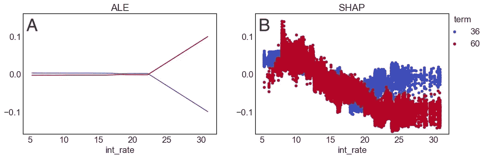
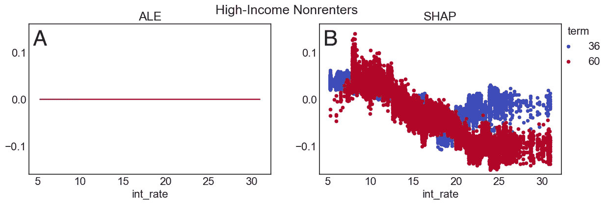
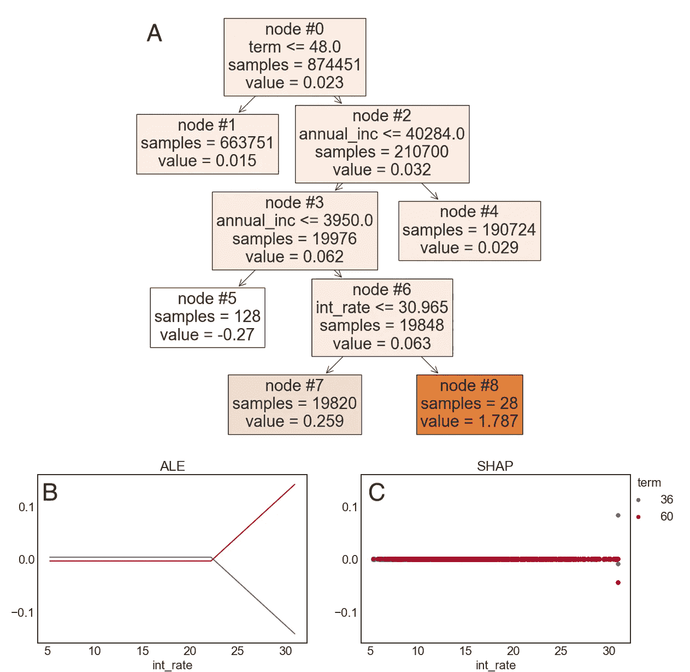

# SHAP 与 ALE 在特征交互上的对比：理解冲突的结果

> 原文：[`towardsdatascience.com/shap-vs-ale-for-feature-interactions-understanding-conflicting-results-ac506149f678`](https://towardsdatascience.com/shap-vs-ale-for-feature-interactions-understanding-conflicting-results-ac506149f678)

## 模型解释工具需要深思熟虑的解读

 [Valerie Carey](https://medium.com/@vla6?source=post_page-----ac506149f678--------------------------------)

·发布于[Towards Data Science](https://towardsdatascience.com/?source=post_page-----ac506149f678--------------------------------) ·10 分钟阅读·2023 年 10 月 2 日

--

图片由[Diogo Nunes](https://unsplash.com/@dialex?utm_source=medium&utm_medium=referral)拍摄，发布在[Unsplash](https://unsplash.com/?utm_source=medium&utm_medium=referral)

在这篇文章中，我比较了特征交互的模型解释技术。令人惊讶的是，两个常用的工具，SHAP 和 ALE，产生了相反的结果。

我可能不应该感到惊讶。毕竟，解释工具以不同的方式测量特定的响应。解释需要理解测试方法、数据特征和问题背景。**仅仅因为某物被称为*解释器*并不意味着它生成了*解释*，如果你把解释定义为一个人理解模型的工作方式。**

本文重点关注特征交互的解释技术。我使用了一个来源于真实贷款的常见项目数据集[1]，以及一种典型的模型类型（一个提升树模型）。即使在这种日常情况下，解释也需要深思熟虑的解读。

> 如果忽略了方法论细节，解释工具可能会妨碍理解，甚至破坏确保模型公平性的努力。

在下文中，我展示了不同的 SHAP 和 ALE 曲线，并证明这些技术之间的分歧来源于测量响应和测试执行的特征扰动的差异。*但首先，我会介绍一些概念。*

# 特征交互

**特征交互发生在两个变量共同作用时，导致的效果与它们各自贡献的总和不同。** 例如，一夜的睡眠质量差对第二天的测试成绩的影响会大于一周后的影响。在这种情况下，代表时间的特征将与睡眠质量特征相互作用或修改。

在线性模型中，交互表示为两个特征的乘积。非线性机器学习模型通常包含众多交互。事实上，**交互是高级机器学习模型逻辑的基础，** 然而许多常见的可解释性技术侧重于孤立特征的贡献。检查交互的方法包括 2-way ALE 图、Friedman 的 H、部分依赖图和 SHAP 交互值 [2]。本博客探讨了其中的两个：ALE 和 SHAP。

# ALE 图

**累计局部效应（ALE）是一种测量特征效应的技术，不会受到相关特征或不太可能的特征组合造成的失真的影响。** 特征交互可以通过 2-way ALE 图进行可视化。2-way ALE 图首先通过扰动一个特征（*i*），在固定的第二个特征（*j*）值下测量模型输出的变化。然后，（在稍微不同的 *j* 值下进行类似的测量。这两个测量值的差异揭示了扰动 *j* 如何影响模型对 *i* 变化的响应。为了减少不太可能的特征组合的影响，测量仅使用在选择的 *i* 和 *j* 值附近的小窗口中的观察值。

# SHAP 交互值

**Shapley 值表示每个特征对模型输出的信用或责任的量。** “SHAP”指的是一组用于计算机器学习模型的 Shapley 值的方法。SHAP 计算测量特征设置为其原始值与参考值相比时模型响应的变化。特征的边际贡献是通过对其他特征的各种组合或“联盟”进行平均来计算的。Shapley 联盟是通过将一些特征值替换为从参考数据集中（通常是训练数据）随机抽取的值来形成的。与 ALE 不同，Shapley 涉及许多特征的扰动，而不仅仅是感兴趣的特征对，并且为每个观察值计算值。

SHAP 交互值将模型分数分配到所有特征主效应 *和* 成对交互 [3]。对于一个观察值，特征对（*i* 和 *j*）的交互是通过测量在特征 *i* 具有其原始值 *j* 时的 Shapley 值来计算的。然后，将 *j* 替换为从参考中随机抽取的值，并计算特征 *i* 的新 Shapley 值。这两个测量值之间的差异量化了特征 *j* 如何修改 *i* 的 Shapley 值。

# 数据和模型

我使用了通过 Kaggle [1] 获得的 Lending Club 贷款数据集。该模型根据利率、贷款期限、借款人收入、借款人住房拥有状态以及个人或联合借款人的信用评分等特征预测贷款违约。利用其他人 [1, 4–5] 做的分析，我选择了 18 个预测特征，响应变量是贷款违约的二元指标。训练了一个提升树模型，使用 Scikit-learn 的 [GradientBoostingClassifier](https://scikit-learn.org/stable/modules/generated/sklearn.ensemble.GradientBoostingClassifier.html)，该模型与 ALE 图 ([PyALE](https://pypi.org/project/PyALE/))、SHAP 值 ([SHAP](https://shap.readthedocs.io/en/latest/index.html)) 和 Friedman 的 H ([sklearn_gbmi](https://pypi.org/project/sklearn-gbmi/)) 兼容。代码可在 GitHub [6] 上获得。

# SHAP 和 ALE 对有影响的特征意见不一致

为了检查模型中的交互作用，我生成了 SHAP 依赖图和二维 ALE 图用于特征对。对于大多数特征对，ALE 和 SHAP 图至少有一些相似之处。但对于一个关键交互作用，即利率和期限，结果却出现了冲突：

**图 1.** 利率和期限的交互作用度量。正值表示预测的违约风险更高。x 轴显示利率，颜色对应于期限值；红色表示 60 个月，蓝色表示 36 个月。**A**. 利率:期限交互作用的 ALE 值折线图。**B.** 显示利率:期限的 SHAP 交互作用值的散点图。图片来源于作者

**二维 ALE 表明，与高利率结合的较长期限增加了风险。但 SHAP 讲述了相反的故事；较长期限在高利率下对违约有保护作用！**

在这个数据集中，贷款期限（term）是分类变量，只有两个值，36 个月和 60 个月，而利率（int_rate）是连续变量。图 1A 和 B 分别显示了 ALE 和 SHAP 值，这些值绘制在相同的尺度上，正值表示由于交互作用，模型默认风险增加。*尽管热图通常用于二维 ALE 图，但我更喜欢折线图；这些图也更容易与 SHAP 图进行比较。*

图 1 中的数据矛盾尤其令我担忧，因为利率和期限是模型中两个最重要的特征，通过多种衡量标准（聚合 Shapley 值、不纯度和置换重要性；见[6]）。此外，根据 SHAP、ALE 和 Friedman 的 H，期限:利率交互作用也很大。

因此，我有两个具有重要交互作用的有影响力特征，但 SHAP 和 ALE 显示的效果方向不同。常识能帮助解决冲突吗？以下是曲线的一些可能解释：

> (ALE) 长期高利率贷款特别具有风险。
> 
> (SHAP) 高利率对违约的预测力很强；在高利率时，期限并不那么重要。

（SHAP 的故事也来源于单向 ALE 响应[6]。负交互作用取消了单向项的响应，因此这种交互作用可以被解释为该项特征影响力的丧失。）

作为一个非借贷领域的专家，这两个账户对我来说似乎都很合理。理解这些图形为何有所不同意味着深入理解这些技术，同时也要考察简化模型。

[Mike Houser](https://unsplash.com/@mike_romeo_hotel?utm_source=medium&utm_medium=referral)的照片，来源于[Unsplash](https://unsplash.com/?utm_source=medium&utm_medium=referral)

# **SHAP 与 ALE — 哪些差异是重要的？**

> SHAP 交互作用和双向 ALE 值都测量当特征*j*被修改时，模型响应的差异，针对特征*i*具有相似值的数据点子集。

从上述陈述开始，让我们列出 SHAP 和 ALE 可能存在差异的一些方式：

**1\. 选择用于测量的数据点。**

**2\. 测试所测量的响应。**

**3\. 特征值如何被修改。**

第 1 项似乎不太可能是罪魁祸首。对于 Shapley 来说，是对每个数据点进行测量，我们使用原始特征值。ALE 考虑的是一个值周围的窗口。窗口大小是基于数据密度的，因此较高的利率点反映了一个相对较大的值范围，但在图 1 的“高利率”部分，我们可能有足够相似的观测值。

第 2 项和第 3 项的差异可能对解释图形中的不一致很重要。对于第 2 项，SHAP 和 ALE 测试不同的模型响应。ALE 使用*原始模型输出*，而 SHAP 则将模型预测分布到多个特征上，并检查*归因于* *i*的*部分*。

对于第 3 项，ALE 扰动仅涉及特征*j*的值替代。而 SHAP 则汇总了许多模型特征的响应；所有变量都会被扰动。替代值是从训练数据中随机抽取的，通常反映了更典型的值，这可能与初始观测的特征差异很大。

# 稀有情况生成 ALE 信号

在进行模型简化和其他分析后（见[6]中的代码），我意识到 ALE 测试是在响应多个风险因素的情况下模型的预测。下面，我重新计算了仅针对年收入超过 45,000 美元且不是租房者的客户的 ALE 和 SHAP 图。

**图 2.** 利率和期限的交互测量，仅对高收入非租户客户计算。P. 正值表示预测的违约风险较高。x 轴显示利率，颜色对应期限值；红色表示 60 个月，蓝色表示 36 个月。**A.** 利率:期限交互的 ALE 值折线图。**B.** 显示利率:期限的 SHAP 交互值的散点图。图片由作者提供。

当排除低收入和租户案例（约占总数的 50%）时，ALE 信号几乎完全消失，而 SHAP 曲线在质量上保持不变。

原始的 ALE 曲线（图 1A）可以通过一个简化的单树模型进行再现，该模型只涉及三个特征（利率、期限和年收入），如下所示：

**图 3.** 简单模型以重现 ALE 检测到的特征交互。A. 单个决策树模型的图示。树的遍历从节点 0 开始，当框中显示的条件为真时向左移动，否则向右移动。遍历在叶节点结束；响应是该节点中的值。根据模型响应值对框进行着色（对于非叶节点，值反映了子叶节点的平均值）。在框中注明了达到每个节点的训练数据样本数量。**B** 关于利率:期限的 ALE 值的折线图，展示了 A 中所示的树。**C.** 显示利率:期限的 SHAP 交互值的散点图，针对 A 中的树。由于文本中讨论的原因，一些异常点在 SHAP 曲线中被裁剪。图片由作者提供。

图 3A 包含具有非常高或低值的低人口节点（例如，节点 2 和 7）。节点 7 由稀有客户访问，这些客户具有低收入、高利率和长期；这些客户的违约风险非常高。

**ALE 图受到稀有特征组合影响的主导作用。** 节点 7 代表了少量的贷款，但在 ALE 计算过程中，当更改期限时，模型响应发生了剧烈变化。60 个月的客户离开此节点，降低了风险，而（数量更多的）36 个月客户进入此节点，导致了一个显著的信号。

# SHAP 检测复杂模型中的系统性效应

图 1B 中的 SHAP 信号在图 3B 中消失。模型复杂性是 SHAP 结果的关键。为了可靠地再现原始的 SHAP 曲线，我发现需要≥4 个特征、20 棵树和深度>5（见[6]中的代码）。

图 3B 中的 SHAP 曲线包含了超过 30% 利率的异常值（其中一些在图中被裁剪；异常值高达 ~0.4）。如果对异常值取平均，36 个月和 60 个月的值非常相似，接近零 (~0.001)。这些异常值是由于具有访问极端节点 4 和 7 的联合体的情况。模型复杂性减少了异常值。随着特征数量的增加，从参考数据中抽取多个不寻常的值变得不太可能。此外，在计算中平均更多的联合体会稀释信号。

**SHAP 测量会降低对稀有特征组合的重视。** SHAP 联合体可能涉及与原始特征值非常不同的值，而 ALE 计算通常涉及在更受限范围内的扰动。SHAP 联合体提供了对模型的更广泛覆盖，反映了由更多节点生成的值，特别是人口较多的节点。

SHAP 计算中特征变化的范围取决于观察值是否相对于参考数据异常。图 1B 和 2B 中的 36 个月期限曲线的平坦性反映了大多数客户（75%）拥有 36 个月的贷款。因此，为期限生成 SHAP 联合体时，随机抽取的值*可能会使期限保持不变*。减去两个相似曲线的结果会得到一个较小的 SHAP 交互值。

相比之下，60 个月的期限曲线与典型情况更远，因此生成 SHAP 信号。高利率和 60 个月期限下的负值表明，利率特征对 36 个月较低期限值的影响更大。更多的贷款是 36 个月的，并且大多数贷款风险适中，因此在这种情况下高利率更令人惊讶。对于 60 个月期限，高利率则不那么令人惊讶（利率和期限的 Pearson 相关系数约为 0.4），因此可能预期 SHAP 对长期贷款的利率特征赋予较少的权重。

# 那么，哪个是正确的？

之前，我描述了图 1 中曲线所暗示的两个不同故事：

> (ALE) 长期高利率贷款特别具有风险。
> 
> (SHAP) 高利率对违约的预测能力很强；当利率较高时，期限并不是很重要。

这两个故事似乎都是真的，但针对不同的客户。对于具有多个风险因素的少见情况，第一个解释是正确的；利率和期限的组合会产生非常大的 ALE 响应。但对于更典型的高利率客户，利率捕捉了大部分风险。**因此，SHAP 和 ALE 测试关注的是不同的客户。**

# 为什么这很重要？

在应用可解释性工具后，我们期望能增加对模型工作原理的理解。我们相信，我们将对模型的决策过程有一个总体的了解，甚至可能揭示数据中的一些模式。这些测试用于质量控制和信任建立。当解释与期望一致时，利益相关者会感到安心。

> 可解释性工具可以提供许多好处，但它们也可能误导或提供虚假的安慰。

可解释性工具在模型公平性测试中尤其重要，以避免偏见和歧视。当特征偏见存在或怀疑存在时，交互度量是至关重要的[7]。SHAP 对稀有特征组合的缺乏响应可能是一个问题，因为性别、种族或年龄等特征组合可能与不良结果有关。相反，ALE 可能会忽略系统性效应，因为它扰动了较少数量的特征，范围更有限。

# 结论

模型可解释性包通常被描述为“解释器”，其输出为“解释”。我认为使用*测试*或*测量*这样的词更为有用。例如，“SHAP 值”比“SHAP 解释”更好，因为包的输出与对复杂模型的实际理解之间存在一些距离。我正在尝试改变我对这些术语的使用，以提醒自己这一点！

在医学中，诊断测试在特定情况下进行，结果由专家解读。通常，为了建立诊断，使用不止一种测试。同样，需要对模型可解释性工具有更深入的理解才能得出有意义的结论。

# 参考文献

[1] N. George, All Lending Club loan data, [`www.kaggle.com/datasets/wordsforthewise/lending-club`](https://www.kaggle.com/datasets/wordsforthewise/lending-club)。

[2] C. Molnar, [可解释的机器学习：使黑箱模型可解释的指南](https://christophm.github.io/interpretable-ml-book/)（2023）。

[3] S. M. Lundberg, G. G. Erion 和 S-I. Lee, [树集成的个体化特征归因](https://arxiv.org/pdf/1802.03888.pdf)（2019），arXiv:1802.03888v3 [cs.LG]。

[4] M. Gusarova, [特征选择技术](https://www.kaggle.com/code/mariiagusarova/feature-selection-techniques)（2023），Kaggle。

[5] N. George, [使用 Python 进行探索性数据分析](https://www.kaggle.com/code/wordsforthewise/eda-with-python/notebook)（2019），Kaggle。

[6] V Carey, GitHub 代码库, [`github.com/vla6/Blog_interactions`](https://github.com/vla6/Blog_interactions)。

[7] V Carey, [特征偏见的无免费午餐](https://medium.com/towards-data-science/no-free-lunch-with-feature-bias-561c9cd3dd18)（2021），Towards Data Science。
