# 使用 ONets 进行形状重建

> 原文：[`towardsdatascience.com/shape-reconstruction-with-onets-1c1afe89c50`](https://towardsdatascience.com/shape-reconstruction-with-onets-1c1afe89c50)

## 使用可学习函数表示 3D 空间

 [Cameron R. Wolfe, Ph.D.](https://wolfecameron.medium.com/?source=post_page-----1c1afe89c50--------------------------------)

·发布于 [Towards Data Science](https://towardsdatascience.com/?source=post_page-----1c1afe89c50--------------------------------) ·11 分钟阅读·2023 年 2 月 7 日

--

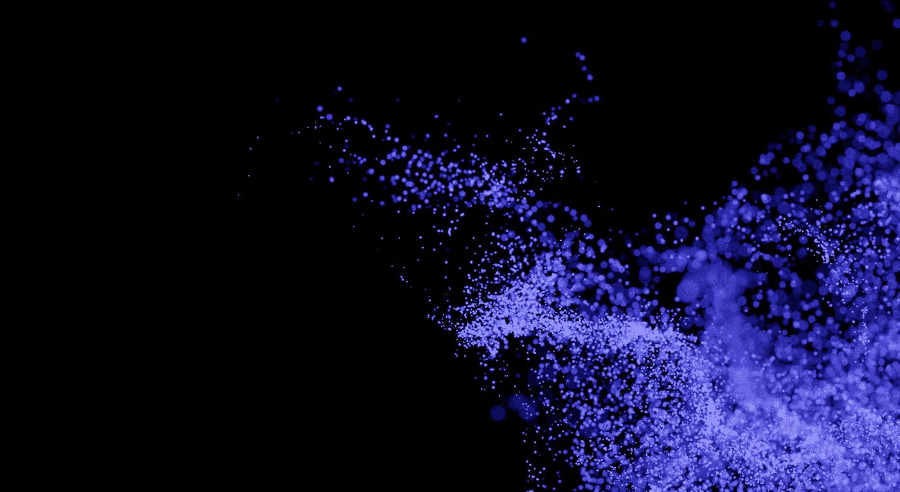

（照片由 [Tareq Ajalyakin](https://unsplash.com/@tareq_aj?utm_source=unsplash&utm_medium=referral&utm_content=creditCopyText) 拍摄，来源于 [Unsplash](https://unsplash.com/s/photos/points?utm_source=unsplash&utm_medium=referral&utm_content=creditCopyText)）

3D 重建的问题旨在根据物体的噪声视图（例如，部分点云、2D 图像等）生成高分辨率的物体表示。最近，深度神经网络成为 3D 重建的热门方法，因为它们可以编码有助于处理模糊的信息。简单来说，这意味着如果从输入中不清楚如何正确重建给定的物体，*神经网络可以借鉴它在训练过程中遇到的其他数据点的经验，仍然生成合理的输出*。

大多数 3D 重建方法最初在表示高分辨率物体的能力上存在限制。体素、点云和网格在以内存高效的方式建模高分辨率物体方面都存在不足。与如 GANs [2] 等可以生成高分辨率、逼真图像的模型相比，用于生成 3D 几何的可比方法还处于初级阶段。

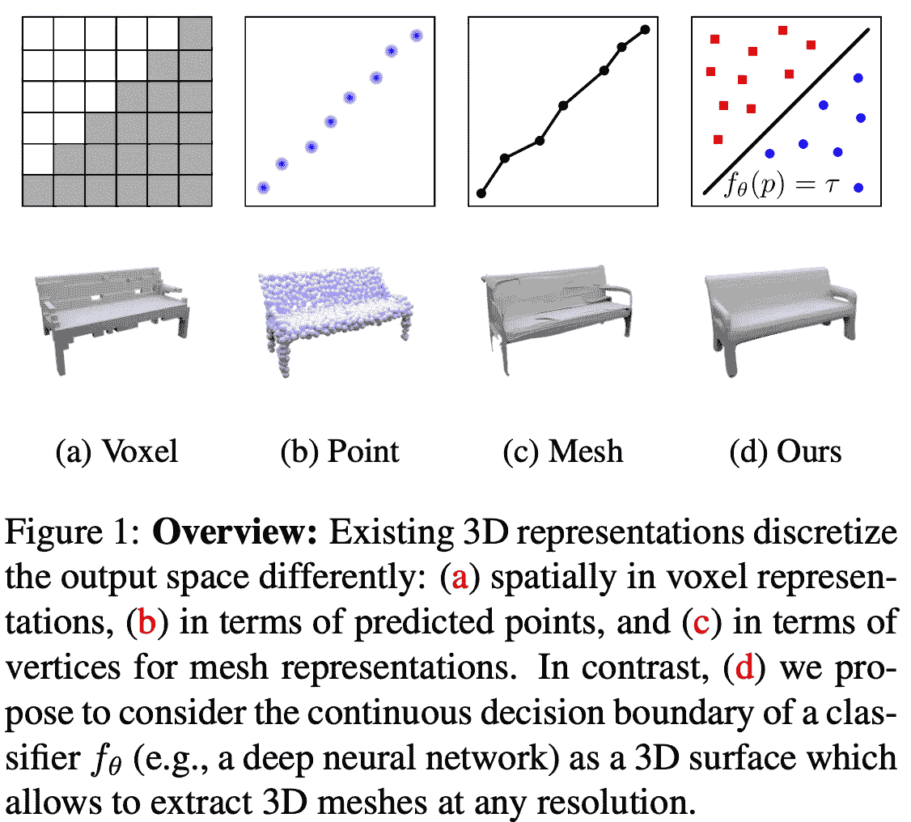

（来自 [1]）

为了解决这个问题，文献[1]中作者提出了一种 3D 重建方法，该方法使用神经网络对占据函数进行建模。更具体地说，我们训练一个神经网络来预测空间中给定点是否被物体占据（即，*占据函数*！）。然后，底层物体通过该神经网络的决策边界（即，预测从占据到未占据的切换位置）来表示；见上文。占据网络（ONets）可以以任意精度和合理的内存要求表示和重建 3D 形状。

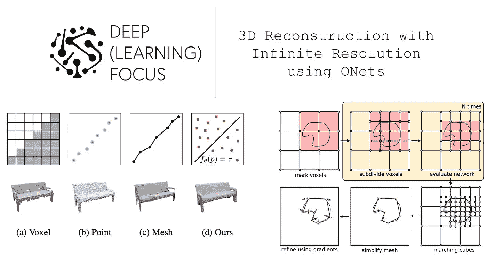

（来自 [1]）

# 背景

在我们之前对[DeepSDF](https://cameronrwolfe.substack.com/p/3d-generative-modeling-with-deepsdf)的 3D 形状生成的回顾中，我们涵盖了一些相关的背景概念，包括：

+   点云、网格和体素表示 [[link](https://cameronrwolfe.substack.com/i/94634004/representing-d-shapes)]

+   前馈神经网络 [[link](https://cameronrwolfe.substack.com/i/94634004/feed-forward-neural-networks)]

[1]中的大多数神经网络使用了简单的前馈架构，这种架构作为一种替代方案，用于存储 3D 形状的标准网格、体素或点云格式。为了理解为什么这种方法更可取，我们需要更详细地了解这些表示的限制。

# 3D 形状表示的缺点

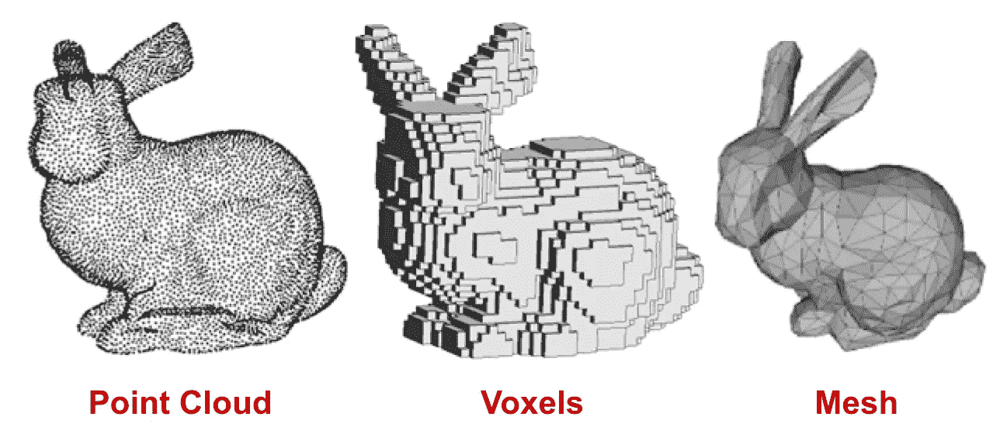

（来自 [6]）

3D 几何形状通常以网格、体素或点云的形式存储或表示；见上文。鉴于这些表示已经存在，*我们为什么还要使用神经网络来表示形状呢？* 简单的答案是 *(i)* 其他表示方法存在一些显著的限制，以及 *(ii)* 我们可以通过这种方式节省大量内存。

**体素在内存使用上不高效。** 在深度学习应用中，体素是用于 3D 形状的最广泛使用的表示形式，因为它们简单——它们是像素在 3D 空间中的直接推广。然而，如果我们使用体素来编码一个 3D 形状，这种编码的内存占用会随着分辨率的提高而立方增长。如果我们想要更精确的体素表示，我们需要使用更多的内存。

**点云是断开的。** 点云的格式类似于我们通常从传感器（如 LiDAR）获得的数据，但结果几何形状是断开的——它只是 3D 空间中的一堆点。因此，从这些数据中提取实际的 3D 形状需要昂贵的后处理程序。

**网格并不是解决方案。** *如果点云需要后处理而体素在内存使用上不高效，我们应该使用网格，对吗？* 不幸的是，大多数网格表示实际上是基于变形的“模板”网格。实际上，这意味着网格无法编码任意的拓扑结构，这使得它们在准确表示某些几何形状时受到限制。

**那么我们该怎么办？** 考虑到这些限制，[1]中提出的方法开始变得更加合理。我们可以训练一个神经网络来生成可以恢复形状的输出，而不是直接存储 3D 形状的网格、体素或点云表示。通过这种方式，我们可以在一个具有固定内存成本的神经网络参数中存储大量不同的几何形状！

# 占用函数

[1]中的工作将占据函数表示为神经网络，但*占据函数是什么*？简单来说，这只是一个将空间中的点（例如，`[x, y, z]` 坐标）作为输入，并返回一个二进制输出的函数，表示该位置是否被目标对象“占据”。

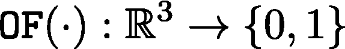

占据函数的特征

这样的函数可以通过一个神经网络进行逼近，该网络被训练为在给定 `[x, y, z]` 坐标作为输入时输出零到一之间的概率。

**提取等值面。** 要从占据函数中提取 3D 几何体，我们必须找到一个等值面。为此，我们只需在 3D 空间中找到占据函数等于某个阈值 `t` 的点。

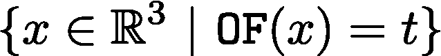

等值面

在这里，t 被设置为零到一之间的某个值。因此，等值面表示占据函数的边界，即输出从零切换到一（或反之）的地方——这对应于基础对象的表面！

# 评估指标

用于判断 3D 形状质量的指标与我们在普通计算机视觉中看到的指标非常相似。[1]中使用的主要指标如下所述。

**体积 IoU。** 两个形状交集的体积除以它们并集的体积。该指标与[法线 IoU](https://learnopencv.com/intersection-over-union-iou-in-object-detection-and-segmentation/)相同，但它已被推广到三维。

**Chamfer-L1。** 精度和完整性的均值。精度是输出网格上点到地面真实网格最近点的平均距离。完整性是相同的，但方向相反。

**法线一致性。** 我们取预测网格的[面法线](https://adamsturge.github.io/Engine-Blog/mydoc_mesh_normals.html#face-normals)（即一个垂直于网格某一面平面的向量），找到另一个网格中对应最近邻的面法线，然后取这些向量的[点积](https://en.wikipedia.org/wiki/Dot_product)的绝对值。通过对预测网格中的所有法线重复这一过程并取平均值，我们得到法线一致性。这一指标稍显复杂，但它对于确定预测形状是否捕捉到高阶信息（即两个网格的面是否趋向于指向相同方向）非常有用。

# [占据网络](https://arxiv.org/abs/1812.03828) [1]

在了解 DeepSDF 的基本概念后，我们可能会问占据网络的第一个问题是：*为什么要建模占据函数，而不是像* [*有符号距离函数（SDFs）*](https://cameronrwolfe.substack.com/i/94634004/signed-distance-functions)*这样的替代方法？* 基本的答案是，占据函数更容易学习。

> *“[SDFs 通常比占据表示更难学习，因为网络必须在 3D 空间中推断距离函数，而不仅仅是将体素分类为占据或未占据。]” — 摘自 [1]*

**网络。** 为了逼近占据函数，我们使用一个前馈神经网络，该网络将一个介于零和一之间的概率分配给任何 3D 坐标。网络的输入包括：

1.  一个（单一的）3D 坐标。

1.  对底层物体的噪声观察。

我们称之为 ONet 的网络输出一个标量概率。作为模型输入的底层物体的噪声观察可能是诸如不完整的点云或粗略的体素网格之类的东西。我们将神经网络以这些噪声数据为条件，然后使用它生成物体的更精确表示；见下文。

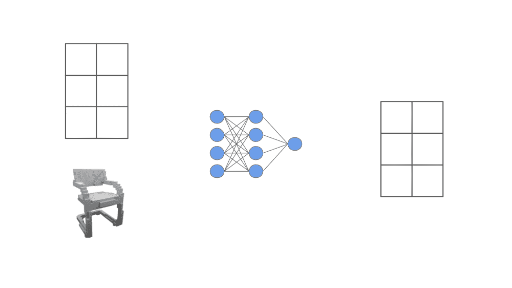

对每个空间位置建模占据函数

我们不能直接将观察到的噪声数据作为输入传递给前馈神经网络，因为它们可能有许多不同的格式。相反，[1]中的作者使用不同的基于神经网络的编码器（例如，图像的 ResNets [4] 或点云的 PointNet [5]；这些只是将图像和点云转换为向量的常见网络架构）将这些数据（即，将其转换为向量）嵌入。

然后，前馈神经网络的第一层使用 [条件批量归一化](https://paperswithcode.com/method/conditional-batch-normalization) — 一种条件 [批量归一化](https://paperswithcode.com/method/batch-normalization) 变体 — 根据物体嵌入调整网络的输入。这样，我们确保 ONet 的输入以我们尝试重建的 3D 几何数据为条件。

**训练。** 为了训练 ONet，我们 *(i)* 考虑一个围绕训练物体的填充空间体积，以及 *(ii)* 在这个空间中均匀采样 `K` 个占据函数值。通过将这种采样过程应用于多个训练物体来形成一个小批量。我们使用带有每个小批量中占据函数值的 交叉熵损失 的小批量梯度下降法正常训练网络。

**生成对象。** 一旦 ONet 训练完成，我们可以在任意分辨率下输出给定空间位置的占据函数值。但是，*我们如何使用这些值来创建实际的 3D 对象（例如，以网格格式）？* 为此，[1]中的作者提出了一种多分辨率等值面提取（MISE）过程。该过程受到 [八叉树](https://en.wikipedia.org/wiki/Octree) 的启发，八叉树是一种递归表示 3D 空间的树形数据结构。每个八叉树节点有八个子节点，我们可以递归地向每个节点添加子节点，以表示更高分辨率的体积。

MISE 的基本过程如下：

1.  在初始分辨率下离散化空间

1.  在该空间的每个离散位置评估 ONet

1.  标记所有具有至少两个相邻体素且占用情况不同的体素

1.  将标记的体素划分为八个子体素，并重复直到达到所需的分辨率

1.  应用 [Marching Cubes](https://graphics.stanford.edu/~mdfisher/MarchingCubes.html#:~:text=Marching%20cubes%20is%20a%20simple,a%20region%20of%20the%20function.) 以获取网格

因此，MISE 通过在需要的更高分辨率下递归评估 ONet 来获得网格（即，接近对象边界）。尽管我们必须应用一些额外的步骤来精细化此网格，但整体过程相当直观；见下文。

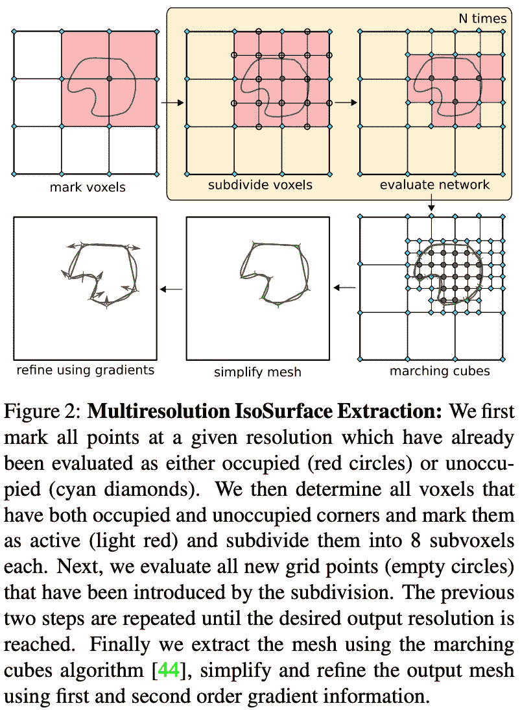

（来自 [1]）

**实验结果。** ONets 主要在合成 [ShapeNet](https://shapenet.org/) 数据集上进行评估，基于其表示复杂 3D 形状和/或从图像、噪声点云和低分辨率体素网格中重建它们的能力。在这些实验中，我们看到 ONets 可以准确地表示 ShapeNet 的“椅子”部分。使用 ONet，我们可以使用仅 6M 参数独立编码近 5K 对象。相比之下，体素表示不够准确，并且其内存要求随着所需分辨率的增加而增加；见下文。

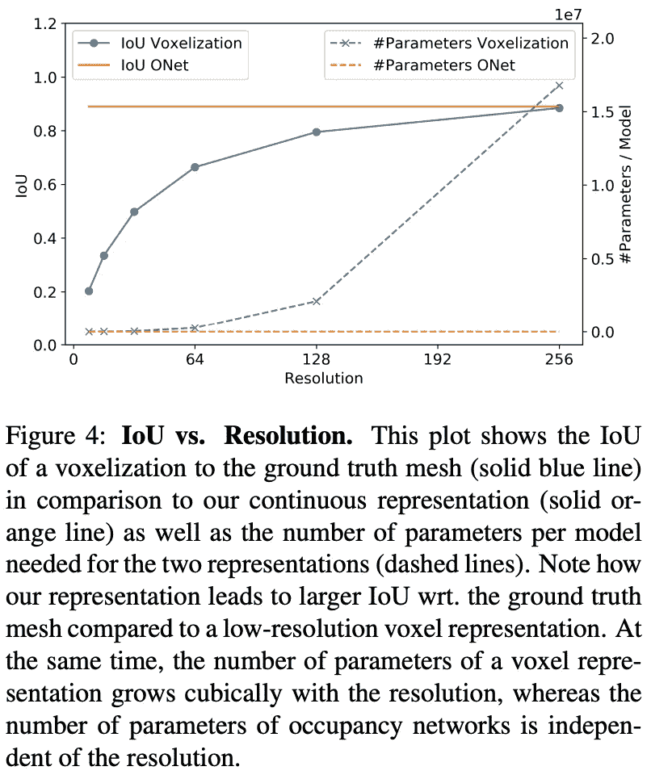

（来自 [1]）

在重建实验中，我们继续看到 ONets 工作得相当好。它们能够恢复复杂的形状，并且往往产生最接近真实几何的结果。大多数基准方法通常存在限制，例如产生粗糙的表示、需要后处理的断开对象或缺乏相关细节的对象。模型输出的定性示例如下所示。

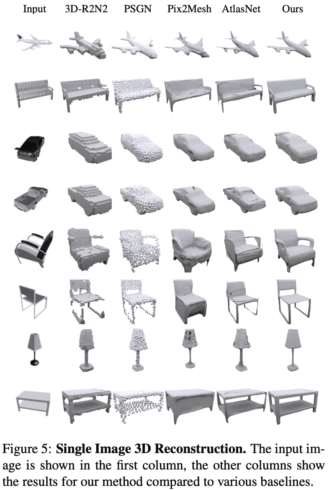

（来自 [1]）

当尝试从噪声点云和粗糙体素网格（即，而不是像上面那样使用图像）重建几何时，我们看到 ONet 继续表现良好；见下文。

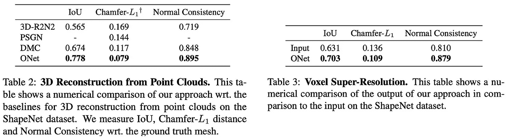

（来自 [1]）

**其他内容。** ONets 还通过从 [KITTI](https://www.cvlibs.net/datasets/kitti/) 和 [Online Products](https://github.com/rksltnl/Deep-Metric-Learning-CVPR16) 数据集中获取图像应用于现实世界数据。尽管仅在合成数据上训练，ONet 似乎对这种类型的数据泛化效果很好。然而，值得注意的是，作者确实使用了 KITTI 提供的分割掩码来提取与所需对象相关的像素。以下展示了从这些数据集中生成的重建示例。

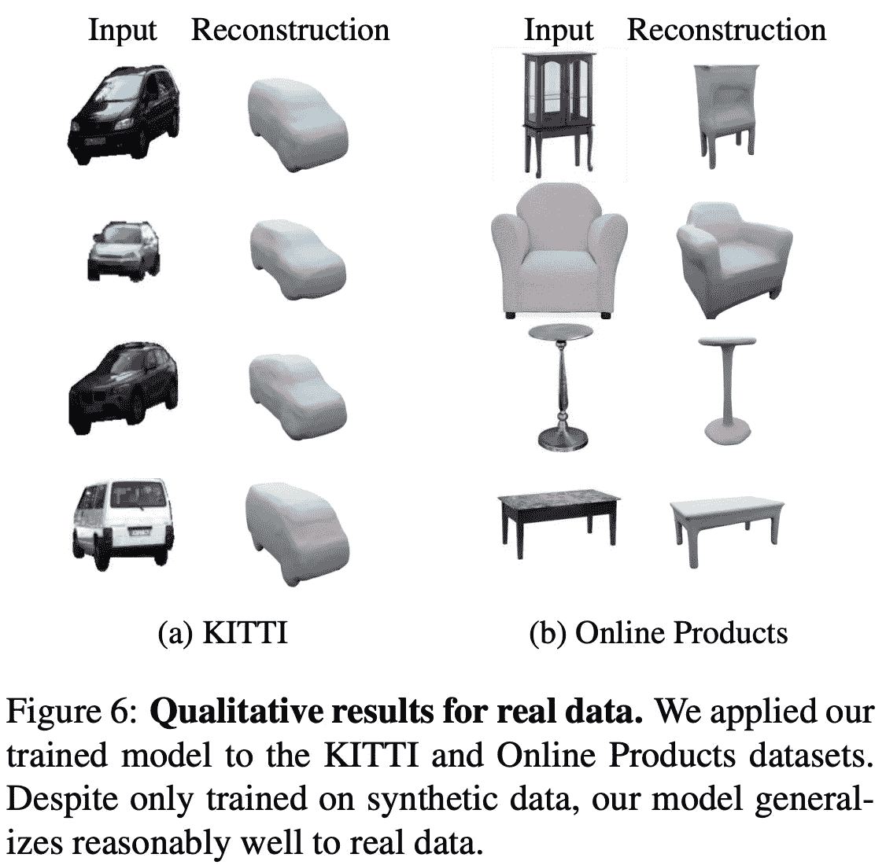

（来自 [1]）

超越[1]中的初步提议，作者还提出了一种生成版本的 ONet，该版本通过对 ShapeNet 进行无监督训练，并形成一个类似于[变分自编码器](https://jaan.io/what-is-variational-autoencoder-vae-tutorial/)（VAE）的 3D 几何潜在空间。简单来说，作者发现可以创建生成 ONets，这些 ONets 能够生成新的网格并在网格之间进行插值。如果我们希望关注生成应用而不仅仅是 3D 重建，这将非常有用。

# 要点

在 ONets 之前，现有的 3D 重建方法在保持合理内存占用的同时，难以对高分辨率物体进行建模。在[1]中，我们了解到，更智能的 3D 几何表示可以带来显著的好处。ONets 提案中的主要要点如下。

**占据函数非常棒。** 常见的 3D 几何表示（如网格、点云、体素）在表示高分辨率物体时往往占用过多内存。占据函数是一种更简洁的表示方法，它通过编码单一函数来实现对 3D 物体的任意精度建模。而且，与像 SDF 这样的替代方法相比，占据函数更容易学习或建模。

**可学习的重建。** 当然，占据函数很棒，但这项工作的真正价值在于我们如何表示这些函数。也就是说，我们可以使用神经网络来学习和存储各种形状的占据函数。因此，我们可以通过*(i)*训练一个 ONet 和*(ii)*存储模型的参数，以任意精度表示许多不同的形状。这种方法使用有限且固定的内存量，并通过利用先验信息来提高重建质量！

**表示 3D 空间。** 在解释使用 ONets 生成网格的 MISE 方法时，我们很快遇到了八叉树的概念。这是 3D 建模中的一个重要数据结构，它允许我们以不同的精度递归生成形状。如果我们想获得更精确的表示，只需继续细分体素。但我们应仅在有意义的地方（即当附近的体素具有不同的占据情况时）进行此操作，以避免不必要的计算。

## 结束语

非常感谢阅读本文。我是[Cameron R. Wolfe](https://cameronrwolfe.me/)，一名在[Alegion](https://www.alegion.com/)工作的研究科学家，同时也是莱斯大学的博士生，研究深度学习的经验和理论基础。你也可以查看我在 medium 上的[其他写作](https://medium.com/@wolfecameron)！如果你喜欢这篇文章，请在[twitter](https://twitter.com/cwolferesearch)上关注我或订阅我的[Deep (Learning) Focus 通讯](https://cameronrwolfe.substack.com/)，我在其中撰写了有关深度学习重要主题的易懂概述系列。

## 参考文献

[1] Mescheder, Lars, 等. “占据网络：在函数空间中学习 3D 重建。” *IEEE/CVF 计算机视觉与模式识别会议论文集*。2019 年。

[2] Goodfellow, Ian, 等. “生成对抗网络。” *ACM 通讯* 63.11 (2020)：139–144。

[3] Mildenhall, Ben, 等. “NeRF：将场景表示为神经辐射场以进行视图合成。” *ACM 通讯* 65.1 (2021)：99–106。

[4] He, Kaiming, 等. “图像识别的深度残差学习。” *IEEE 计算机视觉与模式识别会议论文集*。2016 年。

[5] Qi, Charles R., 等. “Pointnet：针对 3D 分类和分割的点集深度学习。” *IEEE 计算机视觉与模式识别会议论文集*。2017 年。

[6] Hoang, Long, 等. “一种使用波形核签名和 3D 三角网中心点的 3D 对象分类深度学习方法。” *电子学* 8.10 (2019)：1196。
