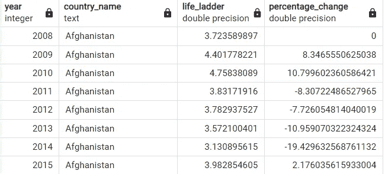
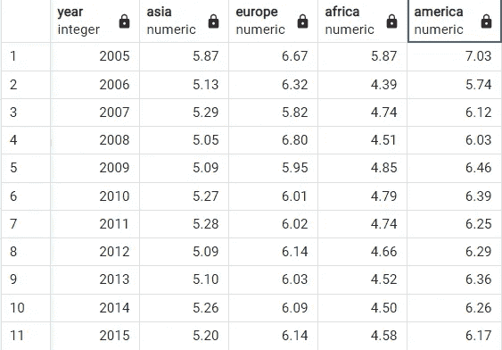

# 用 SQL 进行数据塑形

> 原文：[`towardsdatascience.com/shaping-your-data-with-sql-71822f2fc2f4`](https://towardsdatascience.com/shaping-your-data-with-sql-71822f2fc2f4)

## 使用不同的技术改进和优化你的数据分析过程

[](https://nphchi223.medium.com/?source=post_page-----71822f2fc2f4--------------------------------)[](https://towardsdatascience.com/?source=post_page-----71822f2fc2f4--------------------------------) [Chi Nguyen](https://nphchi223.medium.com/?source=post_page-----71822f2fc2f4--------------------------------)

·发表于[Towards Data Science](https://towardsdatascience.com/?source=post_page-----71822f2fc2f4--------------------------------) ·9 分钟阅读·2023 年 4 月 18 日

--


由[OB OA](https://unsplash.com/@oboa?utm_source=medium&utm_medium=referral)拍摄，图片来自[Unsplash](https://unsplash.com/?utm_source=medium&utm_medium=referral)

# 什么是数据塑形？

没有一种放之四海而皆准的数据。为了不同的目的和使用案例，数据会根据需要进行定制。你对数据未来使用目的的了解越多，你就越能正确地将数据呈现给最终用户。

例如，用于进行深入分析的数据与提供给高层管理的汇总数据有所不同。

另一个例子是，业务发展团队更关心每个地区的总体成本以吸引新用户，而市场营销经理则更关注与区域有关的附属营销成本。

也就是说，将现有数据结构转换为任何替代的透视或非透视结构，是数据操作和分析过程中不可或缺的一步。

在这篇文章中，我将介绍一些在特定情况下对数据进行塑形和切片的技术。通常，我会使用 PostgreSQL 来展示我的例子。

现在，让我们开始看看我们得到的结果吧！

# 数据

在这篇文章中，我将使用《2015–2021 年世界幸福报告》的数据。该数据集提供了基于不同指标的全球各国幸福水平：经济增长、社会支持、出生时的预期寿命等。数据可在[Kaggle](https://www.kaggle.com/datasets/jahaidulislam/world-happiness-report-2005-2021)上获得，并具有[CC0: 公共领域](https://creativecommons.org/publicdomain/zero/1.0/)许可。如下面的图像所示，我将仅利用一些字段：

+   国家名称

+   年份：报告年份（2005–2021）

+   生活梯度：每个受访者认为的最佳生活由梯度上的 10 表示，而最差的生活由 0 表示。然后要求每个参与者在梯度上对其当前生活进行排名。

+   人均 GDP 对数：以购买力平价（PPP）调整的美元表示的人均 GDP 的对数。

+   社会支持：国家中对社会支持（能够依靠他人）的感知。

+   健康预期寿命：指一个国家公民在特定时期的平均寿命。


作者提供的图片

# 使用窗口函数

## 使用 PRECEDING AND CURRENT ROW 进行的滚动计算

**示例：** 显示每个国家的滚动三年平均生活梯度指数

什么是三年滚动平均？简单来说，它计算的是过去两年的平均生活梯度分数加上当前年。如果当前年份是 2010 年，例如，每个国家的三年滚动平均生活梯度分数将等于该国家在 2008 年、2009 年和 2010 年的分数的平均值。如下面的图片所示，2010 年阿富汗的‘rolling_average’为 4.29，这个值是 3.72、4.40 和 4.76 的平均值。


作者提供的图片

为了指定计算中要考虑的行范围，SQL 中的窗口函数与`PRECEDING`和`CURRENT ROW`一起使用。具体来说，`PRECEDING`确定在`CURRENT ROW`之前的行数。因此，与`PARTITION BY`国家和`ORDER BY`年份结合使用时，下面的 SQL 命令将返回每个国家在‘rolling_average’列中的滚动三年平均生活梯度分数。

```py
SELECT year, country_name, life_ladder,
  AVG(life_ladder) OVER (
    PARTITION BY country_name
    ORDER BY year
    ROWS BETWEEN 2 PRECEDING AND CURRENT ROW
  ) AS rolling_average
FROM public.happiness_index; 
```

## 使用 UNBOUNDED PRECEDING AND CURRENT ROW 进行的周期计算

**示例：** 显示每个国家的期间平均生活梯度分数

为了进行此计算，我们使用`UNBOUNDED PRECEDING AND CURRENT ROW`。计算窗口将包括当前值和所有行直到当前行。

例如，如果当前年份是 2009 年，那么一个国家在这段时间内的平均分数将等于其 2008 年和 2009 年的分数的平均值。类似地，在 2010 年，平均生活梯度分数将通过将 2008 年、2009 年和 2010 年的分数除以 3 来确定。你可以参考下面的命令获取更多信息。

```py
SELECT year, country_name, life_ladder,
AVG(life_ladder) OVER (
    PARTITION BY country_name
    ORDER BY year
    ROWS BETWEEN UNBOUNDED PRECEDING AND CURRENT ROW
  ) AS rolling_average
FROM public.happiness_index
```


作者提供的图片

## 使用 UNBOUNDED PRECEDING AND CURRENT ROW 进行的百分比计算

**示例：** 计算生活梯度点与累积平均值的百分比变化。

类似于之前的示例，使用了`UNBOUNDED PRECEDING AND CURRENT ROW`，但这个示例并不是仅计算跨时间的平均值，而是关注当前值与期平均值之间的百分比变化。在这种情况下，结果存储在第四列，如下图所示。你可以很容易地观察到哪一年相比滚动平均值实际发生了正/负变化。此外，这个指标还告诉我们目标值变化的幅度。



图片由作者提供

```py
SELECT 
  year, 
  country_name, 
  life_ladder, 
  100 * (life_ladder - AVG(life_ladder) OVER (PARTITION BY country_name ORDER BY year ROWS BETWEEN UNBOUNDED PRECEDING AND CURRENT ROW)) / AVG(life_ladder) OVER (PARTITION BY country_name ORDER BY year ROWS BETWEEN UNBOUNDED PRECEDING AND CURRENT ROW) AS percentage_change
FROM 
  public.happiness_index
```

实际上，在时间序列分析中，这种方法是识别数据趋势或模式的重要方法之一。例如，它在销售分析中使用最为频繁，主要关注销售增长或市场份额。

## 使用 PERCENTILE_RANK() 进行百分位计算

**示例：** 识别区域内每个国家的人均 GDP 的百分位

在这种情况下，我想知道哪些国家在 2008 年各自区域中拥有更高的人均 GDP。这个任务只需借助`PERCENTILE_RANK()`函数即可完成。

```py
SELECT country_name, regional_indicator, log_gdppercapita,
  round((PERCENT_RANK() OVER (
    PARTITION BY regional_indicator
    ORDER BY log_gdppercapita
  ))::numeric,2) AS percentile_rank
FROM public.happiness_index
where year = 2008;
```


图片由作者提供

因此，正如你所观察到的，通过`PARTITION BY`区域和`ORDER BY`人均 GDP，命令将国家根据其人均 GDP 排名分为不同的百分位类别。例如，根据数据，拉脱维亚的人均 GDP 高于中东欧地区 33% 的国家。

# 使用 CASE WHEN 结合聚合函数进行数据转换

**示例：** 显示每年每大洲的平均生活阶梯得分

在这种情况下，我将根据‘regional_indicator’字段将国家划分为亚洲、欧洲、非洲和美洲四个大区域。我们可以通过首先使用`CASE WHEN`识别每个区域，然后得到每个位置对应的生活阶梯平均值。

```py
SELECT year, 
ROUND(AVG(CASE WHEN regional_indicator LIKE '%Asia%' THEN life_ladder 
  ELSE null END)::numeric,2) AS Asia, 
ROUND(AVG(CASE WHEN regional_indicator LIKE '%Europe%' THEN life_ladder 
  ELSE null END)::numeric,2) AS Europe, 
round(AVG(CASE WHEN regional_indicator LIKE '%Africa%' THEN life_ladder 
  ELSE null END)::numeric,2) AS Africa,
round(AVG(CASE WHEN regional_indicator LIKE '%America%' THEN life_ladder 
  ELSE null END)::numeric,2) AS America
FROM public.happiness_index
GROUP BY 1
ORDER BY 1
```



图片由作者提供

你可以看到保存于行中的 4 个不同区域的生活阶梯得分已经被转换成 4 列。这种数据转换使得分析师可以轻松监控不同地点在特定年份的值变化。它还对跟踪某地区在一定时期内的数据变化非常有用。

# 使用 UNION ALL 进行数据反透视

**示例：** 反透视之前数据集中的表

我们如何将上一个示例中的表转换成下表？


图片由作者提供

分析需要灵活的数据转换技术，因为它使你能够从任何维度查看数据并获得更有洞察力的信息。正如你所看到的，前面的示例展示了结果数据表在垂直查看和水平查看数据时如何提供洞察。

在这种情况下，我将展示如何使用 `UNION ALL` 将数据反透视到其原始状态的简单转换。当使用 `UNION ALL` 时，需要注意的是，所有用于联合的组件的列数和数据类型必须兼容。

```py
WITH tbl AS 
(SELECT year, 
ROUND(AVG(CASE WHEN regional_indicator LIKE '%Asia%' THEN life_ladder 
  ELSE null END)::numeric,2) AS Asia, 
ROUND(AVG(CASE WHEN regional_indicator LIKE '%Europe%' THEN life_ladder 
  ELSE null END)::numeric,2) AS Europe, 
round(AVG(CASE WHEN regional_indicator LIKE '%Africa%' THEN life_ladder 
  ELSE null END)::numeric,2) AS Africa,
round(AVG(CASE WHEN regional_indicator LIKE '%America%' THEN life_ladder 
  ELSE null END)::numeric,2) AS America
FROM public.happiness_index
GROUP BY 1
ORDER BY 1)

SELECT year, 
'Asia' AS region
, asia AS avg_life_ladder
FROM tbl
    UNION ALL
SELECT year, 
'Europe' AS region
, europe AS avg_life_ladder
FROM tbl
    UNION ALL
SELECT year, 
'Africa' AS region
,africa AS avg_life_ladder
FROM tbl
    UNION ALL
SELECT year, 
'America' AS region
, america AS avg_life_ladder
FROM tbl
;
```

# 使用 UNPIVOTING 和 PIVOTING 函数进行数据透视

## UNNEST 函数用于数据反透视

**示例：** 与前一个案例的要求相同

了解多种处理数据以产生相同结果的方法是非常重要的，因为这可以对数据进行更大的主动控制。也就是说，除了 `UNION ALL` 外，`UNNEST()` 也是另一种用于数据反透视的函数。使用 `UNNEST()` 可以将数组列转换为不同的行。

```py
WITH tbl AS 
(SELECT year, 
ROUND(AVG(CASE WHEN regional_indicator LIKE '%Asia%' THEN life_ladder 
  ELSE null END)::numeric,2) AS Asia, 
ROUND(AVG(CASE WHEN regional_indicator LIKE '%Europe%' THEN life_ladder 
  ELSE null END)::numeric,2) AS Europe, 
round(AVG(CASE WHEN regional_indicator LIKE '%Africa%' THEN life_ladder 
  ELSE null END)::numeric,2) AS Africa,
round(AVG(CASE WHEN regional_indicator LIKE '%America%' THEN life_ladder 
  ELSE null END)::numeric,2) AS America
FROM public.happiness_index
GROUP BY 1
ORDER BY 1)

SELECT 
year, 
UNNEST(ARRAY['Asia', 'Europe', 'Africa', 'Ameria']) AS region,
UNNEST(ARRAY[asia, europe, africa, america]) AS life_ladder
FROM tbl
;
```


图片来源：作者

在我们的示例中，数组列 [‘Asia’, ‘Europe’, ‘Africa’, ‘Ameria’] 在反透视后被转换回行值。

## CROSSTAB 函数用于数据透视

示例：与 CASE WHEN 示例相同的要求：显示每年每个大洲的平均生活等级得分

`COSSTAB()` 是一种智能的数据透视、转换和汇总方法，以矩阵格式显示数据。在这种情况下，我将使用这个函数将亚洲、欧洲、非洲、美洲和独立国家联合体的行值转换为不同的列。

```py
SELECT * FROM crosstab(
  'SELECT year, region, round(AVG(life_ladder)::NUMERIC,2)::FLOAT as life_ladder
   FROM (SELECT *, 
CASE WHEN regional_indicator LIKE ''%Asia%'' THEN ''Asia''  
     WHEN regional_indicator LIKE ''%Europe%'' THEN ''Europe''  
     WHEN regional_indicator LIKE ''%Africa%'' THEN ''Africa'' 
     WHEN regional_indicator LIKE ''%America%'' THEN ''America'' 
  ELSE ''Commonwealth_of_Independent_States'' END AS region
FROM public.happiness_index) a
  GROUP BY 1,2
   ORDER BY 1, 2') AS region_life_ladder (year int, Asia FLOAT, Europe FLOAT, Africa FLOAT, America FLOAT, Commonwealth_of_Independent_States FLOAT)
```


图片来源：作者

# 结论

数据下隐藏着洞察力，我们的使命是以任何可能的方式处理数据，以从数字和事实中获取最大价值。

以上是我在数据整理和处理中的一些技巧，希望它们对你有所帮助。

感谢你读到最后。要获取有关我即将发布的文章的更新，请通过提供的 [**Medium 链接**](https://nphchi223.medium.com/subscribe) 订阅成为会员。

你可以在以下网址阅读我的其他 SQL 文章：

+   [`nphchi223.medium.com/all-about-data-profiling-in-sql-582a0f250d75`](https://nphchi223.medium.com/all-about-data-profiling-in-sql-582a0f250d75)

+   [`medium.com/geekculture/essential-sql-queries-that-data-analysts-should-have-known-bec83a300193`](https://medium.com/geekculture/essential-sql-queries-that-data-analysts-should-have-known-bec83a300193)

+   [`medium.com/geekculture/essential-sql-queries-that-data-analysts-shouldnt-have-missed-part-2-6aaf36dbeec7`](https://medium.com/geekculture/essential-sql-queries-that-data-analysts-shouldnt-have-missed-part-2-6aaf36dbeec7)

+   `towardsdatascience.com/how-to-use-group-by-and-partition-by-in-sql-f3d241846e3e`

+   `towardsdatascience.com/guide-to-sql-and-its-equivalent-commands-in-python-445e134adaba`

+   [`medium.com/geekculture/date-time-manipulations-in-sql-d93d44bac723`](https://medium.com/geekculture/date-time-manipulations-in-sql-d93d44bac723)

+   `towardsdatascience.com/distinguish-4-ranking-functions-in-sql-37db99107c05`
